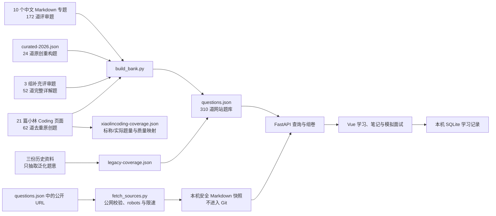

# Interview Bank

一个面向个人学习的 FastAPI + Vue 软件测试面试题库。网站把 10 个 Markdown 专题、2026 公开面经重构题、补充评审题、小林 Coding 测试/测开资料的去重重构结果和三份历史资料的逐题审计记录组织成可检索、可练习、可复盘的小型应用。公开来源可以由合规抓取器保存为本机纯文本快照，网站只在站内阅读快照，不会把学习过程跳转到来源网站。

## 当前内容

- 172 道原有核心详解题；
- 24 道 2026-07 最新趋势原创重构题；
- 52 道独立设计并交叉校验的补充详解题；
- 62 道根据小林 Coding 业务、自动化、性能与测开基础资料去重后新增的详解题；
- 共 310 道可筛选、可查看详细答案的题；
- 两份历史大纲和一份旧 HTML，共 495 条逐项审计记录：40 条强语义匹配，455 条等待人工复核；
- 21 篇小林 Coding 页面全部进入覆盖清单，共核对 672,610 个正文字符；站内标称 1,143 题与当前可见 1,111 题分开记录；
- 来源目录共 100 条，其中 98 条带公开 URL；62 道小林新增题均至少有一个独立标准、官方文档或方法原始来源核验；
- 3 道与核心题相近的 Java 专项深化题明确记录关联题和保留理由，并在题卡中展示；
- 10 个能力模块；
- 快速、标准、全流程、自动化、AI 测试 5 套模拟面试模板；
- 题库支持按岗位能力筛选，模拟面试会按软件测试、自动化、测试开发、AI 测试或性能测试岗位真实筛题；
- 收藏、学习状态、自评分数和笔记的本地 SQLite 持久化；
- 收藏和错题支持跨服务端分页筛选，取消标记后当前结果即时更新；
- 答案中的表格、列表、引用和代码块安全渲染；解释、追问、误区与来源图片按层级折叠；
- 固定随机种子组卷，便于复盘同一套题。

历史 HTML 答案不会直接进入网站。构建器只提取泛化后的问题意图；只有强语义匹配才关联现行答案，低置信候选不会计入覆盖或进入搜索。补充评审题和小林 Coding 内容均按模块去重、改写，并用标准或官方资料核对技术事实。

## 一键启动

要求：

- Python 3.11 或更高版本；
- Node.js 20.19+ 或 22.12+；
- macOS、Linux 或 Windows WSL/Git Bash。

在仓库根目录执行：

```bash
bash apps/interview-bank/scripts/setup.sh
apps/interview-bank/backend/.venv/bin/python \
  apps/interview-bank/scripts/fetch_sources.py
bash apps/interview-bank/scripts/start.sh
```

打开：

- 学习网站：`http://127.0.0.1:8000`
- API 文档：`http://127.0.0.1:8000/api/docs`
- 健康检查：`http://127.0.0.1:8000/api/v1/health`

`fetch_sources.py` 会把题库登记的公开 HTTP/HTTPS 来源转换为本机 Markdown 快照，并下载正文中通过安全校验的 PNG、JPEG、WebP、GIF 图片；`start.sh` 会重新构建题库、编译 Vue，并由 FastAPI 在 `127.0.0.1:8000` 提供前后端。按 `Ctrl+C` 停止。若暂时不抓取，也可以启动网站，但来源抽屉只会显示“本地快照尚不可读”，不会回退为外链。

所有启动目录、脚本和工程文件使用英文路径，便于 Python、Node、Docker 与 CI 运行；学习文档仍使用中文文件名。

## 同步公开来源到本机

完整同步：

```bash
apps/interview-bank/backend/.venv/bin/python \
  apps/interview-bank/scripts/fetch_sources.py
```

只同步某一来源，或强制刷新已经成功的快照：

```bash
apps/interview-bank/backend/.venv/bin/python \
  apps/interview-bank/scripts/fetch_sources.py \
  --source-id xiaolincoding-business-testing

apps/interview-bank/backend/.venv/bin/python \
  apps/interview-bank/scripts/fetch_sources.py --refresh
```

抓取器只读取 `questions.json` 已登记的公开 URL，不读取浏览器 Cookie、公司代理、登录态或密钥，不处理验证码，也不绕过访问控制。它会检查公网地址和 `robots.txt`，按主机限速，限制重试、重定向、响应类型、图片数量与文件大小，并把正文 HTML 转成不含脚本和可点击外链的 Markdown。SVG 可能包含脚本或外部引用，因此不会保存；失败图片会留下明确状态，不会降级为远程图片。受登录、验证码、robots 或站点限流约束的来源同样会记录明确状态。

快照保存在 `data/source-snapshots/`，FastAPI 会在快照清单变化后自动重新载入，通常不需要重启。

## 导入已授权浏览器中的页面

登录后才能查看的个人资料不能交给公开抓取器绕过访问控制。若资料所有者已经明确授权，可以在已登录浏览器中读取页面**可见正文**，再用白名单导入器写入本地快照。导出文件只允许正文、标题、登记 URL、时间和图片文件引用；Cookie、请求头、令牌、绝对路径、内网地址与未知字段会被拒绝。

```bash
apps/interview-bank/backend/.venv/bin/python \
  apps/interview-bank/scripts/import_browser_snapshots.py \
  --input /absolute/path/browser-export.json
```

最小输入结构：

```json
{
  "items": [
    {
      "source_id": "questions.json 中已登记的 ID",
      "original_url": "必须与登记 URL 完全一致",
      "title": "页面标题",
      "content_format": "markdown",
      "content": "## 可见正文",
      "captured_at": "2026-07-29T08:00:00+08:00",
      "assets": [
        {
          "asset_id": "diagram-01",
          "original_url": "https://公开图片来源",
          "mime_type": "image/png",
          "alt_text": "图片说明",
          "file_path": "assets/diagram-01.png"
        }
      ]
    }
  ]
}
```

`file_path` 必须位于导出 JSON 所在目录内，也可以改用经过校验的 `base64`。正文通过 `` 或 `{{asset:diagram-01}}` 引用图片。网站只根据服务端清单生成 `/api/v1/sources/{source_id}/assets/{asset_id}` 本地地址，来源 URL 不会被浏览器直接加载。

## 开发模式

终端一：

```bash
cd apps/interview-bank/backend
.venv/bin/uvicorn app.main:app --reload --host 127.0.0.1 --port 8000
```

终端二：

```bash
cd apps/interview-bank/frontend
npm run dev
```

开发页面为 `http://127.0.0.1:5173`。Vite 会把 `/api` 代理到本地 FastAPI。

## 运行检查

```bash
bash apps/interview-bank/scripts/check.sh
```

检查内容包括：

- 10 个 Markdown 模块可完整解析；
- 310 道题结构、ID 和来源有效；
- 310 道题逐题通过答案深度、解释深度、场景、来源、图片、代码围栏与隐私门禁；
- 模块维护说明和公开参考不会被解析进最后一题的答案或误区；
- 21 篇小林 Coding 页面全部有唯一 URL、实际题数、质量备注和题目映射；
- 小林新增题不能只有发现页而缺少独立核验来源，专项深化关系必须指向已存在题目；
- 495 条历史题全部有审计处置；强匹配与待复核分开统计；
- 旧 HTML 答案不进入公开题库；
- 具体公司名、生产数据建议和个人经历措辞不会进入生成数据；
- FastAPI 关键接口、筛选、学习进度和模拟面试通过；
- 来源抓取器的公网地址限制、robots、重定向、正文净化和清单生成通过；
- Vue 类型检查、单元测试和生产构建通过。

只检查题库是否需要重新生成：

```bash
apps/interview-bank/backend/.venv/bin/python \
  apps/interview-bank/scripts/build_bank.py --check
```

重新生成：

```bash
apps/interview-bank/backend/.venv/bin/python \
  apps/interview-bank/scripts/build_bank.py
```

## 内容流



内容真源包括 10 个 Markdown 专题、`curated-2026.json`、补充评审题 JSON，以及小林 Coding 题目的评审 JSON；`questions.json` 是统一生成产物，SQLite 只保存本机学习状态。不要直接编辑生成文件或数据库来修改题目。

## 目录

```text
apps/interview-bank/
├── README.md
├── backend/
│   ├── app/
│   ├── tests/
│   └── pyproject.toml
├── frontend/
│   ├── src/
│   ├── tests/
│   └── package.json
├── data/
│   ├── curated-2026.json
│   ├── supplemental-*-questions.json
│   ├── supplemental-sources.json
│   ├── xiaolincoding-*-questions.json
│   ├── xiaolincoding-sources.json
│   ├── xiaolincoding-coverage.json
│   ├── source-snapshots/
│   │   ├── manifest.example.json
│   │   └── 本机 manifest 与正文（Git 忽略）
│   ├── questions.json
│   ├── 题库逐题质量审计.json
│   └── legacy-coverage.json
└── scripts/
    ├── audit_question_quality.py
    ├── build_bank.py
    ├── fetch_sources.py
    ├── setup.sh
    ├── start.sh
    └── check.sh
```

## 主要 API

| 方法 | 路径 | 用途 |
|---|---|---|
| `GET` | `/api/v1/health` | 服务、题数和历史覆盖状态 |
| `GET` | `/api/v1/meta` | 统计、筛选项和隐私策略 |
| `GET` | `/api/v1/modules` | 10 个模块及题数 |
| `GET` | `/api/v1/questions` | 关键词、模块、岗位能力、难度、题型、来源与标签筛选 |
| `GET` | `/api/v1/questions/{id}` | 完整答案、解释、追问、误区和来源 |
| `GET` | `/api/v1/legacy-coverage` | 查看 495 条历史题的迁移去向 |
| `GET` | `/api/v1/sources` | 公开来源、核对日期和本地快照状态 |
| `GET` | `/api/v1/source-snapshots` | 查看本机快照清单与状态汇总 |
| `GET` | `/api/v1/sources/{id}/snapshot` | 读取指定来源的本机安全 Markdown 正文与图片清单 |
| `GET` | `/api/v1/sources/{id}/assets/{asset_id}` | 读取清单中已校验的本地图片 |
| `GET` | `/api/quality/xiaolincoding-coverage` | 查看 21 篇小林 Coding 页面、题量差异和现行题映射 |
| `GET` | `/api/v1/progress/{learner_id}` | 本地学习进度 |
| `PUT` | `/api/v1/progress/{learner_id}/{question_id}` | 收藏、状态、评分和笔记 |
| `GET` | `/api/v1/interview-templates` | 模拟面试模板 |
| `POST` | `/api/v1/interviews` | 按模板、目标岗位、难度和随机种子组卷 |
| `PUT` | `/api/v1/interviews/{id}/answers/{question_id}` | 保存模拟回答 |
| `PUT` | `/api/v1/interviews/{id}/status` | 完成或放弃模拟面试 |

示例：

```bash
curl 'http://127.0.0.1:8000/api/v1/questions?q=RAG&level=高级&page_size=5'
```

## 学习建议

1. 先按模块浏览题目，不看答案口述两分钟；
2. 用“结论—依据—行动—证据—边界”组织回答；
3. 揭示答案后标记掌握度和错题，记录自己缺少的证据；
4. 使用固定随机种子完成一场模拟；
5. 回到 Demo Shop、社区问答或智能客服合成项目运行对应实验；
6. 用同一个种子重做，比较结构和证据是否改善。

全流程面试官脚本见：

- [全流程模拟真实面试脚本](../../docs/08-求职备考/04-面试题库/14-全流程模拟真实面试脚本.md)
- [2026 最新公开面经趋势与重构题](../../docs/08-求职备考/04-面试题库/13-2026最新公开面经趋势与重构题.md)
- [小林 Coding 测试题库整合与质量审计](../../docs/08-求职备考/04-面试题库/16-小林Coding测试题库整合/README.md)

## 隐私与部署边界

- 默认只监听 `127.0.0.1`；
- 首版没有生产级登录、授权、CSRF、防滥用和备份；
- 不应直接部署到公网；
- 本地 SQLite 位于 `backend/.runtime/`，被 Git 忽略；
- 来源正文位于 `data/source-snapshots/`，只作本机缓存并被 Git 忽略；
- `.env`、密钥、浏览器登录状态和测试报告均不得提交；
- 所有场景中的订单、用户、金额、日志和 Trace 都是合成数据；
- 小红书和牛客只用于发现近期题型，不保存登录令牌，也不复制帖子正文。

若以后需要公网部署，必须先增加认证授权、速率限制、安全响应头、备份恢复和内容管理审核。

## 常见问题

### 页面提示无法连接 API

确认 FastAPI 正在 `127.0.0.1:8000` 运行：

```bash
curl http://127.0.0.1:8000/api/v1/health
```

### 修改 Markdown 后页面没有变化

重新运行构建器，再重启服务：

```bash
apps/interview-bank/backend/.venv/bin/python \
  apps/interview-bank/scripts/build_bank.py
```

### 点击来源后提示本地快照不可读

先同步公开来源；若网站尚未启动，再启动网站：

```bash
apps/interview-bank/backend/.venv/bin/python \
  apps/interview-bank/scripts/fetch_sources.py
bash apps/interview-bank/scripts/start.sh
```

若清单显示 `robots_denied`、`access_limited`、`access_denied` 或 `rate_limited`，表示站点不允许当前合规抓取方式访问。网站会保留本地状态说明，不会绕过限制或跳转外站。

### Node 版本不满足 Vite

使用 Node.js 20.19+ 或 22.12+。Windows 与 macOS 的安装方法见仓库的[测试工具安装知识库](../../docs/00-学习指南/05-测试工具安装与快速使用/README.md)。
