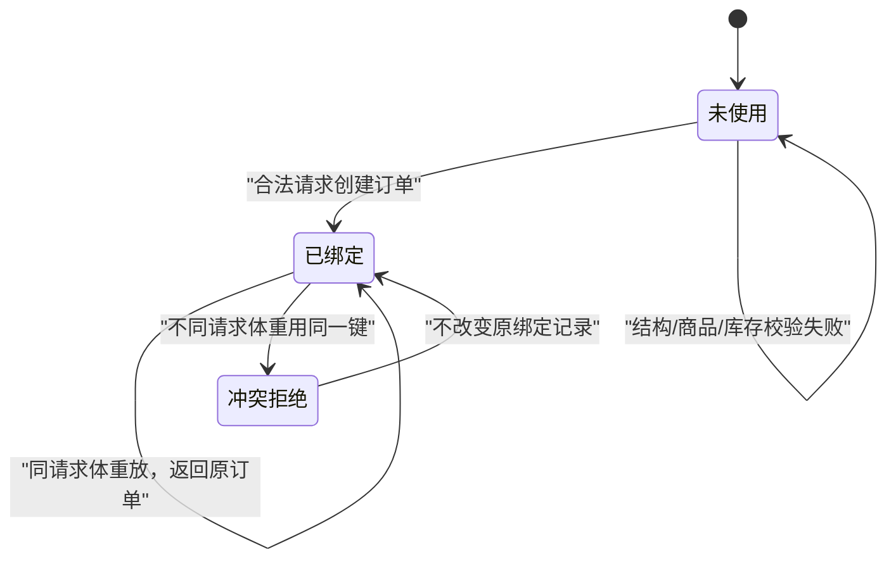

# 测试分析与用例设计

本章把一个虚构需求逐步转换为测试模型、测试数据、用例和可执行验证。重点不是背诵方法名称，而是知道何时使用、它能发现哪类问题、还有什么没有覆盖。

## 学习目标

完成本章后，你应该能够：

- 从需求文本中提取测试条件，而不是直接开始写操作步骤；
- 使用等价类和边界值压缩大量输入；
- 使用判定表处理规则组合，使用状态迁移处理历史和顺序；
- 使用场景法覆盖跨接口业务旅程；
- 为测试设计可信的预期结果，即“测试预言”；
- 把风险、需求、测试条件、用例和结果建立可追踪关系；
- 将关键设计转换为 curl、Python 或 pytest 可执行检查。

## 方法与示例

下面从十条虚构需求开始，依次使用需求分析画布、等价类、边界值、判定表、状态迁移、场景法和组合测试，并把关键用例转换为本地可运行的 Python 与 pytest 验证。

## 一、虚构需求

本章基于 `labs/demo-shop` 当前公开实现整理以下练习需求：

```text
R1  用户可以查询商品列表，并用 keyword 过滤商品名称。
R2  limit 控制列表最多返回条数，合法范围为 1～100，默认 20。
R3  用户可以按商品 ID 查询详情，未知商品返回稳定错误。
R4  创建订单需要 1～20 个订单项。
R5  每项 quantity 范围为 1～10，且不能超过该商品当前库存。
R6  商品必须存在，订单总价等于各项单价乘数量之和。
R7  创建订单必须携带长度为 8～128 的 Idempotency-Key。
R8  同一个键和相同请求体重试时返回同一订单。
R9  同一个键和不同请求体重试时拒绝请求。
R10 已创建的订单可以按 ID 查询。
```

需求还明确声明：

- 数据全部在内存中；
- 服务重启会清空订单和幂等记录；
- 当前不包含登录、支付、取消、发货、库存扣减和多实例部署；
- 本练习不能据此推断生产系统应该如何设计。

## 二、先分析，再写用例

### 需求分析画布

对每个特性至少从九个角度提问：

| 角度 | 示例问题 |
|---|---|
| 角色 | 谁能操作？匿名用户与受信客户端是否不同？ |
| 对象 | 商品、订单项、订单、幂等键分别有哪些字段和约束？ |
| 规则 | 字段范围、库存和幂等冲突谁优先？ |
| 状态 | 幂等键使用前后，系统行为如何变化？ |
| 场景 | 从查询商品到查询订单经过哪些步骤？ |
| 数据 | 金额单位是什么？空值、重复商品项和未知 ID 如何处理？ |
| 依赖 | 服务、内存状态、网络和时钟会怎样影响结果？ |
| 异常 | 超时、重试、重复提交和部分失败怎么处理？ |
| 非功能 | 响应时间、并发、安全和可访问性目标是什么？ |

对本需求评审时会立即发现一些待澄清点：

- `keyword=""` 或只有空格时应该返回全部商品、空结果还是校验失败？
- 一个订单中出现两条相同 `product_id` 时，是合并数量还是分别计算？
- 同键同请求重试返回 `201` 还是更适合其他状态码？当前实现返回 `201`，但接口契约应明确。
- 超过库存时是否应该包含可用库存信息？
- 创建成功是否扣减库存？当前实现不扣减，因此不能用它验证真实超卖控制。
- 幂等键记录保存多久？当前只在进程生命周期内保存。

测试人员的职责是把问题带回评审。没有依据时，在用例中标记“待确认”，不要偷偷选一个答案。

## 三、按问题选择设计方法

| 问题特征 | 首选方法 | 典型问题 |
|---|---|---|
| 输入范围大，但同一范围行为相似 | 等价类 | 合法/非法 quantity、关键字类型 |
| 错误集中在临界点 | 边界值 | 0/1、10/11、100/101 |
| 多个条件共同决定结果 | 判定表 | 幂等键、请求体、商品、库存组合 |
| 结果依赖历史或操作顺序 | 状态迁移 | 幂等键首次使用、同请求重放、冲突重用 |
| 跨多个步骤实现用户目标 | 场景法 | 查商品 → 下单 → 查询 |
| 参数组合多但无法穷举 | 组合测试 | keyword、limit、商品、数量的代表组合 |
| 规则不完整或需要学习系统 | 探索式测试 | 空白关键词、重复商品项、错误可理解性 |

一种用例可能来自多个方法。例如“商品 2 数量 9”既是库存边界，也是字段范围与业务规则的组合。

## 四、等价类

等价类把预期行为相同的输入归成一组，每组选择代表值。划分依据是规则，不是数据看起来相近。

### `limit` 的等价类

| 类别 | 输入 | 预期 |
|---|---|---|
| 缺省 | 不传 | 使用默认值 20 |
| 合法整数 | 1～100 | `200`，最多返回指定条数 |
| 下界外 | 小于 1 | `422` |
| 上界外 | 大于 100 | `422` |
| 类型不符 | `abc` | `422` |

### `keyword` 的等价类

| 类别 | 代表值 | 需要确认或验证 |
|---|---|---|
| 不传 | 无参数 | 返回全部商品 |
| 精确匹配 | `马克杯` | 返回名称包含该文本的商品 |
| 部分匹配 | `星光` | 是否按包含关系过滤 |
| 无匹配 | `不存在` | 返回空列表还是错误 |
| 前后空白 | ` 马克杯 ` | 是否去除空白 |
| 空字符串 | `""` | 与“不传”是否等价 |
| 多语言/符号 | `杯`、emoji | 编码和匹配行为 |
| 超长 | 51 个字符 | `422` |

空字符串和不传是否属于同一等价类，不能只看实现决定，应由产品语义确认。

### `quantity` 要分两层

字段规则是 1～10，库存规则取决于商品。

| 商品 | 库存 | 字段合法且库存足够 | 字段合法但库存不足 | 字段非法 |
|---|---:|---|---|---|
| 商品 1 | 20 | 1～10 | 无 | ≤0、≥11 |
| 商品 2 | 8 | 1～8 | 9～10 | ≤0、≥11 |
| 未知商品 | 未知 | 无 | 无 | 数量仍先经过结构校验，然后验证商品 |

如果只测试商品 1，就永远无法覆盖“字段合法但库存不足”这个重要等价类。

## 五、边界值

常用最小集合是：下界外、下界、下界内、上界内、上界、上界外。不是所有值都必须保留；根据风险和实现选择。

### `limit` 边界表

| 测试值 | 预期状态 | 关键断言 |
|---:|---:|---|
| 0 | 422 | 拒绝下界外 |
| 1 | 200 | 返回数量 ≤1 |
| 2 | 200 | 返回数量 ≤2 |
| 99 | 200 | 当前只有 3 个商品，返回数量 ≤3 |
| 100 | 200 | 接受上界 |
| 101 | 422 | 拒绝上界外 |

### `quantity` 字段边界

使用库存 20 的商品 1 隔离字段规则：

| 测试值 | 预期 |
|---:|---|
| 0 | 422，字段下界外 |
| 1 | 创建成功 |
| 2 | 创建成功 |
| 9 | 创建成功 |
| 10 | 创建成功 |
| 11 | 422，字段上界外 |

### 库存边界

使用库存 8 的商品 2：

| 测试值 | 预期 |
|---:|---|
| 7 | 创建成功 |
| 8 | 创建成功 |
| 9 | 409 `insufficient_stock` |
| 10 | 409 `insufficient_stock` |
| 11 | 422，先被字段规则拒绝 |

这里的 11 证明不同规则可能有处理顺序。断言时不要把所有失败都写成“非 2xx 即通过”。

## 六、判定表

创建订单有结构、请求头、幂等历史、商品和库存等多个条件。不要穷举所有真假组合，先删除不可能或没有业务意义的组合，再保留每条规则的代表。

| 规则 | 结构合法 | 键长度合法 | 键已使用 | 请求体相同 | 商品存在 | 库存足够 | 预期 |
|---|---|---|---|---|---|---|---|
| D1 | 否 | 任意 | 任意 | 任意 | 任意 | 任意 | 422 结构错误 |
| D2 | 是 | 否 | 任意 | 任意 | 任意 | 任意 | 422 请求头错误 |
| D3 | 是 | 是 | 是 | 是 | 已由首次请求确定 | 已由首次请求确定 | 201，返回原订单 ID |
| D4 | 是 | 是 | 是 | 否 | 任意 | 任意 | 409 幂等键冲突 |
| D5 | 是 | 是 | 否 | 不适用 | 否 | 不适用 | 404 商品不存在 |
| D6 | 是 | 是 | 否 | 不适用 | 是 | 否 | 409 库存不足 |
| D7 | 是 | 是 | 否 | 不适用 | 是 | 是 | 201，创建新订单 |

判定表评审问题：

- D4 中如果新请求还包含未知商品，幂等冲突和商品不存在哪个优先？
- 同键同请求重试是否应该重新校验当前库存？
- D3 返回原订单时，响应内容是否必须完全一致？
- 多个订单项中前一项合法、后一项非法时是否产生部分订单？

当前实现先由 FastAPI/Pydantic 做结构校验，再进入业务逻辑；业务逻辑先处理已有幂等键，再遍历商品。但课程目标是设计期望，不是把实现顺序抄成需求。

## 七、状态迁移

幂等键的行为依赖历史，适合用状态模型。



需要覆盖的不只是状态，还包括迁移：

| 起始状态 | 事件 | 预期状态 | 关键断言 |
|---|---|---|---|
| 未使用 | 合法首次请求 | 已绑定 | 创建订单，记录请求指纹 |
| 未使用 | 无效请求 | 未使用 | 修正后可使用同一键成功创建 |
| 已绑定 | 同请求体重放 | 已绑定 | ID 与内容保持一致，不创建第二单 |
| 已绑定 | 不同请求体重放 | 已绑定 | 返回 409，原订单仍可查询 |

最后一条很容易漏测：验证冲突响应后，还要查询原订单，证明失败请求没有破坏已有状态。

## 八、场景法

场景法从用户目标出发串联步骤，同时保留替代和异常路径。

### 主成功场景

```text
查询商品列表
→ 选择库存充足的商品
→ 使用新幂等键创建订单
→ 校验总价和状态
→ 按订单 ID 查询
→ 查询结果与创建结果一致
```

### 替代场景

- 关键词无匹配，用户更换关键词；
- 选择数量超过库存，系统拒绝且不创建订单；
- 创建响应丢失，客户端使用同一幂等键重试，得到原订单；
- 客户端错误地用旧键提交不同内容，系统拒绝；
- 查询未知订单，返回稳定 `404`。

### 不适合放到 UI 的场景

数量 0～11、键长度 7/8/128/129、未知商品和各种请求体组合应主要在 API 层验证。UI 只保留一条购买成功和一条对用户重要的失败路径。

## 九、组合测试

当参数很多时，全组合会迅速膨胀。例如：

- keyword：不传 / 匹配 / 不匹配；
- limit：1 / 100；
- 商品：存在 / 不存在；
- quantity：合法 / 库存不足。

理论全组合是 `3 × 2 × 2 × 2 = 24`。但不存在商品时 quantity 的库存分类没有意义；创建订单又不使用 keyword/limit。先按接口边界拆分，再在每个接口内部做组合，通常比盲目 pairwise 更合理。

可以用以下最小组合练习：

| 用例 | keyword | limit | 预期 |
|---|---|---:|---|
| C1 | 不传 | 1 | 返回最多 1 条 |
| C2 | 匹配 | 100 | 只返回匹配商品 |
| C3 | 不匹配 | 1 | 空列表 |
| C4 | 前后空白 | 100 | 按确认后的空白规则 |
| C5 | 超长 | 1 | 422 |

组合算法不能替代业务建模。先排除无意义组合，再决定是否使用 pairwise 工具。

## 十、测试预言与断言

测试预言回答“为什么这个结果是对的”。常见来源：

1. **明确契约**：字段范围、状态码、JSON Schema。
2. **独立计算**：总价由测试侧根据单价和数量重新计算。
3. **不变量**：订单 ID 一旦创建不应因查询而改变。
4. **变形关系**：相同幂等键和相同请求应返回同一订单。
5. **交叉来源**：创建响应与查询响应一致。
6. **人工判断**：错误信息是否可理解、页面反馈是否清晰。

不可靠断言示例：

```python
assert response.status_code != 500
```

它会让 `404`、`409`、`422` 都“通过”。更可信的断言：

```python
assert response.status_code == 409
assert response.json() == {"detail": "insufficient_stock"}
```

总价断言应独立计算：

```python
expected_total = sum(
    item["quantity"] * item["unit_price_cents"]
    for item in order["items"]
)
assert order["total_cents"] == expected_total
```

不要在测试里调用生产代码的同一个总价函数，否则同一错误可能同时出现在实现和测试中。

## 十一、测试用例模板

```markdown
# TC-ORD-001 同键同请求重试返回原订单

- 关联需求：R7、R8
- 关联风险：重复订单
- 优先级：P0
- 测试层级：API
- 前置条件：服务已启动；幂等键未使用
- 测试数据：
  - key: synthetic-order-0001
  - product_id: 1
  - quantity: 2
- 步骤：
  1. 用上述键和请求体创建订单。
  2. 保存状态码、订单 ID、总价和响应体。
  3. 原样重发。
  4. 查询返回的订单 ID。
- 预期：
  - 两次均返回当前契约规定的成功状态；
  - 两次订单 ID 和响应内容一致；
  - 查询只得到该订单；
  - 未产生第二个订单。
- 证据：请求摘要、状态码、已检查响应、查询结果
- 清理：重启本地服务或使用唯一键隔离
```

结构化字段比长篇步骤更容易审查和转成自动化。

### 最小用例集

| ID | 来源方法 | 场景 | 预期 |
|---|---|---|---|
| TC-PROD-001 | 场景 | 默认查询商品 | 200、非空、结构正确 |
| TC-PROD-002 | 等价类 | 匹配关键词 | 只返回名称包含关键词的商品 |
| TC-PROD-003 | 等价类 | 无匹配关键词 | 200、空列表 |
| TC-PROD-004 | 边界 | limit=0/1/100/101 | 分别 422/200/200/422 |
| TC-PROD-005 | 等价类 | 未知商品 ID | 404、稳定错误码 |
| TC-ORD-001 | 场景 | 创建并查询 | 201、金额正确、查询一致 |
| TC-ORD-002 | 边界 | quantity=0/1/10/11 | 422/成功/成功/422 |
| TC-ORD-003 | 库存边界 | 商品 2 数量 8/9 | 成功/409 |
| TC-ORD-004 | 判定表 | 未知商品 | 404、无订单 |
| TC-ORD-005 | 状态迁移 | 同键同请求重放 | 原订单 ID |
| TC-ORD-006 | 状态迁移 | 同键不同请求 | 409，原订单不变 |
| TC-ORD-007 | 边界 | 键长度 7/8/128/129 | 422/合法/合法/422 |
| TC-ORD-008 | 判定表 | 缺少请求头 | 422 |
| TC-ORD-009 | 探索 | 重复商品项 | 记录观察并澄清规则 |

## 十二、可执行示例

### 启动服务

```bash
cd labs/demo-shop
source .venv/bin/activate
uvicorn app.商城服务:app --host 127.0.0.1 --port 8000
```

### 用 Python 验证主场景和幂等

另开终端，在 `labs/demo-shop` 中执行：

```bash
source .venv/bin/activate
python - <<'PY'
import requests

base_url = "http://127.0.0.1:8000"
key = "design-example-0001"
payload = {"items": [{"product_id": 1, "quantity": 2}]}

first = requests.post(
    f"{base_url}/api/orders",
    headers={"Idempotency-Key": key},
    json=payload,
    timeout=3,
)
first.raise_for_status()
order = first.json()

expected_total = sum(
    item["quantity"] * item["unit_price_cents"]
    for item in order["items"]
)
assert order["total_cents"] == expected_total

second = requests.post(
    f"{base_url}/api/orders",
    headers={"Idempotency-Key": key},
    json=payload,
    timeout=3,
)
assert second.status_code == 201
assert second.json() == order

query = requests.get(
    f"{base_url}/api/orders/{order['id']}",
    timeout=3,
)
assert query.status_code == 200
assert query.json() == order

conflict = requests.post(
    f"{base_url}/api/orders",
    headers={"Idempotency-Key": key},
    json={"items": [{"product_id": 1, "quantity": 3}]},
    timeout=3,
)
assert conflict.status_code == 409
assert conflict.json()["detail"] == (
    "idempotency_key_reused_with_different_payload"
)

print("主场景、幂等重放和冲突验证通过")
PY
```

重复执行整个片段时会因为固定键已绑定而受之前状态影响。练习时可以更换键，或重启本地服务。自动化测试应生成唯一键并显式验证需要共享的状态。

### 运行仓库已有回归

```bash
pytest tests/api -q
```

主动把 `tests/api/测试_订单接口.py` 中一个期望值改错，观察 pytest 失败是否能明确指出预期与实际；完成后恢复修改。

## 十三、可追踪性

追踪矩阵帮助发现“需求没有测试”和“测试没有目的”：

| 需求 | 风险 | 测试条件 | 用例 | 结果 |
|---|---|---|---|---|
| R6 总价 | 金额错误 | 单项/多项独立计算 | TC-ORD-001 | 待执行 |
| R8 同键同请求 | 重复订单 | 首次、重放、查询 | TC-ORD-005 | 待执行 |
| R9 同键不同请求 | 状态污染 | 冲突后查询原订单 | TC-ORD-006 | 待执行 |

追踪不是为了制造表格。每次需求变化时，用它快速找到受影响风险和测试。

## 常见误区

### 误区 1：每种方法各写十条，互相不关联

设计方法是发现测试条件的工具。最终应围绕风险合并重复用例，而不是为了数量保留同义用例。

### 误区 2：边界只测最小和最大

至少还要考虑边界外，必要时考虑边界内。对于 1～10，只测 1 和 10 无法发现 0、11 被错误接受。

### 误区 3：判定表包含所有数学组合

不可达、无意义和被前置校验覆盖的组合应标注或删除。表格的目标是澄清规则，不是制造指数级用例。

### 误区 4：状态测试只验证最终页面

还要验证迁移、副作用和原状态是否被破坏。例如幂等冲突后应查询原订单。

### 误区 5：预期直接复制实现

如果测试和实现使用同一逻辑，可能一起犯错。优先使用公开契约、独立计算和不变量。

### 误区 6：所有错误只断言 4xx

`404`、`409` 和 `422` 代表不同责任和恢复方式。应验证精确状态及稳定业务错误。

### 误区 7：把探索式测试当成无计划点击

探索需要 charter、时间盒、观察、证据和下一步。

## 练习

### 练习 1：完成边界实现

为 `limit`、`quantity`、库存和幂等键长度分别写 pytest 参数化用例。要求：

- 每组数据标注来自哪个边界；
- 断言精确状态码；
- 对成功结果验证业务内容；
- 每个会创建订单的用例使用唯一键。

### 练习 2：补全判定表

为“一个订单含两个订单项”增加条件：

- 两个商品是否都存在；
- 每项是否满足库存；
- 是否出现重复商品 ID。

写出最小规则集和仍需产品确认的问题，不要求实现未定义规则。

### 练习 3：状态迁移自动化

实现以下链路：

1. 使用新键创建订单；
2. 同键同请求重放；
3. 同键不同请求得到冲突；
4. 查询原订单；
5. 证明原订单内容未变化。

### 练习 4：测试评审

找另一位学习者评审你的用例，只回答：

- 每条用例关联哪个风险？
- 是否有重复？
- 预期依据是什么？
- 失败后能否定位是哪条规则？
- 哪些风险仍未覆盖？

根据反馈删除至少一条低价值重复用例，补充至少一条真正的缺口。

### 练习 5：探索空白关键词

使用“不传、空字符串、一个空格、前后空格、51 字符”探索关键词行为。输出：

- 当前观察；
- 你认为需要澄清的产品规则；
- 在规则确认前，哪些应做自动化，哪些不应固化。

## 验收标准

- [ ] 能从十条虚构需求中提取对象、规则、状态、场景、数据和异常；
- [ ] 等价类没有把业务行为不同的输入错误合并；
- [ ] 边界用例包含边界外，并区分字段上限和库存上限；
- [ ] 判定表覆盖结构、请求头、幂等历史、商品和库存的主要规则；
- [ ] 状态迁移验证了冲突后的原状态，而不只看一次响应；
- [ ] 主场景能通过 curl、Python 或 pytest 在本地重复执行；
- [ ] 关键断言使用契约、独立计算、不变量或交叉查询作为预言；
- [ ] 追踪矩阵能从需求定位到风险、用例和结果；
- [ ] 能明确指出至少三个当前范围外的风险；
- [ ] 所有需求、数据和证据均来自 `demo-shop` 或从零生成的合成内容。

## 公开参考

- [ISTQB Certified Tester Foundation Level](https://www.istqb.org/certifications/certified-tester-foundation-level)
- [RFC 9110: HTTP Semantics](https://www.rfc-editor.org/rfc/rfc9110)
- [pytest 参数化文档](https://docs.pytest.org/en/stable/how-to/parametrize.html)
