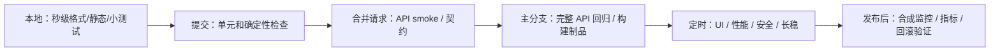

# CI/CD、测试分层与质量门禁

CI/CD 的价值不是“自动跑一次测试”，而是把质量反馈放到正确时机：便宜、确定的检查尽早运行；慢、依赖复杂环境的检查在合适阶段运行；任何失败都能被诊断、归属和处理。

本章只使用公开的 GitHub Actions 语法和仓库内虚构应用 `labs/demo-shop`。示例不需要公司仓库、私有镜像、内部流水线或真实凭据。

## 学习目标

完成本章后，你应该能够：

- 按反馈速度、风险和成本设计分层流水线；
- 区分“硬门禁”“质量信号”和“隔离中的不稳定测试”；
- 让测试通过退出码真正阻止不合格变更，而不只是生成报告；
- 在 CI 中可靠启动服务、等待就绪、执行测试并保存最小诊断证据；
- 为 flaky test、失败分诊、制品、缓存和超时建立治理规则；
- 解释 GitHub Actions、Jenkins 和 GitLab CI 之间可迁移的概念；
- 在不泄露密钥、请求头、公司数据和内部地址的前提下发布公开作品。

## 方法与示例

本章先按反馈速度和风险划分流水线，再定义硬门禁、质量信号和临时隔离，随后把 `demo-shop` 的确定性测试、API smoke、UI 和性能检查落成可执行命令与 GitHub Actions 示例。

## 一、CI/CD 和质量门禁分别解决什么

### 持续集成（CI）

开发者频繁合并小变更，每次变更都经过自动构建和快速验证。关键不是服务器名字，而是：

- 变更小而可审查；
- 检查可重复；
- 失败尽快反馈；
- 主分支保持可用；
- 失败有明确责任人和证据。

### 持续交付 / 部署（CD）

- **持续交付**：任何通过验证的版本都具备发布条件，但是否发布可以人工决定。
- **持续部署**：通过门禁后自动进入生产。

学习项目不需要真的部署生产环境，但应能生成一个可追踪、可复现的候选版本。

### 质量门禁

门禁是一条可执行的决策规则：

```text
输入：某个明确版本的代码、依赖、配置和测试数据
检查：与当前风险匹配的自动化与人工证据
输出：通过 / 阻止 / 需要授权例外
```

门禁不是“测试团队同意上线”的口头流程，也不是一张无人处理的报告。

## 二、先设计反馈层级



推荐分层：

| 阶段 | 目标 | 适合的检查 | 典型时间目标 | 失败处理 |
|---|---|---|---:|---|
| 本地 | 在提交前发现低成本错误 | 格式、类型、小范围测试 | 秒级～2 分钟 | 开发者立即修复 |
| 提交 / PR | 阻止确定性回归 | 单元、API smoke、契约、敏感信息扫描 | 5～10 分钟 | 阻止合并 |
| 主分支 | 验证集成并生成候选制品 | 完整 API、构建、依赖检查 | 10～30 分钟 | 标红主分支并指定负责人 |
| 定时 | 运行慢或噪声更高的专项 | UI、多浏览器、性能、安全、长稳 | 按专项确定 | 产生告警、缺陷和趋势 |
| 发布 | 验证候选版本和回退能力 | 核心旅程、配置、迁移、烟雾 | 尽量短 | 阻止发布或回滚 |
| 发布后 | 发现真实环境风险 | 合成监控、SLI、日志/指标/追踪 | 持续 | 告警、降级或回滚 |

“时间目标”不是统一标准。重点是 PR 反馈不能因为一个 40 分钟 UI 套件而失去价值。

## 三、给测试正确分类

### Smoke

少量、稳定、覆盖系统是否基本可用的检查。例如：

- `/health` 可用；
- 商品列表契约正确；
- 创建并查询一个订单；
- 同一幂等键重放不创建新订单。

Smoke 不等于“随便挑几条”，它应覆盖最重要且最容易被变更破坏的能力。

### Regression

覆盖已知规则和历史风险，数量更大。可以在主分支或合并请求中按变更范围选择运行。

### UI

只保留用户可见、跨层、高价值旅程。大量边界和规则组合放在 API 或单元层。

### Performance

需要稳定环境、明确负载和服务端监控。PR 中可以运行极小的脚本正确性检查，但不能用共享 runner 的结果判断生产容量。

### AI evaluation

确定性、小数据集的规则检查可以进 PR；涉及外部模型、费用、限流和非确定性的评测应在受控定时任务运行，并设置预算与人工复核。

## 四、门禁策略

### 三种处理方式

| 类型 | 含义 | 示例 |
|---|---|---|
| 硬门禁 | 失败立即阻止合并或发布 | 编译失败、P0 API smoke 失败、敏感信息扫描命中 |
| 质量信号 | 记录趋势并要求处理，但当前不自动阻止 | 低风险覆盖下降、尚未校准的 AI 评分波动 |
| 临时隔离 | 已知 flaky 测试从硬门禁移出，但仍执行、告警且有修复期限 | 第三方沙箱偶发超时的 UI 用例 |

隔离不是删除，也不是无限重试直到绿色。每个隔离项必须包含：

- 原因和最小失败证据；
- 所有者；
- 创建日期和到期日期；
- 修复或删除条件；
- 仍然覆盖该风险的临时控制。

### 示例门禁表

| 门禁 | 规则 | 原因 | 例外 |
|---|---|---|---|
| API smoke | 100% 通过 | 数量小、确定性强、覆盖核心旅程 | 无自动例外 |
| P0/P1 缺陷 | 没有未经接受的开放项 | 高业务影响 | 需要记录风险接受人和期限 |
| flaky 比例 | 新增 flaky 为 0；已有隔离项不得过期 | 防止测试债务增长 | 有负责人和截止日期 |
| UI 关键旅程 | 发布候选版本全部通过 | 跨层用户价值 | 环境故障需有独立证据 |
| 性能阈值 | 在固定环境满足版本化阈值 | 防止明显退化 | 不能用共享 runner 结果宣称容量 |
| 安全与敏感信息 | 高风险发现和凭据泄漏为 0 | 公开仓库底线 | 凭据命中先吊销再处理 |

不要追求一个万能分数。覆盖率、通过率和缺陷数的语义不同，不能简单相加。

## 五、本地先跑通

在仓库根目录执行：

```bash
cd labs/demo-shop
python3 -m venv .venv
source .venv/bin/activate
python -m pip install -e '.[test]'
pytest tests/ai -q
```

启动服务：

```bash
uvicorn app.商城服务:app --host 127.0.0.1 --port 8000
```

另开终端：

```bash
cd labs/demo-shop
source .venv/bin/activate
curl --fail --silent http://127.0.0.1:8000/health
pytest tests/api -q
```

先保证本地命令稳定，再放入 CI。流水线不会自动修复顺序依赖、固定端口冲突或未声明依赖。

## 六、可执行 GitHub Actions 示例

下面的工作流可以保存为 `.github/workflows/demo-shop-ci.yml` 进行练习。本文只展示代码，不替你修改工作流。

```yaml
name: demo-shop-ci

on:
  pull_request:
  push:
    branches: [main]

permissions:
  contents: read

concurrency:
  group: demo-shop-${{ github.workflow }}-${{ github.ref }}
  cancel-in-progress: true

jobs:
  deterministic-checks:
    runs-on: ubuntu-latest
    timeout-minutes: 10
    defaults:
      run:
        working-directory: labs/demo-shop

    steps:
      - name: Check out repository
        uses: actions/checkout@v6

      - name: Set up Python
        uses: actions/setup-python@v6
        with:
          python-version: "3.11"
          cache: pip
          cache-dependency-path: labs/demo-shop/pyproject.toml

      - name: Install test dependencies
        run: python -m pip install -e '.[test]'

      - name: Run deterministic AI harness tests
        run: |
          mkdir -p test-results
          pytest tests/ai -q \
            --junitxml=test-results/ai-junit.xml

      - name: Upload deterministic test report
        if: always()
        uses: actions/upload-artifact@v7
        with:
          name: deterministic-test-results
          path: labs/demo-shop/test-results
          if-no-files-found: warn
          retention-days: 7

  api-smoke:
    runs-on: ubuntu-latest
    timeout-minutes: 10
    defaults:
      run:
        working-directory: labs/demo-shop

    steps:
      - name: Check out repository
        uses: actions/checkout@v6

      - name: Set up Python
        uses: actions/setup-python@v6
        with:
          python-version: "3.11"
          cache: pip
          cache-dependency-path: labs/demo-shop/pyproject.toml

      - name: Install test dependencies
        run: python -m pip install -e '.[test]'

      - name: Start service, wait for readiness, and run API tests
        shell: bash
        run: |
          mkdir -p test-results
          uvicorn app.商城服务:app \
            --host 127.0.0.1 \
            --port 8000 \
            > test-results/server.log 2>&1 &
          server_pid=$!
          trap 'kill "$server_pid" 2>/dev/null || true' EXIT

          ready=0
          for attempt in {1..30}; do
            if curl \
              --fail \
              --silent \
              http://127.0.0.1:8000/health \
              > /dev/null; then
              ready=1
              break
            fi
            sleep 1
          done

          if [[ "$ready" -ne 1 ]]; then
            echo "demo-shop did not become ready"
            exit 1
          fi

          pytest tests/api -q \
            --junitxml=test-results/api-junit.xml

      - name: Upload API evidence
        if: always()
        uses: actions/upload-artifact@v7
        with:
          name: api-test-evidence
          path: labs/demo-shop/test-results
          if-no-files-found: error
          retention-days: 7
```

### 为什么这样写

- `permissions: contents: read` 使用最小默认权限；
- `timeout-minutes` 防止死锁任务无限占用 runner；
- `concurrency` 取消同一分支已过时的运行；
- 安装命令和本地一致；
- 服务启动后轮询 `/health`，不使用固定 `sleep 10` 猜测就绪；
- `trap` 确保步骤退出时终止后台进程；
- pytest 非零退出码让门禁真正失败；
- `if: always()` 在测试失败时仍上传日志和 JUnit；
- 制品只保留短期诊断需要的合成数据。

以上 Action 大版本已在 **2026-07-27** 按官方仓库核对：`checkout@v6`、`setup-python@v6`、`upload-artifact@v7`。这些版本使用 Node.js 24；自托管 runner 需要满足官方声明的最低 runner 版本。GitHub 托管 runner 会由平台维护，但仍应在季度核对时复查 Action 发行说明。

在高安全要求项目中，第三方 Action 应固定到审核过的完整提交 SHA，并通过依赖更新流程升级。大版本标签便于教程阅读，但不能替代供应链审查。

## 七、UI、性能和定时任务

### UI 定时任务

安装：

```bash
cd labs/demo-shop
source .venv/bin/activate
python -m pip install -e '.[test,ui]'
python -m playwright install chromium
```

服务启动后执行：

```bash
pytest tests/ui -q \
  --tracing=retain-on-failure \
  --screenshot=only-on-failure
```

在 Linux CI 中，浏览器可能需要系统依赖，可按 Playwright 官方文档使用：

```bash
python -m playwright install --with-deps chromium
```

UI 失败制品只保留 trace、失败截图和必要日志。不要默认录制并长期保存所有视频。

### 性能定时任务

仓库提供 `tests/performance/轻量性能冒烟脚本.js`。安装 k6 后：

```bash
DEMO_BASE_URL=http://127.0.0.1:8000 \
VUS=3 \
DURATION=20s \
k6 run tests/performance/轻量性能冒烟脚本.js
```

脚本包含：

- `http_req_failed < 1%`；
- `p95 < 300ms`；
- 检查通过率 `> 99%`。

k6 达不到阈值时返回非零退出码，可作为受控环境的门禁。共享 CI runner 资源波动大，只适合发现明显退化或验证脚本，不得据此宣称生产容量。

Locust 练习：

```bash
python -m pip install -e '.[performance]'
locust \
  -f tests/performance/用户负载模型.py \
  --host http://127.0.0.1:8000 \
  --headless \
  -u 3 \
  -r 1 \
  -t 20s
```

## 八、失败分诊

流水线失败后按固定顺序处理：

1. **确认版本**：提交 SHA、依赖、配置、测试数据和环境是否与报告一致。
2. **确认失败层**：构建、环境就绪、产品、测试代码、数据、外部依赖还是 runner。
3. **读取最小证据**：失败断言、请求摘要、状态码、相关时间窗口日志。
4. **本地或隔离环境复现**：不要先点“重跑”。
5. **分类并指定所有者**：
   - 产品回归；
   - 测试缺陷；
   - 环境/基础设施；
   - 数据污染；
   - 已知不稳定；
   - 尚未确认。
6. **采取动作**：修复、回滚、隔离、风险接受或补充观测。
7. **保留决策**：为什么允许或阻止合并，何时复查。

分诊记录模板：

```markdown
- 运行 URL / 提交：
- 首次失败时间：
- 失败检查：
- 最小证据：
- 本地复现：
- 分类：
- 影响：
- 所有者：
- 下一步与期限：
- 是否影响门禁：
```

## 九、flaky test 治理

flaky test 是在代码和环境相同的条件下，结果不稳定的测试。常见来源：

- 固定 `sleep`；
- 共享数据、顺序依赖和未清理状态；
- 时间、随机数、时区或并发未控制；
- 第三方服务、网络和限流；
- 脆弱 UI 定位器；
- 超时过紧或环境过载；
- 断言依赖无保证的顺序。

处理流程：

```text
保存首次失败证据
→ 连续和隔离复现
→ 找到不稳定来源
→ 修复产品/测试/环境
→ 必要时带期限隔离
→ 在多次重复和不同顺序下验证修复
```

禁止：

- 全局设置重试 5 次，只展示最后一次；
- 在失败后自动把用例标记通过；
- 直接删除高风险 flaky 用例；
- 没有所有者和到期日的永久隔离。

## 十、指标与决策

### 可以观察的指标

- PR 反馈时间；
- 流水线成功率与失败分类；
- flaky 测试数量、年龄和修复时间；
- 每层测试执行时长；
- 生产缺陷逃逸及对应测试缺口；
- 变更失败率和恢复时间；
- 门禁例外数量、原因和到期情况。

### 不要单独使用的指标

- 用例总数；
- 自动化脚本行数；
- 单次通过率；
- 没有上下文的代码覆盖率；
- 发现缺陷数量。

代码覆盖率可以发现“完全没有执行”的区域，但不能证明断言正确、业务风险已覆盖或系统满足用户目标。

## 十一、Jenkins / GitLab CI 的概念映射

| 通用概念 | GitHub Actions | Jenkins | GitLab CI |
|---|---|---|---|
| 流水线定义 | workflow YAML | Jenkinsfile | `.gitlab-ci.yml` |
| 阶段/任务 | job / step | stage / step | stage / job |
| 执行环境 | runner | agent/node | runner |
| 依赖缓存 | cache Action | stash/cache/plugin | cache |
| 测试制品 | artifact | archiveArtifacts | artifacts |
| 门禁结果 | required check | pipeline/status checks | pipeline/approval |
| 定时任务 | schedule | cron trigger | pipeline schedule |

迁移时先映射这些概念，再转换语法。不要把某个平台插件列表当成 CI/CD 能力。

## 十二、安全和公开边界

- 工作流默认最小权限；
- 不把密钥写入 YAML、测试数据、命令行或日志；
- 来自 fork 的 PR 不应获得高权限密钥；
- 请求和响应日志要删除 Authorization、Cookie 和个人信息；
- `.env` 只保留无秘密的 `环境变量示例.env`；
- 外部 Action、容器镜像和依赖需要版本与来源审查；
- 制品设置最短必要保留期；
- 禁止把公司 runner 地址、内部镜像、生产日志或真实流水线复制到本仓库。

本章示例无需任何密钥。如果练习要求云资源，优先选择无需凭据的本地替代方案。

## 常见误区

### 误区 1：所有测试都放在 PR

慢 UI、长稳和性能会拖慢反馈，并受到共享环境噪声影响。应按风险和反馈时间分层。

### 误区 2：报告生成成功就算门禁成功

如果测试失败但脚本最后返回 0，流水线仍会绿色。必须检查退出码和错误传播。

### 误区 3：启动服务后固定等待若干秒

机器负载变化会导致过早或无谓等待。使用有上限的 readiness 轮询，并在超时时输出日志。

### 误区 4：失败先重跑

重跑可能覆盖第一次失败证据。先保存结果，再判断是否需要复现。

### 误区 5：缓存整个虚拟环境

缓存不当会引入旧依赖和平台差异。优先缓存包下载，并从声明文件重新安装。

### 误区 6：追求始终绿色

可靠的红色比虚假的绿色有价值。目标是快速、可诊断地发现风险。

### 误区 7：把 CI 结果当生产容量结论

共享 runner 的 CPU、网络和邻居负载不可控。性能结论必须说明环境和限制。

## 练习

### 练习 1：建立最小 PR 门禁

根据示例创建工作流，要求：

- AI 确定性测试和 API 测试分成两个 job；
- API job 使用 readiness 轮询；
- 任何测试失败都返回非零退出码；
- 失败时仍上传 JUnit 和服务日志；
- 权限为只读且设置超时。

### 练习 2：主动制造四类失败

分别制造：

1. 产品断言失败；
2. 服务未就绪；
3. 测试数据冲突；
4. 测试代码语法错误。

对每次失败填写分诊模板，确认报告能区分类型。

### 练习 3：治理一个 flaky test

创建一个依赖固定短 `sleep` 的演示 UI 测试，使它偶发失败。然后：

- 保存首次失败证据；
- 用条件等待替代固定等待；
- 连续运行至少 10 次；
- 改变执行顺序；
- 写出修复前后证据。

演示完成后不要把故意 flaky 的版本提交到主线。

### 练习 4：设计门禁政策

为 `demo-shop` 写一页政策：

- PR、主分支、定时和发布阶段分别跑什么；
- 哪些是硬门禁；
- flaky 如何隔离；
- 性能结果适用什么环境；
- 谁能批准例外、记录在哪里、何时到期。

## 验收标准

- [ ] 能解释每层流水线的目标、时间和失败处理；
- [ ] 本地命令与 CI 命令一致，依赖由 `pyproject.toml` 声明；
- [ ] API 测试前使用 readiness 轮询，而不是无上限等待或固定长 sleep；
- [ ] pytest/k6 失败通过非零退出码阻止门禁；
- [ ] 失败时保留 JUnit、最小服务日志和提交信息；
- [ ] 硬门禁、质量信号和隔离测试有不同治理规则；
- [ ] flaky 隔离项有所有者、证据、临时控制和到期日；
- [ ] UI 和性能没有被不加判断地塞入每个 PR；
- [ ] 能把 GitHub Actions 方案映射到 Jenkins 或 GitLab CI；
- [ ] 工作流不含真实密钥、内部地址、公司数据或未经检查的日志。

## 公开参考

- [GitHub Actions 官方文档](https://docs.github.com/actions)
- [GitHub Actions 安全加固](https://docs.github.com/actions/security-for-github-actions/security-guides/security-hardening-for-github-actions)
- [actions/checkout Releases](https://github.com/actions/checkout/releases)
- [actions/setup-python Releases](https://github.com/actions/setup-python/releases)
- [actions/upload-artifact Releases](https://github.com/actions/upload-artifact/releases)
- [pytest 退出码](https://docs.pytest.org/en/stable/reference/exit-codes.html)
- [Playwright CI 文档](https://playwright.dev/python/docs/ci)
- [Grafana k6 Thresholds](https://grafana.com/docs/k6/latest/using-k6/thresholds/)
- [DORA 2025：AI 辅助软件交付](https://dora.dev/research/2025/dora-report/)
