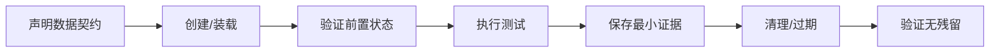

# 测试数据、环境与可观测性

当测试“有时通过、有时失败”时，问题往往不在断言本身，而在三件事：数据是否可控、环境是否可复现、失败是否有足够观测证据。本章把它们作为一个整体治理。

## 学习目标

完成本章后，你应该能够：

- 按测试目的设计最小、可读、可重建的合成数据；
- 选择唯一数据、固定 fixture、数据工厂、事务回滚、清理 API 或临时环境；
- 记录环境版本、配置和依赖，使失败可复现；
- 区分存活、就绪和业务可用，避免用固定等待猜测环境状态；
- 使用日志、指标和追踪建立从症状到假设的诊断链；
- 为 API、UI、性能和 AI 评测定义不同的证据保留策略；
- 对敏感字段、制品、日志和测试数据执行最小化与脱敏。

## 方法与示例

本章使用“代码版本 + 环境 + 数据 + 证据”四元组组织实践：先为 `demo-shop` 设计合成数据和清理策略，再记录环境契约，最后用日志、RED/USE 指标和追踪思路完成故障假设与验证。

## 一、质量证据的四元组

一个测试结果只有同时绑定以下四项才有解释力：

```text
结果 = 代码版本 + 环境版本/配置 + 数据状态 + 观测证据
```

如果报告只有“TC-001 失败”，却不知道运行的是哪个提交、使用哪批数据、服务是否就绪、响应和日志是什么，就无法可靠复现。

## 二、测试数据设计

### 数据不是越像生产越好

好测试数据应满足：

- **最小**：只保留触发规则需要的字段；
- **可读**：名称能表达用途，如 `boundary-stock-8`；
- **可重建**：可以由脚本或 fixture 生成；
- **可隔离**：并行或重复运行不会互相污染；
- **可清理**：知道何时、由谁、如何删除或过期；
- **合规**：不来自公司或生产，不含真实个人和凭据。

生产数据往往包含隐私、历史噪声和未知依赖。测试数据方案需要评估授权、最小化、脱敏有效性和再识别风险。

### 五类常用数据

| 类型 | 用途 | `demo-shop` 示例 |
|---|---|---|
| 基准数据 | 所有测试共享、稳定只读 | 三个内置商品 |
| 场景数据 | 支持一个业务旅程 | 商品 1、数量 2、新幂等键 |
| 边界数据 | 触发临界规则 | quantity 0/1/10/11，商品 2 库存 8/9 |
| 无效/对抗数据 | 验证拒绝和恢复 | 未知商品、过长关键词、重用冲突键 |
| 容量数据 | 性能和规模测试 | 批量生成唯一幂等键与请求，不使用真实用户 |

### 数据矩阵

| 风险 | 前置数据 | 动作数据 | 预期状态 | 清理 |
|---|---|---|---|---|
| 总价错误 | 商品 1 单价 2590 | 数量 2 | 总价 5180 | 使用唯一键；服务重启可清空 |
| 库存边界 | 商品 2 库存 8 | 数量 8/9 | 成功/409 | 每条使用不同键 |
| 幂等重放 | 未使用键 | 相同请求两次 | 同订单 ID | 查询验证后重启或自然丢弃 |
| 幂等冲突 | 已绑定键 | 不同请求体 | 409，原订单不变 | 查询原订单 |
| 未知商品 | 不存在 ID | 创建订单 | 404，无订单 | 无需清理 |

数据矩阵把“准备什么、改变什么、最后留下什么”写清楚，比在用例中硬编码随机值更容易审查。

## 三、固定数据、唯一数据与随机数据

### 固定 fixture

适合：

- 只读参考数据；
- 契约测试；
- 容易理解的边界；
- 需要稳定预期的回归。

风险：

- 多个测试修改同一记录；
- 并行执行冲突；
- 测试顺序成为隐含依赖。

### 每次唯一

`demo-shop` 的创建订单测试使用 UUID 作为幂等键：

```python
from uuid import uuid4

idempotency_key = str(uuid4())
```

适合创建型测试和并行执行。唯一不代表不可追踪；报告中应记录经过检查的合成 ID。

### 有种子的伪随机

适合扩展输入空间和属性测试：

```python
import random

rng = random.Random(20260727)
quantities = [rng.randint(1, 10) for _ in range(20)]
```

报告必须保留种子。没有种子的随机失败很难复现。

### 完全随机

只在明确需要发现未知输入问题时使用，并保存生成参数和最小失败样本。不要用随机性掩盖没有设计等价类和边界值。

## 四、数据生命周期



### 常见隔离与清理策略

| 策略 | 优点 | 局限 | 适用 |
|---|---|---|---|
| 事务回滚 | 快、隔离强 | 不适合跨服务和异步流程 | 数据库集成测试 |
| 唯一命名空间 | 易并行 | 需要过期和清理机制 | API、共享环境 |
| 清理 API | 贴近业务边界 | 清理接口本身需要权限和验证 | 测试环境 |
| 每用例临时资源 | 隔离最好 | 创建成本高 | 容器、临时数据库 |
| 快照恢复 | 重置快 | 快照可能过期，写入需协调 | 大型固定数据集 |
| 服务重启 | 对内存 demo 简单 | 不适合持久化系统 | 本仓库 `demo-shop` |

当前 `demo-shop` 的订单和幂等记录只在内存中：

- 自动化用唯一键避免互相污染；
- 需要完全重置时重启服务；
- 不得把这一策略直接复制到真实持久化系统。

### 清理失败也是测试失败

如果测试通过但留下大量账号、订单或资源，下轮运行会受污染。清理步骤应：

- 使用本轮创建的明确 ID；
- 幂等；
- 即使主断言失败也执行；
- 失败时报告残留对象；
- 避免模糊通配和大范围删除。

## 五、测试环境

### 环境契约

每个环境至少记录：

```markdown
- 代码提交：
- Python / Node / 浏览器版本：
- 依赖安装方式：
- 服务启动命令：
- 基础 URL：
- 端口和依赖：
- 配置来源：
- 数据初始化：
- 健康与就绪检查：
- 重置方式：
- 已知差异与限制：
```

不要直接输出全部环境变量；其中可能含密钥。只记录允许公开的键。

### `demo-shop` 环境指纹

在 `labs/demo-shop` 中执行：

```bash
git rev-parse HEAD
python --version
python -m pip show fastapi uvicorn pytest requests
printf 'DEMO_BASE_URL=%s\n' \
  "${DEMO_BASE_URL:-http://127.0.0.1:8000}"
```

不要用 `env` 或 `printenv` 把所有变量写入公开日志。

仓库的 `环境变量示例.env` 只包含：

```dotenv
DEMO_BASE_URL=http://127.0.0.1:8000
```

真实 `.env` 已被 `.gitignore` 排除。示例文件中也不能放占位真实密钥。

### 环境矩阵

| 环境 | 目的 | 数据 | 允许结论 | 不允许结论 |
|---|---|---|---|---|
| 本地 | 开发、调试、学习 | 内置/合成 | 功能和脚本机制 | 团队共享稳定性、生产容量 |
| CI 临时环境 | 确定性回归 | 每次新建/唯一 | 当前提交是否通过门禁 | 长期趋势和真实并发 |
| 共享测试环境 | 跨服务集成 | 命名空间隔离 | 集成兼容与流程 | 不受其他团队影响的性能 |
| 专用性能环境 | 容量和退化 | 可重复批量合成 | 在该硬件与配置下的指标 | 未换算的生产容量 |
| 生产 | 真实体验和 SLI | 真实但受控 | 实际运行表现 | 随意造数或破坏性测试 |

本仓库只要求本地和公开 CI 环境。

## 六、存活、就绪和业务可用

- **Liveness**：进程是否活着；失败时通常需要重启。
- **Readiness**：是否已经准备好接收流量；依赖未连接时可以暂时不就绪。
- **业务可用**：关键用户能力是否真的成功。

`/health` 当前只返回 `{"status":"ok"}`，适合最小就绪练习，但不能证明下单功能完整。

可靠启动脚本：

```bash
cd labs/demo-shop
source .venv/bin/activate
mkdir -p test-results

uvicorn app.商城服务:app \
  --host 127.0.0.1 \
  --port 8000 \
  > test-results/server.log 2>&1 &
server_pid=$!
trap 'kill "$server_pid" 2>/dev/null || true' EXIT

ready=0
for attempt in {1..30}; do
  if curl \
    --fail \
    --silent \
    http://127.0.0.1:8000/health \
    > /dev/null; then
    ready=1
    break
  fi
  sleep 1
done

if [[ "$ready" -ne 1 ]]; then
  echo "service was not ready"
  tail -n 50 test-results/server.log
  exit 1
fi

pytest tests/api -q
```

这个脚本有上限、失败证据和退出码，比固定等待 10 秒更可靠。

## 七、环境漂移

环境漂移包括：

- 依赖版本不同；
- 配置、特性开关或迁移状态不同；
- 测试数据被其他任务修改；
- 浏览器、时区、区域设置不同；
- 容器镜像标签指向了新内容；
- 外部服务版本或限流策略变化。

治理方法：

- 依赖和镜像版本化；
- 配置使用明确环境变量和安全配置中心，不硬编码；
- CI 从声明文件重建环境；
- 记录提交、依赖和配置摘要；
- 每次测试先验证前置状态；
- 为共享环境建立所有者、变更记录和维护窗口；
- 性能测试冻结硬件、版本、数据和背景负载。

“在我电脑上能跑”只证明一个未记录的环境组合成功。

## 八、可观测性基础

可观测性不是安装一个仪表盘，而是能从系统外部输出推断内部发生了什么，并用证据缩小假设。

### 日志

回答离散事件：

- 哪个版本、哪个请求、哪个业务动作；
- 何时开始、何时结束；
- 状态和错误类别；
- 关联 ID；
- 不包含秘密和不必要的完整请求体。

建议的虚构结构化日志：

```json
{
  "timestamp": "2026-07-27T08:00:00Z",
  "level": "INFO",
  "event": "order_create",
  "request_id": "synthetic-req-0001",
  "status_code": 201,
  "duration_ms": 18,
  "item_count": 1
}
```

不要记录：

- Authorization、Cookie、Session、密钥；
- 完整个人资料；
- 未经最小化的请求和响应；
- 内部堆栈、路径和配置到公开制品；
- 公司域名、客户 ID 或生产订单。

### 指标

服务请求常用 RED：

- **Rate**：请求率；
- **Errors**：错误率和错误类型；
- **Duration**：响应时间分布。

资源常用 USE：

- **Utilization**：CPU、内存、磁盘、连接池利用率；
- **Saturation**：队列、等待、限流、线程池耗尽；
- **Errors**：系统和设备错误。

业务指标示例：

- 创建订单成功率；
- 幂等冲突率；
- 库存不足率；
- 查询后找不到刚创建订单的比例。

不要只看平均响应时间。p95/p99、错误率和饱和度更容易发现尾部问题。

### 追踪

分布式追踪记录一次请求跨服务、数据库、缓存和队列的路径。关键概念：

- trace ID：一次端到端请求；
- span ID：一个具体操作；
- parent：调用关系；
- duration/status/attributes：耗时、结果和有限标签。

W3C `traceparent` 是跨组件传播追踪上下文的公开标准。当前 `demo-shop` 没有接入追踪；把它作为扩展练习，不要在文档中假装已有能力。

### 三者如何配合

```text
指标发现：POST /api/orders 的 p95 上升
    ↓
追踪定位：多数耗时集中在库存依赖
    ↓
日志解释：库存调用超时并触发重试
    ↓
新假设：连接池饱和或依赖延迟
    ↓
用资源指标和受控实验验证
```

单独搜索一条 `ERROR` 日志，不能证明它造成了整体性能问题。

## 九、建立最小诊断证据

### HTTP 时间和状态

```bash
curl \
  --silent \
  --show-error \
  --output /dev/null \
  --write-out \
  'status=%{http_code} total=%{time_total}s size=%{size_download}\n' \
  http://127.0.0.1:8000/api/products
```

重复观察：

```bash
for run in {1..5}; do
  curl \
    --silent \
    --show-error \
    --output /dev/null \
    --write-out \
    "run=${run} status=%{http_code} total=%{time_total}s\n" \
    http://127.0.0.1:8000/api/products
done
```

五次本地请求不能形成容量结论，只能验证请求和测量机制。

### 进程与端口

```bash
lsof -i :8000
ps aux | rg 'uvicorn|demo-shop'
```

Linux 还可以根据环境使用：

```bash
ss -ltnp
```

### 服务日志

```bash
tail -n 50 test-results/server.log
rg -n 'ERROR|Traceback|5[0-9]{2}' test-results/server.log
```

先限定时间和请求，再扩大搜索范围。不要把未经检查的整份日志上传为公开制品。

## 十、从失败到假设

| 观察 | 只能说明 | 下一步证据 |
|---|---|---|
| 客户端超时 | 在超时上限内没有得到响应 | 服务是否收到请求、服务耗时、网络和连接状态 |
| 5xx 增加 | 服务端或网关失败 | 错误类别、对应 trace、部署和依赖变化 |
| p95 上升但 CPU 低 | 尾部请求变慢，CPU 不是明显瓶颈 | I/O、锁、队列、连接池、外部依赖 |
| CPU 高且吞吐不升 | 可能达到计算或调度瓶颈 | profile、运行队列、GC、热点 |
| API 通过但 UI 失败 | 跨层、页面或测试问题 | 浏览器 console/network、trace、定位器 |
| 单独运行通过、并行失败 | 共享数据、端口或资源竞争 | 唯一 ID、执行顺序、资源饱和 |

使用“可证伪假设”：

```markdown
假设：并行测试复用了同一个幂等键，因此部分请求收到 409。
预测：给每个测试唯一键后，409 消失；服务资源指标不发生明显变化。
实验：固定代码和环境，只替换数据生成策略，重复 20 次并行运行。
结果：
结论：
```

不要写“应该是网络问题”后停止。

## 十一、测试失败证据包

每个失败保留最小证据：

```text
提交 SHA
环境指纹（允许公开的版本和配置）
测试 ID 与风险
合成数据 ID / 随机种子
请求方法、路径、状态码和耗时
已最小化、已脱敏的响应
对应时间窗口日志
必要的 trace / screenshot
初步分类与下一步
```

证据不是越多越好。HAR、视频、数据库导出和完整日志容易包含敏感内容，只有在必要且检查后才保留。这个公开仓库默认忽略 `*.har`、`*.pcap`、`*.log`、报表和测试结果目录。

## 十二、API、UI、性能和 AI 的不同证据

| 类型 | 最小证据 | 避免 |
|---|---|---|
| API | 请求摘要、状态、关键响应、服务日志时间 | 完整 Token/Cookie、所有响应字段 |
| UI | 失败断言、trace、必要截图、console/network 摘要 | 每次全程录像、真实用户页面 |
| 性能 | 负载模型、客户端指标、服务指标、版本和时间线 | 只有一张平均响应时间图 |
| AI 评测 | 数据集版本、模型/提示词版本、评分器、失败样本和成本 | 上传内部知识库、把模型裁判当绝对真相 |

## 十三、并行测试

并行前检查：

- 是否使用固定账号、键、订单或文件名；
- 是否共享端口和工作目录；
- 清理是否会删掉其他测试的数据；
- 断言是否依赖列表顺序或全局计数；
- 服务和依赖是否能承受并发；
- 报告路径是否唯一。

`demo-shop` API 测试用 `uuid4()` 创建唯一幂等键，降低并行冲突。它仍共享内存服务，因此涉及全局订单数量或重启的测试不能随意并行。

## 十四、建议的运行手册

```markdown
# demo-shop 测试环境运行手册

## 启动
- 依赖安装：
- 启动命令：
- 就绪检查：

## 数据
- 基准商品：
- 唯一数据策略：
- 重置方式：

## 观测
- 日志位置：
- HTTP 测量命令：
- 当前没有的能力：结构化日志 / 指标 / 追踪

## 常见故障
- 8000 端口占用：
- 服务未就绪：
- 固定幂等键冲突：

## 安全
- 不记录的字段：
- 制品保留：
- 提交前检查：
```

运行手册必须由另一人在新终端验证；只有作者自己能运行，说明仍有隐含条件。

## 常见误区

### 误区 1：复制生产数据库最真实

真实性不能抵消隐私、授权、再识别和污染风险。优先从规则生成最小合成数据。

### 误区 2：所有测试共用一个账号和一条订单

共享可变状态会产生顺序依赖和并行冲突。使用唯一命名空间或临时资源。

### 误区 3：随机数据不用记录

没有种子和失败样本就难以复现。随机探索必须保留生成条件。

### 误区 4：环境变量全部打印方便排错

环境变量可能包含密钥。只输出白名单字段，并对值做最小化。

### 误区 5：有日志就有可观测性

如果没有请求关联、时间、版本和错误分类，大量文本仍无法定位。

### 误区 6：客户端慢等于服务端慢

DNS、网络、客户端资源、网关和服务依赖都可能造成延迟。需要跨层证据。

### 误区 7：测试环境指标可以直接外推生产

硬件、配置、数据、流量模型和依赖不同。结论必须绑定环境。

### 误区 8：保留所有制品最保险

无期限保存日志、HAR、视频和数据会扩大泄露面。只保留诊断所需最小集合和最短周期。

## 练习

### 练习 1：数据契约

为以下风险各设计一组数据：

- quantity 字段边界；
- 商品库存边界；
- 同键同请求；
- 同键不同请求；
- 未知商品；
- 并行创建 20 个订单。

每组说明来源、唯一性、预期状态和清理策略。

### 练习 2：证明测试可乱序

执行：

```bash
pytest tests/api -q
pytest tests/api -q
pytest tests/api -q
```

然后安装随机顺序插件或手工改变用例顺序。若失败，定位共享数据或状态，而不是添加重试。

### 练习 3：环境复现

写出环境契约，让另一位学习者在新虚拟环境中：

1. 安装依赖；
2. 启动服务；
3. 等待就绪；
4. 运行 API 测试；
5. 重置数据；
6. 找到失败日志。

记录所有隐含前提并修正文档。

### 练习 4：主动制造诊断场景

分别制造：

- 端口被占用；
- 服务未启动；
- 固定幂等键冲突；
- 错误 base URL；
- 一个断言失败。

为每种情况保存最小证据，写出“观察 → 假设 → 实验 → 结论”。

### 练习 5：设计可观测性改进

当前应用只有基础访问日志。为它设计但不必一次实现：

- 请求 ID；
- 结构化订单事件；
- RED 指标；
- W3C Trace Context；
- 需要脱敏或禁止记录的字段；
- 每项如何帮助定位一个具体风险。

## 验收标准

- [ ] 测试数据全部为内置、公开或从零生成的合成数据；
- [ ] 每组数据有创建、前置验证、使用、证据和清理策略；
- [ ] 自动化使用唯一键或可靠重置，不依赖固定执行顺序；
- [ ] 随机测试保留种子和最小失败样本；
- [ ] 环境契约记录提交、运行时、依赖、配置白名单、就绪和重置方式；
- [ ] 服务启动使用有上限的就绪轮询；
- [ ] 能解释日志、指标、追踪分别回答什么问题；
- [ ] 能用 RED/USE 和可证伪假设分析一次性能或并行失败；
- [ ] 失败证据包足以复现，但不包含凭据、个人信息或完整未经检查日志；
- [ ] 能明确说明本地、CI、共享和性能环境允许得出哪些结论；
- [ ] 运行手册已由另一人在干净环境验证；
- [ ] 没有读取、复制或改写任何仓库外公司资料。

## 公开参考

- [The Twelve-Factor App：配置](https://12factor.net/config)
- [OpenTelemetry Observability Primer](https://opentelemetry.io/docs/concepts/observability-primer/)
- [W3C Trace Context](https://www.w3.org/TR/trace-context/)
- [Google SRE：Monitoring Distributed Systems](https://sre.google/sre-book/monitoring-distributed-systems/)
- [Prometheus Instrumentation Practices](https://prometheus.io/docs/practices/instrumentation/)
- [OWASP Logging Cheat Sheet](https://cheatsheetseries.owasp.org/cheatsheets/Logging_Cheat_Sheet.html)
