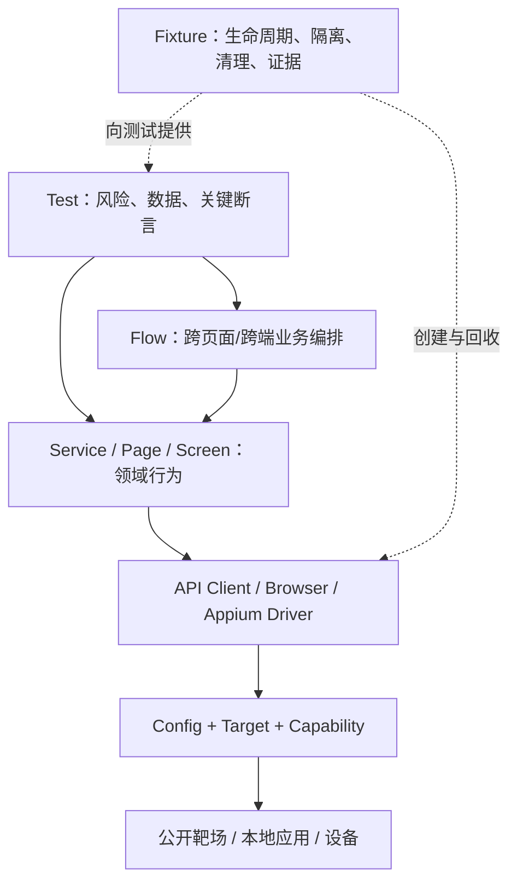

# 自动化框架设计与进阶项目

> 核对日期：2026-07-27
> 配套代码：[`labs/automation-practice`](../../labs/automation-practice/README.md)
前置教程：

- [接口自动化项目全流程](../02-接口测试/04-接口自动化项目全流程.md)
- [Web 自动化项目全流程](../03-UI自动化/04-Web自动化项目全流程.md)
- [App 自动化学习阶段](../03-UI自动化/02-App自动化学习阶段/README.md)

这一章解决的是“怎么让自动化长期可信”。一个成熟框架不是封装方法越多越好，
而是让以下事情有统一、清晰、可验证的处理方式：

- 环境从哪里来；
- 测试控制哪个目标；
- 数据由谁创建和清理；
- 不同层各负责什么；
- 失败留下什么证据；
- 哪些用例进入 PR、定时任务或人工任务；
- 如何在不隐藏缺陷的前提下降低偶发性；
- 新人如何沿着同一结构逐步做到跨端项目。

## 1. 先定义框架成功标准

框架成功不等于“所有用例都是绿色”。至少应满足：

| 维度 | 可验证标准 |
|---|---|
| 可运行 | 新电脑根据 README 能创建环境并运行第一组测试 |
| 可重复 | 相同版本、相同输入、相同环境得到同类结果 |
| 可隔离 | 用例可单独、乱序、重复运行 |
| 可诊断 | 一次失败留下足够证据定位所属层 |
| 可扩展 | 新增目标时扩展清晰边界，而不是复制整个框架 |
| 可治理 | 公网、设备、Secret、产物和数据都有明确边界 |
| 可解释 | 测试代码能读出业务意图和风险 |
| 可维护 | 升级依赖、驱动或靶场时能知道影响范围 |

常见的伪框架：

- `BasePage` 包装 Playwright/Appium 的每个方法；
- `utils.py` 放进所有无法归类的逻辑；
- 用全局变量保存浏览器、Token 或设备 Session；
- 一个 E2E 脚本完成登录到所有后续测试的数据准备；
- 所有失败统一重跑三次；
- 在测试代码中散落 URL、账号和超时；
- 只有“成功”断言，没有状态、结构和业务不变量；
- 截图、日志和 Trace 全量上传，却没有数据边界。

## 2. 推荐分层



### 2.1 Config / Target / Capability

负责：

- Base URL；
- 公开演示账号；
- Appium Server URL；
- 平台、设备名、UDID；
- App 路径、Package/Activity、Bundle ID；
- 经过评审的超时默认值。

不负责：

- 自动扫描并选择任意连接设备；
- 保存真实账号或 Token；
- 根据失败临时把超时无限放大；
- 在导入模块时连接网络或设备。

本项目使用 `环境变量示例.env` 说明公开字段，用 `Settings.from_env()` 读取本机
`.env`。`.env` 不能提交。配置错误应尽早失败，例如平台不是
`android`/`ios`、App 路径不存在、同时连接多台设备但未指定 UDID。

### 2.2 Client / Browser / Driver

这一层负责协议和会话：

- API：Session、Base URL、显式超时、脱敏日志；
- Web：Browser、Context、Page、Trace；
- Android：Appium + UiAutomator2 Session；
- iOS：Appium + XCUITest/WDA Session。

不要在这一层写“下单成功”“用户已登录”等业务结论。API Client 返回原始
`requests.Response`，测试仍能检查状态、Header、Cookie 和 Body。Driver
也不应吞掉原生异常然后只返回 `False`，否则调用方失去诊断上下文。

### 2.3 Service / Page / Screen

把协议动作变成领域动作：

```text
API Service: create_booking(), delete_booking()
Web Page: login(), add_product_to_cart()
Mobile Screen: open_catalog(), add_product()
```

适合放：

- 稳定 Locator；
- 单页或单资源行为；
- 页面/Screen 就绪条件；
- 协议参数到领域参数的转换。

不适合放：

- 读取 pytest 命令行开关；
- 生成全局测试数据；
- 捕获所有异常后继续；
- 把每个业务断言藏进 `do_everything()`；
- 用 `sleep()` 等待未知状态。

Page 和 Screen 可检查“页面已就绪”这种技术前置条件；最终业务结果仍应在测试
中清楚可见。

### 2.4 Flow

Flow 组合多个领域对象，例如：

```text
登录 → 搜索商品 → 加入购物车 → 填写虚拟收货信息 → 提交 → 验证完成
```

使用 Flow 的条件：

- 至少跨两个 Page/Screen/Service；
- 多条测试复用相同业务编排；
- 编排本身有稳定业务名称；
- 测试仍能在关键节点插入断言。

不要把所有用例都强制放进 Flow。一个接口边界测试或一个按钮状态测试直接调用
Service/Page 更清楚。

### 2.5 Test

测试应让读者看到：

1. 本条用例验证什么风险；
2. 使用什么合成数据；
3. 执行哪个领域行为；
4. 期望什么业务结果；
5. 失败后哪些资源需要清理。

测试文件不应直接相互导入，也不应依赖按文件名顺序运行。

## 3. 推荐目录

```text
labs/automation-practice/
├── 环境变量示例.env
├── pyproject.toml
├── src/qa_learning/
│   ├── 运行配置.py
│   ├── api/
│   │   ├── 接口客户端.py
│   │   ├── 响应数据契约.py
│   │   └── <domain_service>.py
│   ├── web/
│   │   ├── 浏览器练习目标.py
│   │   ├── pages/
│   │   └── flows/
│   └── mobile/
│       ├── 移动端驱动工厂.py
│       └── screens/
└── tests/
    ├── conftest.py
    ├── factories/
    ├── api/
    ├── web/
    └── mobile/
```

目录服务于依赖方向，不是为了让层数看起来专业：

```text
tests → flow/page/service → client/driver → target
```

底层不能反向导入测试。Android/iOS 如果只有少量不同，可以共享
`screens/` 的协议或业务名称；当原生结构明显不同，应分别实现，不要制造大量
`if platform == ...`。

## 4. 配置工程

### 4.1 四类环境

建议把目标分成：

| 类别 | 示例 | 默认运行 |
|---|---|---|
| Offline | Fake Response、Schema、数据工厂 | 是 |
| Local | demo-shop、WireMock、Prism | 是，前提是任务负责启动 |
| Public | JSONPlaceholder、TodoMVC、SauceDemo | 否，显式开关 |
| Device | Android 真机、iOS Simulator | 否，显式开关 |

不要只使用 `ENV=test/staging/prod` 一个变量把所有差异揉在一起。URL、设备、
App、账号和超时应该是可验证的独立字段。

### 4.2 配置优先级

推荐：

```text
代码中的公开安全默认值
  < .env 中的本机公开练习配置
  < 当前命令显式环境变量
  < CI Secret / Job 参数
```

仓库只提交 `环境变量示例.env`。若未来增加 Secret：

- 本机放在 Secret Manager 或未跟踪的 `.env`；
- CI 使用平台 Secret；
- 日志中必须脱敏；
- 不允许提供一个真实值作为“示例”；
- 轮换后确认历史提交中也没有残留。

### 4.3 超时不是越大越好

分别理解：

- API connect timeout；
- API read timeout；
- Playwright action/navigation/expect timeout；
- Appium new command timeout；
- Appium 单个等待条件；
- CI job timeout。

超时应与操作风险匹配。把所有超时从 10 秒改成 180 秒，会让每个真实失败变得
更慢，却不能修复等待条件、网络或 Locator。

## 5. Fixture 与资源生命周期

Fixture 的核心是所有权：谁创建，谁负责回收。

### 5.1 安全 guard

根 `conftest.py` 提供：

```text
public_api_guard  ← --run-public-api
public_web_guard  ← --run-public-web
mobile_guard      ← --run-mobile
```

公网/设备测试必须显式引用相应 fixture。Web 目录还在 collection 阶段添加 skip，
避免 guard 执行前就启动浏览器。

`@pytest.mark.external` 用来分类，guard 用来阻止误执行。两者职责不同，不要
只保留 marker。

### 5.2 `yield` 清理

典型资源 fixture：

```python
@pytest.fixture
def created_booking(api, synthetic_booking):
    booking_id = api.create_booking(synthetic_booking)
    try:
        yield booking_id
    finally:
        api.delete_booking(booking_id)
```

需要注意：

- 创建失败时不能尝试删除未知 ID；
- 清理失败应记录，但不能覆盖原始断言失败；
- 共享公共环境只删除本次运行创建的数据；
- 清理接口也必须有超时；
- 如果环境周期性重置，404 清理结果可作为“已不存在”处理，但要明确契约。

### 5.3 Web 隔离

每条测试使用新的 BrowserContext。需要登录状态复用时：

- 只保存公开演示账号的 storage state；
- state 按测试 Worker 隔离；
- 不把 state 提交；
- 仍要确认用例之间没有购物车、localStorage 或 Cookie 污染。

一个全局 Page 速度可能快一点，但会带来顺序依赖、失败传播和并行污染。

### 5.4 Mobile 隔离

移动端启动成本更高，可以按风险选择：

| 模式 | 隔离 | 速度 | 使用场景 |
|---|---|---:|---|
| 每条用例新 Session + 重装/清数据 | 强 | 慢 | 少量高风险 E2E |
| 每模块复用 Session，每条重置 App 状态 | 中 | 中 | 稳定功能集 |
| 整个套件共享且不重置 | 弱 | 快 | 只适合探索，不作为正式回归 |

Android 可通过受控 fixture 执行 App reset/clear；iOS Simulator 可重装 App 或
清理应用状态。不要在测试正文散落 `adb shell pm clear` 或 `simctl erase`，
更不能在未确认目标 UDID 时执行。

## 6. 测试数据与清理

### 6.1 合成数据工厂

数据应具备：

- 明显虚构；
- 本次运行唯一；
- 可从失败证据追踪；
- 必要时可用 seed 重现；
- 不碰撞其他学习者的数据；
- 能被清理。

示例：

```text
run_id: 20260727-a1b2c3
name: Learning-a1b2c3 Tester
email: learning-a1b2c3@example.com
address: Example Street
postal_code: 000000
```

`example.com` 是文档保留示例域名，不要换成个人或公司邮箱。

### 6.2 三种状态模型

| 模型 | 示例 | 测试策略 |
|---|---|---|
| 不持久化 | JSONPlaceholder 模拟 POST | 验证响应，不断言随后可查 |
| 进程内持久化 | demo-shop、Mockoon Data Bucket | 每次进程隔离，重启清空 |
| 共享真 CRUD | Restful Booker、部分公共站 | 唯一数据、串行、`finally` 清理 |

测试前必须知道目标属于哪种状态模型。否则会把“假写入”误当真写入，或把共享
环境总数写成脆弱断言。

### 6.3 清理也需要测试

至少验证一次：

- 正常执行后资源被删除；
- 中间断言失败后 `finally` 仍执行；
- 重复清理的预期语义；
- 清理失败不会吞掉原始失败；
- 只清理带本次 `run_id` 的对象。

## 7. 断言体系

### 7.1 API

建议三层：

1. 协议：状态码、Content-Type、必要 Header；
2. 契约：JSON Schema / OpenAPI；
3. 业务：金额、关联 ID、状态转换、不变量。

Schema 通过不代表业务正确。`total_cents` 是整数，但计算错了仍能通过 Schema。

### 7.2 Web / Mobile

优先用户可观察结果：

- URL/路由与关键页面同时成立；
- 按钮状态、错误原因、商品内容；
- 购物车数量、金额和最终状态；
- 系统权限弹窗和 App 内状态；
- 操作后目标元素满足条件。

避免：

- 只断言“元素存在”；
- 把“没有抛异常”当成功；
- 只比较截图；
- 依赖列表第几个元素；
- 每步都截图但没有业务断言。

### 7.3 负向测试

高价值负向测试应覆盖：

- 缺少/错误鉴权；
- 边界和非法输入；
- 重复提交与幂等；
- 404、409、422、429、5xx；
- 网络慢、断连和依赖失败；
- 锁定账号、必填项、权限拒绝；
- App 被后台回收、屏幕旋转、系统弹窗。

公网不适合主动制造高流量 429/5xx。使用本地 WireMock、Mockoon 或受控应用。

## 8. 失败产物设计

### 8.1 产物矩阵

| 层 | 最小证据 | 可选证据 |
|---|---|---|
| API | 状态码、脱敏 URL/Body、Schema 路径、关联 ID | HAR（确认数据安全后） |
| Web | pytest 堆栈、Trace、失败截图 | 视频、Console、Network |
| Android | Appium 日志、截图、Page Source、设备/UDID | 截断后的 logcat、屏幕录制 |
| iOS | Appium/WDA 日志、截图、Page Source、Simulator UDID | Xcode Result Bundle、系统日志 |

产物目录建议：

```text
test-results/
└── <run-id>/
    └── <platform>/
        └── <test-node-id>/
            ├── summary.json
            ├── screenshot.png
            ├── page-source.xml
            └── driver.log
```

文件名使用安全的 pytest node id 哈希或规范化名称，避免路径注入和过长文件名。

### 8.2 只在失败时收集重证据

- Trace、视频和 Page Source 有明显存储成本；
- 通过用例通常只保留摘要；
- 失败用例保留完整证据；
- 不稳定问题可临时提高证据等级；
- 设置 CI Artifact 保留周期；
- 上传前扫描 Token、Cookie、URL 和用户数据。

证据上传前应按数据分类和授权范围进行最小化处理，并设置 CI Artifact 保留周期。

### 8.3 失败分类

建议测试报告记录一个初步分类，而不是自动改成 skip：

```text
environment  网络、公共站点、设备掉线、服务未启动
framework    fixture、配置、驱动、证据收集代码
test         数据、定位、等待、断言错误
product      可复现的业务规则违反
unknown      证据不足，需要补充实验
```

分类是调查起点，不是用关键字自动决定的最终结论。

## 9. 不稳定性与重试政策

重试只能回答“失败是否可重复”，不能证明第一次失败不存在。

允许的有限用途：

- 人工调查时复跑一次并对比证据；
- 明确幂等的网络读取在 Client 层按规范退避；
- 已记录基础设施事件时由任务级机制重新调度；
- 对已确认且有负责人、到期时间的外部缺陷临时隔离。

禁止：

- 所有测试默认重试三次；
- 失败后刷新页面直到成功；
- 移动元素找不到就不断滑动；
- 公共站点 429 后并发重试；
- 删除第一次失败证据，只展示最终通过；
- 用超长固定等待替代状态条件。

Flaky 修复流程：

```text
保留第一次失败证据
  → 最小化复现
  → 判断环境/框架/测试/产品层
  → 检查状态与等待条件
  → 修复根因
  → 连续、乱序、单独验证
  → 记录关闭依据
```

## 10. CI 分层

### Lane 1：PR Offline

每次提交：

```bash
python -m ruff check src tests
pytest -m "not external and not mobile" -q
```

目标：

- 快；
- 无公网；
- 无设备；
- 失败确定；
- 阻止明显回归。

### Lane 2：PR Local Integration

CI 启动本地 `demo-shop`、WireMock 或 Prism，再运行 API/UI 集成。任务必须：

- 等待 `/health`；
- 使用随机可用端口或隔离容器；
- 测试后停止服务；
- 上传失败证据；
- 不暴露到公网。

### Lane 3：Public Smoke

只用人工触发或低频受控任务：

```bash
pytest tests/api -m "external and smoke" -q --run-public-api
pytest tests/web -m "external and smoke" -q --run-public-web
```

特性：

- 串行；
- 小集合；
- 短超时；
- 不作为 PR 硬门禁；
- 不创建大量共享数据；
- 不做性能或安全测试。

### Lane 4：Mobile

使用明确标记的自托管机器、真机或 Simulator：

```bash
pytest tests/mobile -m "mobile and android and smoke" -q --run-mobile
pytest tests/mobile -m "mobile and ios and smoke" -q --run-mobile
```

任务开始前检查 UDID、App 来源、设备空闲和 Appium 驱动；结束后回收 Session。
多设备并行必须一 Worker 一设备，不能让 Worker 竞争同一个 UDID 或 Appium
端口。

### Lane 5：Nightly / Release

只在自己控制的环境扩大：

- 完整 API 回归；
- 本地跨浏览器；
- Android/iOS 设备矩阵；
- Toolshop 跨端关键旅程；
- 本地性能基线；
- 稳定性趋势。

Nightly 不是“把所有公网用例每晚跑一遍”。公共服务不受你控制，频率仍需克制。

## 11. 依赖与版本升级

项目通过 `pyproject.toml` 声明兼容范围。升级时：

1. 阅读官方 Release Notes 和迁移文档；
2. 单独建升级变更；
3. 先运行 Offline；
4. 再运行本地 Integration；
5. 再做一个平台的 smoke；
6. 最后扩大矩阵；
7. 记录 Python、浏览器、Appium、驱动、OS 和设备版本。

不要同时升级 Python、Playwright、Appium、Android SDK、Xcode 和所有 App，
否则失败时无法隔离变量。

## 12. 从新手到进阶的二十四项任务

每项任务都要提交：代码、运行命令、至少一次失败证据、限制说明和复盘。

### L1：框架基本功

1. 创建虚拟环境，只安装 API 依赖并运行 Client 单元测试。
2. 给一个敏感嵌套字段增加脱敏测试，证明原始值不会出现在日志。
3. 为一个 Schema 故意制造类型错误，确认错误包含 JSON 路径。
4. 用 `.env` 覆盖公开 Base URL，证明测试代码无需修改。
5. 让默认 `pytest -q` 完成，列出所有被安全跳过的类型。
6. 为每种 marker 写一条 `--collect-only` 检查。

### L2：隔离与数据

7. 为 Restful Booker 编写唯一合成数据工厂。
8. 在断言中途故意失败，证明 `finally` 仍尝试清理。
9. 证明 JSONPlaceholder POST 不持久化，并解释为什么不是服务缺陷。
10. 证明两个 TodoMVC BrowserContext 不共享 localStorage。
11. 为 Android 测试设计 App 状态重置 fixture。
12. 为 iOS Simulator 设计 App 安装/清理边界，不执行整机 erase。

### L3：可诊断性

13. 生成一份 Playwright Trace，指出失败前后 DOM、网络和 Locator。
14. 为 Appium 失败自动保存截图与 Page Source。
15. 将 Appium 服务日志与 pytest node id/run id 关联。
16. 建立 API/Web/Mobile 失败分类表并分析三个故意失败。
17. 修复一条固定睡眠测试，替换为可观察状态等待。
18. 修复一条全局重试测试，保留第一次失败并消除根因。

### L4：本地可控进阶

19. 用 WireMock 模拟 429 → 200，验证有限退避和最大等待。
20. 用 Prism 根据 OpenAPI 拒绝不符合契约的请求。
21. 本地 Demo Shop 用 API 创建订单、Web 验证显示。
22. 为同一关键旅程实现 API、Web、Android 三层覆盖，并说明各层取舍。
23. 建立 Offline、Local Integration、Public Smoke、Mobile 四条流水线设计。
24. 完成 Toolshop API/Web/Android/iOS Capstone 与质量报告。

## 13. Toolshop 进阶项目

官方来源：

- [Practice Software Testing 仓库](https://github.com/testsmith-io/practice-software-testing)
- [Web v4](https://v4.practicesoftwaretesting.com/)
- [API v4](https://api-v4.practicesoftwaretesting.com/)
- [Swagger](https://api.practicesoftwaretesting.com/api/documentation)

开始前阅读官方 README、部署说明与当前 License。不要重新分发源码或移动资产，
不要未经许可公开托管。

### 13.1 项目范围

选择 3～5 个高风险旅程，例如：

- 鉴权与会话；
- 商品搜索、过滤和详情；
- 购物车数量与金额；
- 结算与订单；
- API 与 App 显示一致性；
- 错误输入和权限边界。

### 13.2 测试分配

| 风险 | 首选层 | 补充层 |
|---|---|---|
| 字段约束、状态码、契约 | API | OpenAPI/Mock |
| 商品列表与用户交互 | Web | API |
| 真机键盘、手势、权限 | Android/iOS | Screen 单元封装 |
| 跨入口数据一致性 | 少量跨端 E2E | 各端独立回归 |
| 429/5xx/断连 | 本地 WireMock | Client 单元测试 |
| 性能 | 本地部署 | 不对公共实例执行 |

### 13.3 交付物

```text
capstone/
├── README：来源、许可、运行、安全边界
├── strategy：风险、范围、分层、进入/退出标准
├── traceability：需求/风险/测试映射
├── code：API、Web、Android、iOS
├── data：合成数据工厂与清理
├── evidence：仅公开/合成数据的失败样例
├── defects：可复现步骤、证据、影响和严重度
└── report：结果、限制、趋势、下一步
```

### 13.4 Capstone 验收

- [ ] 可以在 15 分钟内向别人说明测试策略；
- [ ] 默认运行不访问公共环境、不控制设备；
- [ ] 每个平台能独立运行，不依赖固定顺序；
- [ ] 至少一个跨端旅程验证共享业务结果；
- [ ] 数据有 `run_id`，可清理；
- [ ] API 日志脱敏；
- [ ] Web 有 Trace；
- [ ] Android/iOS 有截图、Page Source 和 Driver 日志；
- [ ] 公共 smoke 与本地回归分开；
- [ ] 没有压力测试公共服务；
- [ ] 没有公司内容、真实个人数据、Secret 或重新分发的二进制；
- [ ] 报告区分通过、失败、阻塞、环境问题和未覆盖风险。

## 14. 评审清单

### 代码

- [ ] 测试能读出业务意图；
- [ ] 依赖方向单向；
- [ ] 没有万能 BasePage/BaseScreen；
- [ ] 没有共享可变全局 Session；
- [ ] 没有用固定睡眠碰运气；
- [ ] 清理位于 `finally` 或 fixture teardown；
- [ ] 所有网络调用有超时；
- [ ] 日志脱敏。

### 执行

- [ ] 公网和移动显式开关；
- [ ] 目标 URL、UDID、App 路径已核对；
- [ ] 公共测试低频、串行；
- [ ] PR 使用确定性本地检查；
- [ ] 移动 Worker 与设备一一对应；
- [ ] 产物只在必要时保存并有保留期。

### 结果

- [ ] 断言覆盖协议、契约和业务；
- [ ] 一次失败的证据足以确定优先排查层；
- [ ] Flaky 有 owner、证据和关闭条件；
- [ ] 公开环境故障不伪装成产品失败；
- [ ] 产品失败不被 retry/skip 隐藏；
- [ ] 已知限制被明确写出。

遇到异常时进入 [自动化故障排查](./04-自动化故障排查.md)，按层验证，不要同时升级、
重装和修改多个变量。

## 15. 官方参考

以下链接于 2026-07-27 核对：

- [pytest Fixture](https://docs.pytest.org/en/stable/how-to/fixtures.html)
- [pytest Marker](https://docs.pytest.org/en/stable/example/markers.html)
- [Playwright Python 测试隔离](https://playwright.dev/python/docs/browser-contexts)
- [Playwright Trace Viewer](https://playwright.dev/python/docs/trace-viewer)
- [Appium Session Capabilities](https://appium.io/docs/en/latest/reference/session/caps/)
- [Appium 驱动管理](https://appium.io/docs/en/latest/reference/cli/extensions/)
- [UiAutomator2 Driver](https://github.com/appium/appium-uiautomator2-driver)
- [XCUITest Driver](https://github.com/appium/appium-xcuitest-driver)
- [WireMock Documentation](https://wiremock.org/docs/)
- [Stoplight Prism](https://github.com/stoplightio/prism)
- [Practice Software Testing](https://github.com/testsmith-io/practice-software-testing)
