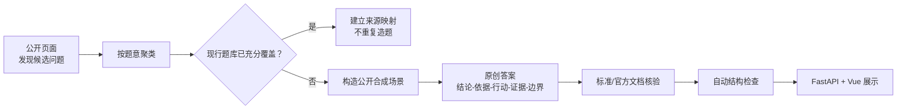

# 小林 Coding 测试题库整合

> 核对日期：2026-07-29
>
> 原始入口：[小林 Coding 面试题导航](https://xiaolincoding.com/interview/)
>
本轮不是把外部题库复制到仓库，而是完成了“页面盘点 → 与现有题库去重 → 发现能力缺口 → 原创重写 → 官方资料校验 → 网站可追溯展示”的闭环。

## 一、交付结果

- 核对 5 个直接测试入口和 16 个测试开发支撑专题，共 21 个页面；
- 共核对 672,610 个当前页面正文字符；
- 站内汇总页标注 1,143 题，本次按页面问题标题实际识别 1,111 题，两种口径分开保存；
- 4 个直接题库页面实际识别 368 个问题标题；
- 与原有 248 道详解题去重后，新增 62 道高价值原创详解题；
- 当次整合后题库为 310 道；加入个人整理最新版 160 题后当前统一题库为 470 道。本轮新增仍为：
  - 业务测试 18 道；
  - 自动化与 Java 测试开发 22 道；
  - 性能测试与诊断 22 道；
- 每个来源页面都有“来源页 → 现行题目 ID → 质量修订说明”的映射；
- 62 道新增题均同时关联至少一个独立标准、官方文档或方法原始来源；
- 3 道与核心题主题接近的 Java 深化题已记录关联题 ID 和保留理由，由构建器校验而不是口头豁免；
- 外部页面中的固定阈值、绝对化选型和不安全做法不会直接进入答案。

## 二、为什么不是新增 368 道

外部题目中有大量同义、拆分粒度不同或已经被本仓库覆盖的内容。例如 pytest fixture、HTTP 状态码、Appium Context、JMeter 基础指标、MySQL 索引和 Git 命令已经有正式详解题。再次换标题录入只会造成：

1. 学习者重复背诵；
2. 同一概念出现互相矛盾的答案；
3. 题数增加但能力覆盖没有增加；
4. 后续技术版本更新时难以维护。

本轮只有满足以下至少一个条件的候选题才新增：

- 原题库没有覆盖该能力；
- 原题库只有概念题，缺少可执行的真实场景；
- 外部答案存在明显过时或错误口径，需要专门建立纠错题；
- 能把业务、自动化、性能或 Java 基础连接成一条诊断证据链。

## 三、三个新增题组

### 1. 业务测试

重点补齐：

- Session-Based 探索式测试；
- Web 登录状态与购物车合并；
- 当前 Web Vitals；
- App 权限、推送、Deep Link、离线同步；
- Hybrid JS Bridge、H5 白屏、PWA、软键盘与安全区域；
- 小程序双线程、授权登录、入口、分包和发布；
- GraphQL 和文件下载接口。

### 2. 自动化与 Java 测试开发

重点补齐：

- REST Assured、JDK HttpClient 与 Apache HttpClient 的边界；
- Request/Response Specification、Filter 和断言分层；
- JUnit Jupiter、TestNG、参数化与扩展模型；
- Maven Surefire/Failsafe、Gradle 和 CI 可复现性；
- WireMock、MockWebServer、故障注入和契约漂移；
- Java 并行测试中的全局状态、ThreadLocal 和数据隔离；
- Testcontainers 生命周期和 JaCoCo 覆盖边界；
- 集合选型、线程池卡死诊断以及 JVM/GC/JFR 取证。

### 3. 性能测试与诊断

重点补齐：

- JMeter 分布式执行、定时器、线程组和非 GUI 结果；
- 压力机先饱和造成的假瓶颈；
- Linux USE/RED、磁盘、网络、线程转储和内存增长；
- GC 与响应尖峰的因果验证；
- 线程池、数据库连接池和 MySQL 瓶颈实验；
- 微服务 Trace、实例负载倾斜和错误拐点；
- 单变量调优、可复核报告和 JVM 参数边界。

## 四、质量处理流程



社区或个人学习网站用于发现“面试会问什么”，标准、RFC、JDK、JUnit、TestNG、JMeter、WireMock、Linux Kernel、Android、Apple、NGINX、NIST 等一手资料用于核对“技术事实是什么”。两种来源的职责不能倒置。完整质量检查会阻止仅有小林发现页、却没有独立核验来源的新增题进入正式题库。

## 五、文档导航

- [站内测试资料覆盖审计](./站内测试资料覆盖审计.md)：21 个页面、题量差异和映射方式；
- [技术纠错与答案重写准则](./技术纠错与答案重写准则.md)：本轮明确修正的错误口径；
- [分模块学习与练习索引](./分模块学习与练习索引.md)：小白、自动化和性能进阶的使用顺序；
- [面试题库网站](../../../../apps/interview-bank/README.md)：启动、筛选、收藏、笔记和模拟面试。

## 六、在网站中查看

从仓库根目录执行：

```bash
bash apps/interview-bank/scripts/start.sh
```

打开 `http://127.0.0.1:8000`，进入“资料来源”页面。小林 Coding 覆盖卡片可以：

- 查看 21 个页面的实际核对结果；
- 按直接题库、Java/JVM、数据中间件、计算机基础和架构工程筛选；
- 对比站内标称题量与页面实际可见题量；
- 展开查看每个来源页映射到的现行题目 ID；
- 检查每个页面的质量修订说明。

对应只读 API：

```text
GET /api/quality/xiaolincoding-coverage
```

## 七、版权与真实性

- 不复制外部页面的完整答案或大段原文；
- 外部标题只用于盘点主题，正式题目和答案由本仓库重新设计；
- 所有订单、账号、接口、日志、指标和故障均为公开 Demo 或从零合成；
- 练习项目必须明确称为练习，不能包装成真实任职经历；
- 后续网页内容变化时，以覆盖快照中的核对日期和实际可见数量为准。
