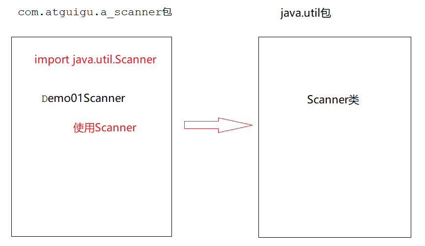
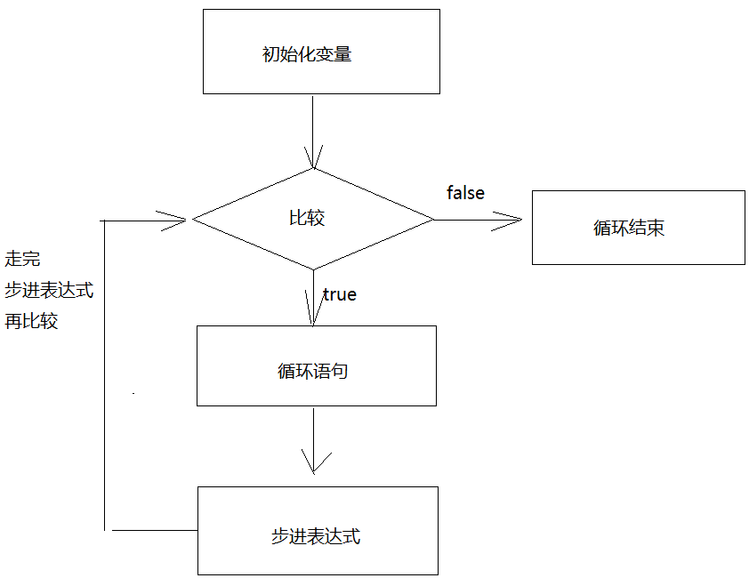
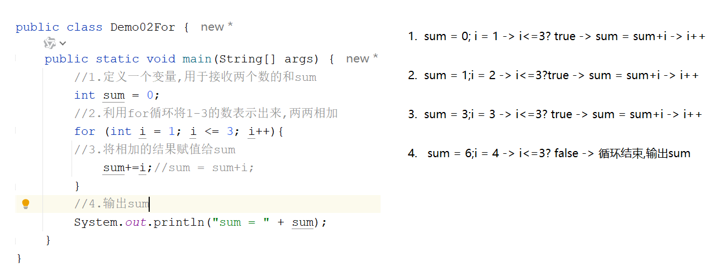

# day03_流程控制

```java
课前回顾:
  1.常量(字面值):在代码的运行过程中值不会发生改变的数据
    整数 小数 字符  字符串  布尔常量 空常量
  2.变量:在代码的运行过程中其值会随着不同的情况发生改变的数据
    a.定义格式:
      数据类型 变量名 = 值
    b.java中的数据类型:
      基本类型:byte short int long  float double char boolean
      引用类型:类 数组 接口 枚举  注解 record
    c.整数默认类型为int;小数默认类型为double
  3.变量注意事项:
    a.变量不初始化不能直接使用
    b.在相同的作用域中不能定义重名的变量
    c.在不同的作用域中不要随意互相访问
      小作用域中可以访问大作用域中的数据
      大作用域中不能直接访问小作用域中的数据
  4.标识符:给类,方法,变量取的名字
    a.硬性规定:
      名字中可以包含:字母 _ 数字 $
      但是不能数字开头
      不能是关键字
    b.软性建议:
      给类取名:大驼峰
      给方法,变量取名:小驼峰
  5.数据类型转换:
    a.按照取值范围大小从小到大排列:
      byte,short,char -> int -> long -> float -> double
    b.自动类型转换:
      小转大
    c.强转:
      大转小

  6.运算符:
    a.算数运算符:+ - * / %
    b.赋值运算符:
      = += -= *= /= %=
    c.比较运算符:
      == > < >= <= !=
    d.逻辑运算符:
      &&:与  有假则假
      ||:或  有真则真
      !:取反
      ^:异或  结果相同为false.不同为true

    e.三元运算符:
      格式:  boolean表达式?表达式1:表达式2
      执行流程: 先走boolean表达式,如果是true,就走表达式1,否则就走表达式2


今日重点:
   除了第一章,都是重点
```

# 第一章.键盘录入_Scanner

```java
1.概述:是java语言提前定义好的类
2.作用:通过键盘录入的形式将数据放到代码中参与运行
3.使用:
  a.导包:由于此类在别的包中,所以我们需要通过导包来找到这个类,找到了才能使用这个类
    import java.util.Scanner;
  b.new对象
    Scanner 对象名 = new Scanner(System.in)
  c.调用此对象中提供好的方法,实现键盘录入
    对象名.nextInt() 键盘录入一个int型的整数
    对象名.next() 键盘录入一个String型的字符串
```



```java
public class Demo01Scanner {
    public static void main(String[] args) {
        Scanner scanner = new Scanner(System.in);
        //录入int型整数
        int data1 = scanner.nextInt();
        int data2 = scanner.nextInt();
        int sum = data1 + data2;
        System.out.println("sum = " + sum);
        System.out.println("======================");
        //录入字符串
        String data3 = scanner.next();
        System.out.println("data3 = " + data3);
    }
}

```

> ```java
> nextLine():录入字符串 -> 遇到回车就结束录入
> next():录入字符串 -> 遇到空格和回车就结束录入
> ```
>
> ```java
> public class Demo02Scanner {
>     public static void main(String[] args) {
>         Scanner scanner = new Scanner(System.in);
>         String data1 = scanner.next();
>         String data2 = scanner.nextLine();
>         System.out.println(data1);
>         System.out.println(data2);
>     }
> }
> ```

# 第二章.switch(选择语句)

## 1.switch基本使用

```java
1.格式:
  switch(变量名){
      case 目标值1:
          执行语句1;
          break;
      case 目标值2:
          执行语句2;
          break;
      case 目标值3:
          执行语句3;
          break;
      ...
      default:
          执行语句n;
          break;
  }
2.执行流程:
  用变量接收的值去和下面case后面的目标值做匹配,匹配上哪个case后面的目标值,就执行哪个case对应的执行语句,如果以上所有的case都没有匹配上,就走default对应的执行语句n

3.关键字:break
  结束switch语句

4.switch都能匹配什么类型的数据:
  byte short int char 枚举类型 String类型
```

```java
public class Demo01Switch {
    public static void main(String[] args) {
        Scanner sc = new Scanner(System.in);
        int data = sc.nextInt();
        switch (data){
            case 1:
                System.out.println("星期一");
                break;
            case 2:
                System.out.println("星期二");
                break;
            case 3:
                System.out.println("星期三");
                break;
            case 4:
                System.out.println("星期四");
                break;
            case 5:
                System.out.println("星期五");
                break;
            case 6:
                System.out.println("星期六");
                break;
            case 7:
                System.out.println("星期日");
                break;
            default:
                System.out.println("输入的数字有误");
                break;
        }
    }
}

```

```java
public class Demo02Switch {
    public static void main(String[] args) {
        Scanner sc = new Scanner(System.in);
        int month = sc.nextInt();
        switch (month) {
            case 12:
                System.out.println("冬季");
                break;
            case 1:
                System.out.println("冬季");
                break;
            case 2:
                System.out.println("冬季");
                break;
            case 3:
                System.out.println("春季");
                break;
            case 4:
                System.out.println("春季");
                break;
            case 5:
                System.out.println("春季");
                break;
            case 6:
                System.out.println("夏季");
                break;
            case 7:
                System.out.println("夏季");
                break;
            case 8:
                System.out.println("夏季");
                break;
            case 9:
                System.out.println("秋季");
                break;
            case 10:
                System.out.println("秋季");
                break;
            case 11:
                System.out.println("秋季");
                break;
            default:
                System.out.println("输入的月份有误");
                break;
        }
    }
}

```

## 2.case的穿透性

```java
1.如果case下面不写break,就会出现case的穿透性现象,就会直接往下穿透执行,直到遇到break或者switch代码结束
```

```java
public class Demo03Switch {
    public static void main(String[] args) {
        Scanner sc = new Scanner(System.in);
        int month = sc.nextInt();
        switch (month) {
            case 12:
            case 1:
            case 2:
                System.out.println("冬季");
                break;

            case 3:
            case 4:
            case 5:
                System.out.println("春季");
                break;

            case 6:
            case 7:
            case 8:
                System.out.println("夏季");
                break;

            case 9:
            case 10:
            case 11:
                System.out.println("秋季");
                break;
            default:
                System.out.println("输入的月份有误");
                break;
        }
    }
}

```

## 3.switch的新特性

switch新特性表达式在Java 12中作为预览语言出现，在Java 13中进行了二次预览，得到了再次改进，最终在Java 14中确定下来。另外，在Java17中预览了switch模式匹配。

传统的switch语句在使用中有以下几个问题。

（1）匹配是自上而下的，如果忘记写break，那么后面的case语句不论匹配与否都会执行。

（2）所有的case语句共用一个块范围，在不同的case语句定义的变量名不能重复。

（3）不能在一个case语句中写多个执行结果一致的条件，即每个case语句后只能写一个常量值。

（4）整个switch语句不能作为表达式返回值。

### 3.1.Java12的switch表达式

Java 12对switch语句进行了扩展，将其作为增强版的switch语句或称为switch表达式，可以写出更加简化的代码。

- 允许将多个case语句合并到一行，可以简洁、清晰也更加优雅地表达逻辑分支。
- 可以使用-> 代替 :
  - ->写法默认省略break语句，避免了因少写break语句而出错的问题。
  - ->写法在标签右侧的代码段可以是表达式、代码块或 throw语句。
  - ->写法在标签右侧的代码块中定义的局部变量，其作用域就限制在代码块中，而不是蔓延到整个switch结构。
- 同一个switch结构中不能混用“→”和“:”，否则会有编译错误。使用字符“:”，这时fall-through规则依然有效，即不能省略原有的break语句。"："的写法表示继续使用传统switch语法。

案例需求：

请使用switch-case结构实现根据月份输出对应季节名称。例如，3～5月是春季，6～8月是夏季，9～11月是秋季，12～2月是冬季。

```java
public class Demo04Switch {
    public static void main(String[] args) {
        Scanner sc = new Scanner(System.in);
        int month = sc.nextInt();
        switch (month) {
            case 12,1,2:
                System.out.println("冬季");
                break;
            case 3,4,5:
                System.out.println("春季");
                break;
            case 6,7,8:
                System.out.println("夏季");
                break;
            case 9,10,11:
                System.out.println("秋季");
                break;
            default:
                System.out.println("输入的月份有误");
                break;
        }
    }
}
```

> 以上格式不写break,也会case的穿透

```java
public class Demo05Switch {
    public static void main(String[] args) {
        Scanner sc = new Scanner(System.in);
        int month = sc.nextInt();
        switch (month) {
            case 12,1,2->
                System.out.println("冬季");
            case 3,4,5->
                System.out.println("春季");
            case 6,7,8->
                System.out.println("夏季");
            case 9,10,11->
                System.out.println("秋季");
            default->
                System.out.println("输入的月份有误");
        }
    }
}

```

> 以上格式不写break,也不会出现case的穿透

### 3.2.Java13的switch表达式

Java 13提出了第二个switch表达式预览，引入了yield语句，用于返回值。这意味着，switch表达式（返回值）应该使用yield语句，switch语句（不返回值）应该使用break语句。

案例需求：判断季节。

```java
public class Demo06Switch {
    public static void main(String[] args) {
        Scanner sc = new Scanner(System.in);
        int month = sc.nextInt();
        String season = "";
        switch (month) {
            case 12,1,2->
                season = "冬季";
            case 3,4,5->
                season = "春季";
            case 6,7,8->
                season = "夏季";
            case 9,10,11->
                season = "秋季";
            default->
                season = "输入的月份有误";
        }
        System.out.println(season);
    }
}
```

```java
public class Demo07Switch {
    public static void main(String[] args) {
        Scanner sc = new Scanner(System.in);
        int month = sc.nextInt();
        String season = switch (month) {
            case 12,1,2->{
                yield "冬季";
            }
            case 3,4,5->{
                yield "春季";
            }
            case 6,7,8->{
                yield "夏季";
            }
            case 9,10,11->{
                yield "秋季";
            }
            default->{
                yield "输入的月份有误";
            }
        };
        System.out.println(season);
    }
}
```

## 4.针对于变量的新语法_类型推断

```java
定义变量时不需要确定具体数据类型,直接用var
    var 变量名 = 值
```

```java
public class Demo08Var {
    public static void main(String[] args) {
        var i = 10;
        System.out.println(i);
    }
}

```

# 第三章.分支语句

### 1.if的第一种格式

```java
1.格式:
  if(boolean表达式){
      执行语句
  }
2.执行流程:
  先走if后面的boolean表达式,如果是true,就走if后面的执行语句,否则就不走
3.注意:
  if后面的boolean表达式,不仅仅只能写判断条件,只要结果是boolean的都可以往这里写,哪怕直接写一个true或者false都行
```

```java
public class Demo01If {
    public static void main(String[] args) {
        Scanner sc = new Scanner(System.in);
        int data1 = sc.nextInt();
        int data2 = sc.nextInt();
        if (data1==data2){
            System.out.println("data1和data2相等");
        }
        System.out.println("==========================");
        /*
           只有一种情况if后面能用等号
           就是等号左右两边是boolean型数据
         */
        boolean flag1 = true;
        boolean flag2 = false;
        if (flag2 = flag1){
            System.out.println(flag2);
        }
    }
}

```

### 2.if的第二种格式

```java
1.格式:
  if(boolean表达式){
      执行语句1
  }else{
      执行语句2
  }
2.执行流程:
  a.先走if后面的boolean表达式,如果是true,就走if后面的执行语句1
  b.否则就走else后面的执行语句2
```

```java
public class Demo02If {
    public static void main(String[] args) {
        Scanner sc = new Scanner(System.in);
        int data1 = sc.nextInt();
        int data2 = sc.nextInt();
        if (data1==data2){
            System.out.println("data1和data2相等");
        }else {
            System.out.println("data1和data2不相等");
        }

    }
}
```

#### 2.1 练习

```java
任意给出一个整数，请用程序实现判断该整数是奇数还是偶数，并在控制台输出该整数是奇数还是偶数
步骤:
  1.创建Scanner对象,调用nextInt()键盘录入一个整数  data
  2.利用if判断,判断条件为data%2==0,如果余数是0证明是偶数
  3.否则就是奇数
```

```java
public class Demo03If {
    public static void main(String[] args) {
        //1.创建Scanner对象,调用nextInt()键盘录入一个整数  data
        Scanner sc = new Scanner(System.in);
        int data = sc.nextInt();
        //2.利用if判断,判断条件为data%2==0,如果余数是0证明是偶数
        if (data%2==0){
            System.out.println("偶数");
        }else{
        //3.否则就是奇数
            System.out.println("奇数");
        }
    }
}
```

#### 2.2练习

```java
需求.利用if  else 求出两个数的较大值
```

```java
public class Demo04If {
    public static void main(String[] args) {
        Scanner sc = new Scanner(System.in);
        int data1 = sc.nextInt();
        int data2 = sc.nextInt();
        if (data1>data2){
            System.out.println(data1);
        }else{
            System.out.println(data2);
        }
    }
}

```

```java
    public static void main(String[] args) {
        Scanner sc = new Scanner(System.in);
        int data1 = sc.nextInt();
        int data2 = sc.nextInt();
        int data3 = sc.nextInt();
        int temp = 0;
        if (data1>data2){
            temp = data1;
        }else {
            temp = data2;
        }

        if (temp>data3){
            System.out.println(temp);
        }else{
            System.out.println(data3);
        }
    }
}
```

#### 2.3练习

```java
案例：从键盘输入年份，请输出该年的2月份的总天数。闰年2月份29天，平年28天。
闰年:
 a.能被4整除,但是不能被100整除
 b.或者能直接被400整除
```

```java
public class Demo06If {
    public static void main(String[] args) {
        Scanner sc = new Scanner(System.in);
        int year = sc.nextInt();
        /*
           a.能被4整除,但是不能被100整除
           b.或者能直接被400整除
         */
        if (year%4==0 && year%100!=0 || year%400==0){
            System.out.println("闰年");
        }else {
            System.out.println("平年");
        }
    }
}

```

#### 2.4练习

```java
public class Demo07IfElse {
    public static void main(String[] args) {
        boolean num1 = false;
        boolean num2 = true;

        int i = 1;


        if (num1 = num2){
            i++;
            System.out.println(i);
        }

        if (false){
            --i;
            System.out.println(i);
        }
    }
}
```

### 3.if的第三种格式

```java
1.格式:
  if(boolean表达式){
      执行语句1;
  }else if(boolean表达式){
      执行语句2;
  }else if(boolean表达式){
      执行语句3;
  }...else{
      执行语句n
  }
2.执行流程:
  从上到下挨个判断,哪个if判断为true,就走哪个if对应的执行语句
  如果以上所有的判断都不成立,就走else对应的执行语句n

3.注意:
  else if多条件判断,最终一种情况不一定非得用else结束,我们只需要将所有的情况判断到位了即可,但是建议最后一种情况用else结束
```

```java
public class Demo08If {
    public static void main(String[] args) {
        Scanner sc = new Scanner(System.in);
        int data1 = sc.nextInt();
        int data2 = sc.nextInt();
        if (data1>data2){
            System.out.println("data1大于data2");
        }else if (data1<data2){
            System.out.println("data1小于data2");
        }else {
            System.out.println("data1等于data2");
        }
    }
}

```

#### 3.1.练习

```java
需求:
 键盘录入一个星期数(1,2,...7)，输出对应的星期一，星期二，...星期日

输入  1      输出	星期一
输入  2      输出	星期二
输入  3      输出	星期三
输入  4      输出	星期四
输入  5      输出	星期五
输入  6      输出	星期六
输入  7      输出	星期日
输入  其它数字   输出      数字有误

```

```java
public class Demo09If {
    public static void main(String[] args) {
        Scanner sc = new Scanner(System.in);
        int week = sc.nextInt();
        if (week==1){
            System.out.println("星期一");
        }else if (week==2){
            System.out.println("星期二");
        }else if (week==3){
            System.out.println("星期三");
        }else if (week==4){
            System.out.println("星期四");
        }else if (week==5){
            System.out.println("星期五");
        }else if (week==6){
            System.out.println("星期六");
        }else if (week==7){
            System.out.println("星期日");
        }else {
            System.out.println("输入的数字有误");
        }
        /*if (week<1 || week>7){
            System.out.println("输入的数字有误");
        }else {
            if (week==1){
                System.out.println("星期一");
            }else if (week==2){
                System.out.println("星期二");
            }else if (week==3){
                System.out.println("星期三");
            }else if (week==4){
                System.out.println("星期四");
            }else if (week==5){
                System.out.println("星期五");
            }else if (week==6){
                System.out.println("星期六");
            }else if (week==7){
                System.out.println("星期日");
            }
        }*/
    }
}

```

#### 3.2练习

```java
- 需求: 小明快要期末考试了，小明爸爸对他说，会根据他不同的考试成绩，送他不同的礼物，假如你可以控制小明的得分，请用程序实现小明到底该获得什么样的礼物，并在控制台输出。
- 奖励规则:
95~100		山地自行车一辆
90~94		游乐场玩一次
80~89		变形金刚玩具一个
80以下	   胖揍一顿
```

```java
public class Demo10If {
    public static void main(String[] args) {
        Scanner sc = new Scanner(System.in);
        int score = sc.nextInt();
        if (score>=95 && score<=100){
            System.out.println("奖励山地自行车一辆");
        }else if (score>=90 && score<=94){
            System.out.println("游乐场玩一次");
        }else if (score>=80 && score<=89){
            System.out.println("奖励变形金刚一个");
        }else if (score>0  && score<=79){
            System.out.println("胖揍一顿");
        }else{
            System.out.println("输入有误");
        }
    }
}
```

> 还可以先判断不合理的分数

# 第四章.循环

```java
1.所谓的循环就是在反复做同一个事儿
```

## 1.for循环

```java
1.格式:
  for(初始化变量;比较;步进表达式){
      循环语句 -> 反复做的事儿
  }

2.执行流程:
  a.先走初始化变量
  b.比较
  c.如果比较为true,走循环语句,走步进表达式
  d.再比较,如果还是true,继续走循环语句,走步进表达式
  e.再比较,直到比较为false,循环结束
```



```java
public class Demo01For {
    public static void main(String[] args) {
        for (int i = 0; i < 100; i++) {
            System.out.println("我爱钱");
        }
    }
}

```

### 1.1.练习1

```java
需求:求1-3的和
1+2+3

步骤:
  1.定义一个变量,用于接收两个数的和sum
  2.利用for循环将1-3的数表示出来,两两相加
  3.将相加的结果赋值给sum
  4.输出sum
```

```java
public class Demo02For {
    public static void main(String[] args) {
        //1.定义一个变量,用于接收两个数的和sum
        int sum = 0;
        //2.利用for循环将1-3的数表示出来,两两相加
        for (int i = 1; i <= 3; i++){
        //3.将相加的结果赋值给sum
            sum+=i;//sum = sum+i;
        }
        //4.输出sum
        System.out.println("sum = " + sum);
    }
}
```



### 1.2.练习2

```java
需求:求1-100的偶数和
步骤:
  1.定义一个变量sum,来接收两个数的和
  2.利用for循环将1-100的数表示出来
  3.在循环的过程中判断,如果是偶数就加,将结果赋值给sum
  4.输出sum
```

```java
public class Demo03For {
    public static void main(String[] args) {
        //1.定义一个变量sum,来接收两个数的和
        int sum = 0;
        //2.利用for循环将1-100的数表示出来
        for (int i = 1; i <= 100; i++){
        //3.在循环的过程中判断,如果是偶数就加,将结果赋值给sum
            if (i % 2 == 0){
                sum += i;
            }
        }
        //4.输出sum
        System.out.println("sum = " + sum);
    }
}
```

### 1.3.练习3

```java
需求:统计1-100的偶数个数
步骤:
  1.定义一个变量count,来统计偶数个数
  2.利用for循环将1-100的数表示出来
  3.在循环的过程中判断是否是偶数,如果是偶数,count++
  4.输出count
```

```java
public class Demo04For {
    public static void main(String[] args) {
        //1.定义一个变量count,来统计偶数个数
        int count = 0;
        //2.利用for循环将1-100的数表示出来
        for (int i = 1; i <= 100; i++){
        //3.在循环的过程中判断是否是偶数,如果是偶数,count++
            if (i % 2 == 0){
                count++;
            }
        }
        //4.输出count
        System.out.println("count = " + count);
    }
}

```
