# day12.异常_API

```java

```

# 第一章.异常

## 1.异常介绍

```java
1.概述:代码出现了不正常的现象
2.异常分类:
  Throwable:
    Error:错误-> 代码必须大改,相当于人得了绝症
    Exception:异常->代码出现了不正常的现象,相当于人得了感冒,可以治
              编译时期异常(Exception以及子类(除RuntimeException以及子类之外)):语法没有问题,但是调用某个方法,这个方法底层抛了一个编译时期异常,导致我们一调用这个方法之后编译时就报错
              运行时期异常(RuntimeException以及子类):语法没有问题,编译时期也没错,但是一运行就报错
```

```java
public class Demo01Exception {
    public static void main(String[] args) throws ParseException {
        //method();//StackOverflowError

        //运行时期异常
        int[] arr = new int[3];
        //arr[3] = 10;
        //System.out.println(arr[3]);

        //编译时期异常
        SimpleDateFormat sdf = new SimpleDateFormat("yyyy-MM-dd HH:mm:ss");
        Date date = sdf.parse("2020-09-08 12:12:12");
        System.out.println(date);
    }
    public static void method(){
        method();
    }
}

```

## 2.异常出现的过程

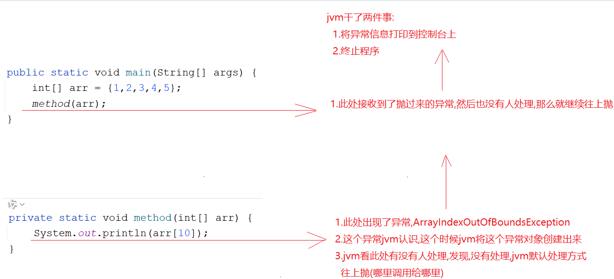

## 3.创建异常对象(了解)

> 我们学这个破玩意儿,是为了故意制造一个异常,方便我们后续学如何处理异常

```java
1.格式:
  throw new 异常对象
```

```java
public class Demo03Exception {
    public static void main(String[] args) {
        String s = "abc.txt1";
        insert(s);
        System.out.println("hahahahaha");
    }

    /**
     * String中的方法:
     *   boolean endsWith(String suffix) -> 判断字符串是否以指定的串儿结尾
     * @param s
     */
    private static void insert(String s) {
        if (!s.endsWith(".txt")){
           //创建异常对象
           //throw new FileNotFoundException();
            throw new NullPointerException();
        }
        System.out.println("hiahiahiahia");
    }
}
```

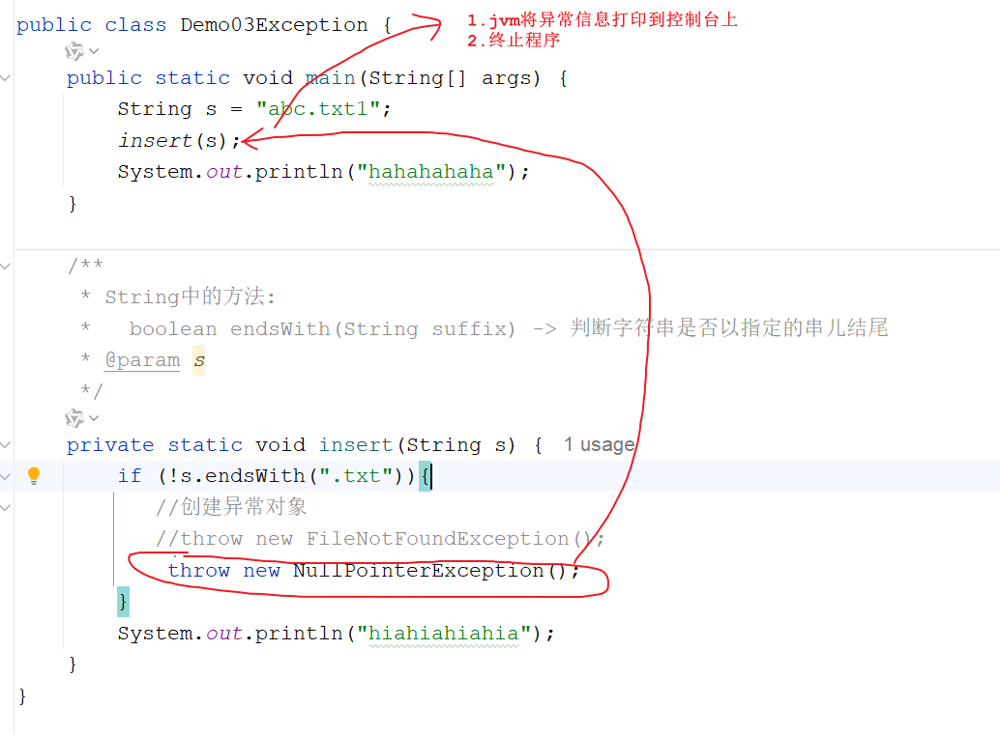

## 4.异常处理方式(重点)

### 1 异常处理方式一_throws

```java
1.格式:在参数后面,方法体前面
      throws 异常
2.注意:
  无脑往上throws,会出现因为一个功能出现问题,导致下面所有的功能都不能用了
```

```java
public class Demo04Exception {
    public static void main(String[] args)throws FileNotFoundException {
        String s = "abc.txt1";
        //添加功能
        insert(s);
        System.out.println("删除功能");
        System.out.println("修改功能");
        System.out.println("查询功能");

    }

    private static void insert(String s)throws FileNotFoundException {
        if (!s.endsWith(".txt")){
           //创建异常对象
           throw new FileNotFoundException();
        }

    }
}

```

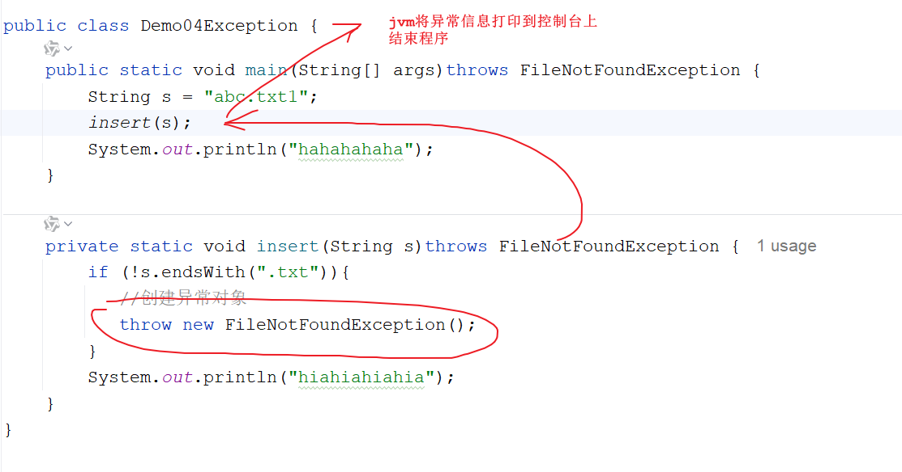

### 2 异常处理方式一_throws多个异常

```java
1.格式:throws 异常1,异常2
2.注意:
  如果处理的多个异常之间,有子父类继承关系,那么我们直接处理父类异常
```

```java
public class Demo05Exception {
    public static void main(String[] args)throws /*FileNotFoundException ,*/ IOException{
        String s = "abc.txt1";
        //添加功能
        insert(s);
        System.out.println("删除功能");
        System.out.println("修改功能");
        System.out.println("查询功能");

    }

    private static void insert(String s) throws /*FileNotFoundException ,*/ IOException{
        if (s==null){
            throw new IOException();
        }
        if (!s.endsWith(".txt")){
           //创建异常对象
           throw new FileNotFoundException();
        }

    }
}
```

### 3.异常处理方式二_try...catch

```java
1.格式:
  try{
      可能出现的异常代码
  }catch(异常类型 对象名){
      异常处理的方案 -> 打印异常信息->以后将异常信息打印到日志文件中
  }

  如果try中的代码有异常,直接走catch捕获,捕获到了相当于处理异常了,没有捕获到,相当于没处理,没处理最后就是给jvm处理
```

```java
public class Demo06Exception {
    public static void main(String[] args) {
        String s = "abc.txt1";
        //添加功能
        try {
            insert(s);
        } catch (FileNotFoundException e) {
            e.printStackTrace();
        }
        System.out.println("删除功能");
        System.out.println("修改功能");
        System.out.println("查询功能");

    }

    private static void insert(String s)throws FileNotFoundException {
        if (!s.endsWith(".txt")){
           //创建异常对象
           throw new FileNotFoundException();
        }

    }
}
```

### 4.异常处理方式二_多个catch

```java
1.格式:
  try{
      可能出现的异常代码
  }catch(异常类型 对象名){
      异常处理的方案 -> 打印异常信息->以后将异常信息打印到日志文件中
  }catch(异常类型 对象名){
      异常处理的方案 -> 打印异常信息->以后将异常信息打印到日志文件中
  }...
2.注意:如果catch的多个异常之间有子父类继承关系,可以直接捕获父类异常
```

```java
 public class Demo07Exception {
    public static void main(String[] args){
        String s = "abc.txt1";
        //添加功能
        try {
            insert(s);
        } catch (IOException e) {
            e.printStackTrace();
        }
        System.out.println("删除功能");
        System.out.println("修改功能");
        System.out.println("查询功能");

    }

    private static void insert(String s) throws FileNotFoundException , IOException{
        if (s==null){
            throw new IOException();
        }
        if (!s.endsWith(".txt")){
           //创建异常对象
           throw new FileNotFoundException();
        }

    }
}

```

> 特点:
>
> 如果成功catch到了异常,不会影响后续的代码执行

> 1.运行时期异常一般不用处理,因为一旦出现运行时期异常,肯定是代码写的有问题,我们只需要修改代码即可
>
> 2.编译时期异常需要处理,如果不处理代码中会有爆红,那么代码不管是否触发异常我们都运行不了
>
> 3.怎么处理: alt+回车
>
> 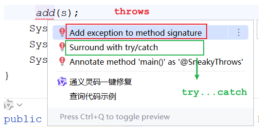

## 5.finally关键字

```java
1.含义:不管异常是否捕获到了,都一定会执行的代码块
2.格式:
  try{
      可能出现的异常代码
  }catch(异常类型 对象名){
      异常处理
  }finally{
      不管是否捕获到异常了,都要执行的代码
  }
3.使用场景:
  关闭资源
```

```java
public class Demo08Exception {
    public static void main(String[] args) {
        String s = "abc.txt1";
        //添加功能
        try {
            int[] arr = null;
            System.out.println(arr.length);//空指针
            insert(s);
        } catch (FileNotFoundException e) {
            e.printStackTrace();
        }finally {
            System.out.println("我一定要执行");
        }
        System.out.println("删除功能");
        System.out.println("修改功能");
        System.out.println("查询功能");

    }

    private static void insert(String s)throws FileNotFoundException {
        if (!s.endsWith(".txt")){
           //创建异常对象
           throw new FileNotFoundException();
        }

    }
}
```

> 使用场景:
>
> ​     finally中的代码一般都是用作释放资源使用->说白了就是咱们的对象只要创建出来,后续代码是否执行成功我们最后都要将其释放,释放内存空间
>
> ​     为啥有的对象需要再finally中手动释放呢?堆内存中的对象,一般都是由GC(垃圾回收器)释放,但是有些对象GC是回收不了的,比如:Socket,IO流,数据库连接对象

```java
public class Demo09Exception {
    public static void main(String[] args) {
        int result = method();
        System.out.println(result);
    }

    public static int method() {
        try {
            String s = null;
            System.out.println(s.length());//空指针异常
            return 2;
        } catch (Exception e) {
            return 1;
            //System.out.println("哈哈哈哈");
        } finally {
            System.out.println("我一定要执行");
            //return 3;
        }
    }
}
```

## 6.抛异常时注意的事项(扩展)

```java
1.父类方法抛异常了,子类重写之后要不要抛? 可抛可不抛
2.父类方法没有抛异常,子类重写之后要不要抛? 不要抛
```

## 7.try_catch和throws的使用时机

```java
1.如果处理异常之后,还想让后续的代码正常执行,我们使用try...catch
2.如果方法之间是递进关系(调用),我们可以先throws,但是到了最后需要用try...catch做一个统一的异常处理
```

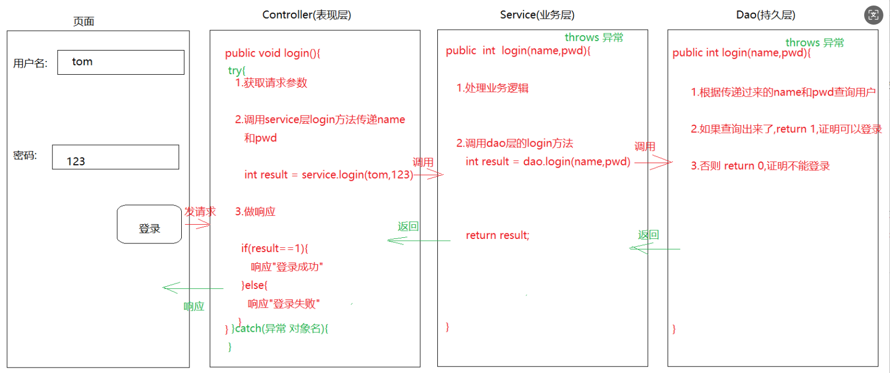

## 8.打印异常信息的三个方法

```java
Throwable中的方法:
  String toString()  打印异常类型以及异常信息
  String getMessage() 获取异常信息
  void printStackTrace() 打印最全的异常信息
```

```java
public class Demo10Exception {
    public static void main(String[] args) {
        String s = "abc.txt1";
        //添加功能
        try {
            insert(s);
        } catch (FileNotFoundException e) {
            e.printStackTrace();
            //System.out.println(e.toString());
            //System.out.println(e.getMessage());
        }
        System.out.println("删除功能");
        System.out.println("修改功能");
        System.out.println("查询功能");

    }

    private static void insert(String s)throws FileNotFoundException {
        if (!s.endsWith(".txt")){
           //创建异常对象
           throw new FileNotFoundException("文件找不到了");
        }

    }
}
```

# 第二章.BigInteger

## 1.BigInteger介绍

```java
1.问题描述:将来我们会遇到超大整数,这个整数大到连long型接收不了,我们跟这种超大整数叫做"对象"
2.BigInteger作用:
  处理超大整数的
```

## 2.BigInteger使用

```java
1.构造:
  BigInteger(String val)  -> 字符串中的内容必须是数字格式
2.方法:
  BigInteger add(BigInteger val)  -> 加法
  BigInteger subtract(BigInteger val) ->减法
  BigInteger multiply(BigInteger val) -> 乘法
  BigInteger divide(BigInteger val)   -> 除法
```

```java
    @Test
    public void test1() {
        // 创建一个BigInteger对象
        BigInteger b1 = new BigInteger("121212121212121212121212121212121212121212");
        // 创建一个BigInteger对象
        BigInteger b2 = new BigInteger("121212121212121212121212121212121212121212");

        //BigInteger add(BigInteger val)  -> 加法
        BigInteger add = b1.add(b2);
        System.out.println(add);
        //BigInteger subtract(BigInteger val) ->减法
        BigInteger subtract = b1.subtract(b2);
        System.out.println(subtract);
        //BigInteger multiply(BigInteger val) -> 乘法
        BigInteger multiply = b1.multiply(b2);
        System.out.println(multiply);
        //BigInteger divide(BigInteger val)   -> 除法
        BigInteger divide = b1.divide(b2);
        System.out.println(divide);
    }
```

> ```java
> int intValue()  -> 将BigInteger转成int型
> long longValue()-> 将BigInteger转成long型
> ```
>
> ```java
> BigInteger接受的范围 -> 42亿的21亿次方 -> 内存扛不住这么大的数,所以我们认为是无限大的
> ```

# 第三章.BigDecimal类

## 1.BigDecimal介绍

```java
1.注意问题:float和double不能直接参与运算的,因为会有精度损失问题
2.解决:BigDecimal可以解决float和double直接参与运算而出现的精度损失问题
```

## 2.BigDecimal使用

```java
1.构造:
  BigDecimal(String s) s必须是数字形式
2.常用方法:
  static BigDecimal valueOf(double val) 根据指定的小数创建BigDecimal对象
  BigDecimal add(BigDecimal val)  -> 加法
  BigDecimal subtract(BigDecimal val) -> 减法
  BigDecimal multiply(BigDecimal val) -> 乘法
  BigDecimal divide(BigDecimal val)   -> 除法

3.注意:
  如果除不尽就会出现:ArithmeticException(算数异常)
```

```java
BigDecimal divide(BigDecimal divisor, int scale, int roundingMode)
                  divisor:除号后面的那个数
                  scale:保留几位小数
                  roundingMode:取舍方式,传递的是BigDecimal的静态成员变量
                               static int ROUND_UP -> 向上加1
                               static int ROUND_DOWN -> 直接舍去
                               static int ROUND_HALF_UP -> 四舍五入
```

```java
    @Test
    public void test2() {
        BigDecimal b1 = BigDecimal.valueOf(3.55);
        BigDecimal b2 = BigDecimal.valueOf(2.12);
        BigDecimal divide = b1.divide(b2, 2, BigDecimal.ROUND_DOWN);
        System.out.println(divide);
    }
```

## 3.BigDecimal除法过时方法解决

```java
BigDecimal divide(BigDecimal divisor, int scale, RoundingMode roundingMode)
                  divisor:除号后面的那个数
                  scale:保留几位小数
                  roundingMode:取舍方式,RoundingMode是一个枚举
                                UP:向上加1
                                DOWN:直接舍去
                                HALF_UP:四舍五入
```

```java
    @Test
    public void test3() {
        BigDecimal b1 = BigDecimal.valueOf(3.55);
        BigDecimal b2 = BigDecimal.valueOf(2.12);
        BigDecimal divide = b1.divide(b2, 2, RoundingMode.DOWN);
        System.out.println(divide);
    }
```

# 第四章.Date日期类

## 1.Date类的介绍

```java
1.概述:代表的是日期类
2.常识:
  a.1秒 = 1000毫秒
  b.时间原点: 1970年1月1日0时0分0秒
  c.时间原点在什么位置上:0度经线(本初子午线)
  d.北京所在经纬度: 东经116.20  北纬39.56 -> 东八区
```

## 2.Date类的使用

```java
Date():表示的当前系统时间
Date(long time):根据设置的时间创建Date对象,从时间原点算
```

```java
    @Test
    public void test01() {
        Date date = new Date();
        System.out.println(date);
        System.out.println("==============");

        Date date1 = new Date(1000L);
        System.out.println(date1);
    }
```

## 3.Date类的常用方法

```java
setTime(long time)设置时间,传递毫秒值,从时间原点开始算
long getTime()获取时间对应的毫秒值
```

```java
    @Test
    public void test02() {
        Date date = new Date();
        long time = date.getTime();
        System.out.println(time);

        date.setTime(1762223929197L);
        System.out.println(date);
    }
```

# 第五章.Calendar日历类

## 1.Calendar介绍

```java
1.概述:日历类,它是一个抽象类
2.获取:
  static Calendar getInstance()

3.月份:
  Calendar中的月份和咱们国家差一个月,所以我们需要+1来表示我们国家的月份

4.方法:
  int get(int field) ->返回给定日历字段的值
  void set(int field, int value)  :将给定的日历字段设置为指定的值
  void add(int field, int amount) :根据日历的规则,为给定的日历字段添加或者减去指定的时间量
  Date getTime():将Calendar转成Date对象
```

```java
    @Test
    public void test01(){
        Calendar calendar = Calendar.getInstance();
        //int get(int field) ->返回给定日历字段的值
        //int year = calendar.get(Calendar.YEAR);
        //System.out.println(year);
        //void set(int field, int value)  :将给定的日历字段设置为指定的值
        calendar.set(Calendar.YEAR, 2020);
        //System.out.println(calendar.get(Calendar.YEAR));
        //void add(int field, int amount) :根据日历的规则,为给定的日历字段添加或者减去指定的时间量
        calendar.add(Calendar.YEAR, 1);
        System.out.println(calendar.get(Calendar.YEAR));
        //Date getTime():将Calendar转成Date对象
        Date date = calendar.getTime();
        System.out.println(date);
    }
```

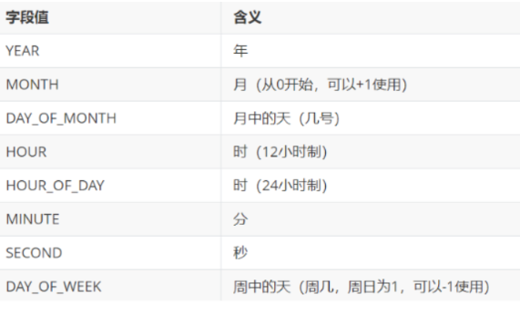


> 扩展方法:
>
> ```java
> void set(int year, int month, int date)
> 需求:规定一个年份,用Calendar去判断该年份的2月有多少天?
> ```
>
> ```java
>  @Test
>  public void test02() {
>      //1.创建Calendar对象
>      Calendar calendar = Calendar.getInstance();
>      /*
>        2.设置一个年份
>          由于Calenar类中的月份从0开始,所以2月为3月
>       */
>      calendar.set(2025,2,1);
>      //3.让日减1
>      calendar.add(Calendar.DATE,-1);
>      //4.获取减1后的结果
>      int day = calendar.get(Calendar.DATE);
>      System.out.println(day);
>  }
> ```

# 第六章.SimpleDateFormat日期格式化类

## 1.SimpleDateFormat介绍

```java
1.概述:日期格式化类
2.作用:
  a.格式化:将Date对象按照指定的格式格式化成String
  b.解析:将符合日期格式的字符串转成Date对象
3.构造:
  SimpleDateFormat(String pattern):传递指定的格式
4.方法:
  a.String format(Date对象) -> 将Date对象按照指定的格式转成String
  b.Date parse(String time) -> 将符合日期格式的字符串转成Date对象
```

| 时间字母表示 | 说明 |
| ------------ | ---- |
| y            | 年   |
| M            | 月   |
| d            | 日   |
| H            | 时   |
| m            | 分   |
| s            | 秒   |

> 表示格式的时候,字母不能改变,但是中间的连接符可以改变

```java
    @Test
    public void test01(){
        SimpleDateFormat sdf = new SimpleDateFormat("yyyy-MM-dd HH:mm:ss");
        String time = sdf.format(new Date());
        System.out.println(time);
    }

    @Test
    public void test02() throws ParseException {
        SimpleDateFormat sdf = new SimpleDateFormat("yyyy-MM-dd HH:mm:ss");
        String time = "2020-05-05 09:09:09";
        Date date = sdf.parse(time);
        System.out.println(date);
    }
```

# 第七章.JDK8新日期类

## 1. LocalDate 本地日期

### 1.1.获取LocalDate对象

```java
1.概述:LocalDate是一个不可变的日期时间对象，表示日期，通常被视为年月日
2.获取:
  static LocalDate now() 从默认时区的系统时钟获取当前日期
  static LocalDate of(int year, int month, int dayOfMonth) -> 创建LocalDate对象,并设置年月日
```

```java
    @Test
    public void test01(){
        LocalDate localDate = LocalDate.now();
        System.out.println(localDate);

        LocalDate localDate1 = LocalDate.of(2020, 10, 10);
        System.out.println(localDate1);
    }
```

### 1.2.LocalDateTime对象

```java
1.概述: LocalDateTime是一个不可变的日期时间对象，代表日期时间，通常被视为年 - 月 - 日 - 时 - 分 - 秒
2.获取:
  static LocalDateTime now()
  static LocalDateTime of(int year, int month, int dayOfMonth, int hour, int minute, int second)
```

```java
    @Test
    public void test02(){
        LocalDateTime local1 = LocalDateTime.now();
        System.out.println(local1);

        LocalDateTime local2 = LocalDateTime.of(2020, 10, 10, 10, 10, 10);
        System.out.println(local2);
    }
```

### 1.3.获取日期字段的方法 : 名字是get开头

```java
int getYear()->获取年份
int getMonthValue()->获取月份
int getDayOfMonth()->获取月中的第几天
```

```java
    @Test
    public void test03(){
        LocalDate localDate = LocalDate.now();
        //int getYear()->获取年份
        System.out.println(localDate.getYear());
        //int getMonthValue()->获取月份
        System.out.println(localDate.getMonthValue());
        //int getDayOfMonth()->获取月中的第几天
        System.out.println(localDate.getDayOfMonth());
    }
```

### 1.4.设置日期字段的方法 : 名字是with开头

```java
LocalDate withYear(int year):设置年份
LocalDate withMonth(int month):设置月份
LocalDate withDayOfMonth(int day):设置月中的天数
```

```java
    @Test
    public void test04(){
        LocalDate localDate = LocalDate.now();
        //LocalDate withYear(int year):设置年份
       // LocalDate local1 = localDate.withYear(2020);
       // System.out.println(local1);
        //LocalDate withMonth(int month):设置月份
       //LocalDate local2 = local1.withMonth(10);
       //System.out.println(local2);
        //LocalDate withDayOfMonth(int day):设置月中的天数
       // LocalDate local3 = local2.withDayOfMonth(10);
       // System.out.println(local3);

        LocalDate local1 = localDate.withYear(2020).withMonth(10).withDayOfMonth(10);
        System.out.println("local1 = " + local1);
    }
```

### 1.5.日期字段偏移

```java
设置日期字段的偏移量,方法名plus开头,向后偏移
设置日期字段的偏移量,方法名minus开头,向前偏移
```

```java
    @Test
    public void test05(){
        LocalDate localDate = LocalDate.now();
        //向后偏移
        //LocalDate localDate1 = localDate.plusYears(-1);
        //System.out.println(localDate1.getYear());

        //向前偏移
        LocalDate localDate1 = localDate.minusYears(1);
        System.out.println(localDate1.getYear());
    }
```

## 2.Period和Duration类

### 2.1 Period 计算日期之间的偏差

```java
1.作用:计算年月日时间偏差
2.方法:
  static Period between(LocalDate d1,LocalDate d2):计算两个日期之间的差值

  getYears()->获取相差的年
  getMonths()->获取相差的月
  getDays()->获取相差的天
```

```java
 @Test
    public void test06(){
        LocalDate local1 = LocalDate.of(2023, 10, 10);
        LocalDate local2 = LocalDate.of(2024, 11, 9);
        Period period = Period.between(local1, local2);
        System.out.println(period.getYears());
        System.out.println(period.getMonths());
        System.out.println(period.getDays());
    }
```

### 2.2 Duration计算时间之间的偏差

```java
1.作用:计算精确时间
2.方法:
  static Duration between(Temporal startInclusive, Temporal endExclusive)  -> 计算时间差

  Temporal是一个接口,常用的实现类:LocalDate,LocalDateTime ,但是Duration是计算精确时间偏差的,所以这里传递能操作时分秒的LocalDateTime对象

3.利用Duration获取相差的时分秒 -> to开头
  toDays() :获取相差天数
  toHours(): 获取相差小时
  toMinutes():获取相差分钟
  toMillis():获取相差秒(毫秒)
```

```java
    @Test
    public void test07(){
        LocalDateTime local1 = LocalDateTime.of(2023, 10, 10, 10, 10, 10);
        LocalDateTime local2 = LocalDateTime.of(2024, 11, 11, 11, 11, 11);
        Duration duration = Duration.between(local1, local2);
        System.out.println(duration.toDays());
        System.out.println(duration.toHours());
        System.out.println(duration.toMinutes());
        System.out.println(duration.toMillis());
    }
```

> 计算年月日:Period
>
> 计算精确时间偏差:Duration

## 3.DateTimeFormatter日期格式化类

```java
1.获取:
  static DateTimeFormatter ofPattern(String pattern)   -> 获取对象,指定格式
2.方法:
  a.String format(TemporalAccessor temporal)-> 将日期对象按照指定的规则转成String
    TemporalAccessor:是一个接口,实现类有LocalDate以及LocalDateTime

  b.TemporalAccessor parse(CharSequence text)-> 将符合规则的字符串转成日期对象

  c.LocalDateTime类中的方法:static LocalDateTime parse(CharSequence text,DateTimeFormatter formatter)-> 将符合规则的字符串转成日期对象
```

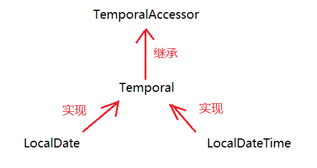

```java
    @Test
    public void test08(){
        DateTimeFormatter dtf = DateTimeFormatter.ofPattern("yyyy-MM-dd HH:mm:ss");
        LocalDateTime localDateTime = LocalDateTime.now();
        String format = dtf.format(localDateTime);
        System.out.println(format);

    }

    @Test
    public void test09(){
        DateTimeFormatter dtf = DateTimeFormatter.ofPattern("yyyy-MM-dd HH:mm:ss");
        //TemporalAccessor temporalAccessor = dtf.parse("2020-10-10 10:10:10");
        //System.out.println(temporalAccessor);
        //LocalDateTime localDateTime = LocalDateTime.from(temporalAccessor);
        //System.out.println(localDateTime);
        LocalDateTime localDateTime = LocalDateTime.parse("2020-10-10 10:10:10", dtf);
        System.out.println(localDateTime);
    }
```

# 第八章.包装类

## 1.基本数据类型对应的引用数据类型(包装类)

```java
1.概述:基本类型对应的那个类
2.为啥要使用包装类:
  当我们调用方法的时候,人家方法的形参或者返回值类型都要求使用包装类,所以我们就需要将基本类型转成包装类去返回,去传参
  而且包装类里面有很多的方法可以去操作我们的数据
```

| 基本类型 | 包装类    |
| -------- | --------- |
| byte     | Byte      |
| short    | Short     |
| int      | Integer   |
| long     | Long      |
| float    | Float     |
| double   | Double    |
| char     | Character |
| boolean  | Boolean   |

## 2.Integer的介绍以及使用

### 2.1.Integer基本使用

```java
1.概述:Integer是int对应的包装类
2.构造:
  Integer(int i)
  Integer(String s) -> s的内容必须是数字格式
3.方法:
  static Integer valueOf(int i)
  static Integer valueOf(String s)
```

```java
 @Test
 public void test01(){
     //构造方法创建Integer对象
     //Integer i1 = new Integer(1);
     //System.out.println("i1 = " + i1);

     //通过静态方法创建Integer对象
     Integer i1 = Integer.valueOf(1);
     System.out.println("i1 = " + i1);

     Integer i2 = Integer.valueOf("11111");
     System.out.println("i2 = " + i2);
 }
```

```java
1.装箱:将基本类型转成对应的包装类 ->调用别人的方法,方法要求我们传递包装类
  static Integer valueOf(int i)

2.拆箱:将包装类转成对应的基本类型 -> 如果需要包装类表示的数据进行运算,就需要转成基本类型
  int intValue()
```

```java
@Test
public void test02(){
   //装箱
    Integer i = Integer.valueOf(10);
    System.out.println("i = " + i);

    //拆箱

    int j = i.intValue();
    System.out.println("j+1 = " + j + 1);
}
```

### 2.2.自动拆箱装箱

```java
将来拆箱和装箱大部分时间是自动的
```

```java
    @Test
    public void test03() {
        Integer i = 10;
        i+=10;
        System.out.println(i);
    }
```

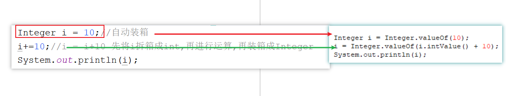

> ```java
> @Test
> public void test04() {
>  Integer i1 = 100;
>  Integer i2 = 100;
>  System.out.println(i1 == i2);//true
>
>  Integer i3 = 200;
>  Integer i4 = 200;
>  System.out.println(i3 == i4);//false
> }
> ```
>
> 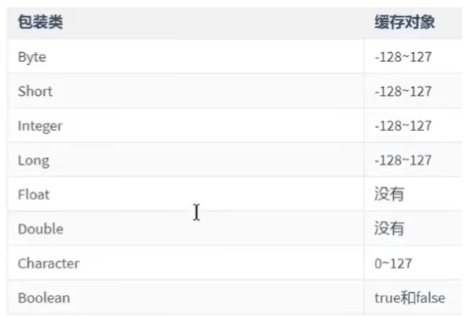

>
>
> ```java
> public static Integer valueOf(int i) {
>  if (i >= IntegerCache.low && i <= IntegerCache.high)
>      return IntegerCache.cache[i + (-IntegerCache.low)];
>  return new Integer(i);
> }
> ```
>
> 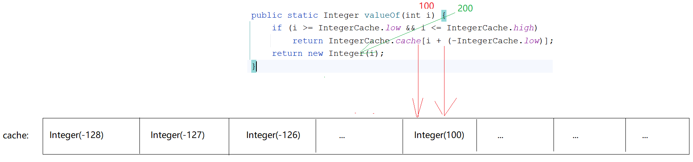

## 3.基本类型和String之间的转换

### 3.1 基本类型往String转

```java
1.方式1: 拼接
2.方式2:String中的静态方法:
       static String valueOf(int i)
```

```java
    @Test
    public void test05() {
        int i = 10;
        String s = i + "";
        System.out.println(s+1);

        System.out.println("===============");

        String s1 = String.valueOf(10);
        System.out.println(s1+1);
    }
```

### 3.2 String转成基本数据类型

```java
每一个包装类中都有一个类似的方法:parseXXX()
```

| 位置    | 方法                                  | 说明                    |
| ------- | ------------------------------------- | ----------------------- |
| Byte    | static byte parseByte(String s)       | 将字符串转成byte类型    |
| Short   | static short parseShort(String s)     | 将字符串转成short类型   |
| Integer | static int parseInt(String s)         | 将字符串转成int类型     |
| Long    | static long parseLong(String s)       | 将字符串转成long类型    |
| Float   | static float parseFloat(String s)     | 将字符串转成float类型   |
| Double  | static double parseDouble(String s)   | 将字符串转成double类型  |
| Boolean | static boolean parseBoolean(String s) | 将字符串转成boolean类型 |

```java
    @Test
    public void test06() {
        int i = Integer.parseInt("10");
        System.out.println(i+1);
    }
```

> ```java
> 1.将来我们定义javabean的时候,里面的属性如果是基本类型的,我们都要将其变成包装类类型
> 2.原因:
> a.包装类中有方法可以直接操作数据
> b.将来我们学框架的时候,人家都要求用包装类型
> c.将来我们的javabean是和数据库表对应的,javabean中的属性值是和表中的数据对应
> 如果表的主键列是主键自增的约束,我们使用包装类类型在添加的数据比较方便
>
> 主键自增长列中的数据在添加的时候不需要我们自己维护
> ```
>
> ```java
> @Data
> @NoArgsConstructor
> @AllArgsConstructor
> public class User {
>  private Integer uid;//null
>  private String username;
>  private String password;
> }
> ```
>
> 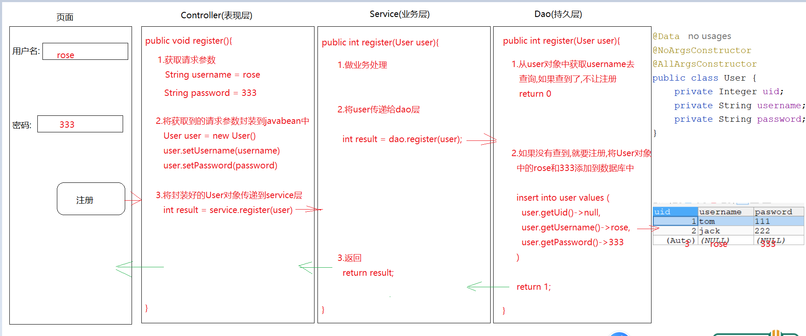
