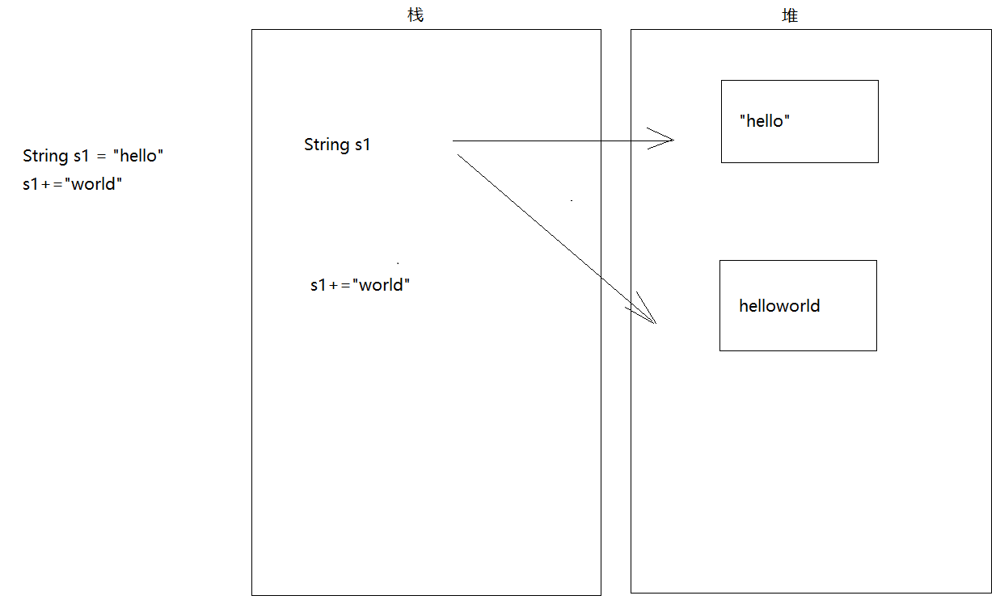
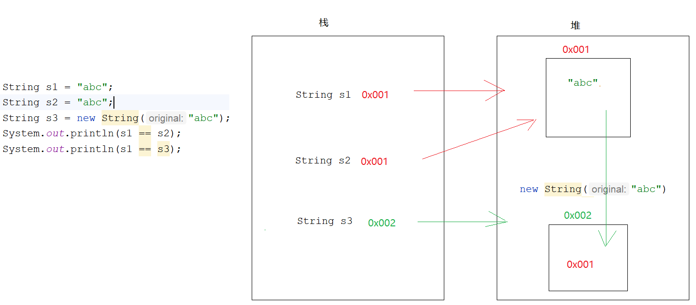

# day13_String_StringBuilder

```java
课前回顾:
  1.异常:
    编译时期异常:语法没有问题,但是一调用方法由于底层给我们抛过来一个异常,导致我们代码爆红
               看异常继承体系,如果继承体系中没有RuntimeException,一定就是编译时期异常
    运行时期异常:语法没有问题,写的时候也没有问题,但是一运行就报错
               看异常继承体系,如果继承体系中有RuntimeException,就一定是运行时期异常
  2.异常的处理:
    a.throws(如果都是throws,会出现如果一个方法触发异常,后面代码不会执行了): throws 异常
              throws 异常1,异常2  -> 多个异常之间如果有子父类继承关系,直接throws父类异常即可
    b.try...catch:(如果一个方法触发了异常,下面的代码不受影响)
      try{
          可能出现异常的代码
      }catch(异常类型 对象名){
          处理异常的代码 -> 将异常放到日志文件中
      }

      try{
          可能出现异常的代码
      }catch(异常类型 对象名){
          处理异常的代码 -> 将异常放到日志文件中
      }catch(异常类型 对象名){
          处理异常的代码 -> 将异常放到日志文件中
      }catch(异常类型 对象名){
          处理异常的代码 -> 将异常放到日志文件中
      }...    -> 如果catch的多个异常之间有子父类继承关系,我们直接catch父类异常

  3.finally:配合try...catch使用
    不管上面是否捕获到异常了,finally中的代码都一定会执行
    使用场景:关闭资源

  4.BigInteger:处理超大整数
    a.构造: BigInteger(String val)
    b.方法: add subtract mutiply divide
  5.BigDecimal:处理float和double 直接参与运算而出现的精度损失问题
    valueof   dd subtract mutiply divide(除不尽会出现算数异常)
    divide(除号后面的BigDecimal,保留几位小数,取舍方式)
  6.Date:日期类
    setTime getTime
  7.Calendar:日历类
    getInstance  get set add getTime
  8.SimpleDateFormat:日期格式化类
    SimpleDateFormat(String pattern) -> 创建对象,指定日期格式
    format  parse
  9.LocalDate:主要操作年月日时间段的
    now  of
  10.LocalDateTime:主操操作年月日时分秒
    now of
  11.获取字段:
     get开头的方法
  12.设置字段:
     with开头的方法
  13.设置偏移量
     plus开头的:向后偏移
     minus开头的:向前偏移
  14.计算时间偏差:
     a.Period:计算年月日的
       between:计算时间偏差的
     b.Duration:计算精确时间
       between:计算时间偏差的
  15.DateTimeFormatter:
     a.获取:ofPattern(指定的格式)
     b.方法:
       format
       parse
  16.包装类:基本类型对应的类
     byte short int long float double char boolean
     Byte Short Integer Long Float Double Character Boolean
  17.以Integer为例
     a.装箱:valueOf
     b.拆箱:intValue
     c.基本类型和String之间的转换:
       基本-> String -> +拼接 -> String中的静态方法valueOf
       String -> 基本  -> parseXXX()
     d.注意:将来我们定义javabean,属性如果是基本类型的我们都将其写成包装类

今日重点:
  1.会String和StringBuilder的常用方法使用
```

# 第一章.String

## 1.String介绍

```java
1.概述:String 类代表字符串
2.特点:
  a.Java 程序中的所有字符串字面值（如 "abc" ）都作为此类的实例(对象)实现
    说白了凡是带双引号的都是String的对象 -> String s = "abc"
  b.字符串是常量,它们的值在创建之后不能更改
    String s1 = "hello"
    s1+="world"
  c.因为 String 对象是不可变的，所以可以共享
    String s1 = "abc"
    String s2 = "abc"
```





## 2.String的实现原理

```java
1.String底层原理:String底层的原始面貌是一个被final修饰的数组,数组一旦被final修饰,地址值直接锁死,不能改变,所以我们说String是不可变的

2.jdk8:private final char[] value -> 一个char类型数据占内存两个字节
  jdk8之后:private final byte[] value -> 一个byte型数据占内存一个字节 -> 所以将char数组改成了byte数组->省内存
```

## 3.String的创建

```java
1.构造:
  a.String() 根据空参构造创建String对象
  b.String(String str) 根据字符串创建String对象
  c.String(byte[] bytes) 根据byte数组创建String对象
  d.String(char[] chars) 根据char数组创建String对象
  e.简化:
    String 变量名 = ""
```

```java
    @Test
    public void test1() {
        //a.String() 根据空参构造创建String对象
        String s1 = new String();
        System.out.println("s1 = " + s1);
        //b.String(String str) 根据字符串创建String对象
        String s2 = new String("abc");
        System.out.println("s2 = " + s2);
        //c.String(byte[] bytes) 根据byte数组创建String对象
        byte[] bytes = {97, 98, 99};
        String s3 = new String(bytes);
        System.out.println("s3 = " + s3);
        //d.String(char[] chars) 根据char数组创建String对象
        char[] chars = {'a', 'b', 'c'};
        String s4 = new String(chars);
        System.out.println("s4 = " + s4);
        //简化形式
        String s5 = "abc";
        System.out.println("s5 = " + s5);
    }
```

```java
扩展构造:
  a.String(byte[] bytes,int offset,int count)-> 将byte数组的一部分转成String
           bytes:代表数组
           offset:从数组的哪个索引开始转
           count:转多少个

  b.String(char[] chars,int offset,int length) -> 将char数组的一部分转成String
           chars:代表数组
           offset:从数组的哪个索引开始转
           length:转多少个

```

```java
    @Test
    public void test2() {
/*        a.String(byte[] bytes,int offset,int count)-> 将byte数组的一部分转成String
        bytes:代表数组
        offset:从数组的哪个索引开始转
        count:转多少个*/

        byte[] bytes = {97, 98, 99, 100,101,102};
        String s1 = new String(bytes, 0, 3);
        System.out.println("s1 = " + s1);

 /*       b.String(char[] chars,int offset,int length) -> 将char数组的一部分转成String
        chars:代表数组
        offset:从数组的哪个索引开始转
        length:转多少个*/
        char[] chars = {'a', 'b', 'c', 'd', 'e', 'f'};
        String s2 = new String(chars, 0, 3);
        System.out.println("s2 = " + s2);
    }
```

# 第二章.String的方法

## 1.判断方法

```java
boolean equals(Objec obj) 判断字符串内容是否一样
boolean equalsIgnoreCase(String str) 判断字符串内容是否一样,忽略大小写
```

```java
    @Test
    public void test3() {
        String s = "abc";
        //boolean equals(Objec obj) 判断字符串内容是否一样
        boolean b = s.equals("abc");
        System.out.println("b = " + b);
        //boolean equalsIgnoreCase(String str) 判断字符串内容是否一样,忽略大小写
        boolean result = "abc".equalsIgnoreCase("aBC");
        System.out.println("result = " + result);
    }
```

> ```java
>     @Test
>     public void test4() {
>         String s = "abc";
>         s = null;
>         //int compareTo(String str) 比较两个字符串
>        /* if (s.equals("abc")){
>             System.out.println("是abc");
>         }else{
>             System.out.println("不是abc");
>         }*/
>
>         if ("abc".equals(s)){
>             System.out.println("是abc");
>         }else{
>             System.out.println("不是abc");
>         }
>     }
> ```
>

## 3.获取功能

```java
1.String concat(String str) 字符串拼接,返回的是新的字符串
2.char charAt(int index) 获取指定索引位置上的字符
3.int indexOf(String str) 获取指定字符在老串儿中第一次出现的索引位置
4.String subString(int beginIndex) 从指定索引开始截取字符串到最后
5.String subString(int beginIndex,int endIndex) 从指定索引位置开始截取到endIndex->含头不含尾
6.int length()获取字符串长度
```

```java
    @Test
    public void test5() {
        String str = "abcdefg";
        //1.String concat(String str) 字符串拼接,返回的是新的字符串
        String newStr1 = str.concat("haha");
        System.out.println("newStr1 = " + newStr1);
        //2.char charAt(int index) 获取指定索引位置上的字符
        char data1 = str.charAt(0);
        System.out.println("data1 = " + data1);
        //3.int indexOf(String str) 获取指定字符在老串儿中第一次出现的索引位置
        int index = str.indexOf("c");
        System.out.println("index = " + index);
        //4.String subString(int beginIndex) 从指定索引开始截取字符串到最后
        String newStr2 = str.substring(2);
        System.out.println("newStr2 = " + newStr2);
        //5.String subString(int beginIndex,int endIndex) 从指定索引位置开始截取到endIndex->含头不含尾
        String newStr3 = str.substring(2,4);
        System.out.println("newStr3 = " + newStr3);
        //6.int length()获取字符串长度
        System.out.println("str.length() = " + str.length());
    }
```

## 4.练习

```java
遍历字符串
```

```java
    @Test
    public void test6() {
        String str = "abcdefg";
        for (int i = 0; i < str.length(); i++){
            System.out.println(str.charAt(i));
        }
    }
```

## 5.转换功能

```java
1.char[] toCharArray()将字符串转成char数组
2.byte[] getBytes()将字符串转成byte数组
3.byte[] getBytes(String charsetName)根据指定的编码集将字符串转成byte数组
4.String replace(CharSequence target, CharSequence replacement) ->将前面参数替换成后面的参数
```

```java
    @Test
    public void test7() throws UnsupportedEncodingException {
        String s = "abcdefg";
        //1.char[] toCharArray()将字符串转成char数组
        char[] chars = s.toCharArray();
        System.out.println(chars);
        //2.byte[] getBytes()将字符串转成byte数组
        byte[] bytes = s.getBytes();
        System.out.println(Arrays.toString(bytes));
        /*
           3.byte[] getBytes(String charsetName)根据指定的编码集将字符串转成byte数组
             ASCII码表:主要针对说英文的人
             GBK:中文字符集 -> 国标码 -> 一个汉字占2个字节
             UTF-8:万国码 -> 一个汉字占3个字节
             idea -> 默认编码集:UTF-8
         */
        byte[] bytes1 = "你".getBytes();//不指定编码表就按照默认的UTF-8走
        System.out.println(Arrays.toString(bytes1));

        byte[] bytes2 = "你".getBytes("GBK");
        System.out.println(Arrays.toString(bytes2));
        //4.String replace(CharSequence target, CharSequence replacement) ->将前面参数替换成后面的参数
        String newStr = "asdfasdfa".replace("a", "z");
        System.out.println("newStr = " + newStr);
    }
```

> ```java
> CharSequence是String的接口
> ```

## 7.练习4

```java
随便给一个字符串,统计该字符串中大写字母字符，小写字母字符，数字字符出现的次数(不考虑其他字符)
```

```java
@Test
    public void test8() {
        //1.定义一个字符串
        String str = "sdfaWERWERWE11231";
        //2.定义三个变量,分别表示大写字母个数,小写字母个数,数字个数
        int big = 0;
        int small = 0;
        int number = 0;
        //3.遍历字符串,将每一个字符都获取出来
        char[] chars = str.toCharArray();
        for (char aChar : chars) {
            if (aChar >= 'A' && aChar <= 'Z'){
                big++;
            }else if (aChar >= 'a' && aChar <= 'z'){
                small++;
            }else if (aChar >= '0' && aChar <= '9'){
                number++;
            }
        }
        System.out.println("大写字母个数 = " + big);
        System.out.println("小写字母个数 = " + small);
        System.out.println("数字个数 = " + number);
    }
```

## 8.分割功能

```java
String[] split(String regex)按照指定的规则分割字符串
```

```java
 @Test
    public void test9() {
        String s = "abc,java,test";
        //String[] split(String regex)按照指定的规则分割字符串
        String[] split = s.split(",");
        for (String s1 : split) {
            System.out.println("s1 = " + s1);
        }

        System.out.println("=========================");
        String s1 = "abc.txt.test";
        String[] split1 = s1.split("\\.");
        for (String s2 : split1) {
            System.out.println("s2 = " + s2);
        }
    }
```

# 第三章.其他方法

```java
1.boolean contains(String s):判断老串中是否包含指定的串儿
2.boolean endsWith(String s):判断是否以指定的串儿结尾
3.boolean startsWith(String s):判断是否以指定的串儿开头
4.String toLowerCase()将字母转成小写
5.String toUpperCase()将字母转成大写
6.String trim()去掉字符串两端空格
```

```java
     @Test
    public void test10() {
        String s = "abcdefg";
        //1.boolean contains(String s):判断老串中是否包含指定的串儿
        System.out.println(s.contains("abc"));
        //2.boolean endsWith(String s):判断是否以指定的串儿结尾
        System.out.println(s.endsWith("g"));
        //3.boolean startsWith(String s):判断是否以指定的串儿开头
        System.out.println(s.startsWith("a"));
        //4.String toLowerCase()将字母转成小写
        System.out.println("DAFDAF".toLowerCase());
        //5.String toUpperCase()将字母转成大写
        System.out.println("sfsd".toUpperCase());
        //6.String trim()去掉字符串两端空格
        System.out.println("  ab c  ".trim());
        System.out.println("  ab c  ".replace(" ", ""));
    }
```

# 第四章. String新特性_文本块

预览的新特性文本块在Java 15中被最终确定下来，Java 15之后我们就可以放心使用该文本块了。

JDK 12引入了Raw String Literals特性，但在其发布之前就放弃了这个特性。这个JEP与引入多行字符串文字（文本块）在意义上是类似的。Java 13中引入了文本块（预览特性），这个新特性跟Kotlin中的文本块是类似的。

**现实问题**

在Java中，通常需要使用String类型表达HTML，XML，SQL或JSON等格式的字符串，在进行字符串赋值时需要进行转义和连接操作，然后才能编译该代码，这种表达方式难以阅读并且难以维护。

文本块就是指多行字符串，例如一段格式化后的XML、JSON等。而有了文本块以后，用户不需要转义，Java能自动搞定。因此，**文本块将提高Java程序的可读性和可写性。**{username:"tom",password="111"}

**目标**

- 简化跨越多行的字符串，避免对换行等特殊字符进行转义，简化编写Java程序。
- 增强Java程序中字符串的可读性。

**举例**

会被自动转义，如有一段以下字符串：

```html
<html>
  <body>
      <p>Hello, 尚硅谷</p>
  </body>
</html>
```

将其复制到Java的字符串中，会展示成以下内容：

```java
"<html>\n" +
"    <body>\n" +
"        <p>Hello, 尚硅谷</p>\n" +
"    </body>\n" +
"</html>\n";
```

即被自动进行了转义，这样的字符串看起来不是很直观，在JDK 13中，就可以使用以下语法了：

```java
"""
<html>
  <body>
      <p>Hello, world</p>
  </body>
</html>
""";
```

使用“”“作为文本块的开始符和结束符，在其中就可以放置多行的字符串，不需要进行任何转义。看起来就十分清爽了。

文本块是Java中的一种新形式，它可以用来表示任何字符串，并且提供更多的表现力和更少的复杂性。

（1）文本块由零个或多个字符组成，由开始和结束分隔符括起来。

- 开始分隔符由三个双引号字符表示，后面可以跟零个或多个空格，最终以行终止符结束。
- 文本块内容以开始分隔符的行终止符后的第一个字符开始。
- 结束分隔符也由三个双引号字符表示，文本块内容以结束分隔符的第一个双引号之前的最后一个字符结束。

以下示例代码是错误格式的文本块：

```java
String err1 = """""";//开始分隔符后没有行终止符,六个双引号最中间必须换行

String err2 = """  """;//开始分隔符后没有行终止符,六个双引号最中间必须换行
```

如果要表示空字符串需要以下示例代码表示：

```java
String emp1 = "";//推荐
String emp2 = """
   """;//第二种需要两行，更麻烦了
```

（2）允许开发人员使用“\n”“\f”和“\r”来进行字符串的垂直格式化，使用“\b”“\t”进行水平格式化。如以下示例代码就是合法的。

```java
String html = """
    <html>\n
      <body>\n
        <p>Hello, world</p>\n
      </body>\n
    </html>\n
   """;
```

（3）在文本块中自由使用双引号是合法的。

```java
String story = """
Elly said,"Maybe I was a bird in another life."

Noah said,"If you're a bird , I'm a bird."
 """;
```

```java
public class Demo14String {
    public static void main(String[] args) {
        String s = "<!DOCTYPE html>\n" +
                "<html lang=\"en\">\n" +
                "<head>\n" +
                "    <meta charset=\"UTF-8\">\n" +
                "    <title>性感涛哥,在线发牌</title>\n" +
                "</head>\n" +
                "<body>\n" +
                "    哈哈哈\n" +
                "</body>\n" +
                "</html>";
        System.out.println(s);

        System.out.println("================================");

        String s1 = """
                <!DOCTYPE html>
                <html lang="en">
                <head>
                    <meta charset="UTF-8">
                    <title>性感涛哥,在线发牌</title>
                </head>
                <body>
                    哈哈哈
                </body>
                </html>
                """;
        System.out.println(s1);
        System.out.println("================================");
    }
}

```

# 第五章.StringBuilder类

## 1.StringBuilder的介绍

```java
1.问题:String每拼接一次都会产生一个新的字符串对象,如果多次拼接,会占用内存,效率低
2.解决:用StringBuilder或者StringBuffer
3.StringBuilder和StringBuffer特点:
  a.底层有一个缓冲区(没有被final修饰的byte数组),拼接的字符串内容,会直接放到数组中,不会随意产生新的字符串对象
    而且底层始终就这一个缓冲区
  b.底层数组默认长度为16
  c.如果超出了数组的长度,会自动扩容(Arrays.copyOf,创建新数组,将老数组元素复制到新数组中去,然后将新数组地址值给老数组)
    如果一次性拼接的字符没有超出默认扩容的范围:默认是2倍+2
    如果一次性拼接的字符超出了默认扩容范围,就按照实际拼接的字符个数扩容
```

## 2.StringBuilder的使用

```java
1.构造方法:
  StringBuilder()
  StringBuilder(String str)
```

```java
    @Test
    public void test01(){
        StringBuilder sb1 = new StringBuilder();
        System.out.println(sb1);
        System.out.println("====================");
        StringBuilder sb2 = new StringBuilder("abc");
        System.out.println(sb2);
    }
```

## 3.StringBuilder的常用方法

```java
1.StringBuilder append(任意类型) 拼接,返回的是StringBuilder自己
2.StringBuilder reverse()字符串翻转,返回的是StringBuilder自己
3.String toString() 将StringBuilder转成String
```

```java
    @Test
    public void test02(){
        StringBuilder sb1 = new StringBuilder("张无忌");
        //StringBuilder sb2 = sb1.append("涛哥");
        //System.out.println(sb1);
        //System.out.println(sb2);
        //System.out.println(sb1 == sb2);
        sb1.append("赵敏");
        //链式调用
        sb1.append("小昭").append("周芷若").append("蛛儿");
        System.out.println(sb1);

        sb1.reverse();
        System.out.println(sb1);

        String s = sb1.toString();
        System.out.println(s);
    }
```

```java
练习: 给一个字符串,判断这个字符串是否是"回文内容"
     abcba
     上海自来水来自海上
     山西运煤车煤运西山

     蝶恋花香花恋蝶
     鱼游水美水游鱼
```

```java
 @Test
    public void test03(){
       String s = "上海自来水来自海上";
       //创建StringBuilder对象
        StringBuilder sb = new StringBuilder(s);
        //翻转
        sb.reverse();
        //将StringBuilder转成String
        String s1 = sb.toString();

        if (s.equals(s1)){
            System.out.println("是回文");
        }else{
            System.out.println("不是回文");
        }
    }
```

> String,StringBuilder以及StringBuffer区别: 背下来
>
> 1.相同点:
>
> ​    三者都可以拼接字符串
>
> 2.不同点:
>
> ​    a.String每拼接一次,都会产生一个新的String对象,占用内存空间,效率低
>
> ​    b.StringBuilder:拼接的过程中不会随意产生新对象.节省内存空间,线程不安全,效率高
>
> ​    c.StringBuffer:拼接的过程中不会随意产生新对象,节省内存空间, 线程安全, 效率低
>
> 3.从拼接效率上来看: StringBuilder>StringBuffer>String

# 第六章.作业

```java
已知用户名和密码，请用程序实现模拟用户登录。总共给三次机会，登录成功输出"登录成功",否则输出"登录失败",如果第三次都没有登录上去,就直接输出"账号冻结"
```

```java
public class Demo04String {
    public static void main(String[] args) {
        //定义两个字符串,表示已经注册的用户
        String username = "admin";
        String password = "1234";

        //创建Scanner对象
        Scanner sc = new Scanner(System.in);
        //循环3次录入用户名和密码
        for (int i = 0; i < 3; i++) {
            System.out.println("请输入用户名:");
            String name = sc.next();
            System.out.println("请输入密码:");
            String pwd = sc.next();
            if (username.equals(name) && password.equals(pwd)) {
                System.out.println("登录成功");
                break;
            } else {
                if (i == 2) {
                    System.out.println("账号冻结");
                } else {
                    System.out.println("用户名或密码错误");
                }
            }
        }
    }
}

```

# 第七章.正则表达式

## 1.正则表达式的概念及演示

```java
1.概述:用于校验规则的一种字符串
2.作用:用于校验字符串内容
3.方法:String中的方法
  boolean matches(String regex)
4.比如:校验一个QQ号(不能以0开头,都是数字,5-15位) -> String s = 12121212
      a.if:s.startsWith("0")
      b.if:遍历s,调用toCharArray(),判断每一个字符是否大于等于'0'&& 小于等于'9'
      c.if:s.length()>=5 && s.length()<=15


  要是用正则表达式:
      s.matches("[1-9][0-9]{4,14}")
```

```java
    @Test
    public void test1() {
        String s = "1212121";
        boolean result01 = s.matches("[1-9][0-9]{4,14}");
        System.out.println("result01 = " + result01);
    }
```

## 2.正则表达式-字符类

```java
java.util.regex.Pattern:正则表达式的编译表示形式。
    正则表达式-字符类:[]表示一个区间,范围可以自己定义
        语法示例：
        1. [abc]：代表a或者b，或者c字符中的一个。
        2. [^abc]：代表除a,b,c以外的任何字符。
        3. [a-z]：代表a-z的所有小写字符中的一个。
        4. [A-Z]：代表A-Z的所有大写字符中的一个。
        5. [0-9]：代表0-9之间的某一个数字字符。
        6. [a-zA-Z0-9]：代表a-z或者A-Z或者0-9之间的任意一个字符。
        7. [a-dm-p]：a 到 d 或 m 到 p之间的任意一个字符
```

```java
        //1.验证字符串是否以h开头,d结尾,中间是aeiou的某一个字符

        //2.验证字符串是否以h开头,d结尾,中间不是aeiou的某一个字符

        //3.验证字符串是否是开头a-z的任意一个小写字母,后面跟ad
```

```java
    @Test
    public void test2() {
        //1.验证字符串是否以h开头,d结尾,中间是aeiou的某一个字符
        boolean result01 = "had".matches("[h][aeiou][d]");
        System.out.println("result01 = " + result01);
        //2.验证字符串是否以h开头,d结尾,中间不是aeiou的某一个字符
        boolean result02 = "had".matches("[h][^aeiou][d]");
        System.out.println("result02 = " + result02);
        //3.验证字符串是否是开头a-z的任意一个小写字母,后面跟ad
        boolean result03 = "aad".matches("[a-z][a][d]");
        System.out.println("result03 = " + result03);
    }
```

## 3.正则表达式-逻辑运算符

```java
 正则表达式-逻辑运算符
        语法示例：
        1. &&：并且
        2. | ：或者
```

```java
        //1.要求字符串是小写字母并且字符不能以[aeiou]开头,后面跟ad

        //2.要求字符是aeiou的某一个字符开头,后面跟ad
```

```java
    @Test
    public void test3() {
        //1.要求字符串是小写字母并且字符不能以[aeiou]开头,后面跟ad
        boolean result01 = "yad".matches("[[a-z]&&[^aeios]][a][d]");
        System.out.println("result01 = " + result01);
        //2.要求字符是aeiou的某一个字符开头,后面跟ad
        boolean result02 = "aad".matches("[a|e|i|o|u][a][d]");
        System.out.println("result02 = " + result02);
    }
```

## 4.正则表达式-预定义字符

```java
 正则表达式-预定义字符
    语法示例：
    1. "." ： 匹配任何字符。(重点)  不能加[]
    2. "\\d"：任何数字[0-9]的简写；(重点)
    3. "\\D"：任何非数字[^0-9]的简写；
    4. "\\s"： 空白字符：[ \t\n\x0B\f\r] 的简写
    5. "\\S"： 非空白字符：[^\s] 的简写
    6. "\\w"：单词字符：[a-zA-Z_0-9]的简写(重点)
    7. "\\W"：非单词字符：[^\w]
```

```java
        //1.验证字符串是否是三位数字


        //2.验证手机号: 1开头 第二位3 5 8 剩下的都是0-9的数字


        //3.验证字符串是否以h开头,d结尾,中间是任意一个字符

```

```java
    @Test
    public void test4() {
        //1.验证字符串是否是三位数字
        //boolean result01 = "111".matches("[0-9][0-9][0-9]");
        boolean result01 = "111".matches("\\d\\d\\d");
        System.out.println("result01 = " + result01);

        //2.验证手机号: 1开头 第二位3 5 8 剩下的都是0-9的数字
        boolean result02 = "13838381438".matches("[1][358]\\d\\d\\d\\d\\d\\d\\d\\d\\d");
        System.out.println("result02 = " + result02);

        //3.验证字符串是否以h开头,d结尾,中间是任意一个字符
        boolean result03 = "had".matches("[h].[d]");
        System.out.println("result03 = " + result03);
    }
```

## 5. 正则表达式-数量词

```java
 正则表达式-数量词
        语法示例：x代表字符
        1. X? : x出现的数量为 0次或1次
        2. X* : x出现的数量为 0次到多次 任意次
        3. X+ : x出现的数量为 1次或多次 X>=1次
        4. X{n} : x出现的数量为 恰好n次 X=n次
        5. X{n,} : x出现的数量为 至少n次 X>=n次  x{3,}
        6. X{n,m}: x出现的数量为 n到m次(n和m都是包含的)   n=<X<=m
```

```java
        //1.验证字符串是否是三位数字


        //2.验证手机号: 1开头 第二位3 5 8 剩下的都是0-9的数字


        //3.验证qq号:  不能是0开头,都是数字,长度为5-15

```

```java
    @Test
    public void test5() {
        //1.验证字符串是否是三位数字
        boolean result01 = "111".matches("\\d{3}");
        System.out.println("result01 = " + result01);

        //2.验证手机号: 1开头 第二位3 5 8 剩下的都是0-9的数字
        boolean result02 = "13838381438".matches("[1][358]\\d{9}");
        System.out.println("result02 = " + result02);

        //3.验证qq号:  不能是0开头,都是数字,长度为5-15
        boolean result03 = "12345678901".matches("[1-9]\\d{4,14}");
        System.out.println("result03 = " + result03);
    }
```

## 6.正则表达式-分组括号( )

```java
正则表达式-分组括号( )  (abc)
```

```java
    @Test
    public void test6() {
        boolean result01 = "abcabcabcabc".matches("(abc)*");
        System.out.println("result01 = " + result01);
    }
```

## 7.String类中和正则表达式相关的方法

```java
 String类中和正则表达式相关的方法
        boolean matches(String regex) 判断字符串是否匹配给定的正则表达式。
        String[] split(String regex) 根据给定正则表达式的匹配拆分此字符串。
        String replaceAll(String regex, String replacement)把满足正则表达式的字符串,替换为新的字符
```

```java
    @Test
    public void test7() {
        //String[] split(String regex) 根据给定正则表达式的匹配拆分此字符串。
        String[] arr1 = "abc haha  hehe".split(" +");
        System.out.println("arr1 = " + Arrays.toString(arr1));
        //String replaceAll(String regex, String replacement)把满足正则表达式的字符串,替换为新的字符
        String newStr = "abc haha  heihie   xixi".replaceAll(" +", "z");
        System.out.println("newStr = " + newStr);
    }
```

## 8.正则表达式生成网址:

```html
https://www.sojson.com/regex/generate
```

# 第八章.File对象

## 1.File类

```java
1.计算机常识:
  a.F:\idea\io\10.jpg,其中10.jpg一定是图片嘛?不一定,有可能是文件夹
  b.F:\idea\io\10.jpg,10.jpg的父路径是谁?    F:\idea\io
  c.路径分隔符(路径和其他路径之间的分隔符) ;
  d.路径名称分隔符(一个路径中文件夹和文件夹或者文件夹和文件之间的分隔符)
    windows:\
    linux: /
    max os: /
  e.什么叫做文本文档?->用记事本开发之后,人能看懂的内容,才叫文本文档
    .txt  .java .css .html
```

```java
1.File概述:代表的是文件或者文件夹路径的抽象表示形式
2.翻译:
  File就代表的是文件对象或者文件夹对象,我们在new File的时候要指定文件或者文件夹的路径,最后路径定到哪里,这个File就代表什么
```

## 2.File的静态成员

```java
1.static String pathSeparator : 与系统有关的路径分隔符
2.static String separator    :与系统有关的路径名称分隔符
```

```java
    @Test
    public void test1() {
        String pathSeparator = File.pathSeparator;
        System.out.println("pathSeparator = " + pathSeparator);

        String separator = File.separator;
        System.out.println("separator = " + separator);

        //写一个正确的路径
        //String path = "F:\\idea\\io";
        String path = "F:"+File.separator+"idea"+File.separator+"io";
        System.out.println(path);
    }
```

## 3.File的构造方法

```java
File(String pathname)  根据所填写的路径创建File对象
                       pathname:直接指定路径
```

```java
    @Test
    public void test2() {
        File file = new File("F:\\idea\\io\\10.jpg");
        System.out.println(file);
    }
```

> 指定的路径可以不存在,但是指定不存在的路径没意义

## 4.File的获取方法

```java
String getAbsolutePath() -> 获取File的绝对路径->带盘符的路径
String getPath() ->获取的是封装路径->new File对象的时候写的啥路径,获取的就是啥路径
String getName()  -> 获取的是文件或者文件夹名称
long length() -> 获取的是文件的长度 -> 文件的字节数
```

```java
    @Test
    public void test3() {
        File file = new File("F:\\idea\\io\\10.jpg");
        //String getAbsolutePath() -> 获取File的绝对路径->带盘符的路径
        String absolutePath = file.getAbsolutePath();
        System.out.println("absolutePath = " + absolutePath);
        //String getPath() ->获取的是封装路径->new File对象的时候写的啥路径,获取的就是啥路径
        String path = file.getPath();
        System.out.println("path = " + path);
        //String getName()  -> 获取的是文件或者文件夹名称
        String name = file.getName();
        System.out.println("name = " + name);
        //long length() -> 获取的是文件的长度 -> 文件的字节数
        long length = file.length();
        System.out.println("length = " + length);
    }
```

## 5.File的创建方法

```java
boolean createNewFile()  -> 创建文件
        如果要创建的文件之前有,创建失败,返回false
        如果要创建的文件之前没有,创建成功,返回true

boolean mkdirs() -> 创建文件夹(目录)既可以创建多级文件夹,还可以创建单级文件夹
        如果要创建的文件夹之前有,创建失败,返回false
        如果要创建的文件夹之前没有,创建成功,返回true
```

```java
  @Test
    public void test4() throws IOException {
        File file = new File("F:\\idea\\io\\1.txt");
        //boolean createNewFile()  -> 创建文件
        //如果要创建的文件之前有,创建失败,返回false
        //如果要创建的文件之前没有,创建成功,返回true
        System.out.println(file.createNewFile());


        File file1 = new File("F:\\idea\\io\\heihei\\haha");
        //boolean mkdirs() -> 创建文件夹(目录)既可以创建多级文件夹,还可以创建单级文件夹
        //如果要创建的文件夹之前有,创建失败,返回false
        //如果要创建的文件夹之前没有,创建成功,返回true
        System.out.println(file1.mkdirs());
    }
```

## 6.File类的删除方法

```java
boolean delete()->删除文件或者文件夹

注意:
  1.如果删除文件,不走回收站
  2.如果删除文件夹,必须是空文件夹,而且也不走回收站
```

```java
@Test
public void test5() {
    File file = new File("F:\\idea\\io\\heihei");
    System.out.println(file.delete());
}
```

## 7.File类的判断方法

```java
boolean isDirectory() -> 判断是否为文件夹
boolean isFile()  -> 判断是否为文件
boolean exists()  -> 判断文件或者文件夹是否存在
```

```java
    @Test
    public void test6() {
        File file = new File("F:\\idea\\io\\8.jpg");
        //boolean isDirectory() -> 判断是否为文件夹
        System.out.println(file.isDirectory());
        //boolean isFile()  -> 判断是否为文件
        System.out.println(file.isFile());
        //boolean exists()  -> 判断文件或者文件夹是否存在
        System.out.println(file.exists());
    }
```

## 8.File的遍历方法

```java
File[] listFiles()-> 遍历指定的文件夹,返回的是File数组
```

```java
    @Test
    public void test7() {
        File file = new File("F:\\idea\\io");
        File[] files = file.listFiles();
        for (File f : files) {
            System.out.println(f);
        }
    }
```

## 9.相对路径和绝对路径

```java
1.绝对路径:带盘符的叫做绝对路径 -> 跨盘符访问
2.相对路径:不带盘符的路径 -> 不跨盘符访问

3.在idea中怎么写相对路径:从模块名开始写
  参照路径:当前project的绝对路径
          哪个路径是参照路径,哪个路径就可以省略
```
