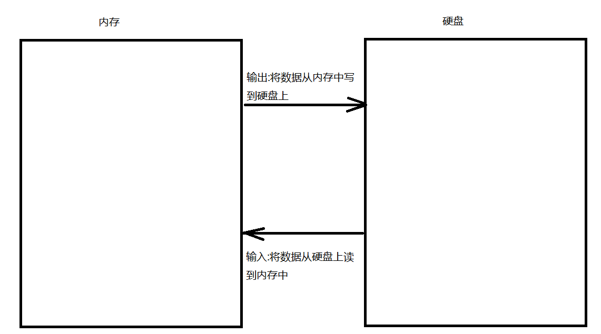
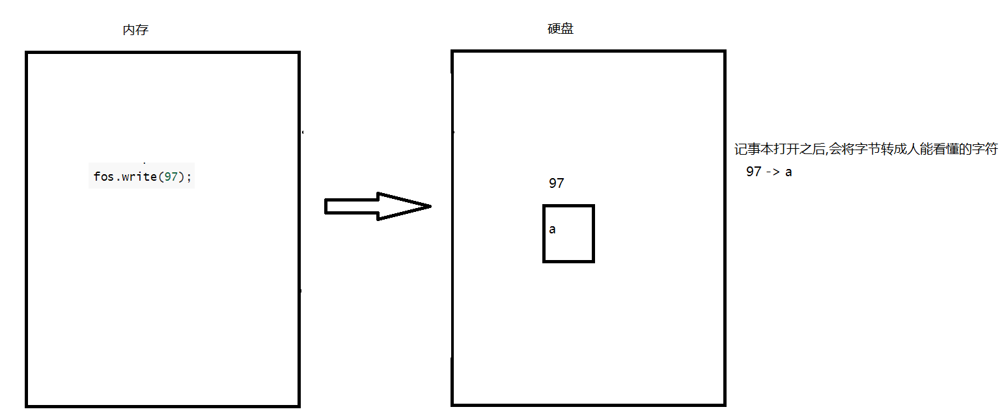
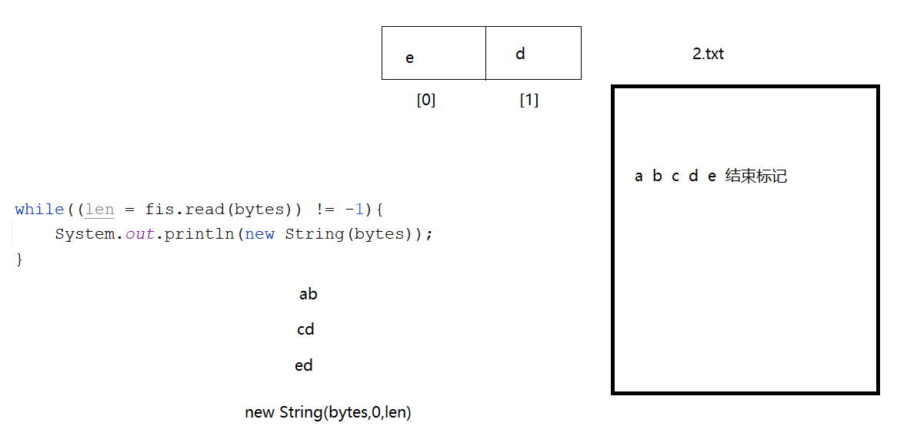
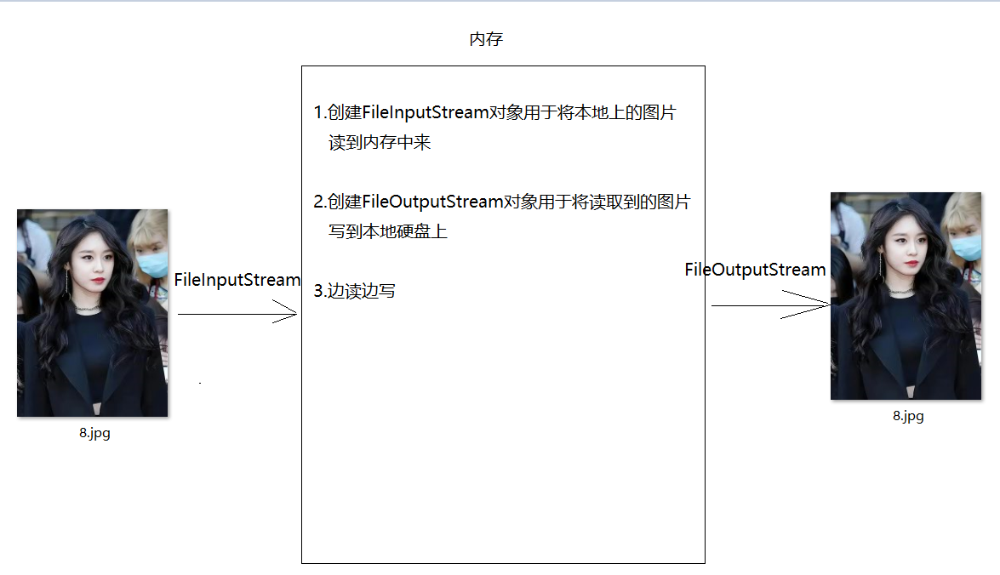
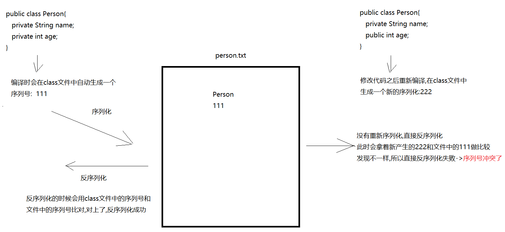

# 	day14.IO流

```java
课前回顾:
  1.枚举:
    a.定义:public enum 枚举类{}
    b.成员:直接写名字 -> 默认是public static final修饰的
    c.构造:必须是私有的
  2.Record:常量类,里面的成员都是final
           自动编译出有参构造,get方法,toString,equals等
  3.密封类:给子类定义一个范围
  4.Object:所有类的根类
    a.toString方法:直接输出对象名会默认走toString方法的结果
                  如果重写,直接输出对象名会输出对象的内容
    b.equals方法:比较对象的地址值
                如果重写,会比较对象的内容
  5.异常:
    编译时期异常:语法没有错误,调用某个方法,就爆红 -> Exception以及子类(除了RuntimeException以及子类)
    运行时期异常:语法没有错误,编译不报错,但是运行就报错 -> RuntimeException以及子类
  6.处理异常:
    a.throws:往上抛,如果一直往上抛,会因为一个方法出现问题导致后面的代码都废了
    b.try...catch:捕获异常,如果捕获到了,相当于处理了,如果没有捕获到,相当于没处理
                  如果捕获到了,即使这个方法出现了问题,也不影响后面的方法
    c.finally:不管是否异常捕获到了,都会执行的代码块
              主要用于关闭资源使用

今日重点:
  1.能分清输入输出流->两个流向
  2.会四大基本流对象进行数据的读写
  3.会使用序列化流读写对象
```

# 第一章.字节流

## 1.IO流介绍以及输入输出以及流向的介绍

```java
1.IO流概述:将数据从一个设备上传输到另外一个设备上的技术

  I:Input -> 输入
  O:Output -> 输出

2.分清楚流向
  a.从专业角度去说:这个IO流流向是相对的 -> 谁发谁是输出一方,谁收谁就是输入一方
  b.从se角度来说:找个参照物(内存):
    从内存出发,利用代码将数据写到硬盘的文件中  -> 输出-> 写数据
    将数据从硬盘的文件中读回到内存中 -> 输入  -> 读数据
```



## 2.IO流分类

```java
1.字节流:一切皆字节,字节流是万能流(侧重说得是文件复制)

        OutputStream:抽象类 -> 字节输出流
        InputStream:抽象类  -> 字节输入流

2.字符流:专门玩儿文本文档的

        Writer:抽象类  -> 字符输出流
        Reader:抽象类  -> 字符输入流
```

> IO流四大基类:
>
> OutputStream
>
> InputStream
>
> Writer
>
> Reader

## 4.OutputStream中子类[FileOutputStream]的介绍以及方法的简单介绍

```java
1.概述:OutputStream->字节输出流 -> 抽象类
2.子类:FileOutputStream
3.作用:写数据
4.构造:
  FileOutputStream(File file)
  FileOutputStream(String path)
5.方法:
  write(int i)一次写一个字节
  write(byte[] bytes)一次写一个字节数组
  write(byte[] bytes,int offset,int count)一次写一个字节数组一部分
        bytes:写的字节数组
        offset:从数组的哪个索引开始写
        count:写多少个
  close()关流
6.特点:
  如果指定的文件不存在,会自动创建新的;而且每次都会自动创建一个新的文件
```

```java
    /**
     *  write(int i)一次写一个字节
     * 创建一个文件，并把数据写入到文件中
     */
    private static void method01()throws Exception {
        FileOutputStream fos = new FileOutputStream("day13_IO/1.txt");
        fos.write(97);
        fos.close();
    }
```



```java
    /**
     * write(byte[] b)一次写一个字节数组
     *
     * String中有一个方法:  byte[] getBytes()
     */
    private static void method02()throws Exception{
        FileOutputStream fos = new FileOutputStream("day13_IO/1.txt");
        //byte[] bytes = {97,98,99,100};
        byte[] bytes = "你好吗".getBytes();
        //System.out.println(Arrays.toString( bytes));
        fos.write(bytes);
        fos.close();
    }

```

```java
    /**
     *   write(byte[] bytes,int offset,int count)一次写一个字节数组一部分
     *         bytes:写的字节数组
     *         offset:从数组的哪个索引开始写
     *         count:写多少个
     */
    private static void method03()throws Exception {
        FileOutputStream fos = new FileOutputStream("day13_IO/1.txt");
        byte[] bytes = "abcdefg".getBytes();
        fos.write(bytes,1,3);
        fos.close();
    }
```

```java
1.注意:输出流默认情况下每次运行都会重新创建一个新的文件,覆盖老文件
2.续写追加:
  FileOutputStream(String path,boolean append)
                               append为true -> 续写追加

3.换行符:
  window: \r\n
  linux:\n
  mac os: \r
```

```java
    /**
     *   FileOutputStream(String path,boolean append)
     *                                append为true -> 续写追加
     */
    private static void method04()throws Exception {
        FileOutputStream fos = new FileOutputStream("day13_IO/1.txt",true);
        fos.write("春种一粒粟\r\n".getBytes());
        fos.write("秋收万颗子\r\n".getBytes());
        fos.write("四海无闲田\r\n".getBytes());
        fos.write("农夫犹饿死\r\n".getBytes());
        fos.close();
    }
```

## 5.InputStream子类[FileInputStream]的介绍以及方法的使用

```java
1.概述:InputStream->字节输入流 -> 抽象类
2.子类:FileInputStream
3.作用:读数据
4.构造:
  FileInputStream(File file)
  FileInputStream(String path)
5.方法:
  int read() 一次读一个字节,返回的是读取的字节
  int read(byte[] bytes) 一次读一个字节数组,返回的是读取的个数
  int read(byte[] bytes,int offset,int count) 一次读一个字节数组一部分,返回的读取的个数
           bytes:读取的数组
           offset:从数组的哪个索引开始读
           count:读多少个


  close()关闭资源
```

## 6.一次读取一个字节

```java
    /**
     * int read() 一次读一个字节,返回的是读取的字节
     */
    private static void method01()throws Exception {
        FileInputStream fis = new FileInputStream("day13_IO/2.txt");
       /* int data1 = fis.read();
        System.out.println(data1);
        int data2 = fis.read();
        System.out.println(data2);
        int data3 = fis.read();
        System.out.println(data3);
        int data4 = fis.read();
        System.out.println(data4);
        int data5 = fis.read();
        System.out.println(data5);

        int data6 = fis.read();
        System.out.println(data6);

        int data7 = fis.read();
        System.out.println(data7);*/
        //定义一个变量来接收读取的字节
        int len = 0;
        while((len = fis.read())!=-1){
            System.out.println((char) len);
        }
        fis.close();
    }
```

> 1.流中的数据读完之后,就不能再继续读了,如果还想重新读,就再new一个对象
>
> 2.读取的过程中,不要连续写多个read
>
> 3.流关闭之后,不能再次使用,否则会报错
>
> ```java
> Exception in thread "main" java.io.IOException: Stream Closed
> 	at java.base/java.io.FileInputStream.read0(Native Method)
> 	at java.base/java.io.FileInputStream.read(FileInputStream.java:228)
> 	at com.atguigu.b_input.Demo01FileInputStream.method01(Demo01FileInputStream.java:37)
> 	at com.atguigu.b_input.Demo01FileInputStream.main(Demo01FileInputStream.java:7)
> ```

## 7.一次读取一个字节数组以及过程

```java
     /**
     * int read(byte[] bytes) 一次读一个字节数组,返回的是读取的字节个数
     * byte数组:起到了一个类似于缓冲区的作用
     *         先将要读的内容放到数组中,然后我们从数组中获取
     *         数组长度定多少,每次就读取多少个字节
     *         如果剩余的字节不够数组的长度了,那么剩多少读多少
     *
     *         将来数组一般都定义成1024或者1024的倍数
     *
     * String中的构造:
     *    String(byte[] bytes) 将字节数组转成字符串
     *    String(byte[] bytes,int offset,int len) 将字节数组的一部分转成字符串
     *
     * @throws Exception
     */
    private static void method02() throws Exception {
        FileInputStream fis = new FileInputStream("day13_IO/2.txt");
        byte[] bytes = new byte[1024];
        /*int len1 = fis.read(bytes);
        System.out.println(len1);

        int len2 = fis.read(bytes);
        System.out.println(len2);

        int len3 = fis.read(bytes);
        System.out.println(len3);

        int len4 = fis.read(bytes);
        System.out.println(len4);*/

        //定义一个变量,接收读取的个数
        int len = 0;
        while((len = fis.read(bytes)) != -1){
            System.out.println(new String(bytes,0,len));
        }
        fis.close();
    }
```

> 

## 8.字节流实现图片复制分析



## 9.字节流实现图片复制代码实现

```java
public class Demo02Copy {
    public static void main(String[] args)throws Exception {
       //1.创建FileInputStream,读取本地上的图片
        FileInputStream fis = new FileInputStream("F:\\idea\\io\\8.jpg");
        //2.创建FileOutputStream,将图片写到指定位置
        FileOutputStream fos = new FileOutputStream("F:\\idea\\io\\8_copy.jpg");
        //3.创建数组
        byte[] bytes = new byte[1024];
        //4.边读边写
        int len = 0;
        while ((len = fis.read(bytes)) != -1) {
            fos.write(bytes,0,len);
        }
        //5.释放资源->先开的后关
        fos.close();
        fis.close();
    }
}
```

# 第二章.字符流

## 1.字节流读取中文的问题

```java
1.注意:
  a.一个汉字在GBK中,占2个字节
  b.一个汉字在UTF-8中,占3个字节
2.字节流是万能流,但是侧重文件复制,不要边读边看,因为整不好读取的汉字就不完整了,出来就是乱码
  不管编码和解码是否一致,用字节流读取中文,边读边看,整不好都会出现乱码
3.解决:
  我们将文本文档中的内容看成一个一个的字符,按照字符就操作就行了 -> 字符流
```

> 注意:
>
> ​    字符流读取文本文档,如果编码和解码不一致,也会出现乱码
>
> ​    但是用字符流读取文本文档,在编码和解码一致的情况下是不会出现乱码的

## 2.FileReader的介绍以及使用

```java
1.概述:Reader -> 字符输入流 -> 抽象类
2.子类: FileReader
3.作用:读数据
4.构造:
  FileReader(File file)
  FileReader(String path)
5.方法:
  int read() 一次读一个字符,返回读取的内容
  int read(char[] chars) 一次读一个字符数组,返回的是读取的个数
  close()关流
```

```java
  /**
     * int read() 一次读一个字符,返回读取的内容
     * @throws Exception
     */
    private static void method01()throws Exception{
        FileReader fr = new FileReader("day13_IO/3.txt");
        //定义变量,接受读取的字符
        int len = 0;
        while((len = fr.read()) != -1){
            System.out.print((char)len);
        }
        fr.close();
    }
```

```java
    /**
     * int read(char[] chars) 一次读一个字符数组,返回的是读取的个数
     *
     * String中的构造
     *   String(char[] chars,int offset,int len) -> 将字符数组的一部分转成String
     */
    private static void method02()throws Exception {
        FileReader fr = new FileReader("day13_IO/3.txt");
        char[] chars = new char[1024];
        //定义一个变量,接受读取的字符个数
        int len = 0;
        while((len = fr.read(chars)) != -1){
            System.out.print(new String(chars,0,len));
        }
        fr.close();

    }
```

## 3.FileWriter的介绍以及使用

```java
1.概述:Writer->字符输出流 -> 抽象类
2.子类:FileWriter
3.作用:写数据
4.构造:
  FileWriter(File file)
  FileWriter(String path)
  FileWriter(String path,boolean append) 续写追加
5.方法:
  write(String str) 一次写一个字符串
  close()关流
  flush()刷新缓冲区
6.注意:
  字符输出流底层自带一个缓冲区,我们需要将写的数据从缓冲区中刷到文件中
```

```java
public class Demo01FileWriter {
    public static void main(String[] args)throws Exception{
        FileWriter fw = new FileWriter("day13_IO/4.txt");
        fw.write("锄禾日当午\r\n");
        fw.write("汗滴禾下土\r\n");
        fw.write("谁知盘中餐\r\n");
        fw.write("粒粒皆辛苦\r\n");
        //fw.flush();
        fw.close();
    }
}
```

## 4.FileWriter的刷新功能和关闭功能

```java
1.flush():将数据从缓冲区中刷到文件中,但是没有关闭流对象,所以流对象后续还能使用
2.close():先刷新,后关闭,close之后流对象不能使用了
```

```java
public class Demo01FileWriter {
    public static void main(String[] args)throws Exception{
        FileWriter fw = new FileWriter("day13_IO/4.txt");
        fw.write("锄禾日当午\r\n");
        fw.write("汗滴禾下土\r\n");
        fw.write("谁知盘中餐\r\n");
        fw.write("粒粒皆辛苦\r\n");
        //fw.flush();
        fw.close();
        //fw.write("hahahaha");
    }
}

```

## 5.IO异常处理的方式

```java
public class Demo02FileWriter {
    public static void main(String[] args) {
        FileWriter fw = null;
        try {
            fw = new FileWriter("day13_IO/4.txt");
            fw.write("中国");
        } catch (Exception e) {
            e.printStackTrace();
        } finally {
            //如果fw不为null才要close,如果是null没必要close
            if (fw != null) {
                try {
                    fw.close();
                } catch (IOException e) {
                    e.printStackTrace();
                }
            }

        }
    }
}
```

## 6.JDK7之后io异常处理方式

```java
1.格式:
  try(newIO流对象){
      可能出现异常的代码
  }catch(异常类型 对象名){
      异常处理
  }

2.自动关流
```

```java
public class Demo03FileWriter {
    public static void main(String[] args) {
        try(FileWriter fw = new FileWriter("day13_IO/4.txt")){
            fw.write("中国");
        }catch (IOException e){
            e.printStackTrace();
        }
    }
}
```

## 7.JDK9之后的IO异常处理方式

之前我们讲过JDK 1.7引入了trywith-resources的新特性，可以实现资源的自动关闭，此时要求：

- 该资源必须实现java.io.Closeable接口
- 在try子句中声明并初始化资源对象
- 该资源对象必须是final的

```java
try(IO流对象1声明和初始化;IO流对象2声明和初始化){
    可能出现异常的代码
}catch(异常类型 对象名){
    异常处理方案
}
```

JDK1.9又对trywith-resources的语法升级了

- 该资源必须实现java.io.Closeable接口
- 在try子句中声明并初始化资源对象，也可以直接使用已初始化的资源对象
- 该资源对象必须是final的

```java
IO流对象1声明和初始化;
IO流对象2声明和初始化;

try(IO流对象1;IO流对象2){
    可能出现异常的代码
}catch(异常类型 对象名){
    异常处理方案
}
```

```java
public class Demo04FileWriter {
    public static void main(String[] args)throws Exception {
        FileWriter fw = new FileWriter("day13_IO/4.txt");
        try(fw){
            fw.write("中国");
        }catch (IOException e){
            e.printStackTrace();
        }
    }
}
```

# 第三章.序列化流&打印流

## 1.序列化流

```java
1.概述:用于读写对象的技术->对象中也携带了很多数据,我们就可以将对象永久保存起来,用的时候将对象读取出来,获取里面的数据
2.分类:
  a.序列化流:写对象 -> ObjectOutputStream
  b.反序列化流:读对象 -> ObjectInputStream
```

### 1.1.序列化流

```java
1.概述:ObjectOutputStream
2.作用:写对象
3.构造:
  ObjectOutputStream(OutputStream os)
4.方法:
  writeObject(对象)
5.注意:
  想要序列化成功,对象需要实现序列化接口Serializable
```

```java
public class Person implements Serializable {
    private String name;
    private int age;

    public Person() {
    }
    public Person(String name, int age) {
        this.name = name;
        this.age = age;
    }

    public String getName() {
        return name;
    }

    public void setName(String name) {
        this.name = name;
    }

    public int getAge() {
        return age;
    }

    public void setAge(int age) {
        this.age = age;
    }
}

```

```java
    /**
     * 序列化流
     */
    private static void write()throws Exception {
        ObjectOutputStream oos = new ObjectOutputStream(new FileOutputStream("day14_API/person.txt"));
        Person p = new Person("张三", 18);
        oos.writeObject(p);
        oos.close();
    }
```

### 1.2.反序列化流

```java
1.概述:ObjectInputStream
2.作用:读对象
3.构造:
  ObjectInputStream(InputStream is)
4.方法:
  Object readObject()
```

```java
    /**
     * 反序列化流
     */
    private static void read() throws Exception{
        ObjectInputStream ois = new ObjectInputStream(new FileInputStream("day14_API/person.txt"));
        Object o = ois.readObject();
        Person p = (Person) o;
        System.out.println(p);
        ois.close();
    }
```

### 1.3.序列号冲突问题

```java
1.如果我们修改了对象中的代码,没有重新序列化,直接反序列化,会出现序列号冲突问题
2.解决:直接将序列号定死
      定一个public static final变量,给一个值

      public static final long serialVersionUID = 1L;
```



## 2.打印流

### 2.1.PrintStream基本使用

```java
1.概述:PrintStream extends OutputStream
2.作用:将数据打印到控制台上或者打印到指定文件中
3.构造:
  PrintStream(String path)
4.方法:
  println():原样输出,自带换行效果
  print():原样输出,不带换行效果
```

```java
    private static void method01()throws Exception {
        PrintStream ps = new PrintStream("day14_API/print.txt");
        ps.println("hello world");
        ps.println(123);
        ps.close();
    }
```

```java
1.改变流向:System.out.println()这句话会将输出结果打印到控制台上,我们需要让这句话从控制台输出结果转成去日志文件中输出结果
2.方法:System类中的方法
  setOut(PrintStream对象)
```

```java
    /**
     * 改变流向
     */
    private static void method02()throws Exception {
        PrintStream ps = new PrintStream("day14_API/print.txt");
        System.out.println("这是一个空指针异常");
        System.setOut(ps);
        System.out.println("这是一个数组索引越界异常");
        ps.close();
    }
```

> 使用场景:
>
> 可以将输出的内容以及详细信息放到日志文件中,永久保存
>
> 以后我们希望将输出的内容永久保存,但是输出语句会将结果输出到控制台上,控制台是临时显示,如果有新的程序运行,新程序的运行结果会覆盖之前的结果,这样无法达到永久保存,到时候我们想看看之前的运行结果信息就看不到了,所以我们需要将输出的结果保存到日志文件中,就可以使用setOut改变流向
