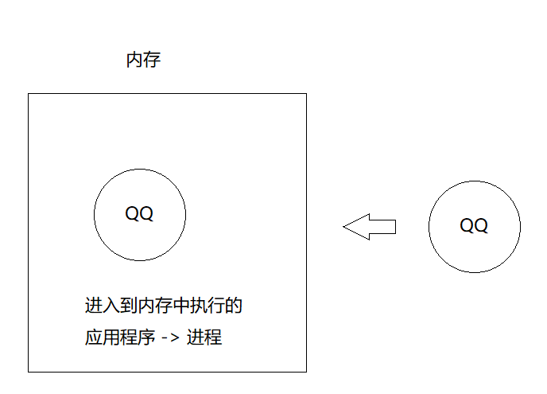
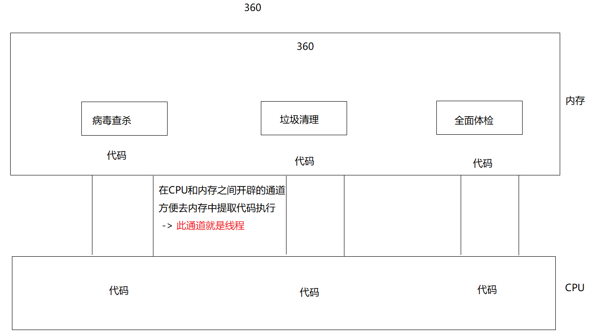
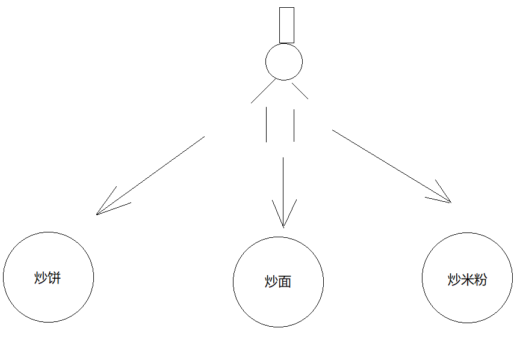
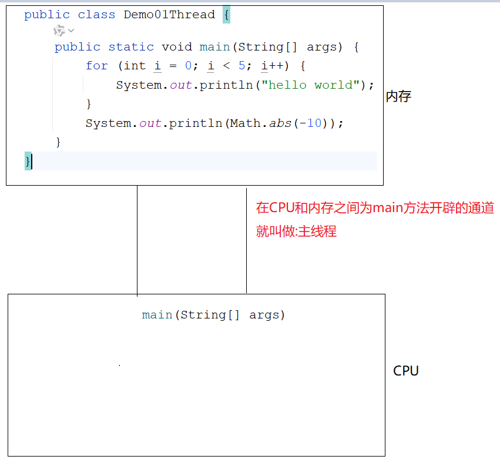
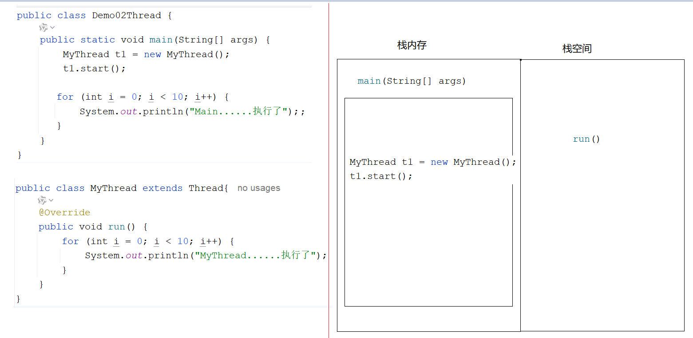
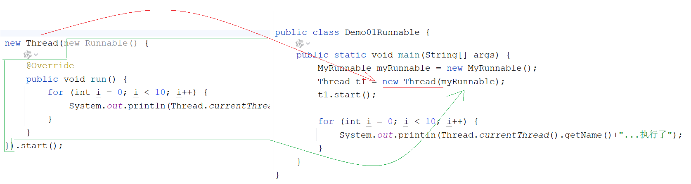
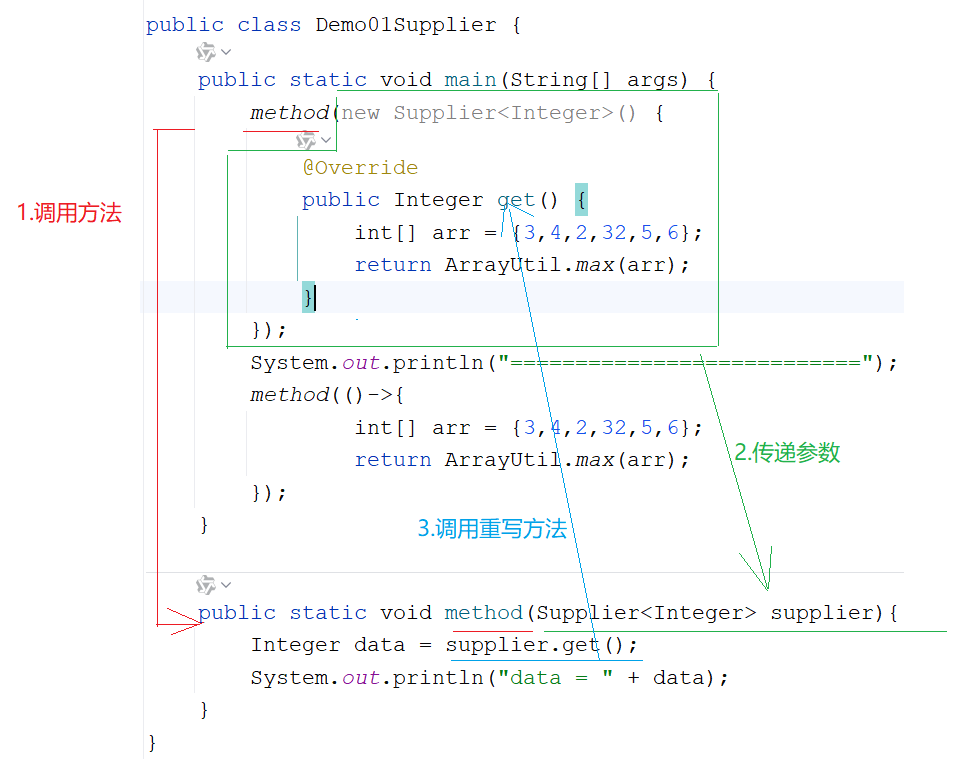

# day15.多线程_Lambda

```java

```

# 第一章.多线程基本了解

## 1.多线程_线程和进程

```java
进程:进入到内存中运行的应用程序
```



```java
1.线程:进程中的一个执行单元
2.线程作用:负责当前进程中程序的运行.一个进程中至少有一个线程,一个进程还可以有多个线程,这样的应用程序就称之为多线程程序
3.简单理解:进程中的一个功能就需要一条线程去执行
```



> 使用场景:软件中的耗时操作 -> 拷贝大文件, 加载大量的资源
>
> ​                     所有的聊天软件
>
> ​                     所有的后台服务器
>
> 多线程程序同时干多件事儿,提高了CPU使用率

## 2.并发和并行

```java
并行:在同一个时刻,有多个指令在多个CPU上(同时)执行(好比是多个人做不同的事儿)
    比如:多个厨师在炒多个菜
```


```java
并发:在同一个时刻,有多个指令在单个CPU上(交替)执行
    比如:一个厨师在炒多个菜
```



```java
细节:
  1.之前CPU是单核,但是在执行多个程序的时候好像是在同时执行,原因是CPU在多个线程之间做高速切换
  2.现在咱们的CPU都是多核多线程的了,比如2核4线程,那么CPU可以同时运行4个线程,此时不用切换,但是如果多了,CPU就要切换了,所以现在CPU在执行程序的时候并发和并行都存在
```

## 3.CPU调度

```java
1.分时调度:让所有的线程轮流获取CPU使用权,并且平均分配每个线程占用CPU的时间片
2.抢占式调度:多个线程抢占CPU使用权,哪个线程优先级越高,先抢到CPU使用权的几率就大,但是不是说每次先抢到CPU使用权的都是优先级高的线程,只是优先级高的线程先抢到CPU使用权的几率会大一些 -> java代码
```

## 4.主线程介绍

```java
1.概述:专门为main方法服务的线程
```



# 第二章.创建线程的方式(重点)

> 1.方式1: 继承Thread类
>
> 2.方式2: 实现Runnable接口
>
> 3.方式3: 实现Callable接口
>
> 4.方式4: 线程池

## 1.第一种方式_extends Thread

```java
1.定义一个线程类,继承Thread
2.重写Thread中的run方法,设置线程任务
3.创建线程类对象,调用Thread中的start方法
  start方法,开启线程,jvm自动执行run方法
```

```java
public class Demo02Thread {
    public static void main(String[] args) {
        MyThread t1 = new MyThread();
        t1.start();

        for (int i = 0; i < 10; i++) {
            System.out.println("Main......执行了");
        }
    }
}
```

```java
public class MyThread extends Thread{
    @Override
    public void run() {
        for (int i = 0; i < 10; i++) {
            System.out.println("MyThread......执行了");
        }
    }
}
```

> 注意:如果直接调用run方法,并不代表将线程开启,仅仅是简单的调用方法
>
> ​         只有调用start方法,线程才会真正开启

## 2.多线程在内存中的运行原理



```java
同一个线程对象,只能调用一次start方法,不能连续调用多次,想要开启先线程,就直接new新的线程对象
```

## 3.Thread类中的方法

```java
void run()  :设置线程任务,这个线程能干啥
void start()  : 使该线程开始执行；Java 虚拟机调用该线程的 run 方法
void setName(String name)  : 给线程设置名字
String getName() : 获取线程名字
static Thread currentThread()  : 获取当前正在执行的线程对象-> 这个方法在哪个线程中用,就获取的是哪个线程对象
static void sleep(long millis) :线程睡眠,设置的是毫秒值,超时之后线程会自动醒来,继续执行
```

```java
public class Demo01Thread {
    public static void main(String[] args) throws InterruptedException {
        MyThread t1 = new MyThread();
        //给线程设置名字
        t1.setName("赵四");
        t1.start();
        for (int i = 0; i < 10; i++) {
            Thread.sleep(1000L);
            System.out.println(Thread.currentThread().getName()+"......执行了");
        }
    }
}

```

```java
public class MyThread extends Thread{
    @Override
    public void run() {
        for (int i = 0; i < 10; i++) {
            try {
                Thread.sleep(1000L);
            } catch (InterruptedException e) {
                e.printStackTrace();
            }
            System.out.println(Thread.currentThread().getName()+"......执行了");
        }
    }
}
```

> 问题:为啥在run方法中有异常只能try
>
> ​        原因就是继承的Thread中的run方法没有throws异常,我们重写之后就不能throws

## 4.第二种方式_实现Runnable接口

```java
1.定义一个自定义线程类对象,实现Runnable接口
2.重写run方法,设置线程任务
3.创建自定义线程类对象
4.创建Thread对象,将自定义线程类对象传递到Thread对象中
  a.Thread(Runnable target)
  b.Thread(Runnable target, String name) 创建对象的时候,给线程取名字
5.调用start方法,开启线程
```

```java
public class Demo01Runnable {
    public static void main(String[] args) {
        MyRunnable myRunnable = new MyRunnable();
        Thread t1 = new Thread(myRunnable);
        t1.start();

        for (int i = 0; i < 10; i++) {
            System.out.println(Thread.currentThread().getName()+"...执行了");
        }
    }
}
```

```java
public class MyRunnable implements Runnable{
    @Override
    public void run() {
        for (int i = 0; i < 10; i++) {
            System.out.println(Thread.currentThread().getName()+"...执行了");
        }
    }
}

```

## 5.两种实现多线程的方式区别

```java
1.继承Thread:继承是有局限性的,因为一个类只能继承一个父类
2.实现Runnable:解决了单继承的局限性,自定义线程类继承一个父类的同时还可以实现Runnable接口
```

## 6.匿名内部类创建多线程

```java
public class Demo02Runnable {
    public static void main(String[] args) {
        /*
           Thread(Runnable r)
           Thread(Runnable r,String name)
         */

        new Thread(new Runnable() {
            @Override
            public void run() {
                for (int i = 0; i < 10; i++) {
                    System.out.println(Thread.currentThread().getName()+"...执行了");
                }
            }
        }).start();

        new Thread(new Runnable() {
            @Override
            public void run() {
                for (int i = 0; i < 10; i++) {
                    System.out.println(Thread.currentThread().getName()+"...执行了");
                }
            }
        }).start();
    }
}
```



# 第三章.线程安全

```java
出现的原因:多条线程共同访问同一个资源
```

## 1.线程安全问题-->线程不安全的代码

```java
public class Test {
    public static void main(String[] args) {
        MyTicket myTicket = new MyTicket();
        Thread t1 = new Thread(myTicket,"赵四");
        Thread t2 = new Thread(myTicket,"刘能");
        Thread t3 = new Thread(myTicket,"广坤");

        t1.start();
        t2.start();
        t3.start();
    }
}
```

```java
public class MyTicket implements Runnable{
    private int ticket = 100;

    @Override
    public void run() {
        while(true){
            if (ticket > 0){
                System.out.println(Thread.currentThread().getName()+"...正在卖第"+ticket+"张票");
                ticket--;
            }
        }
    }
}
```

## 2.解决线程安全问题的第一种方式(使用同步代码块)

```java
1.格式:
  synchronized(任意对象->锁对象){
      可能出现线程不安全的代码
  }
2.执行说明:
  线程一旦进入到同步代码中相当于抢到锁了,其他的线程需要在外面等待,等着执行的线程出了同步代码块,将锁释放,其他等待的线程才会抢锁进入同步代码块中执行
3.注意:多条线程需要共享同一把锁对象
```

```java
public class Test {
    public static void main(String[] args) {
        MyTicket myTicket = new MyTicket();
        Thread t1 = new Thread(myTicket,"赵四");
        Thread t2 = new Thread(myTicket,"刘能");
        Thread t3 = new Thread(myTicket,"广坤");

        t1.start();
        t2.start();
        t3.start();
    }
}
```

```java
public class MyTicket implements Runnable{
    private int ticket = 100;
    Object obj = new Object();
    @Override
    public void run() {
        while(true){
            try {
                Thread.sleep(100L);
            } catch (InterruptedException e) {
                e.printStackTrace();
            }

            synchronized (obj){
                if (ticket > 0){
                    System.out.println(Thread.currentThread().getName()+"...正在卖第"+ticket+"张票");
                    ticket--;
                }
            }
        }
    }
}
```

## 3.解决线程安全问题的第二种方式:同步方法

### 3.1.普通同步方法_非静态

``` java
1.格式:
  修饰符 synchronized 返回值类型 方法名(形参){
      方法体
      return 结果;
  }
2.默认锁:this
```

```java
public class Test {
    public static void main(String[] args) {
        MyTicket myTicket = new MyTicket();
        Thread t1 = new Thread(myTicket,"赵四");
        Thread t2 = new Thread(myTicket,"刘能");
        Thread t3 = new Thread(myTicket,"广坤");

        t1.start();
        t2.start();
        t3.start();
    }
}
```

```java
public class MyTicket implements Runnable {
    private int ticket = 100;
    //Object obj = new Object();

    @Override
    public void run() {
        while (true) {
            try {
                Thread.sleep(100L);
            } catch (InterruptedException e) {
                e.printStackTrace();
            }
            show();
        }
    }

   /* public synchronized void show() {
        if (ticket > 0) {
            System.out.println(Thread.currentThread().getName() + "...正在卖第" + ticket + "张票");
            ticket--;
        }
    }*/

    public void show() {
        synchronized (this){
            if (ticket > 0) {
                System.out.println(Thread.currentThread().getName() + "...正在卖第" + ticket + "张票");
                ticket--;
            }
        }

    }
}
```

### 3.2.静态同步方法

```java
1.格式:
  修饰符 static synchronized 返回值类型 方法名(形参){
      方法体
      return 结果;
  }
2.默认锁:当前类.class
```

```java
public class MyTicket implements Runnable {
    private static int ticket = 100;
    //Object obj = new Object();

    @Override
    public void run() {
        while (true) {
            try {
                Thread.sleep(100L);
            } catch (InterruptedException e) {
                e.printStackTrace();
            }
            show();
        }
    }

    public static synchronized void show() {
        if (ticket > 0) {
            System.out.println(Thread.currentThread().getName() + "...正在卖第" + ticket + "张票");
            ticket--;
        }
    }

    /*public static void show() {
        synchronized (MyTicket.class){
            if (ticket > 0) {
                System.out.println(Thread.currentThread().getName() + "...正在卖第" + ticket + "张票");
                ticket--;
            }
        }

    }*/
}

```

```java
public class Test {
    public static void main(String[] args) {
        MyTicket myTicket = new MyTicket();
        Thread t1 = new Thread(myTicket,"赵四");
        Thread t2 = new Thread(myTicket,"刘能");
        Thread t3 = new Thread(myTicket,"广坤");

        t1.start();
        t2.start();
        t3.start();
    }
}

```

# 第四章.单例模式

```properties
1.目的:让一个类只产生一个对象,供外界使用
```

### 1.1.饿汉式：

```properties
1.饿汉式:啊,我好饿呀,好饥渴,想赶紧来个对象,需要这个对象尽早创建出来
```

```java
public class Singleton {
    /**
     * 为了防止外界随便利用构造方法new对象
     * 我们需要将构造方法私有化
     */
    private Singleton() {
    }

    /**
     * 由于我们是饿汉式,需要这个对象赶紧产生
     * 所以我们new对象的时候将其变成static的
     * <p>
     * 为了符合封装思想,不然外界直接调用我们new出来的对象
     * 所以我们将其变成私有的
     */
    private static Singleton singleton = new Singleton();

    /**
     * 提供一个静态方法,返回单例对象
     * 这个方式属于对外提供的公共接口
     */
    public static Singleton getSingleton() {
        return singleton;
    }
}
```

```java
public class Test01 {
    public static void main(String[] args) {
        for (int i = 0; i < 5; i++) {
            System.out.println(Singleton.getSingleton());
        }
    }
}
```

### 1.2.懒汉式：

```properties
1.概述:我太懒了,不着急要对象,啥时候使用,啥时候new对象,但是还要保证对象只有一个
```

```java
public class Singleton {
    private Singleton() {
    }

    private static Singleton singleton = null;

    /**
     * 对外提供一个公共的接口
     * 啥时候调用这个接口,啥时候new对象供外界使用
     */
    public static Singleton getSingleton() {
        /**
         * 外层的判断目的:
         *   要不要抢锁,如果singleton不是null,就不用抢锁了
         */
        if (singleton == null){
            synchronized (Singleton.class){
                if (singleton == null) {
                    singleton = new Singleton();
                }
            }
        }
        return singleton;
    }
}

```

```java
public class Test01 {
    public static void main(String[] args) {
        new Thread(new Runnable() {
            @Override
            public void run() {
                for (int i = 0; i < 5; i++) {
                    System.out.println(Singleton.getSingleton());
                }
            }
        }).start();

        new Thread(new Runnable() {
            @Override
            public void run() {
                for (int i = 0; i < 5; i++) {
                    System.out.println(Singleton.getSingleton());
                }
            }
        }).start();
    }
}
```

# 第五章.Lambda表达式

## 1.函数式编程思想和Lambda表达式定义格式

```java
1.面向对象思想:过度强调找对象,强调过程(找对象的过程)
2.函数式编程思想:强调的是目的,不强调过程
3.Lambda语法格式:
  ()->{}
  a.():重写方法的参数位置
  b.->:将参数传递到方法体中
  c.{}:重写方法的方法体
```

```java
public class Demo01Lambda {
    public static void main(String[] args) {
        new Thread(new Runnable() {
            @Override
            public void run() {
                System.out.println("多线程");
            }
        }).start();

        System.out.println("========================");
        new Thread(()-> System.out.println("多线程")).start();
    }
}
```

```java
public interface USB {
    void open();
}
```

```java
public class Demo02Lambda {
    public static void main(String[] args) {
        method(new USB() {
            @Override
            public void open() {
                System.out.println("打开USB设备");
            }
        });

        System.out.println("=====================");
        method(()->
                System.out.println("打开USB设备")
        );

        System.out.println("===========================");
        USB usb = method02();
        usb.open();
    }

    public static USB method02(){
        return ()->System.out.println("打开USB设备111");
    }

    public static void method(USB usb){
       usb.open();
    }
}

```

## 2.Lambda表达式使用前提

```java
1.前提:必须是函数式接口做方法参数传递或返回
2.函数式接口:有且只有一个抽象方法的接口
3.检测是否是函数式接口:@FunctionalInterface
```

```java
@FunctionalInterface
public interface USB {
    void open();
}

```

```java
public class Demo02Lambda {
    public static void main(String[] args) {
        method(new USB() {
            @Override
            public void open() {
                System.out.println("打开USB设备");
            }
        });

        System.out.println("=====================");
        method(()->
                System.out.println("打开USB设备")
        );

        System.out.println("===========================");
        USB usb = method02();
        usb.open();
    }

    public static USB method02(){
        return ()->System.out.println("打开USB设备111");
    }

    public static void method(USB usb){
       usb.open();
    }
}

```

## 3.Lambda表达式省略规则

```java
作为初学者来说怎么学Lambda->涛哥秘籍:
  1.先观察,是否是函数式接口做方法参数传递或者返回值返回
  2.如果是,考虑使用Lambda表达式
  3.实参传递,或者返回值返回时传递或者返回一个匿名内部类对象
  4.从new接口开始到重写方法的方法名结束,选中,删除,别忘记多删除一个右半个大括号
  5.从重写方法的参数和方法体之间加上箭头

省略规则:
  1.重写方法的参数类型可以干掉
  2.如果重写方法的参数位置只有一个参数,所在的小括号可以干掉
  3.如果方法体只有一句,所在的大括号以及分号可以干掉
  4.如果方法体只有一句话,并且是带return的,那么所在的大括号,分号,以及return关键字都可以干掉
```

```java
@FunctionalInterface
public interface USB {
    String open(String name);
}

```

```java
public class Test01 {
    public static void main(String[] args) {
       method(new USB() {
           @Override
           public String open(String name) {
               return name+"打开了";
           }
       });

        System.out.println("=====================");
        method(name-> name+"打开了");
    }

    public static void method(USB usb){
        usb.open("鼠标");
    }
}

```

# 第六章.函数式接口

```java
1.概述:必须有,且只能有一个抽象方法的接口
2.检测:@FunctionalInterface
```

## 1.Supplier

```java
1.Supplier接口
   java.util.function.Supplier<T>接口，它意味着"供给"->我们想要什么就给什么
2.方法:
  T get() -> 我们想要什么,get方法就可以返回什么

3.需求:
   使用Supplier接口作为方法的参数
   用Lambda表达式求出int数组中的最大值

4.泛型:
  <引用数据类型>-> 规定了我们操作的数据是什么类型
  <>中只能写引用数据类型,不能写基本数据类型
  泛型的作用就是为了统一类型
```

| 基本类型 | 包装类    |
| -------- | --------- |
| byte     | Byte      |
| short    | Short     |
| int      | Integer   |
| long     | Long      |
| float    | Float     |
| double   | Double    |
| char     | Character |
| boolean  | Boolean   |

```java
public class Demo01Supplier {
    public static void main(String[] args) {
        method(new Supplier<Integer>() {
            @Override
            public Integer get() {
                int[] arr = {3,4,2,32,5,6};
                return ArrayUtil.max(arr);
            }
        });
        System.out.println("===========================");
        method(()->{
                int[] arr = {3,4,2,32,5,6};
                return ArrayUtil.max(arr);
        });
    }

    public static void method(Supplier<Integer> supplier){
        Integer data = supplier.get();
        System.out.println("data = " + data);
    }
}

```



## 2.Consumer

```java
java.util.function.Consumer<T>->消费型接口->操作
  方法:
    void accept(T t)，意为消费一个指定泛型的数据

"消费"就是"操作",至于怎么操作,就看重写accept方法之后,方法体怎么写了
```

```java
public class Demo02Consumer {
    public static void main(String[] args) {
        show(new Consumer<String>() {
            @Override
            public void accept(String s) {
                System.out.println(s.length());
            }
        },"abcdefg");
        System.out.println("========================");
        show(s-> System.out.println(s.length()),"abcdefg");
    }
    public static void show(Consumer<String> consumer, String s){
        consumer.accept(s);
    }
}

```

## 3.Function

```java
java.util.function.Function<T,R>接口用来根据一个类型的数据得到另一个类型的数据
  方法:
     R apply(T t)根据类型T参数获取类型R的结果
```

```java
public class Demo03Function {
    public static void main(String[] args) {
        method(new Function<Integer, String>() {
            @Override
            public String apply(Integer integer) {
                return integer+"";
            }
        },100);
        System.out.println("===========================");
        method(a->a+"",100);
    }
    public  static void method(Function<Integer,String> function, int a){
        String apply = function.apply(a);
        System.out.println(apply);
    }
}

```

## 4.Predicate

```java
java.util.function.Predicate<T>接口。->判断型接口
    boolean test(T t)->用于判断的方法,返回值为boolean型
```

```java
public class Demo04Predicate {
    public static void main(String[] args) {
        method(s->s.length()>5,"hello world");
    }

    public  static void method(Predicate<String> predicate,String s){
        boolean b = predicate.test(s);
        System.out.println(b);
    }
}
```
