# 02_web&框架_springmvc控制层框架

## 一、HTTP协议

### 1.1 HTTP协议简介

#### 1.1.1 简介

**HTTP（超文本传输协议 *HyperText Transfer Protocol*）** 是应用层的面向对象协议，设计目的是确保客户端与服务器之间的通信，是互联网上最常用的协议之一。核心作用是：

​	✅ 规定客户端与 Web 服务器的**通信规则**

​	✅ 定义请求 / 响应的数据格式（称为 **“报文”**）

HTTP 是一个基于 TCP/IP 通信协议来传递数据的（HTML 文件、图片文件、查询结果等）。

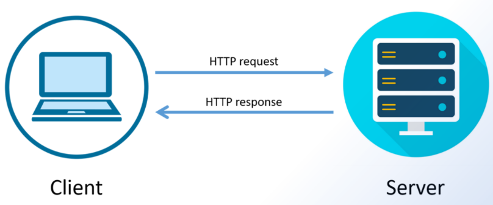

#### 1.1.2 版本说明

- HTTP/1.1：“不挂电话的聊天”—— 一个 TCP 连接可传多个请求（避免反复 “拨号”），但请求需排队（队头阻塞，前一个卡了后一个等）。
- HTTP/2：“单公路多车道”—— 用二进制分帧拆分请求，一个 TCP 连接并行传多个请求帧，解决队头阻塞。
- HTTP/3：“换高速路”—— 改用 QUIC 协议（基于 UDP），彻底解决 TCP 层阻塞，连接更快、自带加密、抗网络波动。

#### 1.1.3 HTTP协议通信流程（理解）

- **建立连接**：客户端与服务器之间建立连接。在传统的 HTTP 中，这是基于 TCP/IP 协议的。最近的 HTTP/2 和 HTTP/3 则使用了更先进的传输层协议，例如基于 TCP 的二进制协议（HTTP/2）或基于 UDP 的 QUIC 协议（HTTP/3）。
- **发送请求**：客户端向服务器发送请求，请求中包含要访问的资源的 URL、请求方法（GET、POST、PUT、DELETE 等）、请求头（例如，Accept、User-Agent）以及可选的请求体（对于 POST 或 PUT 请求）。
- **处理请求**：服务器接收到请求后，根据请求中的信息找到相应的资源，执行相应的处理操作。这可能涉及从数据库中检索数据、生成动态内容或者简单地返回静态文件。**（服务端）**
- **发送响应**：服务器将处理后的结果封装在响应中，并将其发送回客户端。响应包含状态码（用于指示请求的成功或失败）、响应头（例如，Content-Type、Content-Length）以及可选的响应体（例如，HTML 页面、图像数据）。
- **关闭连接**：在完成请求-响应周期后，客户端和服务器之间的连接可以被关闭，除非使用了持久连接（如 HTTP/1.1 中的 keep-alive）。

### 1.2 HTTP协议请求&响应格式（重点）

#### 1.2.1 **请求数据包（报）格式**

客户端向服务器发送请求，请求中包含要访问的资源的 URL、请求方法（GET、POST、PUT、DELETE 等）、请求头（例如，Accept、User-Agent）以及可选的请求体（对于 POST 或 PUT 请求）。

```cmd
请求行：请求方法 [空格] URL [空格] 协议版本 [回车符][换行符]
请求头部：头部字段名 [:] 值 [回车符][换行符]
请求头部：头部字段名 [:] 值 [回车符][换行符]
请求头部：头部字段名 [:] 值 [回车符][换行符]
.... （请求头有多组）
空行：[回车符][换行符]
请求体：（客户端传递的数据）
```

参考：

```yaml
GET /index.html HTTP/1.1
Host: www.example.com
User-Agent: Mozilla/5.0 (Windows NT 10.0; Win64; x64; rv:91.0) Gecko/20100101 Firefox/91.0
Accept: text/html,application/xhtml+xml,application/xml;q=0.9,image/webp,*/*;q=0.8
Accept-Encoding: gzip, deflate
Connection: keep-alive
```

说明：

* 请求行：告诉服务器 “要执行的操作【请求方式】（如获取 / 提交）、要访问的资源地址【URL】、使用的 HTTP 版本【协议版本】”，是请求的核心指令。
* 请求头：传递额外信息（可有多组），比如告诉服务器目标域名、客户端类型、请求数据的格式等，常见的请求头包括`Host`、`User-Agent`、`Accept`、`Accept-Encoding`、`Content-Length`等。
* 请求头空行：明确分隔 “请求头部” 和 “请求体”，避免服务器把头部信息和实际数据混淆。
* 作用：提交给服务器的实际内容（如表单数据、JSON 信息等），仅在 POST/PUT 等方法中使用。

#### 1.2.2 **响应数据格式**

服务器将处理后的结果封装在响应中，并将其发送回客户端。响应包含状态码（用于指示请求的成功或失败）、响应头（例如，Content-Type、Content-Length）以及可选的响应体（例如，HTML 页面、图像数据）。

```cmd
状态行：协议版本 [空格] 状态码 [空格] 状态描述 [回车符][换行符]
响应头部：头部字段名 [:] 值 [回车符][换行符]
响应头部：头部字段名 [:] 值 [回车符][换行符]
响应头部：头部字段名 [:] 值 [回车符][换行符]....（响应头有多组）
空行：[回车符][换行符]
响应体：（服务器返回的数据）
```

参考：

```yaml
HTTP/1.1 200 OK
Date: Wed, 18 Apr 2024 12:00:00 GMT
Server: Apache/2.4.1 (Unix)
Last-Modified: Wed, 18 Apr 2024 11:00:00 GMT
Content-Length: 12345
Content-Type: text/html; charset=UTF-8
<!DOCTYPE html>
<html>
</html>
```

说明：

* 状态行：告诉客户端 “请求的处理结果【状态码】、结果描述【状态描述】、使用的 HTTP 版本【协议版本】”，是响应的核心反馈。

* 响应头部：传递额外信息（可有多组），比如告诉客户端返回内容的格式、内容长度、服务器类型等，常见的响应头包括 Content-Type、Content-Length、Server、Set-Cookie 等。

* 响应头空行：明确分隔 “响应头部” 和 “响应体”，避免客户端把头部信息和实际返回数据混淆。

* 响应体：服务器返回的实际内容（如网页 HTML、接口 JSON 数据等），是客户端请求对应的目标资源或处理结果。

### 1.3 HTTP协议其他细节

#### 1.3.1 请求方式说明

请求方式是 “让服务器执行什么操作” 的指令，**以下是常见的 HTTP 请求方法列表：**

| 序号 | 方法       | 描述                                                         |
| :--- | :--------- | :----------------------------------------------------------- |
| 1    | **GET**    | 从服务器获取资源。用于请求数据而不对数据进行更改。例如，从服务器获取网页、图片等。 |
| 2    | **POST**   | 向服务器发送数据以创建新资源。常用于提交表单数据或上传文件。发送的数据包含在请求体中。 |
| 3    | **PUT**    | 向服务器发送数据以更新现有资源。如果资源不存在，则创建新的资源。与 POST 不同，PUT 通常是幂等的，即多次执行相同的 PUT 请求不会产生不同的结果。 |
| 4    | **DELETE** | 从服务器删除指定的资源。请求中包含要删除的资源标识符。       |

**数据传输方式（怎么传、有啥限制）**

- GET：数据挂在网址后→可见→有长度限制（url后面 ? key=value）

- POST：数据藏在请求体→不可见→无长度限制

- PUT：数据藏在请求体→不可见→无长度限制

- DELETE：数据挂在网址后→可选可见→有长度限制（url后面 ? key=value）

**场景对比**

1. **用户登录**：选择 POST

   原因：登录需传递账号、密码等隐私数据，POST 将数据放在请求体中，更安全；

2. **用户注册**：选择 POST

   原因：注册是向服务器新增用户数据，属于提交新资源的操作，且隐私信息（如手机号、密码）需通过请求体传输。

3. **根据用户 ID 查询用户信息**：选择 GET

   原因：查询操作仅获取数据，不修改服务器内容，GET 是幂等的查询语义；且用户 ID 为公开标识，拼在 URL 中（如`/user/123` 或者 `/user?id=123`）简洁高效。

4. **修改用户昵称**：选择 PUT

   原因：修改用户昵称是对服务器已有用户资源的全量更新（或局部更新也可用 PATCH，PUT 更常用），数据放在请求体中也更安全。

5. **删除用户发布的评论**：选择 DELETE

   原因：删除评论是移除服务器指定资源，DELETE 语义明确为删除操作，且幂等，多次删除同一评论结果相同（如`/comment/456`）。

6. **上传商品图片**：选择 POST

   原因：上传图片是提交二进制数据，POST 支持大文件传输（无 URL 长度限制），且属于向服务器新增资源的操作，符合 POST 语义。

7. **获取商品列表**：选择 GET

   原因：获取商品列表是纯查询操作，不修改服务器数据，GET 幂等且适合传递分页、筛选等参数（如`/goods?page=1&size=10`）。

#### 1.3.2 HTTP协议响应状态码

HTTP 状态码由三个十进制数字组成，第一个十进制数字定义了状态码的类型。响应分为五类：信息响应(100–199)，成功响应(200–299)，重定向(300–399)，客户端错误(400–499)和服务器错误 (500–599)：

| 分类 | 含义       | 常用状态码及说明                                             |
| ---- | ---------- | ------------------------------------------------------------ |
| 1**  | 信息性状态 | 临时响应（实际开发中极少用到），例：100（服务器已收到请求头，可继续发送请求体） |
| 2**  | 成功       | 200（请求成功）、201（资源创建成功）                         |
| 3**  | 重定向     | 301（永久跳转）、302（临时跳转）、304（资源未修改）          |
| 4**  | 客户端错误 | 400（请求语法错）、401（未认证）、403（无权限）、404（资源不存在）、405（请求方法不被允许） |
| 5**  | 服务器错误 | 500（服务器内部错）、502（网关错）、503（服务不可用）        |

常见状态码解决思路

1. 400 请求语法错

   优先检查请求参数格式，比如 JSON 数据是否存在语法错误、字段名是否和接口文档一致、参数数据类型是否匹配要求；同时核对请求头的格式是否合规，避免出现格式不标准的情况。

2. 404 资源不存在

   第一步确认请求的 URL 路径是否正确，有无拼写错误或路径层级错误；第二步检查服务端是否已经正确部署了对应的接口或静态资源；最后排查服务端的路由配置，确认路由映射关系是否准确。

3. 405 请求方法不被允许

   先查阅接口文档，明确该接口支持的请求方法（如 GET/POST/PUT）；再检查客户端发送请求时使用的方法是否在支持范围内；若方法无误，需排查服务端接口的请求方法配置是否存在遗漏或错误。

4. 500 服务器内部错

   重点查看服务端的运行日志，定位代码中出现的异常（如空指针异常、SQL 语法错误、依赖调用失败等）；同时检查数据库连接是否正常、第三方服务是否可用，逐步排查并修复代码层面的问题。

## 二、SpringMVC接收数据详解

### 2.1 SpringMVC框架简介

#### 2.1.1 简介

SpringMVC 是 Spring 为表述层开发提供的一整套完备的解决方案。在表述层框架历经 Struts、WebWork、Struts2 等诸多产品的历代更迭之后，目前业界普遍选择了 SpringMVC 作为 Java EE 项目表述层开发的<span style="color:blue;font-weight:bold;">首选方案</span>。之所以能做到这一点，是因为 SpringMVC 具备如下显著优势：

- <span style="color:blue;font-weight:bold;">Spring 家族原生产品</span>，与 IOC 容器等基础设施无缝对接
- 表述层各细分领域需要解决的问题<span style="color:blue;font-weight:bold;">全方位覆盖</span>，提供<span style="color:blue;font-weight:bold;">全面解决方案</span>
- <span style="color:blue;font-weight:bold;">代码清新简洁</span>，大幅度提升开发效率
- 内部组件化程度高，可插拔式组件<span style="color:blue;font-weight:bold;">即插即用</span>，想要什么功能配置相应组件即可
- <span style="color:blue;font-weight:bold;">性能卓著</span>，尤其适合现代大型、超大型互联网项目要求

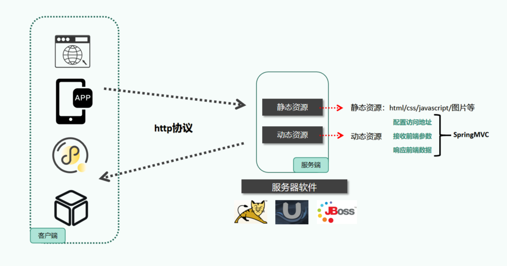

作用总结：**1. 配置动态资源地址（URL） 2. 简化前端传递的参数  3. 简化后台响应的数据**

#### 2.1.2 HelloWorld 案例

**核心目标**：访问指定 URL（`localhost:8080/demo01/hello/world`），服务器返回响应字符串 `hello SpringMVC!!!`。

##### 2.1.2.1 创建工程

通过 IDEA 的 SpringBoot 创建向导新建工程（需勾选 Web 场景），截图参考：

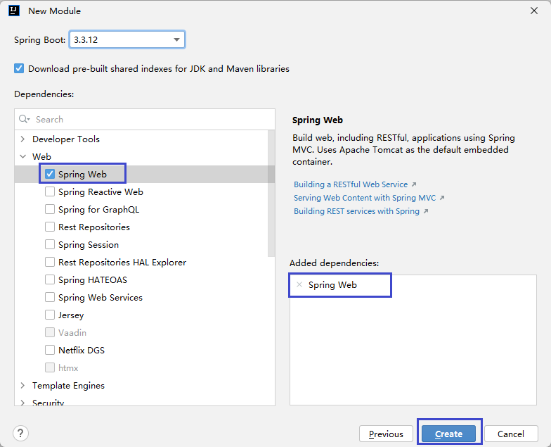

若手动创建工程，需在`pom.xml`中导入 Web 场景依赖：

```xml
<dependency>
    <groupId>org.springframework.boot</groupId>
    <artifactId>spring-boot-starter-web</artifactId>
</dependency>
```

##### 2.1.2.2 编写控制器类

控制器类的作用等价于传统 JavaWeb 中的 Servlet(动态资源)，负责接收和处理 Web 请求。

```java
package com.atguigu.spring.controller;

import org.springframework.stereotype.Controller;

// 标记当前类为SpringMVC控制器
@Controller
public class Demo01HelloWorld {

}
```

##### 2.1.2.3 定义请求映射方法

在控制器类中添加处理指定 URL 请求的方法：

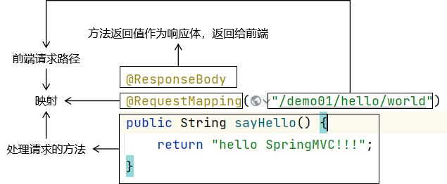

```java
// @ResponseBody：将方法返回值直接作为响应体返回（而非跳转页面）
// @RequestMapping：映射请求URL，匹配/demo01/hello/world时执行该方法
@ResponseBody
@RequestMapping("/demo01/hello/world")
public String sayHello() {
    return "hello SpringMVC!!!";
}
```

##### 2.1.2.4 测试验证

1. 运行 SpringBoot 主启动类，查看启动日志（确认项目正常启动）：

   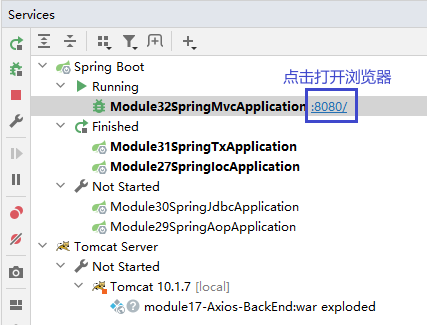

2. 访问测试：

   - 直接访问`localhost:8080`报 404 是正常现象（未配置默认欢迎页如 index.html）；
   - 手动输入目标 URL：`http://localhost:8080/demo01/hello/world`，可看到响应结果：

   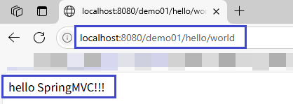

##### 2.1.2.5 配置补充

可在`application.properties`中修改 Web 应用的核心配置：

```properties
# 应用名称（非微服务场景无实际作用）
spring.application.name=module32-spring-mvc
# 修改Tomcat端口（默认8080）
server.port=15000
# 修改Web应用上下文路径（访问时需加/demo前缀，如localhost:15000/demo/demo01/hello/world）
server.servlet.context-path=/demo
```

##### 2.1.2.6 总结

1. SpringMVC 核心是通过`@Controller`定义控制器、`@RequestMapping`映射 URL、`@ResponseBody`返回字符串响应；
2. 导入`spring-boot-starter-web`依赖后，SpringBoot 会自动配置 Tomcat 和 SpringMVC 核心组件；
3. 可通过`application.properties`修改端口、上下文路径等 Web 配置。

### 2.2 案例1：@RequestMapping&参数接收实践

#### 2.2.1 案例说明

> 本次案例聚焦 SpringMVC 的 `@RequestMapping` 注解使用及请求参数接收，实现两个核心用户查询接口

##### 需求1：用户列表条件查询接口

**功能目标**：根据用户名（模糊匹配）、手机号（精确匹配）、用户状态（精确匹配）等可选条件，查询符合条件的用户列表；参数通过 URL 请求参数（QueryString）传递，返回 JSON 格式的用户列表数据。

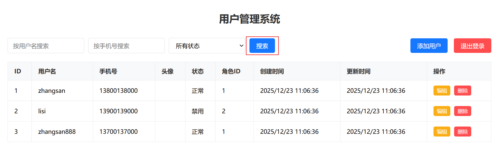

**接口信息**

- 请求方式：GET

- 请求 URL：`/user/list`

- 参数说明：

  | 参数名   | 位置     | 类型    | 是否必填 | 描述                           |
  | -------- | -------- | ------- | -------- | ------------------------------ |
  | username | 请求参数 | String  | 否       | 用户名（支持模糊查询）         |
  | phone    | 请求参数 | String  | 否       | 手机号（支持精确查询）         |
  | status   | 请求参数 | Integer | 否       | 用户状态（0 - 禁用，1 - 正常） |

- 返回值说明：

  数据格式为 JSON 数组（用户集合），每个元素为用户信息对象，示例如下：

  ```json
  [
    {
      "id": 1,
      "username": "testUser1",
      "phone": "13800138001",
      "avatar": "https://example.com/avatar/test1.jpg",
      "status": 1,
      "roleId": 1,
      "createTime": "2025-01-01 10:00:00",
      "updateTime": "2025-01-02 15:30:00"
    },
    {
      "id": 2,
      "username": "testUser2",
      "phone": "13800138002",
      "avatar": "https://example.com/avatar/test2.jpg",
      "status": 0,
      "roleId": 2,
      "createTime": "2025-01-03 09:15:00",
      "updateTime": "2025-01-03 09:15:00"
    }
  ]
  ```

##### 需求2：用户详情查询接口

**功能目标**：根据用户 ID 精准查询单个用户的完整信息；用户 ID 作为 URL 路径的动态参数传递，返回 JSON 格式的用户详情对象。

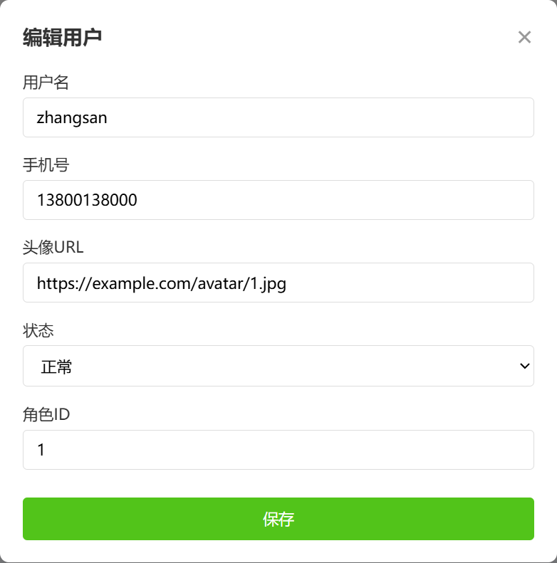

**接口信息**

- 请求方式：GET

- 请求 URL：`/user/{id}`（`{id}` 为动态路径参数，代表用户唯一 ID）

- 参数说明：

  | 参数名 | 位置 | 类型 | 是否必填 | 描述            |
  | ------ | ---- | ---- | -------- | --------------- |
  | id     | 路径 | Long | 是       | 用户唯一标识 ID |

- 返回值说明：

  数据格式为 JSON 对象，包含用户完整信息，示例如下：

  ```json
  {
     "id": 1,
     "username": "testUser1",
     "phone": "13800138001",
     "avatar": "https://example.com/avatar/test1.jpg",
     "status": 1,
     "roleId": 1,
     "createTime": "2025-01-01 10:00:00",
     "updateTime": "2025-01-02 15:30:00"
  }
  ```

> 核心学习目标：掌握 SpringMVC 中 `@RequestMapping` 注解的使用，以及不同位置（请求参数、路径参数）的参数接收方式。

#### 2.2.2 模拟用户表结构说明

案例对应的 `sys_user` 表建表语句，用于理解接口对应的数据结构：

```sql
-- 创建用户表
CREATE TABLE sys_user (
  id BIGINT AUTO_INCREMENT COMMENT '用户ID',
  username VARCHAR(50) NOT NULL COMMENT '用户名',
  password VARCHAR(100) NOT NULL COMMENT '密码（BCrypt加密）',
  phone VARCHAR(20) UNIQUE COMMENT '手机号',
  avatar VARCHAR(255) COMMENT '用户头像URL',
  status TINYINT DEFAULT 1 COMMENT '状态（0-禁用，1-正常）',
  role_id BIGINT COMMENT '角色ID（关联sys_role表）',
  create_time DATETIME DEFAULT CURRENT_TIMESTAMP COMMENT '创建时间',
  update_time DATETIME DEFAULT CURRENT_TIMESTAMP ON UPDATE CURRENT_TIMESTAMP COMMENT '更新时间',
  PRIMARY KEY (id)
) ENGINE=InnoDB DEFAULT CHARSET=utf8mb4 COMMENT='用户表';
```

#### 2.2.3 搭建案例web工程&准备

> 本次项目需引入核心依赖 / 场景启动器：`spring-boot-starter-web`（Web 开发核心）、`lombok`（简化实体类代码）。

##### 2.2.3.1 搭建项目

通过 IDEA 的 SpringBoot 工程创建向导搭建项目（勾选 Web、Lombok 场景），截图参考：

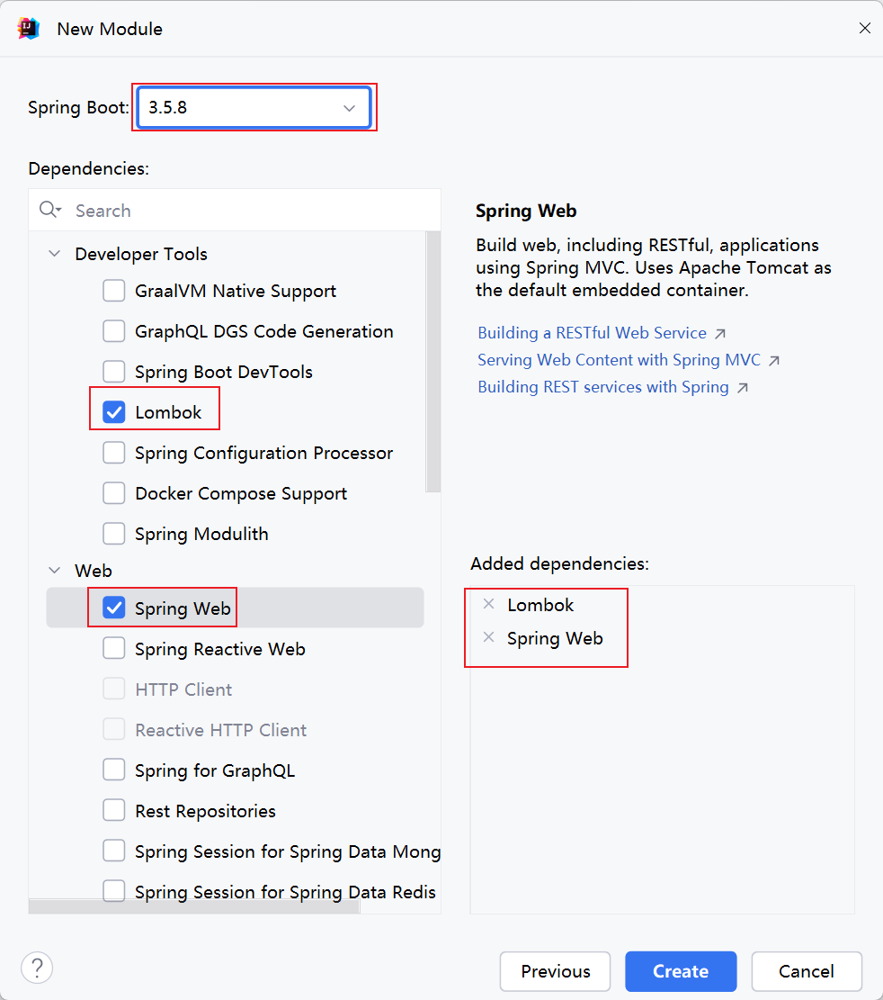

##### 2.2.3.2 编写用户实体类

创建与`sys_user`表对应的实体类，通过`lombok`的`@Data`注解简化 get/set、toString 等方法的编写：

```java
/**
 * 系统用户实体类（对应sys_user表）
 */
@Data // 自动生成get/set/toString/equals/hashCode等方法，需引入lombok依赖
public class SysUser {
    private Long id;         // 用户唯一ID
    private String username; // 用户名
    private String password; // 密码（BCrypt加密存储）
    private String phone;    // 手机号（唯一）
    private String avatar;   // 用户头像URL
    private Integer status;  // 账号状态：0-禁用，1-正常
    private Long roleId;     // 角色ID（关联角色表）
    private Date createTime; // 创建时间
    private Date updateTime; // 更新时间
}
```

##### 2.2.3.3 编写模拟数据操作工具类

为避免依赖数据库，编写内存级数据工具类模拟用户数据的 CRUD 操作，核心逻辑：静态 Map 存储数据 + 静态代码块初始化测试数据 + 封装查询 / 新增 / 更新 / 删除方法。

```java
/**
 * 用户内存数据工具类（模拟数据库CRUD操作，用于SpringMVC参数接收讲解）
 * 核心设计：
 * 1. 静态HashMap存储用户数据（模拟数据库表）
 * 2. 原子类AtomicLong生成自增ID（模拟数据库自增主键，保证线程安全）
 * 3. 静态代码块初始化测试数据（项目启动时自动执行）
 * 4. 封装5个核心方法，覆盖查询/新增/更新/删除场景
 */
public class SysUserDataUtil {

    // 1. 静态Map：Key=用户ID，Value=用户对象（模拟数据库表存储）
    private static final Map<Long, SysUser> USER_MAP = new HashMap<>();

    // 2. 原子类：生成自增ID（线程安全，替代数据库自增主键）
    private static final AtomicLong AUTO_INCREMENT_ID = new AtomicLong(1);

    // 3. 静态代码块：项目启动时初始化3条测试数据
    static {
        // 初始化用户1：zhangsan（状态正常）
        SysUser user1 = new SysUser();
        user1.setId(AUTO_INCREMENT_ID.getAndIncrement()); // ID=1
        user1.setUsername("zhangsan");
        user1.setPassword("$2a$10$xxxxxx"); // 模拟BCrypt加密后的密码
        user1.setPhone("13800138000");
        user1.setAvatar("https://example.com/avatar/1.jpg");
        user1.setStatus(1); // 正常状态
        user1.setRoleId(1L);
        user1.setCreateTime(new Date());
        user1.setUpdateTime(new Date());

        // 初始化用户2：lisi（状态禁用）
        SysUser user2 = new SysUser();
        user2.setId(AUTO_INCREMENT_ID.getAndIncrement()); // ID=2
        user2.setUsername("lisi");
        user2.setPassword("$2a$10$yyyyyy");
        user2.setPhone("13900139000");
        user2.setAvatar("https://example.com/avatar/2.jpg");
        user2.setStatus(0); // 禁用状态
        user2.setRoleId(2L);
        user2.setCreateTime(new Date());
        user2.setUpdateTime(new Date());

        // 初始化用户3：zhangsan888（状态正常，无头像）
        SysUser user3 = new SysUser();
        user3.setId(AUTO_INCREMENT_ID.getAndIncrement()); // ID=3
        user3.setUsername("zhangsan888");
        user3.setPassword("$2a$10$zzzzzz");
        user3.setPhone("13700137000");
        user3.setAvatar(null); // 无头像
        user3.setStatus(1); // 正常状态
        user3.setRoleId(1L);
        user3.setCreateTime(new Date());
        user3.setUpdateTime(new Date());

        // 将测试数据存入Map
        USER_MAP.put(user1.getId(), user1);
        USER_MAP.put(user2.getId(), user2);
        USER_MAP.put(user3.getId(), user3);
    }

    // ========== 核心业务方法（模拟数据库CRUD） ==========

    /**
     * 条件查询用户列表
     * 支持：username模糊匹配、phone精确匹配、status精确匹配（参数可为null，null则不参与筛选）
     * @param username 用户名（模糊匹配）
     * @param phone 手机号（精确匹配）
     * @param status 账号状态（0-禁用/1-正常，精确匹配）
     * @return 符合条件的用户列表
     */
    public static List<SysUser> listUsers(String username, String phone, Integer status) {
        List<SysUser> resultList = new ArrayList<>();
        // 遍历所有用户，按条件筛选
        for (SysUser user : USER_MAP.values()) {
            // 1. 用户名模糊匹配（非空时筛选）
            if (username != null && !username.isEmpty() && !user.getUsername().contains(username)) {
                continue;
            }
            // 2. 手机号精确匹配（非空时筛选）
            if (phone != null && !phone.isEmpty() && !phone.equals(user.getPhone())) {
                continue;
            }
            // 3. 状态精确匹配（非空时筛选）
            if (status != null && !status.equals(user.getStatus())) {
                continue;
            }
            // 符合所有条件，加入结果集
            resultList.add(user);
        }
        return resultList;
    }

    /**
     * 根据ID查询用户详情
     * @param id 用户唯一ID
     * @return 对应ID的用户对象（null表示用户不存在）
     */
    public static SysUser getUserById(Long id) {
        return USER_MAP.get(id);
    }

    /**
     * 根据ID删除用户
     * @param id 用户唯一ID
     * @return true=删除成功，false=用户不存在
     */
    public static boolean deleteUserById(Long id) {
        if (USER_MAP.containsKey(id)) {
            USER_MAP.remove(id);
            return true;
        }
        return false;
    }

    /**
     * 根据ID更新用户（仅更新非null字段，模拟“部分更新”场景）
     * @param id 待更新用户的ID
     * @param updateUser 待更新的字段（非null字段才生效）
     * @return true=更新成功，false=用户不存在
     */
    public static boolean updateUserById(Long id, SysUser updateUser) {
        // 校验用户是否存在
        if (!USER_MAP.containsKey(id)) {
            return false;
        }
        // 获取原用户对象，仅更新非null字段
        SysUser oldUser = USER_MAP.get(id);
        if (updateUser.getUsername() != null) oldUser.setUsername(updateUser.getUsername());
        if (updateUser.getPassword() != null) oldUser.setPassword(updateUser.getPassword());
        if (updateUser.getPhone() != null) oldUser.setPhone(updateUser.getPhone());
        if (updateUser.getAvatar() != null) oldUser.setAvatar(updateUser.getAvatar());
        if (updateUser.getStatus() != null) oldUser.setStatus(updateUser.getStatus());
        if (updateUser.getRoleId() != null) oldUser.setRoleId(updateUser.getRoleId());
        oldUser.setUpdateTime(new Date()); // 刷新更新时间

        // 把更新后的用户放回Map
        USER_MAP.put(id, oldUser);
        return true;
    }

    /**
     * 新增用户（自动生成ID和时间字段）
     * @param user 待新增的用户对象（无需设置ID，自动生成）
     * @return 新增后的用户对象（含自动生成的ID）
     */
    public static SysUser saveUser(SysUser user) {
        // 生成自增ID
        Long newId = AUTO_INCREMENT_ID.getAndIncrement();
        // 补全必要字段
        user.setId(newId);
        user.setCreateTime(new Date());
        user.setUpdateTime(new Date());
        // 默认状态：未设置则为正常（1）
        if (user.getStatus() == null) {
            user.setStatus(1);
        }
        // 存入Map
        USER_MAP.put(newId, user);
        return user;
    }

    // 测试方法：验证工具类核心功能（可选，运行main方法即可测试）
    public static void main(String[] args) {
        // 1. 测试条件查询：查询用户名含"zhangsan"、状态为1的用户（预期2条）
        List<SysUser> list = SysUserDataUtil.listUsers("zhangsan", null, 1);
        System.out.println("条件查询结果条数：" + list.size());

        // 2. 测试查详情：查询ID=1的用户（预期username=zhangsan）
        SysUser user = SysUserDataUtil.getUserById(1L);
        System.out.println("ID=1的用户名：" + user.getUsername());

        // 3. 测试新增：新增wangwu用户（预期ID=4）
        SysUser newUser = new SysUser();
        newUser.setUsername("wangwu");
        newUser.setPassword("$2a$10$aaaaaa");
        newUser.setPhone("13600136000");
        SysUser savedUser = SysUserDataUtil.saveUser(newUser);
        System.out.println("新增用户ID：" + savedUser.getId());

        // 4. 测试更新：将ID=4的用户状态改为0（预期更新成功）
        SysUser updateUser = new SysUser();
        updateUser.setStatus(0);
        boolean updateFlag = SysUserDataUtil.updateUserById(4L, updateUser);
        System.out.println("更新是否成功：" + updateFlag);

        // 5. 测试删除：删除ID=4的用户（预期删除成功）
        boolean deleteFlag = SysUserDataUtil.deleteUserById(4L);
        System.out.println("删除是否成功：" + deleteFlag);
    }
}
```

**总结**

1. 工程搭建核心是引入`spring-boot-starter-web`（Web 开发）和`lombok`（简化代码）两个依赖；
2. 实体类`SysUser`与数据库表`sys_user`一一对应，通过`@Data`注解省去手动编写 get/set 等方法；
3. 模拟数据工具类通过静态 Map + 原子类实现内存级数据存储，封装的 5 个方法覆盖了查询 / 新增 / 更新 / 删除核心场景，为后续 SpringMVC 接口开发提供数据支撑。

#### 2.2.4 需求1：查询用户列表接口实践&体验

> 核心目标：讲解 `@RequestMapping` 注解的基本使用方式，以及如何接收 URL 中 QueryString 类型的请求参数

```java
@RestController // 等价于 @Controller + @ResponseBody，返回数据而非页面
public class UserController {

    /**
     * 接口功能：根据用户名（username）、手机号（phone）、用户状态（status）条件查询用户列表
     * 接口信息：
     *  - 访问地址：/user/list（通过 @RequestMapping 配置）
     *  - 请求方式：默认支持所有HTTP请求方式（GET/POST等）
     *  - 参数传递：QueryString 格式（url?username=xx&phone=xx&status=xx）
     *  - 参数接收规则：方法形参名与请求参数名一致、类型匹配，即可自动接收参数
     *  - 返回值：符合条件的用户列表（SpringBoot自动转为JSON格式返回）
     * 访问路径拼接规则：
     *  http://主机IP:端口号/项目上下文路径/RequestMapping配置地址
     *  示例（结合下方配置）：http://localhost:15000/demo/user/list?username=zhangsan&status=1
     */
    @RequestMapping("/user/list")
    public List<SysUser> getUserList(String username, String phone, Integer status) {
        System.out.println("===== 用户列表查询 =====");
        System.out.println("查询条件：username = " + username + ", phone = " + phone + ", status = " + status);
        // 调用模拟工具类，按条件查询用户列表
        List<SysUser> sysUserList = SysUserDataUtil.listUsers(username, phone, status);
        System.out.println("查询结果条数：" + sysUserList.size());

        return sysUserList; // 自动转为JSON数组返回给客户端
    }
}
```

可在 `application.properties` 配置文件中修改 Web 应用的核心参数（影响接口访问路径）：

```properties
# 修改Tomcat启动端口（默认8080，改为15000）
server.port=15000
# 修改项目上下文路径（访问时需加/demo前缀）
server.servlet.context-path=/demo
```

**总结**

1. `@RequestMapping("/user/list")` 用于绑定方法与访问地址，该方法可处理所有指向 `/user/list` 的 HTTP 请求；
2. **参数接收关键**：方法形参名需与 QueryString 参数名完全一致（如`phone`对应请求中的`phone`参数）
3. 访问路径需结合配置拼接：`http://localhost:15000/demo/user/list?username=zhangsan&status=1`（示例）；
4. `@RestController` 确保方法返回的对象自动转为 JSON 格式，无需手动处理。

#### 2.2.5 @RequestMapping注解详解

> 核心目标：深入讲解 `@RequestMapping` 注解的全量使用细节，包括路径匹配规则、注解生效位置、请求方式限制、快捷变体注解，以及映射冲突问题。

##### 2.2.5.1 路径匹配（精准 / 模糊）

`@RequestMapping` 支持**精准匹配**和**模糊匹配**两种路径规则，核心区别在于是否使用通配符。

###### 2.2.5.1.1 精准匹配（无通配符）

直接指定固定 URL 地址，仅匹配完全一致的请求路径，是开发中最常用的方式。

```java
/**
 * 精准匹配：仅匹配 /user/login 路径的请求
 */
@RequestMapping(value = {"/user/login"})
@ResponseBody
public String login() {
    System.out.println("UserController.login");
    return "login success!!";
}

/**
 * 精准匹配：仅匹配 /user/register 路径的请求
 */
@RequestMapping(value = {"/user/register"})
@ResponseBody
public String register() {
    System.out.println("UserController.register");
    return "register success!!";
}
```

###### 2.2.5.1.2 模糊匹配（通配符）

通过 `*` 或 `**` 通配符匹配多个相似路径，适用于批量映射场景：

- `/*`：匹配**单层**任意字符串（仅一级路径）
- `/**`：匹配**任意层**任意字符串（多级路径）

```java
/**
 * 模糊匹配示例1：/product/*
 * 可匹配：/product/a、/product/aaa（单层路径）
 * 不可匹配：/product/a/b（多层路径）
 */
@RequestMapping("/product/*")
@ResponseBody
public String show() {
    System.out.println("ProductController.show");
    return "product show!";
}

/**
 * 模糊匹配示例2：/product/**
 * 可匹配：/product/a、/product/aaa、/product/a/b（任意层级路径）
 */
@RequestMapping("/product/**")
@ResponseBody
public String detail() {
    System.out.println("ProductController.detail");
    return "product detail!";
}
```

##### 2.2.5.2 注解生效位置（类级别 + 方法级别）

`@RequestMapping` 可标注在**控制器类**或**方法**上，两者结合实现路径分层管理：

- 类级别：提取当前控制器所有方法的**通用路径前缀**，简化方法级路径配置；
- 方法级别：配置具体的请求路径（相对于类级别路径），实现细粒度映射。

```java
// 类级别：配置通用前缀 /user，当前类所有方法路径均基于此拼接
@RequestMapping("/user")
@RestController // 等价于 @Controller + @ResponseBody，无需每个方法加@ResponseBody
public class UserController {

    /**
     * 方法级别：路径为 /list，完整访问路径 = 类前缀 + 方法路径 = /user/list
     * 修正：原参数password错误，改为接口要求的phone
     */
    @RequestMapping("/list")
    public List<SysUser> getUserList(String username, String phone, Integer status) {
        System.out.println("查询条件：username=" + username + ", phone=" + phone + ", status=" + status);
        List<SysUser> sysUserList = SysUserDataUtil.listUsers(username, phone, status);
        System.out.println("查询结果：" + sysUserList.size() + "条");
        return sysUserList;
    }
}
```

##### 2.2.5.3 请求方式限制

`@RequestMapping` 默认允许**所有 HTTP 请求方式**（GET/POST/PUT/DELETE 等）访问，可通过 `method` 属性指定允许的请求方式（支持单个 / 多个）。

SpringMVC 通过 `RequestMethod` 枚举封装了 HTTP 所有请求方式：

```java
public enum RequestMethod {
  GET, HEAD, POST, PUT, PATCH, DELETE, OPTIONS, TRACE
}
```

示例：指定请求方式

```java
@RestController
public class UserController {

    /**
     * 仅允许 POST 方式访问 /user/login
     * 若用GET方式访问，会抛出 405（Method Not Allowed）异常
     */
    @RequestMapping(value = "/user/login", method = RequestMethod.POST)
    public String login() {
        System.out.println("UserController.login");
        return "login success!!";
    }

    /**
     * 允许 GET/POST 两种方式访问 /user/register
     */
    @RequestMapping(value = "/user/register", method = {RequestMethod.GET, RequestMethod.POST})
    public String register() {
        System.out.println("UserController.register");
        return "register success!!";
    }
}
```

⚠️ 关键提醒：请求方式不匹配时，客户端会收到 `405 Method Not Allowed` 异常，需严格匹配接口定义的请求方式。

##### 2.2.5.4 快捷变体注解（进阶简化）

为简化 `method` 属性配置，SpringMVC 提供了 `@RequestMapping` 的 HTTP 方法专属快捷注解，语义更清晰，开发中优先使用。

| 快捷注解         | 等价写法                                       | 适用场景         |
| ---------------- | ---------------------------------------------- | ---------------- |
| `@GetMapping`    | `@RequestMapping(method=RequestMethod.GET)`    | 查询资源         |
| `@PostMapping`   | `@RequestMapping(method=RequestMethod.POST)`   | 创建资源         |
| `@PutMapping`    | `@RequestMapping(method=RequestMethod.PUT)`    | 更新资源（全量） |
| `@DeleteMapping` | `@RequestMapping(method=RequestMethod.DELETE)` | 删除资源         |
| `@PatchMapping`  | `@RequestMapping(method=RequestMethod.PATCH)`  | 更新资源（部分） |

示例：快捷注解使用

```java
// 等价于 @RequestMapping(value="/login", method=RequestMethod.GET)
@GetMapping("/login")
public String login() {
    return "login success!!";
}

// 等价于 @RequestMapping(value="/register", method=RequestMethod.POST)
@PostMapping("/register")
public String register() {
    return "register success!!";
}
```

⚠️ 关键提醒：快捷注解**仅能标注在方法上**，无法用于类级别；类级别仍需使用 `@RequestMapping` 配置通用前缀。

##### 2.2.5.5 映射冲突问题

出现原因

多个处理器方法映射了**完全相同的请求路径 + 请求方式**，导致 SpringMVC 无法确定该调用哪个方法处理请求。

典型异常提示

```plaintext
There is already 'demo03MappingMethodHandler' bean method com.atguigu.mvc.handler.Demo03MappingMethodHandler#empGet() mapped.
```

示例：冲突场景

```java
@RestController
public class DemoController {
    // 方法1：映射 GET /emp
    @GetMapping("/emp")
    public String empGet1() {
        return "empGet1";
    }

    // 方法2：同样映射 GET /emp → 触发冲突
    @GetMapping("/emp")
    public String empGet2() {
        return "empGet2";
    }
}
```

⚠️ 关键提醒：开发中需保证「请求路径 + 请求方式」的组合唯一，避免映射冲突；若路径相同，可通过指定不同请求方式（如一个 GET、一个 POST）解决。

##### 2.2.5.6 总结

1. `@RequestMapping` 支持精准（固定路径）/ 模糊（*/**）两种路径匹配，精准匹配是开发主流；
2. 类级别 + 方法级别注解结合，可分层管理请求路径，简化配置；
3. 可通过 `method` 属性限制请求方式，不匹配会抛出 405 异常，优先使用 @GetMapping 等快捷注解；
4. 需保证「路径 + 请求方式」组合唯一，否则会触发映射冲突异常。

#### 2.2.6 QueryString类似参数接收详解

##### 2.2.6.1 直接接收 QueryString 参数

直接通过方法形参接收 URL 中的 QueryString 参数，是最基础的参数接收方式，核心规则是**形参名与请求参数的 key 完全一致**。

```java
/**
 * 直接接收参数规则：
 * 1. 形参名 = 请求参数key（如username对应URL中的username参数）
 * 2. 未传递参数时，形参值为null（因此不建议用int等基本类型接收，null赋值会报错，优先用Integer）
 * 3. 存在的问题：参数名不同无法接收、无法强制要求参数必传、未传参时无默认值。
 */
@RequestMapping("/list")
public List<SysUser> getUserList(String username, String phone, Integer status) {
    System.out.println("===== 直接接收参数 =====");
    System.out.println("username = " + username + ", phone = " + phone + ", status = " + status);

    List<SysUser> sysUserList = SysUserDataUtil.listUsers(username, phone, status);
    System.out.println("查询结果：" + sysUserList.size() + "条");
    return sysUserList;
}
```

⚠️ 核心坑点：

- 若用`int status`（基本类型）接收参数，当前端未传递 status 时，null 无法赋值给基本类型，会抛出`500`异常；
- 形参名与请求参数 key 不一致时，参数接收为 null（如形参是`userName`，参数 key 是`username`）。

##### 2.2.6.2 扩展注解 @RequestParam

`@RequestParam`是 SpringMVC 提供的参数绑定注解，可解决直接接收的局限性，核心作用：指定参数映射名、控制参数是否必传、设置默认值。

**核心使用场景**

| 功能           | 注解配置方式                | 适用场景                       |
| -------------- | --------------------------- | ------------------------------ |
| 指定参数映射名 | `@RequestParam("stuAge")`   | 形参名与请求参数 key 不一致时  |
| 强制参数必传   | `required = true`（默认值） | 必须传递的核心参数（如用户名） |
| 设置参数默认值 | `defaultValue = "18"`       | 非必传参数，未传时用默认值     |

示例代码:

```java
/**
 * 示例1：指定参数映射名（形参age对应请求参数stuAge）
 * 前端请求：http://localhost:8080/param/data?name=张三&stuAge=18
 */
@GetMapping("/data")
@ResponseBody
public Object paramForm(@RequestParam("name") String name,
                        @RequestParam("stuAge") int age) {
    System.out.println("name = " + name + ", age = " + age);
    return name + "：" + age;
}

/**
 * 示例2：非必传 + 默认值（stuAge未传递时，默认值18生效）
 * 前端请求：http://localhost:8080/param/data?name=李四（无需传stuAge）
 */
@GetMapping("/data")
@ResponseBody
public Object paramFormWithDefault(
    @RequestParam("name") String name,  // 默认required=true，必传
    @RequestParam(value = "stuAge", required = false, defaultValue = "18") int age
) {
    System.out.println("name = " + name + ", age = " + age);
    return name + "：" + age;
}
```

异常说明:若`required=true`（默认）的参数未传递，前端会收到`400 Bad Request`异常：

##### 2.2.6.3 实体类接收参数

当请求参数较多时，可直接用实体类接收，无需逐个声明形参，核心规则是**实体类属性名 = 请求参数 key**。

SpringMVC 会自动调用实体类的`setXxx()`方法，将请求参数值注入到对应属性中。

```java
/**
 * 实体类接收参数规则：
 * 1. SysUser类的属性名（username/phone/status）需与请求参数key一致；
 * 2. 实体类需有无参构造器（默认存在）、get/set方法（@Data注解已生成）；
 * 3. 优势：参数越多，越能简化代码（无需逐个声明形参）。
 */
@RequestMapping("/list")
public SysUser getUserListByEntity(SysUser sysUser) {
    System.out.println("===== 实体类接收参数 =====");
    System.out.println("sysUser = " + sysUser);
    return sysUser;
}
```

##### 2.2.6.4 一名多值参数（集合接收）

当前端传递 “一个 key 对应多个值” 的参数（如多选框、批量选择场景），需用集合接收，且必须配合`@RequestParam`注解。

```java
/**
 * 一名多值参数接收：
 * 前端请求：http://localhost:8080/user/mul?hbs=吃&hbs=喝&hbs=玩
 * 核心：用List集合接收，且必须通过@RequestParam指定参数key（否则无法绑定）
 */
@GetMapping("/mul")
@ResponseBody
public Object receiveMultiValue(@RequestParam List<String> hbs) {
    System.out.println("===== 一名多值参数 =====");
    System.out.println("hbs = " + hbs); // 输出：hbs = [吃, 喝, 玩]
    return hbs;
}
```

⚠️ 关键提醒：

- 一名多值参数**必须加 @RequestParam**，否则 SpringMVC 无法识别 “一个 key 对应多个值” 的场景，会抛出参数绑定异常；
- 推荐用`List`接收（有序），也可使用`String[]`数组接收。

##### 2.2.6.5 总结

1. 直接接收参数：简单但灵活性低，需注意 “基本类型不能接收 null” 的坑；
2. `@RequestParam`：解决参数名不一致、必传控制、默认值设置等问题，是开发中最常用的参数接收注解；
3. 实体类接收：参数较多时优先使用，需保证属性名与参数 key 一致；
4. 一名多值接收：用 List / 数组接收多选类参数。`@RequestParam`可选。

#### 2.2.7 需求2：根据id查询用户详情接口实现&路径参数

**核心目标**：掌握路径参数（URL 路径中的动态值）的使用场景，以及 SpringMVC 中`@PathVariable`注解接收路径参数的方法（符合 RESTful 接口设计规范）。

##### 2.2.7.1 接口实战：根据 ID 查询用户详情

路径参数是嵌入在 URL 路径中的动态值，核心作用是**标识具体资源**（如`/user/123`中的`123`代表 ID 为 123 的用户），相比 QueryString 参数（`/user?id=123`），路径参数更贴合资源定位的语义。

本次需求：实现`GET /user/{id}`接口，根据用户 ID 查询详情，核心实现分 2 步：

**步骤 1：设计动态路径**

在`@GetMapping`（或`@RequestMapping`）中用`{参数名}`标记路径中的动态部分，格式示例：

- 单动态参数：`/user/{id}`（`id`是动态标记，对应用户 ID）；
- 多动态参数：`/user/{id}/order/{type}`（`id`和`type`均为动态值，`user/order`为固定路径）。

**步骤 2：用`@PathVariable`接收路径参数**

路径参数**必须通过`@PathVariable`注解绑定**（区别于 QueryString 参数的直接接收），核心代码如下：

```java
/**
 * 接口信息：GET /user/{id}（结合类级别@RequestMapping("user")，完整路径为/user/{id}）
 * 路径参数接收规则：
 * 1. 动态路径{id}与@PathVariable注解标注的形参名一致，可自动绑定；
 * 2. 路径参数默认必填，若路径中无该参数（如访问/user），会抛出404异常；
 * 3. 形参类型建议与业务数据类型一致（如Long对应用户ID，避免String手动转换）。
 */
@GetMapping("{id}")
public SysUser findById(@PathVariable Long id) {
    SysUser sysUser = SysUserDataUtil.getUserById(id);
    System.out.println("根据ID查询用户详情：" + sysUser);
    return sysUser;
}
```

##### 2.2.7.2 @PathVariable 注解详解

`@PathVariable`是 SpringMVC 专属注解，核心作用是将 URL 路径中`{参数名}`格式的动态值，绑定到控制器方法的形参上，支持以下核心用法：

**① 参数名与路径名一致（简化写法）**

当动态路径的标记名（如`{id}`）与方法形参名（如`id`）完全一致时，`@PathVariable`注解可省略参数名，直接标注：

```java
// 动态路径{id}与形参名id一致，简化写法
@GetMapping("{id}")
public SysUser findById(@PathVariable Long id) {
    return SysUserDataUtil.getUserById(id);
}
```

**② 参数名与路径名不一致（显式指定）**

当动态路径标记名与形参名不同时，需通过`@PathVariable("路径标记名")`显式指定绑定关系：

```java
// 动态路径{userId}与形参名id不一致，需指定绑定的路径参数名
@GetMapping("{userId}")
public SysUser findById(@PathVariable("userId") Long id) {
    return SysUserDataUtil.getUserById(id);
}
```

**③ 多路径参数接收**

URL 路径中可包含多个动态参数，只需为每个形参标注`@PathVariable`即可，支持不同数据类型：

```java
/**
 * 动态路径：/book/{bookName}/{author}/{price}
 * 核心说明：
 * 1. 多个路径参数可同时接收，无需额外配置；
 * 2. IDEA自动生成的@PathVariable参数默认是String类型，可根据需求修改（如Double price）；
 * 3. 路径标记名与形参名一致时，@PathVariable可省略名称。
 */
@RequestMapping("/book/{bookName}/{author}/{price}")
public String testMultiPathVariable(
    @PathVariable String bookName,   // 绑定路径中的{bookName}
    @PathVariable String author,     // 绑定路径中的{author}
    @PathVariable Double price       // 绑定路径中的{price}，自动完成字符串→Double转换
) {
    return String.format("图书名称：%s，作者：%s，价格：%.2f", bookName, author, price);
}
```

##### 2.2.7.3 核心注意事项

1. 类型转换：SpringMVC 会自动将路径中的字符串值转换为形参类型（如`"123"`→`Long 123`），转换失败（如`/user/abc`）会抛出 400 异常；
2. 必填性：默认`required=true`，路径缺失参数返回 404（路径不存在），而非 400（参数错误），与`@RequestParam`的异常类型不同；
3. 命名规范：动态路径标记名建议与业务字段名一致（如`{userId}`而非`{x}`），提升代码可读性。

### 2.3 案例2：@RequestBody&JSON参数接收

**核心目标**：掌握 `@RequestBody` 注解接收请求体中 JSON 格式参数的方法，结合 POST/PUT/DELETE 请求方式实现用户的新增、更新、删除功能，贴合 RESTful 接口设计规范。

#### 2.3.1 案例说明

##### 需求 1：新增用户信息接口

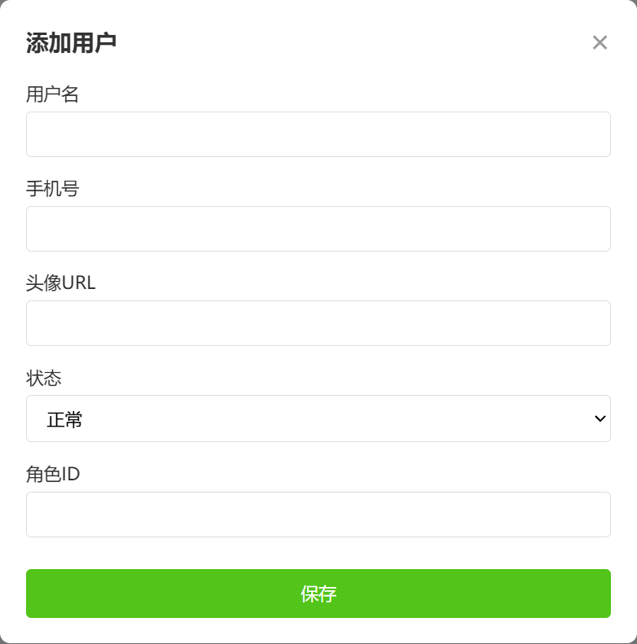

**功能目标**：实现用户信息新增功能，用户核心信息通过请求体（JSON 格式）传递，接口返回新增后的完整用户数据（含自动生成的 ID、创建 / 更新时间）。

- **请求方式**：POST

- **请求 URL**：`/user`

- 参数说明（请求体传递，JSON 格式）：

  | 参数名   | 类型    | 是否必填 | 描述                                     |
  | -------- | ------- | -------- | ---------------------------------------- |
  | username | String  | 是       | 用户名                                   |
  | phone    | String  | 是       | 手机号（唯一）                           |
  | avatar   | String  | 否       | 头像 URL（默认空）                       |
  | status   | Integer | 否       | 用户状态（0 - 禁用，1 - 正常，默认值 1） |
  | roleId   | Integer | 是       | 角色 ID                                  |

- 请求体数据

  ```json
{
    "username": "newUser",
    "phone": "13800138003",
    "avatar": "https://example.com/avatar/new.jpg",
    "status": 1,
    "roleId": 2
  }
  ```


- 返回值说明：

  数据格式为 JSON 对象，包含自动生成的 ID、创建 / 更新时间等完整用户信息，示例如下：

  ```json
  {
    "id": 3,
    "username": "newUser",
    "phone": "13800138003",
    "avatar": "https://example.com/avatar/new.jpg",
    "status": 1,
    "roleId": 2,
    "createTime": "2025-01-10 08:00:00",
    "updateTime": "2025-01-10 08:00:00"
  }
  ```

##### 需求 2：根据 ID 更新用户信息接口

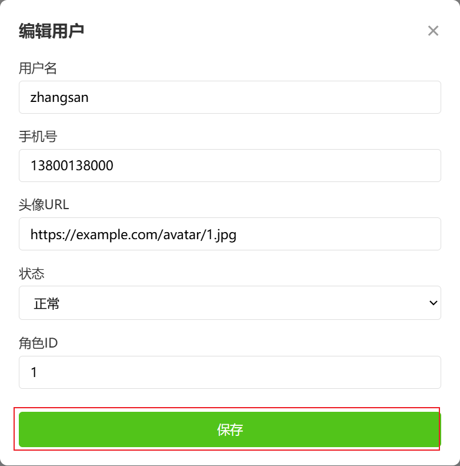

**功能目标**：实现用户信息部分更新功能，用户 ID 通过 URL 路径参数传递（定位待更新资源），待更新字段通过请求体（JSON 格式）传递（支持部分字段更新，不传则不更新），返回更新后的完整用户数据。

- **请求方式**：PUT

- **请求 URL**：`/user/{id}`（`{id}`为用户唯一 ID，路径动态参数）

- 参数说明：

  | 参数名   | 位置   | 类型    | 是否必填 | 描述                           |
  | -------- | ------ | ------- | -------- | ------------------------------ |
  | id       | 路径   | Long    | 是       | 用户唯一标识 ID                |
  | username | 请求体 | String  | 否       | 用户名（选填，不传则不更新）   |
  | phone    | 请求体 | String  | 否       | 手机号（选填，不传则不更新）   |
  | avatar   | 请求体 | String  | 否       | 头像 URL（选填，不传则不更新） |
  | status   | 请求体 | Integer | 否       | 用户状态（选填，不传则不更新） |
  | roleId   | 请求体 | Integer | 否       | 角色 ID（选填，不传则不更新）  |

- 请求体数据

  ```json
{
    "id": 1,
    "username": "updateUser111",
    "phone": "13800111111",
    "avatar": "https://example.com/avatar/update1.jpg",
    "status": 0,
    "roleId": 1
  }
  ```


- 返回值说明：

  数据格式为 JSON 对象，包含更新后的完整用户信息（创建时间不变，更新时间刷新），示例如下：

  ```json
  {
    "id": 1,
    "username": "updateUser111",
    "phone": "13800111111",
    "avatar": "https://example.com/avatar/update1.jpg",
    "status": 0,
    "roleId": 1,
    "createTime": "2025-01-01 10:00:00",
    "updateTime": "2026-01-05 09:00:00"
  }
  ```

##### 需求 3：根据 ID 删除用户信息接口

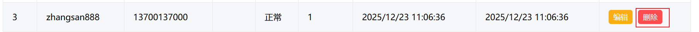

**功能目标**：实现用户信息删除功能，用户 ID 通过 URL 路径参数传递（定位待删除资源），返回 JSON 格式的删除状态提示。

- **请求方式**：DELETE

- **请求 URL**：`/user/{id}`（`{id}`为用户唯一 ID，路径动态参数）

- 参数说明：

  | 参数名 | 位置 | 类型 | 是否必填 | 描述            |
  | ------ | ---- | ---- | -------- | --------------- |
  | id     | 路径 | Long | 是       | 用户唯一标识 ID |

- 返回值说明：

  数据格式为 JSON 对象，包含删除操作的成功状态和提示信息，示例如下：

  ```json
  {
    "success": true,
    "message": "用户ID为1的用户删除成功"
  }
  ```

##### 总结

1. 新增 / 更新接口核心：通过`@RequestBody`接收请求体中的 JSON 参数，POST 用于创建资源、PUT 用于更新资源，符合 RESTful 语义；
2. 更新 / 删除接口核心：路径参数`{id}`定位具体资源（`@PathVariable`接收），更新接口结合 “路径参数 + JSON 请求体” 实现部分字段更新；
3. 返回值设计：新增 / 更新返回完整资源数据，删除返回操作状态提示，符合前端对不同操作的响应数据需求。

#### 2.3.2 JSON格式数据说明

JSON 是前后端数据交互的「通用语言」—— 就像不同国家的人交流用通用语（如英语），前端（网页 / APP）和后端（服务器）无论使用什么编程语言开发，都能通过 JSON 轻松传递、解析数据，是跨语言、轻量级的文本数据格式，也是前后端交互的 “标配”。

JSON 全称 `JavaScript Object Notation`（JavaScript 对象表示法），但它**并非仅 JavaScript 可用**，Java、Python、PHP 等所有主流编程语言都能解析 / 生成，完全摆脱了编程语言的限制。

核心特点：

- 纯文本：易读取、易网络传输，人能直观看懂，计算机也能快速解析；
- 结构清晰：基于 “键值对” 和 “数组” 组织数据，贴合日常 “表格 / 清单” 的表达逻辑；
- 跨语言：前端（Vue/React）和后端（Java/SpringBoot）无沟通壁垒，是通用数据格式。

图解参考：

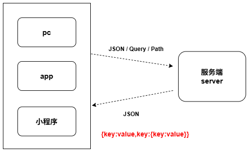

##### 2.3.2.1 JSON 基础语法规则

JSON 最核心的组成单位是「键值对」（键：值），就像给数据贴 “唯一标签”，前后端都能通过 “标签名” 精准获取对应数据，核心规则必须严格遵守：

​	✅ 键（标签名）必须用**双引号**包裹（单引号 / 无引号均为非标准 JSON，易导致解析失败）；

​	✅ 值支持多种类型：字符串（双引号）、数字、布尔值（true/false，无引号）、数组、嵌套 JSON 对象；

​	✅ 多个键值对之间用逗号分隔，**最后一个键值对末尾不能加逗号**；

​	✅ 单个数据对象整体用大括号 `{}` 包裹。

##### 2.3.2.2 基础示例（单个用户信息）

对应之前的 “用户详情” 场景，JSON 格式如下（注释仅作说明，标准 JSON 不支持注释）：

```json
{
  "id": 1,          // 键："id"，值：数字类型（无需引号）
  "username": "testUser1",  // 键："username"，值：字符串类型（必须双引号）
  "status": 1,       // 键："status"，值：数字类型
  "isVip": false     // 键："isVip"，值：布尔类型（true/false，无引号）
}
```

##### 2.3.2.3 数组结构（多个同类数据）

若要传递一组数据（如用户列表），用**中括号 `[]`** 包裹多个 JSON 对象，对象之间用逗号分隔：

```json
[
  {"id": 1, "username": "testUser1", "status": 1},
  {"id": 2, "username": "testUser2", "status": 0}
]
```

##### 2.3.2.4 嵌套结构（复杂数据）

当数据结构复杂时（如用户信息包含角色信息），值可以是嵌套的 JSON 对象或数组，满足复杂业务数据的传递需求：

```json
{
  "id": 1,
  "username": "testUser1",
  "role": {          // 值为嵌套的JSON对象（角色信息）
    "roleId": 1,
    "roleName": "管理员"
  },
  "hobby": ["篮球", "看书"]  // 值为数组（字符串元素需双引号）
}
```

##### 总结

1. JSON 是前后端通用的数据格式，核心优势是跨语言、结构清晰、易解析；
2. 语法核心是 “键值对”，键必须用双引号，值支持多类型，末尾无多余逗号；
3. 数组用 `[]` 包裹多个对象，嵌套结构可满足复杂数据传递需求。

#### 2.3.3 需求1：保存用户信息接口实现&JSON接收

##### 2.3.3.1 Postman 接口测试工具（使用说明）

Postman 是前后端接口开发 / 测试的常用工具，可模拟前端向服务器发送各类请求（如 POST 传递 JSON 数据），快速验证接口功能是否符合预期。

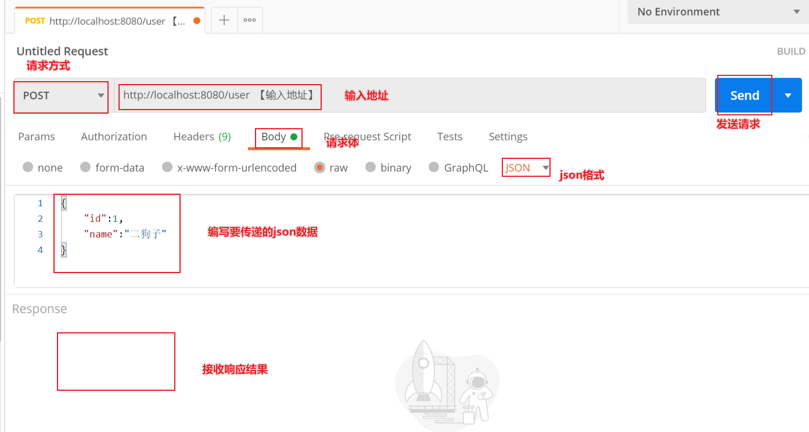

##### 2.3.3.2 接口实战实现

核心需求：通过 POST 请求接收请求体中的 JSON 格式用户数据，完成用户新增，并返回包含自动生成 ID、创建 / 更新时间的完整用户信息。

```java
// 类级别@RequestMapping("user")：配置当前控制器所有方法的通用路径前缀
@RequestMapping("user")
@RestController // 等价于@Controller + @ResponseBody，方法返回值自动转为JSON
public class UserController {

    /**
     * 新增用户接口：POST /user
     * 核心要点：
     * 1. @PostMapping：限定仅接收POST请求（符合RESTful创建资源的语义）；
     * 2. @RequestBody：将请求体中的JSON数据绑定到SysUser实体类参数（区别于QueryString参数接收）；
     * 3. 未加@RequestBody时，实体类默认接收QueryString参数，加注解后专用于接收JSON请求体。
     */
    @PostMapping
    public SysUser saveUser(@RequestBody SysUser user) {
        System.out.println("接收的JSON参数：" + user);
        // 调用模拟工具类保存用户（自动生成ID、创建/更新时间）
        SysUserDataUtil.saveUser(user);
        System.out.println("返回的完整用户数据：" + user);
        // 返回新增后的完整用户信息（自动转为JSON响应给前端）
        return user;
    }
}
```

##### 2.3.3.3 @RequestBody 注解详解

`@RequestBody`是 SpringMVC 接收请求体数据的核心注解，专门解决 JSON 格式数据的解析与绑定问题，无需手动处理 JSON 字符串转换。

核心作用

1. 绑定 HTTP 请求体中的数据（前后端交互主流为 JSON 字符串）到控制器方法的参数；
2. 自动完成 “JSON 字符串 → Java 对象 / 集合” 的转换（如 JSON 转 SysUser 实体、Map），无需手动解析。

关键细节

1. **请求类型限制**：仅适用于有请求体的请求（POST/PUT/PATCH 为主），GET 请求无请求体，使用`@RequestBody`会无效（甚至抛异常）；
2. **数据格式支持**：默认解析 JSON 格式（前后端交互标配），如需解析 XML 需额外配置消息转换器；
3. **必填性控制**：默认`required=true`（请求体不能为空），若前端未传请求体，会抛出`400 Bad Request`异常；可通过`@RequestBody(required = false)`设置允许空请求体；
4. 支持的接收类型
   - 自定义实体类（最常用）：需保证实体类属性名与 JSON 键名一致（大小写敏感），如`{"username":"张三"}`对应 SysUser 的`username`属性；
   - `Map<String, Object>`：适配字段不固定的 JSON 数据（如动态表单场景）；
5. **典型搭配场景**：常与`@PostMapping`（新增资源）、`@PutMapping`（更新资源）配合，对应前端提交 JSON 数据的业务场景。

##### 2.3.3.4 总结

1. `@RequestBody`是接收 JSON 请求体的核心注解，与`@PostMapping`搭配实现新增用户接口，符合 RESTful 设计规范；

2. 实体类加`@RequestBody`接收 JSON，不加则默认接收 QueryString 参数，需根据参数传递方式选择；

3. `@RequestBody`仅适用于有请求体的请求，GET 请求无需使用，必填性可通过`required`属性调整。


#### 2.3.4 需求2：根据id更新用户信息接口实现

```java
/*
    实现根据用户 ID 精准更新用户信息的功能，用户 ID 作为 URL 路径参数传递，待更新的字段通过请求体（JSON）传递（支持部分字段更新），返回更新后的完整用户数据。
        - **请求方式**：PUT
        - **请求 URL**：`/user/{id}`
    路径参数和请求体同时接收参数
 */
@PutMapping("{id}")
public SysUser updateUser(@PathVariable Long id, @RequestBody SysUser sysUser) {
    System.out.println("id = " + id + ", sysUser = " + sysUser);
    SysUserDataUtil.updateUserById(id,sysUser);
    System.out.println("sysUser = " + sysUser);
    return sysUser;
}
```

注意：多种参数（queryString,path,json）可以同时接收,也不用区分在方法中的先后顺序！


#### 2.3.5 需求3：根据id删除用户信息接口实现

```java
@RequestMapping("user")
@RestController
public class UserController {

    /*
        实现根据用户 ID 删除用户的功能，用户 ID 作为 URL 路径参数传递，返回删除成功的状态提示。
            - **请求方式**：DELETE
            - **请求 URL**：`/user/{id}`
     */
    @DeleteMapping("{id}")
    public Map<String,Object> removeUser(@PathVariable Long id) {
        Map<String,Object> map = new HashMap<String,Object>();
        boolean deleted = SysUserDataUtil.deleteUserById(id);
        map.put("success", deleted);
        map.put("message", (deleted?"删除id为%d用户成功过！":"删除id为%s用户失败").formatted(id));
        return map;
    }
}
```


### 2.4 扩展：请求头&原生请求对象

#### 2.4.1 请求头接收

**核心注解**：`@RequestHeader`

**作用**：绑定 HTTP 请求头中的指定字段到控制器方法参数，无需手动解析请求头。

**示例**：

```java
// 获取请求头中的token、Content-Type
@GetMapping("/header")
public String getHeader(
    @RequestHeader String token, // 直接绑定请求头token字段
    @RequestHeader("Content-Type") String contentType, // 指定请求头名称
    @RequestHeader(required = false) String userId // 非必填，无则为null
) {
    return "token：" + token + "，Content-Type：" + contentType;
}
```

**关键细节**：

- 支持指定请求头名称、设置非必填（`required=false`）；
- 常用于获取 token、设备类型、语言等请求头信息。

#### 2.4.2 原生Request对象获取

**核心对象**：`HttpServletRequest`

**作用**：直接获取原生请求对象，可拿到请求头、QueryString、路径、IP 等所有请求相关信息。

**示例**：

```java
@PostMapping("/demo") // 用POST，可同时获取QueryString+请求体
public String getRequestInfo(HttpServletRequest request) throws Exception {
    // 1. 获取请求方式（GET/POST/PUT/DELETE等）
    String method = request.getMethod();

    // 2. 获取请求路径（如/native-request/demo）
    String path = request.getRequestURI();

    // 3. 获取请求头（示例：token、Content-Type）
    String token = request.getHeader("token");
    String contentType = request.getHeader("Content-Type");

    // 4. 获取QueryString参数（URL后缀?username=张三）
    String username = request.getParameter("username");

    // 5. 获取请求体（JSON/字符串，仅POST/PUT等有请求体的请求可用）
    BufferedReader reader = request.getReader();
    StringBuilder requestBody = new StringBuilder();
    String line;
    while ((line = reader.readLine()) != null) {
        requestBody.append(line);
    }

    // 拼接结果返回
    return "请求方式：" + method + "\n"
        + "请求路径：" + path + "\n"
        + "请求头token：" + token + "\n"
        + "Content-Type：" + contentType + "\n"
        + "Query参数username：" + username + "\n"
        + "请求体内容：" + requestBody;
}
```

**关键细节**：

- 方法参数直接声明`HttpServletRequest`，Spring 自动注入；
- 适合需要批量获取请求信息、兼容老代码的场景（无需注解，直接调用 API）。
- **请求方式**：`request.getMethod()` → 直接返回 GET/POST 等字符串；
- **请求路径**：`request.getRequestURI()` → 返回当前接口的路径（不含域名 / 端口）；
- **请求头**：`request.getHeader("头名称")` → 按名称获取单个请求头；
- **Query 参数**：`request.getParameter("参数名")` → 读取 URL 后缀 `?key=value` 格式的参数；
- **请求体**：通过 `request.getReader()` 读取流（仅 POST/PUT 有效，GET 无请求体），需注意流只能读取一

## 三、SpringMVC响应数据详解

### 3.1 Web 项目开发模式：前后端分离 vs 混合开发

#### 3.1.1 前后端分离模式

**核心定义**：前端（负责页面渲染、用户交互，如按钮点击、表单输入）与后端（负责业务逻辑、数据存储 / 查询，如登录验证、数据库操作）完全独立开发、独立部署的开发模式，二者仅通过接口完成数据交互。

**核心特点**：

- 技术栈独立：前端可选用 Vue/React/Uniapp 等框架，后端可使用 Java/Go/Python 等语言，开发团队可并行工作，互不依赖；
- 通信方式：基于 RESTful API 接口交互，数据格式统一使用 JSON（主流）或 XML，前端调用接口获取数据后，自行完成页面渲染；
- 核心优势：代码解耦度高、维护成本低，支持多端适配（同一套后端接口可对接网页、APP、小程序），适合中大型项目或需要快速迭代的产品；
- 典型流程：用户在前端输入账号密码 → 前端调用后端`/login`接口（传递 JSON 格式参数）→ 后端验证后返回 JSON 格式结果 → 前端根据结果展示 “登录成功” 或 “登录失败” 页面。

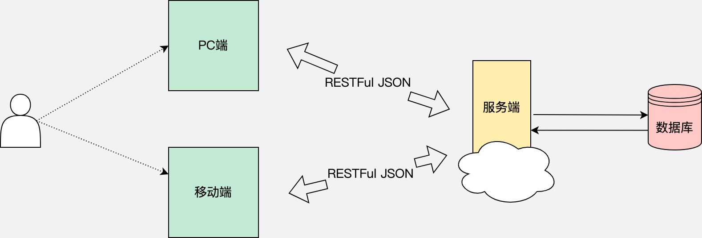

#### 3.1.2 混合 Web 开发模式

**核心定义**：前端页面模板与后端业务代码集成在同一个项目中，共享同一套技术栈（如 Java + JSP/Thymeleaf），由后端直接控制页面渲染和数据传递的开发模式。

**核心特点**：

- 代码高度集成：前端页面模板（如 JSP）与后端业务代码（如 Controller）在同一工程内，后端通过 “共享域”（Request、Session 等）将数据传递到页面模板；
- 渲染方式：后端处理完业务逻辑后，直接将数据嵌入页面模板，生成完整的 HTML 页面返回给浏览器，无需前端单独调用接口；
- 核心优势：技术栈统一，开发、部署简单（仅需部署一个项目），学习成本低，适合小型项目、内部管理系统或快速开发的场景；
- 核心局限：代码耦合度高（修改页面可能需要改动后端代码），扩展性差，难以适配多端，中大型项目的维护难度会随代码量增加显著上升；
- 典型流程：用户访问`/user/list`地址 → 后端查询用户数据 → 将数据存入 Request 域 → 通过 JSP 标签（如`${user.name}`）将数据嵌入页面 → 返回完整 HTML 页面给浏览器。

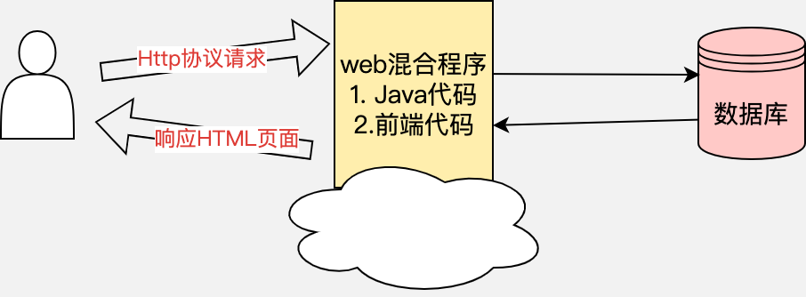

#### 3.1.3 前后端分离 vs 混合 Web 开发模式

| 对比维度             | 前后端分离模式                                  | 混合 Web 开发模式                                            |
| -------------------- | ----------------------------------------------- | ------------------------------------------------------------ |
| 核心定义（后端视角） | 仅负责提供数据接口，不参与页面渲染              | 集成页面模板与业务逻辑，主导页面渲染                         |
| 后端参数接收         | 支持三种：queryString,path,json                 | 支持三种：queryString,path,json                              |
| 数据传递 / 共享方式  | 无共享域（Request/Session），仅通过接口返回数据 | 依赖共享域（Request/Session/Application）传递数据到页面      |
| 模板语言使用         | 不使用模板语言（前端自行渲染）                  | 依赖模板语言（JSP/Thymeleaf/Freemarker）嵌入数据             |
| 转发 / 重定向        | 无（前端自主控制页面跳转）                      | 核心操作（后端通过`forward`转发、`redirect`重定向控制页面流转） |
| 响应数据格式         | 统一返回 JSON（主流），仅包含数据               | 返回完整 HTML 页面（数据已嵌入模板），无独立 JSON 响应       |
| 后端核心输出         | 结构化数据（接口结果）                          | 完整渲染的 HTML 页面                                         |

### 3.2 转发 & 重定向 & 共享域 & 模板页面

#### 3.2.1 转发和重定向

##### 3.2.1.1 转发和重定向的作用 & 核心区别

转发（Forward）和重定向（Redirect）是混合开发模式中**页面 / 资源跳转**的核心方式（如登录成功后跳转到首页、查询失败后跳转到错误页），二者的核心作用与区别如下：

- 转发：由服务器内部完成页面跳转，整个过程仅触发 1 次 HTTP 请求，浏览器地址栏 URL 保持不变，适用于当前应用内的页面跳转（如查询用户列表后跳转到结果页）；
- 重定向：服务器返回响应通知浏览器发起第 2 次 HTTP 请求，浏览器地址栏 URL 会更新为新地址，适用于防表单重复提交、跨应用跳转或外部链接跳转场景。

**核心区别对比表**：

| 对比维度      | 转发（Forward） | 重定向（Redirect）  |
| ------------- | --------------- | ------------------- |
| HTTP 请求次数 | 1 次            | 2 次                |
| 浏览器地址栏  | URL 保持不变    | URL 更新为新地址    |
| 跳转范围      | 仅当前应用内部  | 可跨应用 / 外部 URL |

总结

1. 前后端分离模式核心是 “后端出数据、前端做渲染”，解耦度高适配多端；混合开发模式核心是 “后端既出数据又渲染页面”，开发简单但耦合度高；
2. 转发是服务器内部跳转（1 次请求、URL 不变），重定向是浏览器二次请求（2 次请求、URL 更新），均为混合开发的核心页面跳转方式；
3. 两种开发模式的参数接收方式一致，但数据传递、页面渲染、响应格式差异显著，需根据项目规模和需求选择。

##### 3.2.1.2 转发 & 重定向语法演示（基于 SpringBoot+Thymeleaf）

###### ① 前置准备：核心依赖

混合开发模式需引入 Web 核心依赖和模板引擎依赖（Thymeleaf 是 SpringBoot 推荐的模板语言，替代传统 JSP）：

```xml
<!-- SpringBoot Web核心依赖（提供Controller、请求映射等基础能力） -->
<dependency>
    <groupId>org.springframework.boot</groupId>
    <artifactId>spring-boot-starter-web</artifactId>
</dependency>
<!-- Thymeleaf模板引擎依赖（渲染HTML页面，混合开发核心） -->
<dependency>
    <groupId>org.springframework.boot</groupId>
    <artifactId>spring-boot-starter-thymeleaf</artifactId>
</dependency>
```

###### ② 转发（Forward）语法演示

**核心逻辑**：通过`forward: + 目标路径`实现服务器内部跳转，全程仅 1 次 HTTP 请求，地址栏 URL 不变。

Step1：编写跳转控制器（Controller）

```java
// 注意：混合开发需用@Controller（而非@RestController），返回值为页面路径而非JSON
@Controller
@RequestMapping("/jump")
public class JumpController {
    /**
     * 转发入口方法：触发服务器内部跳转
     * 语法：return "forward:目标请求路径"
     */
    @GetMapping("/toForward")
    public String toForward() {
        // 转发到/jump/showForward路径（服务器内部跳转，浏览器无感知）
        return "forward:/jump/showForward";
    }

    /**
     * 转发目标方法：映射到具体页面
     * 返回值"forward-page"对应resources/templates/forward-page.html
     */
    @GetMapping("/showForward")
    public String showForward() {
        // SpringBoot中Thymeleaf页面默认存放在resources/templates目录下
        return "forward-page";
    }
}
```

Step2：编写 Thymeleaf 页面（resources/templates/forward-page.html）

Thymeleaf 页面需引入命名空间`xmlns:th="http://www.thymeleaf.org"`，才能使用模板语法：

```html
<!DOCTYPE html>
<!-- 引入Thymeleaf命名空间，开启模板语法支持 -->
<html xmlns:th="http://www.thymeleaf.org">
<head>
    <meta charset="UTF-8">
    <title>转发页面</title>
</head>
<body>
    <h3>✅ 转发跳转成功</h3>
    <p>核心特征：浏览器地址栏URL仍为 /jump/toForward（未变化）</p>
</body>
</html>
```

Step3：测试验证

访问 `http://localhost:8080/jump/toForward`，核心现象：

- 浏览器地址栏 URL 保持为 `http://localhost:8080/jump/toForward`（无变化）；
- 页面显示 “转发跳转成功”，验证转发逻辑生效。

###### ③ 重定向（Redirect）语法演示

**核心逻辑**：通过`redirect: + 目标路径`通知浏览器发起二次请求，地址栏 URL 会更新为目标路径。

Step1：编写 Controller（在 JumpController 中新增方法）

```java
/**
 * 重定向入口方法：通知浏览器发起二次请求
 * 语法：return "redirect:目标请求路径"
 */
@GetMapping("/toRedirect")
public String toRedirect() {
    // 通知浏览器重定向到/jump/showRedirect路径
    return "redirect:/jump/showRedirect";
}

/**
 * 重定向目标方法：映射到具体页面
 * 返回值"redirect-page"对应resources/templates/redirect-page.html
 */
@GetMapping("/showRedirect")
public String showRedirect() {
    return "redirect-page";
}
```

Step2：编写 Thymeleaf 页面（resources/templates/redirect-page.html）

```html
<!DOCTYPE html>
<html xmlns:th="http://www.thymeleaf.org">
<head>
    <meta charset="UTF-8">
    <title>重定向页面</title>
</head>
<body>
    <h3>✅ 重定向跳转成功</h3>
    <p>核心特征：浏览器地址栏URL已更新为 /jump/showRedirect</p>
</body>
</html>
```

Step3：测试验证

访问 `http://localhost:8080/jump/toRedirect`，核心现象：

- 浏览器地址栏 URL 从 `http://localhost:8080/jump/toRedirect` 自动更新为 `http://localhost:8080/jump/showRedirect`；
- 页面显示 “重定向跳转成功”，验证重定向逻辑生效。

总结

1. 转发语法：`return "forward:目标路径"`，服务器内部跳转，1 次请求、URL 不变；
2. 重定向语法：`return "redirect:目标路径"`，浏览器二次请求，2 次请求、URL 更新；
3. 混合开发中需用`@Controller`（而非`@RestController`），返回值为页面路径（对应 templates 目录下的 HTML 文件）；
4. Thymeleaf 页面默认存放在`resources/templates`目录，需引入命名空间才能使用模板语法。

#### 3.2.2 共享域技术

##### 3.2.2.1 共享域的核心作用&分类

在转发 / 重定向的跳转场景中，普通局部变量无法跨方法、跨请求传递数据（比如登录成功后的 “操作提示”、查询到的 “用户列表”），共享域是服务器提供的**全局数据存储容器**，专门解决跳转过程中的动态数据传递问题，让后端能把数据传递到前端页面渲染。


**分类（按作用域从小到大划分）**

共享域的核心区别在于 “作用范围” 和 “跳转支持性”，开发中需按需选择（优先用作用域小的，减少资源占用）：

| 共享域         | 作用范围                                     | 跳转支持场景             |
| -------------- | -------------------------------------------- | ------------------------ |
| Request 域     | 仅单次 HTTP 请求内有效（请求结束即销毁）     | 仅转发有效（重定向失效） |
| Session 域     | 一次用户会话内有效（浏览器未关闭 / 未超时）  | 转发 + 重定向均有效      |
| ServletContext | 整个应用生命周期内有效（全局共享，重启失效） | 所有跳转均有效           |

##### 3.2.2.2 共享域实战：实现动态页面效果

通过三个典型场景，演示不同共享域在跳转传值中的使用方式（基于 Thymeleaf 模板渲染动态数据）。

###### 场景 1：转发 + Request 域传参（单次请求有效）

核心特点：Request 域数据仅在当前 HTTP 请求内有效，适合 “一次性” 的动态提示（如转发页面的操作结果）。

Step1：修改 Controller，添加 Request 域传参逻辑

```java
/**
 * 转发+Request域传参
 * 核心：通过HttpServletRequest对象操作Request域，数据仅本次请求有效
 */
@GetMapping("/forwardWithData")
public String forwardWithData(HttpServletRequest request) {
    // 1. 往Request域存入动态数据（key=tip，value=提示文本）
    request.setAttribute("tip", "这是转发的动态提示（Request域）！");
    // 2. 转发到/showForward路径
    return "forward:/jump/showForward";
}

/**
  * 转发目标方法：映射到具体页面
  * 返回值"forward-page"对应resources/templates/forward-page.html
  */
@GetMapping("/showForward")
public String showForward() {
    // SpringBoot中Thymeleaf页面默认存放在resources/templates目录下
    return "forward-page";
}
```

Step2：修改 forward-page.html，渲染 Request 域数据

Thymeleaf 通过`${key}`直接获取 Request 域中的数据：

```html
<!DOCTYPE html>
<html xmlns:th="http://www.thymeleaf.org">
<head>
    <meta charset="UTF-8">
    <title>转发页面</title>
</head>
<body>
    <h3>✅ 转发跳转成功</h3>
    <!-- 渲染Request域中的tip数据 -->
    <p>动态提示：<span th:text="${tip}"></span></p>
</body>
</html>
```

Step3：测试验证

访问 `http://localhost:8080/jump/forwardWithData`，核心现象：

- 浏览器地址栏 URL 不变；
- 页面显示 “动态提示：这是转发的动态提示（Request 域）！”，验证 Request 域传参生效；
- 刷新页面后，Request 域数据消失（单次请求有效）。

###### 场景 2：重定向 + Session 域传参（会话内有效）

核心特点：Session 域数据在用户会话内有效，适合跨请求的用户级数据（如登录后的用户信息、重定向的操作提示）。

Step1：修改 Controller，添加 Session 域传参逻辑

```java
/**
 * 重定向+Session域传参
 * 核心：通过HttpSession对象操作Session域，数据在用户会话内有效
 */
@GetMapping("/redirectWithData")
public String redirectWithData(HttpSession session) {
    // 1. 往Session域存入动态数据（key=tip，value=提示文本）
    session.setAttribute("tip", "这是重定向的动态提示（Session域）！");
    // 2. 重定向到/showRedirect路径
    return "redirect:/jump/showRedirect";
}

/**
 * 重定向目标方法：映射到具体页面
 * 返回值"redirect-page"对应resources/templates/redirect-page.html
 */
@GetMapping("/showRedirect")
public String showRedirect() {
    return "redirect-page";
}
```

Step2：修改 redirect-page.html，渲染 Session 域数据

Thymeleaf 通过`${session.key}`获取 Session 域中的数据：

```html
<!DOCTYPE html>
<html xmlns:th="http://www.thymeleaf.org">
<head>
    <meta charset="UTF-8">
    <title>重定向页面</title>
</head>
<body>
    <h3>✅ 重定向跳转成功</h3>
    <!-- 渲染Session域中的tip数据 -->
    <p>动态提示：<span th:text="${session.tip}"></span></p>
</body>
</html>
```

Step3：测试验证

访问 `http://localhost:8080/jump/redirectWithData`，核心现象：

- 浏览器地址栏 URL 更新为`/jump/showRedirect`；
- 页面显示 “动态提示：这是重定向的动态提示（Session 域）！”，验证 Session 域传参生效；
- 关闭浏览器前，刷新页面 / 访问其他页面，Session 域数据仍存在（会话内有效）。

###### 场景 3：全局参数（ServletContext 域，应用内有效）

核心特点：ServletContext 域是全局共享域，数据在应用启动后至重启前均有效，适合全应用的通用数据（如系统名称、全局公告）。

Step1：修改 Controller，添加 ServletContext 域传参逻辑

```java
/**
 * 全局域（ServletContext）传参
 * 核心：通过request获取ServletContext对象，数据全应用共享
 */
@GetMapping("/setGlobalData")
public String setGlobalData(HttpServletRequest request) {
    // 1. 往ServletContext全局域存入数据（key=globalTip，value=全局提示）
    request.getServletContext().setAttribute("globalTip", "这是全局动态提示（全应用可见）！");
    // 2. 转发到/showForward路径
    return "forward:/jump/showForward";
}

/**
  * 转发目标方法：映射到具体页面
  * 返回值"forward-page"对应resources/templates/forward-page.html
  */
@GetMapping("/showForward")
public String showForward() {
    // SpringBoot中Thymeleaf页面默认存放在resources/templates目录下
    return "forward-page";
}
```

Step2：修改 forward-page.html，渲染全局域数据

Thymeleaf 通过`${application.key}`获取 ServletContext 域中的数据（`application`是 ServletContext 的 Thymeleaf 别名）：

```html
<!DOCTYPE html>
<html xmlns:th="http://www.thymeleaf.org">
<head>
    <meta charset="UTF-8">
    <title>转发页面</title>
</head>
<body>
    <h3>✅ 转发跳转成功</h3>
    <p>动态提示：<span th:text="${tip}"></span></p>
    <!-- 渲染ServletContext全局域中的数据 -->
    <p>全局提示：<span th:text="${application.globalTip}"></span></p>
</body>
</html>
```

Step3：测试验证

访问 `http://localhost:8080/jump/setGlobalData`，核心现象：

- 页面显示 “全局提示：这是全局动态提示（全应用可见）！”；
- 打开新标签页访问项目任意页面，均可获取该全局数据（应用内有效）；
- 重启 SpringBoot 项目后，全局数据消失（应用生命周期内有效）。

##### 3.2.2.3 核心总结

1. 跳转传值：转发优先用 Request 域（单次请求、轻量），重定向必须用 Session 域（Request 域跨请求失效），全局数据用 ServletContext 域；
2. 作用域原则：优先选择作用域小的共享域（Request > Session > ServletContext），减少不必要的资源占用和数据冲突；
3. Thymeleaf 渲染：Request 域用`${key}`，Session 域用`${session.key}`，ServletContext 域用`${application.key}`；
4. 跳转本质：转发是服务器内 1 次请求（URL 不变），重定向是客户端 2 次请求（URL 更新），共享域需匹配跳转方式选择。

##### 3.2.2.4 扩展: 客户端存储数据Cookie

Cookie 是**客户端浏览器**的本地存储技术（而非服务端共享域），数据保存在用户浏览器中，核心特征：

- 存储位置：客户端（本地），而非服务端；
- 作用范围：可配置有效期（秒 / 天），即使关闭浏览器，只要未过期仍有效；
- 跳转支持：转发 / 重定向均有效，甚至跨会话（只要未过期）；
- 适用场景：适合长期保存的非敏感客户端数据（如记住登录状态、用户偏好设置）。

**场景 4：Cookie 客户端存储（跨会话有效）**

演示 Cookie 的设置、读取和渲染，对比服务端共享域理解 “客户端存储” 的差异。

**Step1：修改 Controller，添加 Cookie 操作逻辑**

```java
/**
 * Cookie 客户端存储演示
 * 核心：通过HttpServletResponse设置Cookie（客户端存储），HttpServletRequest读取Cookie
 */
@GetMapping("/setCookieData")
public String setCookieData(HttpServletResponse response, HttpServletRequest request) {
    // 1. 创建Cookie对象（key=cookieTip，value=提示文本）
    Cookie cookie = new Cookie("cookieTip", "这是客户端Cookie提示（跨会话有效）！");
    // 2. 配置Cookie有效期：3600秒（1小时），0表示立即删除，-1表示会话级（浏览器关闭失效）
    cookie.setMaxAge(3600);
    // 3. 设置Cookie生效路径（/表示整个应用生效）
    cookie.setPath("/");
    // 4. 将Cookie写入客户端浏览器
    response.addCookie(cookie);

    // 5. 重定向到/showCookie页面（验证Cookie跨跳转生效）
    return "redirect:/jump/showCookie";
}

/**
 * 读取Cookie并跳转至页面
 * 可选：也可在页面直接通过Thymeleaf读取Cookie，此处演示后端读取方式
 */
@GetMapping("/showCookie")
public String showCookie(HttpServletRequest request, Model model) {
    // 1. 获取客户端所有Cookie
    Cookie[] cookies = request.getCookies();
    String cookieTip = "未读取到Cookie数据";
    // 2. 遍历Cookie，找到key为cookieTip的内容
    if (cookies != null) {
        for (Cookie cookie : cookies) {
            if ("cookieTip".equals(cookie.getName())) {
                cookieTip = cookie.getValue();
                break;
            }
        }
    }
    // 3. 将Cookie数据存入Model（转发到页面渲染）
    request.setAttribute("cookieTip", cookieTip);
    return "cookie-page";
}
```

**Step2：创建 cookie-page.html，渲染 Cookie 数据**

提供两种读取方式：后端传值渲染 + Thymeleaf 直接读取 Cookie

```html
<!DOCTYPE html>
<html xmlns:th="http://www.thymeleaf.org">
<head>
    <meta charset="UTF-8">
    <title>Cookie演示页面</title>
</head>
<body>
    <h3>✅ Cookie客户端存储演示</h3>
    <!-- 方式1：后端读取Cookie后通过Model传值渲染 -->
    <p>后端读取Cookie：<span th:text="${cookieTip}"></span></p>
    <!-- 方式2：Thymeleaf直接读取客户端Cookie,了解
注：Thymeleaf 3.1+ 出于安全考虑，默认不再允许在模板表达式中直接访问 #request、#session 等-->
    <!-- <p>前端直接读取Cookie：<span th:text="${#request.cookies['cookieTip'].value}"></span></p>-->
</body>
</html>
```

Step3：测试验证

访问 `http://localhost:8080/jump/setCookieData`，核心现象：

- 浏览器地址栏更新为`/jump/showCookie`（重定向生效）；
- 页面显示 Cookie 提示文本，验证 Cookie 跨重定向生效；
- 关闭浏览器后重新打开，访问`/jump/showCookie`，Cookie 数据仍存在（1 小时内有效）；
- 清除浏览器 Cookie 后，数据消失。

### 3.3 案例3：静态资源访问&项目页面回显

#### 3.3.1 静态资源访问

##### 3.3.1.1 静态资源说明

在 Web 应用中，**静态资源是无需服务器端动态处理（编译、计算、拼接数据等），可直接读取并返回给浏览器的文件**。这类资源内容固定（除非文件本身被修改），与用户请求参数、后端业务逻辑无关，浏览器接收到后能直接解析、渲染或执行。

| 类别        | 典型文件格式                                           | 说明                   |
| ----------- | ------------------------------------------------------ | ---------------------- |
| 页面结构类  | HTML、HTM                                              | 网页的基础结构文件     |
| 样式类      | CSS、SCSS（编译后为 CSS）                              | 控制页面样式的文件     |
| 脚本类      | JS、TS（编译后为 JS）                                  | 实现页面交互的脚本文件 |
| 媒体类      | 图片（PNG/JPG/GIF/WebP/ICO）、音频（MP3）、视频（MP4） | 多媒体资源             |
| 字体 / 图标 | TTF/OTF/WOFF（字体）、SVG（图标）                      | 页面字体、图标资源     |
| 其他        | TXT、JSON（静态数据）、XML                             | 静态文本 / 数据文件    |

（补充：SpringBoot 中常说的 “静态资源访问”，核心就是让这些文件能通过浏览器 URL 直接访问，无需编写 Controller 接口处理。）

##### 3.3.1.2 静态资源存储位置和规则

SpringBoot 内置静态资源映射规则，默认扫描 `classpath`（项目 `resources` 目录）下以下目录（优先级从高到低），无需额外配置即可访问：

- `classpath:/META-INF/resources/`
- `classpath:/resources/`
- `classpath:/static/`（最常用）
- `classpath:/public/`

##### 3.3.1.3 默认位置静态资源访问规则

访问时**无需拼接目录名**，直接通过 `http://localhost:8080/资源名` 访问（SpringBoot 自动匹配上述目录中的资源）。

#### 3.3.2 演示：默认位置访问图片/HTML

**步骤 1：创建目录并放入资源**

在项目 `resources` 目录下新建 `static` 目录，放入两类静态资源：

- 图片：`static/avatar.png`（任意图片文件）；
- HTML：`static/index.html`（自定义简单页面）。

**步骤 2：编写静态 HTML（static/index.html）**

```html
<!DOCTYPE html>
<html lang="zh-CN">
<head>
    <meta charset="UTF-8">
    <title>静态资源演示</title>
</head>
<body>
    <h3>✅ 这是默认静态目录的HTML页面</h3>
    <!-- 访问同目录下的图片 -->
    
</body>
</html>
```

**步骤 3：启动项目访问验证**

- 访问 HTML 页面：`http://localhost:8080/index.html` → 页面正常显示，且加载图片；
- 直接访问图片：`http://localhost:8080/avatar.png` → 单独显示图片。

#### 3.3.3  自定义静态资源位置（配置方式）

若需指定自定义目录（如 `classpath:/my-static/`），两种简洁配置方式：

配置文件（application.properties）

```properties
# 自定义静态资源目录（支持多个，逗号分隔）
spring.web.resources.static-locations=classpath:/my-static/
# 可选：设置访问前缀（如访问需加 /res/ 前缀）
# spring.mvc.static-path-pattern=/res/**
```

#### 3.3.4 案例实现：联合静态页面效果

> 实现之前五个接口功能（sysUser）效果展示

##### 3.3.4.1 准备Controller

```java
//类上提取当前类中方法的最大公用前缀
@RequestMapping("user")
@RestController
public class UserController {

    /*
        实现根据用户 ID 删除用户的功能，用户 ID 作为 URL 路径参数传递，返回删除成功的状态提示。
            - **请求方式**：DELETE
            - **请求 URL**：`/user/{id}`
     */
    @DeleteMapping("{id}")
    public Map<String,Object> removeUser(@PathVariable Long id) {
        Map<String,Object> map = new HashMap<String,Object>();
        boolean deleted = SysUserDataUtil.deleteUserById(id);
        map.put("success", deleted);
        map.put("message", (deleted?"删除id为%d用户成功过！":"删除id为%s用户失败").formatted(id));
        return map;
    }

    /*
        实现根据用户 ID 精准更新用户信息的功能，用户 ID 作为 URL 路径参数传递，待更新的字段通过请求体（JSON）传递（支持部分字段更新），返回更新后的完整用户数据。
            - **请求方式**：PUT
            - **请求 URL**：`/user/{id}`
        路径参数和请求体同时接收参数
     */
    @PutMapping("{id}")
    public SysUser updateUser(@PathVariable Long id, @RequestBody SysUser sysUser) {
        System.out.println("id = " + id + ", sysUser = " + sysUser);
        SysUserDataUtil.updateUserById(id,sysUser);
        System.out.println("sysUser = " + sysUser);
        return sysUser;
    }
    /*
        实现新增用户的功能，用户信息通过请求体（JSON）传递，返回新增后的完整用户数据（含自动生成的 ID、创建 / 更新时间）。
            - **请求方式**：POST
            - **请求 URL**：`/user`
         方法（实体类） 默认接收queryString参数
         方法（@RequestBody SysUser user）接收请求体中的json数据
     */
    @PostMapping
    public SysUser saveUser(@RequestBody SysUser user) {
        System.out.println("入参："+user);
        SysUserDataUtil.saveUser(user);
        System.out.println("响应："+user);
        return user;
    }
    /*
       接口：根据id查询用户详情 get /user/id值
       本次利用路径传递参数，我们需要两步骤：
         1. 设计动态路径 （允许路径某些部分传递参数）
            例如： /user/1 -> 1这个位置就是动态，路径可以写成 /user/{id -》 这个id随意，就是后续获取的一个标记}
                  /user/1/app/2  -> 1 2都是动态 user app是固定的！ /user/{id}/app/{type}
         2. 利用形参列表进行参数接收 为了 queryString参数区分，必须使用@PathVariable注解
     */
     @GetMapping("{id}")
     public SysUser findById(@PathVariable Long id) {
         SysUser sysUser = SysUserDataUtil.getUserById(id);
         System.out.println("sysUser = " + sysUser);
         return sysUser;
     }

    /*
     基础实现：目标就是配置方法对应的访问地址，并且可以接收queryString参数即可
     接口：根据username phone 以及status进行用户列表查询接口基本实现！
            地址：/user/list
            参数：url?username=xx&phone=xx&status=xx  queryString类型
            返回：查询到的用户即可即可（后面详解json转化）
     路径配置： @RequestMapping("/user/list") 配置方法对外的访问地址
     客户端：  http:// 主机ip :8080 [application.properties ] / 项目根地址 [application.properties配置]  / [就是@RequestMapping指定]
     参数接收：直接可以在方法形参列表，声明请求参数同名和同类型参数即可接收
             (String username, String password,Integer status)
   */
    @RequestMapping("/list")
    public List<SysUser> getUserList(String username, String password,Integer status) {
        System.out.println("UserController.getUserList");
        System.out.println("username = " + username + ", password = " + password + ", status = " + status);
        List<SysUser> sysUserList = SysUserDataUtil.listUsers(username, password, status);
        System.out.println("sysUserList = " + sysUserList);
        return sysUserList;
    }
}
```

##### 3.4.4.2 导入静态页面

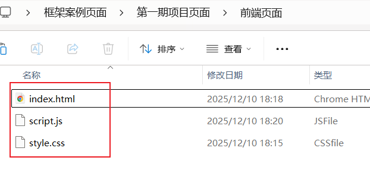

添加到resources/static文件夹中：

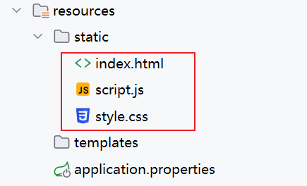

##### 3.4.4.3 项目根地址和端口号配置

注意：前端页面访问地址已经固定  http://localhost:8080/user/list

```js
const apiBaseUrl = 'http://localhost:8080'; // 请根据您的后端服务地址修改

// 1. 获取并展示用户列表
async function fetchUsers(params = {}) {
    const query = new URLSearchParams(params).toString();
    const url = `${apiBaseUrl}/user/list?${query}`;
```

后台端口必须是8080 根地址是 /

application.properties

```properties
spring.application.name=module04_springmvc_01
# 默认就是8080
server.port=8080
# 默认就是/
server.servlet.context-path=/
```

##### 3.4.4.4 访问测试

访问 HTML 页面：`http://localhost:8080/index.html` → 页面正常显示!

按照页面提示接口功能即可！

### 3.4 案例4：响应JSON数据和统一返回格式

#### 3.4.1 响应JSON格式和语法

##### 3.4.1.1 `@ResponseBody`

- **作用**：标注在**方法 / 类**上，告知 Spring MVC：方法的返回值不需要解析为视图（如 JSP/HTML），而是直接序列化为 JSON/XML 等格式，写入 HTTP 响应体中。

- 使用场景：

  标注在**方法**上：仅当前方法返回 JSON；

  标注在**Controller 类**上：类中所有方法默认返回 JSON。

- 示例：

  ```java
  @Controller
  @RequestMapping("/user")
  public class UserController {
      // 仅该方法返回JSON
      @GetMapping("/{id}")
      @ResponseBody
      public User getUserById(@PathVariable Long id) {
          // 业务逻辑
          return userService.getById(id);
      }
  }
  ```

##### 3.4.1.2 `@RestController`

- **作用**：Spring 4.0+ 提供的组合注解，等价于 `@Controller + @ResponseBody`，标注在类上时，**类中所有方法默认返回 JSON**，无需额外加`@ResponseBody`。

- **使用场景**：RESTful 接口的 Controller（前后端分离场景），是当前主流用法。

- 示例：

  ```java
  // 类中所有方法默认返回JSON
  @RestController
  @RequestMapping("/user")
  public class UserController {
      @GetMapping("/{id}")
      public User getUserById(@PathVariable Long id) {
          return userService.getById(id);
      }
  }
  ```

#### 3.4.2 优化响应格式设置通用返回结构（Result类）

##### 3.4.2.1 统一返回格式优化说明

原始直接返回对象 / 数组 / 自定义 JSON 的方式，问题很明显：

1. 格式乱：查列表返数组、查详情返对象、删数据返不一样的 JSON，前端得写好几种解析代码，特别容易写错；
2. 判错难：没有固定的数字标识（比如 200、400），只能靠文字判断错因，比如分不清是参数填错了，还是没查到用户；
3. 提示差：出问题要么返回空值，要么直接报错，前端只能跟用户说 “请求失败”，没法说清具体为啥错；
4. 改起来麻烦：想加个新内容（比如显示请求用了多久），得把所有接口都改一遍，又费时间又容易漏。

例如：

```json
[
  {
    "id": 1,
    "username": "testUser1",
    "phone": "13800138001",
    "status": 1
  }
]
```

而用统一的 Result 类返回就不一样了：

1. 格式统一：不管查列表、改数据还是删数据，返回的格式都一样，前端只写一套解析代码就行；
2. 判错简单：有固定数字码（200 = 成功、400 = 参数错、404 = 没找到），前端一眼就知道啥问题；
3. 提示清晰：能明确说清错在哪（比如 “手机号已存在”），前端可以直接把这个提示给用户看；
4. 加新内容容易：想加新信息，只改一次 Result 类，所有接口就都能带上，不用挨个改。

```json
{
  "code": 200,
  "message": "查询成功",
  "data": [
    {
      "id": 1,
      "username": "testUser1",
      "phone": "13800138001",
      "status": 1
    },
    {
      "id": 2,
      "username": "testUser2",
      "phone": "13800138002",
      "status": 0
    }
  ]
}
```

##### 3.4.2.2 设计统一返回Result类

为解决上述问题，设计统一的返回结果类 Result，让所有接口返回格式完全一致，核心包含 3个字段：

| 字段名  | 类型    | 说明                                                         |
| ------- | ------- | ------------------------------------------------------------ |
| code    | Integer | 业务状态码（200 = 成功，400 = 参数错误，500 = 系统异常，支持自定义） |
| message | String  | 提示信息（成功：“操作成功”；失败：“手机号已存在” 等具体原因） |
| data    | Object  | 业务数据（列表 = 数组、详情 = 对象、无数据 = null）          |

设计统一结果类为：

```java
/**
 * 统一接口返回结果类
 * 所有接口返回格式完全一致，解决格式混乱、异常无标准等问题
 * 核心字段：code（业务状态码）、message（提示信息）、data（业务数据）
 */
@Data
public class Result {
    /**
     * 业务状态码：200=成功，400=参数错误，500=系统异常（可自定义）
     */
    private Integer code;
    /**
     * 提示信息：成功返回"操作成功"，失败返回具体原因（如"手机号已存在"）
     */
    private String message;
    /**
     * 业务数据：列表返回数组、详情返回对象、无数据返回null
     */
    private Object data;
    // 私有构造方法，禁止外部直接new，保证返回格式规范
    private Result() {}
    // ========== 成功场景快捷方法 ==========
    /**
     * 成功返回（默认提示+业务数据）
     * @param data 业务数据（数组/对象/其他）
     * @return 统一返回结果
     */
    public static Result success(Object data) {
        return success("操作成功", data);
    }

    /**
     * 成功返回（自定义提示+业务数据）
     * @param message 自定义成功提示
     * @param data 业务数据
     * @return 统一返回结果
     */
    public static Result success(String message, Object data) {
        Result result = new Result();
        result.setCode(200);  // 成功固定状态码200
        result.setMessage(message);
        result.setData(data);
        return result;
    }

    // ========== 失败场景快捷方法 ==========
    /**
     * 失败返回（自定义状态码+提示，无数据）
     * @param code 业务状态码（如400/500）
     * @param message 失败具体原因
     * @return 统一返回结果
     */
    public static Result fail(Integer code, String message) {
        Result result = new Result();
        result.setCode(code);
        result.setMessage(message);
        result.setData(null);  // 失败场景默认无数据
        return result;
    }

    /**
     * 失败返回（默认系统异常码500+自定义提示）
     * @param message 失败具体原因
     * @return 统一返回结果
     */
    public static Result fail(String message) {
        return fail(500, message);
    }
}
```

#### 3.4.3 案例4：完善和实现（统一结果）

##### 3.4.3.1 导入第二期前端页面资源(解析统一结果格式)

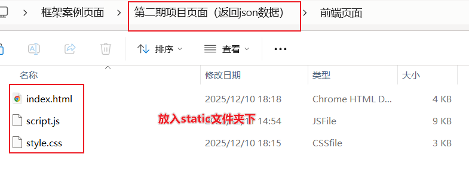

##### 3.4.3.2 修controller类添加统一结果类处理

###### 步骤1：导入统一结果类

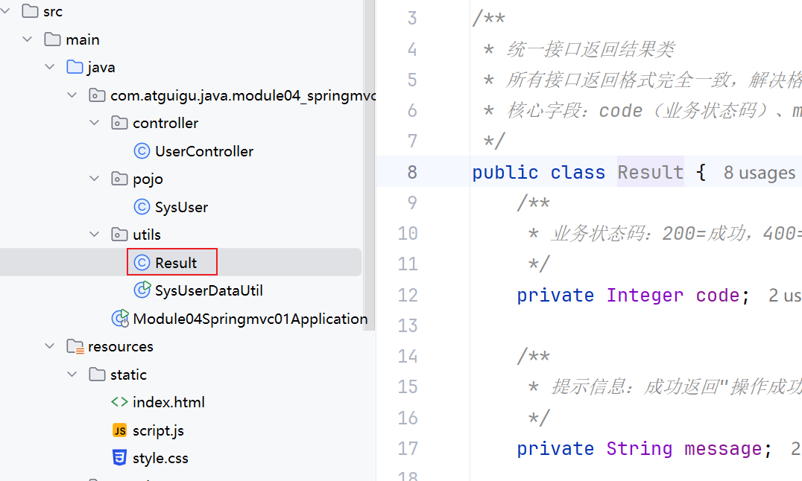

###### 步骤2：修改实现controller

```java
//类上提取当前类中方法的最大公用前缀
@RequestMapping("user")
@RestController
public class UserController {

    /**
     * 根据ID删除用户
     * @param id 用户ID
     * @return 统一Result格式响应
     */
    @DeleteMapping("{id}")
    public Result removeUser(@PathVariable Long id) {
        boolean deleted = SysUserDataUtil.deleteUserById(id);
        if (deleted) {
            // 删除成功：200 + 成功提示 + 无数据
            return Result.success("删除ID为" + id + "的用户成功！");
        } else {
            // 删除失败：500 + 失败提示 + 无数据
            return Result.fail("删除失败：ID为" + id + "的用户不存在！");
        }
    }

    /**
     * 根据ID更新用户（支持部分字段更新）
     * @param id 用户ID
     * @param sysUser 待更新的用户信息（请求体JSON）
     * @return 统一Result格式响应
     */
    @PutMapping("{id}")
    public Result updateUser(@PathVariable Long id, @RequestBody SysUser sysUser) {
        System.out.println("id = " + id + ", sysUser = " + sysUser);
        // 执行更新操作
        Boolean updatedUser = SysUserDataUtil.updateUserById(id, sysUser);
        if (updatedUser){
            return Result.success("更新ID为" + id + "的用户成功！");
        }
        return Result.fail("更新失败：ID为" + id + "的用户不存在！");
    }

    /**
     * 新增用户
     * @param user 新增用户信息（请求体JSON）
     * @return 统一Result格式响应
     */
    @PostMapping
    public Result saveUser(@RequestBody SysUser user) {
        System.out.println("新增用户入参：" + user);
        // 执行新增操作
        SysUser savedUser = SysUserDataUtil.saveUser(user);
        System.out.println("新增后用户：" + savedUser);
        // 新增成功：200 + 成功提示 + 新增后的用户数据
        return Result.success("新增用户成功！", savedUser);
    }

    /**
     * 根据ID查询用户详情
     * @param id 用户ID
     * @return 统一Result格式响应
     */
    @GetMapping("{id}")
    public Result findById(@PathVariable Long id) {
        SysUser sysUser = SysUserDataUtil.getUserById(id);
        System.out.println("查询到的用户：" + sysUser);
        if (sysUser == null) {
            // 查询失败：500 + 失败提示 + 无数据
            return Result.fail("查询失败：ID为" + id + "的用户不存在！");
        }
        // 查询成功：200 + 成功提示 + 用户详情数据
        return Result.success("查询成功！", sysUser);
    }

    /**
     * 条件查询用户列表（修正原代码参数错误：password → phone）
     * @param username 用户名（模糊匹配）
     * @param phone 手机号（精确匹配）
     * @param status 用户状态（0-禁用，1-正常）
     * @return 统一Result格式响应
     */
    @GetMapping("/list") // 建议用GetMapping（查询接口规范）
    public Result getUserList(
            @RequestParam(required = false) String username,
            @RequestParam(required = false) String phone,
            @RequestParam(required = false) Integer status) {

        System.out.println("UserController.getUserList");
        System.out.println("username = " + username + ", phone = " + phone + ", status = " + status);

        List<SysUser> sysUserList = SysUserDataUtil.listUsers(username, phone, status);
        System.out.println("查询到的用户列表：" + sysUserList);

        // 查询成功：200 + 成功提示 + 用户列表数据（空列表也返回）
        return Result.success("查询成功！共找到" + sysUserList.size() + "条数据", sysUserList);
    }

}
```

##### 3.4.3.3 访问测试

访问 HTML 页面：`http://localhost:8080/index.html` → 页面正常显示!

按照页面提示接口功能即可！

### 3.5 扩展：原生响应对象&ResponseEntity

在 Spring MVC 中，统一 Result 类是让框架帮我们自动封装返回 JSON（不用手动处理）；原生 HttpServletResponse 就像当初接收 request 对象一样，需要自己手动写代码处理响应（比如写数据、设状态码）；ResponseEntity 是 Spring 封装的响应对象，不用碰原生 Servlet 对象，又能灵活控制下载、状态码等场景。

#### 3.5.1 HttpServletResponse

`HttpServletResponse`是 Servlet 规范的原生响应对象，可直接操作 HTTP 响应的**状态码、响应头、输出流**，属于底层控制方式，但存在明显优缺点：

| 核心特点 | 说明                                                         |
| -------- | ------------------------------------------------------------ |
| 优点     | 完全掌控响应过程，适合文件下载、二进制数据返回等场景         |
| 缺点     | 1. 耦合 Servlet API，代码侵入性强；2. 需手动管理输出流（易泄漏）；3. 覆盖 Spring MVC 默认的 JSON 序列化逻辑 |

**核心常用方法**

| 方法                | 作用                                             |
| ------------------- | ------------------------------------------------ |
| `setStatus(int sc)` | 设置 HTTP 状态码（如 200 成功、404 未找到）      |
| `setHeader(k, v)`   | 设置响应头（如`Content-Type: application/json`） |
| `getWriter()`       | 获取字符输出流，写入文本 / JSON 响应             |
| `getOutputStream()` | 获取字节输出流，写入二进制数据（如下载文件）     |

示例

```java
@RestController
@RequestMapping("/response")
public class ResponseController {

    //原生Response返回文本响应
    @GetMapping("/text")
    public void returnText(HttpServletResponse response) throws IOException {
        // 1. 设置响应头（文本格式+编码）
        response.setHeader("Content-Type", "text/plain;charset=UTF-8");
        // 2. 设置状态码
        response.setStatus(200);
        // 3. 获取字符流，写入响应内容
        response.getWriter().write("这是原生Response返回的文本内容");
    }
}
```

#### 3.5.2 ResponseEntity

`ResponseEntity`是 Spring 封装的响应对象，**非侵入式（不耦合 Servlet API）**，可同时封装「响应体 + HTTP 状态码 + 响应头」，既保留灵活控制能力，又兼容 Spring MVC 的返回值处理逻辑，是推荐的优雅方案。

| 核心优势           | 说明                                              |
| ------------------ | ------------------------------------------------- |
| 低耦合             | 不依赖 Servlet API，易编写单元测试                |
| 灵活可控           | 一键配置状态码、响应头，无需手动操作流            |
| 兼容统一 Result 类 | 可将`Result`作为响应体，同时自定义状态码 / 响应头 |

简单

```java
@RestController
@RequestMapping("/response-entity")
public class ResponseEntityController {

    // 示例1：返回自定义状态码+统一Result类（最常用）
    @GetMapping("/user/{id}")
    public ResponseEntity<Result> getUser(@PathVariable Long id) {
        // 模拟查询用户
        if (id == 1) {
            // 成功：200状态码 + Result数据
            Result successResult = Result.success("查询成功", "用户ID：1的信息");
            return new ResponseEntity<>(successResult, HttpStatus.OK);
        } else {
            // 失败：404状态码 + Result提示
            Result failResult = Result.fail(404, "用户不存在");
            return new ResponseEntity<>(failResult, HttpStatus.NOT_FOUND);
        }
    }

    // 示例2：自定义响应头+文本响应
    @GetMapping("/text")
    public ResponseEntity<String> returnText() {
        HttpHeaders headers = new HttpHeaders();
        headers.add("Custom-Header", "MyCustomValue"); // 自定义响应头
        // 返回：文本内容 + 响应头 + 200状态码
        return new ResponseEntity<>("ResponseEntity返回的文本", headers, HttpStatus.OK);
    }
}
```

#### 3.5.3 核心对比

| 场景                      | 推荐使用                 | 原因                               |
| ------------------------- | ------------------------ | ---------------------------------- |
| 常规接口返回 JSON         | ResponseEntity + Result  | 优雅、低耦合、统一格式             |
| 文件下载 / 二进制数据返回 | ResponseEntity           | 无需手动关流，代码更简洁           |
| 极底层的响应控制（极少）  | 原生 HttpServletResponse | 完全掌控响应过程（仅特殊场景使用） |

*小提示：返回json他俩都不用，返回字节流文件还可以！！！*

#### 3.5.4  接收和响应总结

```JAVA
/**
 * Spring MVC Controller处理器方法(handler)核心总结
 * TODO: handler = 路径映射 + 参数接收 + 业务调用 + 响应数据
 * ========================================
 * 一、路径设置（指定前端访问地址）
 * TODO: 1. 类上注解：@RequestMapping("父路径") 统一指定当前类所有方法的基础路径
 * TODO: 2. 方法上注解（二选一）：
 *        - @RequestMapping("子路径")：通用，支持所有请求方式
 *        - @GetMapping/@PostMapping/@PutMapping/@DeleteMapping("子路径")：RESTful规范，限定请求方式（推荐）
 * ========================================
 * 二、参数接收（handler形参列表接收前端参数，核心注解/方式）
 * TODO: 1. 普通参数（url?key=value）：直接写同名形参 → (String username, Integer age)
 * TODO: 2. 路径参数（url/{id}）：@PathVariable("参数名") → (@PathVariable Long id)
 * TODO: 3. JSON请求体（POST/PUT请求体）：@RequestBody 实体类 → (@RequestBody SysUser user)
 * TODO: 4. 原生对象（Servlet底层）：直接写形参 → (HttpServletRequest request, HttpServletResponse response)
 * TODO: 5. 非同名参数/必传校验：@RequestParam("前端key") → (@RequestParam("name") String username)
 * ========================================
 * 三、响应数据（handler返回值响应前端，核心方式）
 * TODO: 1. 自动转JSON：直接返回对象/List → return user / return userList（框架自动转JSON）
 * TODO: 2. 统一格式响应：返回自定义Result类 → return Result.success(data) / Result.fail(code, msg)
 * TODO: 3. 灵活控制响应：返回ResponseEntity → return new ResponseEntity(Result.success(data), HttpStatus.OK)
 * TODO: 4. 原生响应：无返回值(void) + 手动操作response → response.getWriter().write("文本")
 * TODO: 5. 页面跳转（极少用）：return "redirect:/路径"（重定向） / "forward:/路径"（转发）
 */
@RequestMapping("user") // 类上：父路径
@RestController // 标记为控制器，返回值自动转JSON（无需@ResponseBody）
public class UserHandlerDemo {

    // 完整示例：GET请求 + 路径参数 + 普通参数 + 统一Result响应
    @GetMapping("{id}") // 方法上：子路径（RESTful GET）
    public Object handler(
            // 接收参数：路径参数（url/{id}）
            @PathVariable Long id,
            // 接收参数：普通参数（url?id=1&name=张三）+ 非同名+必传校验
            @RequestParam(value = "name", required = true) String username,
            // 接收参数：原生请求对象（可选）
            HttpServletRequest request) {

        // 步骤2：调用业务逻辑（service层方法）
        // SysUser user = userService.getUserById(id, username);

        // 步骤3：响应数据（统一Result类，框架自动转JSON）
        return Result.success("查询成功", "模拟用户数据：id=" + id + ", name=" + username);
    }

    // 简化示例：POST请求 + JSON请求体 + ResponseEntity灵活响应
    @PostMapping // 方法上：子路径（RESTful POST）
    public ResponseEntity<Result> addUser(
            // 接收参数：JSON请求体（前端传{"username":"xxx","phone":"xxx"}）
            @RequestBody SysUser user) {

        // 步骤2：调用业务逻辑
        // userService.saveUser(user);

        // 步骤3：响应数据：ResponseEntity（自定义HTTP状态码+统一Result）
        Result result = Result.success("新增用户成功", user);
        return new ResponseEntity<>(result, HttpStatus.CREATED); // 201状态码
    }

    // 简化示例：无返回值 + 原生Response手动响应
    @DeleteMapping("{id}") // 方法上：子路径（RESTful DELETE）
    public void deleteUser(
            @PathVariable Long id,
            // 接收参数：原生响应对象
            HttpServletResponse response) throws IOException {

        // 步骤2：调用业务逻辑
        // userService.deleteUser(id);

        // 步骤3：响应数据：原生手动处理（写文本响应）
        response.setContentType("text/plain;charset=UTF-8");
        response.getWriter().write("删除id=" + id + "的用户成功");
    }
}
```

## 四、RESTFul风格设计实战

### 4.1 RESTFul风格简介


RESTful（Representational State Transfer，表述性状态转移）是一套**设计 HTTP API 的标准化架构风格**，核心是基于 HTTP 协议的原生特性（请求方法、状态码）来设计接口，而非自定义规则。

简单来说：RESTful 就像 “接口设计的通用说明书”—— 遵循这套规则设计的接口，不管是前端、后端还是移动端开发，都能一眼看懂接口的用途，极大降低沟通和维护成本。

它的核心应用场景包括：前后端分离项目的 API 设计、移动端与服务端的交互、微服务之间的通信等。遵循 RESTful 原则的接口具备**易理解、可扩展、松耦合、跨平台**的特点，是现代 Web 服务开发的主流规范。

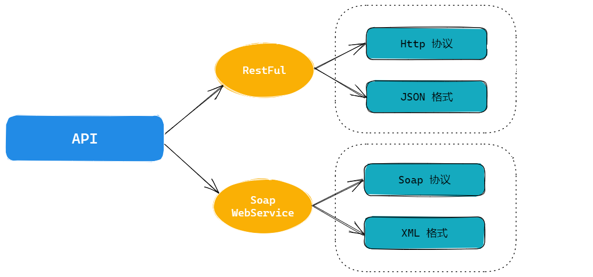

学习 RESTful 设计原则的核心价值：让你设计的 HTTP 接口更符合行业标准，兼具规范性和可读性！

### 4.2 RESTFul 风格核心特点

RESTful 接口设计的 4 个核心原则，缺一不可：

1. **资源唯一标识**：每个 URL（URI）只代表一种 “资源”（比如用户、商品），URL 中只包含**名词**（如`/user`），不包含动词（如`/getUser`）；
2. **HTTP 方法表语义**：客户端通过 GET/POST/PUT/DELETE 这 4 个 HTTP 动词，对服务端的资源做 “增删改查” 操作，而非在 URL 中体现操作：
   - GET：获取资源（查询）；
   - POST：新建资源（新增）；
   - PUT：更新资源（修改）；
   - DELETE：删除资源（删除）；
3. **数据格式标准化**：资源的传递 / 返回格式用 JSON（主流），前后端数据交互格式统一；
4. **无状态交互**：客户端的每次请求都包含服务端处理该请求的所有信息，服务端无需保存 “会话状态”（比如用户登录状态），降低系统复杂度。

#### 4.2.1 **RESTFul风格设计规范**

##### 1. HTTP 请求方式与操作的对应关系

RESTful 的核心是 “让 HTTP 方法回归本身的语义”，不同操作对应固定的请求方式：

| 业务操作 | HTTP 请求方式 | 核心语义           |
| -------- | ------------- | ------------------ |
| 查询资源 | GET           | 读取数据，无副作用 |
| 新增资源 | POST          | 创建新资源         |
| 更新资源 | PUT           | 全量更新已有资源   |
| 删除资源 | DELETE        | 删除指定资源       |

##### 2. URL 路径设计规范

RESTful 的 URL 仅描述 “资源”，不描述 “操作”，通过 “URL + HTTP 方法” 的组合确定具体动作。对比传统风格和 RESTful 风格的差异：

| 业务操作 | 传统风格（URL 带操作）           | RESTful 风格（URL 仅资源）            |
| -------- | -------------------------------- | ------------------------------------- |
| 保存用户 | `/CRUD/saveEmp`（POST/GET）      | URL：`/CRUD/emp` + 请求方式：POST     |
| 删除用户 | `/CRUD/removeEmp?empId=2`（GET） | URL：`/CRUD/emp/2` + 请求方式：DELETE |
| 更新用户 | `/CRUD/updateEmp`（POST）        | URL：`/CRUD/emp` + 请求方式：PUT      |
| 查询用户 | `/CRUD/findEmp?empId=2`（GET）   | URL：`/CRUD/emp/2` + 请求方式：GET    |

**核心总结**：

- URL 只写 “资源名”（名词），比如`/emp`代表 “员工资源”；
- 资源的唯一标识（如 ID）用路径参数（`/emp/2`）体现；
- 具体操作由 HTTP 请求方式决定，而非 URL 中的动词。

#### 4.2.2 RESTFul 风格的核心优势

1. **安全且隐蔽**：避免 URL 中暴露操作名（如`removeEmp`）和参数名（如`empId`），降低被恶意利用的风险；
2. **风格统一**：所有 URL 都用斜杠`/`划分层级，格式一致（如`/shop/product/iPhone`），易读易记；
3. **无状态解耦**：请求无需依赖上下文（如会话状态），服务端无需保存额外信息，系统设计更简单；
4. **符合 HTTP 规范**：严格遵循 HTTP1.1 协议中请求方式的原生语义，接口设计更严谨；
5. **简洁优雅**：增删改查同一资源仅需一个 URL（如`/emp`），而非传统的 4 个不同 URL；
6. **语义丰富**：URL 层级可清晰体现资源关系（如`/shop/product/cellPhone/iPhone`：店铺→商品→手机→苹果手机）。

### 4.3 RESTFul 风格实战

#### 4.3.1 需求分析

- 数据结构：`User`（id：唯一标识，name：用户名，age：用户年龄）；
- 核心功能：
  1. 用户数据分页查询（参数：page = 页数（默认 1）、size = 每页条数（默认 10））；
  2. 新增用户（传递完整用户信息，id 无需传递）；
  3. 根据 ID 查询用户详情；
  4. 根据 ID 更新用户信息（支持全量更新）；
  5. 根据 ID 删除用户；
  6. 多条件模糊查询（参数：keyword = 模糊关键字、page、size）。

#### 4.3.2 RESTFul 风格接口设计

##### 1. 接口清单（核心：URL + 请求方式确定动作）

| 功能         | 接口路径 + 请求方式 | 请求参数说明                                  | 返回值        |
| ------------ | ------------------- | --------------------------------------------- | ------------- |
| 分页查询     | GET /user           | Query 参数：page（默认 1）、size（默认 10）   | JSON 格式响应 |
| 新增用户     | POST /user          | 请求体（JSON）：User 对象（无 id）            | JSON 格式响应 |
| 查询用户详情 | GET /user/{id}      | 路径参数：id（用户唯一标识）                  | JSON 格式响应 |
| 更新用户     | PUT /user           | 请求体（JSON）：User 对象（含 id）            | JSON 格式响应 |
| 删除用户     | DELETE /user/{id}   | 路径参数：id（用户唯一标识）                  | JSON 格式响应 |
| 模糊查询     | GET /user/like      | Query 参数：page、size、keyword（模糊关键字） | JSON 格式响应 |

##### 2. 关键问题：参数传递方式选择

很多新手会误以为 “RESTful 必须用路径传参”，实则不然，参数传递需遵循以下原则：

- **路径参数**：用于指定 “资源的唯一标识”（如`/user/1`中的 1），适合单一资源的定位；
- **Query 参数**：用于指定 “查询条件 / 分页参数”（如`/user?page=1&size=10`），适合资源集合的筛选；
- **请求体（JSON）**：用于传递 “复杂的资源数据”（如新增 / 更新的用户信息），适合 POST/PUT 请求。

#### 4.3.3 后台接口实现

##### 步骤 1：定义 User 实体类

```java
/**
 * 用户实体类（与前端JSON数据结构对应）
 */
@Data // Lombok注解，自动生成get/set/toString等方法
public class User {
    private Integer id;   // 用户唯一标识
    private String name; // 用户名
    private Integer age;  // 用户年龄
}
```

##### 步骤 2：实现 UserController（RESTful 风格）

```java
/**
 * 用户模块RESTful风格控制器
 * 核心：@RestController = @Controller + @ResponseBody（返回JSON而非页面）
 *      @RequestMapping("user")：类级别路径前缀，所有方法路径基于/user拼接
 */
@RequestMapping("user")
@RestController
public class UserController {

    /**
     * 1. 分页查询用户（GET /user）
     * @RequestParam：设置分页参数默认值，避免前端不传参导致空指针
     */
    @GetMapping
    public Map<String, Object> queryPage(
            @RequestParam(name = "page", required = false, defaultValue = "1") int page,
            @RequestParam(name = "size", required = false, defaultValue = "10") int size
    ) {
        System.out.println("分页查询：page = " + page + ", size = " + size);
        // 模拟返回JSON响应（实际开发返回分页数据）
        Map<String, Object> response = new HashMap<>();
        response.put("status", "ok");
        response.put("msg", "分页查询成功");
        response.put("data", "模拟分页数据：第" + page + "页，每页" + size + "条");
        return response;
    }

    /**
     * 2. 新增用户（POST /user）
     * @RequestBody：接收请求体中的JSON格式User数据
     */
    @PostMapping
    public Map<String, Object> saveUser(@RequestBody User user) {
        System.out.println("新增用户：" + user);
        Map<String, Object> response = new HashMap<>();
        response.put("status", "ok");
        response.put("msg", "用户新增成功");
        response.put("data", user); // 返回新增的用户信息（含自动生成的id）
        return response;
    }

    /**
     * 3. 查询用户详情（GET /user/{id}）
     * @PathVariable：接收路径参数id（用户唯一标识）
     */
    @GetMapping("/{id}") // 修正：原代码误用@PostMapping，查询应使用GET
    public Map<String, Object> detailUser(@PathVariable Integer id) {
        System.out.println("查询用户详情：id = " + id);
        Map<String, Object> response = new HashMap<>();
        response.put("status", "ok");
        response.put("msg", "查询用户详情成功");
        // 模拟返回用户详情
        User user = new User();
        user.setId(id);
        user.setName("测试用户" + id);
        user.setAge(20 + id);
        response.put("data", user);
        return response;
    }

    /**
     * 4. 更新用户（PUT /user）
     * @RequestBody：接收JSON格式的更新数据（含id）
     */
    @PutMapping
    public Map<String, Object> updateUser(@RequestBody User user) {
        System.out.println("更新用户：" + user);
        Map<String, Object> response = new HashMap<>();
        response.put("status", "ok");
        response.put("msg", "用户更新成功");
        response.put("data", user); // 返回更新后的用户信息
        return response;
    }

    /**
     * 5. 删除用户（DELETE /user/{id}）
     * 补充：原代码缺失删除接口，此处完善
     */
    @DeleteMapping("/{id}")
    public Map<String, Object> deleteUser(@PathVariable Integer id) {
        System.out.println("删除用户：id = " + id);
        Map<String, Object> response = new HashMap<>();
        response.put("status", "ok");
        response.put("msg", "用户ID=" + id + "删除成功");
        return response;
    }

    /**
     * 6. 多条件模糊查询（GET /user/like）
     * Query参数：page、size、keyword（模糊关键字）
     */
    @GetMapping("/like") // 修正：原代码用search，与接口设计的like统一
    public Map<String, Object> queryByKeyword(
            @RequestParam(name = "page", required = false, defaultValue = "1") int page,
            @RequestParam(name = "size", required = false, defaultValue = "10") int size,
            @RequestParam(name = "keyword", required = false) String keyword
    ) {
        System.out.println("模糊查询：page = " + page + ", size = " + size + ", keyword = " + keyword);
        Map<String, Object> response = new HashMap<>();
        response.put("status", "ok");
        response.put("msg", "模糊查询成功");
        response.put("data", "模拟模糊查询结果：关键字=" + keyword);
        return response;
    }
}
```

### 4.4 核心总结

1. RESTful 核心是 “URL 描述资源，HTTP 方法描述操作”，URL 仅含名词，操作由 GET/POST/PUT/DELETE 决定；
2. 参数传递原则：资源 ID 用路径参数（`@PathVariable`），查询 / 分页条件用 Query 参数（`@RequestParam`），复杂数据用请求体 JSON（`@RequestBody`）；
3. 实战关键：查询用 GET、新增用 POST、更新用 PUT、删除用 DELETE，严格遵循 HTTP 方法语义；
4. 响应格式：统一返回 JSON（推荐用 Map / 自定义响应类），包含状态、提示、数据，便于前端解析。

## 五、SpringMVC高级扩展

### 5.1 案例 5：声明式异常处理

> 核心需求：为项目接入**统一异常处理机制**，拦截所有业务执行过程中抛出的异常，屏蔽底层原始报错信息，向前端返回标准化、友好的提示内容，提升用户体验和系统安全性。

#### 5.1.1 声明式异常处理 & 基本用法

##### 5.1.1.1 声明式异常处理介绍

软件开发中，异常（如空指针、参数格式错误、数据库连接失败等）是不可避免的。如果不对异常做统一处理，不仅会导致前端收到杂乱的原始报错（如 Java 堆栈信息），还会让业务代码中充斥大量 try-catch 块，降低代码可读性和维护性。

异常处理主要分为两种方式，核心对比如下：

| 处理方式       | 实现形式                                                     | 核心缺点                                                     |
| -------------- | ------------------------------------------------------------ | ------------------------------------------------------------ |
| 编程式异常处理 | 业务代码中显式编写 try-catch-finally                         | 1. 异常处理与业务逻辑深度耦合；2. 不同模块异常处理规则不统一；3. 重复代码多，维护成本高 |
| 声明式异常处理 | 通过注解（@RestControllerAdvice、@ExceptionHandler）将异常处理逻辑抽离 | 1. 业务代码无异常处理冗余；2. 全项目异常规则统一；3. 扩展性强，可按需新增异常类型处理 |

从项目架构角度，声明式异常处理的核心价值：

- **解耦**：异常处理逻辑与业务代码完全分离，专注业务开发；
- **统一**：全项目遵循一套异常提示、日志记录规范，避免 “各模块各自为政”；
- **安全**：屏蔽底层报错详情（如数据库表名、代码路径），仅返回友好提示，降低安全风险；
- **易维护**：新增异常类型时，仅需在统一处理器中添加处理方法，无需修改所有业务代码。

##### 5.1.1.2 声明式异常处理基本使用

声明式异常处理的核心是通过`@RestControllerAdvice`（全局异常处理器）+`@ExceptionHandler`（异常匹配方法）实现，步骤如下：

###### 步骤 1：创建全局异常处理器类

该类是异常处理的 “统一入口”，负责拦截整个项目中 Controller 层抛出的所有异常：

```java
/**
 * 全局异常处理器
 * 核心注解：@RestControllerAdvice = @ControllerAdvice（标识全局异常处理类） + @ResponseBody（返回值自动转为JSON）
 * 作用：统一拦截Controller层抛出的所有异常，避免原始报错暴露给前端，返回标准化友好提示
 */
@RestControllerAdvice
public class GlobalExceptionHandler {

}
```

###### 步骤 2：定义异常处理方法（handler 方法）

异常处理方法的规则：

- 参数：可接收 “目标异常对象”（如 NullPointerException e），也可接收 HttpServletRequest 等上下文对象；
- 返回值：与普通 Controller 方法一致（如统一响应类 Result），自动转为 JSON；
- 核心注解：`@ExceptionHandler(异常类型.class)`，指定该方法处理的异常类型。

```java
/**
 * 精准处理空指针异常（NullPointerException）
 * 当项目中抛出该异常时，自动触发此方法执行
 */
@ExceptionHandler(NullPointerException.class)
public Result handlerNullPointerException(NullPointerException e) {
    // 1. 打印异常日志（便于后端排查问题，生产环境建议用日志框架如logback）
    e.printStackTrace();
    // 2. 返回友好提示（屏蔽底层报错，仅告知用户通用问题）
    return Result.fail(500, "数据处理异常，请稍后重试");
}

/**
 * 全局兜底异常处理（处理所有未被精准匹配的异常）
 * 优先级：精准异常处理方法 > 兜底异常处理方法（如NullPointerException优先走上面的方法）
 */
@ExceptionHandler(Exception.class) // Exception是所有异常的父类，匹配所有异常
public Result handlerGlobalException(Exception e) {
    // 1. 记录异常详情（便于排查）
    e.printStackTrace();
    System.out.println("全局异常捕获，异常信息：" + e.getMessage());
    // 2. 返回通用友好提示（避免暴露具体报错）
    return Result.fail(500, "服务器繁忙，请稍后再试");
}
```

#### 5.1.2 案例实现：全局异常处理 & 友好错误提示

##### 5.1.2.1 案例说明

基于现有用户管理接口（用户列表查询），实现以下目标：

1. 拦截接口执行中抛出的所有异常（如人为制造的除零异常、空指针等）；
2. 屏蔽原始报错（如 Java 堆栈信息），返回统一格式的 Result 对象；
3. 前端仅接收 “状态码 + 友好提示”，不暴露任何后端实现细节。

##### 5.1.2.2 未处理全局异常前（问题演示）

###### 步骤 1：人为制造异常（用户列表查询接口）

```java
/**
 * 用户列表查询接口（GET /user/list）
 * 人为制造除零异常（1/0），模拟业务执行过程中的报错
 */
@GetMapping("/list")
public Result getUserList(
    @RequestParam(required = false) String username,
    @RequestParam(required = false) String phone,
    @RequestParam(required = false) Integer status
) {
    System.out.println("查询用户列表，参数：username=" + username + ", phone=" + phone + ", status=" + status);

    // 人为制造异常：除零错误（ArithmeticException）
    int i = 1 / 0;

    // 正常业务逻辑（此处不会执行）
    List<SysUser> sysUserList = SysUserDataUtil.listUsers(username, phone, status);
    return Result.success("查询成功！共找到" + sysUserList.size() + "条数据", sysUserList);
}
```

###### 步骤 2：测试效果（暴露原始报错）

访问`http://localhost:8080/user/list`，前端会收到包含 Java 堆栈信息的原始报错（如下图），不仅不友好，还暴露了后端代码细节：

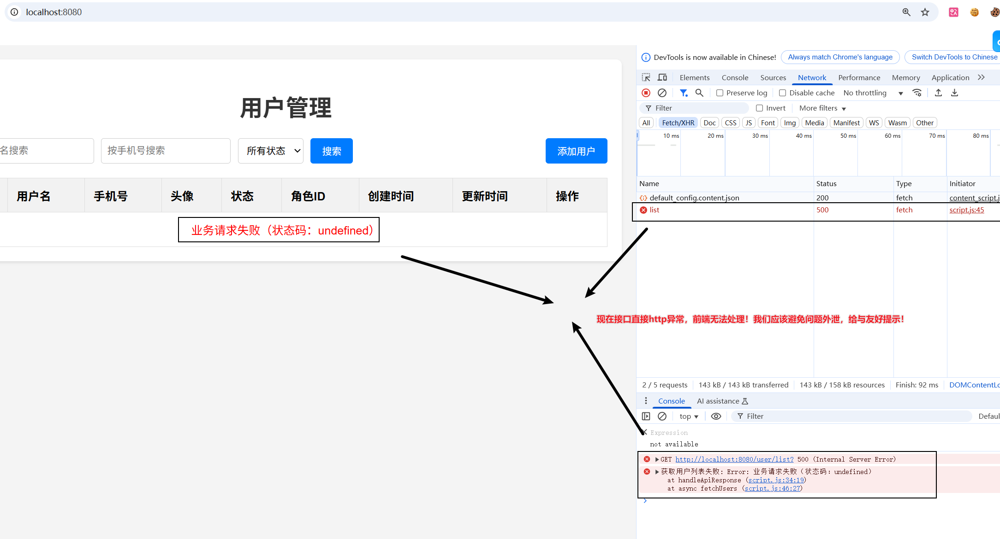

##### 5.1.2.3 添加全局异常处理（解决问题）

###### 步骤 1：实现全局异常处理器

```java
/**
 * 全局异常处理器
 * 核心注解：@RestControllerAdvice 作用于所有@RestController注解的类，全局拦截异常
 */
@RestControllerAdvice
public class GlobalExceptionHandler {
    /**
     * 全局兜底异常处理方法（匹配所有未被精准处理的异常）
     * @param e 捕获到的异常对象（包含异常详情）
     * @return 标准化Result响应，仅返回友好提示
     */
    @ExceptionHandler(Exception.class)
    public Result handlerGlobalException(Exception e) {
        // 1. 打印异常堆栈（后端排查问题用，生产环境建议接入日志框架）
        e.printStackTrace();
        // 2. 记录异常简要信息
        System.out.println("全局异常捕获：" + e.getMessage());
        // 3. 返回友好提示，屏蔽底层报错
        return Result.fail(500, "服务器繁忙，请稍后再试");
    }
}
```

###### 步骤 2：测试处理后效果

再次访问`http://localhost:8080/user/list`，前端仅收到标准化的 JSON 响应，无任何原始报错信息（如下图），体验更友好、更安全：

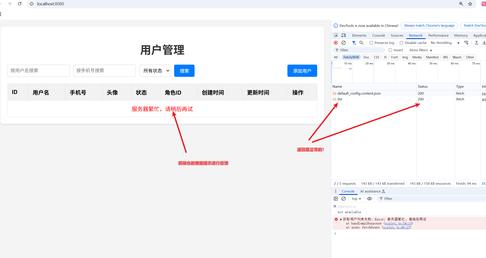

#### 5.1.3 核心总结

1. 声明式异常处理核心：通过`@RestControllerAdvice`（全局拦截）+`@ExceptionHandler`（匹配异常类型），将异常处理逻辑抽离；
2. 优先级规则：精准异常处理方法（如处理 NullPointerException）> 兜底异常处理方法（处理 Exception）；
3. 核心价值：解耦业务与异常代码、统一异常提示规则、屏蔽底层报错、提升系统安全性和可维护性；
4. 实战要点：异常处理方法需返回统一响应类（如 Result），仅向前端返回 “状态码 + 友好提示”，后端保留异常日志用于排查。

### 5.2 案例6：声明式参数校验

> 为保存和更新用户接口添加参数校验，可从源头拦截非法或异常数据，避免因数据传递错误导致接口异常、脏数据入库等问题。

#### 5.2.1 参数校验说明&注解

数据校验是保障接口数据合法性的核心环节，Spring 6 基于 Jakarta Bean Validation 3.0 规范实现参数校验（注解包名从 `javax.validation` 迁移至 `jakarta.validation`），可提前拦截非法数据，避免脏数据入库或业务逻辑异常。以下是针对「保存 / 更新用户接口」的完整校验实现方案，补充了时间、小数点、集合 / 字符串非空等常用校验场景。

##### 5.2.1.1 参数校验涉及注解（常用）

| 注解                         | 所属规范           | 作用描述                                                     | 本场景使用位置                                   |
| ---------------------------- | ------------------ | ------------------------------------------------------------ | ------------------------------------------------ |
| `@NotNull`                   | Jakarta Validation | 验证参数不为 `null`（不校验空字符串）                        | 1. 更新接口路径参数`id`；2. 角色 ID；3. 用户状态 |
| `@NotBlank`                  | Jakarta Validation | 验证字符串非 `null` 且去除空格后长度 > 0（仅字符串）         | 用户名、手机号（保存必填）                       |
| `@NotEmpty`                  | Jakarta Validation | 验证字符串 / 集合 / 数组非 `null` 且长度 > 0（不去空格，支持集合） | 用户爱好集合（非空）、用户标签字符串（非空）     |
| `@Size(min, max)`            | Jakarta Validation | 验证字符串 / 集合长度在指定范围                              | 用户名（2-20 位）                                |
| `@Pattern(regexp)`           | Jakarta Validation | 验证字符串匹配指定正则                                       | 手机号（11 位合法格式）                          |
| `@Min(value)`                | Jakarta Validation | 验证数值不小于指定最小值                                     | 用户状态（最小值 0，仅允许 0/1）                 |
| `@Max(value)`                | Jakarta Validation | 验证数值不大于指定最大值                                     | 用户状态（最大值 1，仅允许 0/1）                 |
| `@Digits(integer, fraction)` | Jakarta Validation | 验证数值的整数位≤integer，小数位≤fraction（支持小数）        | 用户余额（整数位≤3，小数位≤2）                   |
| `@Past`                      | Jakarta Validation | 验证日期 / 时间为过去的时间（当前时间之前）                  | 用户生日（必须是过去时间）                       |
| `@Future`                    | Jakarta Validation | 验证日期 / 时间为未来的时间（当前时间之后）                  | 用户会员有效期（必须是未来时间）                 |
| `@Valid`                     | Jakarta Validation | 触发请求体参数的校验（级联校验需配合嵌套对象使用）           | 保存 / 更新接口的`UserDTO`参数                   |
| `@Validated`                 | Spring             | 启用方法级参数校验（支持路径参数 / 请求参数校验）            | Controller 类上（启用路径参数校验）              |
| `@BindingResult`             | Spring             | 捕获参数校验的错误信息                                       |                                                  |

##### 5.2.1.2 核心依赖（pom.xml）

```xml
<!-- Spring Boot 校验核心依赖 -->
<dependency>
    <groupId>org.springframework.boot</groupId>
    <artifactId>spring-boot-starter-validation</artifactId>
</dependency>
```

#### 5.2.2 案例实现：保存和更新用户信息必要参数校验

##### 5.2.2.1 案例校验规则说明

| 字段名   | 校验场景             | 核心校验注解                                 | 校验规则说明                                                 | 备注                   |
| -------- | -------------------- | -------------------------------------------- | ------------------------------------------------------------ | ---------------------- |
| username | 保存必填，更新可选   | @NotBlank + @Size(min=2, max=20)             | 保存：非空（去除首尾空格后）且长度 2-20 位；更新：仅传值时校验长度，不传不校验 | -                      |
| phone    | 保存必填，更新可选   | @NotBlank + @Pattern(regexp="^1[3-9]\d{9}$") | 保存：非空且为 11 位合法手机号（13-9 开头 + 9 位数字）；更新：仅传值时校验格式，不传不校验 | 适配国内主流手机号段   |
| avatar   | 保存 / 更新均可选    | 无                                           | 无校验，不传则默认空值                                       | -                      |
| status   | 保存默认 1，更新可选 | @Min(0) + @Max(1)                            | 保存 / 更新：仅传值时校验需为 0（禁用）或 1（正常）；保存不传则默认 1 | 默认值仅生效于保存场景 |
| roleId   | 保存必填，更新可选   | @NotNull                                     | 保存：非 null；更新：仅传值时校验非 null，不传不校验         | 关联角色表主键         |

细节：如果只写 `@Size(min=2, max=20)`，会出现这些问题：

1. 前端传 `null` → `@Size` 直接跳过校验，不会提示 “用户名不能为空”，不符合 “保存必填” 要求；
2. 前端传 `""`（空字符串）→ `@Size` 提示 “长度需 2-20 位”，但用户实际是没填，错误提示不如 `@NotBlank` 的 “用户名不能为空” 直观；
3. 前端传 `" "`（全空格）→ `@Size` 同样提示长度问题，而 `@NotBlank` 会直接提示 “不能为空”，更贴合业务语义。

`@NotBlank` 管 “填没填”（必填），`@Size` 管 “填得对不对”（长度），保存场景下既要确保用户填了，也要确保填的长度合规，所以两个都要加。

##### 5.2.2.2 参数校验实现

###### 步骤1：修改参数校验实体类

```java
@Data // 简化get/set/toString等方法，需引入lombok依赖
public class SysUser {
    private Long id;

    private String password;

    // 保存必填，更新可选：用户名（非空+长度2-20）
    @NotBlank(message = "用户名不能为空")
    @Size(min = 2, max = 20, message = "用户名长度需在2-20位之间")
    private String username;

    // 保存必填，更新可选：手机号（非空+11位合法格式）
    @NotBlank(message = "手机号不能为空")
    @Pattern(regexp = "^1[3-9]\\d{9}$", message = "手机号格式错误（需为11位合法手机号）")
    private String phone;

    // 可选字段：头像URL（无校验，不传则默认空）
    private String avatar;

    // 保存默认1，更新可选：用户状态（仅允许0-禁用/1-正常）
    @Min(value = 0, message = "用户状态仅支持0（禁用）或1（正常）")
    @Max(value = 1, message = "用户状态仅支持0（禁用）或1（正常）")
    private Integer status = 1;

    // 保存必填，更新可选：角色ID
    @NotNull(message = "角色ID不能为空")
    private Long roleId;
    private Date createTime;
    private Date updateTime;
}
```

###### 步骤2：参数校验校验失败错误结果处理

```java
@PostMapping
public Result saveUser(
    @Valid @RequestBody SysUser user, // @Valid触发请求体校验（含新增字段）
    BindingResult bindingResult // 捕获校验错误
) {
    // 校验失败：拼接错误信息并返回
    if (bindingResult.hasErrors()) {
        String errorMsg = bindingResult.getFieldErrors().stream()
            .map(error -> error.getField() + "：" + error.getDefaultMessage())
            .collect(Collectors.joining("；"));
        return Result.fail(500, "参数校验失败：" + errorMsg);
    }

    SysUser savedUser = SysUserDataUtil.saveUser(user);
    // 新增成功：200 + 成功提示 + 新增后的用户数据
    return Result.success("新增用户成功！", savedUser);
}
```

###### 步骤3：进行访问效果测试

**测试保存数据接口**

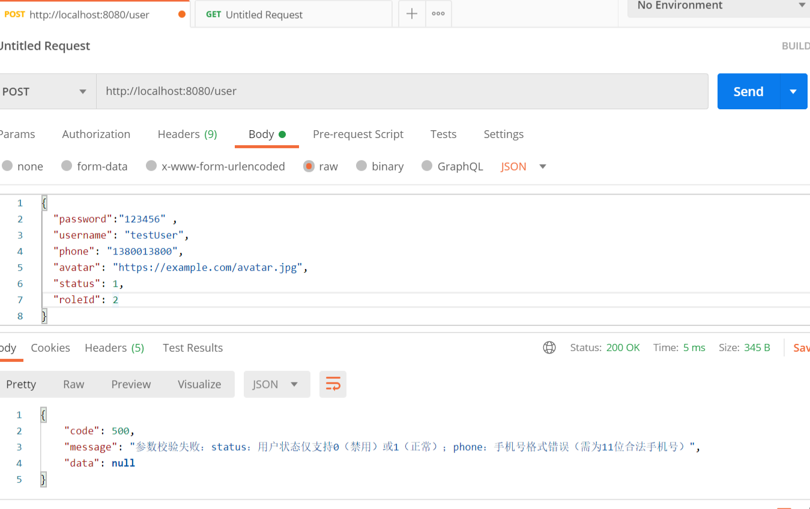

测试数据：

```JSON
{
  "password":"123456" ,
  "username": "testUser",
  "phone": "13800138",
  "avatar": "https://example.com/avatar.jpg",
  "status": 5,
  "roleId": 2
}
```

### 5.3 案例7：拦截器和过滤器使用

#### 5.3.1 用户数据接口登录保护案例说明

登录保护是后端系统针对**核心业务资源（如用户增删改查接口）** 设计的**身份认证与访问控制机制**：

通过校验访问者的登录状态（是否完成合法账号密码认证），仅允许已登录的合法用户访问目标资源，直接拒绝未登录 / 匿名用户的访问请求，是保障系统数据安全、防止未授权操作的基础安全手段。

**类比生活场景**：登录保护就像公司的门禁系统 —— 只有刷了工牌（完成登录认证）的员工，才能进入办公区（访问核心资源）；没工牌的陌生人（未登录用户），会被门禁拦下，无法进入，避免无关人员触碰公司核心资料。


**核心价值：**

1. 防匿名访问：杜绝陌生人直接访问 / 篡改系统核心数据（如用户信息、业务订单）；
2. 身份核验：确保操作资源的是系统注册的合法用户，可追溯操作行为；
3. 权限基础：为后续 “不同用户不同操作权限”（如管理员可删数据、普通用户仅可查看）打下基础。

**保护流程:**

1. 用户需要先访问登录功能，实现登录，将账号信息存储到session中
2. 用户访问退出登录功能，就会删除存储在session中的账号
3. 访问敏感数据资源，需要先校验session数据
   1. 有放行，正常返回
   2. 没有，拦截，证明没有登录，返回约定code=501，前端跳转到登录页面即可
4. 登录保护，就是保护敏感数据不被非认证者直接访问
5. 资源分类：认证资源和匿名资源【不同项目不同分析】


#### 5.3.2 案例实现：登录保护和校验（非拦截器版本）

##### 5.3.2.1 修改SysUserDataUtils添加一个登录方法

```java
// ========== 新增：登录校验方法 ==========
/**
   * 功能6：登录校验（账号+密码匹配）
   * @param username 登录账号（用户名，精确匹配）
   * @param password 登录密码（精确匹配，示例中为模拟加密字符串）
   * @return true=登录成功（账号密码匹配），false=登录失败（账号不存在/密码错误/参数为空）
   */
public static boolean login(String username, String password) {
    // 1. 入参非空校验：账号/密码为空直接返回失败
    if (username == null || username.isEmpty() || password == null || password.isEmpty()) {
        return false;
    }
    // 2. 遍历用户列表，匹配用户名（精确匹配，账号唯一）
    for (SysUser user : USER_MAP.values()) {
        // 3. 用户名匹配 + 密码匹配 → 登录成功
        if (username.equals(user.getUsername()) && password.equals(user.getPassword())) {
            return true;
        }
    }
    // 4. 无匹配用户/密码错误 → 登录失败
    return false;
}
```

##### 5.3.2.2 创建接收登录信息的DTO类

```java
/**
 * projectName: 01_springmvc_part
 * description: 登录参数接收DTO
 */
@Data
public class SysUserLoginDto {
    @NotBlank(message = "用户名不能为空")
    @Size(min = 2, max = 20, message = "用户名长度需在2-20位之间")
    private String username;

    @NotBlank(message = "密码不能为空")
    @Size(min = 6, max = 20, message = "用户名长度需在6-20位之间")
    private String password;
}
```

##### 5.3.2.3 导入第三期前端页面

> 扩展登录页面和用户页面处理501状态码

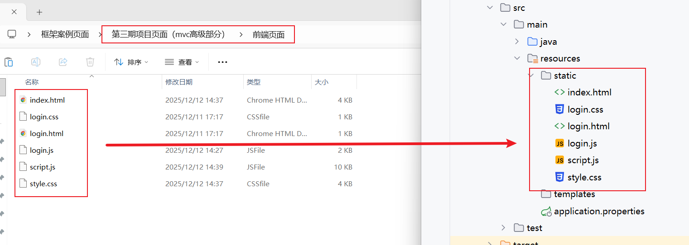

##### 5.3.2.4 设置login.html为程序首页

```java
@Controller
public class WelcomeController {
    @GetMapping("/")
    public String welcome() {
        System.out.println("WelcomeController.welcome 触发了！");
        // 明确指向static目录下的login.html
        return "forward:/login.html";
    }
}
```

##### 5.3.2.5 登录和退出登录Controller实现

```java
@RestController
@RequestMapping("auth")
public class LoginController {

    /*
       登录接口
       /auth/login  post方式 请求体传递参数 username password
       验证成功以后，将账号存储在session!
       返回 {code:200,message:"登录成功",data:null}
     */
    @PostMapping("login")
    public Result login(HttpSession session, @Valid @RequestBody SysUserLoginDto user, BindingResult bindingResult) {
        if (bindingResult.hasErrors()){
            return Result.fail(500,"账号和密码不符合规则,登录失败！");
        }
        //登录校验
        boolean logined = SysUserDataUtil.login(user.getUsername(), user.getPassword());
        if(!logined){
            return Result.fail("账号或者密码错误！");
        }
        //存储到session共享域
        session.setAttribute("username",user.getUsername());
        return Result.success("登录成功！");
    }

    /*
       退出登录接口
       /auth/logout  get方式  没有参数
       然后清空session数据
       返回 {code:200,message:"退出登录成功",data:null}
     */
    @GetMapping("logout")
    public Result logout(HttpSession session) {
        //删除数据
        session.removeAttribute("username");
        //让session失效
        session.invalidate();
        return Result.success("退出登录成功！");
    }
}
```

##### 5.3.2.6 修改Controller添加登录校验

> 思路：在需要保护的方法中，


```java
@RequestMapping("user")
@RestController
public class UserController {

    /**
     * 根据ID删除用户
     * 【硬编码登录校验：后续可通过拦截器统一处理，避免重复代码】
     * @param id 用户ID
     * @return 统一Result格式响应
     */
    @DeleteMapping("{id}")
    public Result removeUser(HttpSession session, @PathVariable Long id) {
        // ===== 登录校验（直接编写，无封装）=====
        String username = (String) session.getAttribute("username");
        if (username == null || username.isEmpty()) {
            return Result.fail(501, "未登录，请先登录！");
        }
        // ======================================

        boolean deleted = SysUserDataUtil.deleteUserById(id);
        if (deleted) {
            return Result.success("删除ID为" + id + "的用户成功！");
        } else {
            return Result.fail("删除失败：ID为" + id + "的用户不存在！");
        }
    }


    /**
     * 根据ID更新用户（支持部分字段更新）
     * 【硬编码登录校验：后续可通过拦截器统一处理，避免重复代码】
     * @param id 用户ID
     * @param sysUser 待更新的用户信息（请求体JSON）
     * @return 统一Result格式响应
     */
    @PutMapping("{id}")
    public Result updateUser(
            HttpSession session, // 注入Session
            @Valid @PathVariable @NotNull(message = "用户ID不能为空") Long id,
            @Valid @RequestBody SysUser sysUser,
            BindingResult bindingResult){
        // ===== 登录校验（直接编写，无封装）=====
        String username = (String) session.getAttribute("username");
        if (username == null || username.isEmpty()) {
            return Result.fail(501, "未登录，请先登录！");
        }
        // ======================================

        if (bindingResult.hasErrors()) {
            String errorMsg = bindingResult.getFieldErrors().stream()
                    .map(error -> error.getField() + "：" + error.getDefaultMessage())
                    .collect(Collectors.joining("；"));
            return Result.fail(500, "参数校验失败：" + errorMsg);
        }
        Boolean updatedUser = SysUserDataUtil.updateUserById(id, sysUser);
        if (updatedUser){
            return Result.success("更新ID为" + id + "的用户成功！");
        }
        return Result.fail("更新失败：ID为" + id + "的用户不存在！");
    }

    /**
     * 新增用户
     * 【硬编码登录校验：后续可通过拦截器统一处理，避免重复代码】
     * @param user 新增用户信息（请求体JSON）
     * @return 统一Result格式响应
     */
    @PostMapping
    public Result saveUser(
            HttpSession session, // 注入Session
            @Valid @RequestBody SysUser user,
            BindingResult bindingResult
    ) {
        // ===== 登录校验（直接编写，无封装）=====
        String username = (String) session.getAttribute("username");
        if (username == null || username.isEmpty()) {
            return Result.fail(501, "未登录，请先登录！");
        }
        // ======================================

        if (bindingResult.hasErrors()) {
            String errorMsg = bindingResult.getFieldErrors().stream()
                    .map(error -> error.getField() + "：" + error.getDefaultMessage())
                    .collect(Collectors.joining("；"));
            return Result.fail(500, "参数校验失败：" + errorMsg);
        }

        SysUser savedUser = SysUserDataUtil.saveUser(user);
        return Result.success("新增用户成功！", savedUser);
    }


    /**
     * 根据ID查询用户详情
     * 【硬编码登录校验：后续可通过拦截器统一处理，避免重复代码】
     * @param id 用户ID
     * @return 统一Result格式响应
     */
    @GetMapping("{id}")
    public Result findById(HttpSession session, @PathVariable Long id) {
        // ===== 登录校验（直接编写，无封装）=====
        String username = (String) session.getAttribute("username");
        if (username == null || username.isEmpty()) {
            return Result.fail(501, "未登录，请先登录！");
        }
        // ======================================

        SysUser sysUser = SysUserDataUtil.getUserById(id);
        if (sysUser == null) {
            return Result.fail("查询失败：ID为" + id + "的用户不存在！");
        }
        return Result.success("查询成功！", sysUser);
    }

    /**
     * 条件查询用户列表
     * 【硬编码登录校验：后续可通过拦截器统一处理，避免重复代码】
     * @param username 用户名（模糊匹配）
     * @param phone 手机号（精确匹配）
     * @param status 用户状态（0-禁用，1-正常）
     * @return 统一Result格式响应
     */
    @GetMapping("/list")
    public Result getUserList(
            HttpSession session, // 注入Session
            @RequestParam(required = false) String username,
            @RequestParam(required = false) String phone,
            @RequestParam(required = false) Integer status) {

        // ===== 登录校验（直接编写，无封装）=====
        String loginUsername = (String) session.getAttribute("username");
        if (loginUsername == null || loginUsername.isEmpty()) {
            return Result.fail(501, "未登录，请先登录！");
        }
        // ======================================

        List<SysUser> sysUserList = SysUserDataUtil.listUsers(username, phone, status);

        return Result.success("查询成功！共找到" + sysUserList.size() + "条数据", sysUserList);
    }

}
```

##### 5.3.2.7 优化说明

核心是**抽离通用逻辑、统一管控**：

1. 把分散在每个接口里的重复登录校验逻辑（查 Session、判空、返回 501）抽离出来，单独管理；
2. 让所有需要登录的接口（如 /user/**）自动触发这套校验逻辑，无需在接口内重复编写；
3. 对无需校验的接口（如登录 / 退出、静态资源）精准配置放行规则，不影响正常访问。


要实现上述优化思路，就需要用到 **JavaEE过滤器（Filter） || SpringMVC拦截器（HandlerInterceptor）**。

#### 5.3.2 拦截器和过滤器介绍&对比

##### 5.3.2.1 拦截器和过滤器解决类似的问题

生活中坐地铁的场景

为了提高乘车效率，在乘客进入站台前统一检票：

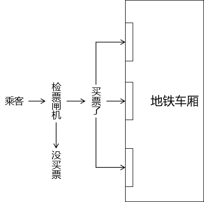

程序中的场景

在程序中，使用拦截器在请求到达具体 handler 方法前，统一执行检测。

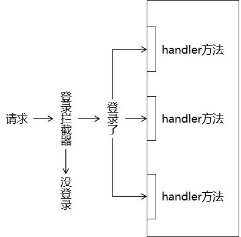

##### 5.3.2.2 拦截器（HandlerInterceptor） VS 过滤器 (Filter)

三要素相同

- 拦截：必须先把请求拦住，才能执行后续操作
- 过滤：拦截器或过滤器存在的意义就是对请求进行统一处理
- 放行：对请求执行了必要操作后，放请求过去，让它访问原本想要访问的资源

不同点：

- 工作平台不同
  - 过滤器工作在 Servlet 容器中（所有Javaweb项目都可以使用）
  - 拦截器工作在 SpringMVC 的基础上（基于springmvc框架才可以使用）
- 拦截的范围
  - 过滤器：能够拦截到的最大范围是整个 Web 应用
  - 拦截器：能够拦截到的最大范围是整个 SpringMVC 负责的请求
- 拦截的配置
  - 过滤器：filter只能配置拦截地址，不能配置放行地址
  - 拦截器：interceptor可以配置拦截地址，也可以配置放行地址

选择：使用 SpringMVC框架，基本都使用拦截器能够实现，就不使用过滤器。

#### 5.3.3 拦截器使用

##### 5.3.3.1 创建拦截器类

```java
/**
 * 拦截器执行的总体顺序（单个拦截器）第一种情况（目标Controller方法加了@ResponseBody）：
 * preHandle() 方法
 * 目标 Controller 方法
 * SpringMVC 底层调用 HttpMessageConverter 方法把目标 Controller 方法返回值转为 JSON，再写入响应流
 * postHandle() 方法
 * afterCompletion() 方法
 *
 * 拦截器执行的总体顺序（单个拦截器）第二种情况（目标Controller方法没加@ResponseBody）：
 * preHandle() 方法
 * 目标 Controller 方法
 * postHandle() 方法
 * 根据目标 Controller 方法返回的视图名称渲染视图
 * afterCompletion() 方法
 */
@Component
public class Demo01Interceptor implements HandlerInterceptor {

    // preHandle() 方法在目标 Controller 方法之前执行
    // 参数一：原生 request 对象
    // 参数二：原生 response 对象
    // 参数三：目标 Controller 对象
    // 返回值：返回 true 放行；返回 false 不放行，原本要执行的后续代码都不执行了，相当于没有给前端返回响应
    // 所以如果 return false，我们一定要编写代码，自己返回响应
    public boolean preHandle(HttpServletRequest request, HttpServletResponse response, Object handler) throws Exception {
        System.out.println("Demo01Interceptor preHandle() 方法执行了");
        return true;
    }

    // preHandle() 放行之后，后续执行顺序如下：
    // 1、目标 Controller 方法
    // 2、【★有 @ResponseBody】HttpMessageConverter 负责把目标 Controller 方法返回值转换为 JSON 写入响应流
    // 3、postHandle() 方法执行
    // 4、【★无 @ResponseBody】针对目标 Controller 方法返回的视图名称，渲染视图
    // 5、afterCompletion() 方法执行
    // ※★标记的这两个步骤，满足哪个条件就执行哪一个
    // 参数一：原生 request 对象
    // 参数二：原生 response 对象
    // 参数三：目标 Controller 对象
    // 参数四：ModelAndView 是 SpringMVC 底层常用的对象，里面封装了模型和视图（视图是后端渲染情况下才会用到）
    public void postHandle(HttpServletRequest request, HttpServletResponse response, Object handler, ModelAndView modelAndView) throws Exception {
        System.out.println("Demo01Interceptor postHandle() 方法执行了");
    }

    // 参数一：原生 request 对象
    // 参数二：原生 response 对象
    // 参数三：目标 Controller 对象
    // 参数四：前面代码抛出的异常，“前面代码”包括preHandle()、postHandle()和目标 Controller 方法
    public void afterCompletion(HttpServletRequest request, HttpServletResponse response, Object handler, Exception ex) throws Exception {
        System.out.println("Demo01Interceptor afterCompletion() 方法执行了");
    }
}
```

##### 5.3.3.2 配置注册拦截器

> 只有配置，才会生效！！

```java
@Configuration
public class DemoConfig implements WebMvcConfigurer {

    @Autowired
    private Demo01Interceptor demo01Interceptor;

    @Override
    public void addInterceptors(InterceptorRegistry registry) {
        // 注册拦截器 拦截项目下所有请求
        registry.addInterceptor(new Demo01Interceptor());
    }
}
```

##### 5.3.3.3 拦截匹配规则

###### [1] 精确匹配

```java
@Override
public void addInterceptors(InterceptorRegistry registry) {
    // 注册拦截器
    registry.addInterceptor(demo01Interceptor);

    // 注册其它拦截器
    registry.addInterceptor(demo02Interceptor)
        .addPathPatterns("/demo/private/target03");
}
```

###### [2] 模糊匹配：匹配单层路径

```java
@Override
public void addInterceptors(InterceptorRegistry registry) {
    // 注册拦截器
    registry.addInterceptor(demo01Interceptor);

    // 注册其它拦截器
    registry.addInterceptor(demo02Interceptor)
        .addPathPatterns("/demo/private/*");
}
```

###### [3] 模糊匹配：匹配多层路径

```java
@Override
public void addInterceptors(InterceptorRegistry registry) {
    // 注册拦截器
    registry.addInterceptor(demo01Interceptor);

    // 注册其它拦截器
    registry.addInterceptor(demo02Interceptor)
        .addPathPatterns("/demo/**");
}
```

###### [4] 配置不拦截路径

在前面拦截的范围内，通过excludePathPatterns()指定一个特殊情况范围

```java
    @Override
    public void addInterceptors(InterceptorRegistry registry) {
        // 注册拦截器
        registry.addInterceptor(demo01Interceptor);

        // 注册其它拦截器
        registry.addInterceptor(demo02Interceptor)
                .addPathPatterns("/demo/**")
                .excludePathPatterns("/demo/private/target03");
    }
```

##### 5.3.3.4 用法：多个拦截器

###### ① 默认顺序

当一个请求匹配多个拦截器时，这些拦截器就都会执行，顺序如下：

- 所有匹配的拦截器的preHandle()方法依次执行，顺序和注册顺序一致
- 目标 Controller 方法
- 所有匹配的拦截器的postHandle()方法依次执行，顺序和注册顺序相反
- 所有匹配的拦截器的afterCompletion()方法依次执行，顺序和注册顺序相反

###### ② 明确指定

在order()方法中指定一个整数：数值越小，优先级越高

- 优先级高的拦截器：外层（先开始，后结束）
- 优先级低的拦截器：内层（后开始，先结束）

```java
@Override
public void addInterceptors(InterceptorRegistry registry) {
    // 注册其它拦截器
    registry.addInterceptor(demo02Interceptor)
        .addPathPatterns("/demo/**")
        .excludePathPatterns("/demo/private/target03")
        .order(2);
    // 注册拦截器
    registry.addInterceptor(demo01Interceptor).order(1);
}
```

###### ③ 某个拦截器不放行

- 外层拦截器preHandle()方法不放行：后续所有操作都不执行了
  - 内层拦截器的所有方法
  - 目标Controller方法
- 内层拦截器preHandle()方法不放行：
  - 对内层拦截器自己的影响：
    - 目标Controller方法不执行了
    - 自己的postHandle()不执行
    - 自己的afterCompletion()不执行
  - 对外层拦截器的影响：
    - 外层的preHandle()方法不受影响（原因：在内层 preHandle() 之前已经执行完）
    - 外层的postHandle()方法没有执行（原因：目标 Controller 方法没有执行）
    - 外层的afterCompletion()方法不受影响

#### 5.3.4 案例7：登录保护和校验实现

##### 5.3.4.1 编写登录保护拦截器

```json
package com.atguigu.java.module04_springmvc_01.interceptors;


import com.atguigu.java.module04_springmvc_01.utils.Result;
import com.fasterxml.jackson.databind.ObjectMapper;
import jakarta.servlet.http.HttpServletRequest;
import jakarta.servlet.http.HttpServletResponse;
import jakarta.servlet.http.HttpSession;
import org.springframework.web.servlet.HandlerInterceptor;
import java.io.PrintWriter;

/**
 * 登录保护拦截器：统一校验所有接口的登录状态，替代Controller中的硬编码校验
 */
@Component
public class LoginProtectInterceptor implements HandlerInterceptor {

    // 注入Spring默认的ObjectMapper（也可直接new，效果一致）
    private static final ObjectMapper objectMapper = new ObjectMapper();

    /**
     * 请求进入Controller之前执行（核心校验时机）
     * @return true=放行（已登录），false=拦截（未登录）
     */
    @Override
    public boolean preHandle(HttpServletRequest request, HttpServletResponse response, Object handler) throws Exception {
        // 1. 获取当前请求的Session（和Controller中逻辑一致）
        HttpSession session = request.getSession();
        String username = (String) session.getAttribute("username");

        // 2. 未登录：返回501错误响应，拦截请求
        if (username == null || username.isEmpty()) {
            // 设置响应格式为JSON，避免前端解析失败
            response.setContentType("application/json;charset=UTF-8");
            response.setCharacterEncoding("UTF-8");

            // 构建统一Result响应体
            Result errorResult = Result.fail(501, "未登录，请先登录！");

            // 核心：用Spring默认的ObjectMapper将Result转为JSON字符串
            PrintWriter writer = response.getWriter();
            writer.write(objectMapper.writeValueAsString(errorResult));
            writer.flush();
            writer.close();

            return false; // 拦截请求，不进入Controller
        }

        // 3. 已登录：放行请求，进入Controller处理业务
        return true;
    }
}
```

##### 5.3.4.2 编写配置类（拦截器生效）

```java
@Configuration
public class WebMvcInterceptorConfig implements WebMvcConfigurer {

    @Override
    public void addInterceptors(InterceptorRegistry registry) {
        registry.addInterceptor(new LoginProtectInterceptor())
                .addPathPatterns("/user/**") // 拦截所有用户相关接口
                .excludePathPatterns(
                        "/auth/login", "/auth/logout", // 放行登录/退出
                        "/**.html", "/**.css", "/**.js" // 放行静态资源
                );
    }
}
```

##### 5.3.4.3 删除原有controller的参数校验

```java
//类上提取当前类中方法的最大公用前缀
@RequestMapping("/user")
@RestController
public class UserController {

    /**
     * 根据ID删除用户
     * 【硬编码登录校验：后续可通过拦截器统一处理，避免重复代码】
     * @param id 用户ID
     * @return 统一Result格式响应
     */
    @DeleteMapping("{id}")
    public Result removeUser(@PathVariable Long id) {
        boolean deleted = SysUserDataUtil.deleteUserById(id);
        if (deleted) {
            return Result.success("删除ID为" + id + "的用户成功！");
        } else {
            return Result.fail("删除失败：ID为" + id + "的用户不存在！");
        }
    }

    /**
     * 根据ID更新用户（支持部分字段更新）
     * 【硬编码登录校验：后续可通过拦截器统一处理，避免重复代码】
     * @param id 用户ID
     * @param sysUser 待更新的用户信息（请求体JSON）
     * @return 统一Result格式响应
     */
    @PutMapping("{id}")
    public Result updateUser(
            @Valid @PathVariable @NotNull(message = "用户ID不能为空") Long id,
            @Valid @RequestBody SysUser sysUser,
            BindingResult bindingResult){

        if (bindingResult.hasErrors()) {
            String errorMsg = bindingResult.getFieldErrors().stream()
                    .map(error -> error.getField() + "：" + error.getDefaultMessage())
                    .collect(Collectors.joining("；"));
            return Result.fail(500, "参数校验失败：" + errorMsg);
        }
        Boolean updatedUser = SysUserDataUtil.updateUserById(id, sysUser);
        if (updatedUser){
            return Result.success("更新ID为" + id + "的用户成功！");
        }
        return Result.fail("更新失败：ID为" + id + "的用户不存在！");
    }

    /**
     * 新增用户
     * 【硬编码登录校验：后续可通过拦截器统一处理，避免重复代码】
     * @param user 新增用户信息（请求体JSON）
     * @return 统一Result格式响应
     */
    @PostMapping
    public Result saveUser(
            @Valid @RequestBody SysUser user,
            BindingResult bindingResult
    ) {

        if (bindingResult.hasErrors()) {
            String errorMsg = bindingResult.getFieldErrors().stream()
                    .map(error -> error.getField() + "：" + error.getDefaultMessage())
                    .collect(Collectors.joining("；"));
            return Result.fail(500, "参数校验失败：" + errorMsg);
        }

        SysUser savedUser = SysUserDataUtil.saveUser(user);
        return Result.success("新增用户成功！", savedUser);
    }


    /**
     * 根据ID查询用户详情
     * 【硬编码登录校验：后续可通过拦截器统一处理，避免重复代码】
     * @param id 用户ID
     * @return 统一Result格式响应
     */
    @GetMapping("{id}")
    public Result findById(@PathVariable Long id) {
        SysUser sysUser = SysUserDataUtil.getUserById(id);
        if (sysUser == null) {
            return Result.fail("查询失败：ID为" + id + "的用户不存在！");
        }
        return Result.success("查询成功！", sysUser);
    }

    /**
     * 条件查询用户列表
     * 【硬编码登录校验：后续可通过拦截器统一处理，避免重复代码】
     * @param username 用户名（模糊匹配）
     * @param phone 手机号（精确匹配）
     * @param status 用户状态（0-禁用，1-正常）
     * @return 统一Result格式响应
     */
    @GetMapping("/list")
    public Result getUserList(
            @RequestParam(required = false) String username,
            @RequestParam(required = false) String phone,
            @RequestParam(required = false) Integer status) {
        List<SysUser> sysUserList = SysUserDataUtil.listUsers(username, phone, status);
        return Result.success("查询成功！共找到" + sysUserList.size() + "条数据", sysUserList);
    }
}
```
