# 04 Web&框架：持久层框架（MyBatis / MyBatis-Plus）& Spring 核心容器进阶

## 1. Spring Boot 测试环境

### 1.1 依赖引入

Spring Boot 提供了`spring-boot-starter-test` Starter，整合了 JUnit5、Mockito、AssertJ 等测试工具，无需单独引入多个依赖！

```xml
<!-- pom.xml中添加测试依赖 -->
<dependencies>
    <!-- Spring Boot 测试核心依赖 -->
    <dependency>
        <groupId>org.springframework.boot</groupId>
        <artifactId>spring-boot-starter-test</artifactId>
        <scope>test</scope> <!-- 仅测试环境生效 -->
    </dependency>
    <!-- 若需测试 Web 接口，需引入 Web 依赖 -->
    <dependency>
        <groupId>org.springframework.boot</groupId>
        <artifactId>spring-boot-starter-web</artifactId>
    </dependency>
</dependencies>
```

依赖说明：

- `scope=test`：依赖仅在测试代码编译和运行时生效，不打入生产包。
- 核心组件：JUnit5（测试框架）、AssertJ（断言工具）、Spring Test（Spring 整合测试）。

### 1.2 基础测试环境搭建

Spring Boot 默认测试代码放在`src/test/java`下，与主代码包结构一致（如主代码包为`com.example.demo`，测试类包也为`com.example.demo`）。

| 注解              | 作用                                                  |
| ----------------- | ----------------------------------------------------- |
| `@SpringBootTest` | 启动 Spring Boot 上下文，加载完整容器，适用于集成测试 |
| `@Test`           | JUnit5 注解，标记测试方法                             |
| `@Autowired`      | 注入测试所需的 Bean（如 Service、Controller）         |

### 1.3 测试非 Web 层组件

**步骤 1**：编写业务 Service

```java
@Service
public class HelloService {
    public String sayHello(String name) {
        return "Hello, " + name + "!";
    }
}
```

**步骤 2**：编写测试类

```java
import static org.assertj.core.api.Assertions.assertThat;
// 启动 Spring Boot 上下文，加载容器
@SpringBootTest
public class HelloServiceTest {

    // 注入待测试的 Service
    @Autowired
    private HelloService helloService;

    // 测试方法
    @Test
    public void testSayHello() {
        // 执行方法
        String result = helloService.sayHello("Spring Boot");
        // 断言结果是否符合预期
        assertThat(result).isEqualTo("Hello, Spring Boot!");
    }
}
```

**步骤 3**：运行测试

- 直接在 IDEA 中右键点击测试方法 / 类，选择 “Run XXXTest”。

### 1.4 测试 Web 接口

**步骤1：**编写 Controller

```java
// src/main/java/com/example/demo/controller/HelloController.java
package com.example.demo.controller;

@RestController
public class HelloController {

    @Autowired
    private HelloService helloService;

    @GetMapping("/hello/{name}")
    public String hello(@PathVariable String name) {
        return helloService.sayHello(name);
    }
}
```

**步骤2：** 接口测试

```java
// src/test/java/com/example/demo/controller/HelloControllerTest.java
package com.example.demo.controller;
// webEnvironment = RANDOM_PORT：启动随机端口，避免端口冲突
@SpringBootTest(webEnvironment = SpringBootTest.WebEnvironment.RANDOM_PORT)
public class HelloControllerTest {

    @Autowired
    private TestRestTemplate restTemplate; // Spring提供的RestTemplate测试工具

    @Test
    public void testHelloApi() {
        // 调用接口
        String result = restTemplate.getForObject("/hello/Test", String.class);
        // 断言结果
        assertThat(result).isEqualTo("Hello, Test!");
    }
}
```

## 2. MyBatis 介绍与快速入门

### 2.1 介绍

官网：https://mybatis.org/mybatis-3/zh_CN/index.html


MyBatis 最初是 Apache 的一个开源项目 iBatis。2010 年 6 月，该项目从 Apache Software Foundation 迁移到 Google Code，随后 iBatis 3.x 正式更名为 MyBatis。它是一个基于 Java 的持久层框架，最大特点是轻量级。相对于 Hibernate 省略了大量不常用的功能，整体轻巧又高效！

特性：

- MyBatis 支持定制化 SQL、存储过程以及高级映射
- MyBatis 避免了几乎所有的 JDBC 代码和手动设置参数以及结果集解析操作
- MyBatis 可以使用简单的 XML 或注解实现配置和原始映射；将接口和 Java 的 POJO（Plain Ordinary Java Object，普通的 Java 对象）映射成数据库中的记录
- MyBatis 是一个半自动的 ORM（Object-Relational Mapping）框架

### 2.2 MyBatis 快速入门

#### 2.2.1 创建工程（核心依赖配置）

Spring Boot 整合 MyBatis 的核心是引入 **MySQL 驱动**（连接数据库）、**MyBatis 启动器**（自动配置 MyBatis 核心组件）和 **测试依赖**，通过 Spring Boot 父工程统一管理依赖版本：

```xml
<!-- Spring Boot 官方父工程：简化依赖版本管理，无需手动指定大部分依赖版本 -->
<parent>
    <groupId>org.springframework.boot</groupId>
    <artifactId>spring-boot-starter-parent</artifactId>
    <version>3.3.12</version>
    <relativePath/> <!-- 从 Maven 仓库查找父工程，不依赖本地路径 -->
</parent>

<dependencies>
    <!-- MySQL驱动：实现 Java 程序与 MySQL 数据库的通信 -->
    <dependency>
        <groupId>com.mysql</groupId>
        <artifactId>mysql-connector-j</artifactId>
        <scope>runtime</scope> <!-- 仅运行时生效，编译阶段无需 -->
    </dependency>
    <!-- MyBatis 整合 Spring Boot 启动器：自动配置 SqlSessionFactory、Mapper 扫描等核心组件 -->
    <dependency>
        <groupId>org.mybatis.spring.boot</groupId>
        <artifactId>mybatis-spring-boot-starter</artifactId>
        <version>3.0.4</version>
    </dependency>
    <!-- Spring Boot 测试依赖：用于编写单元测试验证 MyBatis 功能 -->
    <dependency>
        <groupId>org.springframework.boot</groupId>
        <artifactId>spring-boot-starter-test</artifactId>
        <scope>test</scope> <!-- 仅测试环境生效 -->
    </dependency>
</dependencies>
```

#### 2.2.2 配置数据源（连接 MySQL）

数据源是 Java 程序与数据库的 “通信桥梁”，需在`application.properties`中配置 MySQL 连接信息（请根据自己的数据库地址、账号密码调整）：

```properties
# MySQL连接核心配置
# 1. 数据库登录账号（替换为你的MySQL用户名）
spring.datasource.username=atguigu
# 2. 数据库登录密码（替换为你的MySQL密码）
spring.datasource.password=atguigu
# 3. 数据库连接URL：IP+端口+数据库名，附加编码、时区等参数避免乱码/时区错误
spring.datasource.url=jdbc:mysql://192.168.100.100/db_demo_crud?characterEncoding=utf8mb4&useSSL=false&serverTimezone=Asia/Shanghai
# 4. MySQL驱动类（8.x版本必须用com.mysql.cj.jdbc.Driver，5.x用com.mysql.jdbc.Driver）
spring.datasource.driver-class-name=com.mysql.cj.jdbc.Driver
```

> 关键说明：
>
> - `characterEncoding=utf8mb4`：支持 emoji、特殊中文等字符，比传统 utf8 更全面；
>
> - `serverTimezone=Asia/Shanghai`：解决 MySQL8.x 的时区偏移问题，避免时间查询错误；
>
> - `useSSL=false`：开发环境关闭 SSL 连接，减少不必要的安全校验报错。
>
>   如果连接出现错误不支持utf8mb4可换成utf8; 或去掉characterEncoding=utf8mb4并增加：
>
>   ```
>   spring.datasource.connection-charset=utf8mb4
>   spring.datasource.char-encoding=utf8mb4
>   ```

#### 2.2.3 建模（物理表 + 实体类）

##### ① 物理建模（创建数据库 & 表）

先在 MySQL 中执行以下 SQL，创建数据库、数据表并插入测试数据：

```sql
-- 1. 创建数据库（指定UTF8MB4编码，避免中文乱码）
CREATE DATABASE db_demo_crud CHARACTER SET utf8mb4 COLLATE utf8mb4_unicode_ci;
USE db_demo_crud;

-- 2. 创建t_tiger表（老虎信息表，主键自增）
CREATE TABLE t_tiger(
    tiger_id INT AUTO_INCREMENT PRIMARY KEY, -- 老虎ID（主键）
    tiger_name CHAR(100) NOT NULL,          -- 老虎名称（非空）
    tiger_age INT,                          -- 老虎年龄
    tiger_salary DOUBLE                     -- 模拟薪资（测试用）
);

-- 3. 插入测试数据
INSERT INTO t_tiger (tiger_name, tiger_age, tiger_salary)
VALUES ('王虎', 5, 500.00),
       ('李虎', 3, 800.50),
       ('张虎', 7, 200.75),
       ('赵虎', 4, 200.25),
       ('刘虎', 6, 900.00);
```

##### ② 逻辑建模（创建实体类 Tiger）

实体类（Entity/POJO）是数据库表的 “Java 映射”，字段与表字段一一对应，使用 Lombok 的`@Data`注解简化 get/set/toString 等方法编写：

```java
import lombok.Data;

/**
 * 老虎实体类：对应数据库t_tiger表
 * @Data：Lombok注解，自动生成getter、setter、toString、equals/hashCode等方法
 * 核心规则：数据库下划线命名（tiger_id）→ Java驼峰命名（tigerId），MyBatis默认支持该映射
 */
@Data
public class Tiger {
    private Integer tigerId;    // 对应tiger_id（主键）
    private String tigerName;   // 对应tiger_name
    private Integer tigerAge;   // 对应tiger_age
    private Double tigerSalary; // 对应tiger_salary
}
```

#### 2.2.4 创建 MyBatis 核心组件

MyBatis 的核心是`Mapper接口`（定义数据操作方法）+`Mapper配置文件`（编写 SQL 语句），二者通过`namespace`关联，实现 “接口调用 = 执行 SQL” 的解耦设计。

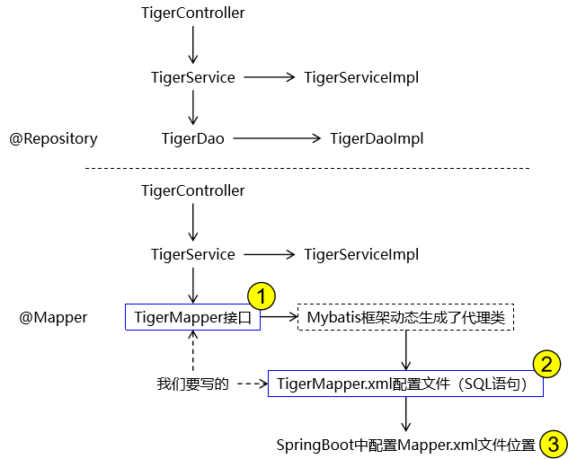

##### ① Mapper 接口（定义数据操作方法）

Mapper 接口对应三层架构的**DAO 层**，通过`@Mapper`注解让 Spring Boot 识别并创建代理对象，方法名需与 XML 中的 SQL 标签`id`一一对应：

```java
import com.atguigu.mybatis.entity.Tiger;
import org.apache.ibatis.annotations.Mapper;

import java.util.List;

/**
 * Tiger数据访问接口（DAO层）
 * @Mapper：标识为 MyBatis 的 Mapper 接口，Spring Boot 自动创建代理实现类
 */
@Mapper
public interface TigerMapper {
    /**
     * 新增老虎信息
     * @param tiger 新增的老虎对象（包含name/age/salary，无需传id，数据库自增）
     * @return 受影响的行数（新增成功返回1，失败返回0）
     */
    int insertTiger(Tiger tiger);
    /**
     * 根据ID删除老虎信息
     * @param tigerId 老虎ID
     * @return 受影响的行数（删除成功返回1）
     */
    int deleteTigerById(Integer tigerId);
    /**
     * 根据ID更新老虎信息
     * @param tiger 要更新的老虎对象（必须包含tigerId，以及要修改的属性值）
     * @return 受影响的行数（更新成功返回1）
     */
    int updateTigerById(Tiger tiger);
    /**
     * 根据ID查询老虎详情
     * @param tigerId 老虎ID
     * @return 对应的老虎对象（无数据返回null）
     */
    Tiger selectTigerById(Integer tigerId);
    /**
     * 查询所有老虎信息
     * @return 老虎列表（无数据返回空列表，不会返回null）
     */
    List<Tiger> selectTigerList();
}
```

##### ②  Mapper 配置文件（编写 SQL 语句）

Mapper 配置文件存放于`resources/mapper`目录下，通过`namespace`绑定 Mapper 接口全类名，每个 SQL 标签对应接口中的一个方法：

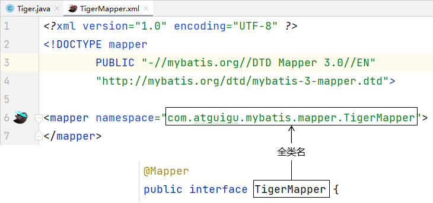

```xml
<?xml version="1.0" encoding="UTF-8" ?>
<!DOCTYPE mapper
        PUBLIC "-//mybatis.org//DTD Mapper 3.0//EN"
        "http://mybatis.org/dtd/mybatis-3-mapper.dtd">
<!-- namespace：绑定对应的Mapper接口全类名，实现接口与XML的关联 -->
<mapper namespace="com.atguigu.mybatis.mapper.TigerMapper">

    <!-- 1. 新增老虎：id=接口方法名，parameterType=参数类型（实体类全类名） -->
    <insert id="insertTiger" parameterType="com.atguigu.mybatis.entity.Tiger">
        INSERT INTO t_tiger (tiger_name, tiger_age, tiger_salary)
        VALUES (#{tigerName}, #{tigerAge}, #{tigerSalary})
    </insert>

    <!-- 2. 根据ID删除老虎：#{tigerId}为参数占位符，防止SQL注入 -->
    <delete id="deleteTigerById" parameterType="java.lang.Integer">
        DELETE FROM t_tiger WHERE tiger_id = #{tigerId}
    </delete>

    <!-- 3. 根据ID更新老虎：动态取值实体类的属性 -->
    <update id="updateTigerById" parameterType="com.atguigu.mybatis.entity.Tiger">
        UPDATE t_tiger
        SET tiger_name = #{tigerName},
            tiger_age = #{tigerAge},
            tiger_salary = #{tigerSalary}
        WHERE tiger_id = #{tigerId}
    </update>

    <!-- 4. 根据ID查询老虎：resultType=返回值类型（实体类全类名） -->
    <select id="selectTigerById" parameterType="java.lang.Integer" resultType="com.atguigu.mybatis.entity.Tiger">
        SELECT tiger_id tigerId,
               tiger_name tigerName,
               tiger_age tigerAge,
               tiger_salary tigerSalary
        FROM t_tiger
        WHERE tiger_id = #{tigerId}
    </select>

    <!-- 5. 查询所有老虎：resultType指定每行数据映射的实体类 -->
    <select id="selectTigerList" resultType="com.atguigu.mybatis.entity.Tiger">
        SELECT tiger_id tigerId,
               tiger_name tigerName,
               tiger_age tigerAge,
               tiger_salary tigerSalary
        FROM t_tiger
    </select>
</mapper>
```

> 关键说明：
>
> - `#{属性名}`：参数占位符（预编译），MyBatis 自动从参数对象中取值，**防止 SQL 注入**；
> - `resultType`：SQL 查询结果映射的实体类（需写全类名）；
> - SQL 中`AS`别名（如`tiger_id tigerId`）：让数据库下划线字段映射到实体类的驼峰属性。

#### 2.2.5 配置 Mapper 配置文件位置

Spring Boot 默认无法自动识别`resources/mapper`下的 XML 文件，需在`application.properties`中显式指定路径：

```properties
# MyBatis配置：指定Mapper XML文件的存储路径
mybatis.mapper-locations=classpath:/mapper/*Mapper.xml
# 可选优化：开启驼峰命名自动映射（tiger_id → tigerId），可省略SQL中的AS别名
mybatis.configuration.map-underscore-to-camel-case=true
```

> `classpath:/mapper/*Mapper.xml`：匹配`resources/mapper`目录下所有以`Mapper.xml`结尾的文件，批量加载所有 Mapper 配置。

#### 2.2.6 编写测试用例（验证功能）

通过 Spring Boot 单元测试注入`TigerMapper`，调用方法验证 CRUD 功能（`@SpringBootTest`会启动 Spring 容器，加载所有 Bean）：

```java
/**
 * MyBatis单元测试类
 * @SpringBootTest：启动 Spring 容器，自动扫描并注入 TigerMapper 代理对象
 */
@SpringBootTest
public class MyBatisTest {

    // 注入 TigerMapper（Spring Boot 自动创建的 MyBatis 代理对象）
    @Resource
    private TigerMapper tigerMapper;

    /**
     * 测试查询所有老虎信息
     */
    @Test
    public void testSelectTigerList() {
        // 调用Mapper方法执行SQL，查询所有老虎
        List<Tiger> tigerList = tigerMapper.selectTigerList();
        // 遍历输出结果
        for (Tiger tiger : tigerList) {
            System.out.println("老虎信息：" + tiger);
        }
    }
    /**
     * 可选：测试新增老虎（验证insert方法）
     */
    @Test
    public void testInsertTiger() {
        Tiger tiger = new Tiger();
        tiger.setTigerName("陈虎");
        tiger.setTigerAge(8);
        tiger.setTigerSalary(1000.0);
        // 调用新增方法，返回受影响行数
        int rows = tigerMapper.insertTiger(tiger);
        System.out.println("新增老虎受影响行数：" + rows); // 新增成功返回1
    }
}
```

**测试结果示例**：

```plaintext
老虎信息：Tiger(tigerId=1, tigerName=王虎, tigerAge=5, tigerSalary=500.0)
老虎信息：Tiger(tigerId=2, tigerName=李虎, tigerAge=3, tigerSalary=800.5)
老虎信息：Tiger(tigerId=3, tigerName=张虎, tigerAge=7, tigerSalary=200.75)
老虎信息：Tiger(tigerId=4, tigerName=赵虎, tigerAge=4, tigerSalary=200.25)
老虎信息：Tiger(tigerId=5, tigerName=刘虎, tigerAge=6, tigerSalary=900.0)
```

**核心总结**

1. Spring Boot 整合 MyBatis 核心流程：引入依赖 → 配置数据源 → 定义实体类 → 编写 Mapper 接口 + XML → 配置 XML 路径 → 单元测试；
2. MyBatis 核心匹配规则：Mapper 接口方法名 = XML SQL 标签`id`，接口全类名 = XML`namespace`；
3. 关键注解 / 配置：
   - `@Mapper`：让 Spring 识别 Mapper 接口并创建代理对象；
   - `mybatis.mapper-locations`：指定 XML 文件位置，缺一不可；
   - `map-underscore-to-camel-case`：开启驼峰自动映射，简化 SQL 编写；
4. 防坑要点：
   - MySQL8.x 必须用`com.mysql.cj.jdbc.Driver`，并配置时区`serverTimezone=Asia/Shanghai`；
   - SQL 表名需与实际一致（如`t_tiger`，而非`tiger`）；
   - 优先使用`#{}`占位符，避免`${}`导致 SQL 注入风险。

#### 2.2.7 打印执行日志

##### 2.2.7.1 需求

将来在项目中，SQL 语句往往是很多片段根据条件拼接到一起，所以 MyBatis 最终执行的 SQL 语句必须打印出来给我们看到！为此需要让 MyBatis 打印日志。

##### 2.2.7.2 配置

指定 Mapper 接口所在的包为打印日志的范围：

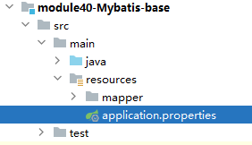

```properties
logging.level.com.atguigu.mybatis.mapper=debug
```


#### 2.2.8 HelloWorld解析

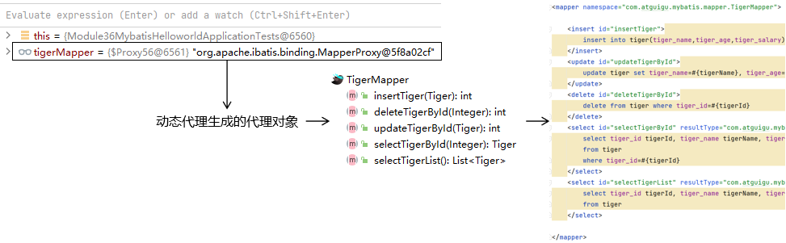

## 3. MyBatis 核心传入参数与返回数据

### 3.1 向 SQL 传参

**#{}**

MyBatis 会将 SQL 语句中的 #{} 转换为问号占位符


**${}**

${} 形式传参，底层 MyBatis 做的是字符串拼接操作

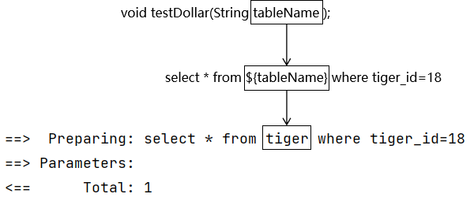


**对比：**

通常不会采用${}的方式传值

一个特定的适用场景是：通过 Java 程序动态生成数据库表，表名部分需要 Java 程序通过参数传入；而 JDBC 对于表名部分是不能使用问号占位符的，此时只能使用 ${}

结论：实际开发中，能用 #{} 实现的，肯定不用 ${}

### 3.2 MyBatis 数据输入

#### 3.2.1 MyBatis 总体机制概括


#### 3.2.2 概念说明

这里数据输入具体是指上层方法（例如 Service 方法）调用 Mapper 接口时，数据传入的形式。

- 简单类型：只包含一个值的数据类型
  - 基本数据类型：int、byte、short、double、……
  - 基本数据类型的包装类型：Integer、Character、Double、……
  - 字符串类型：String
- 复杂类型：包含多个值的数据类型
  - 实体类类型：Employee、Department、……
  - 集合类型：List、Set、Map、……
  - 数组类型：int[]、String[]、……
  - 复合类型：List&lt;Employee&gt;、实体类中包含集合……

#### 3.2.3 单个简单类型参数

```sql
-- 创建t_emp表
CREATE TABLE t_emp(
    emp_id INT AUTO_INCREMENT PRIMARY KEY,
    emp_name CHAR(100) NOT NULL,
    emp_salary DOUBLE
);

-- 插入测试数据
INSERT INTO t_emp (emp_name,  emp_salary)
VALUES ('张三',500.00),
       ('李四', 800.50),
       ('王五', 200.75);
```

```java
@Data
public class Employee {
    private Long empId;
    private String empName;
    private Double empSalary;
}
```

```java
@Mapper
public interface EmployeeMapper {

}
```

```xml
<?xml version="1.0" encoding="UTF-8" ?>
<!DOCTYPE mapper
        PUBLIC "-//mybatis.org//DTD Mapper 3.0//EN"
        "http://mybatis.org/dtd/mybatis-3-mapper.dtd">
<mapper namespace="com.atguigu.mybatisproject.mapper.TigerMapper">
</mapper>
```

① Mapper接口中抽象方法的声明

```java
Employee selectEmployee(Integer empId);
```

② SQL语句

```xml
<select id="selectEmployee" resultType="com.atguigu.mybatis.entity.Employee">
    select emp_id empId,emp_name empName,emp_salary empSalary from t_emp where emp_id=#{empId}
</select>
```

#### 3.2.4 实体类类型参数

① Mapper接口中抽象方法的声明

```java
int insertEmployee(Employee employee);
```

② SQL语句

```xml
<insert id="insertEmployee">
    insert into t_emp(emp_name,emp_salary) values(#{empName},#{empSalary})
</insert>
```

③ 对应关系


④ 结论

MyBatis 会根据 #{} 中传入的数据，加工成 getXxx() 方法，通过反射在实体类对象中调用这个方法，从而获取到对应的数据，填充到 #{} 这个位置。

#### 3.2.5 零散的简单类型数据

> MyBatis 从 3.4.1 版本开始支持通过反射获取方法参数名，从而允许在使用 Java 8 及以上版本编译时，省略 @Param 注解
>
> 这一特性依赖于 Java 8 的 `-parameters` 编译选项，该选项会将方法参数名保存在字节码中，使得 MyBatis 能够直接获取参数名
>
> 当前版本：3.5.17
> 只要保证接口中参数名和#{}中指定的名称一致，可以省略@Param注解
>
> 注意：这里我们说的版本，是 MyBatis 核心包的版本，而不是 mybatis-spring-boot-starter 的版本

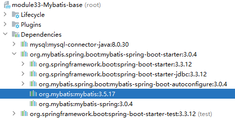

① Mapper接口中抽象方法的声明

```java
int updateEmployee(@Param("empId") Integer empId,@Param("empSalary") Double empSalary);
```

② SQL语句

```xml
<update id="updateEmployee">
    update t_emp set emp_salary=#{empSalary} where emp_id=#{empId}
</update>
```

③ 对应关系


#### 3.2.6 Map类型参数

① Mapper接口中抽象方法的声明

```java
int updateEmployeeByMap(Map<String, Object> paramMap);
```

② SQL语句

```xml
<update id="updateEmployeeByMap">
   update t_emp set emp_salary=#{empSalaryKey} where emp_id=#{empIdKey}
</update>
```

③ JUnit 测试

```java
@Test
public void testUpdateEmpNameByMap() {

    Map<String, Object> paramMap = new HashMap<>();

    paramMap.put("empSalaryKey", 999.99);
    paramMap.put("empIdKey", 5);

    int result = mapper.updateEmployeeByMap(paramMap);

    System.out.println("result = " + result);
}
```

④ 对应关系

#{}中写Map中的key

⑤ 使用场景

有很多零散的参数需要传递，但是没有对应的实体类类型可以使用。使用 @Param 注解一个一个传入又太麻烦了，所以都封装到 Map 中。

### 3.3 MyBatis 数据输出

数据输出总体上有两种情况：

- 情况一：**增删改操作返回的受影响行数：直接使用 int 或 long 类型接收即可**
- 情况二：查询操作的查询结果，多样化，需要显示进行指定输出类型

#### 3.3.1 返回单个简单类型数据

① Mapper接口中的抽象方法

```java
int selectEmpCount();
```

② SQL语句

```xml
<select id="selectEmpCount" resultType="int">
    select count(*) from t_emp
</select>
```

③ JUnit 测试

```java
@Test
public void testEmpCount() {
    int count = employeeMapper.selectEmpCount();
    System.out.println("count = " + count);
}
```

MyBatis 内部给常用的数据类型设定了很多别名。
以 int 类型为例，可以写的名称有：int、integer、Integer、java.lang.Integer、Int、INT、INTEGER 等等。

#### 3.3.2 返回实体类对象

① Mapper接口的抽象方法

```java
Employee selectEmployee(Integer empId);
```

② SQL语句

```xml
<!-- 编写具体的SQL语句，使用id属性唯一的标记一条SQL语句 -->
<!-- resultType属性：指定封装查询结果的Java实体类的全类名 -->
<select id="selectEmployee" resultType="com.atguigu.mybatis.entity.Employee">
    <!-- MyBatis 负责把 SQL 语句中的 #{} 部分替换成“?”占位符 -->
    <!-- 给每一个字段设置一个别名，让别名和Java实体类中属性名一致 -->
    select emp_id empId,emp_name empName,emp_salary empSalary from t_emp where emp_id=#{empId}
</select>
```

通过给数据库表字段加别名，让查询结果的每一列都和Java实体类中属性对应起来。

#### 3.3.3 返回Map类型

适用于SQL查询返回的各个字段综合起来并不和任何一个现有的实体类对应，没法封装到实体类对象中。<span style="color:red;font-weight:bold;">能够封装成实体类类型的，就不使用Map类型</span>。

此时需要注意，一个 Map 只能封装查询结果的一行，如果 Mapper 方法返回的是一个 Map，对于返回多条查询结果的场景，MyBatis 会抛出异常：

> org.apache.ibatis.exceptions.TooManyResultsException: Expected one result (or null) to be returned by selectOne(), but found: 2

如果需要把多行查询结果都用Map形式封装，那么就：List<Map<String,Object>>

① Mapper接口的抽象方法

```java
Map<String,Object> selectEmpNameAndMaxSalary();
```

② SQL语句

```xml
<!-- Map<String,Object> selectEmpNameAndMaxSalary(); -->
<!-- 返回工资最高的员工的姓名和他的工资 -->
<select id="selectEmpNameAndMaxSalary" resultType="map">
        SELECT
            emp_name 员工姓名,
            emp_salary 员工工资
        FROM t_emp WHERE emp_salary=(SELECT MAX(emp_salary) FROM t_emp)
</select>
```

③ JUnit 测试

```java
@Test
public void testQueryEmpNameAndSalary() {
    Map<String, Object> resultMap = employeeMapper.selectEmpNameAndMaxSalary();

    Set<Map.Entry<String, Object>> entrySet = resultMap.entrySet();

    for (Map.Entry<String, Object> entry : entrySet) {
        String key = entry.getKey();
        Object value = entry.getValue();
        System.out.println(key + "=" + value);
    }
}
```

#### 3.3.4 返回List类型

查询结果返回多个实体类对象，希望把多个实体类对象放在List集合中返回。此时不需要任何特殊处理，在resultType属性中还是设置实体类类型即可。

① Mapper接口中抽象方法

```java
List<Employee> selectAll();
```

② SQL语句

```xml
<select id="selectAll" resultType="com.atguigu.mybatis.entity.Employee">
    select emp_id empId,emp_name empName,emp_salary empSalary
    from t_emp
</select>
```

③ JUnit 测试

```java
@Test
public void testSelectAll() {
    List<Employee> employeeList = employeeMapper.selectAll();
    for (Employee employee : employeeList) {
        System.out.println("employee = " + employee);
    }
}
```

#### 3.3.5 返回自增主键

① Mapper接口中的抽象方法

```java
int insertEmployee(Employee employee);
```

② 在Mapper配置文件中设置方式

```xml
<!-- useGeneratedKeys属性字面意思就是“使用生成的主键” -->
<!-- keyProperty属性可以指定主键在实体类对象中对应的属性名，MyBatis 会将拿到的主键值存入这个属性 -->
<insert id="insertEmployee" useGeneratedKeys="true" keyProperty="empId">
    insert into t_emp(emp_name,emp_salary)
    values(#{empName},#{empSalary})
</insert>
```

JUnit 测试

```java
@Test
public void testSaveEmp() {
    Employee employee = new Employee();
    employee.setEmpName("john");
    employee.setEmpSalary(666.66);
    employeeMapper.insertEmployee(employee);
    System.out.println("employee.getEmpId() = " + employee.getEmpId());
}
```

③ 注意

MyBatis 是将自增主键的值设置到实体类对象中，而<span style="color:blue;font-weight:bold;">不是以 Mapper 接口方法返回值</span>的形式返回。

④ 不支持自增主键的数据库（了解）

而对于不支持自增型主键的数据库（例如 Oracle），则可以使用 selectKey 子元素：selectKey  元素将会首先运行，id  会被设置，然后插入语句会被调用

```xml
<insert id="insertEmployee"
        parameterType="com.atguigu.mybatis.beans.Employee"
            databaseId="oracle">
        <selectKey order="BEFORE" keyProperty="id" resultType="integer">
            select employee_seq.nextval from dual
        </selectKey>
        insert into orcl_employee(id,last_name,email,gender) values(#{id},#{lastName},#{email},#{gender})
</insert>
```

或者是

```xml
<insert id="insertEmployee"
        parameterType="com.atguigu.mybatis.beans.Employee"
            databaseId="oracle">
        <selectKey order="AFTER" keyProperty="id" resultType="integer">
            select employee_seq.currval from dual
        </selectKey>
    insert into orcl_employee(id,last_name,email,gender) values(employee_seq.nextval,#{lastName},#{email},#{gender})
</insert>
```

#### 3.3.6 数据库表字段和实体类属性对应关系

① 别名

将字段的别名设置成和实体类属性一致。

```xml
<!-- 编写具体的SQL语句，使用id属性唯一的标记一条SQL语句 -->
<!-- resultType属性：指定封装查询结果的Java实体类的全类名 -->
<select id="selectEmployee" resultType="com.atguigu.mybatis.entity.Employee">
    <!-- MyBatis 负责把 SQL 语句中的 #{} 部分替换成“?”占位符 -->
    <!-- 给每一个字段设置一个别名，让别名和Java实体类中属性名一致 -->
    select emp_id empId,emp_name empName,emp_salary empSalary from t_emp where emp_id=#{empId}
</select>
```

> 关于实体类属性的约定：
>
> getXxx()方法、setXxx()方法把方法名中的get或set去掉，首字母小写。

② 全局配置自动识别驼峰式命名规则

在 Spring Boot 配置文件加入如下配置：

```properties
mybatis.configuration.map-underscore-to-camel-case=true
```

SQL语句中可以不使用别名——但前提是二者是严格对应的！

```xml
<!-- Employee selectEmployee(Integer empId); -->
<select id="selectEmployee" resultType="com.atguigu.mybatis.entity.Employee">
    select emp_id,emp_name,emp_salary from t_emp where emp_id=#{empId}
</select>
```

③ 使用resultMap

使用resultMap标签定义对应关系，再在后面的SQL语句中引用这个对应关系

```xml
<!-- 专门声明一个resultMap设定column到property之间的对应关系 -->
<resultMap id="selectEmployeeByRMResultMap" type="com.atguigu.mybatis.entity.Employee">

    <!-- 使用id标签设置主键列和主键属性之间的对应关系 -->
    <!-- column属性用于指定字段名；property属性用于指定Java实体类属性名 -->
    <id column="emp_id" property="empId"/>

    <!-- 使用result标签设置普通字段和Java实体类属性之间的关系 -->
    <result column="emp_name" property="empName"/>
    <result column="emp_salary" property="empSalary"/>
</resultMap>

<!-- Employee selectEmployeeByRM(Integer empId); -->
<select id="selectEmployeeByRM" resultMap="selectEmployeeByRMResultMap">
    select emp_id,emp_name,emp_salary from t_emp where emp_id=#{empId}
</select>
```

## 4. 扩展 MyBatis 动态 SQL

MyBatis 框架的动态 SQL 技术是一种根据特定条件动态拼装 SQL 语句的功能，它存在的意义是为了解决拼接 SQL 语句字符串时的痛点问题。

> One of the most powerful features of MyBatis has always been its Dynamic SQL capabilities. If you have any experience with JDBC or any similar framework, you understand how painful it is to conditionally concatenate strings of SQL together, making sure not to forget spaces or to omit a comma at the end of a list of columns. Dynamic SQL can be downright painful to deal with.

MyBatis 的一个强大的特性之一通常是它的动态 SQL 能力。如果你有使用 JDBC 或其他相似框架的经验，你就明白条件地串联 SQL 字符串在一起是多么的痛苦，确保不能忘了空格或在列表的最后省略逗号。动态 SQL 可以彻底处理这种痛苦

### 4.1 if 和 where 标签

```xml
<!-- List<Tiger> selectTigerByCondition(Tiger tiger); -->
<select id="selectTigerByCondition" resultType="com.atguigu.mybatis.entity.Tiger">
    select tiger_id,tiger_name,tiger_salary from t_tiger

    <!-- where标签会自动去掉“标签体内前面多余的and/or” -->
    <where>
        <!-- 使用if标签，让我们可以有选择的加入SQL语句的片段。这个SQL语句片段是否要加入整个SQL语句，就看if标签判断的结果是否为true -->
        <!-- 在if标签的test属性中，可以访问实体类的属性，不可以访问数据库表的字段 -->
        <if test="tigerName != null">
            <!-- 在if标签内部，需要访问接口的参数时还是正常写#{} -->
            or tiger_name=#{tigerName}
        </if>
        <if test="tigerSalary &gt; 500">
            or tiger_salary>#{tigerSalary}
        </if>
        <!--
         第一种情况：所有条件都满足 WHERE tiger_name=? or tiger_salary>?
         第二种情况：部分条件满足 WHERE tiger_salary>?
         第三种情况：所有条件都不满足 没有where子句
         -->
    </where>
</select>
```

> 使用动态 SQL 标签，一定要理解清楚 MyBatis 和 SQL 语句执行顺序：
> 	1、MyBatis 根据动态 SQL 标签拼接字符串
> 	2、MyBatis 最终会拼接得到一个完整的 SQL 语句字符串
> 	3、MyBatis 会把 SQL 语句发送给 MySQL 执行
> 	4、MySQL 执行 SQL 语句时会使用查询条件到数据库表筛选数据

### 4.2 set 标签

实际开发时，对一个实体类对象进行更新。往往不是更新所有字段，而是更新一部分字段。对 update 语句的 set 子句进行定制，此时就可以使用动态 SQL 的 set 标签！

```XML
<!-- void updateTigerDynamic(Tiger tiger) -->
<update id="updateTigerDynamic">
    update t_tiger
    <!-- set tiger_name=#{tigerName},tiger_salary=#{tigerSalary} -->
    <!-- 使用set标签动态管理set子句，并且动态去掉两端多余的逗号 -->
    <set>
        <if test="tigerName != null">
            tiger_name=#{tigerName},
        </if>
        <if test="tigerSalary &lt; 800">
            tiger_salary=#{tigerSalary},
        </if>
    </set>
    where tiger_id=#{tigerId}
    <!--
         第一种情况：所有条件都满足 SET tiger_name=?, tiger_salary=?
         第二种情况：部分条件满足 SET tiger_salary=?
         第三种情况：所有条件都不满足 update t_tiger where tiger_id=?
            没有set子句的update语句会导致SQL语法错误
     -->
</update>
```

### 4.3 trim 标签

使用 trim 标签控制条件部分两端是否包含某些字符

- prefix 属性：指定要动态添加的前缀
- suffix 属性：指定要动态添加的后缀
- prefixOverrides 属性：指定要动态去掉的前缀，使用 “|” 分隔有可能的多个值
- suffixOverrides 属性：指定要动态去掉的后缀，使用 “|” 分隔有可能的多个值

```XML
<!-- List<Tiger> selectTigerByConditionByTrim(Tiger tiger) -->
<select id="selectTigerByConditionByTrim" resultType="com.atguigu.mybatis.entity.Tiger">
    select tiger_id,tiger_name,tiger_age,tiger_salary
    from t_tiger

    <!-- prefix属性指定要动态添加的前缀 -->
    <!-- suffix属性指定要动态添加的后缀 -->
    <!-- prefixOverrides属性指定要动态去掉的前缀，使用“|”分隔有可能的多个值 -->
    <!-- suffixOverrides属性指定要动态去掉的后缀，使用“|”分隔有可能的多个值 -->
    <!-- 当前例子用where标签实现更简洁，但是trim标签更灵活，可以用在任何有需要的地方 -->
    <trim prefix="where" suffixOverrides="and|or">
        <if test="tigerName != null">
            tiger_name=#{tigerName} and
        </if>
        <if test="tigerSalary &gt; 300">
            tiger_salary>#{tigerSalary} and
        </if>
        <if test="tigerAge &lt;= 5">
            tiger_age=#{tigerAge} or
        </if>
        <if test="tigerName=='王虎'">
            tiger_name=#{tigerName}
        </if>
    </trim>
</select>
```

### 4.4 choose/when/otherwise 标签

在多个分支条件中，仅执行一个。

- 从上到下依次执行条件判断
- 遇到的第一个满足条件的分支会被采纳
- 被采纳分支后面的分支都将不被考虑
- 如果所有的 when 分支都不满足，那么就执行 otherwise 分支

```XML
<!-- List<Tiger> selectTigerByConditionByChoose(Tiger tiger) -->
<select id="selectTigerByConditionByChoose" resultType="com.atguigu.mybatis.entity.Tiger">
    select tiger_id,tiger_name,tiger_salary from t_tiger
    where
    <choose>
        <when test="tigerName != null">tiger_name=#{tigerName}</when>
        <when test="tigerSalary &lt; 800">tiger_salary &lt; 800</when>
        <otherwise>1=1</otherwise>
    </choose>

    <!--
     第一种情况：第一个when满足条件 where tiger_name=?
     第二种情况：第二个when满足条件 where tiger_salary < 800
     第三种情况：两个when都不满足 where 1=1 执行了otherwise
     -->
</select>
```

### 4.5 foreach 标签

##### ① 基本用法

用批量插入举例

```XML
<!--
    collection属性：要遍历的集合
    item属性：遍历集合的过程中能得到每一个具体对象，在item属性中设置一个名字，将来通过这个名字引用遍历出来的对象
    separator属性：指定当foreach标签的标签体重复拼接字符串时，各个标签体字符串之间的分隔符
    open属性：整个循环把字符串拼好后，字符串整体的前面要添加的字符串
    close属性：整个循环把字符串拼好后，字符串整体的后面要添加的字符串
    index属性：这里起一个名字，便于后面引用
        遍历List集合，这里能够得到List集合的索引值
        遍历Map集合，这里能够得到Map集合的key
 -->
<foreach collection="tigerList" item="tiger" separator="," open="values" index="myIndex">
    <!-- 在foreach标签内部如果需要引用遍历得到的具体的一个对象，需要使用item属性声明的名称 -->
    (#{tiger.tigerName},#{myIndex},#{tiger.tigerSalary})
</foreach>
```

##### ② 批量更新时需要注意

上面批量插入的例子本质上是一条 SQL 语句，而实现批量更新则需要多条 SQL 语句拼起来，用分号分开。也就是一次性发送多条 SQL 语句让数据库执行。此时需要在数据库连接信息的 URL 地址中设置：

```.properties
spring.datasource.url=jdbc:mysql://192.168.198.100:3306/mybatis-example?allowMultiQueries=true
```

对应的 foreach 标签如下：

```XML
<!-- int updateTigerBatch(@Param("tigerList") List<Tiger> tigerList) -->
<update id="updateTigerBatch">
    <foreach collection="tigerList" item="tiger" separator=";">
        update t_tiger set tiger_name=#{tiger.tigerName} where tiger_id=#{tiger.tigerId}
    </foreach>
</update>
```

##### ③ 关于 foreach 标签的 collection 属性

在 3.4.1 版本之前，如果没有给接口中 List 类型的参数使用 @Param 注解指定一个具体的名字，那么在 collection 属性中默认可以使用 collection 或 list 来引用这个 list 集合。这一点可以通过异常信息看出来：

```XML
Parameter 'tigerList' not found. Available parameters are [arg0, collection, list]
```

在实际开发中，为了避免隐晦的表达造成一定的误会，建议使用 @Param 注解明确声明变量的名称，然后在 foreach 标签的 collection 属性中按照 @Param 注解指定的名称来引用传入的参数。

较高版本：

从 3.4.1 版本开始，@Param 注解可以省略

### 4.6 sql 标签

抽取重复的 SQL 片段

```XML
<!-- 使用sql标签抽取重复出现的SQL片段 -->
<sql id="mySelectSql">
    select tiger_id,tiger_name,tiger_age,tiger_salary from t_tiger
</sql>
```

引用已抽取的 SQL 片段

```XML
<!-- 使用include标签引用声明的SQL片段 -->
<include refid="mySelectSql"/>
```

## 5. 案例 10：用户案例持久层真实改造

### 5.1 调整依赖

仍使用之前的依赖，无需修改：

```xml
<dependency>
    <groupId>com.mysql</groupId>
    <artifactId>mysql-connector-j</artifactId>
    <scope>runtime</scope>
</dependency>
<!-- Mybatis与SpringBoot集成 -->
<dependency>
    <groupId>org.mybatis.spring.boot</groupId>
    <artifactId>mybatis-spring-boot-starter</artifactId>
    <version>3.0.4</version>
</dependency>
<dependency>
    <groupId>org.springframework.boot</groupId>
    <artifactId>spring-boot-starter-test</artifactId>
    <scope>test</scope>
</dependency>
<dependency>
    <groupId>org.projectlombok</groupId>
    <artifactId>lombok</artifactId>
    <optional>true</optional>
</dependency>
```

### 5.2 配置文件 application.properties

替换原 `application.yml`，配置数据库和 MyBatis 核心参数（替换数据库名 / 用户名 / 密码）：

```properties
# 数据库连接配置
spring.datasource.url=jdbc:mysql://localhost:3306/你的数据库名?useUnicode=true&characterEncoding=utf8mb4&useSSL=false&serverTimezone=Asia/Shanghai
# 你的数据库用户名
spring.datasource.username=root
# 你的数据库密码
spring.datasource.password=123456
spring.datasource.driver-class-name=com.mysql.cj.jdbc.Driver

# MyBatis配置
# 驼峰命名转换（role_id → roleId）
mybatis.configuration.map-underscore-to-camel-case=true
# 实体类所在包（替换为你的实际包名）
mybatis.type-aliases-package=com.example.demo.entity
# 指定Mapper XML文件位置
mybatis.mapper-locations=classpath:mapper/*.xml
```

### 5.3 改造 UserDao 接口改为SysUserMapper

删除原 `UserDaoImpl` 实现类，接口仅保留方法签名:

```java
/**
 * 用户DAO接口（XML版）
 * 配合 SysUserMapper.xml 实现SQL逻辑
 */
public interface SysUserMapper {
    /**
     * 根据ID删除用户
     */
    boolean deleteById(Long id);
    /**
     * 根据ID更新用户（动态更新非空字段）
     */
    boolean updateById(@Param("id") Long id, @Param("sysUser") SysUser sysUser);
    /**
     * 新增用户（返回受影响行数）
     */
    int insert(SysUser sysUser);

    /**
     * 兼容原逻辑：插入成功返回实体，失败返回null
     */
    default SysUser save(SysUser sysUser) {
        int rows = this.insert(sysUser);
        return rows > 0 ? sysUser : null;
    }

    /**
     * 根据ID查询用户
     */
    SysUser getById(Long id);

    /**
     * 条件查询用户列表
     */
    List<SysUser> list(@Param("username") String username, @Param("phone") String phone, @Param("status") Integer status);

    /**
     * 登录校验（密码不加密，直接匹配）
     */
    boolean login(@Param("username") String username, @Param("password") String password);
}
```

### 5.4 编写 Mapper XML 文件

位置：resources/mapper/SysUserMapper.xml

在 `resources` 目录下创建 `mapper` 文件夹，新建 `SysUserMapper.xml`，编写所有 SQL 逻辑：

```xml
<?xml version="1.0" encoding="UTF-8"?>
<!DOCTYPE mapper
        PUBLIC "-//mybatis.org//DTD Mapper 3.0//EN"
        "http://mybatis.org/dtd/mybatis-3-mapper.dtd">

<!-- namespace 必须对应 SysUserMapper 接口的全类名 -->
<mapper namespace="此处自己填写">

    <!-- 通用结果集映射（复用查询字段） -->
    <resultMap id="SysUserResultMap" type="SysUser">
        <id column="id" property="id"/>
        <result column="username" property="username"/>
        <result column="password" property="password"/>
        <result column="phone" property="phone"/>
        <result column="avatar" property="avatar"/>
        <result column="status" property="status"/>
        <result column="role_id" property="roleId"/>
        <result column="create_time" property="createTime"/>
        <result column="update_time" property="updateTime"/>
    </resultMap>

    <!-- 1. 根据ID删除用户 -->
    <delete id="deleteById">
        DELETE FROM sys_user WHERE id = #{id}
    </delete>

    <!-- 2. 根据ID更新用户（动态更新非空字段） -->
    <update id="updateById">
        UPDATE sys_user
        <set>
            <if test="sysUser.username != null and sysUser.username != ''">
                username = #{sysUser.username},
            </if>
            <if test="sysUser.password != null and sysUser.password != ''">
                password = #{sysUser.password},
            </if>
            <if test="sysUser.phone != null and sysUser.phone != ''">
                phone = #{sysUser.phone},
            </if>
            <if test="sysUser.avatar != null and sysUser.avatar != ''">
                avatar = #{sysUser.avatar},
            </if>
            <if test="sysUser.status != null">
                status = #{sysUser.status},
            </if>
            <if test="sysUser.roleId != null">
                role_id = #{sysUser.roleId},
            </if>
            update_time = NOW()
        </set>
        WHERE id = #{id}
    </update>

    <!-- 3. 新增用户（返回自增ID） -->
    <insert id="insert" useGeneratedKeys="true" keyProperty="id">
        INSERT INTO sys_user (
            username, password, phone, avatar, status, role_id, create_time, update_time
        ) VALUES (
            #{username}, #{password}, #{phone}, #{avatar}, #{status}, #{roleId}, NOW(), NOW()
        )
    </insert>

    <!-- 4. 根据ID查询用户 -->
    <select id="getById" resultMap="SysUserResultMap">
        SELECT id, username, password, phone, avatar, status, role_id, create_time, update_time
        FROM sys_user
        WHERE id = #{id}
    </select>

    <!-- 5. 条件查询用户列表 -->
    <select id="list" resultMap="SysUserResultMap">
        SELECT id, username, password, phone, avatar, status, role_id, create_time, update_time
        FROM sys_user
       <where>
            <if test="username != null and username != ''">
                AND username LIKE CONCAT('%', #{username}, '%')
            </if>
            <if test="phone != null and phone != ''">
                AND phone = #{phone}
            </if>
            <if test="status != null">
                AND status = #{status}
            </if>
        </where>
    </select>

    <!-- 6. 登录校验（密码不加密，直接匹配） -->
    <select id="login" resultType="boolean">
        SELECT COUNT(*) > 0
        FROM sys_user
        WHERE username = #{username}
          AND password = #{password}
    </select>

</mapper>
```

### 5.5 启动类配置 Mapper 扫描（关键）

在 Spring Boot 启动类添加 `@MapperScan`，指定 Mapper 接口所在包，确保 MyBatis 能扫描到接口并生成代理类：

```java
@SpringBootApplication
@MapperScan("mapper包地址！") //替代的每个Mapper添加 @Mapper注解
public class DemoApplication {
    public static void main(String[] args) {
        SpringApplication.run(DemoApplication.class, args);
    }
}
```

### 5.6 业务层调用，与原逻辑完全兼容

注入 `SysUserMapper` 后直接调用方法，无需修改业务层代码：

```java
@Service
public class UserServiceImpl implements UserService {

    @Autowired
    private SysUserMapper userMapper;

    // 新增用户
    public SysUser addUser(SysUser user) {
        return userMapper.save(user);
    }
    // 根据ID删除用户
    public boolean removeUser(Long id) {
        return userMapper.deleteById(id);
    }
    // 根据ID更新用户
    public boolean editUser(Long id, SysUser user) {
        return userMapper.updateById(id, user);
    }
    // 根据ID查询用户
    public SysUser getUserById(Long id) {
        return userMapper.getById(id);
    }
    // 条件查询用户列表
    public List<SysUser> listUsers(String username, String phone, Integer status) {
        return userMapper.list(username, phone, status);
    }
    // 登录校验
    public boolean login(String username, String password) {
        return userMapper.login(username, password);
    }
}
```

## 6. MyBatis 多表与配置文件解读

### 6.1 MyBatis多表查询映射说明

#### 6.1.1  关联关系概念说明

##### ① 存储数据表关系（双向）

主要体现在数据库表中

- 一对一

  夫妻关系，人和身份证号

- 一对多

  用户和用户的订单，锁和钥匙，身份证号码和手机号

- 多对多

  老师和学生，学生和课程

##### ② 查询表关系（单向）

MyBatis 中不需要从两个实体出发考虑关联关系，而是仅仅从自己这一端看对方：

- 对一：对方是一的一端
- 对多：对方是多的一端

不考虑自己在对方眼里是一还是多

#### 6.1.2 多表测试数据

```sql
CREATE TABLE `t_customer` (
     `customer_id` INT NOT NULL AUTO_INCREMENT,
     `customer_name` CHAR(100),
     PRIMARY KEY (`customer_id`)
);
CREATE TABLE `t_order` (
    `order_id` INT NOT NULL AUTO_INCREMENT,
    `order_name` CHAR(100),
    `customer_id` INT,
    PRIMARY KEY (`order_id`)
);
INSERT INTO `t_customer` (`customer_name`) VALUES ('c01');
INSERT INTO `t_order` (`order_name`, `customer_id`) VALUES ('o1', '1');
INSERT INTO `t_order` (`order_name`, `customer_id`) VALUES ('o2', '1');
INSERT INTO `t_order` (`order_name`, `customer_id`) VALUES ('o3', '1');
```

#### 6.1.3 创建模型

创建客户实体类 （对多订单，可以存储对方集合）

```java
@Data
public class Customer {
    private Integer customerId;
    private String customerName;
    private List<Order> orderList;// 体现的是对多的关系
}
```

创建订单实体类（对一客户，可以存储对方对象）

```java
@Data
public class Order {
    private Integer orderId;
    private String orderName;
    private Customer customer;// 体现的是对一的关系
}
```

### 6.2 MyBatis多表查询

#### 6.2.1 关联关系-对一

> 需求：查询指定订单和订单对应的客户信息！！

##### ① 创建OrderMapper接口

```java
public interface OrderMapper {
    Order selectOrderWithCustomer(Integer orderId);
}
```

##### ② 创建OrderMapper.xml配置文件

```xml
<!-- 创建resultMap实现“对一”关联关系映射 -->
<!-- id属性：通常设置为这个resultMap所服务的那条SQL语句的id加上“ResultMap” -->
<!-- type属性：要设置为这个resultMap所服务的那条SQL语句最终要返回的类型 -->
<resultMap id="selectOrderWithCustomerResultMap" type="com.atguigu.mybatis.entity.Order">

    <!-- 先设置Order自身属性和字段的对应关系 -->
    <id column="order_id" property="orderId"/>
    <result column="order_name" property="orderName"/>

    <!-- 使用association标签配置“对一”关联关系 -->
    <!-- property属性：在Order类中对一的一端进行引用时使用的属性名 -->
    <!-- javaType属性：一的一端类的全类名 -->
    <association property="customer" javaType="com.atguigu.mybatis.entity.Customer">
        <!-- 配置Customer类的属性和字段名之间的对应关系 -->
        <id column="customer_id" property="customerId"/>
        <result column="customer_name" property="customerName"/>
    </association>

</resultMap>

<!-- Order selectOrderWithCustomer(Integer orderId); -->
<select id="selectOrderWithCustomer" resultMap="selectOrderWithCustomerResultMap">
    SELECT order_id,order_name,c.customer_id,customer_name
    FROM t_order o
    LEFT JOIN t_customer c
    ON o.customer_id=c.customer_id
    WHERE o.order_id=#{orderId}
</select>
```

对应关系可以参考下图：

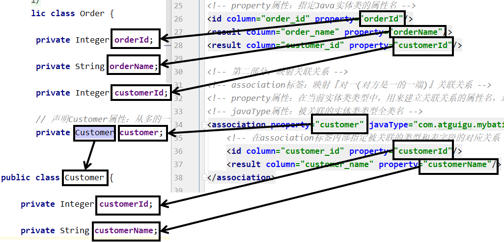

##### ③ JUnit 测试程序

```java
@Test
public void testRelationshipToOne() {
    // 查询Order对象，检查是否同时查询了关联的Customer对象
    Order order = orderMapper.selectOrderWithCustomer(2);
    System.out.println("order = " + order);
}
```

关键词：

在“对一”关联关系中，我们的配置比较多，但是关键词就只有：<span style="color:blue;font-weight:bold;">association</span>和<span style="color:blue;font-weight:bold;">javaType</span>

#### 6.2.2 关联关系-对多

> 需求：查询指定客户和客户对应的订单集合！

##### ① 创建Mapper接口

```java
public interface CustomerMapper {
    Customer selectCustomerWithOrderList(Integer customerId);
}
```

##### ② 创建CustomerMapper.xml配置文件

```xml
<!-- 配置resultMap实现从Customer到OrderList的“对多”关联关系 -->
<resultMap id="selectCustomerWithOrderListResultMap"
           type="com.atguigu.mybatis.entity.Customer">

    <!-- 映射Customer本身的属性 -->
    <id column="customer_id" property="customerId"/>
    <result column="customer_name" property="customerName"/>

    <!-- collection标签：映射“对多”的关联关系 -->
    <!-- property属性：在Customer类中，关联“多”的一端的属性名 -->
    <!-- ofType属性：集合属性中元素的类型 -->
    <collection property="orderList" ofType="com.atguigu.mybatis.entity.Order">
        <!-- 映射Order的属性 -->
        <id column="order_id" property="orderId"/>
        <result column="order_name" property="orderName"/>
    </collection>

</resultMap>

<!-- Customer selectCustomerWithOrderList(Integer customerId); -->
<select id="selectCustomerWithOrderList" resultMap="selectCustomerWithOrderListResultMap">
    SELECT c.customer_id,c.customer_name,o.order_id,o.order_name
    FROM t_customer c
    LEFT JOIN t_order o
    ON c.customer_id=o.customer_id
    WHERE c.customer_id=#{customerId}
</select>
```


对应关系可以参考下图：

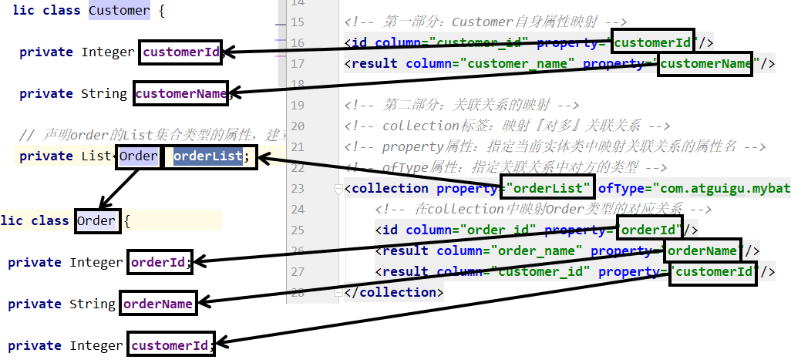

##### ③ JUnit 测试

```java
@Test
public void testRelationshipToMulti() {
    // 查询Customer对象同时将关联的Order集合查询出来
    Customer customer = customerMapper.selectCustomerWithOrderList(1);

    System.out.println("customer.getCustomerId() = " + customer.getCustomerId());
    System.out.println("customer.getCustomerName() = " + customer.getCustomerName());

    List<Order> orderList = customer.getOrderList();
    for (Order order : orderList) {
        System.out.println("order = " + order);
    }
}
```

关键词：

在“对多”关联关系中，同样有很多配置，但是提炼出来最关键的就是：“<span style="color:blue;font-weight:bold;">collection</span>”和“<span style="color:blue;font-weight:bold;">ofType</span>”

#### 6.2.3  关联关系-分步查询(默认立即加载)

##### ① 概念和需求

为了实现延迟加载，对Customer和Order的查询必须分开，分成两步来做，才能够实现。为此，我们需要单独查询Order，也就是需要在Mapper配置文件中，单独编写查询Order集合数据的SQL语句。

##### ② 具体操作

**编写查询Customer的SQL语句**

```xml
<!--Customer selectCustomerWithLazyOrderList(Integer customerId);-->
<!-- 专门指定一条SQL语句，用来查询Customer，而且是仅仅查询Customer本身，不携带Order关联 -->
<select id="selectCustomerWithLazyOrderList" resultMap="selectCustomerWithLazyOrderListResultMap">
    select customer_id,customer_name from t_customer
    where customer_id=#{customerId}
</select>
```

**编写查询Order的SQL语句**

```xml
<!--List<Order> selectOrderListByCustomerId(Integer customerId);-->
<select id="selectOrderListByCustomerId" resultType="com.atguigu.mybatis.entity.Order">
    select order_id,order_name from t_order where customer_id=#{customerId}
</select>
```

##### ③ 引用SQL语句

```xml
<!-- orderList集合属性的映射关系，使用分步查询 -->
<!-- 在collection标签中使用select属性指定要引用的SQL语句 -->
<!-- select属性值的格式是：Mapper配置文件的名称空间.SQL语句id -->
<!-- column属性：指定Customer和Order之间建立关联关系时所依赖的字段 -->
<collection
    property="orderList"
    select="com.atguigu.mybatis.mapper.CustomerMapper.selectOrderListByCustomerId"
    column="customer_id"/>
```

执行结果如下：

```java
DEBUG 11-30 11:10:05,796 ==>  Preparing: select customer_id,customer_name from t_customer where customer_id=?   (BaseJdbcLogger.java:145)
DEBUG 11-30 11:10:05,866 ==> Parameters: 1(Integer)  (BaseJdbcLogger.java:145)
DEBUG 11-30 11:10:05,889 ====>  Preparing: select order_id,order_name from t_order where customer_id=?   (BaseJdbcLogger.java:145)
DEBUG 11-30 11:10:05,890 ====> Parameters: 1(Integer)  (BaseJdbcLogger.java:145)
DEBUG 11-30 11:10:05,895 <====      Total: 3  (BaseJdbcLogger.java:145)
DEBUG 11-30 11:10:05,896 <==      Total: 1  (BaseJdbcLogger.java:145)
customer = c01
order = Order{orderId=1, orderName='o1'}
order = Order{orderId=2, orderName='o2'}
order = Order{orderId=3, orderName='o3'}
```

##### ④ 各个要素之间的对应关系

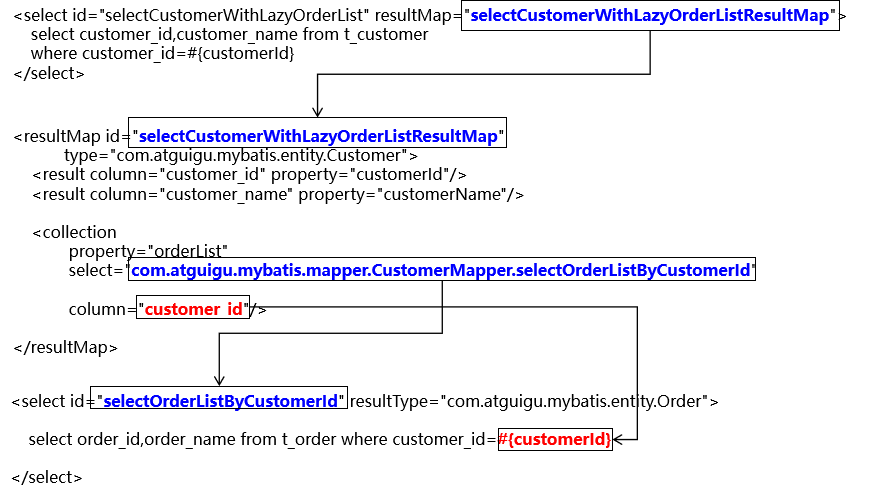

#### 6.2.4 关联关系-分步查询(延迟加载)

查询到Customer的时候，不一定会使用Order的List集合数据。如果Order的集合数据始终没有使用，那么这部分数据占用的内存就浪费了。对此，我们希望不一定会被用到的数据，能够在需要使用的时候再去查询。

例如：对Customer进行1000次查询中，其中只有15次会用到Order的集合数据，那么就在需要使用时才去查询能够大幅度节约内存空间。

<span style="color:blue;font-weight:bold;">延迟加载</span>的概念：对于实体类关联的属性到<span style="color:blue;font-weight:bold;">需要使用</span>时才查询。也叫<span style="color:blue;font-weight:bold;">懒加载</span>。


##### ① 配置

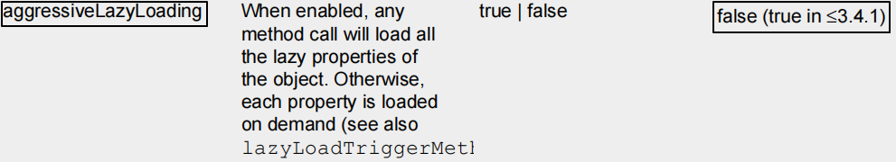

##### ② 较低版本

在 MyBatis 全局配置文件中配置 settings

```xml
<!-- 使用 settings 对 MyBatis 全局进行设置 -->
<settings>
    <!-- 开启延迟加载功能：需要配置两个配置项 -->
    <!-- 1、将lazyLoadingEnabled设置为true，开启懒加载功能 -->
    <setting name="lazyLoadingEnabled" value="true"/>

    <!-- 2、将aggressiveLazyLoading设置为false，关闭“积极的懒加载” -->
    <setting name="aggressiveLazyLoading" value="false"/>
</settings>
```

##### ③ 较高版本

```xml
<!-- MyBatis 全局配置 -->
<settings>
    <!-- 开启延迟加载功能 -->
    <setting name="lazyLoadingEnabled" value="true"/>
</settings>
```

##### ④ Spring Boot 中的配置


```properties
mybatis.configuration.lazy-loading-enabled=true
```

##### ⑤ 修改 junit 测试

```java
@Test
public void testSelectCustomerWithLazyOrderListResultMap() throws Exception{
    Customer customer = customerMapper.selectCustomerWithLazyOrderList(1);
    System.out.println("customer.getCustomerName() = " + customer.getCustomerName());

    // 先指定具体的时间单位，然后再让线程睡一会儿
    TimeUnit.SECONDS.sleep(5);

    List<Order> orderList = customer.getOrderList();
    for (Order order : orderList) {
        System.out.println("order = " + order);
    }
}
```

效果：刚开始先查询Customer本身，需要用到OrderList的时候才发送SQL语句去查询

```java
DEBUG .a.m.m.C.selectCustomerWithLazyOrderList : ==>  Preparing: select customer_id,customer_name from t_customer where customer_id = ?
DEBUG .a.m.m.C.selectCustomerWithLazyOrderList : ==> Parameters: 1(Integer)
DEBUG .a.m.m.C.selectCustomerWithLazyOrderList : <==      Total: 1
customer.getCustomerName() = c01
DEBUG c.a.m.m.O.selectOrderListByCustomerId    : ==>  Preparing: select order_id, order_name from t_order where customer_id = ?
DEBUG c.a.m.m.O.selectOrderListByCustomerId    : ==> Parameters: 1(Integer)
DEBUG c.a.m.m.O.selectOrderListByCustomerId    : <==      Total: 3
order = Order(orderId=1, orderName=o1, customer=null)
order = Order(orderId=2, orderName=o2, customer=null)
order = Order(orderId=3, orderName=o3, customer=null)
```

### 6.3 关键词总结

我们是在“对多”关系中举例说明延迟加载的，在“对一”中配置方式基本一样。

| 关联关系       | 配置项关键词                                                 | 所在配置文件                                                 |
| -------------- | ------------------------------------------------------------ | ------------------------------------------------------------ |
| 对一           | association标签/javaType属性                                 | Mapper配置文件中的resultMap                                  |
| 对多           | collection标签/ofType属性                                    | Mapper配置文件中的resultMap                                  |
| 对一分步       | association标签/select属性                                   | Mapper配置文件中的resultMap                                  |
| 对多分步       | collection标签/select属性                                    | Mapper配置文件中的resultMap                                  |
| 延迟加载[低版] | lazyLoadingEnabled设置为true<br />aggressiveLazyLoading设置为false | MyBatis 全局配置文件中的 settings<br />和 Spring Boot 整合后就是 application.properties |
| 延迟加载[高版] | lazyLoadingEnabled设置为true                                 | MyBatis 全局配置文件中的 settings<br />和 Spring Boot 整合后就是 application.properties |

### 6.4 MyBatis配置文件解读和说明

https://mybatis.org/mybatis-3/zh_CN/configuration.html#settings

```properties
# 1. 驼峰命名映射（核心必配）
mybatis.configuration.map-underscore-to-camel-case=true
# 2. 自动映射规则（支持嵌套映射）
mybatis.configuration.auto-mapping-behavior=FULL
# 3. 控制台打印SQL（调试用）
mybatis.configuration.log-impl=org.apache.ibatis.logging.stdout.StdOutImpl
# 4. 延迟加载（性能优化）
mybatis.configuration.lazy-loading-enabled=true
#mybatis.configuration.aggressive-lazy-loading=false
# 5. SQL执行超时时间（30秒）
mybatis.configuration.default-statement-timeout=30

# 之前已配置的基础参数
spring.datasource.url=jdbc:mysql://localhost:3306/你的数据库名?useUnicode=true&characterEncoding=utf8mb4&useSSL=false&serverTimezone=Asia/Shanghai
spring.datasource.username=root
spring.datasource.password=123456
spring.datasource.driver-class-name=com.mysql.cj.jdbc.Driver
mybatis.type-aliases-package=com.example.demo.entity
mybatis.mapper-locations=classpath:mapper/*.xml
```

## 7. MyBatis-Plus 进阶和实战

### 7.1 MyBatis-Plus 介绍 & 快速入门

#### 7.1.1 框架概述

[mybatis-plus中文网](https://baomidou.com/)

[MyBatis-Plus](https://github.com/baomidou/mybatis-plus) 是一个 [MyBatis](https://www.mybatis.org/mybatis-3/) 的增强工具，在 MyBatis 的基础上只做增强不做改变，为简化开发、提高效率而生。

愿景

我们的愿景是成为 MyBatis 最好的搭档，就像 **魂斗罗** 中的 1P、2P，基友搭配，效率翻倍。


- **无侵入**：只做增强不做改变，引入它不会对现有工程产生影响，如丝般顺滑
- **损耗小**：启动即会自动注入基本 CRUD，性能基本无损耗，直接面向对象操作
- **强大的 CRUD 操作**：内置通用 Mapper、通用 Service，仅仅通过少量配置即可实现单表大部分 CRUD 操作，更有强大的条件构造器，满足各类使用需求
- **支持 Lambda 形式调用**：通过 Lambda 表达式，方便的编写各类查询条件，无需再担心字段写错
- **支持主键自动生成**：支持多达 4 种主键策略（内含分布式唯一 ID 生成器 - Sequence），可自由配置，完美解决主键问题
- **支持 ActiveRecord 模式**：支持 ActiveRecord 形式调用，实体类只需继承 Model 类即可进行强大的 CRUD 操作
- **支持自定义全局通用操作**：支持全局通用方法注入（ Write once, use anywhere ）
- **内置代码生成器**：采用代码或者 Maven 插件可快速生成 Mapper 、 Model 、 Service 、 Controller 层代码，支持模板引擎，更有超多自定义配置等您来使用
- **内置分页插件**：基于 MyBatis 物理分页，开发者无需关心具体操作，配置好插件之后，写分页等同于普通 List 查询
- **分页插件支持多种数据库**：支持 MySQL、MariaDB、Oracle、DB2、H2、HSQL、SQLite、Postgre、SQLServer 等多种数据库
- **内置性能分析插件**：可输出 SQL 语句以及其执行时间，建议开发测试时启用该功能，能快速揪出慢查询
- **内置全局拦截插件**：提供全表 delete 、 update 操作智能分析阻断，也可自定义拦截规则，预防误操作

#### 7.1.2 快速入门案例

##### 7.1.2.1 数据库准备

首先在数据库中准备一张表，为后序的学习做准备。

1. **创建数据库**

   在MySQL中创建一个数据库`hello_mp`

   ```sql
   CREATE DATABASE hello_mp CHARACTER SET utf8mb4 COLLATE utf8mb4_general_ci;
   ```

2. **创建表**

   在`hello_mp`库中创建一张表`user`

   ```sql
   CREATE TABLE t_tiger(
       tiger_id INT AUTO_INCREMENT PRIMARY KEY, -- 老虎ID（主键）
       tiger_name CHAR(100) NOT NULL,          -- 老虎名称（非空）
       tiger_age INT,                          -- 老虎年龄
       tiger_salary DOUBLE                     -- 模拟薪资（测试用）
   );
   ```

3. **插入数据**

   ```sql
   INSERT INTO t_tiger (tiger_name, tiger_age, tiger_salary)
   VALUES ('王虎', 5, 500.00),
          ('李虎', 3, 800.50),
          ('张虎', 7, 200.75),
          ('赵虎', 4, 200.25),
          ('刘虎', 6, 900.00);
   ```

##### 7.1.2.2 准备项目

MyBatis-Plus 与 Spring Boot 的集成十分简单，具体操作如下

提前创建好一个 Spring Boot 项目，然后在项目中引入 MyBatis-Plus 依赖

本案例完整的`pom.xml`文件如下

```xml
<?xml version="1.0" encoding="UTF-8"?>
<project xmlns="http://maven.apache.org/POM/4.0.0" xmlns:xsi="http://www.w3.org/2001/XMLSchema-instance"
         xsi:schemaLocation="http://maven.apache.org/POM/4.0.0 https://maven.apache.org/xsd/maven-4.0.0.xsd">
    <modelVersion>4.0.0</modelVersion>
    <parent>
        <groupId>org.springframework.boot</groupId>
        <artifactId>spring-boot-starter-parent</artifactId>
        <version>3.0.5</version>
        <relativePath/> <!-- lookup parent from repository -->
    </parent>
    <groupId>com.atguigu</groupId>
    <artifactId>hello-mp</artifactId>
    <version>0.0.1-SNAPSHOT</version>
    <name>hello-mp</name>
    <description>hello-mp</description>
    <properties>
        <java.version>17</java.version>
    </properties>
    <dependencies>
        <dependency>
            <groupId>org.springframework.boot</groupId>
            <artifactId>spring-boot-starter-web</artifactId>
        </dependency>

        <dependency>
            <groupId>com.mysql</groupId>
            <artifactId>mysql-connector-j</artifactId>
            <scope>runtime</scope>
        </dependency>
        <dependency>
            <groupId>org.projectlombok</groupId>
            <artifactId>lombok</artifactId>
            <optional>true</optional>
        </dependency>
        <dependency>
            <groupId>org.springframework.boot</groupId>
            <artifactId>spring-boot-starter-test</artifactId>
            <scope>test</scope>
        </dependency>
        <dependency>
            <groupId>com.baomidou</groupId>
            <artifactId>mybatis-plus-boot-starter</artifactId>
            <version>3.5.3.2</version>
        </dependency>
    </dependencies>

    <build>
        <plugins>
            <plugin>
                <groupId>org.springframework.boot</groupId>
                <artifactId>spring-boot-maven-plugin</artifactId>
            </plugin>
        </plugins>
    </build>
</project>
```

**配置`application.yml`文件**

配置数据库相关内容如下

```yml
spring:
  datasource:
    driver-class-name: com.mysql.cj.jdbc.Driver
    username: root
    password: 123456
    url: jdbc:mysql://192.168.10.101:3306/hello_mp?useUnicode=true&characterEncoding=utf-8&serverTimezone=GMT%2b8
```

##### 7.1.2.3 准备实体类

创建与`t_tiger`表相对应的实体类，替换原有`User`类，字段与表结构完全匹配：

```java
@Data
@TableName("t_tiger") // 核心修改：指定数据库表名为t_tiger
public class Tiger {

    // 核心修改：主键字段匹配t_tiger表的tiger_id，类型为Integer（表是INT类型）
    @TableId(value = "tiger_id", type = IdType.AUTO)
    private Integer tigerId;

    // 核心修改：匹配表的tiger_name字段
    @TableField("tiger_name")
    private String tigerName;

    // 核心修改：匹配表的tiger_age字段
    @TableField("tiger_age")
    private Integer tigerAge;

    // 核心修改：匹配表的tiger_salary字段（DOUBLE类型）
    @TableField("tiger_salary")
    private Double tigerSalary;
}
```

关键说明：

1. `@TableName("t_tiger")`：必须指定实际数据库表名，与创建的`t_tiger`表一致；
2. 字段映射：`@TableField`注解值与表字段名完全匹配（如`tiger_name`），实体类属性用驼峰命名（`tigerName`）符合 Java 规范；
3. 主键类型：表中`tiger_id`是`INT`类型，实体类对应`Integer`（而非原 Long），主键策略`IdType.AUTO`适配自增规则。

##### 7.1.2.4 设计 TigerMapper

创建`TigerMapper`接口，继承`BaseMapper<T>`并指定泛型为改造后的`Tiger`实体类：

```java
// 核心修改：泛型替换为Tiger，对应新实体类
// @Mapper
public interface TigerMapper extends BaseMapper<Tiger> {
}
```

**知识点**：

若 Mapper 接口过多，可不用逐一配置`@Mapper`注解，而使用`@MapperScan`注解指定包扫描路径进行统一管理，例如（仅修改包路径，若路径不变则无需改）：

```java
@SpringBootApplication
// 注意：若Mapper放在com.atguigu.hellomp.mapper下，路径无需改；若改名需同步调整
@MapperScan("com.atguigu.hellomp.mapper")
public class HelloMpApplication {
    public static void main(String[] args) {
        SpringApplication.run(HelloMpApplication.class, args);
    }
}
```

##### 7.1.2.5 测试 mybatis-plus 效果

创建`TigerMapperTest`测试类,所有操作适配`t_tiger`表：

```java
@SpringBootTest
class TigerMapperTest {

    // 核心修改：注入TigerMapper
    @Autowired
    private TigerMapper tigerMapper;

    // 测试查询所有老虎数据
    @Test
    public void testSelectList() {
        List<Tiger> tigers = tigerMapper.selectList(null);
        tigers.forEach(System.out::println);
    }

    // 测试根据ID查询老虎
    @Test
    public void testSelectById() {
        // 核心修改：ID类型为Integer（匹配表的INT类型），测试数据用1（对应插入的第一条数据）
        Tiger tiger = tigerMapper.selectById(1);
        System.out.println(tiger);
    }

    // 测试新增老虎数据
    @Test
    public void testInsert() {
        Tiger tiger = new Tiger();
        tiger.setTigerName("钱虎"); // 匹配表的tiger_name字段
        tiger.setTigerAge(8);       // 匹配表的tiger_age字段
        tiger.setTigerSalary(600.00); // 匹配表的tiger_salary字段
        tigerMapper.insert(tiger);
    }

    // 测试根据ID更新老虎数据
    @Test
    public void testUpdateById() {
        Tiger tiger = tigerMapper.selectById(1);
        tiger.setTigerName("王虎-更新"); // 修改名称
        tigerMapper.updateById(tiger);
    }

    // 测试根据ID删除老虎数据
    @Test
    public void testDeleteById() {
        // 注意：测试删除后可重新插入数据，避免影响其他测试
        tigerMapper.deleteById(1);
    }
}
```

**测试说明：**

1. 运行`testSelectList`：可查询到插入的 5 条测试老虎数据；
2. 运行`testSelectById(1)`：可查询到 ID 为 1 的 “王虎” 数据；
3. 运行`testInsert`：新增 “钱虎” 数据到`t_tiger`表；
4. 运行`testUpdateById`：更新 ID 为 1 的老虎名称；
5. 运行`testDeleteById`：删除 ID 为 1 的老虎数据（测试后建议恢复）。

### 7.2 基础注解说明

MyBatis-Plus 的注解是实体类与数据库表之间的 “映射桥梁”，核心解决 “实体属性 ↔ 数据库字段” 的匹配问题，以下结合`t_tiger`表的实体类场景，详细解析最常用的三个核心注解：

#### 7.2.1 @TableName：实体类关联数据库表

核心含义

专用于**标识实体类对应的数据库表名**，解决 “实体类名与数据库表名不一致” 的问题（比如实体类`Tiger`对应表`t_tiger`）。

核心属性

| 属性名 | 类型   | 必选 | 说明                                                         |
| ------ | ------ | ---- | ------------------------------------------------------------ |
| value  | String | 否   | 声明实体类对应的数据库表名                                   |
| schema | String | 否   | 指定数据库 schema（多租户 / 多 schema 场景用，日常开发极少用） |

适配 t_tiger 表的使用示例:

```java
// 显式指定表名为t_tiger（核心：解决实体类名Tiger与表名t_tiger的匹配）
@TableName(value = "t_tiger")
public class Tiger {
    // ... 字段
}
```

扩展说明

1. **默认规则**：若实体类名与表名完全一致，可省略`@TableName`，比如表名是`tiger`，实体类`Tiger`无需注解；

2. **常见场景**：数据库表名习惯加前缀（如`t_`、`sys_`），此时必须用`value`指定完整表名（如`t_tiger`）；

3. 全局配置替代：若所有表都有统一前缀（如t_），可在application.properties中配置全局表前缀，避免每个实体类写@TableName：

   ```properties
   # 全局配置表前缀，实体类Tiger会自动对应t_tiger
   mybatis-plus.global-config.db-config.table-prefix=t_
   ```


#### 7.2.2 @TableId：标识主键字段

核心含义

专用于**标记实体类中的主键属性**，绑定数据库表的主键字段，同时指定主键的生成策略（如自增、UUID 等）。

核心属性

| 属性名 | 类型   | 必选 | 说明                                                         |
| ------ | ------ | ---- | ------------------------------------------------------------ |
| value  | String | 否   | 声明主键对应的数据库字段名（默认值：属性名转下划线，如`tigerId`→`tiger_id`） |
| type   | IdType | 否   | 主键生成策略（默认值：跟随全局配置，常用`AUTO`/`ASSIGN_ID`/`INPUT`） |

主键生成策略（IdType）核心值解析

| 策略值      | 含义                                      | 适用场景                                       |
| ----------- | ----------------------------------------- | ---------------------------------------------- |
| AUTO        | 数据库自增（依赖表的主键自增配置）        | 如 t_tiger 表的 tiger_id（INT AUTO_INCREMENT） |
| ASSIGN_ID   | MP 自动生成雪花算法 ID（Long 类型）       | 分布式系统、无需数据库自增的主键               |
| ASSIGN_UUID | MP 自动生成 UUID（String 类型，无中划线） | 字符串类型主键、需全局唯一                     |
| INPUT       | 程序中生成赋值                            | 主键非自增、需业务自定义赋值                   |
| NONE        | 无策略（跟随全局配置）                    | 沿用项目全局主键策略                           |

适配 t_tiger 表的使用示例:

```java
@TableName("t_tiger")
public class Tiger {
    // 核心：绑定主键字段tiger_id，指定自增策略（匹配表的AUTO_INCREMENT）
    @TableId(value = "tiger_id", type = IdType.AUTO)
    private Integer tigerId;
    // ... 其他字段
}
```

扩展说明

1. **字段名匹配**：若实体主键属性名与表主键字段名一致（如下划线转驼峰），`value`可省略，比如属性名`tigerId`对应字段`tiger_id`，可简写为`@TableId(type = IdType.AUTO)`；

2. 全局主键策略：可在配置文件统一设置主键策略，无需每个实体类写type：

   ```properties
   # 全局配置主键自增
   mybatis-plus.global-config.db-config.id-type=auto
   ```

#### 7.2.3 @TableField：标识普通字段

核心含义

专用于**标记实体类中的非主键属性**，绑定数据库表的普通字段，解决 “属性名与字段名不一致、字段是否参与 CRUD” 等问题。

核心属性

| 属性名 | 类型      | 必选 | 说明                                                         |
| ------ | --------- | ---- | ------------------------------------------------------------ |
| value  | String    | 否   | 声明属性对应的数据库字段名（默认值：属性名转下划线，如`tigerName`→`tiger_name`） |
| exist  | boolean   | 否   | 标记属性是否对应数据库字段（true：存在；false：仅实体类属性，无对应字段） |
| fill   | FieldFill | 否   | 字段自动填充策略（如创建时间、修改时间自动赋值）             |
| select | boolean   | 否   | 标记字段是否参与查询（true：参与；false：查询时忽略该字段）  |

适配 t_tiger 表的使用示例

```java
@TableName("t_tiger")
public class Tiger {
    @TableId(value = "tiger_id", type = IdType.AUTO)
    private Integer tigerId;

    // 绑定普通字段tiger_name（属性名tigerName与字段名匹配，value可省略）
    @TableField("tiger_name")
    private String tigerName;

    // 简写：属性名tigerAge对应字段tiger_age，省略value
    @TableField
    private Integer tigerAge;

    // 示例：查询时忽略该字段（select=false）
    @TableField(value = "tiger_salary", select = false)
    private Double tigerSalary;

    // 示例：仅实体类属性，无对应数据库字段（exist=false）
    @TableField(exist = false)
    private String tempRemark;
}
```

扩展说明

**忽略字段（exist=false）**：实体类中临时使用的属性（如前端传参的非数据库字段），需标记`exist=false`，否则 MP 会尝试匹配数据库字段，导致 SQL 报错。

核心注解使用总结

| 注解        | 核心作用                                        | 本案例关键配置                        |
| ----------- | ----------------------------------------------- | ------------------------------------- |
| @TableName  | 绑定实体与 t_tiger 表                           | `@TableName("t_tiger")`               |
| @TableId    | 绑定主键 tiger_id，指定自增策略                 | `@TableId("tiger_id", IdType.AUTO)`   |
| @TableField | 绑定普通字段（tiger_name/tigerAge/tigerSalary） | `@TableField("tiger_name")`（或省略） |

更多注解细节可参考 MyBatis-Plus 官方文档：https://baomidou.com/reference/annotation/

### 7.3 通用Mapper&Service

#### 7.3.1 通用 Mapper 说明

BaseMapper 是 MyBatis-Plus 提供的通用 Mapper 接口，封装了增、删、改、查等常用数据库操作方法，**自定义 Mapper 接口只需继承 BaseMapper 并指定实体类泛型（如 Tiger）**，无需编写基础 SQL 即可实现 t_tiger 表的单表 CRUD，极大简化 Mapper 层代码。

##### 7.3.1.1 BaseMapper 的定义方式

自定义 Mapper 接口继承 BaseMapper，泛型指定为对应操作的实体类（如 Tiger），示例如下：

```java
// 继承BaseMapper并指定泛型为Tiger，自动获得t_tiger表的通用CRUD方法
public interface TigerMapper extends BaseMapper<Tiger> {
    // 无需编写基础CRUD方法，MyBatis-Plus自动生成实现
    // 复杂业务SQL可在此自定义（如多表联查）
}
```

##### 7.3.1.2 BaseMapper 核心 CRUD 方法（适配 t_tiger 表）

1. `insert(T entity)`

   - 作用：新增单条老虎数据

   - 参数：entity 为待新增的 Tiger 对象，需封装 tigerName/tigerAge/tigerSalary 等字段值

   - 特点：自动生成插入 SQL，支持 tiger_id 主键自增（需实体类 @TableId 配置 type=AUTO）

   - 示例：

     ```java
     Tiger tiger = new Tiger();
     tiger.setTigerName("孙虎");
     tiger.setTigerAge(2);
     tiger.setTigerSalary(300.50);
     tigerMapper.insert(tiger); // 插入后自动回填tiger_id
     ```

2. `deleteById(Serializable id)`

   - 作用：根据老虎 ID（主键）删除单条数据

   - 参数：id 为 tiger_id 值（Integer 类型，需与实体类主键类型一致）

   - 特点：仅支持主键删除，无需编写 delete SQL

   - 示例：

     ```java
     tigerMapper.deleteById(1); // 删除tiger_id=1的老虎数据
     ```

3. `deleteByMap(Map<String, Object> columnMap)`

   - 作用：按多字段等值匹配删除老虎数据

   - 参数：columnMap 的 key 为数据库字段名（如 tiger_name），value 为匹配值

   - 特点：仅支持等值条件，不支持模糊、范围等复杂条件

   - 示例：

     ```java
     Map<String, Object> map = new HashMap<>();
     map.put("tiger_name", "李虎"); // 数据库字段名
     map.put("tiger_age", 3);
     tigerMapper.deleteByMap(map); // 删除名称为李虎且年龄为3的老虎
     ```

4. `updateById(T entity)`

   - 作用：根据老虎 ID（主键）更新数据

   - 参数：entity 需封装 tiger_id（主键）和待更新的字段值（非 null 字段才会更新）

   - 特点：自动定位主键对应的记录，仅更新非 null 字段

   - 示例：

     ```java
     Tiger tiger = new Tiger();
     tiger.setTigerId(1); // 必须指定主键
     tiger.setTigerSalary(600.00); // 仅更新薪资字段
     tigerMapper.updateById(tiger);
     ```

5. `update(T entity, Wrapper<T> updateWrapper)`

   - 作用：按条件更新老虎数据

   - 参数：entity 封装待更新字段值，updateWrapper 封装更新条件（如模糊、范围）

   - 特点：支持复杂更新条件，避免手动拼接 SQL

   - 示例：

     ```java
     Tiger tiger = new Tiger();
     tiger.setTigerSalary(800.00); // 待更新的薪资
     // 条件：年龄大于5的老虎
     UpdateWrapper<Tiger> wrapper = new UpdateWrapper<>();
     wrapper.gt("tiger_age", 5);
     tigerMapper.update(tiger, wrapper);
     ```

6. `selectById(Serializable id)`

   - 作用：根据老虎 ID（主键）查询单条数据

   - 参数：id 为 tiger_id 值（Integer 类型）

   - 返回值：匹配的 Tiger 对象，无数据则返回 null

   - 示例：

     ```java
     Tiger tiger = tigerMapper.selectById(1); // 查询tiger_id=1的老虎
     ```

7. `selectList(Wrapper<T> queryWrapper)`

   - 作用：按条件查询多条老虎数据

   - 参数：queryWrapper 为查询条件封装器（传 null 则查询全表）

   - 返回值：匹配的 Tiger 对象列表，支持等值、模糊、排序等多类条件

   - 示例：

     ```java
     // 无条件查询全表
     List<Tiger> list = tigerMapper.selectList(null);
     // 带条件：薪资大于200的老虎，按年龄降序
     QueryWrapper<Tiger> wrapper = new QueryWrapper<>();
     wrapper.gt("tiger_salary", 200).orderByDesc("tiger_age");
     List<Tiger> list2 = tigerMapper.selectList(wrapper);
     ```

**核心说明**：

- `deleteById`/`selectById`的参数类型为 Integer（匹配 Tiger 实体的 tigerId 类型），需与 t_tiger 表的 tiger_id（INT 类型）一致；
- `deleteByMap`的 key 必须是数据库字段名（如 tiger_name），而非实体类属性名（tigerName）；
- 所有方法无需手动编写 XML 或注解 SQL，MyBatis-Plus 自动生成适配 t_tiger 表的 SQL。

#### 7.3.2 通用 Service 说明

IService 是 MyBatis-Plus 提供的通用 Service 层接口，基于 BaseMapper 封装了更贴合业务层的 CRUD 操作，补充了批量操作、分页查询等能力，方法命名遵循 “get（查单行）、remove（删除）、list（查集合）、page（分页）” 规范，专门适配 t_tiger 表的业务层开发。

##### 7.3.2.1 扩展为通用 Service 的语法

**步骤一：自定义 Service 接口（继承 IService<T>）**

```java
public interface TigerService extends IService<Tiger> {
    // 可自定义复杂业务方法（如按薪资区间查询老虎）
}
```

**步骤二：自定义 Service 实现类（继承 ServiceImpl）**

```java
@Service
public class TigerServiceImpl extends ServiceImpl<TigerMapper, Tiger> implements TigerService {
    // 通用CRUD方法无需实现，继承即可使用
}
```

##### 7.3.2.2 IService 核心方法说明（适配 t_tiger 表）

1. `save(T entity)`

   - 作用：新增单条老虎数据（底层调用 BaseMapper.insert）

   - 参数：entity 为待新增的 Tiger 对象

   - 特点：方法名贴合业务语义，与 Mapper 层 insert 做区分

   - 示例：

     ```java
     Tiger tiger = new Tiger();
     tiger.setTigerName("周虎");
     tiger.setTigerAge(4);
     tiger.setTigerSalary(700.00);
     tigerService.save(tiger);
     ```

2. `removeById(Serializable id)`

   - 作用：根据老虎 ID 删除单条数据（底层调用 BaseMapper.deleteById）

   - 参数：id 为 tiger_id 值（Integer 类型）

   - 特点：方法名用 remove，更符合业务层 “删除” 语义

   - 示例：

     ```java
     tigerService.removeById(2); // 删除tiger_id=2的老虎
     ```

3. `removeByMap(Map<String, Object> columnMap)`

   - 作用：按多字段等值匹配删除老虎数据（底层调用 BaseMapper.deleteByMap）

   - 参数：columnMap 的 key 为数据库字段名（如 tiger_age），value 为匹配值

   - 示例：

     ```java
     Map<String, Object> map = new HashMap<>();
     map.put("tiger_age", 7);
     tigerService.removeByMap(map); // 删除年龄为7的老虎
     ```

4. `updateById(T entity)`

   - 作用：根据老虎 ID 更新数据（底层调用 BaseMapper.updateById）

   - 参数：entity 需封装 tiger_id 和待更新字段值

   - 示例：

     ```java
     Tiger tiger = new Tiger();
     tiger.setTigerId(3);
     tiger.setTigerName("张虎-更新");
     tigerService.updateById(tiger);
     ```

5. `updateBatchById(Collection<T> entityList)`

   - 作用：按主键批量更新老虎数据

   - 参数：entityList 为待更新的 Tiger 对象集合

   - 特点：底层分批执行 updateById，默认批次大小 1000，可自定义

   - 示例：

     ```java
     List<Tiger> list = new ArrayList<>();
     // 第一条更新数据
     Tiger t1 = new Tiger();
     t1.setTigerId(1);
     t1.setTigerSalary(550.00);
     // 第二条更新数据
     Tiger t2 = new Tiger();
     t2.setTigerId(2);
     t2.setTigerSalary(850.00);
     list.add(t1);
     list.add(t2);
     tigerService.updateBatchById(list); // 批量更新
     // 自定义批次大小（如500）
     // tigerService.updateBatchById(list, 500);
     ```

6. `getById(Serializable id)`

   - 作用：根据老虎 ID 查询单条数据（底层调用 BaseMapper.selectById）

   - 参数：id 为 tiger_id 值（Integer 类型）

   - 返回值：匹配的 Tiger 对象，无数据则返回 null

   - 特点：方法名用 get，贴合业务层 “查询单行” 语义

   - 示例：

     ```java
     Tiger tiger = tigerService.getById(3); // 查询tiger_id=3的老虎
     ```

7. `list(Wrapper<T> queryWrapper)`

   - 作用：按条件查询多条老虎数据（底层调用 BaseMapper.selectList）

   - 参数：queryWrapper 为查询条件封装器（传 null 则查询全表），支持 LambdaQueryWrapper 避免硬编码字段名

   - 返回值：匹配的 Tiger 对象列表

   - 示例：

     ```java
     // 无条件查询全表
     List<Tiger> allTigers = tigerService.list(null);
     // Lambda条件：薪资大于500且年龄小于6的老虎
     LambdaQueryWrapper<Tiger> lambdaWrapper = new LambdaQueryWrapper<>();
     lambdaWrapper.gt(Tiger::getTigerSalary, 500).lt(Tiger::getTigerAge, 6);
     List<Tiger> list = tigerService.list(lambdaWrapper);
     ```

8. `page(IPage<T> page, Wrapper<T> queryWrapper)`

   - 作用：分页查询老虎数据

   - 参数：page 指定分页参数（页码、页大小），queryWrapper 为查询条件

   - 返回值：IPage 对象（含当前页数据、总条数、总页数等分页信息）

   - 特点：补充 Mapper 层缺失的分页能力，适配业务层分页需求

   - 示例：

     ```java
     // 分页参数：第1页，每页3条
     IPage<Tiger> page = new Page<>(1, 3);
     // 条件：薪资大于200
     QueryWrapper<Tiger> wrapper = new QueryWrapper<>();
     wrapper.gt("tiger_salary", 200);
     // 分页查询
     IPage<Tiger> tigerPage = tigerService.page(page, wrapper);
     // 获取分页结果
     System.out.println("总条数：" + tigerPage.getTotal());
     System.out.println("总页数：" + tigerPage.getPages());
     System.out.println("当前页数据：" + tigerPage.getRecords());
     ```

#### 7.3.3 BaseMapper 和 IService 对比总结

| 维度     | BaseMapper                                        | IService                                    |
| -------- | ------------------------------------------------- | ------------------------------------------- |
| 定位     | 数据访问层（DAO/Mapper）接口                      | 业务逻辑层（Service）接口                   |
| 底层依赖 | 直接对接 MyBatis，生成 t_tiger 表的 SQL 执行      | 基于 TigerMapper 封装，调用 Mapper 方法实现 |
| 方法设计 | 偏底层数据库操作，方法名贴近 SQL（insert/delete） | 偏业务层语义，方法名更易理解（save/remove） |
| 功能侧重 | 基础单表 CRUD（t_tiger 表），无批量 / 分页增强    | 补充批量、分页等高级能力（适配业务场景）    |
| 使用场景 | 简单 CRUD、自定义 t_tiger 表的复杂 SQL 时         | 业务层开发（批量操作、分页查询、友好命名）  |
| 依赖注入 | 注入到 TigerService 层使用                        | 注入到 Controller / 其他 Service 层使用     |

总结：

- BaseMapper 是 Mapper 层极简封装，提供 t_tiger 表的基础 CRUD，是 IService 的底层支撑；
- IService 是业务层封装，补充批量、分页能力，方法命名更贴合业务（如 save/remove/get），是 t_tiger 表业务开发的首选；
- 实际开发中，TigerMapper 仅继承 BaseMapper，t_tiger 表的业务逻辑全部通过 TigerService 实现。

### 7.4 动态条件拼接

MyBatis-Plus 中的 Wrapper 是封装查询 / 更新条件的通用抽象接口，核心价值在于**无需手动拼接 SQL 片段**，通过链式调用构建复杂条件逻辑，支持编译期校验、null 值更新等生产级特性。

#### 7.4.1 核心普通 Wrapper

普通 Wrapper 是官方定义的基础用法，通过 “数据库字段名字符串” 指定字段，适配快速开发场景。

##### 7.4.1.1 QueryWrapper：查询条件构造器

QueryWrapper 专用于构建 `SELECT` 语句的 `WHERE` 条件，支持等值、模糊、范围、排序等全量查询逻辑，是官方推荐的基础查询条件封装方式。

```java
// 注入Mapper（实际开发建议在Service层使用）
@Autowired
private TigerMapper tigerMapper;

// 1. 方式1：直接new实例（官方基础写法）
QueryWrapper<Tiger> queryWrapper = new QueryWrapper<>();
// 链式拼接条件：tiger_age = 5 AND tiger_name LIKE '%虎%' AND tiger_salary BETWEEN 200 AND 900
// 注：字段名需与数据库表（t_tiger）完全一致
queryWrapper.eq("tiger_age", 5)        // 等值条件：=
            .like("tiger_name", "虎")  // 模糊查询：LIKE '%虎%'
            .between("tiger_salary", 200, 900) // 范围查询：BETWEEN
            .orderByDesc("tiger_age"); // 排序：ORDER BY tiger_age DESC

// 2. 方式2：Wrappers工具类（官方推荐快捷方式，简化泛型声明）
QueryWrapper<Tiger> queryWrapper2 = Wrappers.query();
queryWrapper2.ne("tiger_age", 3)       // 不等值：!=
            .isNotNull("tiger_salary") // 非空：IS NOT NULL
            .in("tiger_id", 1, 2, 3);  // IN条件：IN (1,2,3)

// 3. 配合Mapper/Service执行查询（官方标准调用方式）
List<Tiger> tigerList = tigerMapper.selectList(queryWrapper);
```

核心特性:

- 支持全量 SQL 查询条件：`eq`（=）、`ne`（!=）、`gt`（>）、`lt`（<）、`like`（模糊）、`in`（IN）、`isNull`（IS NULL）等；
- 条件优先级：可通过 `and()`/`or()` 控制条件分组（如 `eq().or().gt()`）；
- 字段名要求：必须与数据库表字段完全一致（如 t_tiger 表的 `tiger_name`），拼写错误会导致 SQL 执行异常。

##### 7.4.1.2 UpdateWrapper：更新条件构造器

UpdateWrapper 专用于构建 `UPDATE` 语句的 `SET` 字段和 `WHERE` 条件，官方明确其核心优势是**支持将字段值设为 null**（区别于 “实体 + QueryWrapper” 的更新方式）。

```java
import com.baomidou.mybatisplus.core.conditions.update.UpdateWrapper;
import com.baomidou.mybatisplus.core.toolkit.Wrappers;
import com.example.demo.entity.Tiger;
import com.example.demo.mapper.TigerMapper;
import org.springframework.beans.factory.annotation.Autowired;

@Autowired
private TigerMapper tigerMapper;

// 1. 方式1：直接new实例（演示null值更新，官方核心特性）
UpdateWrapper<Tiger> updateWrapper = new UpdateWrapper<>();
// 拼接更新逻辑：SET tiger_salary = null, tiger_name = '更新虎' WHERE tiger_id = 1
updateWrapper.set("tiger_salary", null) // 支持将字段设为null（实体更新无法实现）
             .set("tiger_name", "更新虎") // 设置普通字段值
             .eq("tiger_id", 1);         // 更新条件

// 2. 方式2：Wrappers工具类（官方推荐）
UpdateWrapper<Tiger> updateWrapper2 = Wrappers.update();
// 拼接更新逻辑：SET tiger_age = 8 WHERE tiger_name LIKE '王%'
updateWrapper2.set("tiger_age", 8)
              .likeRight("tiger_name", "王"); // 左模糊：LIKE '王%'

// 3. 配合Mapper执行更新（官方标准：第一个参数传null，全量通过Wrapper控制）
int affectedRows = tigerMapper.update(null, updateWrapper);
```

核心特性

- null 值更新：`set("字段名", null)` 是 UpdateWrapper 独有的核心能力，实体对象更新时非 null 字段才会参与更新，无法实现此效果；
- 直接拼接 SQL 片段：支持 `setSql("tiger_age = tiger_age + 1")` 实现复杂更新逻辑（如字段自增）；
- 条件复用：可复用 QueryWrapper 所有条件方法（eq/like/between 等）构建更新条件。

#### 7.4.2 Lambda 系列 Wrapper（官方推荐生产级用法）

Lambda 系列 Wrapper 是官方为解决 “硬编码字段名” 问题设计的增强版，基于 Lambda 表达式引用实体类属性，支持**编译期字段校验**（字段名拼写错误直接编译失败），是生产环境首选。

##### 7.4.2.1 LambdaQueryWrapper：Lambda 风格查询构造器

```java
@Autowired
private TigerMapper tigerMapper;

// 1. 方式1：直接new实例（类型安全，无硬编码）
LambdaQueryWrapper<Tiger> lambdaQueryWrapper = new LambdaQueryWrapper<>();
// 拼接条件：tiger_age = 5 AND tiger_name LIKE '%虎%'（引用实体属性，IDE自动补全）
lambdaQueryWrapper.eq(Tiger::getTigerAge, 5)
                  .like(Tiger::getTigerName, "虎")
                  .gt(Tiger::getTigerSalary, 500);

// 2. 方式2：Wrappers工具类（官方推荐，简化代码）
LambdaQueryWrapper<Tiger> lambdaQueryWrapper2 = Wrappers.lambdaQuery();
lambdaQueryWrapper2.ne(Tiger::getTigerAge, 3)
                  .isNotNull(Tiger::getTigerSalary)
                  .orderByDesc(Tiger::getTigerAge);

// 3. 执行查询（与普通Wrapper调用方式一致）
List<Tiger> tigerList = tigerMapper.selectList(lambdaQueryWrapper);
```

##### 7.4.2.2 LambdaUpdateWrapper：Lambda 风格更新构造器

```java
@Autowired
private TigerMapper tigerMapper;

// 1. 方式1：直接new实例（无硬编码字段名）
LambdaUpdateWrapper<Tiger> lambdaUpdateWrapper = new LambdaUpdateWrapper<>();
// 拼接更新逻辑：SET tiger_name = 'Lambda虎', tiger_salary = 600 WHERE tiger_id = 1
lambdaUpdateWrapper.set(Tiger::getTigerName, "Lambda虎")
                   .set(Tiger::getTigerSalary, 600.00)
                   .eq(Tiger::getTigerId, 1);

// 2. 方式2：Wrappers工具类（官方推荐）
LambdaUpdateWrapper<Tiger> lambdaUpdateWrapper2 = Wrappers.lambdaUpdate();
// 拼接更新逻辑：SET tiger_age = tiger_age + 1 WHERE tiger_name = '李虎'
lambdaUpdateWrapper2.setSql("tiger_age = tiger_age + 1") // 支持原生SQL片段
                   .eq(Tiger::getTigerName, "李虎");

// 3. 执行更新
int affectedRows = tigerMapper.update(null, lambdaUpdateWrapper);
```

**Lambda 系列核心优势**

1. 类型安全：通过 `Tiger::getTigerName` 引用属性，字段名拼写错误在编译期暴露，避免运行时 SQL 错误；
2. IDE 友好：支持自动补全实体属性，开发效率更高；
3. 重构便捷：实体字段名修改时，Lambda 引用会同步提示修改，无需全局替换字符串字段名。

#### 7.4.3 关键注意事项

##### 7.4.3.1 字段引用方式差异（官方定义）

| Wrapper 类型        | 字段引用方式                                   | 优缺点                                 | 适用场景               |
| ------------------- | ---------------------------------------------- | -------------------------------------- | ---------------------- |
| 普通 Wrapper        | 数据库字段名字符串（如 "tiger_name"）          | 灵活但易拼写错误，运行时暴露问题       | 快速测试、简单场景     |
| Lambda 系列 Wrapper | 实体属性 Lambda 引用（如 Tiger::getTigerName） | 类型安全、编译期校验，官方推荐生产使用 | 生产环境、复杂业务场景 |

##### 7.4.3.2 动态条件控制

所有 Wrapper 方法均支持 “条件判断参数”，仅当参数为 `true` 时才拼接条件，解决动态查询场景：

```java
// 动态参数（可能为null）
String tigerName = "虎";
Integer minSalary = 300;

LambdaQueryWrapper<Tiger> wrapper = Wrappers.lambdaQuery();
// 仅当tigerName非null时，拼接“tiger_name LIKE '%虎%'”
wrapper.like(tigerName != null, Tiger::getTigerName, tigerName);
// 仅当minSalary非null时，拼接“tiger_salary > 300”
wrapper.gt(minSalary != null, Tiger::getTigerSalary, minSalary);
```

##### 7.4.3.3 条件优先级控制

通过 `and()`/`or()` 或 `nested()` 控制条件分组，避免条件优先级错误：

```java
// 正确：(tiger_age > 3 AND tiger_salary > 500) OR tiger_name = '王虎'
LambdaQueryWrapper<Tiger> wrapper = Wrappers.lambdaQuery();
wrapper.nested(w -> w.gt(Tiger::getTigerAge, 3).gt(Tiger::getTigerSalary, 500))
       .or()
       .eq(Tiger::getTigerName, "王虎");
```

##### 7.4.3.4 核心总结（官方规范）

1. Lambda 系列 Wrapper 是官方推荐的生产级用法，解决硬编码字段名问题，优先使用；
2. UpdateWrapper 是唯一支持 “字段设为 null” 的更新方式，需更新 null 值时必须使用；
3. 动态条件通过 “条件判断参数” 实现，避免手动拼接 if-else；
4. 所有 Wrapper 均无需手动编写 SQL，MyBatis-Plus 自动生成符合数据库规范的 SQL 片段。

### 7.5 逻辑删除删除

逻辑删除是 MyBatis-Plus 提供的 “假删除” 能力：不物理删除数据库记录，仅修改指定字段的状态标记（如`deleted=1`），保留数据便于恢复和分析，区别于直接删除数据的 “物理删除”。

- **物理删除**：真实删除，将 t_tiger 表中对应记录从数据库中移除，后续无法查询；
- **逻辑删除**：假删除，将 t_tiger 表中代表 “是否删除” 的字段改为 “已删除状态”，记录仍保存在数据库中，查询时自动过滤已删除数据。

#### 7.5.1 数据库和实体类添加逻辑删除字段

##### 7.5.1.1 给 t_tiger 表添加逻辑删除字段

通过 SQL 给 t_tiger 表新增`deleted`字段（INT 类型，默认 0 表示未删除，1 表示已删除）：

```sql
-- 给t_tiger表添加逻辑删除字段：deleted，默认值0（未删除）
ALTER TABLE t_tiger ADD deleted INT DEFAULT 0 ;
-- 说明：1=逻辑删除，0=未逻辑删除（MyBatis-Plus默认规则）
```

##### 7.5.1.2 Tiger 实体类添加逻辑删除属性

在 Tiger 实体类中新增`deleted`属性，并通过`@TableLogic`注解标记为逻辑删除字段：

```java
@Data
@TableName("t_tiger") // 对应t_tiger表
public class Tiger {

    // 主键：tiger_id（自增）
    @TableId(value = "tiger_id", type = IdType.AUTO)
    private Integer tigerId;

    // 老虎名称
    @TableField("tiger_name")
    private String tigerName;

    // 老虎年龄
    @TableField("tiger_age")
    private Integer tigerAge;

    // 老虎薪资
    @TableField("tiger_salary")
    private Double tigerSalary;

    // 核心：逻辑删除字段（适配t_tiger表的deleted字段）
    @TableLogic
    private Integer deleted;
}
```

#### 7.5.2 指定逻辑删除字段和属性值

##### 7.5.2.1 单一指定（仅在实体类注解配置）

无需额外配置，仅通过`@TableLogic`注解标记即可（使用 MyBatis-Plus 默认值：1 = 删除，0 = 未删除）

##### 7.5.2.2 全局配置（推荐，统一管理所有表）

在`application.yml`中配置全局逻辑删除规则，适配 t_tiger 表及其他表的逻辑删除字段：

```yaml
mybatis-plus:
  global-config:
    db-config:
      logic-delete-field: deleted # 逻辑删除字段的实体类属性名（此处为deleted）
      logic-delete-value: 1       # 逻辑已删除值（默认为1，对应t_tiger表的deleted=1）
      logic-not-delete-value: 0   # 逻辑未删除值（默认为0，对应t_tiger表的deleted=0）
```

> 说明：配置全局规则后，所有实体类的`deleted`字段无需重复写`@TableLogic`注解（若字段名 / 值与全局一致）。

#### 7.5.3 演示逻辑删除操作

> 核心特性：执行删除操作时，MyBatis-Plus 会自动将`DELETE`语句转为`UPDATE`语句，修改`deleted`字段值，而非真正删除数据。

##### 7.5.3.1 逻辑删除代码（删除 tiger_id=5 的老虎数据）

```java
@SpringBootTest
class TigerMapperTest {

    @Autowired
    private TigerMapper tigerMapper;

    // 逻辑删除：删除tiger_id=5的老虎数据
    @Test
    public void testLogicDelete() {
        // 调用deleteById，实际执行UPDATE语句
        tigerMapper.deleteById(5);
    }
}
```

##### 7.5.3.2 执行效果（关键日志）

```plaintext
JDBC Connection [com.alibaba.druid.proxy.jdbc.ConnectionProxyImpl@5871a482] will not be managed by Spring
==>  Preparing: UPDATE t_tiger SET deleted=1 WHERE tiger_id=? AND deleted=0
==>  Parameters: 5(Integer)
<==    Updates: 1
```

> 说明：原本的`DELETE FROM t_tiger WHERE tiger_id=5`被自动转为`UPDATE`语句，仅修改`deleted=1`，数据仍保留在表中。

#### 7.5.4 测试查询数据（自动过滤已逻辑删除的数据）

逻辑删除后，执行查询操作时，MyBatis-Plus 会自动在 WHERE 条件中添加`deleted=0`，仅查询未删除的数据。

##### 7.5.4.1 查询代码（查询 t_tiger 表所有未删除数据）

```java
@Test
public void testSelectNotDeleted() {
    // 传null表示无额外条件，仅查询未逻辑删除的数据
    tigerMapper.selectList(null);
}
```

##### 7.5.4.2 执行效果（关键日志）

```plaintext
==>  Preparing: SELECT tiger_id,tiger_name,tiger_age,tiger_salary,deleted FROM t_tiger WHERE deleted=0
==>  Parameters:
<==      Total: 4
```

> 说明：查询语句自动拼接`WHERE deleted=0`，tiger_id=5 的记录因`deleted=1`被过滤，不会出现在查询结果中。

核心注意事项（适配 t_tiger 表）

1. **字段类型匹配**：t_tiger 表的`deleted`字段为 INT 类型，实体类`deleted`属性需用`Integer`（而非 Boolean），避免类型转换异常；
2. **默认规则**：MyBatis-Plus 默认`deleted=1`为删除、`deleted=0`为未删除，若需自定义（如`deleted=2`为删除），可通过`@TableLogic(value="0", delval="2")`或全局配置修改；
3. **查询已删除数据**：若需查询包含已逻辑删除的数据，需手动拼接条件`wrapper.eq("deleted", 1)`；
4. **物理删除兼容**：逻辑删除仅影响 MyBatis-Plus 的通用 CRUD 方法（如 deleteById/selectList），自定义 SQL 需手动处理`deleted`字段。

## 8. 案例 11：基于 MyBatis-Plus 改造用户模块实现

### 8.1 调整依赖（pom.xml）

替换原 MyBatis 依赖为 MyBatis-Plus 核心依赖，保留 MySQL 驱动、Lombok 等基础依赖：

```xml
<!-- MySQL驱动 -->
<dependency>
    <groupId>com.mysql</groupId>
    <artifactId>mysql-connector-j</artifactId>
    <scope>runtime</scope>
</dependency>

<!-- MyBatis-Plus核心依赖（替代原生MyBatis） -->
<dependency>
    <groupId>com.baomidou</groupId>
    <artifactId>mybatis-plus-boot-starter</artifactId>
    <version>3.5.3.1</version>
</dependency>

<!-- Spring Boot 测试依赖 -->
<dependency>
    <groupId>org.springframework.boot</groupId>
    <artifactId>spring-boot-starter-test</artifactId>
    <scope>test</scope>
</dependency>

<!-- Lombok -->
<dependency>
    <groupId>org.projectlombok</groupId>
    <artifactId>lombok</artifactId>
    <optional>true</optional>
</dependency>
```

### 8.2 配置文件 application.properties

简化配置（MyBatis-Plus 兼容 MyBatis 配置，新增少量 MP 专属配置）：

```properties
# 数据库连接配置（不变）
spring.datasource.url=jdbc:mysql://localhost:3306/你的数据库名?useUnicode=true&characterEncoding=utf8mb4&useSSL=false&serverTimezone=Asia/Shanghai
# 你的数据库用户名
spring.datasource.username=root
# 你的数据库密码
spring.datasource.password=123456
spring.datasource.driver-class-name=com.mysql.cj.jdbc.Driver

# MyBatis-Plus核心配置（替代原MyBatis配置）
# 驼峰命名转换（默认开启，可省略）
mybatis-plus.configuration.map-underscore-to-camel-case=true
# 实体类所在包
mybatis-plus.type-aliases-package=com.example.demo.entity
# 无需配置mapper-locations，因为MP通用CRUD无需XML
```

### 8.3 改造 SysUserMapper 层

删除原自定义方法（MP 的 BaseMapper 已封装基础 CRUD），并且删除 Mapper XML

```java
/**
 * 用户Mapper接口（MyBatis-Plus版）
 * 继承BaseMapper<SysUser>，自动获得MP封装的通用CRUD方法
 */
public interface SysUserMapper extends BaseMapper<SysUser> {
}
```

### 8.4 改造 SysUserService 层

Service 接口

```java
/**
 * 定义所有业务方法，后续AOP可直接切入这些方法
 */
public interface UserService extends IService<SysUser> {
    // 登录校验（AOP可切入此方法做日志/权限校验）
    boolean login(String username, String password);

    // 根据ID删除用户（AOP可切入此方法做操作日志）
    boolean removeUserById(Long id);

    // 根据ID更新用户（AOP可切入此方法做数据校验/事务）
    Boolean updateUserById(Long id, SysUser sysUser);

    // 新增用户（AOP可切入此方法做数据脱敏/事务）
    SysUser saveUser(SysUser user);

    // 根据ID查询用户（AOP可切入此方法做数据权限）
    SysUser getUserById(Long id);

    // 条件查询用户列表（AOP可切入此方法做分页/数据过滤）
    List<SysUser> getUserList(String username, String phone, Integer status);
}
```

Service 实现类

```java
/**
 * 业务逻辑全部在此实现，后续AOP切面直接增强此类的方法
 */
@Service
public class UserServiceImpl extends ServiceImpl<SysUserMapper, SysUser> implements UserService {
    @Autowired
    SysUserMapper sysUserMapper;

    // 登录校验：核心业务逻辑（AOP可切入）
    @Override
    public boolean login(String username, String password) {
        LambdaQueryWrapper<SysUser> wrapper = new LambdaQueryWrapper<>();
        wrapper.eq(SysUser::getUsername, username)
               .eq(SysUser::getPassword, password);
        return sysUserMapper.exists(wrapper);
    }

    // 根据ID删除：核心业务逻辑（AOP可切入）
    @Override
    public boolean removeUserById(Long id) {
        return this.removeById(id);
    }

    // 根据ID更新：核心业务逻辑（AOP可切入）
    @Override
    public Boolean updateUserById(Long id, SysUser sysUser) {
        sysUser.setId(id);
        return this.updateById(sysUser);
    }

    // 新增用户：核心业务逻辑（AOP可切入）
    @Override
    public SysUser saveUser(SysUser user) {
        boolean success = this.save(user);
        return success ? user : null;
    }

    // 根据ID查询：核心业务逻辑（AOP可切入）
    @Override
    public SysUser getUserById(Long id) {
        return this.getById(id);
    }

    // 条件查询：核心业务逻辑（AOP可切入）
    @Override
    public List<SysUser> getUserList(String username, String phone, Integer status) {
        LambdaQueryWrapper<SysUser> wrapper = new LambdaQueryWrapper<>();
        wrapper.like(StringUtils.isNotBlank(username), SysUser::getUsername, username)
               .eq(StringUtils.isNotBlank(phone), SysUser::getPhone, phone)
               .eq(status != null, SysUser::getStatus, status);
        return this.list(wrapper);
    }
}
```

### 8.5 启动类配置 Mapper 扫描

仍保留`@MapperScan`，指定 Mapper 接口所在包：

```java
import org.mybatis.spring.annotation.MapperScan;
import org.springframework.boot.SpringApplication;
import org.springframework.boot.autoconfigure.SpringBootApplication;

@SpringBootApplication
@MapperScan("com.example.demo.mapper") // 替换为你的SysUserMapper所在包
public class DemoApplication {
    public static void main(String[] args) {
        SpringApplication.run(DemoApplication.class, args);
    }
}
```

### 8.6 改造Controller层

#### 8.6.1 LoginController改造

```java
@RestController
@RequestMapping("auth")
public class LoginController {

    @Autowired
    private UserService userService; // 注入Service，仅调用方法

    @PostMapping("login")
    public Result login(HttpSession session, @Valid @RequestBody SysUserLoginDto user, BindingResult bindingResult) {
        // 1. 仅做参数格式校验（表现层职责）
        if (bindingResult.hasErrors()) {
            return Result.fail(500, "账号和密码不符合规则,登录失败！");
        }

        // 2. 调用Service业务方法（无任何业务逻辑，仅转发）
        boolean logined = userService.login(user.getUsername(), user.getPassword());

        // 3. 仅做响应处理（表现层职责）
        if (!logined) {
            return Result.fail("账号或者密码错误！");
        }
        session.setAttribute("username", user.getUsername());
        return Result.success("登录成功！");
    }

    @GetMapping("logout")
    public Result logout(HttpSession session) {
        // 仅做Session操作（表现层职责）
        session.removeAttribute("username");
        session.invalidate();
        return Result.success("退出登录成功！");
    }
}
```

#### 8.6.2 UserController改造

```java
@RequestMapping("user")
@RestController
public class UserController {

    @Autowired
    private UserService userService; // 注入Service，仅调用方法

    // 删除用户：仅调用Service.removeUserById
    @DeleteMapping("{id}")
    public Result removeUser(HttpSession session, @PathVariable Long id) {
        boolean deleted = userService.removeUserById(id); // 调用Service
        if (deleted) {
            return Result.success("删除ID为" + id + "的用户成功！");
        } else {
            return Result.fail("删除失败：ID为" + id + "的用户不存在！");
        }
    }

    // 更新用户：仅调用Service.updateUserById
    @PutMapping("{id}")
    public Result updateUser(
            HttpSession session,
            @PathVariable Long id,
            @Valid @RequestBody SysUser sysUser,
            BindingResult bindingResult){

        // 仅做参数校验（表现层职责）
        if (bindingResult.hasErrors()) {
            String errorMsg = bindingResult.getFieldErrors().stream()
                    .map(error -> error.getField() + "：" + error.getDefaultMessage())
                    .collect(Collectors.joining("；"));
            return Result.fail(500, "参数校验失败：" + errorMsg);
        }

        // 调用Service业务方法
        Boolean updatedUser = userService.updateUserById(id, sysUser);

        // 仅做响应处理
        if (updatedUser){
            return Result.success("更新ID为" + id + "的用户成功！");
        }
        return Result.fail("更新失败：ID为" + id + "的用户不存在！");
    }

    // 新增用户：仅调用Service.saveUser
    @PostMapping
    public Result saveUser(
            HttpSession session,
            @Valid @RequestBody SysUser user,
            BindingResult bindingResult
    ) {
        // 仅做参数校验（表现层职责）
        if (bindingResult.hasErrors()) {
            String errorMsg = bindingResult.getFieldErrors().stream()
                    .map(error -> error.getField() + "：" + error.getDefaultMessage())
                    .collect(Collectors.joining("；"));
            return Result.fail(500, "参数校验失败：" + errorMsg);
        }

        // 调用Service业务方法
        SysUser savedUser = userService.saveUser(user);

        // 仅做响应处理
        return Result.success("新增用户成功！", savedUser);
    }

    // 查询单用户：仅调用Service.getUserById
    @GetMapping("{id}")
    public Result findById(HttpSession session, @PathVariable Long id) {
        SysUser sysUser = userService.getUserById(id); // 调用Service
        System.out.println("查询到的用户：" + sysUser);
        if (sysUser == null) {
            return Result.fail("查询失败：ID为" + id + "的用户不存在！");
        }
        return Result.success("查询成功！", sysUser);
    }

    // 条件查询：仅调用Service.getUserList
    @GetMapping("/list")
    public Result getUserList(
            HttpSession session,
            @RequestParam(required = false) String username,
            @RequestParam(required = false) String phone,
            @RequestParam(required = false) Integer status) {

        // 调用Service业务方法
        List<SysUser> sysUserList = userService.getUserList(username, phone, status);

        // 仅做响应处理
        return Result.success("查询成功！共找到" + sysUserList.size() + "条数据", sysUserList);
    }
}
```

## 9. MyBatis-Plus 高级特性与 Spring 核心容器进阶

### 9.1 Spring 核心容器高级（配置类）

#### 9.1.1 使用第三方类的障碍

Spring IoC 容器管理对象的核心方式是**注解扫描**（如`@Component`/`@Service`），但这种方式仅适用于**我们自己编写的类**—— 可以直接在类上添加注解，让 Spring 自动扫描并创建对象。

而第三方 jar 包中的类（如 Druid 数据源、QueryRunner、RedisTemplate 等）是 “只读文件”，我们无法修改其源码添加注解，此时注解扫描的方式就失效了。

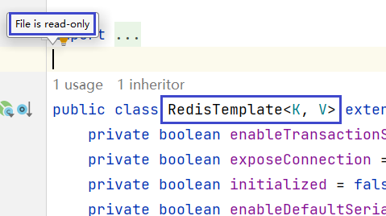

**核心问题**：如何把第三方类的对象纳入 Spring IoC 容器管理？

**解决方案**：使用「配置类 + `@Bean`注解」，手动编写对象创建逻辑，将第三方类的对象交给 IoC 容器管理。

#### 9.1.2 配置类核心说明

配置类是 Spring 管理第三方类对象的 “核心载体”，是一个被`@Configuration`注解标记的普通类，核心特性：

1. `@Configuration`注解基于`@Component`实现，因此配置类本身也会被 Spring 扫描并纳入 IoC 容器；
2. 配置类的核心作用是**集中编写 Bean 的创建逻辑**（尤其是第三方类），替代传统的 XML 配置文件；
3. 配置类中通过`@Bean`注解标记方法，方法返回值会被 Spring 封装为 Bean，存入 IoC 容器。

```java
/**
 * 配置类：集中管理第三方类的Bean创建逻辑
 * @Configuration：标识为Spring配置类，替代XML配置文件
 * 核心：配置类本身会被纳入IoC容器，内部@Bean方法的返回值也会成为IoC容器中的Bean
 */
@Configuration
public class Demo15Config {
}
```

#### 9.1.3 实践说明（管理 Druid+QueryRunner）

##### ① 功能目标

通过 Spring IoC 容器创建**Druid 数据源对象**（第三方数据库连接池）和**QueryRunner 对象**（Apache DBUtils 的查询工具），并通过 QueryRunner 操作 MySQL 数据库，核心要求：

- Druid 数据源的连接参数（账号、密码、URL）从配置文件读取；
- QueryRunner 依赖 Druid 数据源，必须使用 IoC 容器中已有的数据源对象（避免重复创建）；
- 所有对象由 IoC 容器统一管理，而非手动`new`创建。

##### ② 引入核心依赖

以下依赖版本与 Spring Boot 3.0.5 适配，直接引入即可：

```xml
<!-- Druid连接池：第三方数据源，替代Spring默认的HikariCP -->
<dependency>
    <groupId>com.alibaba</groupId>
    <artifactId>druid</artifactId>
    <version>1.2.21</version>
</dependency>

<!-- Apache DBUtils：简化JDBC操作，提供QueryRunner工具类 -->
<dependency>
    <groupId>commons-dbutils</groupId>
    <artifactId>commons-dbutils</artifactId>
    <version>1.8.0</version>
</dependency>

<!-- MySQL驱动：实现Java与MySQL的通信 -->
<dependency>
    <groupId>mysql</groupId>
    <artifactId>mysql-connector-java</artifactId>
    <version>8.0.30</version>
    <scope>runtime</scope>
</dependency>
```

##### ③ 创建 jdbc.properties 配置文件

将数据库连接参数抽离到配置文件（`resources/config/jdbc.properties`），便于维护和环境切换：

```properties
# 数据库连接参数（自定义前缀atguigu，避免与Spring内置属性冲突）
atguigu.username=atguigu
atguigu.password=atguigu
atguigu.url=jdbc:mysql://192.168.47.100/delivery_system?characterEncoding=utf8mb4&serverTimezone=Asia/Shanghai
atguigu.driver=com.mysql.cj.jdbc.Driver
```

##### ④ 配置类中加载配置文件 & 读取参数

通过`@PropertySource`加载外部配置文件，`@Value`注解读取配置项并注入到配置类的属性中：

```java
@Configuration // 声明为Spring配置类
@PropertySource("classpath:config/jdbc.properties") // 加载外部配置文件（classpath=resources目录）
public class Demo15Config {

    // @Value：从配置文件中读取指定key的值，注入到当前属性
    @Value("${atguigu.username}")
    private String userName; // 数据库账号

    @Value("${atguigu.password}")
    private String password; // 数据库密码

    @Value("${atguigu.url}")
    private String url; // 数据库连接URL

    @Value("${atguigu.driver}")
    private String driverClassName; // MySQL驱动类名

}
```

> 关键说明：
>
> - `@PropertySource`的路径格式：`classpath:xxx/xxx.properties`，其中`classpath`指向`resources`目录；
> - `@Value("${key}")`中的`key`必须与配置文件中的 key 完全一致（包括前缀`atguigu.`）；
> - 若配置文件在`resources`根目录，路径可简化为`@PropertySource("classpath:jdbc.properties")`。

##### ⑤ 使用 @Bean 注解管理 Druid 数据源

`@Bean`注解是配置类的核心，作用是**将方法的返回值封装为 Bean，存入 IoC 容器**，核心规则如下：

| 规则       | 说明                                                         |
| ---------- | ------------------------------------------------------------ |
| Bean 的 ID | 默认使用方法名作为 ID；如需自定义，通过`@Bean("自定义ID")`指定 |
| 作用域     | 默认单例（`singleton`），IoC 容器中仅创建 1 个对象；如需多实例，添加`@Scope("prototype")` |
| 生命周期   | 可通过`@PostConstruct`（初始化）、`@PreDestroy`（销毁）注解扩展 |

```java
@Configuration
@PropertySource("classpath:config/jdbc.properties")
public class Demo15Config {

    // 省略配置参数注入的属性...

    /**
     * 创建Druid数据源Bean，纳入IoC容器管理
     * @Bean("myDruidDataSource")：自定义Bean的ID为myDruidDataSource（默认是方法名getDruidDataSource）
     * @Scope("prototype")：设置为多实例（默认单例，开发中极少用多实例）
     * @return DruidDataSource对象（IoC容器会缓存该对象）
     */
    @Bean("myDruidDataSource")
    // @Scope("prototype") // 如需多实例则打开注释，默认单例无需配置
    public DataSource getDruidDataSource() {
        // 手动创建Druid数据源对象（第三方类，无法加@Component注解）
        DruidDataSource druidDataSource = new DruidDataSource();
        // 设置数据库连接参数（从配置文件注入的属性）
        druidDataSource.setUsername(userName);
        druidDataSource.setPassword(password);
        druidDataSource.setUrl(url);
        druidDataSource.setDriverClassName(driverClassName);
        // 返回对象：Spring会自动将该对象存入IoC容器
        return druidDataSource;
    }
}
```

> 核心重点：
>
> - 单例特性：即使多次调用`getDruidDataSource()`方法，IoC 容器也只会创建 1 个 DruidDataSource 对象（第二次调用直接返回缓存的对象）；
> - 单例的优势：数据源是重量级对象，单例可减少资源消耗，开发中 99% 的 Bean 都用单例。

##### ⑥ 使用 @Bean 注解管理 QueryRunner（依赖 Druid 数据源）

QueryRunner 的创建依赖 DataSource 对象，**必须使用 IoC 容器中已有的 Druid 数据源**（避免重复创建），有两种优雅的依赖注入方式：

###### 方式一：方法参数自动注入（推荐）

Spring 会自动从 IoC 容器中查找`DataSource`类型的 Bean，注入到方法参数中，无需手动调用方法：

```java
/**
 * 创建QueryRunnerBean，依赖IoC容器中的DataSource
 * 核心：方法参数为DataSource时，Spring自动注入IoC容器中对应的Bean（按类型匹配）
 */
@Bean // 默认Bean ID为getQueryRunner
public QueryRunner getQueryRunner(DataSource dataSource) {
    // 传入IoC容器中的Druid数据源创建QueryRunner
    return new QueryRunner(dataSource);
}
```

###### 方式二：调用配置类中的 @Bean 方法（兼容写法）

配置类中调用其他`@Bean`方法时，Spring 会直接返回 IoC 容器中的 Bean（而非重新执行方法），保证对象唯一：

```java
@Bean
public QueryRunner getQueryRunner() {
    // 调用getDruidDataSource()：实际返回IoC容器中的Druid数据源，而非新创建
    DataSource dataSource = getDruidDataSource();
    return new QueryRunner(dataSource);
}
```

> 推荐方式一：参数注入更符合 “依赖注入” 思想，代码更简洁，且便于后续替换数据源实现（如 HikariCP）。

##### ⑦ 测试：从 IoC 容器获取 Bean 并操作数据库

通过 Spring IoC 容器获取 QueryRunner Bean，调用其方法操作数据库，验证配置类的有效性：

```java
public class Demo15Test {
    public static void main(String[] args) throws Exception {
        // 1. 创建Spring IoC容器，加载配置类（替代XML配置）
        AnnotationConfigApplicationContext ioc = new AnnotationConfigApplicationContext(Demo15Config.class);

        // 2. 从IoC容器获取QueryRunner Bean（按ID/类型获取）
        // 方式1：按Bean ID获取（ID为方法名getQueryRunner）
        QueryRunner queryRunner = ioc.getBean("getQueryRunner", QueryRunner.class);

        // 方式2：按类型获取（容器中只有1个QueryRunner Bean时可用）
        // QueryRunner queryRunner = ioc.getBean(QueryRunner.class);

        // 3. 调用QueryRunner操作数据库（插入数据）
        String sql = """
                INSERT INTO sys_user(username, `password`, nickname)
                VALUES("good333", "123456", "feifei");
                """;
        int affectedRows = queryRunner.update(sql); // 执行插入，返回受影响行数
        System.out.println("插入数据成功，受影响行数：" + affectedRows); // 成功返回1

        // 4. 关闭IoC容器（可选，测试用）
        ioc.close();
    }
}
```

**测试结果**：

```plaintext
插入数据成功，受影响行数：1
```

> 关键验证：数据库中`sys_user`表会新增一条`username=good333`的记录，说明 Druid 数据源和 QueryRunner 都已被 IoC 容器正确管理。

##### ⑧ 补充说明：自定义类是否需要用 @Bean？

我们自己编写的类（如 UserService、UserDAO）**完全可以用`@Component`/`@Service`注解**，无需在配置类中写`@Bean`方法 ——`@Bean`的核心场景是管理**第三方类**（无法修改源码加注解）。

比如自定义的`UserService`：

```java
// 推荐方式：直接加@Service，Spring自动扫描创建Bean
@Service
public class UserService {
    // ...
}

// 不推荐：配置类中用@Bean创建（多此一举）
@Configuration
public class Demo15Config {
    @Bean
    public UserService userService() {
        return new UserService();
    }
}
```

核心总结:

1. 配置类核心作用：管理**第三方类**的 Bean 创建（无法加 @Component 注解的类），替代 XML 配置；
2. @Bean关键规则：
   - 默认单例，方法名 = Bean ID，自定义 ID 用`@Bean("xxx")`；
   - 方法参数可自动注入 IoC 容器中的 Bean（推荐依赖注入方式）；
3. 配置文件加载：`@PropertySource`指定配置文件路径，`@Value`读取配置项；
4. 场景区分：自定义类用`@Component`系列注解，第三方类用`@Configuration + @Bean`。

### 9.2 MyBatis-Plus分页插件

分页查询是一个很常见的需求，故 MyBatis-Plus 提供了一个分页插件，使用它可以十分方便地完成分页查询。下面介绍 MyBatis-Plus 分页插件的用法，详细信息可参考[官方文档](https://baomidou.com/pages/97710a/)。

#### 9.2.1 分页插件说明和配置

##### 9.2.1.1 配置分页插件

创建分页插件配置类，指定数据库类型为 MySQL（适配 t_tiger 表所在数据库）：

```java
@Configuration
public class MPConfiguration {

    @Bean
    public MybatisPlusInterceptor mybatisPlusInterceptor() {
        MybatisPlusInterceptor interceptor = new MybatisPlusInterceptor();
        // 核心：添加分页插件，指定数据库类型为MySQL（适配t_tiger表）
        interceptor.addInnerInterceptor(new PaginationInnerInterceptor(DbType.MYSQL));
        return interceptor;
    }
}
```

> 说明：`PaginationInnerInterceptor` 是分页核心拦截器，`DbType.MYSQL` 用于适配 MySQL 数据库的分页语法（LIMIT），若使用其他数据库（如 Oracle）需对应修改。

##### 9.2.1.2 分页插件使用说明

###### ①  构造分页对象

分页对象 `IPage`（实现类 `Page`）封装了分页的所有核心信息，既作为查询入参（指定页码 / 页大小），也作为返回结果（包含总条数 / 数据列表）。

| 属性名  | 类型 | 默认值    | 描述（适配 t_tiger 表）      |
| ------- | ---- | --------- | ---------------------------- |
| records | List | emptyList | t_tiger 表的当前页数据列表   |
| total   | Long | 0         | t_tiger 表符合条件的总记录数 |
| size    | Long | 10        | 每页显示条数（默认 10 条）   |
| current | Long | 1         | 当前页码（默认第 1 页）      |

**构造方式**：只需指定 `current`（当前页）和 `size`（页大小）即可：

```java
// 查询t_tiger表：第2页，每页3条数据
IPage<Tiger> page = new Page<>(2, 3);
```

###### ② 分页查询方法（适配 t_tiger 表）

MyBatis-Plus 的 `BaseMapper` 和 `ServiceImpl` 均内置分页方法，无需自定义 SQL：

| 层级        | 方法签名                                                     | 说明                        |
| ----------- | ------------------------------------------------------------ | --------------------------- |
| BaseMapper  | `IPage<Tiger> selectPage(IPage<Tiger> page, Wrapper<Tiger> queryWrapper)` | Mapper 层分页，支持条件查询 |
| ServiceImpl | `IPage<Tiger> page(IPage<Tiger> page)`                       | Service 层无条件分页        |
| ServiceImpl | `IPage<Tiger> page(IPage<Tiger> page, Wrapper<Tiger> queryWrapper)` | Service 层条件分页          |

###### ③ 自定义 SQL 分页（适配 t_tiger 表）

若需自定义复杂 SQL（如多表联查），只需在 Mapper 接口传入`IPage`参数，XML 中无需写分页逻辑：

- Mapper 接口

  ```java
  // 自定义t_tiger表分页查询
  IPage<Tiger> selectTigerPage(IPage<?> page);
  ```

- Mapper.xml：

  ```xml
  <!-- 只需写基础查询逻辑，分页由插件自动拼接LIMIT -->
  <select id="selectTigerPage" resultType="com.atguigu.hellomp.entity.Tiger">
      select tiger_id, tiger_name, tiger_age, tiger_salary from t_tiger
  </select>
  ```

#### 9.2.2 案例实操

创建 `PageTest` 测试类，演示 t_tiger 表的三种分页方式：

##### 9.2.2.1 测试类完整代码

```java
@SpringBootTest
public class PageTest {

    @Autowired
    private TigerService tigerService; // 注入通用Service

    @Autowired
    private TigerMapper tigerMapper;   // 注入通用Mapper

    // 1. 通用Service无条件分页查询t_tiger表
    @Test
    public void testPageService() {
        // 构造分页对象：第2页，每页3条
        Page<Tiger> page = new Page<>(2, 3);
        // 执行分页查询
        Page<Tiger> tigerPage = tigerService.page(page);

        // 打印分页结果
        System.out.println("总记录数：" + tigerPage.getTotal());
        System.out.println("总页数：" + tigerPage.getPages());
        System.out.println("当前页数据：");
        tigerPage.getRecords().forEach(System.out::println);
    }

    // 2. 通用Mapper条件分页查询t_tiger表（薪资>200的老虎）
    @Test
    public void testPageMapper() {
        // 构造分页对象：第1页，每页2条
        IPage<Tiger> page = new Page<>(1, 2);
        // 构造查询条件：tiger_salary > 200
        QueryWrapper<Tiger> wrapper = new QueryWrapper<>();
        wrapper.gt("tiger_salary", 200);

        // 执行条件分页查询
        IPage<Tiger> tigerPage = tigerMapper.selectPage(page, wrapper);

        // 打印结果
        System.out.println("符合条件的总记录数：" + tigerPage.getTotal());
        System.out.println("当前页数据：");
        tigerPage.getRecords().forEach(System.out::println);
    }

    // 3. 自定义SQL分页查询t_tiger表
    @Test
    public void testCustomMapper() {
        // 构造分页对象：第1页，每页4条
        IPage<Tiger> page = new Page<>(1, 4);
        // 执行自定义SQL分页
        IPage<Tiger> tigerPage = tigerMapper.selectTigerPage(page);

        // 打印结果
        System.out.println("总记录数：" + tigerPage.getTotal());
        System.out.println("当前页数据：");
        tigerPage.getRecords().forEach(System.out::println);
    }
}
```

##### 9.2.2.2 补充自定义分页的 Mapper 配置

###### ① TigerMapper 接口添加方法

```java
package com.atguigu.hellomp.mapper;

import com.baomidou.mybatisplus.core.mapper.BaseMapper;
import com.baomidou.mybatisplus.core.metadata.IPage;
import com.atguigu.hellomp.entity.Tiger;

public interface TigerMapper extends BaseMapper<Tiger> {
    // 自定义t_tiger表分页查询方法
    IPage<Tiger> selectTigerPage(IPage<?> page);
}
```

###### ② 创建 TigerMapper.xml 文件

路径：`resources/mapper/TigerMapper.xml`（MyBatis-Plus 默认扫描`classpath*:/mapper/**/*.xml`

```xml
<?xml version="1.0" encoding="UTF-8"?>
<!DOCTYPE mapper
        PUBLIC "-//mybatis.org//DTD Mapper 3.0//EN"
        "http://mybatis.org/dtd/mybatis-3-mapper.dtd">
<!-- namespace需与Mapper接口全类名一致 -->
<mapper namespace="com.atguigu.hellomp.mapper.TigerMapper">
    <!-- 自定义分页查询：只需写基础查询逻辑，分页由插件自动处理 -->
    <select id="selectTigerPage" resultType="com.atguigu.hellomp.entity.Tiger">
        select tiger_id, tiger_name, tiger_age, tiger_salary
        from t_tiger
    </select>
</mapper>
```

关键配置说明（适配 t_tiger 表）

若需修改 Mapper.xml 文件路径，可在`application.yml`中配置

```yaml
mybatis-plus:
  # 自定义Mapper.xml扫描路径（适配t_tiger表的TigerMapper.xml）
  mapper-locations: classpath*:/mapper/**/*.xml
  # 可选：配置实体类别名包，简化XML中的resultType
  type-aliases-package: com.atguigu.hellomp.entity
```

核心注意事项（适配 t_tiger 表）

1. **分页插件必配置**：未配置`MybatisPlusInterceptor`会导致分页方法返回空数据，仅查询全表；
2. **实体字段匹配**：Tiger 实体的属性名需与 t_tiger 表字段名对应（如`tigerId`对应`tiger_id`），否则分页结果的`records`会字段为空；
3. **自定义 SQL 注意事项**：XML 中只需写`SELECT`查询逻辑，无需加`LIMIT`，分页插件会自动拼接；
4. 分页结果解读：
   - `getTotal()`：t_tiger 表符合条件的总记录数（非当前页条数）；
   - `getPages()`：总页数（总记录数 / 页大小，向上取整）；
   - `getRecords()`：当前页的 t_tiger 表数据列表。

### 9.3 MyBatisX 插件

MyBatis-Plus 提供了一个 IDEA 插件——`MyBatisX`，使用它可根据数据库快速生成`Entity`、`Mapper`、`Mapper.xml`、`Service`、`ServiceImpl`等代码，使用户更专注于业务。

下面演示具体用法

1. **安装插件**

   在 IDEA 插件市场搜索`MyBatisX`，进行在线安装

   

2. **配置数据库连接**

   在 IDEA 中配置数据库连接

   

3. **生成代码**

   首先将之前编写的`User`、`UserMapper`、`UserService`、`UserServiceImpl`全部删除，然后按照下图指示使用插件生成代码

   

   配置实体类相关信息

   

   配置代码模版信息

   

   点击Finish然后查看生成的代码。
