# 05 Web&框架：Spring & Spring Boot 核心进阶

## 1. Spring 进阶：AOP & 声明式事务

### 1.1 AOP 面向切面编程思维

#### 1.1.1 AOP 主要解决问题

AOP（ Aspect Oriented Programming 面向切面编程）是对 OOP（ Object Oriented Programming 面向对象编程）的补充，核心解决**业务逻辑与非业务逻辑耦合、重复代码冗余**的问题，以下结合开发场景说明：

**核心问题 1：**非业务逻辑散落在业务代码中，耦合严重

**场景**：用户管理模块（UserService）的`login`/`saveUser`/`updateUserById`等业务方法，都需要加「权限校验」「事务控制」逻辑。

- 无 AOP 时：需在每个业务方法内手动编写日志、权限、事务代码，业务方法既包含核心业务（如登录校验、新增用户），又混杂非业务逻辑；
- 有 AOP 时：将日志、权限、事务等 “横切逻辑” 抽离成独立的「切面」，无需修改业务方法代码，自动织入到目标方法中。

**核心问题 2：重复代码冗余，维护成本高**

**场景**：10 个业务 Service 的方法都需要打印 “方法入参 / 出参日志”。

- 无 AOP 时：需在 10 个 Service 的所有方法中重复编写日志代码，后续修改日志格式（如新增打印时间），需逐个修改所有方法；
- 有 AOP 时：仅需在切面中编写一次日志逻辑，通过 “切入点” 指定要增强的方法，所有目标方法自动复用该逻辑，修改仅需改切面。

**核心价值总结**

| 无 AOP 的问题                | AOP 的解决方案                          |
| ---------------------------- | --------------------------------------- |
| 业务与非业务逻辑耦合         | 抽离非业务逻辑为 “切面”，与业务代码解耦 |
| 重复代码冗余                 | 切面逻辑一次编写，多处复用              |
| 非业务逻辑修改需改动业务代码 | 仅修改切面，不影响核心业务代码          |

一句话总结：**AOP 可以把业务代码里重复的非核心功能（如日志、事务）抽出来，在不改动业务代码的前提下动态加到目标方法里。**

#### 1.1.2 AOP 底层依赖的技术

##### 1.1.2.1 代理模式

###### ① 介绍

代理模式，是二十三种设计模式中的一种，属于结构型模式。它的作用就是通过提供一个代理类，让我们在调用目标方法的时候，不再是直接对目标方法进行调用，而是通过代理类<span style="color:blue;font-weight:bold;">间接</span>调用。让不属于目标方法核心逻辑的代码从目标方法中剥离出来——<span style="color:blue;font-weight:bold;">解耦</span>。调用目标方法时先调用代理对象的方法，减少对目标方法的调用和打扰，同时让附加功能能够集中在一起也有利于统一维护。


使用代理后：


###### ② 生活中的代理

- 广告商找大明星拍广告需要经过经纪人
- 合作伙伴找大老板谈合作要约见面时间需要经过秘书
- 房产中介是买卖双方的代理
- 太监是大臣和皇上之间的代理

###### ③ 相关术语

- 代理：将非核心逻辑剥离出来以后，封装这些非核心逻辑的类、对象、方法。
- 目标：被代理“套用”了非核心逻辑代码的类、对象、方法，负责封装核心业务。

##### 1.1.2.2 静态代理

生活小案例： 你有一套房子要出租，为了省却找租客、核验身份、签合同、收房租这些繁琐事，**你专门招了一个固定的中介，作为你这套房子的专属代理**。所有租房相关的对接工作，都由这个中介全权帮你处理，他只服务你这一套房源的出租业务。

```java
// ========== 1. 业务接口（规范核心方法） ==========
interface UserService {
    // 核心业务方法：登录校验
    boolean login(String username, String password);
}

// ========== 2. 真实实现类（目标类：只做核心业务） ==========
public class UserServiceImpl implements UserService {
    // 仅实现核心登录逻辑，无任何非业务代码
    @Override
    public boolean login(String username, String password) {
         System.out.println("UserServiceImpl - login username=" + username + " password=" + password);
        // 核心业务：判断账号密码是否正确
        return "admin".equals(username) && "123456".equals(password);
    }
}

// ========== 3. 静态代理类（替目标类执行，加增强逻辑） ==========
public class UserServiceStaticProxy implements UserService {
    // 持有目标对象（代理的核心：关联真实业务类）
    private UserService target = new UserServiceImpl();

    // 代理目标方法，包裹增强逻辑
    @Override
    public boolean login(String username, String password) {
        // 增强逻辑1：方法执行前（如打印入参日志）
        System.out.println("Before login: username = " + username);

        // 调用真实目标类的核心方法
        boolean result = target.login(username, password);

        // 增强逻辑2：方法执行后（如打印结果日志）
        System.out.println("After login: result = " + result);

        return result;
    }
}

// ========== 4. 测试调用（仅接触代理类，不直接调目标类） ==========
public class TestStaticProxy {
    public static void main(String[] args) {
        // 创建代理对象（而非直接new UserServiceImpl）
        UserService proxy = new UserServiceStaticProxy();

        // 调用代理方法（自动触发增强+核心业务）
        proxy.login("admin", "123456");
    }
}
```

静态代理确实实现了解耦，但是由于代码都<span style="color:blue;font-weight:bold;">写死了</span>，完全不具备任何的灵活性。就拿日志功能来说，将来其他地方也需要附加日志，那还得再声明更多个静态代理类，那就产生了大量重复的代码，日志功能还是分散的，没有统一管理。

提出进一步的需求：将日志功能集中到一个代理类中，将来有任何日志需求，都通过这一个代理类来实现。这就需要使用动态代理技术了。

##### 1.1.2.3 动态代理

生活小案例： 你有房子要出租，没有特意找某个固定的中介，而是直接联系了**我爱我家、链家这类大型房产平台**。你不用管具体是谁来帮你办事，平台会根据你的房源位置、租客需求、当前中介的忙碌程度，**动态为你匹配最合适的中介人员**处理租房事宜；等下次你有另一套房子要出租，平台可能会根据当时的情况，给你分配另一位更合适的中介。你只需要对接平台，具体的代理人员由平台按需生成、动态分配 —— 这就是动态代理。

动态代理是 AOP（面向切面编程）的核心底层技术，与静态代理的核心区别是：**无需手动编写代理类，程序运行时由 JVM 自动生成代理类**，一个通用的增强逻辑可适配多个目标类，是 Spring AOP 的默认实现方式。

动态代理主要分为两种类型：

1. **JDK 动态代理**：基于接口实现，要求目标类必须实现至少一个接口；
2. **CGLIB 动态代理**：基于继承实现，无需目标类实现接口，直接继承目标类生成代理对象。

###### ① JDK 动态代理（基于接口）

核心特点

- 依赖接口：目标类必须实现接口，代理类与目标类实现相同接口；
- 核心 API：`java.lang.reflect.Proxy`（生成代理对象）、`InvocationHandler`（定义增强逻辑）；
- 适用场景：目标类实现了业务接口（开发中最常见，如 Service 接口）。

极简伪代码：

```java
// ========== 1. 业务接口（JDK动态代理必须依赖接口） ==========
interface UserService {
    boolean login(String username, String password);
}

// ========== 2. 目标类（实现接口，仅做核心业务） ==========
public class UserServiceImpl implements UserService {
    @Override
    public boolean login(String username, String password) {
        // 核心业务：登录校验
        return "admin".equals(username) && "123456".equals(password);
    }
}

// ========== 3. JDK动态代理核心：通用增强逻辑 + 生成代理 ==========
public class JdkDynamicProxyDemo {
    public static void main(String[] args) {
        // 步骤1：创建目标对象
        UserService target = new UserServiceImpl();

        // 步骤2：生成动态代理对象（运行时自动创建代理类，无需手动写）
        UserService proxy = (UserService) Proxy.newProxyInstance(
                target.getClass().getClassLoader(), // 类加载器
                target.getClass().getInterfaces(),  // 目标类实现的接口（核心）
                (proxyObj, method, argsArr) -> {    // 增强逻辑（InvocationHandler）
                    // 增强逻辑1：方法执行前（如打印日志）
                    System.out.println("Before " + method.getName() + ": " + argsArr[0]);

                    // 调用目标类的核心方法
                    Object result = method.invoke(target, argsArr);

                    // 增强逻辑2：方法执行后（如打印结果）
                    System.out.println("After " + method.getName() + ": " + result);

                    return result;
                }
        );

        // 步骤3：调用代理方法（自动触发增强+核心业务）
        proxy.login("admin", "123456");
    }
}
```

###### ② CGLIB 动态代理（基于继承）

核心特点

- 无需接口：直接继承目标类生成代理，目标类可无任何接口；
- 核心 API：`Enhancer`（生成代理对象）、`MethodInterceptor`（定义增强逻辑）；
- 适用场景：目标类未实现任何接口（如自定义工具类）。

导包：

```xml
        <dependency>
            <groupId>cglib</groupId>   <!-- 核心代理库 -->
            <artifactId>cglib</artifactId>
            <version>3.3.0</version>    <!-- 推荐使用最新稳定版 -->
        </dependency>
```

测试代码：

```java
// ========== 1. 目标类（无需实现接口，仅做核心业务） ==========
class UserService {
    public boolean login(String username, String password) {
        // 核心业务：登录校验
        return "admin".equals(username) && "123456".equals(password);
    }
}

// ========== 2. CGLIB动态代理核心：通用增强逻辑 + 生成代理 ==========
import net.sf.cglib.proxy.Enhancer;
import net.sf.cglib.proxy.MethodInterceptor;
public class CglibDynamicProxyDemo {
    public static void main(String[] args) {
        // 步骤1：创建目标对象
        UserService target = new UserService();

        // 步骤2：生成动态代理对象（运行时自动创建代理类，继承目标类）
        UserService proxy = (UserService) Enhancer.create(
                UserService.class,  // 目标类的Class对象（核心：继承目标类）
                (MethodInterceptor) (proxyObj, method, argsArr, methodProxy) -> {
                    // 增强逻辑1：方法执行前（如打印日志）
                    System.out.println("Before " + method.getName() + ": " + argsArr[0]);

                    // 调用目标类的核心方法
                    Object result = methodProxy.invoke(target, argsArr);

                    // 增强逻辑2：方法执行后（如打印结果）
                    System.out.println("After " + method.getName() + ": " + result);

                    return result;
                }
        );

        // 步骤3：调用代理方法（自动触发增强+核心业务）
        proxy.login("admin", "123456");
    }
}
```

```
Unable to make protected final java.lang.Class java.lang.ClassLoader.defineClass(...) accessible:
module java.base does not "opens java.lang" to unnamed module
关键机制：从 Java 9 开始引入的模块系统（JPMS）对反射做了严格限制。
具体表现：CGLIB 尝试通过反射调用 ClassLoader.defineClass() 方法来动态生成类，但该方法属于 java.lang 包且未被暴露给“未命名模块”（即你的普通 Java 项目）。
添加 JVM 启动参数（最直接有效）: --add-opens java.base/java.lang=ALL-UNNAMED
```


###### ③ 核心总结

| 特性            | JDK 动态代理              | CGLIB 动态代理               |
| --------------- | ------------------------- | ---------------------------- |
| 依赖条件        | 目标类必须实现接口        | 目标类无需实现接口           |
| 实现方式        | 实现与目标类相同的接口    | 继承目标类                   |
| 核心 API        | Proxy + InvocationHandler | Enhancer + MethodInterceptor |
| Spring AOP 适配 | 目标类有接口时默认使用    | 目标类无接口时自动切换使用   |

#### 1.1.3 AOP 核心概念介绍

##### 1.1.3.1 核心概念

AOP（Aspect Oriented Programming，面向切面编程）是 OOP（Object Oriented Programming，面向对象编程）的**补充与完善**。

OOP 通过封装、继承、多态构建纵向的对象层次结构，专注于实现业务模块的核心功能，但它不擅长处理**横向的公共逻辑**。比如日志记录、权限校验、异常处理这类功能，往往需要嵌入到多个业务对象中，与核心业务无关却重复出现，既造成代码冗余，又提升了模块间的耦合度，不利于复用和维护。

AOP 则恰恰解决这一痛点，它利用**横切技术**，将这些分散在各处的非核心公共逻辑，封装成独立可重用的模块 —— 也就是**切面（Aspect）**。

借助 AOP，我们可以在**不修改原有业务代码**的前提下，将切面逻辑动态 “织入” 到目标业务方法中，以此减少重复代码、降低模块耦合，提升系统的可维护性与扩展性。

##### 1.1.3.2 AOP 涉及核心名词

* 横切关注点

  从每个方法中抽取出来的同一类非核心业务。在同一个项目中，我们可以使用多个横切关注点对相关方法进行多个不同方面的增强。

  这个概念不是语法层面天然存在的，而是根据附加功能的逻辑上的需要：有十个附加功能，就有十个横切关注点

  AOP把软件系统分为两个部分：核心关注点和横切关注点。业务处理的主要流程是核心关注点，与之关系不大的部分是横切关注点。横切关注点的一个特点是，他们经常发生在核心关注点的多处，而各处基本相似，比如权限认证、日志、事务、异常等。AOP的作用在于分离系统中的各种关注点，将核心关注点和横切关注点分离开来。

  

* 通知(增强)

  每一个横切关注点上要做的事情都需要写一个方法来实现，这样的方法就叫通知方法。

  * 前置通知：在被代理的目标方法前执行

  * 返回通知：在被代理的目标方法成功结束后执行（**寿终正寝**）

  * 异常通知：在被代理的目标方法异常结束后执行（**死于非命**）

  * 后置通知：在被代理的目标方法最终结束后执行（**盖棺定论**）

  * 环绕通知：使用try...catch...finally结构围绕整个被代理的目标方法，包括上面四种通知对应的所有位置

    

* 连接点 joinpoint

  这也是一个纯逻辑概念，不是语法定义的。

  指那些被拦截到的点。在 Spring 中，可以被动态代理拦截目标类的方法

  

* 切入点 pointcut
  定位连接点的方式，或者可以理解成被选中的连接点！
  是一个表达式，比如execution(\* com.spring.service.impl.*.*(..))。符合条件的每个方法都是一个具体的连接点。

* 切面 aspect
  切入点和通知的结合。是一个类。
  

* 目标 target
  被代理的目标对象

* 代理 proxy
  向目标对象应用通知之后创建的代理对象

* 织入 weave
  指把通知应用到目标上，生成代理对象的过程。可以在编译期织入，也可以在运行期织入，Spring采用后者。

##### 1.1.3.3 Spring AOP梳理和底层技术组成

1.  AOP一种区别于OOP的编程思维，用来完善和解决OOP的非核心代码冗余和不方便统一维护问题！
2.  代理技术（动态代理|静态代理）是实现AOP思维编程的具体技术，但是自己使用动态代理实现代码比较繁琐！
3.  Spring AOP 框架，基于 AOP 编程思维，封装动态代理技术，简化动态代理技术实现的框架！Spring AOP 内部帮助我们实现动态代理，我们只需写少量的配置，指定生效范围即可，即可完成面向切面思维编程的实现！

注意：AspectJ：早期的 AOP 实现框架，Spring AOP 借用了 AspectJ 中的 AOP 注解。


#### 1.1.4  AOP快速体验

##### ① 加入依赖

在 IoC 测试工程环境的基础上，额外再增加下面依赖：

```xml
<dependency>
    <groupId>org.springframework.boot</groupId>
    <artifactId>spring-boot-starter-aop</artifactId>
</dependency>
```

##### ② 准备被代理的目标资源

接口

```java
public interface Calculator {

    int add(int i, int j);

    int sub(int i, int j);

    int mul(int i, int j);

    int div(int i, int j);
}
```

纯净的实现类

在 Spring 下工作，所有的一切都必须放在 IoC 容器中。现在接口的实现类是 AOP 要代理的目标类，所以它也必须放入 IoC 容器。

```java
@Component
public class CalculatorPureImpl implements Calculator {

    @Override
    public int add(int i, int j) {

        int result = i + j;

        System.out.println("方法内部 result = " + result);

        return result;
    }

    @Override
    public int sub(int i, int j) {

        int result = i - j;

        System.out.println("方法内部 result = " + result);

        return result;
    }

    @Override
    public int mul(int i, int j) {

        int result = i * j;

        System.out.println("方法内部 result = " + result);

        return result;
    }

    @Override
    public int div(int i, int j) {

        int result = i / j;

        System.out.println("方法内部 result = " + result);

        return result;
    }
}
```

##### ③ 创建切面类

```java
// @Aspect表示这个类是一个切面类
@Aspect
// @Component注解保证这个切面类能够放入 IoC 容器
@Component
public class LogAspect {

    // @Before注解：声明当前方法是前置通知方法
    // value属性：指定切入点表达式，由切入点表达式控制当前通知方法要作用在哪一个目标方法上
    @Before(value = "execution(public int com.atguigu.aop.api.Calculator.add(int,int))")
    public void printLogBeforeCore() {
        System.out.println("[AOP前置通知] 方法开始了");
    }

    @AfterReturning(value = "execution(public int com.atguigu.aop.api.Calculator.add(int,int))")
    public void printLogAfterSuccess() {
        System.out.println("[AOP返回通知] 方法成功返回了");
    }

    @AfterThrowing(value = "execution(public int com.atguigu.aop.api.Calculator.add(int,int))")
    public void printLogAfterException() {
        System.out.println("[AOP异常通知] 方法抛异常了");
    }

    @After(value = "execution(public int com.atguigu.aop.api.Calculator.add(int,int))")
    public void printLogFinallyEnd() {
        System.out.println("[AOP后置通知] 方法最终结束了");
    }

}
```

##### ④ 测试

```java
@SpringBootTest
public class AOPTest {

    @Autowired
    private Calculator calculator;

    @Test
    public void testAnnotationAOP() {

        int add = calculator.add(10, 2);
        System.out.println("方法外部 add = " + add);

    }

}
```

打印效果如下：

> [AOP前置通知] 方法开始了
> 方法内部 result = 12
> [AOP返回通知] 方法成功返回了
> [AOP后置通知] 方法最终结束了
> 方法外部 add = 12

**Spring Boot 2.0+ 配置覆盖问题**

从 Spring Boot 2.0 及以上版本开始，`spring.aop.proxy-target-class` 配置项的默认值为 `true`（即默认启用 CGLIB 代理）。即便你在自定义的 `AppConfig` 配置类中，通过 `@EnableAspectJAutoProxy(proxyTargetClass = false)` 显式指定要使用 JDK 代理，若未通过配置文件覆盖自动配置的 AOP 全局属性，注解中的配置依然会被默认值覆盖，最终导致 JDK 代理无法生效。

**解决方法**：在 `application.properties` 配置文件中显式声明该属性（配置文件的优先级高于注解配置），强制启用 JDK 代理：

```properties
# application.properties
spring.aop.proxy-target-class=false # 覆盖默认值true，强制有接口时使用JDK动态代理
```

即便你已经正确配置 `proxyTargetClass = false`，若目标类满足以下任一条件，Spring 仍会兜底使用 CGLIB 代理（而非预期的 JDK 动态代理）：

- 目标类实现的是**非公开的内部接口**（即接口未使用 `public` 修饰）；
- 目标类本身已是代理对象（例如项目存在循环依赖，导致 Spring 提前为该类生成了代理）；
- 目标类包含 `final` 修饰的方法（尽管 JDK 代理本身不影响 final 方法的执行，但 Spring 会优先选择 CGLIB 代理来兜底处理）。

#### 1.1.5 AOP 细节技术详解

##### 1.1.5.1 获取目标细节信息

###### ① JoinPoint接口

org.aspectj.lang.JoinPoint:

- 要点1：JoinPoint 接口通过 getSignature() 方法获取目标方法的签名（方法声明时的完整信息）
- 要点2：通过目标方法签名对象获取方法名
- 要点3：通过 JoinPoint 对象获取外界调用目标方法时传入的实参列表组成的数组

```java
// @Before注解标记前置通知方法
// value属性：切入点表达式，告诉Spring当前通知方法要套用到哪个目标方法上
// 在前置通知方法形参位置声明一个JoinPoint类型的参数，Spring就会将这个对象传入
// 根据JoinPoint对象就可以获取目标方法名称、实际参数列表
@Before(value = "execution(public int com.atguigu.aop.api.Calculator.add(int,int))")
public void printLogBeforeCore(JoinPoint joinPoint) {

    // 1.通过JoinPoint对象获取目标方法签名对象
    // 方法的签名：一个方法的全部声明信息
    Signature signature = joinPoint.getSignature();

    // 2.通过方法的签名对象获取目标方法的详细信息
    String methodName = signature.getName();
    System.out.println("methodName = " + methodName);

    int modifiers = signature.getModifiers();
    System.out.println("modifiers = " + modifiers);

    String declaringTypeName = signature.getDeclaringTypeName();
    System.out.println("declaringTypeName = " + declaringTypeName);

    // 3.通过JoinPoint对象获取外界调用目标方法时传入的实参列表
    Object[] args = joinPoint.getArgs();

    // 4.由于数组直接打印看不到具体数据，所以转换为List集合
    List<Object> argList = Arrays.asList(args);

    System.out.println("[AOP前置通知] " + methodName + "方法开始了，参数列表：" + argList);
}
```

需要获取方法签名、传入的实参等信息时，可以在通知方法声明JoinPoint类型的形参。

###### ② 方法返回值

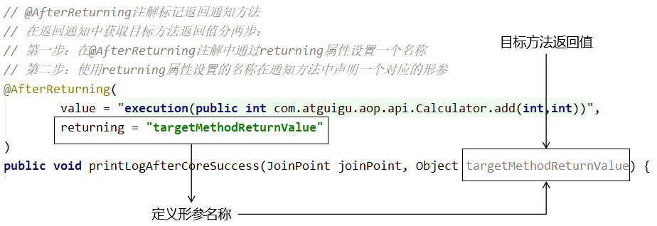


在返回通知中，通过@AfterReturning注解的returning属性获取目标方法的返回值

```java
// @AfterReturning注解标记返回通知方法
// 在返回通知中获取目标方法返回值分两步：
// 第一步：在@AfterReturning注解中通过returning属性设置一个名称
// 第二步：使用returning属性设置的名称在通知方法中声明一个对应的形参
@AfterReturning(
        value = "execution(public int com.atguigu.aop.api.Calculator.add(int,int))",
        returning = "targetMethodReturnValue"
)
public void printLogAfterCoreSuccess(JoinPoint joinPoint, Object targetMethodReturnValue) {

    String methodName = joinPoint.getSignature().getName();

    System.out.println("[AOP返回通知] "+methodName+"方法成功结束了，返回值是：" + targetMethodReturnValue);
}
```


###### ③ 目标方法抛出的异常

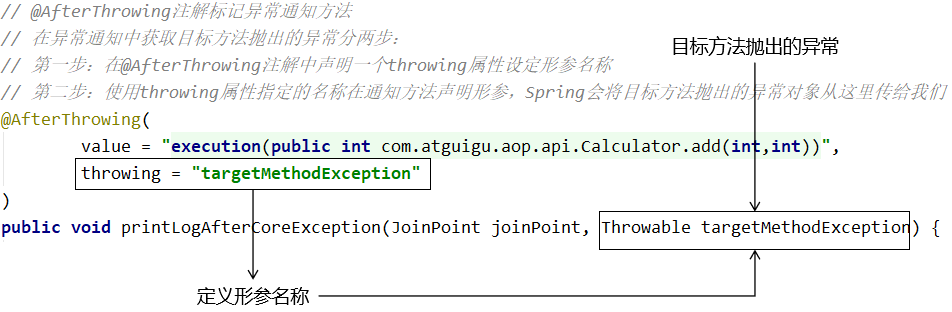

在异常通知中，通过@AfterThrowing注解的throwing属性获取目标方法抛出的异常对象

```java
// @AfterThrowing注解标记异常通知方法
// 在异常通知中获取目标方法抛出的异常分两步：
// 第一步：在@AfterThrowing注解中声明一个throwing属性设定形参名称
// 第二步：使用throwing属性指定的名称在通知方法声明形参，Spring会将目标方法抛出的异常对象从这里传给我们
@AfterThrowing(
        value = "execution(public int com.atguigu.aop.api.Calculator.add(int,int))",
        throwing = "targetMethodException"
)
public void printLogAfterCoreException(JoinPoint joinPoint, Throwable targetMethodException) {

    String methodName = joinPoint.getSignature().getName();

    System.out.println("[AOP异常通知] "+methodName+"方法抛异常了，异常类型是：" + targetMethodException.getClass().getName());
}
```


打印效果局部如下：

> [AOP异常通知] div方法抛异常了，异常类型是：java.lang.ArithmeticException
>
> java.lang.ArithmeticException: / by zero
>
> at com.atguigu.aop.imp.CalculatorPureImpl.div(CalculatorPureImpl.java:42)
> at sun.reflect.NativeMethodAccessorImpl.invoke0(Native Method)
> at sun.reflect.NativeMethodAccessorImpl.invoke(NativeMethodAccessorImpl.java:62)
> at sun.reflect.DelegatingMethodAccessorImpl.invoke(DelegatingMethodAccessorImpl.java:43)
> at java.lang.reflect.Method.invoke(Method.java:498)
> at org.springframework.aop.support.AopUtils.invokeJoinpointUsingReflection(AopUtils.java:344)

##### 1.1.5.2 切入点表达式语法

###### ① 切入点表达式的作用


###### ② 表达式总体结构


第一位：execution( ) 固定开头

第二位：方法访问修饰符

``` java
public private 直接描述对应修饰符即可
```

第三位：方法返回值

``` java
int String void 直接描述返回值类型
注意：
特殊情况 不考虑 访问修饰符和返回值
execution("* *"") 这是错误语法
execution("*") == 你只要考虑返回值 或者 不考虑访问修饰符 相当于全部不考虑了
```

第四位：指定包的地址

``` java
固定的包: com.atguigu.api | service | dao
单层的任意命名: com.atguigu.*  = com.atguigu.api  com.atguigu.dao  * = 任意一层的任意命名
任意层任意命名: com.. = com.atguigu.api.erdaye com.a.a.a.a.a.a.a  ..任意层,任意命名 用在包上!
注意: ..不能用作包开头   public int .. 错误语法  com..
找到任何包下: *..
```

第五位：指定类名称

```
固定名称: UserService
任意类名: *
部分任意: com..service.impl.*Impl
任意包任意类: *..*
```

第六位: 指定方法名称

```
语法和类名一致
任意访问修饰符,任意类的任意方法: * *..*.*
```

第七位：方法参数

```
具体值: (String,int) != (int,String) 没有参数 ()
模糊值: 任意参数 有 或者 没有 (..)  ..任意参数的意识
部分具体和模糊:
第一个参数是字符串的方法 (String..)
最后一个参数是字符串 (..String)
字符串开头,int结尾 (String..int)
包含int类型(..int..)
```

**切点表达式练习**

```java
1.查询某包某类下，访问修饰符是公有，返回值是int的全部方法
2.查询某包下类中第一个参数是String的方法
3.查询全部包下，无参数的方法！
4.查询com包下，以int参数类型结尾的方法
5.查询指定包下，Service开头类的私有返回值int的无参数方法
```

##### 1.1.5.3 获取目标细节信息

###### ① 声明

在一处声明切入点表达式之后，其他有需要的地方引用这个切入点表达式。易于维护，一处修改，处处生效。声明方式如下：

```java
// 切入点表达式重用
@Pointcut("execution(public int com.atguigu.aop.api.Calculator.add(int,int))")
public void declarePointCut() {}
```

###### ② 同一个类内部引用

```java
@Before(value = "declarePointCut()")
public void printLogBeforeCoreOperation(JoinPoint joinPoint) {
```

###### ③ 在不同类中引用

```java
@Around(value = "com.atguigu.spring.aop.aspect.LogAspect.declarePointCut()")
public Object roundAdvice(ProceedingJoinPoint joinPoint) {
```

###### ④ 集中管理

而作为存放切入点表达式的类，可以把整个项目中所有切入点表达式全部集中过来，便于统一管理：

```java
@Component
public class AtguiguPointCut {

    @Pointcut(value = "execution(public int *..Calculator.sub(int,int))")
    public void atguiguGlobalPointCut(){}

    @Pointcut(value = "execution(public int *..Calculator.add(int,int))")
    public void atguiguSecondPointCut(){}

    @Pointcut(value = "execution(* *..*Service.*(..))")
    public void transactionPointCut(){}
}
```

##### 1.1.5.4 环绕通知使用

###### ① 语法要点

- 使用@Around注解声明环绕通知
- 使用ProceedingJoinPoint参数获取目标方法细节
- 通过调用ProceedingJoinPoint的proceed()方法调用目标方法
- 环绕通知方法内部通常使用 try...catch...finally 结构编写代码
- 环绕通知一定要记得把目标方法的返回值返回


###### ② 示例代码

```java
// 使用@Around注解标明环绕通知方法
@Around(value = "com.atguigu.aop.aspect.AtguiguPointCut.transactionPointCut()")
public Object manageTransaction(

        // 通过在通知方法形参位置声明ProceedingJoinPoint类型的形参，
        // Spring会将这个类型的对象传给我们
        ProceedingJoinPoint joinPoint) {

    // 通过ProceedingJoinPoint对象获取外界调用目标方法时传入的实参数组
    Object[] args = joinPoint.getArgs();

    // 通过ProceedingJoinPoint对象获取目标方法的签名对象
    Signature signature = joinPoint.getSignature();

    // 通过签名对象获取目标方法的方法名
    String methodName = signature.getName();

    // 声明变量用来存储目标方法的返回值
    Object targetMethodReturnValue = null;

    try {

        // 在目标方法执行前：开启事务（模拟）
        System.out.println("[AOP 环绕通知] 开启事务，方法名：" + methodName + "，参数列表：" + Arrays.asList(args));

    // 通过ProceedingJoinPoint对象调用目标方法
        // 目标方法的返回值一定要返回给外界调用者
        targetMethodReturnValue = joinPoint.proceed(args);

        // 在目标方法成功返回后：提交事务（模拟）
        System.out.println("[AOP 环绕通知] 提交事务，方法名：" + methodName + "，方法返回值：" + targetMethodReturnValue);

    }catch (Throwable e){

        // 在目标方法抛异常后：回滚事务（模拟）
        System.out.println("[AOP 环绕通知] 回滚事务，方法名：" + methodName + "，异常：" + e.getClass().getName());

    }finally {

        // 在目标方法最终结束后：释放数据库连接
        System.out.println("[AOP 环绕通知] 释放数据库连接，方法名：" + methodName);

    }

    return targetMethodReturnValue;
}
```

##### 1.1.5.5 切面优先级

###### ① 概念

相同目标方法上同时存在多个切面时，切面的优先级控制切面的<span style="color:blue;font-weight:bold;">内外嵌套</span>顺序。

- 优先级高的切面：外面
- 优先级低的切面：里面


使用 @Order 注解可以控制切面的优先级：

- @Order(较小的数)：优先级高
- @Order(较大的数)：优先级低


###### ② 实际意义

实际开发时，如果有多个切面嵌套的情况，要慎重考虑。例如：如果事务切面优先级高，那么在缓存中命中数据的情况下，事务切面的操作都浪费了。


此时应该将缓存切面的优先级提高，在事务操作之前先检查缓存中是否存在目标数据。


### 1.2 案例12： 实现业务方法访问时间统计

#### 1.2.1 统计案例说明

#### 1.2.2  表和实体类准备

表结构：

```sql
-- 方法访问统计表
CREATE TABLE IF NOT EXISTS sys_method_stat (
    id BIGINT NOT NULL AUTO_INCREMENT COMMENT '主键ID',
    method_name VARCHAR(100) NOT NULL COMMENT '方法名（如login、saveUser）',
    visit_count INT NOT NULL DEFAULT 0 COMMENT '访问次数',
    total_time BIGINT NOT NULL DEFAULT 0 COMMENT '总耗时（毫秒）',
    avg_time DECIMAL(10,2) NOT NULL DEFAULT 0.00 COMMENT '平均耗时（毫秒）',
    update_time DATETIME DEFAULT CURRENT_TIMESTAMP ON UPDATE CURRENT_TIMESTAMP COMMENT '更新时间',
    PRIMARY KEY (id),
    UNIQUE KEY uk_method_name (method_name) COMMENT '方法名唯一'
) ENGINE=InnoDB DEFAULT CHARSET=utf8mb4 COMMENT='方法访问统计表';
```

实体类:

```java
/**
 * 方法访问统计实体
 */
@Data
@TableName("sys_method_stat")
public class SysMethodStat {
    @TableId(type = IdType.AUTO)
    private Long id;
    private String methodName; // 方法名
    private Integer visitCount; // 访问次数
    private Long totalTime; // 总耗时（毫秒）
    private BigDecimal avgTime; // 平均耗时（毫秒）
    private Date updateTime; // 更新时间
}
```

#### 1.2.3 mapper&service方法定义

**SysMethodStatMapper.java**

```java
package com.example.aopdemo.mapper;

import com.baomidou.mybatisplus.core.mapper.BaseMapper;
import com.example.aopdemo.entity.SysMethodStat;

/**
 * 方法统计Mapper
 */
@Mapper
public interface SysMethodStatMapper extends BaseMapper<SysMethodStat> {
}
```

**SysMethodStatService.java（接口）**

```java
package com.example.aopdemo.service;
/**
 * 方法统计Service接口
 */
public interface SysMethodStatService extends IService<SysMethodStat> {
    // 根据方法名查询统计数据
    SysMethodStat getByMethodName(String methodName);

    // 更新方法统计数据
    void updateStat(String methodName, long costTime);

    // 查询全部统计列表（按访问次数降序、平均耗时降序）
    List<SysMethodStat> listAllStat();
}
```

**SysMethodStatServiceImpl.java（实现类）**

```java
package com.example.aopdemo.service.impl;
/**
 * 方法统计Service实现
 */
@Service
public class SysMethodStatServiceImpl extends ServiceImpl<SysMethodStatMapper, SysMethodStat> implements SysMethodStatService {

    @Override
    public SysMethodStat getByMethodName(String methodName) {
        LambdaQueryWrapper<SysMethodStat> wrapper = new LambdaQueryWrapper<>();
        wrapper.eq(SysMethodStat::getMethodName, methodName);
        return this.getOne(wrapper);
    }

    @Override
    public void updateStat(String methodName, long costTime) {
        // 查询该方法的统计记录
        SysMethodStat stat = this.getByMethodName(methodName);

        if (stat == null) {
            // 无记录：新增
            stat = new SysMethodStat();
            stat.setMethodName(methodName);
            stat.setVisitCount(1);
            stat.setTotalTime(costTime);
            stat.setAvgTime(new BigDecimal(costTime).setScale(2, RoundingMode.HALF_UP));
            this.save(stat);
        } else {
            // 有记录：更新
            stat.setVisitCount(stat.getVisitCount() + 1);
            stat.setTotalTime(stat.getTotalTime() + costTime);
            // 计算平均耗时
            BigDecimal avg = new BigDecimal(stat.getTotalTime())
                    .divide(new BigDecimal(stat.getVisitCount()), 2, RoundingMode.HALF_UP);
            stat.setAvgTime(avg);
            this.updateById(stat);
        }
    }

    @Override
    public List<SysMethodStat> listAllStat() {
        LambdaQueryWrapper<SysMethodStat> wrapper = new LambdaQueryWrapper<>();
        // 排序：访问次数降序 → 平均耗时降序
        wrapper.orderByDesc(SysMethodStat::getVisitCount)
               .orderByDesc(SysMethodStat::getAvgTime);
        return this.list(wrapper);
    }
}
```

#### 1.2.4 定义AOP切面方法

引入aop依赖。

```xml
<dependency>
    <groupId>org.springframework.boot</groupId>
    <artifactId>spring-boot-starter-aop</artifactId>
</dependency>
```

切面类：

```java
package com.example.aopdemo.aop;
/**
 * UserService方法访问统计切面
 */
@Aspect
@Component
public class UserServiceStatAspect {

    @Autowired
    private SysMethodStatService statService;

    // 定义切入点：切入SysMethodStatService的所有方法。注意包名别写错。目标类包名哦。
    @Pointcut("execution(* com.example.aopdemo.service.UserService.*(..))")
    public void userServicePointcut() {}

    // 环绕通知：统计方法耗时并更新数据库
    @Around("userServicePointcut()")
    public Object statMethodTime(ProceedingJoinPoint joinPoint) throws Throwable {
        // 获取方法名
        String methodName = joinPoint.getSignature().getName();
        // 记录开始时间
        long startTime = System.currentTimeMillis();
        // 执行目标方法
        Object result = joinPoint.proceed();
        // 计算耗时
        long costTime = System.currentTimeMillis() - startTime;
        // 更新统计数据
        statService.updateStat(methodName, costTime);
        // 返回结果
        return result;
    }
}
```

#### 1.2.5 定义Controller层方法

```java
/**
 * 方法统计查询Controller
 */
@RestController
@RequestMapping("/stat")
public class MethodStatController {

    @Autowired
    private SysMethodStatService statService;

    // 根据方法名查询
    @GetMapping("/method")
    public Result getStatByMethod(String methodName) {
        SysMethodStat stat = statService.getByMethodName(methodName);
        if (stat == null) {
            return Result.fail("该方法暂无统计数据");
        }
        return Result.success("查询成功", stat);
    }

    // 查询全部统计列表
    @GetMapping("/all-list")
    public Result getAllMethodStatList() {
        List<SysMethodStat> statList = statService.listAllStat();
        if (statList.isEmpty()) {
            return Result.success("暂无方法访问统计数据", statList);
        }
        return Result.success("查询全部方法统计数据成功，共" + statList.size() + "条", statList);
    }
}
```

#### 1.2.6 定义访问页面

前端页面（stat.html）

放在 `src/main/resources/static/` 目录下：

```html
<!DOCTYPE html>
<html lang="zh-CN">
<head>
    <meta charset="UTF-8">
    <title>UserService方法访问统计</title>
    <style>
        table {width: 80%; margin: 20px auto; border-collapse: collapse;}
        th, td {border: 1px solid #ccc; padding: 10px; text-align: center;}
        th {background-color: #f5f5f5;}
        .title {text-align: center; margin-top: 20px; font-size: 20px; font-weight: bold;}
    </style>
</head>
<body>
    <div class="title">UserService方法访问统计</div>
    <table>
        <thead>
            <tr>
                <th>方法名</th>
                <th>访问次数</th>
                <th>总耗时(毫秒)</th>
                <th>平均耗时(毫秒)</th>
                <th>最后更新时间</th>
            </tr>
        </thead>
        <tbody id="statTable">
            <!-- 数据由JS动态填充 -->
        </tbody>
    </table>

    <script src="https://cdn.bootcdn.net/ajax/libs/jquery/3.7.1/jquery.min.js"></script>
    <script>
        // 页面加载后查询统计数据
        $(function() {
            $.get("/stat/all-list", function(res) {
                if (res.code === 200) {
                    let html = "";
                    res.data.forEach(item => {
                        html += `<tr>
                            <td>${item.methodName}</td>
                            <td>${item.visitCount}</td>
                            <td>${item.totalTime}</td>
                            <td>${item.avgTime}</td>
                            <td>${formatTime(item.updateTime)}</td>
                        </tr>`;
                    });
                    $("#statTable").html(html);
                } else {
                    $("#statTable").html(`<tr><td colspan="5">${res.message}</td></tr>`);
                }
            });
        });

        // 时间格式化
        function formatTime(timeStr) {
            if (!timeStr) return "";
            let date = new Date(timeStr);
            return date.toLocaleString();
        }
    </script>
</body>
</html>
```

### 1.3 声明式事务注解

#### 1.3.1 **事务实现方式核心对比**

- 编程式事务：需开发者**手动编写代码**完成事务的开启、提交、回滚等全流程操作，事务逻辑与业务代码深度耦合；
- 声明式事务：基于 Spring 框架实现，无需编写事务逻辑代码，仅通过**注解 / 配置**的方式 “声明” 事务规则，由框架自动完成事务的创建、提交、回滚等管理，是开发中更主流、更高效的方式。

#### 1.3.2 **声明式事务核心：@Transactional 注解**

`@Transactional` 是 Spring 实现声明式事务的核心注解，通过该注解可快速为方法 / 类赋予事务能力，无需手动处理事务生命周期：

1. 注解作用范围

- 标记在**类上**：该类中所有非私有方法都会自动应用声明式事务规则；
- 标记在**方法上**：仅当前方法应用事务规则（方法级注解优先级高于类级）；

2. 核心事务属性配置（精细化控制事务行为）

| 属性类型                              | 说明                                                         |
| ------------------------------------- | ------------------------------------------------------------ |
| 只读（readOnly）                      | 标记事务为 “只读模式”，适用于仅查询的场景，数据库可针对性优化性能； |
| 超时时间（timeout）                   | 指定事务超时时长（秒），超时后事务会自动回滚，避免长期占用数据库连接； |
| 回滚规则（rollbackFor/noRollbackFor） | 精准控制事务回滚的异常类型：・rollbackFor：指定触发回滚的异常（默认RuntimeException,可以指定全部 Exception）；noRollbackFor：指定不触发回滚的异常； |
| 事务隔离级别（isolation）             | 控制多个并发事务间的数据可见性，可选值包括读未提交、读已提交、可重复读、串行化（默认沿用数据库隔离级别）； |
| 事务传播行为（propagation）           | 定义多个事务方法嵌套调用时的事务传递规则（如 REQUIRED：默认值，有事务则加入，无则新建；REQUIRES_NEW：无论是否有事务，都新建独立事务）； |

#### 1.3.3 传播行为解释

**核心场景**

以下案例均基于「方法 A（外层）调用方法 B（内层）」的嵌套场景，通过伪代码 + 执行结果，直观说明两种传播行为的差异。

##### 案例 1：REQUIRED（默认值）— 共用一个事务

如果外层已有事务，内层方法**加入当前事务**；如果外层无事务，内层方法**新建事务**。最终外层和内层共用同一个事务，要么一起提交，要么一起回滚。

**业务场景：**

创建订单（方法 A）时，同步记录订单日志（方法 B），要求 “订单创建失败则日志也回滚，订单成功则日志也提交”。

**伪代码：**

```java
// 订单服务类
@Service
public class OrderService {
    @Autowired
    private OrderLogService orderLogService;

    // 外层方法A：创建订单（标记REQUIRED事务，默认可省略）
    @Transactional(propagation = Propagation.REQUIRED)
    public void createOrder(String orderNo) {
        try {
            // 1. 核心业务：创建订单（数据库操作）
            System.out.println("执行：创建订单 " + orderNo);
            // 2. 嵌套调用：记录订单日志（方法B）
            orderLogService.recordLog(orderNo);
            // 模拟：订单创建失败（抛出异常）
            throw new RuntimeException("订单创建失败！");
        } catch (Exception e) {
            // 异常触发事务回滚
            throw e;
        }
    }
}

// 订单日志服务类
@Service
public class OrderLogService {
    // 内层方法B：记录订单日志（REQUIRED）
    @Transactional(propagation = Propagation.REQUIRED)
    public void recordLog(String orderNo) {
        // 业务：记录订单操作日志（数据库操作）
        System.out.println("执行：记录订单" + orderNo + "的日志");
    }
}
```

执行结果：

1. 方法 A/B 抛出异常 → 整个事务回滚；
2. 最终效果：**订单未创建，日志也未保存**（因为 A 和 B 共用一个事务，回滚时全部回滚）。

##### 案例 2：REQUIRES_NEW —— 新建独立事务

**核心逻辑：**

无论外层是否有事务，内层方法**强制新建一个独立事务**，内层事务的提交 / 回滚与外层事务无关。

**业务场景：**

创建订单（方法 A）时，记录操作日志（方法 B），要求 “即使订单创建失败，日志也必须保存（用于排查问题）”。

伪代码：

```java
// 订单服务类（同案例1，仅方法B传播行为修改）
@Service
public class OrderService {
    @Autowired
    private OrderLogService orderLogService;

    // 外层方法A：创建订单（REQUIRED）
    @Transactional(propagation = Propagation.REQUIRED)
    public void createOrder(String orderNo) {
        try {
            System.out.println("执行：创建订单 " + orderNo);
            orderLogService.recordLog(orderNo); // 调用方法B
            throw new RuntimeException("订单创建失败！"); // 模拟异常
        } catch (Exception e) {
            throw e;
        }
    }
}

// 订单日志服务类（修改方法B的传播行为为REQUIRES_NEW）
@Service
public class OrderLogService {
    // 内层方法B：记录日志（REQUIRES_NEW → 新建独立事务）
    @Transactional(propagation = Propagation.REQUIRES_NEW)
    public void recordLog(String orderNo) {
        System.out.println("执行：记录订单" + orderNo + "的日志");
        // 该方法的事务会独立提交，不受外层影响
    }
}
```

执行结果

1. 情况 1：内层 B 自己报错

   * B 的独立事务会**立即回滚**（B 的操作全部撤销）；

   * 外层 A 的事务是否回滚，取决于 A 是否捕获 B 的异常：

     ✅ A 捕获了 B 的异常 → A 的事务继续执行（比如 A 跳过 B 的失败，继续其他逻辑）；

     ❌ A 没捕获 B 的异常 → A 的事务也会触发回滚；

2. 情况 2：外层 A 报错

- A 的事务会回滚（A 的操作撤销）；
- 但 B 的独立事务如果已经执行完成并提交 → **B 不会回滚**（比如日志已经保存，不受 A 失败影响）；

## 2. Spring Boot 核心功能进阶

### 2.1 Spring Boot 回顾

#### 2.1.1 Spring Boot 和 Spring Framework 关系

Spring Boot 并非替代 Spring Framework（Spring 核心框架），而是**基于 Spring Framework 开发的 “快速开发脚手架 / 工具集”** —— 它完全依赖 Spring Framework 的核心能力，同时通过 “约定大于配置” 的设计，解决了 Spring Framework 开发中配置繁琐、整合复杂的问题，大幅降低了 Spring 技术栈的使用门槛。

核心定位对比：

| 技术            | 核心定位                   | 核心能力                                                     |
| --------------- | -------------------------- | ------------------------------------------------------------ |
| Spring Framework | 底层核心框架               | 提供 IoC/DI、AOP、事务管理、Bean 生命周期等核心能力，是所有 Spring 生态的基础 |
| Spring Boot      | 快速开发脚手架（上层封装） | 基于 Spring Framework，简化配置、内置容器、自动整合第三方组件，专注 “快速开发应用” |

#### 2.1.2 工程结构

##### ① boot 项目依赖结构

Spring Boot 工程的依赖管理核心是「继承父工程 + 引入场景启动器」，极大简化了依赖版本管理和依赖导入流程：

**继承父工程**：Spring Boot 提供了统一的父工程`spring-boot-starter-parent`，它内置了几乎所有常用依赖的版本号，子工程继承后无需手动指定依赖版本，从根本上避免版本冲突问题。

```xml
<parent>
    <groupId>org.springframework.boot</groupId>
    <artifactId>spring-boot-starter-parent</artifactId>
    <version>3.0.5</version>
    <relativePath/> <!-- 从Maven仓库查找父工程，不依赖本地路径 -->
</parent>
```

> 关键：Spring Boot 的整体版本由父工程的`version`字段决定，所有引入的 starter 都会适配这个核心版本。

**引入场景启动器**：Spring Boot 将不同开发场景（Web、数据库、测试等）的核心依赖打包成「场景启动器（starter）」，只需导入对应 starter，即可一键获得该场景的全部能力：

```xml
<!-- Web开发场景：包含 Spring MVC、内置 Tomcat、JSON 解析等核心依赖 -->
<dependency>
    <groupId>org.springframework.boot</groupId>
    <artifactId>spring-boot-starter-web</artifactId>
</dependency>

<!-- 测试场景：包含JUnit、SpringTest等测试工具，仅测试环境生效 -->
<dependency>
    <groupId>org.springframework.boot</groupId>
    <artifactId>spring-boot-starter-test</artifactId>
    <scope>test</scope>
</dependency>

<!-- JDBC操作场景：包含数据源、JDBC模板等核心依赖 -->
<dependency>
    <groupId>org.springframework.boot</groupId>
    <artifactId>spring-boot-starter-jdbc</artifactId>
</dependency>
```

##### ② 主启动类

主启动类是 Spring Boot 工程的「唯一入口」，负责启动 Spring 容器、加载自动配置逻辑，核心特征如下：

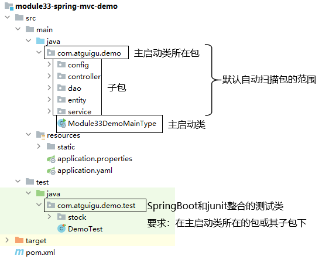

**类结构（核心注解 + 启动方法）**：

```java
/**
 * Spring Boot 主启动类（工程入口）
 * @SpringBootApplication：核心注解，整合3个关键能力：
 * 1. @SpringBootConfiguration：标识为配置类（底层是@Configuration）；
 * 2. @EnableAutoConfiguration：开启自动配置（核心！自动创建场景所需Bean）；
 * 3. @ComponentScan：开启组件扫描（默认扫描主启动类所在包及子包）。
 */
@SpringBootApplication
public class Module33DemoMainType {
    // 启动 Spring Boot 应用：加载 IoC 容器，启动内置服务器（如Tomcat）
    public static void main(String[] args) {
        SpringApplication.run(Module33DemoMainType.class, args);
    }
}
```

> 关键：主启动类建议放在「根包」下（如`com.atguigu.demo`），否则默认包扫描可能无法识别 Controller/Service 等业务组件。

##### ③ resources 目录

`resources`是 Spring Boot 工程的核心资源目录，存放配置文件、静态资源、模板文件等，各子目录有明确分工，遵循 “约定大于配置” 原则：

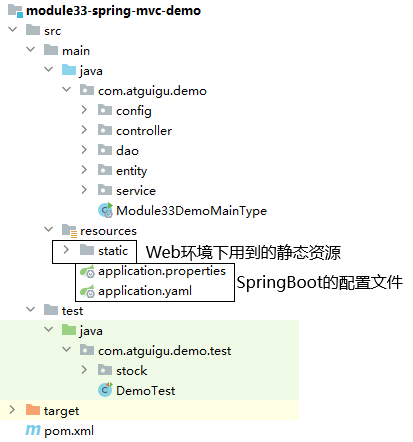

| 目录 / 文件                   | 核心作用                                                     |
| ----------------------------- | ------------------------------------------------------------ |
| `application.properties/yaml` | 全局配置文件（核心！）：配置端口、数据源、日志、自定义参数等所有 Spring Boot 相关配置 |
| `static/`                     | 静态资源目录：存放 CSS、JS、图片、HTML 等静态文件（默认可通过 URL 直接访问） |
| `templates/`                  | 模板文件目录：存放 Thymeleaf、FreeMarker 等动态模板文件（需模板引擎支持） |

> 关键：`application.properties/yaml`是 Spring Boot 优先级最高的配置文件，所有自定义配置都可在此集中管理。

#### 2.1.3 包扫描范围

Spring Boot 通过`@ComponentScan`（由`@SpringBootApplication`自动整合）实现组件扫描，将`@Controller/@Service/@Component`等注解的类纳入 IoC 容器，核心规则如下：

##### ① 默认扫描范围

无需手动配置`@ComponentScan`时，Spring Boot 会默认扫描：

- 主启动类所在的包（如`com.atguigu.demo`）；
- 主启动类所在包的所有后代包（如`com.atguigu.demo.controller`、`com.atguigu.demo.service`）。

> 示例：若主启动类在`com.atguigu.demo`，则`com.atguigu.demo.controller.UserController`会被扫描，而`com.atguigu.utils.Tool`不会被扫描（不在后代包）。

##### ② 定制扫描范围

若业务组件不在默认扫描范围内（如跨包开发），可通过`@ComponentScan`手动指定扫描路径：

```java
@SpringBootApplication
// 手动指定扫描路径：仅扫描controller包（多路径用数组{"包1","包2"}）
@ComponentScan("com.atguigu.demo.controller")
public class Module33DemoMainType {
    public static void main(String[] args) {
        SpringApplication.run(Module33DemoMainType.class, args);
    }
}
```

⚠️ **重要注意事项**：

- 一旦手动指定`@ComponentScan`，Spring Boot 的「默认扫描规则会完全失效」；

- 若需保留默认扫描 + 新增扫描路径，需把默认包也加入@ComponentScan：

  ```java
  // 保留默认包 + 新增utils包扫描
  @ComponentScan({"com.atguigu.demo", "com.atguigu.utils"})
  ```

#### 2.1.4 依赖管理

Spring Boot 的核心优势之一是「自动化依赖版本管理」，彻底解决传统 Spring 开发中 “版本冲突、手动指定版本” 的痛点。

##### ① 核心问题：为什么引入 starter 无需写 version？

以`spring-boot-starter-web`为例，引入时仅需指定 groupId 和 artifactId，无需写 version：

```xml
<dependency>
    <groupId>org.springframework.boot</groupId>
    <artifactId>spring-boot-starter-web</artifactId>
</dependency>
```

这是因为 Spring Boot 的父工程已经帮我们「统一管理了所有依赖的版本」，无需重复指定。

##### ② 依赖管理的底层逻辑

通过 IDEA 的依赖图标可快速识别：该依赖的版本由父工程管理（图标标识 “继承自父工程”）：

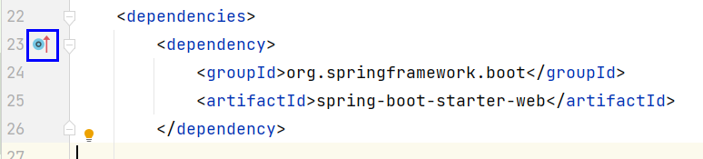

点击该图标可进入`spring-boot-dependencies`的 pom 文件，其继承关系如下：


**核心流程**：

1. 我们的工程继承`spring-boot-starter-parent`；

2. `spring-boot-starter-parent`继承`spring-boot-dependencies`；

3. spring-boot-dependencies的 pom 文件中，统一管理依赖版本：

   ```xml
   <!-- 版本常量定义：集中管理所有依赖版本 -->
   <properties>
     <activemq.version>6.1.8</activemq.version>
     <angus-mail.version>2.0.5</angus-mail.version>
     <spring-web.version>6.0.7</spring-web.version>
     <!-- ... 所有常用依赖的版本都在此定义 -->
   </properties>

   <!-- 依赖版本管理：子工程引入依赖时，无需指定version -->
   <dependencyManagement>
       <dependencies>
         <dependency>
           <groupId>org.springframework</groupId>
           <artifactId>spring-web</artifactId>
           <version>${spring-web.version}</version>
         </dependency>
         <!-- ... 所有依赖的版本都在此关联 -->
       </dependencies>
   </dependencyManagement>
   ```

##### ③ 自定义版本（特殊场景）

若需使用非默认版本的依赖（如升级 MySQL 驱动），只需在自己的 pom.xml 中重新定义版本号即可覆盖父工程的配置：

```xml
<!-- 覆盖父工程的MySQL驱动版本 -->
<properties>
    <mysql.version>8.0.33</mysql.version>
</properties>

<dependency>
    <groupId>mysql</groupId>
    <artifactId>mysql-connector-java</artifactId>
    <!-- 无需写version，自动使用上面定义的8.0.33 -->
</dependency>
```

#### 2.1.5 场景启动器 Starter

Spring Boot 的**场景启动器（Starter）** 是其 “约定大于配置” 核心思想的极致体现，本质是「场景化依赖聚合 + 自动配置模板」—— 它把某一类开发场景（如 Web 开发、数据库操作、Redis 集成）所需的所有核心依赖、默认配置打包成一个独立依赖项，开发者只需引入这一个 starter，就能一键获得该场景的全部能力，无需手动逐个导入依赖、管理版本冲突，也无需编写大量基础配置。

##### ① 核心价值（为什么需要 Starter）

传统 Spring Framework 开发一个 Web 应用的核心痛点：

1. 需手动导入`spring-webmvc`、Tomcat、Jackson（JSON 解析）、参数校验组件等多个依赖；
2. 需手动管理版本（如`spring-webmvc 5.3.20`与`tomcat 9.0.58`是否兼容）；
3. 需手动配置 DispatcherServlet、视图解析器、字符编码过滤器等基础 Bean。

而 Spring Boot Starter 直接解决这些问题：

- **依赖聚合**：一个 starter 包含场景所需的所有核心依赖，一键导入即可；
- **版本兼容**：Starter 由 Spring Boot 官方 / 第三方维护，确保内部依赖版本完全适配；
- **自动配置**：引入 Starter 后，Spring Boot 自动创建该场景的默认配置 Bean，零配置即可用。

##### ② 命名规则（快速识别 Starter 归属）

Starter 命名有明确规范，可快速区分「官方 Starter」和「第三方 Starter」，避免依赖引入错误：

| 类型           | 命名格式                | 典型示例                                                     |
| -------------- | ----------------------- | ------------------------------------------------------------ |
| 官方 Starter   | spring-boot-starter-xxx | spring-boot-starter-web（Web 开发）、spring-boot-starter-jdbc（JDBC 操作）、spring-boot-starter-test（单元测试） |
| 第三方 Starter | xxx-spring-boot-starter | mybatis-spring-boot-starter（MyBatis 整合）、redis-spring-boot-starter（Redis 整合）、druid-spring-boot-starter（Druid 连接池） |

> 避坑：切勿混淆命名格式！比如 MyBatis 的 starter 是`mybatis-spring-boot-starter`，而非`spring-boot-starter-mybatis`（后者不存在）。

##### ③ 核心特性拆解（以`spring-boot-starter-web`为例）

当你在 pom.xml 中引入

```xml
<dependency>
    <groupId>org.springframework.boot</groupId>
    <artifactId>spring-boot-starter-web</artifactId>
</dependency>
```

Spring Boot 会自动完成以下工作，你无需编写任何 XML 或配置类：

1. **依赖自动导入**：
   - 核心：Spring MVC 核心包（`spring-webmvc`）；
   - 容器：内置 Tomcat 服务器（无需手动部署）；
   - 工具：Jackson（JSON 序列化 / 反序列化）、Validation（参数校验）；
   - 基础：Spring 上下文、核心工具类等。
2. **自动配置生效**：
   - 自动创建 DispatcherServlet（Spring MVC 核心控制器），并映射所有请求；
   - 自动配置 Tomcat（默认端口 8080，可通过`server.port`修改）；
   - 自动配置 JSON 消息转换器（支持请求 / 响应自动转 JSON）；
   - 自动配置静态资源路径（`resources/static`、`resources/public`等）；
   - 自动配置字符编码过滤器（默认 UTF-8，解决中文乱码）。

此时你只需编写一个简单的 Controller，直接启动主启动类即可访问：

```java
@RestController
public class HelloController {
    @GetMapping("/hello")
    public String hello() {
        return "Hello Spring Boot!";
    }
}
```

启动工程后访问`http://localhost:8080/hello`，直接返回结果 —— 全程无任何额外配置，这就是 Starter 的核心价值。

#### 2.1.6 核心总结

1. Spring Boot 工程核心结构：父工程（版本管理）+ 主启动类（入口）+ resources（配置 / 资源），遵循 “约定大于配置”；
2. 包扫描默认规则：主启动类所在包及后代包，手动指定后默认规则失效；
3. 依赖管理核心：父工程`spring-boot-dependencies`统一管理版本，引入 starter 无需写 version；
4. Starter 核心价值：场景化依赖聚合 + 自动配置，零配置即可获得对应场景能力，命名规则可区分官方 / 第三方。

### 2.2 YAML格式配置文件

#### 2.2.1 概念

YAML（YAML Ain't Markup Language）是一种人类可读的数据序列化格式，常用于配置文件、数据交换和程序配置。它的设计目标是简洁、直观，并且容易被人类阅读和编写，同时也易于机器解析和生成。

主要特点：

1. **可读性强**：使用缩进和空格来表示结构，避免使用复杂的标记符号。
2. **语法简洁**：采用键值对、列表和嵌套结构，无需使用大量括号或引号。
3. **支持多种数据类型**：包括字符串、数字、布尔值、列表、映射等。
4. **注释支持**：使用`#`符号添加注释，提高配置文件的可读性。
5. **与编程语言无关**：可以被多种编程语言解析和生成。

#### 2.2.2 基本语法

语法规则

> 不用背，因为我们只需要在 IDEA 提示的帮助下，能够正确编写和看懂即可

- 每一行只能使用空格进行缩进
- 缩进相同的配置项属于同一个级别（同一个级别对应同一个对象或数组）
- 键值对格式中：属性名和属性值之间使用冒号，冒号左边不能有空格，右边必须有一个空格
- 数组格式中：使用减号设定数组的每一个值
- **单行注释**：使用`#`符号，从`#`到行末的内容都会被忽略
- **多行注释**：YAML 不直接支持多行注释，需每行前加`#`

示例：

```yaml
# 这是一个YAML配置文件示例
# 键值对（映射）
server:
  host: localhost
  port: 8080
  enabled: true

# 列表（数组）
libraries:
  - spring-boot
  - hibernate
  - junit

# 嵌套结构
database:
  type: mysql
  credentials:
    username: root
    password: secret
  options:
    timeout: 3000
    retries: 3

# 多行字符串
description: |
  这是一个多行描述
  可以包含换行和特殊字符
  如: " ' @ # $ %

# 布尔值、空值和数字
isDebug: false
maxConnections: 100
nullValue: null
```

### 2.3 多环境隔离

#### 2.3.1 配置目标

在开发、测试、生产等不同部署环境下，系统需使用差异化配置（如端口、数据库地址、日志级别等）。通过 Spring Boot 多环境配置能力，可**按需激活对应环境的专属配置文件**，避免手动修改配置参数，提升配置管理效率与部署规范性。

#### 2.3.2 创建多环境配置文件

##### ① 命名规范（核心）

Spring Boot 识别多环境配置文件的关键是**固定命名格式**：`application-{环境标识}.yml`（也支持.properties 格式），其中`{环境标识}`自定义（推荐：dev = 开发、test = 测试、prod = 生产）。

##### ② 编写各环境配置文件

* 开发环境：application-dev.yml

  ```yaml
  # 开发环境配置（本地开发使用）
  server:
    port: 10000  # 开发环境专属端口
  ```

* 测试环境：application-test.yml

  ```yaml
  # 测试环境配置（测试服务器使用）
  server:
    port: 20000  # 测试环境专属端口
  ```

* 生产环境：application-prod.yml

  ```yaml
  # 生产环境配置（正式服务器使用）
  server:
    port: 30000  # 生产环境专属端口
  ```

#### 2.3.3 激活指定环境的配置文件

##### 方式 1：主配置文件激活（推荐，静态配置）

在项目核心配置文件`application.yml`中，通过`spring.profiles.active`指定要激活的环境标识，Spring Boot 会自动加载对应环境的配置文件（全局通用配置可写在此文件）：

```yaml
# 主配置文件（存放所有环境共享的配置）
spring:
  application:
    name: module44-SpringBoot-Usage  # 应用名称（所有环境共用）
  profiles:
    active: dev  # 激活开发环境（可改为test/prod快速切换）多个用 , 隔开即可
```

##### 方式 2：命令行激活（灵活，动态切换）

启动应用时通过命令行参数指定激活的环境，优先级高于主配置文件（适合运维部署时动态调整）：

```bash
# 启动时激活测试环境
java -jar module44-SpringBoot-Usage.jar --spring.profiles.active=test

# 启动时激活生产环境
java -jar module44-SpringBoot-Usage.jar --spring.profiles.active=prod
```

#### 2.3.4 测试验证

验证开发环境（dev）

1. 确保主配置文件中`spring.profiles.active=dev`；
2. 启动 Spring Boot 应用；
3. 访问`http://localhost:10000`，能正常访问说明开发环境配置生效。

核心补充说明

1. 多环境配置文件**仅存放差异化参数**（如端口、数据库地址），全局通用配置（如应用名称）统一放在主配置文件`application.yml`；
2. 配置优先级：命令行激活 > 主配置文件激活，可根据场景灵活选择；
3. 环境标识可自定义（如 dev/pre/prod、dev/test/online），符合团队规范即可。

### 2.4 项目打包&部署

通过 Spring Boot 专属 Maven 插件将应用打包为**可执行 JAR 包**，实现 “一键启动” 式部署，无需依赖外部 Web 容器（如 Tomcat），简化应用交付流程。

**步骤一：引入 Spring Boot Maven 打包插件**

在项目的`pom.xml`中配置`spring-boot-maven-plugin`（核心作用：构建包含依赖、启动逻辑的可执行 JAR 包）：

```xml
<build>
    <plugins>
        <!-- Spring Boot 专属打包插件：生成可直接启动的JAR包 -->
        <plugin>
            <groupId>org.springframework.boot</groupId>
            <artifactId>spring-boot-maven-plugin</artifactId>
        </plugin>
    </plugins>
</build>
```

**步骤二：执行 Maven 打包操作**

- 命令行方式：执行`mvn clean package`（先清理旧包，再打包）；
- IDE 方式（如 IDEA）：打开 Maven 面板，执行`Lifecycle`下的`package`指令。

**步骤三：查看打包结果**

打包完成后，在项目`target`目录下会生成两个文件，核心区别如下：

| 文件扩展名       | 大小示例 | 核心功能                                                     |
| ---------------- | -------- | ------------------------------------------------------------ |
| xxx.jar          | 30474KB  | Spring Boot 高度封装的可执行 JAR 包（包含项目代码 + 所有依赖 + 启动器），可直接启动 |
| xxx.jar.original | 10KB     | 原始 JAR 包（仅包含项目自身代码，无依赖和启动逻辑，无法独立启动） |

**步骤四：启动应用**

将打包后的`xxx.jar`上传至服务器（或本地测试），执行以下命令启动：

```bash
# 基础启动（前台运行，关闭命令行则应用停止）
java -jar 【JAR包路径】/xxx.jar

# 示例：启动当前目录下的module44-SpringBoot-Usage.jar
java -jar module44-SpringBoot-Usage.jar

java -jar -Dprofile=参数 xxx.jar # 运行时可以指定环境或者参数；System.getProperty("profile") 读取
```

### 2.5 项目监控Actuator

#### 2.5.1 可观测性基础概念

**可观测性（Observability）**指通过应用运行时暴露的数据，实时监控、分析和预警系统状态的能力。核心维度包括：

- **指标（Metrics）**：CPU、内存、磁盘I/O、请求耗时等量化数据
- **日志（Logging）**：应用运行时的事件记录
- **链路追踪（Tracing）**：请求在服务间的调用路径和处理步骤

Spring Boot通过**Actuator模块**提供开箱即用的可观测性支持，无需复杂开发即可暴露应用关键信息

#### 2.5.2 快速入门：Actuator集成步骤

**步骤一：添加依赖**

在`pom.xml`中引入Actuator：

```xml
<dependency>
    <groupId>org.springframework.boot</groupId>
    <artifactId>spring-boot-starter-actuator</artifactId>
</dependency>
```

**步骤二： 配置端点暴露**

在`application.properties`中配置暴露所有端点（生产环境建议按需暴露）：

```properties
# 暴露所有Web端点
management.endpoints.web.exposure.include=*
# 自定义端口（默认8080），这里是获取监控数据的端口
management.server.port=8081
# 自定义访问路径（默认/actuator）
management.endpoints.web.base-path=/monitor
```

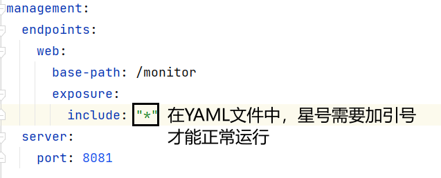


**步骤三：访问监控端点**

启动应用后，访问`http://localhost:8081/monitor`，查看所有可用端点

> 注意：即使主配置文件中设置了ContextPath，查看监控指标时，路径中也不带ContextPath

#### 2.5.3 核心监控端点详解

 1.基础信息端点

| 端点名        | 功能描述                                                     |
| ------------- | ------------------------------------------------------------ |
| `/beans`      | 列出所有Spring Bean及其依赖关系，用于排查组件注入问题        |
| `/env`        | 显示环境变量、配置属性（如`application.properties`内容）     |
| `/info`       | 自定义应用信息（需在配置文件中配置`info.app.version=1.0.0`等） |
| `/conditions` | 展示自动配置的匹配结果，帮助诊断配置错误（如某Bean未加载的原因） |

2.运行状态端点

| 端点名        | 功能描述                                                     |
| ------------- | ------------------------------------------------------------ |
| `/health`     | **核心端点**，显示应用健康状态（如数据库连接、缓存服务是否可用） |
| `/metrics`    | **核心端点**，暴露CPU、内存、线程池、HTTP请求等指标，支持Prometheus格式 |
| `/threaddump` | 生成线程快照，用于分析线程阻塞、死锁等性能问题               |
| `/heapdump`   | 生成JVM堆内存转储文件（`.hprof`），用于内存泄漏分析          |

3.扩展功能端点

| 端点名            | 功能描述                                                     |
| ----------------- | ------------------------------------------------------------ |
| `/loggers`        | 动态调整日志级别（如将`com.example`包的日志级别从`INFO`改为`DEBUG`） |
| `/scheduledtasks` | 显示定时任务执行情况，排查任务调度异常                       |
| `/shutdown`       | 优雅关闭应用（需配置`management.endpoint.shutdown.enabled=true`） |
| `/prometheus`     | 按Prometheus格式输出指标，对接Prometheus+Grafana监控体系     |


### 2.6 Spring Boot 整合日志系统

#### 2.6.1 Sysout问题

**① 问题1：I/O影响性能**

System.out对象是一个输出流对象，所以控制台输出信息本质上是 I/O 操作。而 I/O 操作是项目运行过程中两大性能瓶颈之一。

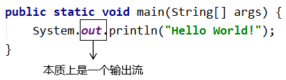


**② 问题2：无法统一管理**

项目上线时，希望把所有（或一部分）sout打印关闭，但是只能手动一个一个查找，耗费开发人员的极大精力，因为sout的无度使用会使它分散在项目的各个角落


**③ 问题3：显得你很low**

想看某个变量的值，只会使用sout在控制台打印出来，不会debug，这只能被人鄙视


**④ 问题4：只能输出到控制台**

如果打印内容需要留存，我们想写入文件、数据库，这些靠SysOut都做不到


#### 2.6.2 使用日志框架的好处

**① 设定级别，统一管理**

日志框架会按照事件的严重程度来划分级别，例如：

- 错误（Error）：表示程序运行出错，比如抛异常等情况。
- 警告（Warning）：表示程序运行过程中有潜在风险，但此时并没有报错。
- 信息（Info）：表示程序运行过程中完成了一个关键动作，需要以程序运行信息的形式告知开发者。
- 调试（Debug）：表示程序运行过程中更加细致的信息，协助程序员调试程序。

Tips：各种不同的具体日志系统会使用不同的日志级别名称，也可能有更多个级别设定。但是思想是一致的。

通过在配置文件中指定某一个日志级别，在全局范围内，来控制系统要打印的内容。日志框架会打印**当前指定级别**的日志和比当前指定级别**更严重**的级别的日志。

例如在开发阶段，我们指定debug级别，项目上线修改成info级别，那么所有debug级别的日志就都不打印了，不需要到项目代码中一个一个修改，非常方便。

**② 灵活指定输出位置**

使用日志框架不一定是打印到控制台，也可以保存到文件中或者保存到数据库。这就看具体的项目维护需求。

**③ 自定义日志格式**

打印日志数据可以使用日志框架的默认格式，也可以根据需要定制。

**④ 基于日志分析问题**

将来我们开发的应用系统中，不仅包含Java代码，还有很多中间件服务器。任何子系统出现故障我们都是通过日志来定位问题、分析故障原因。甚至更复杂的系统还会专门开发日志子系统，在主系统出现问题时抓取日志数据供维护人员参考。

而日志数据必须要有确定格式才便于格式化和抓取，这肯定不是随意写sout就能实现的。


#### 2.6.3 日志系统的技术演变

1996年早期，欧洲安全电子市场项目组决定编写它自己的程序跟踪API(Tracing API)。经过不断的完善，这个API终于成为一个十分受欢迎的Java日志软件包，即**Log4j**（由Ceki创建）。

后来Log4j成为Apache基金会项目中的一员,Ceki也加入Apache组织。 后来Log4j近乎成了Java社区的日志标准。

据说Apache基金会还曾经建议Sun引入Log4j到java的标准库中，但Sun拒绝了。

2002年Java1.4发布，Sun推出了自己的日志库**JUL**(Java Util Logging),其实现基本模仿了Log4j的实现。

在JUL出来以前，Log4j就已经成为一项成熟的技术，使得Log4j在选择上占据了一定的优势。

接着，Apache推出了**Jakarta Commons Logging**门面，看来Apache想统一日志江湖了，**JCL**只是定义了一套日志接口(其内部也提供一个Simple Log的简单实现)，支持运行时动态加载日志组件的实现，也就是说，在你应用代码里，只需调用Commons Logging的接口，底层实现可以是Log4j，也可以是JUL(Java实现)。

后来(2006年)，Ceki不适应Apache的工作方式，离开了Apache。然后先后创建了Slf4j(日志门面接口，类似于Commons Logging)和Logback(Slf4j的实现)两个项目，并回瑞典创建了QOS公司，QOS官网上是这样描述**Logback**的：The Generic，Reliable Fast\&Flexible Logging Framework(一个通用，可靠，快速且灵活的日志框架)。

门面：类似于标准层、接口层

| 名称                                    | 说明                 |
| --------------------------------------- | -------------------- |
| JCL（Jakarta Commons Logging）          | 陈旧                 |
| SLF4J（Simple Logging Facade for Java） | 适合（**同一作者**） |
| jboss-logging                           | 特殊专业领域使用     |

实现

| 名称                     | 说明                                               |
| ------------------------ | -------------------------------------------------- |
| log4j                    | 最初版（**同一作者**）                             |
| JUL（java.util.logging） | JDK自带                                            |
| log4j2                   | Apache收购log4j后全面重构，内部实现和log4j完全不同 |
| logback                  | 优雅、强大（**同一作者**）                         |

推荐：最佳拍档

- 门面：SLF4J
- 实现：logback


#### 2.6.4 日志操作快速入门

**步骤一：准备依赖**

```xml
<dependency>
    <groupId>org.projectlombok</groupId>
    <artifactId>lombok</artifactId>
</dependency>
```

**步骤二：日志级别介绍**

**Logback（以及 SLF4J 和其他许多日志框架）支持以下标准日志级别，从低到高排序：**

1. **TRACE**：最详细的日志信息，通常只在调试问题时启用。这包括了系统运行的每一步细节。
2. **DEBUG**：比 TRACE 级别少一些，主要用于开发阶段的调试，记录程序执行过程中的重要信息。
3. **INFO**：一般用于确认应用程序按预期工作，比如服务启动、关闭或处理请求等重要事件。
4. **WARN**：警告信息，表示可能存在潜在的问题，但还不至于影响系统的正常运行。
5. **ERROR**：错误信息，表示发生了严重的错误，可能导致某些功能无法正常使用。

**日志级别优先级**

日志级别具有严格的优先级顺序，即 `TRACE < DEBUG < INFO < WARN < ERROR`。这意味着如果将某个 logger 的日志级别设置为 `INFO`，那么只有 `INFO`、`WARN` 和 `ERROR` 级别的日志会被输出；而 `DEBUG` 和 `TRACE` 级别的日志则不会被记录。

**步骤三：编写配置文件**

可以通过配置文件来设置全局或者特定包/类的日志级别。例如，在 `logback-spring.xml(支持spring特性) | logback.xml` 或者 `application.properties` 文件中进行如下配置：

* logback-spring.xml 示例，**完整版参考资料**

  ```xml
  <configuration>
       <!-- 全局日志级别 -->
       <root level="INFO">
           <appender-ref ref="STDOUT" />
       </root>

       <!-- 特定包的日志级别，控制日志事件的传递行为-->
       <logger name="com.example.myapp" level="DEBUG" additivity="false">
           <appender-ref ref="FILE" />
       </logger>
   </configuration>
  ```

* application.properties 示例

  ```properties
  # 设置全局日志级别为 WARN
  logging.level.root=WARN

  # 设置（特定包）的日志级别为 DEBUG
  logging.level.org.springframework.web=DEBUG
  logging.level.com.example.myapp=DEBUG

  # 配置日志输出格式 level是多渠道默认格式
  # 使用 logging.pattern.console 和 logging.pattern.file 分别配置控制台和文件日志的格式。
  logging.pattern.level="%d{yyyy-MM-dd HH:mm:ss} [%thread] %-5level %logger{36} - %msg%n"

  #常用的格式占位符：
  #	%d：日期时间。
  #	%msg：日志消息。
  #    %n：换行符。
  #	%thread：线程名。
  #	%-5level：日志级别（左对齐，宽度为 5）。
  #	%logger{36}：日志记录器的名称（最大长度为 36）
  ```

**步骤四：日志内容输出**

**使用LoggerFactory构建日志记录器(了解)**

```java
@SpringBootTest(classes = Day21SsmApplication.class)
public class TestSlf4j {

    //内置的日志记录器:log
    Logger log = LoggerFactory.getLogger(TestSlf4j.class);

    @Test
    public void testSlf4j(){
        // 创建日志记录器
        log.info("日志记录器创建成功");
        // 记录日志
        log.trace("追踪信息trace");
        log.debug("调试信息debug");
        log.info("普通信息info");
        log.warn("警告信息warn");
        log.error("错误信息error");

    }
}
```

**使用@Slf4j注解**

```java
import lombok.extern.slf4j.Slf4j;
@Slf4j
@SpringBootTest(classes = Day21SsmApplication.class)
public class TestSlf4j {

    @Test
    public void testSlf4j(){
        // 创建日志记录器
        log.info("日志记录器创建成功");
        // 记录日志
        log.trace("追踪信息trace");
        log.debug("调试信息debug");
        log.info("普通信息info");
        log.warn("警告信息warn");
        log.error("错误信息error");
    }
}
```

### 2.7 Spring Boot 自动配置原理

#### 2.7.1 @Conditional注解

##### 2.7.1.1 核心作用

`@Conditional`是 Spring 框架提供的**条件注册 Bean 的核心注解**，标记在类 / 方法上时，会根据自定义条件判断该类（或方法生成的 Bean）是否被加入 IoC 容器：

- 条件满足（matches 返回 true）：Bean 正常注册到 IoC 容器；
- 条件不满足（matches 返回 false）：Bean 不注册。

该注解是 Spring Boot 自动配置的底层核心（如根据依赖、配置动态创建 Bean）。

##### 2.7.1.2 基础使用步骤

###### ① 自定义条件类（实现 Condition 接口）

通过重写`matches`方法定义判断逻辑，返回`boolean`表示条件是否满足：

```java
// 示例：判断当前系统是否为Windows
public class WindowsCondition implements Condition {
    @Override
    public boolean matches(ConditionContext context, AnnotatedTypeMetadata metadata) {
        // 获取环境变量，判断系统类型
        String os = context.getEnvironment().getProperty("os.name");
        return os != null && os.toUpperCase().contains("WINDOWS");
    }
}

// 示例：判断数字是否为偶数
public class NumberCondition implements Condition {
    @Override
    public boolean matches(ConditionContext context, AnnotatedTypeMetadata metadata) {
        return 101 % 2 == 0; // 条件不满足（返回false）
    }
}
```

###### ② 标注 @Conditional 应用条件

- 单条件：指定一个条件类，满足则注册 Bean；
- 多条件：指定多个条件类，**需全部满足（AND 关系）** 才注册 Bean。

```java
// 单条件：仅Windows系统时，TigerComp才注册到IoC
@Component
@Conditional(WindowsCondition.class)
public class TigerComp {}

// 多条件：需同时满足Windows系统 + 数字偶数，MyConditionController才注册
@Controller
@Conditional({WindowsCondition.class, NumberCondition.class})
public class MyConditionController {}
```

类上的 @Conditional 是「第一道安检门」，这道门没过，整个类里的所有方法都不会被 Spring 看一眼；只有过了类的安检，才会查每个 @Bean 方法的「第二道安检门」（方法级 @Conditional），方法安检过了才注册这个 Bean，没过就只跳过这个方法，不影响其他方法。

##### 2.7.1.3  常用衍生注解（Spring Boot 封装）

Spring Boot 基于`@Conditional`封装了高频场景的条件注解，无需自定义 Condition 类即可快速使用，核心如下：

| 注解                         | 核心逻辑                                      |
| ---------------------------- | --------------------------------------------- |
| @ConditionalOnBean           | 容器中存在指定 Bean 时，注册当前 Bean         |
| @ConditionalOnMissingBean    | 容器中无指定 Bean 时，注册当前 Bean           |
| @ConditionalOnClass          | 类路径存在指定类时，注册当前 Bean             |
| @ConditionalOnProperty       | 配置文件存在指定属性且值匹配时，注册当前 Bean |
| @ConditionalOnWebApplication | 应用是 Web 应用时，注册当前 Bean              |

> 多个衍生注解标注在同一类上时，仍遵循 “且（AND）” 关系：所有条件需全部满足才注册 Bean。

#### 2.7.2 @Import注解

`@Import `是 Spring 核心注解，可**手动向 IoC 容器导入类**（无需 @Component/@Service 等注册注解），支持静态导入单个 / 多个类，也可通过 ImportSelector 接口动态导入，是 Spring Boot 自动配置的底层关键。

##### 2.7.2.1 基础用法：直接导入类

1. 准备普通类（无注册注解，默认不进 IoC）

   ```java
   // 无@Component，默认不会被Spring扫描
   public class UserBean {}
   public class OrderBean {}
   ```

2. 配置类中用 @Import 导入

   ```java
   @Configuration
   // 直接导入多个类，这些类会被注册到IoC容器
   @Import({UserBean.class, OrderBean.class})
   public class ImportConfig {}
   ```

3. 验证容器获取组件

   ```java
   public class TestImport {
       public static void main(String[] args) {
           ApplicationContext context = new AnnotationConfigApplicationContext(ImportConfig.class);
           // 能获取到Bean，说明导入成功
           System.out.println(context.getBean(UserBean.class));
           System.out.println(context.getBean(OrderBean.class));
       }
   }
   ```

##### 2.7.2.2 进阶用法：实现 ImportSelector 接口（动态导入）

ImportSelector 是 Spring 接口，可**动态 / 批量指定要导入的类**（返回类全限定名数组），适合根据条件动态导入（Spring Boot 自动配置核心逻辑）。

1. 实现 ImportSelector 接口

   ```java
   public class MyImportSelector implements ImportSelector {
       @Override
       // 返回要导入的类的全限定名数组
       public String[] selectImports(AnnotationMetadata metadata) {
           // 动态指定导入类（可加条件判断，如根据环境导入不同类）
           return new String[]{
               "com.example.bean.UserBean",
               "com.example.bean.OrderBean"
           };
       }
   }
   ```

2. 配置类导入 ImportSelector 实现类

   ```java
   @Configuration
   // 导入自定义ImportSelector，自动执行selectImports方法导入类
   @Import(MyImportSelector.class)
   public class ImportSelectorConfig {}
   ```

3. 验证（效果和直接导入一致）

   ```java
   public class TestImportSelector {
       public static void main(String[] args) {
           ApplicationContext context = new AnnotationConfigApplicationContext(ImportSelectorConfig.class);
           System.out.println(context.getBean(UserBean.class)); // 可正常获取
       }
   }
   ```

##### 2.7.2.3 核心总结

1. @Import 基础用法：直接导入类，无需 @Component，快速注册 Bean；
2. ImportSelector：动态批量导入类，返回类全限定名数组，是 Spring Boot 自动配置的核心方式（如根据依赖动态导入配置类）。

#### 2.7.3 自动配置原理

##### 2.7.3.1 自动配置原理初步理解

**自动配置**是 Spring Boot 的核心特性之一，它的目标是简化 Spring 应用的配置过程。通过自动配置，Spring Boot 可以根据项目的依赖和配置，自动配置 Spring 应用程序的组件和功能。

**举个例子：**

- 如果你在项目中引入了 `spring-boot-starter-web` 依赖，Spring Boot 会自动配置 Spring MVC 相关的 Bean（如 `HandlerMapping、HandlerAdapter`）等。
- 如果你没有配置任何 Web 参数，还会自动配置项目访问根地址为 “ ” 以及端口号为 8080。
- 我们只需要负责导入场景启动器，剩下的交给 Spring Boot 完成自动配置即可

验证：**boot 对应的容器中添加了哪些组件**

``` java
public static void main(String[] args) {

    ApplicationContext ioc = SpringApplication.run(MainApplication.class, args);

    //1、获取容器中所有组件的名字
    String[] names = ioc.getBeanDefinitionNames();
    //2、挨个遍历：
    // dispatcherServlet、beanNameViewResolver、characterEncodingFilter、multipartResolver
    // Spring Boot 把以前配置的核心组件现在都给我们自动配置好了。
    for (String name : names) {
        System.out.println(name);
    }
}
```

##### 2.7.3.2 启动类 @SpringBootApplication 注解详解

**@SpringBootApplication源码**

```java
@Target({ElementType.TYPE})
@Retention(RetentionPolicy.RUNTIME)
@Documented
@Inherited
@SpringBootConfiguration
@EnableAutoConfiguration
@ComponentScan(
    excludeFilters = {@Filter(
    type = FilterType.CUSTOM,
    classes = {TypeExcludeFilter.class}
), @Filter(
    type = FilterType.CUSTOM,
    classes = {AutoConfigurationExcludeFilter.class}
)}
)
public @interface SpringBootApplication {
    @AliasFor(
        annotation = EnableAutoConfiguration.class
    )
    Class<?>[] exclude() default {};

    @AliasFor(
        annotation = EnableAutoConfiguration.class
    )
    String[] excludeName() default {};

    @AliasFor(
        annotation = ComponentScan.class,
        attribute = "basePackages"
    )
    String[] scanBasePackages() default {};

    @AliasFor(
        annotation = ComponentScan.class,
        attribute = "basePackageClasses"
    )
    Class<?>[] scanBasePackageClasses() default {};

    @AliasFor(
        annotation = ComponentScan.class,
        attribute = "nameGenerator"
    )
    Class<? extends BeanNameGenerator> nameGenerator() default BeanNameGenerator.class;

    @AliasFor(
        annotation = Configuration.class
    )
    boolean proxyBeanMethods() default true;
}
```

- **@SpringBootApplication:实际上是以下三个注解的组合**

  - **@SpringBootConfiguration**：标识该类为一个配置类，可以使用 Java 配置来定义组件（例如通过 `@Bean` 注解）。
  - **@EnableAutoConfiguration**：启用 Spring Boot 的自动配置机制，根据类路径中的依赖自动配置 Spring 应用程序。它会尝试猜测并配置你可能需要的 Bean，从而减少了大量的手动配置工作。
  - **@ComponentScan**：自动扫描并注册带有 @Component、@Service、@Repository 和 @Controller 等注解的类作为 Spring Beans。默认情况下，它会从声明 @SpringBootApplication 的类所在的包及其子包中查找组件。

- `@SpringBootApplication`使用场景

  - @SpringBootApplication 通常被放置在应用程序的主类上，也就是包含 **public static void main(String[] args) 方法**的那个类。这样做的好处是可以让整个应用程序的所有配置都集中在这个主类中，便于管理和维护。

- `@SpringBootApplication`自定义配置扩展

  - 虽然 @SpringBootApplication 提供了一套合理的默认设置，但你可以根据需要对其进行自定义。比如，如果你想改变组件扫描的基础包或者关闭某些自动配置，可以通过如下方式实现：

    - 自定义 `@ComponentScan` 的基础包

      ```java
      @SpringBootApplication(scanBasePackages = {"com.example.package1", "com.example.package2"})
      public class MyApplication {
          // ...
      }
      ```

    - 禁用特定的自动配置:如果你不想使用某些自动配置，可以通过 `exclude` 参数来排除它们（排除场景启动器的自动配置类）

      ``` java
      @SpringBootApplication(exclude = {DataSourceAutoConfiguration.class})
      public class MyApplication {
          // ...
      }
      ```

    - @ComponentScan注解的includeFilters` 和 `excludeFilters属性：允许你自定义过滤规则来包含或排除某些自定义类型的组件。每个过滤器都是一个 `FilterType` 枚举值加上相应的模式匹配表达式。例如：

      ```java
      @ComponentScan(
          includeFilters = @ComponentScan.Filter(type = FilterType.ANNOTATION, classes = MyCustomAnnotation.class),
          excludeFilters = @ComponentScan.Filter(type = FilterType.ASSIGNABLE_TYPE, classes = MyExcludedClass.class)
      )
      public @interface SpringBootApplication {}
      ```

##### 2.7.3.3 自动配置原理实现完整流程

**思考：**

**1、Spring Boot 怎么实现导一个**`starter`**、写一些简单配置，应用就能跑起来**?

2、为什么Tomcat的端口号可以配置在`application.properties`中，并且`Tomcat`能启动成功？

3、导入场景后哪些**自动配置能生效**？

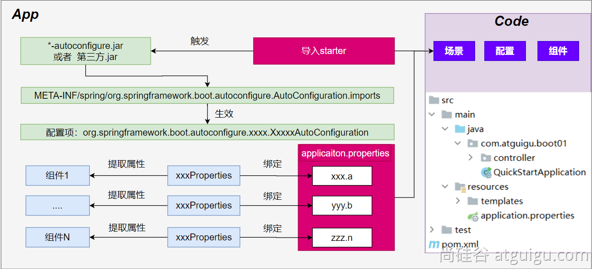


**自动配置流程细节梳理：**

**1、**导入`starter-web`：导入了 Web 开发场景

- 1、场景启动器导入了相关场景的所有依赖：`starter-json`、`starter-tomcat`、`spring-webmvc`
- 2、每个场景启动器都引入了一个`spring-boot-starter`，核心场景启动器。
- 3、**核心场景启动器**引入了`spring-boot-autoconfigure`包。
- 4、`spring-boot-autoconfigure`里面囊括了所有场景的所有配置。
- 5、只要这个包下的所有类都能生效，那么相当于 Spring Boot 官方写好的整合功能就生效了。
- 6、Spring Boot 默认却扫描不到 `spring-boot-autoconfigure` 下写好的所有**配置类**。（这些**配置类**给我们做了整合操作），**默认只扫描主程序所在的包**。

**2、**主程序：`@SpringBootApplication`

- 1、`@SpringBootApplication`由三个注解组成`@SpringBootConfiguration`、`@EnableAutoConfiguration`、`@ComponentScan`
- 2、Spring Boot 默认只能扫描自己主程序所在的包及其下面的子包，扫描不到 `spring-boot-autoconfigure` 包中官方写好的**配置类**
- 3、`@EnableAutoConfiguration`：Spring Boot **开启自动配置的核心**。

- - 1. 是由`@Import(AutoConfigurationImportSelector.class)`提供功能：批量给容器中导入组件。
  - 2. Spring Boot 启动会默认加载 142 个配置类。
  - 3. 这**142个配置类**来自于`spring-boot-autoconfigure`下 `META-INF/spring/org.springframework.boot.autoconfigure.AutoConfiguration.imports`文件指定的
  - 项目启动的时候利用 @Import 批量导入组件机制把 `autoconfigure` 包下的142 `xxxxAutoConfiguration`类导入进来（**自动配置类**）
  - 虽然导入了`142`个自动配置类

- 4、按需生效：

- - 并不是这`142`个自动配置类都能生效
  - 每一个自动配置类，都有条件注解`@ConditionalOnxxx`，只有条件成立，才能生效

**3、**`xxxxAutoConfiguration`**自动配置类**

- **1、给容器中使用@Bean 放一堆组件。**
- 2、每个**自动配置类**都可能有这个注解`@EnableConfigurationProperties(ServerProperties.class)`，用来把配置文件中配的指定前缀的属性值封装到 `xxxProperties`**属性类**中
- 3、以DataSourceAutoConfiguration为例：所有配置都是以`spring.datasource`开头的，配置都封装到了属性类中。
- 4、给**容器**中放的所有**组件**的一些**核心参数**，都来自于`xxxProperties`**。**`xxxProperties`**都是和配置文件绑定。**
- **只需要改配置文件的值，核心组件的底层参数都能修改**

**4、**写业务，全程无需关心各种整合

**核心流程总结：**

1、导入`starter`，就会导入`autoconfigure`包。

2、`autoconfigure` 包里面 有一个文件 `META-INF/spring/org.springframework.boot.autoconfigure.AutoConfiguration.imports`,里面指定的所有启动要加载的自动配置类

3、@EnableAutoConfiguration 会自动的把上面文件里面写的所有**自动配置类都导入进来。xxxAutoConfiguration 是有条件注解进行按需加载**

4、`xxxAutoConfiguration`给容器中导入一堆组件，组件都是从 `xxxProperties`中提取属性值

5、`xxxProperties`又是和**配置文件**进行了绑定

**效果：**导入`starter`、修改配置文件，就能修改底层行为。


#### 2.7.4 自定义场景启动器(了解)

##### 2.7.4.1 提出需求

假设我们开发这样一个starter，具备如下功能：

- 从配置文件读取客户的出生日期
- 根据出生日期计算客户今年的年龄

##### 2.7.4.2 starter内部结构

###### ① 核心组件

| 组件名称             | 扮演角色   | 功能描述                                                     |
| -------------------- | ---------- | ------------------------------------------------------------ |
| AgeService           | 业务组件   | ●执行时间日期的业务数据计算                                  |
| AgeProperties        | 属性组件   | ●封装配置文件属性值                                          |
| AgeAutoConfiguration | 自动配置类 | ●主要任务：注册属性组件<br />●次要任务：确保业务组件放入IoC容器 |

###### ② 目录结构

注意：starter 中不写 Spring Boot 的主启动类！！！

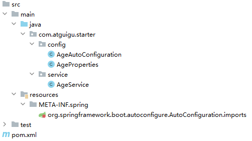

- org.springframework.boot.autoconfigure.AutoConfiguration.imports：用于声明自动配置类
- spring-configuration-metadata.json：可选功能，提供 IDE 自动补全支持


##### 2.7.4.3 创建步骤

###### ① 创建工程：atguigu-pre-age-spring-boot-starter

自定义 starter 的工程不需要继承 spring-boot-starter-parent ！！！

```xml
<dependencies>
    <dependency>
        <groupId>org.springframework.boot</groupId>
        <artifactId>spring-boot-autoconfigure</artifactId>
        <version>3.3.12</version>
    </dependency>
    <dependency>
        <groupId>org.springframework.boot</groupId>
        <artifactId>spring-boot-configuration-processor</artifactId>
        <version>3.3.12</version>
        <optional>true</optional>
    </dependency>
</dependencies>

<build>
    <plugins>
        <plugin>
            <groupId>org.springframework.boot</groupId>
            <artifactId>spring-boot-maven-plugin</artifactId>
            <version>3.3.12</version>
        </plugin>
    </plugins>
</build>
```

###### ② 创建组件

属性组件

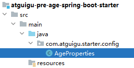

```java
@ConfigurationProperties(prefix = "atguigu")
public class AgeProperties {

    private String birthday;

    public String getBirthday() {
        return birthday;
    }

    public void setBirthday(String birthday) {
        this.birthday = birthday;
    }
}
```

业务组件

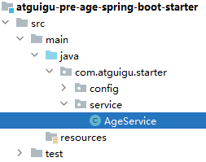

```java
public class AgeService {

    public static final String DATE_TIME_FORMAT = "yyyy-MM-dd HH:mm:ss";

    private final String birthday;

    public AgeService(String birthday) {
        this.birthday = birthday;
    }

    public int computeAgeByBirthday() {
        DateTimeFormatter formatter = DateTimeFormatter.ofPattern(DATE_TIME_FORMAT);
        LocalDate birthDate = LocalDate.parse(birthday, formatter);
        LocalDate currentDate = LocalDate.now();

        // 检查生日是否在当前日期之后
        if (birthDate.isAfter(currentDate)) {
            return -1; // 无效的生日
        }

        // 计算年龄
        Period period = Period.between(birthDate, currentDate);
        return period.getYears();
    }
}
```

###### ③ 自动配置类

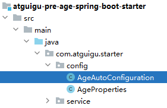

```java
package com.atguigu.starter.config;

import com.atguigu.starter.service.AgeService;
import org.springframework.boot.autoconfigure.condition.ConditionalOnClass;
import org.springframework.boot.autoconfigure.condition.ConditionalOnMissingBean;
import org.springframework.boot.context.properties.EnableConfigurationProperties;
import org.springframework.context.annotation.Bean;
import org.springframework.context.annotation.Configuration;

// 将当前类声明为配置类
@Configuration

// 如果当前类路径下有 AgeService 这个类，就把当前类加入 IoC 容器
// 当前类路径下怎么才能有 AgeService？引入我们正在开发的这个 starter 的依赖即可
@ConditionalOnClass(AgeService.class)

// 注册属性组件，Spring Boot 会读取用户在配置文件中指定的生日字符串，注入属性组件
@EnableConfigurationProperties(AgeProperties.class)
public class AgeAutoConfiguration {

    private final AgeProperties ageProperties;

    // 基于构造器装配，把属性组件注入进来
    public AgeAutoConfiguration(AgeProperties ageProperties) {
        this.ageProperties = ageProperties;
    }

    @Bean
    // Missing 单词：丢失、遗漏、找不到
    // MissingBean 单词：IoC 容器中没有这个 bean
    // @ConditionalOnMissingBean 条件注解：当 IoC 容器中没有 AgeService 这个 bean 时，才把当前方法返回的对象加入 IoC 容器
    // 提问：IoC 容器中为啥会有 AgeService 这个 bean 呢？
    // 答：开发人员有可能自己把它加入 IoC 容器
    @ConditionalOnMissingBean
    public AgeService ageService() {
        // 创建业务组件对象的同时，把生日字符串传入进去
        return new AgeService(ageProperties.getBirthday());
    }
}
```

`@ConditionalOnMissingBean` 是 Spring Boot 框架提供的一个条件注解，它用于控制 Bean 的创建条件。当容器中**不存在指定类型或名称的 Bean 时**，被该注解标注的 Bean 才会被创建。这个注解在自动配置场景中尤为重要，它允许框架提供默认实现，同时允许用户通过自定义 Bean 来覆盖默认配置


##### 2.7.4.4 配置文件

###### ① xxx.imports

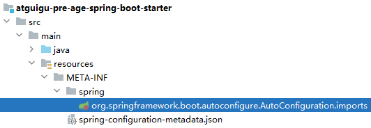

- 功能：让 Spring Boot 加载我们创建的自动配置类
- 文件名：org.springframework.boot.autoconfigure.AutoConfiguration.imports
- 所在目录：src/main/resources/META-INF/spring
- 文件内容如下：

```properties
com.atguigu.starter.config.AgeAutoConfiguration
```


###### ② 元数据配置（可选）

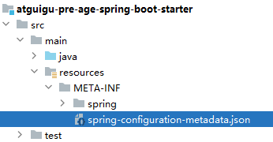

- 功能：这里的配置添加之后，可以让 IDE 在用户配置属性时提供自动补全提示
- 文件名：spring-configuration-metadata.json
- 所在目录：src/main/resources/META-INF

- name属性：在 Spring Boot 配置文件中使用的属性名

```json
{
  "properties": [
    {
      "name": "atguigu.birthday",
      "type": "java.lang.String",
      "description": "Your birthday",
      "defaultValue": "2025-10-21 13:27:54"
    }
  ]
}
```

##### 2.7.4.5 打包安装

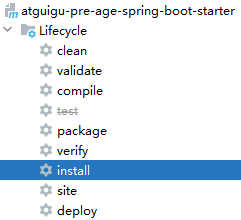

starter开发完成：

- 想要在本地使用，那就安装到本地Maven仓库
- 想要全公司使用，那就安装到内网Maven私服仓库
- 想要全世界使用，那就提交给Maven中央仓库，并且被收录


##### 2.7.4.6 使用

###### ① 引入依赖

- 这是一个 starter 之外的另一个 Maven 工程
- 使用 starter 需要 Spring Boot 环境

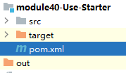

```xml
<dependency>
    <groupId>com.atguigu.starter</groupId>
    <artifactId>atguigu-pre-age-spring-boot-starter</artifactId>
    <version>1.0-SNAPSHOT</version>
</dependency>
```


###### ② 配置属性

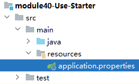

```properties
atguigu.birthday=2020-10-25 23:14:26
```


###### ③ 调用业务组件方法

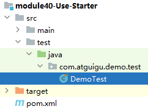

```java
@Resource
private AgeService ageService;

@Test
public void testComputeAge() {
    int age = ageService.computeAgeByBirthday();
    System.out.println("age = " + age);
}
```

## 3. 框架阶段核心原理讲解

### 3.1 Spring组件作用域

#### 3.1.1 核心问题

Spring IoC 容器创建 Bean 对象时，**默认是单实例**（整个容器中仅存在一个该 Bean 实例）。

示例验证：

```java
// 普通组件类（无特殊配置，默认单例）
@Component
public class Demo13Comp {
}

// 测试代码
Object demo13Comp01 = ioc.getBean("demo13Comp");
Object demo13Comp02 = ioc.getBean("demo13Comp");
// 输出true：两次获取的是同一个对象
System.out.println("比较两个变量：" + (demo13Comp01 == demo13Comp02));
```

若需让 Spring 创建**多实例 Bean**（每次获取都生成新对象），需通过`@Scope`注解控制。

#### 3.1.2 Bean 作用域控制：@Scope 注解

`@Scope`注解用于指定 Bean 的作用域，核心控制是否为单例，注解核心结构：

```java
@Target({ElementType.TYPE, ElementType.METHOD})
@Retention(RetentionPolicy.RUNTIME)
@Documented
public @interface Scope {
    @AliasFor("scopeName")
    String value() default "";

    @AliasFor("value")
    String scopeName() default "";

    ScopedProxyMode proxyMode() default ScopedProxyMode.DEFAULT;
}
```

核心取值（value/scopeName）

- `singleton`：默认值，单实例（容器中仅一个 Bean 实例）；
- `prototype`：多实例（每次获取 Bean 都创建新对象）。

#### 3.1.3 Bean 对象创建时机（单例 vs 多实例）

##### ① 单实例（singleton）

```java
@Component
@Scope("singleton") // 默认值，可省略
public class Demo13Comp {
    public Demo13Comp() {
        System.out.println("★★★★★★★★★★★Demo13Comp 类创建了对象★★★★★★★★★★★");
    }
}
```

- 创建时机：**IoC 容器初始化阶段**（容器启动时）就创建 Bean 实例，且仅创建一次；

##### ② 多实例（prototype）

```java
@Component
@Scope("prototype") // 指定多实例
public class Demo13Comp {
    public Demo13Comp() {
        System.out.println("★★★★★★★★★★★Demo13Comp 类创建了对象★★★★★★★★★★★");
    }
}
```

- 创建时机：**IoC 容器初始化完成后**，每次调用`ioc.getBean()`时才创建新实例（延迟创建）；
- 效果：每次获取都会生成新对象，调用几次`getBean()`就创建几个实例；

**核心总结**

1. Spring IoC 容器创建 Bean，**默认是单实例（singleton）**；
2. 单例 Bean：容器初始化时创建，全局仅一个实例；
3. 通过`@Scope("prototype")`可将 Bean 设置为多实例；
4. 多实例 Bean：每次调用`getBean()`时创建新对象，属于 “延迟创建”。

### 3.2 Spring组件生命周期

#### 3.2.1  理解 Bean 生命周期的核心价值

Spring Bean 的生命周期指 Bean 从**创建→初始化→销毁**的完整过程，理解它能帮助开发者：

1. 清晰掌握 Bean 的实例化流程和配置特性；
2. 利用对外扩展接口定制 Bean 实例化逻辑；
3. 辅助理解 AOP、声明式事务等核心功能的实现原理。

#### 3.2.2 Bean 生命周期核心阶段

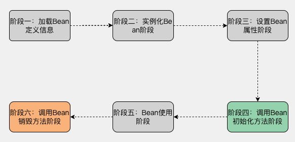

Spring Bean 基础生命周期从容器创建 Bean 实例开始，到 Bean 销毁结束，核心阶段如下：

**阶段一：加载 Bean 定义**

- Spring 容器扫描`@Component/@Configuration`等注解，解析类信息；
- 将解析结果转换为内部`BeanDefinition`对象并存储，为实例化做准备。

**阶段二：实例化 Bean 组件**

- 容器根据`BeanDefinition`创建 Bean 实例（通过反射调用构造方法）；
- 若 Bean 依赖其他 Bean（如`@Autowired`），优先实例化被依赖的 Bean；
- 此阶段仅创建对象，不进行属性赋值。

**阶段三：设置 Bean 属性**

- 容器通过`@Autowired/@Value`等注解，为 Bean 注入依赖对象或配置属性；
- 属性注入与实例化分离，注解声明的依赖无需关注顺序。

**阶段四：调用 Bean 初始化方法**

初始化触发优先级：`@PostConstruct` > `InitializingBean`接口 > 自定义初始化方法

1. 若 Bean 中方法标注`@PostConstruct`，容器优先执行该方法；
2. 若 Bean 实现`InitializingBean`接口，执行`afterPropertiesSet()`方法；
3. 若通过`@Bean(initMethod = "xxx")`指定自定义初始化方法，执行该方法；
4. 此阶段可完成资源初始化（如连接池创建、参数初始化）。

**阶段五：Bean 就绪使用**

Bean 完成所有初始化流程，可被容器或其他 Bean 引用、调用。

**阶段六：调用 Bean 销毁方法（仅单例 Bean）**

销毁触发优先级：`@PreDestroy` > `DisposableBean`接口 > 自定义销毁方法

1. 若 Bean 中方法标注`@PreDestroy`，容器销毁 Bean 前执行该方法；
2. 若 Bean 实现`DisposableBean`接口，执行`destroy()`方法；
3. 若通过`@Bean(destroyMethod = "xxx")`指定自定义销毁方法，执行该方法；
4. 此阶段可释放资源（如关闭连接、清理缓存）。

#### 3.2.3 自定义初始化 / 销毁方法（注解版演示）

##### ① 步骤 1：编写 Bean 组件（注解指定生命周期方法）

```java
// 核心：通过@Component注册Bean，替代XML配置
@Component
public class MyBean {
    // 自定义初始化方法（命名随意，无参数、void返回、public修饰）
    @PostConstruct // 替代XML的init-method
    public void start() {
        System.out.println("✅ Bean初始化方法执行");
    }

    // 自定义销毁方法（命名随意，无参数、void返回、public修饰）
    @PreDestroy // 替代XML的destroy-method
    public void end() {
        System.out.println("❌ Bean销毁方法执行");
    }
}
```

##### ② 步骤 2：配置类扫描组件（

```java
import org.springframework.context.annotation.ComponentScan;
import org.springframework.context.annotation.Configuration;

// 替代XML的<beans>标签，扫描指定包下的注解组件
@Configuration
@ComponentScan("com.atguigu.lifecycle") // 扫描MyBean所在包
public class LifecycleConfig {
}
```

##### ③ 步骤 3：测试生命周期

```java
import org.springframework.context.annotation.AnnotationConfigApplicationContext;

public class TestLifecycle {
    public static void main(String[] args) {
        // 初始化容器（替代XML加载）
        AnnotationConfigApplicationContext context =
            new AnnotationConfigApplicationContext(LifecycleConfig.class);

        // 获取Bean（触发初始化）
        MyBean myBean = context.getBean(MyBean.class);

        // 关闭容器（触发单例Bean销毁）
        context.close();
    }
}
```

#### 3.2.4 生命周期扩展接口

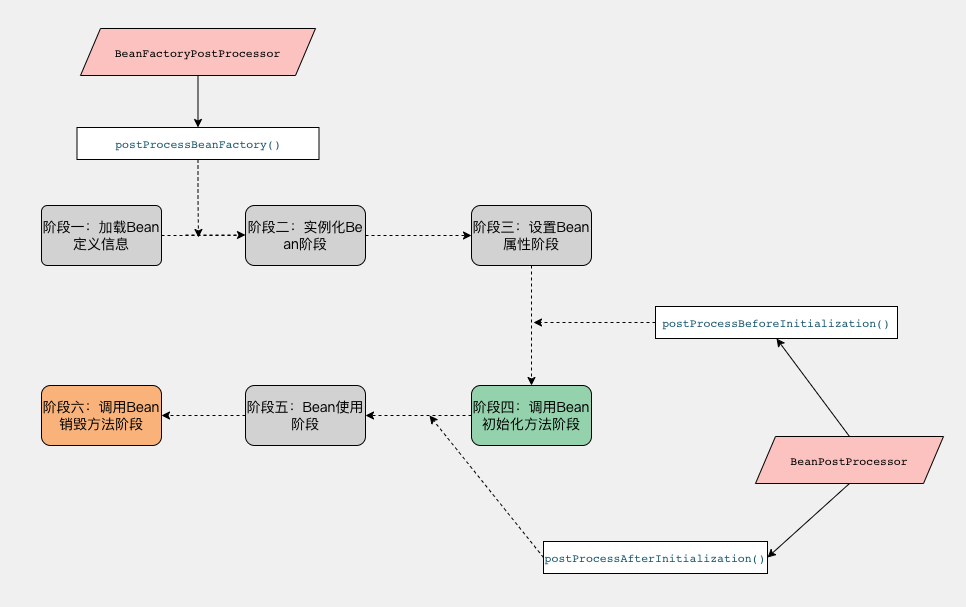

Spring 提供扩展接口，允许自定义干预 Bean 生命周期，以下是核心接口的注解版实现：

##### ① BeanFactoryPostProcessor（修改 Bean 定义）

作用：容器实例化 Bean 前，修改`BeanDefinition`（如动态修改属性），替代 XML 配置该接口的方式。

```java
public class Goods {
    private Integer saasId;
    public void setSaasId(Integer saasId) { this.saasId = saasId; }
    // ...其他属性和方法
}

@Component
public class MyBeanFactoryPostProcessor implements BeanFactoryPostProcessor {
    @Override
    public void postProcessBeanFactory(ConfigurableListableBeanFactory beanFactory) throws BeansException {
        System.out.println("BeanFactoryPostProcessor：修改Bean定义");
        // 获取指定Bean的定义信息
        BeanDefinition goodsDef = beanFactory.getBeanDefinition("goods");
        // 动态修改属性值
        goodsDef.getPropertyValues().addPropertyValue("saasId", 1);
    }
}
```

##### ② BeanPostProcessor（Bean 初始化前后增强）

作用：所有 Bean 初始化前后执行，可定制 Bean（如 AOP 动态代理），替代 XML 配置该接口的方式。

```java
@Component
public class MyBeanPostProcessor implements BeanPostProcessor {
    // Bean初始化前执行
    @Override
    public Object postProcessBeforeInitialization(Object bean, String beanName) throws BeansException {
        System.out.println("初始化前：bean=" + bean + ", beanName=" + beanName);
        return bean; // 返回原Bean或包装后的Bean
    }

    // Bean初始化后执行（AOP核心扩展点）
    @Override
    public Object postProcessAfterInitialization(Object bean, String beanName) throws BeansException {
        System.out.println("初始化后：bean=" + bean + ", beanName=" + beanName);
        // 示例：返回代理对象（模拟AOP）
        return new Goods();
    }
}
```

##### ③ 其他常用扩展接口

| 接口 / 注解                | 作用                                 | 注解版实现方式                         |
| -------------------------- | ------------------------------------ | -------------------------------------- |
| BeanNameAware              | 获取 Bean 在容器中的名称             | Bean 实现接口，无需额外注解            |
| ApplicationContextAware    | 获取 Spring 容器上下文               | Bean 实现接口，无需额外注解            |
| @PostConstruct/@PreDestroy | 替代 InitializingBean/DisposableBean | 直接标注在方法上（推荐，无需实现接口） |

#### 3.2.5 核心总结

1. 注解版 Bean 生命周期核心替换：`@Component`替代 XML`<bean>`，`@PostConstruct/@PreDestroy`替代`init-method/destroy-method`；
2. 扩展接口（BeanFactoryPostProcessor/BeanPostProcessor）通过`@Component`注册，无需 XML 配置；
3. 生命周期核心流程：加载定义→实例化→赋值→初始化→使用→销毁（单例）；
4. 扩展接口可干预 Bean 创建过程，是 AOP、动态配置的核心实现基础。

### 3.3 Spring组件循环依赖

#### 3.3.1 核心问题：循环依赖的产生与本质

当两个 Bean（如 A 和 B）在自动装配环节互相依赖对方完成属性注入时，就形成了循环依赖：


若通过**构造器注入**实现依赖（`public A(B b)` / `public B(A a)`），循环依赖无法解决（先有 A 还是先有 B 的死循环）；

只有将「创建对象」和「设置属性」拆分为两步（无参构造创建空对象 + setter / 注解注入属性），Spring 才能通过三级缓存机制破解循环依赖。

#### 3.3.2 核心解决方案：BeanFactory （核心容器）三级缓存机制

Spring 通过`BeanFactory`的三级缓存打破循环依赖，核心是**提前暴露 Bean 的早期引用**：

| 缓存级别 | 核心属性              | 作用                              |
| -------- | --------------------- | --------------------------------- |
| 一级缓存 | singletonObjects      | 存放完全初始化的成品 Bean         |
| 二级缓存 | earlySingletonObjects | 存放创建完成但未初始化的早期 Bean |
| 三级缓存 | singletonFactories    | 存放 Bean 工厂，生成早期引用      |

##### 3.3.2.1 核心处理流程（A 依赖 B，B 依赖 A）

1. 创建 A 空对象 → 把 A 的工厂放入三级缓存；
2. 为 A 注入 B → 转而创建 B 空对象 → 把 B 的工厂放入三级缓存；
3. 为 B 注入 A → 从三级缓存取 A 的工厂生成早期引用，移入二级缓存，注入 B；
4. B 完成初始化 → 移入一级缓存；
5. 从一级缓存取 B 注入 A → A 完成初始化，移入一级缓存。

##### 3.3.2.2 关键注意点

1. Spring 不推荐循环依赖，默认禁用，需开启`spring.main.allow-circular-references=true`；
2. 仅单例 Bean 支持循环依赖，原型 Bean（多实例）不支持；
3. 构造器注入无法解决循环依赖，仅支持 setter / 注解注入。

##### 3.3.2.3 面试精简回答

Spring 通过三级缓存解决单例 Bean 的循环依赖：

1. 一级缓存存成品 Bean，二级缓存存早期 Bean，三级缓存存 Bean 工厂；
2. 创建 Bean 时先暴露早期引用到三级缓存，解决互相依赖的死锁；
3. 注意：构造器注入不支持，需用无参构造 + 属性注入，且需手动开启循环依赖开关。

### 3.4 AOP原理和应用场景

#### 3.4.1 AOP 核心概念

AOP（面向切面编程）是 Spring 核心特性之一，核心是**在不修改业务代码的前提下，对方法进行增强**（如日志记录、事务控制、权限校验）。

核心术语：

- 切面（Aspect）：封装增强逻辑的类（如日志切面、事务切面）；
- 切点（Pointcut）：指定要增强的方法（通过表达式匹配）；
- 通知（Advice）：具体的增强逻辑（前置 / 方法返回通知 / 异常 / 后置/ 环绕）；
- 连接点（JoinPoint）：程序执行过程中可被增强的方法。

#### 3.4.2 AOP 实现原理（与 Bean 生命周期强关联）

Spring AOP 基于**动态代理**实现，且核心增强逻辑嵌入在 Bean 生命周期中，关键节点是`BeanPostProcessor`接口**① 核心执行流程（结合 Bean 生命周期）**


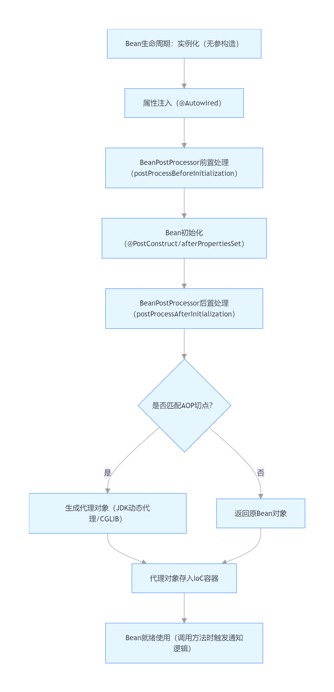

② 关键细节

- **触发时机**：AOP 代理对象的创建发生在 Bean 生命周期的「初始化后阶段」（`BeanPostProcessor.postProcessAfterInitialization`）；
- 代理方式
  - 目标类实现接口 → JDK 动态代理（基于接口）；
  - 目标类无接口 → CGLIB 代理（基于子类继承）；
- **核心原理**：Spring 扫描到切面类后，会在 Bean 初始化完成时，对匹配切点的 Bean 生成代理对象，替换原 Bean 存入 IoC 容器；调用 Bean 方法时，先执行代理对象的增强逻辑，再执行原方法。


#### 3.4.3 AOP 典型应用场景

**① 日志记录**

记录方法的调用时间、入参、出参、耗时，无需在每个业务方法中编写日志代码：

```java
@Aspect
@Component
public class LogAspect {
    @Around("execution(* com.example.service.*.*(..))")
    public Object logAround(ProceedingJoinPoint joinPoint) throws Throwable {
        // 前置通知：记录入参和开始时间
        long start = System.currentTimeMillis();
        Object[] args = joinPoint.getArgs();
        System.out.println("方法入参：" + Arrays.toString(args));
        // 执行原方法
        Object result = joinPoint.proceed();
        // 后置通知：记录出参和耗时
        long end = System.currentTimeMillis();
        System.out.println("方法出参：" + result + "，耗时：" + (end - start) + "ms");
        return result;
    }
}
```

**② 声明式事务**

通过 AOP 自动管理事务（开启 / 提交 / 回滚），无需手动编写事务代码：

```java
@Aspect
@Component
public class TransactionAspect {
    @Around("@annotation(org.springframework.transaction.annotation.Transactional)")
    public Object transactionAround(ProceedingJoinPoint joinPoint) throws Throwable {
        Connection conn = getConnection();
        try {
            conn.setAutoCommit(false); // 开启事务
            Object result = joinPoint.proceed(); // 执行业务方法
            conn.commit(); // 提交事务
            return result;
        } catch (Exception e) {
            conn.rollback(); // 回滚事务
            throw e;
        } finally {
            conn.close();
        }
    }
}
```

**③ 权限校验**

调用方法前校验用户权限，不侵入业务逻辑：

```java
@Aspect
@Component
public class AuthAspect {
    @Before("execution(* com.example.controller.*.*(..)) && @annotation(NeedAuth)")
    public void checkAuth(JoinPoint joinPoint) {
        // 校验用户权限，无权限则抛异常
        if (!hasPermission()) {
            throw new NoAuthException("无访问权限");
        }
    }
}
```

**④ 异常统一处理**

捕获方法执行中的异常，统一处理（如打印日志、返回标准化错误信息）：

```java
@Aspect
@Component
public class ExceptionAspect {
    @AfterThrowing(pointcut = "execution(* com.example.service.*.*(..))", throwing = "e")
    public void handleException(JoinPoint joinPoint, Exception e) {
        System.out.println("方法" + joinPoint.getSignature().getName() + "抛出异常：" + e.getMessage());
        // 异常入库/告警等处理
    }
}
```

#### 3.4.4 核心总结

1. **AOP 与 Bean 生命周期的关联**：代理对象在 Bean 初始化完成后（`BeanPostProcessor`后置处理阶段）生成，替换原 Bean 存入 IoC 容器；
2. **核心价值**：解耦业务逻辑与通用逻辑（日志 / 事务 / 权限），提升代码复用性和可维护性；
3. **核心原理**：基于动态代理，通过`BeanPostProcessor`嵌入 Bean 生命周期，实现无侵入的方法增强；
4. **典型场景**：日志记录、事务控制、权限校验、异常处理、性能监控等。

### 3.5 Spring声明式事务失效场景

Spring 声明式事务基于**AOP 动态代理**实现（代理对象在 Bean 生命周期的`BeanPostProcessor`后置处理阶段生成），所有失效场景本质都是**代理机制未触发**或**事务规则不满足**。

#### 3.5.1 典型失效场景及原因

##### ① 非 public 方法标注 @Transactional

- **原因**：Spring 事务 AOP 默认仅拦截`public`方法（JDK 动态代理 / CGLIB 代理的底层限制），非 public 方法（private/protected/default）的 @Transactional 会被忽略。

- 示例：

  ```java
  @Service
  public class OrderService {
      // 失效：private方法，事务不生效
      @Transactional
      private void createOrder() {
          // 业务逻辑
      }
  }
  ```

##### ② 同类方法内部调用（最常见）

- **原因**：事务增强逻辑在代理对象中，同类内部调用会直接执行原对象方法，跳过代理对象，AOP 无法触发。

- 示例：

  ```java
  @Service
  public class OrderService {
      public void outerMethod() {
          // 失效：内部调用，不走代理对象
          this.innerMethod();
      }

      @Transactional
      public void innerMethod() {
          // 事务逻辑
      }
  }
  ```

##### ③ 异常被捕获且未抛出

- **原因**：Spring 事务默认仅捕获`RuntimeException`/`Error`，且需异常抛回事务管理器才能触发回滚；若异常被 try-catch 吞掉，事务无法感知。

- 示例：

  ```java
  @Service
  public class OrderService {
      @Transactional
      public void createOrder() {
          try {
              // 数据库操作
              int a = 1/0; // 抛出运行时异常
          } catch (Exception e) {
              // 失效：异常被捕获，未抛给事务管理器
              System.out.println("异常：" + e.getMessage());
          }
      }
  }
  ```

##### ④ 抛出非检查异常且未配置 rollbackFor

- **原因**：@Transactional 默认仅对`RuntimeException`/`Error`回滚，若抛出受检异常（如 Exception/IOException）且未配置`rollbackFor`，事务不会回滚。

- 示例：

  ```java
  @Service
  public class OrderService {
      // 失效：抛出Exception（受检异常），默认不回滚
      @Transactional
      public void createOrder() throws Exception {
          // 数据库操作
          throw new Exception("业务异常");
      }
  }
  ```

##### ⑤ 事务传播属性配置错误

- **原因**：传播属性决定事务的执行规则，错误配置会导致事务不生效（如 PROPAGATION_SUPPORTS/PROPAGATION_NOT_SUPPORTED）。

- 示例：

  ```java
  @Service
  public class OrderService {
      // 失效：NOT_SUPPORTED表示不支持事务，会挂起当前事务
      @Transactional(propagation = Propagation.NOT_SUPPORTED)
      public void createOrder() {
          // 数据库操作
      }
  }
  ```

##### ⑥ 目标类未被 Spring 管理

- **原因**：@Transactional 仅对 Spring IoC 容器中的 Bean 生效，若类未加 @Component/@Service 等注解，或通过 new 手动创建对象，无代理对象，事务失效。

- 示例：

  ```java
  // 失效：无@Component注解，未被Spring管理
  public class OrderService {
      @Transactional
      public void createOrder() {
          // 数据库操作
      }
  }

  // 调用方：手动new对象，非Spring代理对象
  public class Test {
      public void test() {
          OrderService service = new OrderService();
          service.createOrder(); // 事务失效
      }
  }
  ```

##### ⑦ 多线程场景

- **原因**：Spring 事务通过 ThreadLocal 绑定数据库连接，子线程无法继承父线程的事务上下文，子线程中的数据库操作不纳入当前事务。

- 示例：

  ```java
  @Service
  public class OrderService {
      @Transactional
      public void createOrder() {
          // 主线程操作（有事务）
          insertOrder();

          // 失效：子线程操作，无事务
          new Thread(() -> insertOrderItem()).start();
      }
  }
  ```

#### 3.5.2 避坑解决方案

| 失效场景           | 解决方案                                                     |
| ------------------ | ------------------------------------------------------------ |
| 非 public 方法     | 将方法改为 public，或通过接口暴露方法（JDK 代理）            |
| 同类内部调用       | 1. 注入自身代理对象调用；2. 提取方法到新 Service；3. 通过 AopContext 获取代理对象 |
| 异常被捕获         | 捕获后重新抛出异常（如 throw new RuntimeException (e)）      |
| 非检查异常不回滚   | 配置 @Transactional (rollbackFor = Exception.class)          |
| 传播属性错误       | 使用默认 PROPAGATION_REQUIRED，或根据业务选择正确的传播属性  |
| 类未被 Spring 管理 | 加 @Component/@Service 注解，通过 Spring 容器获取 Bean（而非 new） |
| 多线程操作         | 子线程单独开启事务，或改用消息队列异步处理                   |
| 表引擎不支持       | 将表引擎改为 InnoDB（MySQL）                                 |

#### 3.5.3 核心总结

1. 事务失效本质是**AOP 代理未触发**（如内部调用、非 public 方法）或**事务规则不满足**（如异常吞掉、传播属性错误）；
2. 关键验证点：确认目标方法走代理对象执行、异常抛回事务管理器、方法 / 类符合 Spring 事务规则；
3. 避坑核心：遵循 @Transactional 的使用规范（public 方法、异常抛出、Spring 管理 Bean），避免代理机制失效。

### 3.6 Spring 中涉及的设计模式

#### 3.6.1 核心设计模式及应用场景

Spring 框架大量运用设计模式实现高内聚、低耦合的架构设计，以下是核心模式及具体应用：

##### 1. 单例模式（Singleton）

- **核心思想**：保证一个类仅创建一个实例，全局复用。
- Spring 应用：
  - IoC 容器中 Bean 默认作用域为`singleton`（单例），通过`DefaultSingletonBeanRegistry`的三级缓存（singletonObjects 等）保证单例性；
  - 关键实现：`getSingleton()`方法通过双检锁（DCL）避免多线程重复创建 Bean。
- **典型场景**：无状态的 Service、Controller、工具类 Bean。

##### 2. 工厂模式（Factory）

- **核心思想**：封装对象创建逻辑，解耦对象创建与使用。
- Spring 应用：
  - **简单工厂**：`BeanFactory`作为 IoC 容器核心接口，是所有 Bean 的工厂，`getBean()`方法统一创建 / 获取 Bean；
  - **工厂方法**：`FactoryBean`接口（自定义 Bean 创建逻辑，如`SqlSessionFactoryBean`）；
  - **抽象工厂**：`ApplicationContext`继承`BeanFactory`，扩展了国际化、事件发布等工厂能力。
- **典型场景**：动态创建复杂 Bean（如数据源、连接池）。

##### 3. 代理模式（Proxy）

- **核心思想**：为目标对象创建代理，增强方法逻辑（无侵入）。
- Spring 应用：
  - **JDK 动态代理**：目标类实现接口时，AOP 默认采用（如`JdkDynamicAopProxy`）；
  - **CGLIB 代理**：目标类无接口时，通过子类继承生成代理（如`CglibAopProxy`）；
  - 核心场景：声明式事务、AOP 切面增强（日志、权限）。
- **关联点**：代理对象在 Bean 生命周期的`BeanPostProcessor`后置处理阶段生成。

##### 4. 模板方法模式（Template Method）

- **核心思想**：定义算法骨架，将可变步骤延迟到子类实现。
- Spring 应用：
  - `JdbcTemplate`：封装数据库连接、释放等固定逻辑，仅需子类实现 SQL 执行、结果映射；
  - `RestTemplate`/`RedisTemplate`：同理，封装网络请求、连接管理等通用逻辑。
- **典型场景**：数据库操作、远程调用等有固定流程的场景。

##### 5. 观察者模式（Observer）

- **核心思想**：定义一对多依赖，观察者监听主题事件，事件触发时自动通知。
- Spring 应用：
  - `ApplicationEvent`（事件） + `ApplicationListener`（监听器）：如`ContextRefreshedEvent`（容器刷新事件）、自定义业务事件；
  - 核心实现：`ApplicationContext`作为事件发布器（`ApplicationEventPublisher`）。
- **典型场景**：容器生命周期监听、业务事件通知（如订单创建后发送消息）。

##### 6. 适配器模式（Adapter）

- **核心思想**：将一个接口转换为另一个接口，兼容不同接口实现。
- Spring 应用：
  - `HandlerAdapter`：适配不同的 Controller（如`@Controller`、`@RestController`），统一处理请求；
  - `MethodBeforeAdviceAdapter`：适配 AOP 的不同通知类型，统一接入 AOP 流程。
- **典型场景**：Spring MVC 请求处理、AOP 通知适配。

##### 7. 装饰器模式（Decorator）

- **核心思想**：动态为对象添加功能，不改变原对象结构。
- Spring 应用：
  - `BeanWrapper`：包装 Bean 对象，动态添加属性注入、类型转换等功能；
  - `HttpServletRequestWrapper`：扩展 HTTP 请求对象（如添加请求头、参数）。
- **典型场景**：Bean 属性处理、请求 / 响应包装。

##### 8. 策略模式（Strategy）

- **核心思想**：定义多个算法策略，运行时动态选择。
- Spring 应用：
  - `Resource`接口：封装不同资源（文件、类路径、网络资源）的加载策略（`FileSystemResource`/`ClassPathResource`）；
  - `TransactionDefinition`：事务传播属性、隔离级别等策略配置。
- **典型场景**：资源加载、事务策略选择。

#### 3.6.2 核心要点

1. Spring 的设计模式均围绕**解耦、复用、扩展**三大目标；
2. 高频模式（单例、工厂、代理）是理解 IoC/AOP 核心的关键；
3. 多数模式并非孤立使用（如 AOP 同时用到代理 + 模板方法 + 适配器）。

### 3.7 Spring MVC 核心组件和调用流程

#### 3.7.1 核心组件（职责清晰，各司其职）

Spring MVC 通过核心组件分工协作，实现 HTTP 请求到业务方法的映射与处理，核心组件及作用如下：

| 组件名称              | 核心职责                                                     |
| --------------------- | ------------------------------------------------------------ |
| DispatcherServlet     | 前端控制器（核心入口），接收所有请求，协调其他组件工作，统一请求处理流程 |
| HandlerMapping        | 映射请求 URL 到对应的 Handler（Controller 方法），返回 HandlerExecutionChain（包含 Handler 和拦截器） |
| HandlerAdapter        | 适配器，适配不同类型的 Handler（如 @Controller、HttpRequestHandler），统一执行 Handler 方法 |
| Handler（Controller） | 处理器，业务逻辑核心，对应 @Controller 中的 @RequestMapping 方法 |
| ModelAndView          | 封装处理结果（Model 数据 + View 视图名），是 Handler 返回给 DispatcherServlet 的结果 |
| ViewResolver          | 视图解析器，根据 View 视图名解析为具体 View 对象（如 JSP、Thymeleaf 视图） |
| HandlerInterceptor    | 拦截器，在请求处理的前后插入自定义逻辑（如权限校验、日志记录） |
| ExceptionResolver     | 异常解析器，统一处理请求过程中抛出的异常                     |

#### 3.7.2 核心调用流程

Spring MVC 的请求处理流程是典型的 “前端控制器 + 责任链” 模式，核心步骤如下：

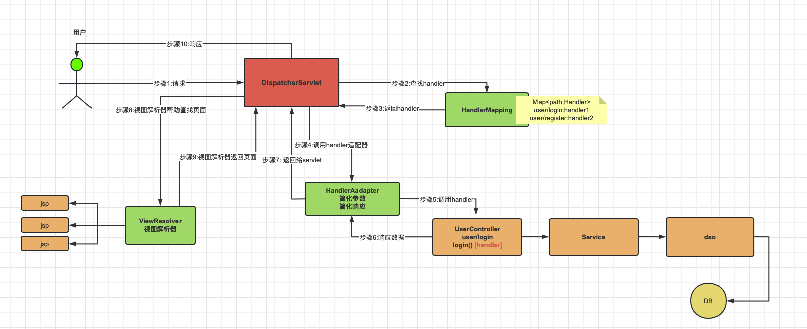

关键步骤拆解（通俗易懂）

1. **请求**：用户向`DispatcherServlet`发送 HTTP 请求；
2. **查找 handler**：`DispatcherServlet`调用`HandlerMapping`，根据请求 URL 匹配对应的 Handler（如`user/login`对应`UserController`的`login()`方法）；
3. **返回 handler**：`HandlerMapping`将匹配到的 Handler 返回给`DispatcherServlet`；
4. **调用 handler 适配器**：`DispatcherServlet`将 Handler 交给`HandlerAdapter`进行适配（统一参数解析、响应格式）；
5. **调用 handler**：`HandlerAdapter`调用目标 Handler（`UserController`的业务方法），Handler 再依次调用`Service`、`Dao`处理业务逻辑；
6. **响应数据**：Handler 处理完成后，将结果返回给`HandlerAdapter`；
7. **返回给 servlet**：`HandlerAdapter`将处理结果（如`ModelAndView`）返回给`DispatcherServlet`；
8. **视图解析器解析查找页面**：`DispatcherServlet`调用`ViewResolver`，根据视图名查找对应的视图文件（如 JSP）；
9. **视图解析器返回页面**：`ViewResolver`将解析后的视图返回给`DispatcherServlet`；
10. **响应**：`DispatcherServlet`将渲染好的视图响应给用户。

特殊场景补充

- **RESTful 接口**：Handler 返回 JSON/XML 时，HandlerAdapter（如 RequestResponseBodyMethodProcessor）直接将数据转为响应体，跳过 ViewResolver 和视图渲染步骤；
- **拦截器执行**：拦截器的`preHandle`在 Handler 执行前触发，`postHandle`在 ModelAndView 返回后触发，`afterCompletion`在响应返回后触发；
- **异常处理**：请求过程中抛出的异常，由 ExceptionResolver 统一捕获并处理（如返回错误页面 / JSON）。

核心总结

1. **核心逻辑**：DispatcherServlet 作为 “总指挥”，协调各组件完成请求处理，解耦请求接收、处理、响应各环节；
2. **关键特性**：HandlerMapping 实现 URL 与方法解耦，HandlerAdapter 实现不同处理器适配，ViewResolver 实现视图解耦；
3. **核心价值**：标准化请求处理流程，简化 Web 开发，支持灵活扩展（如自定义拦截器、视图解析器）。
