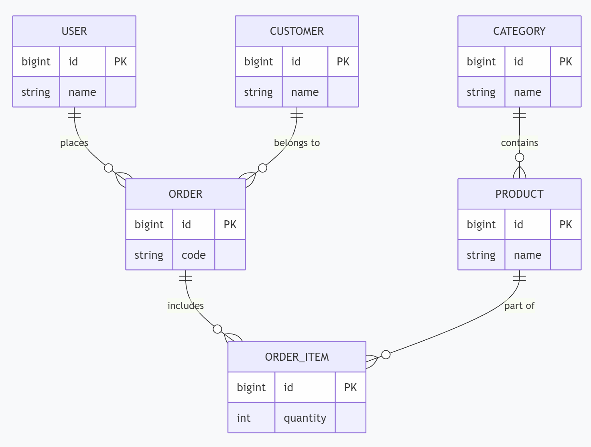

# 02_进销存系统_数据库介绍

[TOC]

## 一、数据库概述

本项目采用 **MySQL 8.0+** 作为关系型数据库。
*   **数据库名**：`lite_ims`  通过 `lite_ims.sql` 脚本，导入表和数据。
*   **字符集**：`utf8mb4` (支持 Emoji)
*   **排序规则**：`utf8mb4_unicode_ci`

所有表均遵循以下设计规范：
1.  **主键**：`id` (BIGINT)，采用 **AUTO_INCREMENT** 自增策略。
2.  **逻辑删除**：包含 `is_deleted` 字段 (0=正常, 1=删除)，MyBatis-Plus 自动处理。
3.  **时间戳**：包含 `create_time` 字段，默认当前时间。

## 二、E-R 图 (实体关系图)

以下展示了系统中核心表之间的关联关系：

```text
## 数据库关系描述

- SYS_USER (1) → (N) SALE_ORDER: 一个用户可以创建多个订单
- CUSTOMER (1) → (N) SALE_ORDER: 一个客户可以下多个订单
- CATEGORY (1) → (N) PRODUCT: 一个类别包含多个产品
- SALE_ORDER (1) → (N) SALE_ORDER_ITEM: 一个订单包含多个订单项
- PRODUCT (1) → (N) SALE_ORDER_ITEM: 一个产品出现在多个订单项中
```



## 三、数据表详解

### 1. 系统用户表 (`sys_user`)

用于存储后台管理员的登录信息。

| 字段名 | 类型 | 长度 | 允许空 | 默认值 | 说明 |
| :--- | :--- | :--- | :--- | :--- | :--- |
| **id** | BIGINT | 20 | NO | AUTO_INCREMENT | 主键 ID |
| username | VARCHAR | 50 | NO | - | 用户名 (唯一) |
| password | VARCHAR | 100 | NO | - | 登录密码 (加密存储) |
| nickname | VARCHAR | 50 | YES | - | 用户昵称 |
| avatar | VARCHAR | 255 | YES | - | 头像 URL |
| email | VARCHAR | 255 | YES |  | 电子邮件 |
| create_time | DATETIME | - | YES | CURRENT_TIMESTAMP | 创建时间 |
| update_time | DATETIME | - | YES | CURRENT_TIMESTAMP | 修改时间 |
| is_deleted | TINYINT | 4 | YES | 0 | 逻辑删除 (0:正常, 1:删除) |

### 2. 商品分类表 (`category`)

用于对商品进行归类管理。

| 字段名 | 类型 | 长度 | 允许空 | 默认值 | 说明 |
| :--- | :--- | :--- | :--- | :--- | :--- |
| **id** | BIGINT | 20 | NO | AUTO_INCREMENT | 主键 ID |
| name | VARCHAR | 50 | NO | - | 分类名称 |
| description | VARCHAR | 255 | YES | - | 分类描述 |
| sort | INT | 11 | YES | 0 | 排序值 (越小越靠前) |
| create_time | DATETIME | - | YES | CURRENT_TIMESTAMP | 创建时间 |
| update_time | DATETIME | - | YES | CURRENT_TIMESTAMP | 修改时间 |
| is_deleted | TINYINT | 4 | YES | 0 | 逻辑删除 (0:正常, 1:删除) |

### 3. 商品表 (`product`)

存储商品的核心信息，关联分类表。

| 字段名 | 类型 | 长度 | 允许空 | 默认值 | 说明 |
| :--- | :--- | :--- | :--- | :--- | :--- |
| **id** | BIGINT | 20 | NO | AUTO_INCREMENT | 主键 ID |
| category_id | BIGINT | 20 | NO | - | **外键**：关联 `category.id` |
| name | VARCHAR | 100 | NO | - | 商品名称 |
| price | DECIMAL | 10,2 | NO | - | 销售单价 |
| stock | INT | 11 | YES | 0 | 当前库存数量 |
| status | TINYINT | 4 | YES | 1 | 状态：1-上架，0-下架 |
| create_time | DATETIME | - | YES | CURRENT_TIMESTAMP | 创建时间 |
| update_time | DATETIME | - | YES | CURRENT_TIMESTAMP | 修改时间 |
| is_deleted | TINYINT | 4 | YES | 0 | 逻辑删除 (0:正常, 1:删除) |

### 4. 客户表 (`customer`)

存储购买商品的客户信息。

| 字段名 | 类型 | 长度 | 允许空 | 默认值 | 说明 |
| :--- | :--- | :--- | :--- | :--- | :--- |
| **id** | BIGINT | 20 | NO | AUTO_INCREMENT | 主键 ID |
| name | VARCHAR | 50 | NO | - | 客户姓名(某某科技有限公司) |
| contact | VARCHAR | 8 | NO | - | 联系人 |
| phone | VARCHAR | 20 | YES | - | 联系电话 |
| address | VARCHAR | 255 | YES | - | 联系地址 |
| email | VARCHAR | 100 | YES | - | 电子邮箱 |
| create_time | DATETIME | - | YES | CURRENT_TIMESTAMP | 创建时间 |
| update_time | DATETIME | - | YES | CURRENT_TIMESTAMP | 修改时间 |
| is_deleted | TINYINT | 4 | YES | 0 | 逻辑删除 (0:正常, 1:删除) |

### 5. 销售订单主表 (`sale_order`)

存储订单的总体信息，如客户、总金额、状态等。

| 字段名 | 类型 | 长度 | 允许空 | 默认值 | 说明 |
| :--- | :--- | :--- | :--- | :--- | :--- |
| **id** | BIGINT | 20 | NO | AUTO_INCREMENT | 主键 ID |
| order_no | VARCHAR | 50 | NO | - | 订单编号 (唯一) |
| customer_id | BIGINT | 20 | NO | - | **外键**：关联 `customer.id` |
| user_id | BIGINT | 20 | YES | - | 操作员 ID (关联 `sys_user.id`) |
| total_amount | DECIMAL | 12,2 | NO | - | 订单总金额 |
| status | TINYINT | 4 | YES | 0 | 状态：0-待处理，1-已完成，2-已取消 |
| create_time | DATETIME | - | YES | CURRENT_TIMESTAMP | 创建时间 |
| update_time | DATETIME | - | YES | CURRENT_TIMESTAMP | 修改时间 |
| is_deleted | TINYINT | 4 | YES | 0 | 逻辑删除 (0:正常, 1:删除) |

### 6. 销售订单明细表 (`sale_order_item`)

存储订单中包含的具体商品列表。

| 字段名 | 类型 | 长度 | 允许空 | 默认值 | 说明 |
| :--- | :--- | :--- | :--- | :--- | :--- |
| **id** | BIGINT | 20 | NO | AUTO_INCREMENT | 主键 ID |
| order_id | BIGINT | 20 | NO | - | **外键**：关联 `sale_order.id` |
| product_id | BIGINT | 20 | NO | - | **外键**：关联 `product.id` |
| price | DECIMAL | 10,2 | NO | - | 下单时的商品单价 (快照) |
| quantity | INT | 11 | NO | - | 购买数量 |
| amount | DECIMAL | 12,2 | NO | - | 小计金额 (= price * quantity) |
| create_time | DATETIME | - | YES | CURRENT_TIMESTAMP | 创建时间 |
| update_time | DATETIME | - | YES | CURRENT_TIMESTAMP | 修改时间 |
| is_deleted | TINYINT | 4 | YES | 0 | 逻辑删除 (0:正常, 1:删除) |
