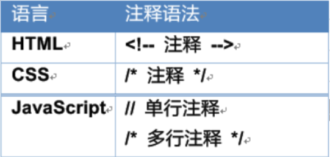
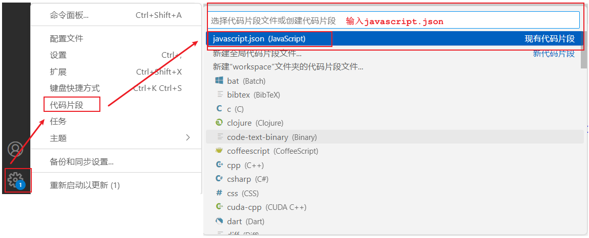
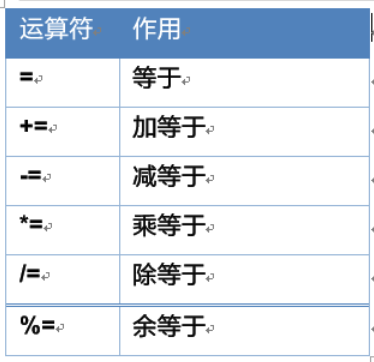
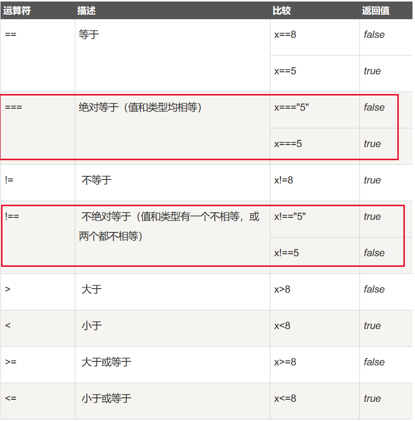
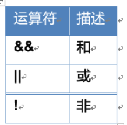
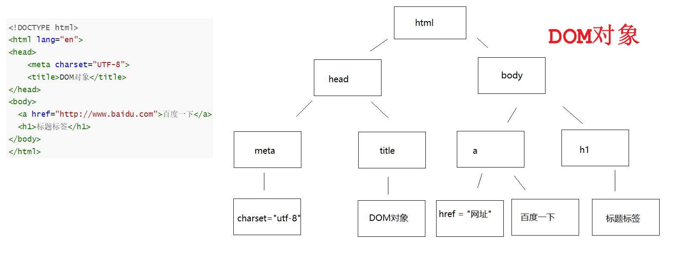
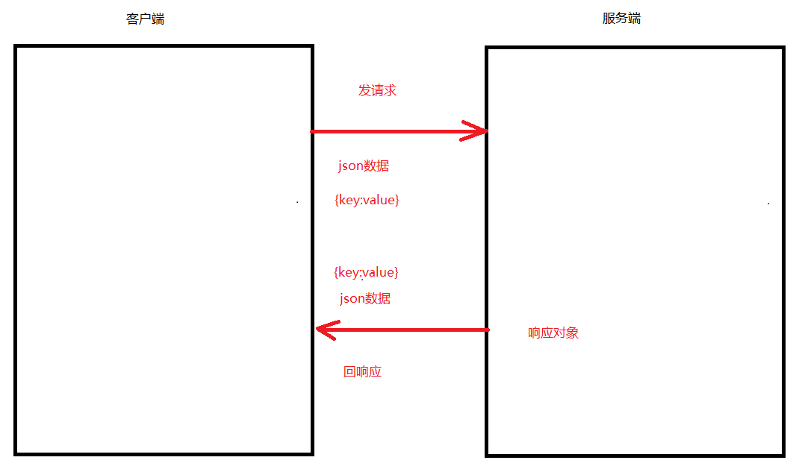

# day02.JavaScript脚本语言

# 第一章.JS介绍

```java
1.脚本语言：JavaScript是一种解释型的脚本语言。不同于C、C++、Java等语言先编译后执行,	JavaScript不会产生编译出来的字节码文件，而是在程序的运行过程中对源文件逐行进行解释；

2.基于对象：JavaScript是一种基于对象的脚本语言，它不仅可以创建对象，也能使用现有的对象。但是面向对象的三大特性：『封装』、『继承』、『多态』中，JavaScript能够实现封装，可以模拟继承，不支持多态，所以它不是一门面向对象的编程语言；

3.弱类型：JavaScript中也有明确的数据类型，但是声明一个变量后它可以接收任何类型的数据，并且会在程序执行过程中根据上下文自动转换类型；

4.事件驱动：JavaScript是一种采用事件驱动的脚本语言，它不需要经过Web服务器就可以对用户的输入做出响应；

5.跨平台性：JavaScript脚本语言不依赖于操作系统，仅需要浏览器的支持。因此一个JavaScript脚本在编写后可以带到任意机器上使用，前提是机器上的浏览器支持JavaScript脚本语言。目前JavaScript已被大多数的浏览器所支持；
```

## 1.什么是JS

```JAVA
1.概述:写在页面上的脚本语言
2.作用:让页面动起来,提高用户的体验,提高页面和用户的交互性
```


## 2.JS三大组成部分

| 组成部分    | 作用                                                         |
| ----------- | ------------------------------------------------------------ |
| ECMA Script | 所有脚本语言规范，构成了js的语法基础                         |
| BOM         | Browser Object Model 浏览器对象模型，用来操作浏览器中各个对象 |
| DOM         | Document Object Model 文档对象模型，用来操作网页中的各个元素(标签)<br/>获取标签      操作标签属性(获取属性的值，或者为属性赋值)     操作标签体的文本部分 |

## 3.网页中各技术的作用

| 技术 | 作用                            |
| ---- | ------------------------------- |
| html | 构建网页,展示数据               |
| css  | 美化页面                        |
| js   | 让页面动起来,提高和用户的互动性 |

# 第二章.JS入门

## 1.案例入门

```java
需求:
  使用js在网页上输出5个HelloWorld
```

```html
<!DOCTYPE html>
<html lang="en">
<head>
    <meta charset="UTF-8">
    <title>js入门</title>
</head>
<body>

</body>

<script>
    for (var i = 0; i < 5; i++) {
        //在浏览器的控制台上输出
        console.log("helloworld");
    }
</script>
</html>
```

> script标签放哪里都可以

## 2.JS注释



# 第三章.JS的两种引入方式

## 1.script代码引入1_内部引入

```html
1.内部引入:在html中使用script标签
  <script>
     js代码
  </script>
```

```html
<!DOCTYPE html>
<html lang="en">
<head>
    <meta charset="UTF-8">
    <title>js入门</title>
</head>
<body>

</body>

<script>
    for (var i = 0; i < 5; i++) {
        //在浏览器的控制台上输出
        console.log("helloworld");
    }
</script>
</html>
```

## 2.script代码引入2_外部引入

```java
1.创建一个js文件，在js文件中写js代码，然后在当前页面引入js文件
  <script src = "js文件地址"></script>
```

```js
for (var i = 0; i < 5; i++) {
    //在浏览器的控制台上输出
    console.log("helloworld"+i);
}
```

```html
<!DOCTYPE html>
<html lang="en">
<head>
    <meta charset="UTF-8">
    <title>js入门</title>
</head>
<body>

</body>

<!--<script>
    for (var i = 0; i < 5; i++) {
        //在浏览器的控制台上输出
        console.log("helloworld");
    }
</script>-->

<!--
  外部引入
-->
<script src = "../js/demo01js.js"></script>
</html>
```

# 第四章.JS的三种输出方式


```java
1.alert("内容") -> 以弹框的形式输出，有阻塞效果，弹框不完事，后面代码不会执行
2.document.write("输出内容") -> 页面输出
3.console.log("输出内容") -> 浏览器控制台输出

4.三种输出方式的区别:
  alert和console.log如果输出内容中是标签,标签不生效
  document.write()如果输出内容是标签,标签是生效的
```

```html
<!DOCTYPE html>
<html lang="en">
<head>
    <meta charset="UTF-8">
    <title>三种输出方式</title>
</head>
<body>

</body>
<script>
/*    alert("弹框输出");
    document.write("页面输出");
    console.log("浏览器控制台输出");*/

alert("<h1>弹框输出</h1>");
document.write("<h1>弹框输出</h1>");
console.log("<h1>弹框输出</h1>");
</script>
</html>
```

> 在vscode软件中添加代码块快捷键:
>
> 
>
> ```java
> "Print to console": {
> 	"prefix": "log",
> 	"body": [
> 		"console.log($1);"
> 	],
> 	"description": "Log output to console"
> },
>
> "Print out fori": {
> 	"prefix": "fori",
> 	"body": [
> 		"for (var i = 0; i < $1; i++) {",
> 		"   $2$0",
> 		"}"
> 	],
> 	"description": "Output Loop 'fori'"
> },
>
> "Print out dw": {
> 	"prefix": "dw",
> 	"body": [
> 		"document.write($2$0);"
> 	],
> 	"description": "Output Loop 'dw'"
> }
> ```

# 第五章.JS的基本使用

## 1.JS的数据类型

```java
1.java中的数据类型分为:基本类型(4类8种)和引用类型(类,数组,接口,枚举,注解,Record)
2.但是js中不用分那么细,js中的类型有6种
3.如何判断类型:
  typeof 变量名
```

| 关键字    | 说明                    |
| --------- | ----------------------- |
| number    | 数字类型                |
| boolean   | 布尔型:true或者false    |
| string    | 字符串类型:  ""  ''  `` |
| object    | 对象类型                |
| undefined | 未定义类型              |
| function  | 函数类型                |

```HTML
<!DOCTYPE html>
<html lang="en">
<head>
    <meta charset="UTF-8">
    <title>js数据类型</title>
</head>
<body>

</body>
<script>
    //number
    var a = 10;
    console.log(typeof a);

    // string
    var b = "hello world";
    b = 'hahah';
    b = `aaa`;
    console.log(typeof b);

    //boolean
    var c = true;
    console.log(typeof c);

    //object
    var d = {username:"张三",age:18};
    console.log(typeof d);
    console.log(typeof null);

    // undefined
    var e;
    console.log(typeof e);

    // function
    function f() {}
    console.log(typeof f);
</script>
</html>
```

> | null与undefined的区别 | 说明                                |
> | --------------------- | ----------------------------------- |
> | null                  | 属于object类型,但是没有我们想要的值 |
> | undefined             | 没有为其赋值                        |

## 2.JS的变量定义

```java
1.定义格式:  var  let  const(相当于java中的final,定义常量的)
  var 变量名 = 值
  let 变量名 = 值
  const 变量名 = 值
```

```html
<!DOCTYPE html>
<html lang="en">
<head>
    <meta charset="UTF-8">
    <title>变量的定义</title>
</head>
<body>

</body>
<script>
    var a = 10;
    console.log(a);
    let b = 20;
    console.log(b);
    const c = 30;
    //c = 40; const定义的变量不能二次赋值
    console.log(c);
</script>
</html>
```

> var和let的区别:
>
> ```java
> var的作用范围大
> let的作用范围小
> ```
>
> ```html
> <!DOCTYPE html>
> <html lang="en">
> <head>
>     <meta charset="UTF-8">
>     <title>var和let的区别</title>
> </head>
> <body>
>
> </body>
> <script>
>     /*   for (var i = 0; i < 10; i++) {
>             console.log("helloworld");
>         }
>         console.log(i);*/
>
>     for (let i = 0; i < 10; i++) {
>         console.log("helloworld");
>     }
>     console.log(i);
> </script>
> </html>
> ```

## 3.常用的运算符

### 3.1.算术运算符(和java语言一样)

算术运算符用于执行两个变量或值的算术运算

### 3.2.赋值运算符(和Java一样)

赋值运算符用于给JavaScript 变量赋值



### 3.3.比较运算符

比较运算符用于逻辑语句的判断，从而确定给定的两个值或变量是否相等。



数字可以与字符串进行比较，字符串可以与字符串进行比较。字符串与数字进行比较的时候会先把字符串转换成数字然后再进行比较

```html
<!DOCTYPE html>
<html lang="en">
<head>
    <meta charset="UTF-8">
    <title>js运算符</title>
</head>
<body>

</body>
<script>
    let a = "10";
    let b = 10;
    console.log(a==b);//比较值
    console.log(a===b);//比较类型和值
</script>
</html>
```

### 3.4.逻辑运算符(跟Java一样)

逻辑运算符用来确定变量或值之间的逻辑关系，支持短路运算



js中逻辑运算符不存在单与&、单或|

### 3.5.三元运算符(跟java一样)


### 3.6.小结

- 运算符 === 有什么作用？

  ```java
  恒等于,既比较值,还比较类型
  ```

## 4.JS流程控制语句

```java
js中的for,while,if,switch和Java一样,不再阐述
```

## 5.JS内置对象_数组

### 5.1.Array数组

#### 5.1.1.数组的定义

```java
1.var/let 数组名 = new Array() -> 创建一个长度为0的空数组
2.var/let 数组名 = new Array(长度) -> 创建一个指定长度的空数组
3.var/let 数组名 = new Array(元素1,元素2...) -> 创建一个有指定元素的数组
4.var/let 数组名 = [元素1,元素2...] ->创建数组,直接给元素->简化形式
```

```html
<!DOCTYPE html>
<html lang="en">
<head>
    <meta charset="UTF-8">
    <title>js中的数组</title>
</head>
<body>

</body>
<script>
    //1.var/let 数组名 = new Array() -> 创建一个长度为0的空数组
    var arr1 = new Array();
    console.log(arr1);
    //2.var/let 数组名 = new Array(长度) -> 创建一个指定长度的空数组
    var arr2 = new Array(5);
    console.log(arr2.length);
    //3.var/let 数组名 = new Array(元素1,元素2...) -> 创建一个有指定元素的数组\
    var arr3 = new Array("hello","world","javascript");
    console.log(arr3);
    //4.var/let 数组名 = [元素1,元素2...] ->创建数组,直接给元素->简化形式
    var arr4 = ["hello","world","javascript"];
    console.log(arr4);
</script>
</html>
```

#### 5.1.2.数组特点

```java
1.js中数组中的元素类型可以不一致
2.js中的数组定义完之后,后续可以改变长度
3.js中的数组里面有函数
```

```html
<!DOCTYPE html>
<html lang="en">
<head>
    <meta charset="UTF-8">
    <title>js中的数组</title>
</head>
<body>

</body>
<script>
   var arr = [1,"true",true];
   console.log(arr);

   arr[3] = "涛哥";
   console.log(arr);
</script>
</html>
```

#### 5.1.3.数组的函数

```java
concat(数组)数组拼接
reverse()->数组反转
join(规则):将一个数组通过分隔符拼接成一个字符串,与字符串中的split功能相反
sort()排序，根据字符集进行排序。如果希望通过数值大小排序，需要给sort函数传递比较器：sort((a, b) => a - b)
pop():删除数组中最后一个元素,返回的是被删除的元素
push():往数组最后添加一个或者多个元素
```

```html
<!DOCTYPE html>
<html lang="en">
<head>
    <meta charset="UTF-8">
    <title>js中数组的方法</title>
</head>
<body>

</body>
<script>
    var arr1 = [1,2,3,4,5];
    var arr2 = [6,7,8,9,10];
    //concat(数组)数组拼接
    var arr3 = arr1.concat(arr2);
    console.log(arr3);
    //reverse()->数组反转
    var arr4 = arr3.reverse();
    console.log(arr4);
    //join(规则):将一个数组通过分隔符拼接成一个字符串,与字符串中的split功能相反
    var arr5 = arr4.join("-");
    console.log(arr5);
    //sort()排序
    var arr6 = [7,6,5,4,3];
    var numbers = arr6.sort();
    console.log(numbers);
    //pop():删除数组中最后一个元素,返回的是被删除的元素
    var arr7 = [1,2,3,4,5,6,7,8,9];
    var pop = arr7.pop();
    console.log(pop);
    console.log(arr7);
    //push():往数组最后添加一个或者多个元素
    var arr8 = [1,2,3,4,5,6,7,8,9];
    arr8.push(10,10,10);
    console.log(arr8)
</script>
</html>
```

#### 5.1.4.数组的遍历

```java
1.普通for遍历
  for(var i = 0;i<数组名.length;i++){

  }

2.增强for遍历:
  for(var 变量名 of 数组名){

  }
```

```html
<!DOCTYPE html>
<html lang="en">
<head>
    <meta charset="UTF-8">
    <title>数组的遍历</title>
</head>
<body>

</body>
<script>
    var arr = [1,2,3,4,5];
    for (var i = 0; i < arr.length; i++) {
        console.log(arr[i]);
    }

    console.log("===================");
    for (var i of arr) {
        console.log(i);
    }
</script>
</html>
```

## 6.JS函数

### 6.1.函数介绍

```java
1.概述:相当于java中的方法
2.分类:
  a.命名函数:函数有函数名
    function 函数名(参数){
      方法体
    }
  b.匿名函数:没有函数名
    function(参数){
      方法体
    }
3.注意:
  a.js中的函数,参数不需要指定数据类型,连var都不要,直接写参数名即可
  b.js中的函数不需要声明具体的返回值类型,有没有返回值取决于方法体中写不写return
```

### 6.2.函数定义方式1_命名函数

```java
function 函数名(参数){
  方法体
}
```

```html
<!DOCTYPE html>
<html lang="en">
<head>
    <meta charset="UTF-8">
    <title>命名函数</title>
</head>
<body>

</body>
<script>
    //无参无返回值
    function method01(){
        console.log("无参无返回值");
    }
    method01();

    //有参无返回值
    function method02(a,b){
        console.log("有参无返回值");
    }
    method02(1,2);

    //无参有返回值
    function method03(){
        return "无参有返回值";
    }
    console.log(method03());

    //有参有返回值
    function method04(a,b){
        return "有参有返回值";
    }
    console.log(method04(1,2));
</script>
</html>
```

### 6.3.函数定义方式2_匿名函数

```java
function(参数){
  方法体
}

注意:匿名函数单独使用没有意义,都是和js事件绑定在一起使用的
```

```html
<!DOCTYPE html>
<html lang="en">
<head>
    <meta charset="UTF-8">
    <title>匿名函数</title>
</head>
<body>

</body>
<script>
    var method = function(){
        console.log("helloworld");
    }
    method();
</script>
</html>
```

### 6.4.JS函数没有重载

```java
js中的函数没有方法的重载,如果函数名相同,后面的会把前面的函数覆盖掉
```

```html
<!DOCTYPE html>
<html lang="en">
<head>
    <meta charset="UTF-8">
    <title>js中的函数没有重载</title>
</head>
<body>

</body>
<script>
    function method(a,b){
        console.log("两个参数的method方法");
    }
    function method(a,b,c){
        console.log("三个参数的method方法");
    }

    method(1,2);

</script>
</html>
```

# 第六章.BOM对象

```java
BOM:浏览器对象模型,主要操作浏览器上的控件的
```

## 1.BOM内置对象_window对象

### 1.1.确认框弹窗

```java
1.confirm("确认框的提示信息") -> 结果是boolean型的
  a.如果点击确认按钮,此函数返回true
  b.如果点击取消按钮,此函数返回false
```

```html
<!DOCTYPE html>
<html lang="en">
<head>
    <meta charset="UTF-8">
    <title>确认框</title>
</head>
<body>

</body>
<script>
    var result = confirm("是否删除？");
    if(result){
        alert("删除成功");
    }else{
        alert("取消删除");
    }
</script>
</html>
```

### 1.2.操作地址栏_页面跳转

```java
location.href = "地址" ->控制浏览器地址栏的
```

```html
<!DOCTYPE html>
<html lang="en">
<head>
    <meta charset="UTF-8">
    <title>地址栏</title>
</head>
<body>

</body>
<script>
    function method(){
        location.href="http://www.atguigu.com";
    }
    method();
</script>
</html>
```

> 使用window对象中的方法，可以省略window

# 第七章.DOM对象

```java
1.概述:文档对象模型
2.作用:操作html页面上的标签的
  a.操作标签的属性 -> 获取属性值,为属性赋值
  b.操作标签的标签体-> 获取标签体,为标签体赋值
```

```html
<!DOCTYPE html>
<html lang="en">
<head>
    <meta charset="UTF-8">
    <title>DOM对象</title>
</head>
<body>
  <a href="http://www.baidu.com">百度一下</a>
  <h1>标题标签</h1>
</body>
</html>
```



## 1.DOM对象_查找标签方法

```java
document.getElementById("id")   根据标签中的id值获取标签对象,由于id要求唯一,所以返回单个标签对象
document.getElementsByTagName("标签名")  根据标签名,获取一组标签,返回的是数组
document.getElementsByName("name属性值")  根据标签中的name的属性值获取标签对象,返回数组
document.getElementsByClassName("class属性值")根据标签中的class的值获取一组标签,返回的是数组
```

```html
<!DOCTYPE html>
<html lang="en">
<head>
    <meta charset="UTF-8">
    <title>获取标签对象</title>
</head>
<body>
<div id="d1">根据id获取标签对象</div>

<div>根据标签名获取标签对象1</div>
<div>根据标签名获取标签对象2</div>

<div name="divName">根据name值获取标签对象1</div>
<div name="divName">根据name值获取标签对象2</div>

<div class="divClass">根据class值获取标签对象1</div>
<div class="divClass">根据class值获取标签对象2</div>
</body>

<script>
    //document.getElementById("id")   根据标签中的id值获取标签对象,由于id要求唯一,所以返回单个标签对象
    var div1 = document.getElementById("d1");
    console.log(div1);
    console.log("======================");
    //document.getElementsByTagName("标签名")  根据标签名,获取一组标签,返回的是数组
    let arrDiv = document.getElementsByTagName("div");
    for (let arrDivElement of arrDiv) {
        console.log(arrDivElement);
    }
    console.log("======================");
    //document.getElementsByName("name属性值")  根据标签中的name的属性值获取标签对象,返回数组
    let arrDivName = document.getElementsByName("divName");
    for (let arrDivNameElement of arrDivName) {
        console.log(arrDivNameElement);
    }
    console.log("======================");
    //document.getElementsByClassName("class属性值")根据标签中的class的值获取一组标签,返回的是数组
    let arrDivClass = document.getElementsByClassName("divClass");
    for (let arrDivClassElement of arrDivClass) {
        console.log(arrDivClassElement);
    }
</script>
</html>
```

```java
扩展:
document.querySelector(CSS选择器)  通过css选择器获取一个标签.如:"#id",".类名","标签名"
document.querySelectorAll(CSS选择器) 通过css选择器获取一组标签,返回数组
```

```html
<!DOCTYPE html>
<html lang="en">
<head>
    <meta charset="UTF-8">
    <title>获取标签对象</title>
</head>
<body>
<div id="d1">根据id获取标签对象</div>

<div>根据标签名获取标签对象1</div>
<div>根据标签名获取标签对象2</div>

<div name="divName">根据name值获取标签对象1</div>
<div name="divName">根据name值获取标签对象2</div>

<div class="divClass">根据class值获取标签对象1</div>
<div class="divClass">根据class值获取标签对象2</div>
</body>

<script>
    //document.querySelector(CSS选择器)  通过css选择器获取一个标签.如:"#id",".类名","标签名"
    var d1 = document.querySelector("#d1");
    console.log(d1);
    //document.querySelectorAll(CSS选择器) 通过css选择器获取一组标签,返回数组
    var divs = document.querySelectorAll("div");
    for (var div1 of divs) {
        console.log(div1);
    }
</script>
</html>
```

## 2.属性操作

| 需求           | 操作方式                 |
| -------------- | ------------------------ |
| 为标签属性赋值 | 标签对象.属性名 = 属性值 |
| 获取标签属性值 | 标签对象.属性名          |

```html
<!DOCTYPE html>
<html lang="en">
<head>
    <meta charset="UTF-8">
    <title>操作标签属性</title>
</head>
<body>
<a href="http://www.baidu.com" id="a1">百度</a>
</body>

<script>
     var aElement = document.getElementById("a1");
     //获取属性值
     let href1 = aElement.href;
     console.log(href1);
     //设置属性值
      aElement.href = "http://www.atguigu.com";
</script>
</html>
```

## 3.标签体操作

| 需求         | 操作方式                                                     |
| ------------ | ------------------------------------------------------------ |
| 获取标签体   | 标签对象.innerHTML<br>标签对象.innerText                     |
| 为标签体赋值 | 标签对象.innerHTML = 标签体内容<br/>标签对象.innerText = 标签体内容 |

```java
innerText和innerHTML区别:
  相同点:都可以操作标签体
  不同点:如果使用innerText给标签体设置子标签,是不生效的
        如果使用innerHTML给标签体设置子标签,会生效
```

```html
<!DOCTYPE html>
<html lang="en">
<head>
    <meta charset="UTF-8">
    <title>操作标签体</title>
</head>
<body>
  <span id="s1">我是span1</span>
  <span id="s2"></span>
  <span id="s3"></span>
  <span id="s4"></span>
  <span id="s5"></span>
</body>
<script>

</script>
</html>
```

```html
<!DOCTYPE html>
<html lang="en">
<head>
    <meta charset="UTF-8">
    <title>操作标签体</title>
</head>
<body>
<span id="s1">我是span1</span>
<span id="s2"></span>
<span id="s3"></span>
<span id="s4"></span>
<span id="s5"></span>
</body>
<script>
   var span1 = document.getElementById("s1");
   //获取标签体
   let innerHTML1 = span1.innerHTML;
   console.log(innerHTML1);
   var innerText1 = span1.innerText;
   console.log(innerText1);

   //为标签体赋值
   var span2 = document.getElementById("s2");
   span2.innerHTML = "我是span2";
   var span3 = document.getElementById("s3");
   span3.innerText = "我是span3";

   var span4 = document.getElementById("s4");
   span4.innerHTML = "<h1>我是span4</h1>";

   var span5 = document.getElementById("s5");
   span5.innerText = "<h1>我是span5</h1>";
</script>
</html>
```

## 4.标签添加和删除

| API                                      | 功能                                                         |
| ---------------------------------------- | ------------------------------------------------------------ |
| document.createElement("标签名")         | 创建元素节点并返回被创建的标签对象，但不会自动添加到文档中,需要用到appendChild函数将创建的标签添加到指定的标签中 |
| 标签对象.appendChild(ele)                | 将ele添加到标签对象所有子节点后面                            |
| parentEle.insertBefore(newEle,targetEle) | 将newEle插入到targetEle前面-> parentEle指的是父标签          |
| parentEle.replaceChild(newEle, oldEle)   | 用新节点替换原有的旧子节点 -> parentEle指的是父标签          |
| element.remove()                         | 删除某个标签,element指的是要删除的标签对象                   |

```html
<!DOCTYPE html>
<html lang="en">
<head>
    <meta charset="UTF-8">
    <title>标签添加和删除</title>
</head>
<body>
  <ul id="city">
    <li id="bj">北京</li>
    <li id="sh">上海</li>

    <li id="sz">深圳</li>
    <li id="gz">广州</li>
  </ul>
</body>

<script>
  /*
    需求1:创建li标签,标签体为"西安"
         将li标签放到ul标签中
   */


  /*
     需求2:将"西安"添加到深圳前面
  */


  /*
     需求3:用"西安"替换"深圳"
  */


  /*
     需求4:删除上海这个标签
  */

</script>
</html>
```

```html
<!DOCTYPE html>
<html lang="en">
<head>
    <meta charset="UTF-8">
    <title>标签的添加和删除</title>
</head>
<body>
<ul id="city">
    <li id="bj">北京</li>
    <li id="sh">上海</li>

    <li id="sz">深圳</li>
    <li id="gz">广州</li>
</ul>
</body>

<script>
    /*
      需求1:创建li标签,标签体为"西安"
           将li标签放到ul标签中
     */
    let xaElement = document.createElement("li");
    xaElement.innerHTML = "西安";
    var ulElement = document.getElementById("city");
    ulElement.appendChild(xaElement);
    /*
       需求2:将"西安"添加到深圳前面
    */
    let szElement = document.getElementById("sz");
    ulElement.insertBefore(xaElement,szElement);

    /*
       需求3:用"西安"替换"深圳"
    */
    ulElement.replaceChild(xaElement,szElement);

    /*
       需求4:删除上海这个标签
    */
    let shElement = document.getElementById("sh");
    //ulElement.removeChild(shElement);
    shElement.remove();

</script>
</html>
```

# 第八章_JS事件

## 1.JS事件介绍

```java
1.作用:用于监听用户在页面上做的操作的
2.大白话解释:
  我们在页面上做的操作都对应一个事件, 至于操作被事件监听到了之后要干啥,需要让这个事件绑定的一个函数,在函数中实现具体的操作
```

## 2.设置JS事件的两种方式

```javascript
1.在标签上绑定事件,让其调用一个函数,在下面实现这个函数
  <input type = "button" value="普通按钮" 事件名 = "函数名()"/>
  <script>
      function 函数名(){

      }
  </script>
2.先获取标签对象,然后绑定某个事件,然后让这个事件再绑定一个匿名函数
  document.getElementById("标签中的id属性值").事件 = function(){
      方法体
  }
```

```html
<!DOCTYPE html>
<html lang="en">
<head>
    <meta charset="UTF-8">
    <title>事件初体验</title>
</head>
<body>
<input type="button" value="命名函数" id="b1" onclick="method01()"/><br/>
<input type="button" value="匿名函数" id="b2"/><br/>
</body>

<script>

</script>
</html>
```

```html
<!DOCTYPE html>
<html lang="en">
<head>
    <meta charset="UTF-8">
    <title>事件的初体验</title>
</head>
<body>
  <input type="button" value="命名函数" id="b1" onclick="method01()"/><br/>
  <input type="button" value="匿名函数" id="b2"/><br/>
</body>
<script>
    function method01(){
        alert("命名函数");
    }

    document.getElementById("b2").ondblclick = function(){
        alert("匿名函数");
    }
</script>
</html>
```

## 3.鼠标点击事件

```java
onclick:单击事件
ondblclick:双击事件
```

```html
<!DOCTYPE html>
<html lang="en">
<head>
    <meta charset="UTF-8">
    <title>点击事件</title>
</head>
<body>
姓名:<input type="text" id="t1"><br/>
姓名:<input type="text" id="t2"><br/>
<input type="button" value="单击复制/双击清除" id="b1"/>
</body>
<script>

</script>
</html>
```

```html
<!DOCTYPE html>
<html lang="en">
<head>
    <meta charset="UTF-8">
    <title>点击事件</title>
</head>
<body>
姓名:<input type="text" id="t1"><br/>
姓名:<input type="text" id="t2"><br/>
<input type="button" value="单击复制/双击清除" id="b1"/>
</body>
<script>
    document.getElementById("b1").onclick = function(){
        var t1 = document.getElementById("t1");
        var t2 = document.getElementById("t2");
        t2.value = t1.value;
    }

    document.getElementById("b1").ondblclick = function(){
        var t1 = document.getElementById("t1");
        var t2 = document.getElementById("t2");
        t1.value = "";
        t2.value = "";
    }
</script>
</html>
```

## 4.焦点事件

```java
onfocus:得到焦点
onblur:失去焦点
```

```html
<!DOCTYPE html>
<html lang="en">
<head>
    <meta charset="UTF-8">
    <title>焦点事件</title>
</head>
<body>
用户名:<input type="text" id="user"/><span id="info" style="color: red"></span>
</body>

<script>
    //得到焦点
     document.getElementById("user").onfocus=function(){
         var spanElement = document.getElementById("info");
         spanElement.innerHTML="";
     }

    //失去焦点
    document.getElementById("user").onblur=function(){
        var spanElement = document.getElementById("info");
        spanElement.innerHTML="用户名不能为空";
    }
</script>
</html>
```

## 5.改变事件

```javascript
1.onchange:改变事件-> 当一个框中的内容改变了,就会触发onchange事件

2.this:
  a.this在哪个标签对象绑定的事件中使用,this就代表哪个标签对象
  b.如果this直接放到标签中使用,那么this就直接代表当前所在标签对象
    <input type = "text" 事件 = "函数名(this)"/>
```

```html
<!DOCTYPE html>
<html lang="en">
<head>
    <meta charset="UTF-8">
    <title>改变事件</title>
</head>
<body>
<select id = "city">
  <option value = "广州">广州</option>
  <option value = "上海">上海</option>
  <option value = "北京">北京</option>
</select>

<hr/>

将字母转成大写:<input type="text" id="user"/>

</body>

<script>

</script>
</html>
```

```html
<!DOCTYPE html>
<html lang="en">
<head>
    <meta charset="UTF-8">
    <title>改变事件</title>
</head>
<body>
<select id = "city">
    <option value = "广州">广州</option>
    <option value = "上海">上海</option>
    <option value = "北京">北京</option>
</select>

<hr/>

将字母转成大写:<input type="text" id="user"/>

</body>

<script>
   document.getElementById("city").onchange = function () {
       alert(this.value);
   }

   //将字母转成大写
   document.getElementById("user").onchange = function () {
       this.value = this.value.toUpperCase();
   }
</script>
</html>
```

# 第九章.JSON

## 1.Json介绍

```java
(JavaScript Object Notation) 是一种轻量级的数据交换格式。它基于 ECMAScript (欧洲计算机协会制定的js规范)的一个子集，采用完全独立于编程语言的文本格式来存储和表示数据。简洁和清晰的层次结构使得 JSON 成为理想的数据交换格式。 易于人阅读和编写，同时也易于机器解析和生成，并有效地提升网络传输效率。
```



## 2.Json的数据格式

```java
1.数组格式：[obj,obj,obj...]，使用中括号包裹，数组的元素可以是任意类型，多个元素之间逗号分开。

2.对象格式：{"key1":obj,"key2":obj,"key3":obj...}，使用大括号包裹，对象采用键值对形式，键必须是字符串类型，值可以是任意类型，多个键值对之间逗号分开。

3.数组和对象之间可以相互嵌套
```

## 3.Json数据解析

### 3.1.json数组

```html
<!DOCTYPE html>
<html lang="en">
<head>
    <meta charset="UTF-8">
    <title>json数组</title>
</head>
<body>

</body>
<script>
    var arr = [1,2,3,4,5];
    for (var number of arr) {
        console.log(number);
    }
</script>
</html>
```

### 3.2.json对象

```html
<!DOCTYPE html>
<html lang="en">
<head>
    <meta charset="UTF-8">
    <title>json对象</title>
</head>
<body>

</body>
<script>
    var person = {name:"tom",age:18};
    console.log(person.name);
    console.log(person.age);
</script>
</html>
```

### 3.3.json数组嵌套对象

```html
<!DOCTYPE html>
<html lang="en">
<head>
    <meta charset="UTF-8">
    <title>数组嵌套对象</title>
</head>
<body>

</body>
<script>
    var arr = [
        {"name":"tom","age":18},
        {"name":"jack","age":19}
    ]

    for (let arrElement of arr) {
        console.log(arrElement.name);
        console.log(arrElement.age);
    }
</script>
</html>
```

### 3.4.json对象嵌套数组

```html
<!DOCTYPE html>
<html lang="en">
<head>
    <meta charset="UTF-8">
    <title>对象嵌套数组</title>
</head>
<body>

</body>
<script>
    var obj = {
        'deptName': '生产部'
        "userList":[
            {"name":"tom","age":18},
            {"name":"jack","age":19}
        ]
    }

    var deptName = obj.deptName;
    var arr = obj.userList;
    for (let element of arr) {
        console.log(element.name);
        console.log(element.age);
    }
</script>
</html>
```

### 3.5.json对象嵌套数组_多个键值对

```html
<!DOCTYPE html>
<html lang="en">
<head>
    <meta charset="UTF-8">
    <title>对象嵌套数组,多个键值对</title>
</head>
<body>

</body>
<script>
    var obj = {
        "key1":[
            {"name":"tom","age":18},
            {"name":"jack","age":19}
        ],
        "key2":[
            {"name":"rose","age":20},
            {"name":"taoge","age":21}
        ]
    }

    var arr = obj.key1;
    for (let element of arr) {
        console.log(element.name);
        console.log(element.age);
    }
    console.log("========================");

    var arr1 = obj.key2;
    for (let element of arr1) {
        console.log(element.name);
        console.log(element.age);
    }
</script>
</html>
```

### 3.6.JSON和字符串之间的转换

#### 3.6.1.json转成string

```js
var jsonObj = {"stuName":"tom","stuAge":20};
var jsonStr = JSON.stringify(jsonObj);

console.log(typeof jsonObj); // object
console.log(typeof jsonStr); // string
```

#### 3.6.2.string转成json

```js
jsonObj = JSON.parse(jsonStr);
console.log(jsonObj); // {stuName: "tom", stuAge: 20}
```

# 第十章.正则表达式

## 1.正则表达式概念

```java
1.什么是正则表达式:字符串表示的匹配规则
2.作用:主要用于校验
3.比如:校验一个QQ号
       a.不能是0开头   if(startsWith("0"))
       b.只能是数字    if(字符>='0' && 字符<='9')
       c.5-15位      if(字符串.length()>=5 && 字符串.length()<=15)

  正则:[1-9][0-9]{4,14}   []代表区间
```

|   表达式    | 描述                                                         |
| :---------: | :----------------------------------------------------------- |
|    [a-z]    | 这个字符必须是小写字母    a-z   [] 代表区间                  |
|    [abc]    | 字符必须是abc                                                |
|    [0-9]    | 这个字符必须是数字                                           |
| [a-zA-Z0-9] | 这个字符必须是字母或者是数字  [a-zA-Z0-9]                    |
|   [^a-z]    | 这个字符不是小写字母           []中写^代表取反               |
|    [\d]     | 等同于[0-9]                                                  |
|    [\w]     | 等同于[a-zA-Z_0-9] 字母、数字、下划线                        |
|    [\D]     | 等同于`[^0-9]`                                               |
|    [\W]     | 等同于`[^a-zA-Z_0-9]`                                        |
|      .      | 代表匹配任意字符， 若只是想代表普通数据`.` 需要使用转义字符来表示`\.` |
|     X*      | X这个字符可以出现零次或者多次 [0-9]*                         |
|     X?      | X这个字符可以出现零次或者一次 [0-9] ?                        |
|     X+      | X这个字符可以出现一次或者多次 [0-9] +                        |
|    X{m}     | X这个字符出现次数正好m次 [0-9]{4}                            |
|   X{m, }    | X这个字符出现次数至少m次 [0-9]{4, }                          |
|   X{m, n}   | X这个字符出现次数至少m次,最多n次 [0-9]{3,5}                  |
|    (X)+     | ()括号代表X所表示的内容作为一组数据出现；()括号后面的+号，代表这组数据可以出现一次或者多次  (abc)+  -->代表的是abc可以连续出现一次或多次 |
|     ^X      | ^匹配开头                                                    |
|     X$      | $匹配结尾                                                    |

> ^如果在[]里面，代表取反
>
> ^如果在[]外面，代表以什么开头
>
> $： 代表以什么什么结尾

## 2.正则表达式的创建和使用

```java
1.定义方式1:
  var 变量名 = /正则表达式/
2.定义方式2:
  var 变量名 = new RegExp("正则表达式")
```

| 说明                                | 方法                               |
| ----------------------------------- | ---------------------------------- |
| 正则表达式.test(被匹配的字符串内容) | 判断字符串是否符合指定的正则表达式 |
| string中的方法:match(正则表达式)    | 根据正则表达式获取对应的字符串内容 |

```html
<!DOCTYPE html>
<html lang="en">
<head>
    <meta charset="UTF-8">
    <title>正则表达式</title>
</head>
<body>

</body>
<script>
    var reg = /^[1-9][0-9]{4,14}$/;
    var b = reg.test("023456789");
    console.log(b);
</script>
</html>
```

## 3.模糊匹配和精确匹配

```html
<!DOCTYPE html>
<html lang="en">
<head>
    <meta charset="UTF-8">
    <title>正则表达式</title>
</head>
<body>

</body>
<script>
    /*
    *   默认是模糊匹配
    * */
    var regex1 = /abcd/;
    var b1 = regex1.test("abcde");
    console.log(b1);

    console.log("===============");
    /*
    * 精准匹配:必须以^开头  $结尾
    * ^:以xxx开头
    * $:以xxx结尾
    * */
    var regex2 = /^abcd$/;
    var b2 = regex2.test("abcde");
    console.log(b2);
</script>
</html>
```

## 4.正则表达式匹配模式

| 修饰符 | 描述             |
| :----- | :--------------- |
| i      | 匹配时忽略大小写 |

```java
var 变量名 = /正则表达式/匹配模式
```

```HTML
<!DOCTYPE html>
<html lang="en">
<head>
    <meta charset="UTF-8">
    <title>正则表达式</title>
</head>
<body>

</body>
<script>
   var regex = /^abcd$/i;
   var b = regex.test("ABCD");
   console.log(b);
</script>
</html>
```

## 5.常用正则表达式

| 需求     | 正则表达式                                          | 含义                                                         |
| -------- | --------------------------------------------------- | ------------------------------------------------------------ |
| 用户名   | /^[a-zA-Z_][a-zA-Z_-0-9]{5,9}$/                     | 只能以字母或者'_'开头，后面的内容可以是字母、数字、'_'、'-'都行，整个字符串只能有6-10位 |
| 密码     | /^[a-zA-Z0-9_-\@#&*]{6,12}$/                        | 密码只能由字母、数字、'_'、'-'、'@'、'#'、'\'、'&'、'*'组成，总共是6-12位 |
| 前后空格 | /^\s+\|\s+$/g                                       | 匹配开头的空格或者结尾的空格                                 |
| 电子邮箱 | /^[a-zA-Z0-9_.-]+@([a-zA-Z0-9-]+[.]{1})+[a-zA-Z]+$/ | 多个字母、数字、'.'、'-'加上@多个数字、字母、'-'再加上'.'再加上多个字母 |
