# 第七章 远程工具的使用

## 学习目标

1 熟练安装和使用 WindTerm

## 第一节 WindTerm的安装和使用

> Linux一般作为服务器使用,服务器一般都放在机房,不可能是你身边的Linux服务器,这时候我们需要一些工具来连接远程的Linux服务器来进行操作,WindTerm就是一种远程连接工具,其他Windows上常见的远程登录客户端有 SecureCRT, Xshell,SSHSecure Shell,等

> Linux系统中是通过SSH服务 实现的远程登录功能,默认ssh服务的端口号是22

### 1.1 下载WindTerm

WindTerm 在GitHub的开源地址 ：https://github.com/kingToolbox/WindTerm
 WindTerm 发布版本下载地址 ：https://github.com/kingToolbox/WindTerm/releases
 WindTerm官网功能介绍：https://kingtoolbox.github.io/

**（1）点击 发布版本下载地址，跳转到发布版本页面，找到当前最新版本下载**

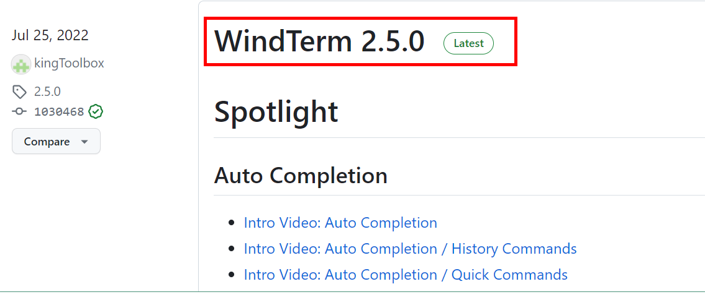

**（2）下载windows版本**

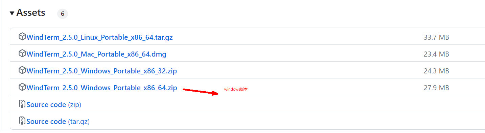

### 1.2 安装WindTerm

*   每个安装包都带有`Portable`字样，表示`免安装`，该压缩包解压后即可使用。把下载后的压缩包放到电脑里的某个目录，解压后，双击`WindTerm.exe`就可以运行了。

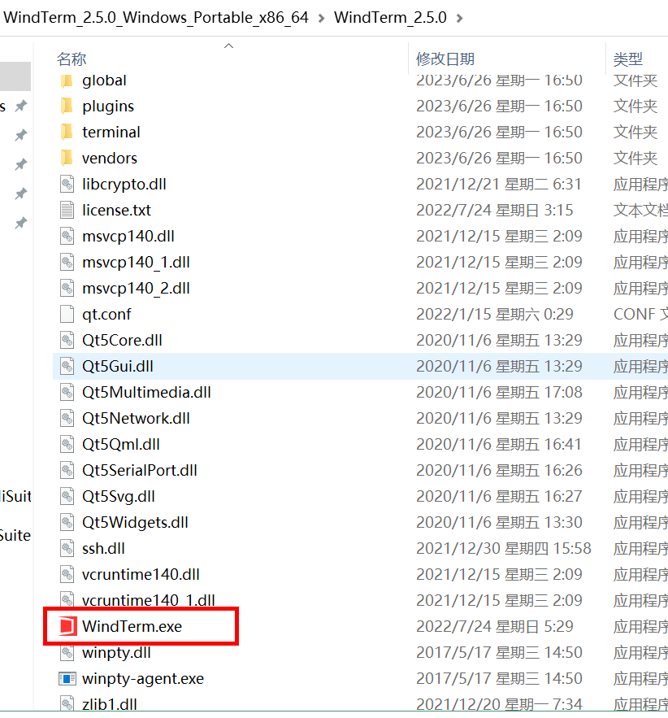

### 1.3 使用WindTerm

（1）双击WindTerm.exe

第一次启动程序，会需要选择一个目录存储配置等个人资料，这个根据个人喜好选择即可。

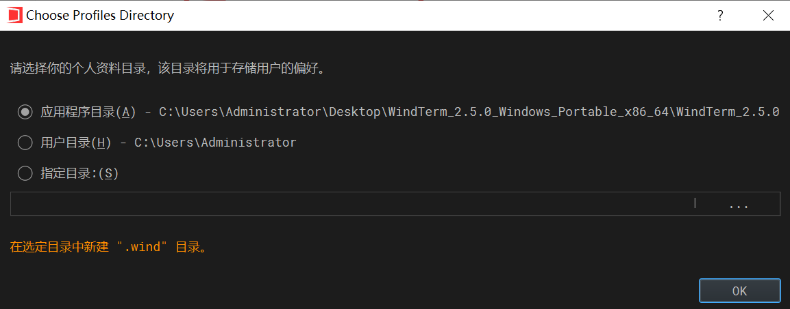

（2）进入软件页面后

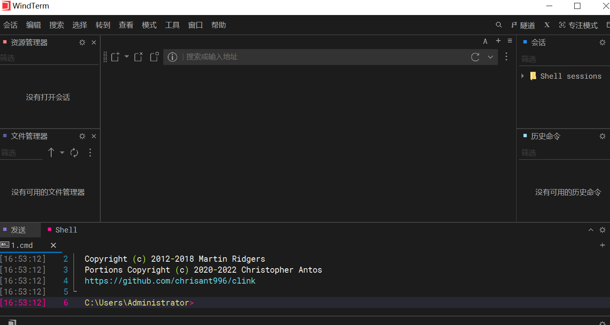

（3）新建会话

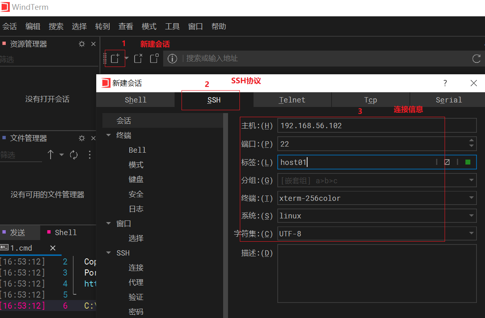

输入用户名：

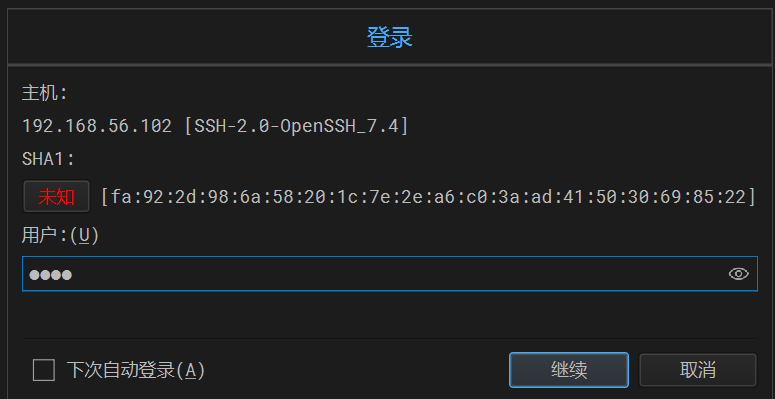

输入密码：

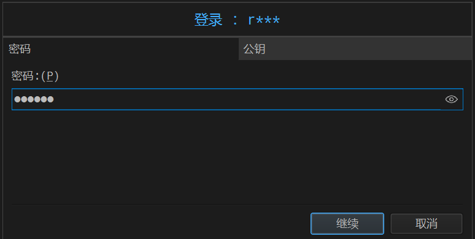

连接效果：

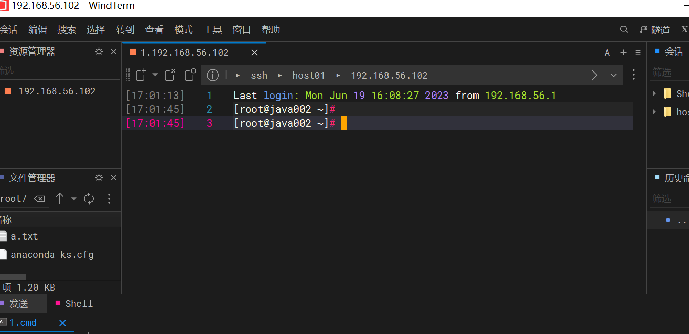

（4）上传文件

进入文件管理器

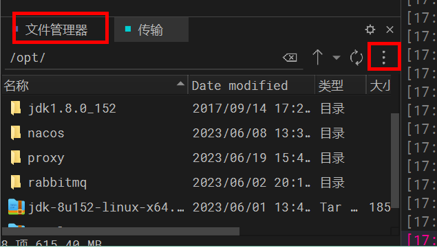

选择要上传的文件进行上传

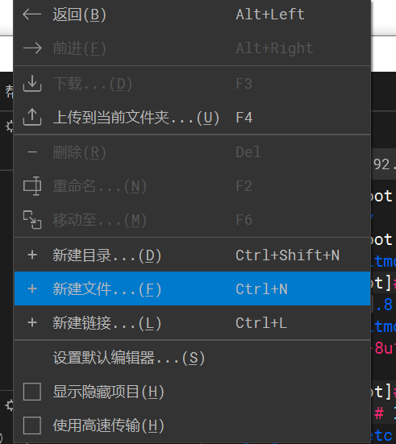

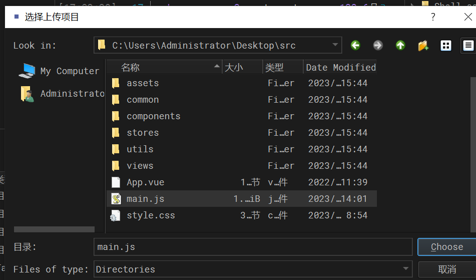
