# 第1章 Git概述

Git是一个免费的、开源的  [[分布式  版本控制   系统]]，可以快速高效地处理从小型到大型的各种项目。

Git易于学习，占地面积小，性能极快。 它具有廉价的本地库，方便的暂存区域和多个工作流分支等特性。其性能优于Subversion(svn)、Control Version  System、Perforce和ClearCase等版本控制工具。

## 1. 何为版本控制

版本控制是一种记录文件内容变化，以便将来查阅特定版本修订情况的系统。

版本控制其实最重要的是可以记录文件修改历史记录，从而让用户能够查看历史版本，方便版本切换。

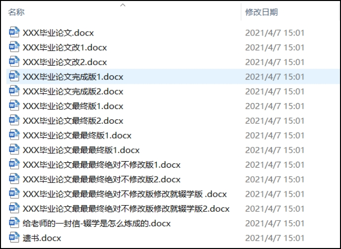


## 2. 为什么需要版本控制

个人开发过渡到团队协作。


## 3. 版本控制工具

* **集中式版本控制工具**

CVS、SVN(Subversion)、VSS……

集中化的版本控制系统诸如 CVS、SVN等，都有一个单一的集中管理的服务器，保存所有文件的修订版本，而协同工作的人们都通过客户端连到这台服务器，取出最新的文件或者提交更新。多年以来，这已成为版本控制系统的标准做法。

这种做法带来了许多好处，每个人都可以在一定程度上看到项目中的其他人正在做些什么。而管理员也可以轻松掌控每个开发者的权限，并且管理一个集中化的版本控制系统，要远比在各个客户端上维护本地数据库来得轻松容易。

事分两面，有好有坏。这么做显而易见的缺点是中央服务器的单点故障。如果服务器宕机一小时，那么在这一小时内，谁都无法提交更新，也就无法协同工作。


* **分布式版本控制工具**

Git、Mercurial、Bazaar、Darcs……

像 Git这种分布式版本控制工具，客户端提取的不是最新版本的文件快照，而是把代码仓库完整地镜像下来（本地库）。这样任何一处协同工作用的文件发生故障，事后都可以用其他客户端的本地仓库进行恢复。因为每个客户端的每一次文件提取操作，实际上都是一次对整个文件仓库的完整备份。

分布式的版本控制系统出现之后,解决了集中式版本控制系统的缺陷:

1. 服务器断网的情况下也可以进行开发（因为版本控制是在本地进行的）

2. 每个客户端保存的也都是整个完整的项目（包含历史记录，更加安全）

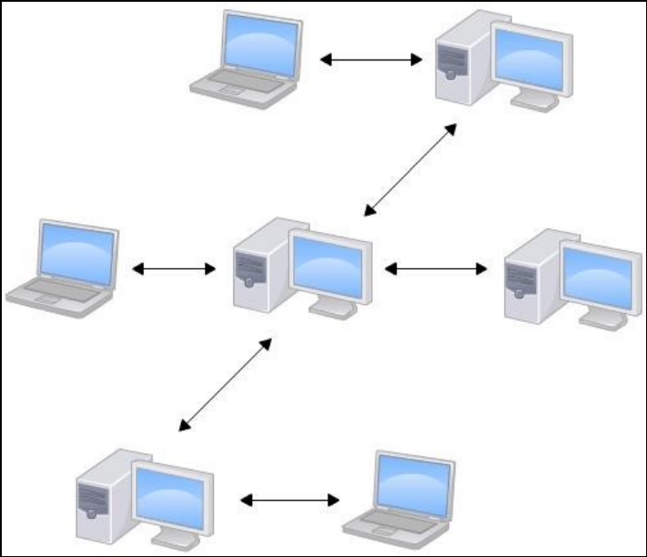


## 4. Git简史


## 5 Git工作机制

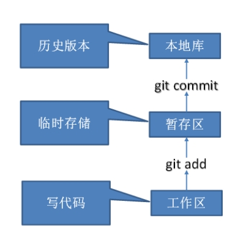


## 6 Git和代码托管中心

代码托管中心是基于网络服务器的远程代码仓库，一般我们简单称为远程库。

* **局域网**

  GitLab

* **互联网**

  GitHub（外网）

  Gitee码云（国内网站）


# 第2章 Git安装

​		官网地址： https://git-scm.com/或https://github.com/git-for-windows/git/releases

​		**推荐安装 git2.40.0版本**

​		查看GNU协议，可以直接点击下一步。


选择Git安装位置，要求是非中文并且没有空格的目录，然后下一步。


Git选项配置，推荐默认设置，然后下一步。

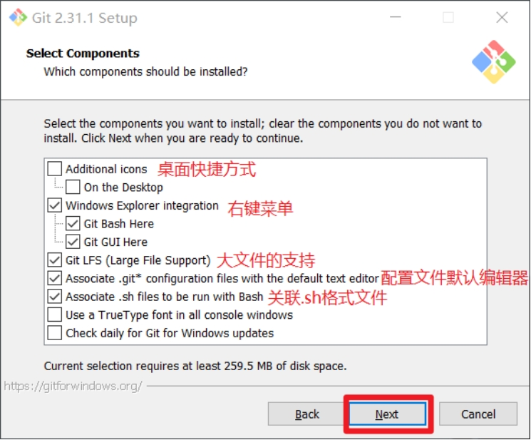

Git安装目录名，不用修改，直接点击下一步。


Git的默认编辑器，建议使用默认的Vim编辑器，然后点击下一步。


默认分支名设置，选择让Git决定，分支名默认为master，下一步。


修改Git的环境变量，选第一个，不修改环境变量，只在Git Bash里使用Git。


选择后台客户端连接协议，选默认值OpenSSL，然后下一步。


配置Git文件的行末换行符，Windows使用CRLF，Linux使用LF，选择第一个自动转换，然后继续下一步。


选择Git终端类型，选择默认的Git Bash终端，然后继续下一步。


选择Git pull合并的模式，选择默认，然后下一步。


选择Git的凭据管理器，选择默认的跨平台的凭据管理器，然后下一步。


其他配置，选择默认设置，然后下一步。


实验室功能，技术还不成熟，有已知的bug，不要勾选，然后点击右下角的Install按钮，开始安装Git。

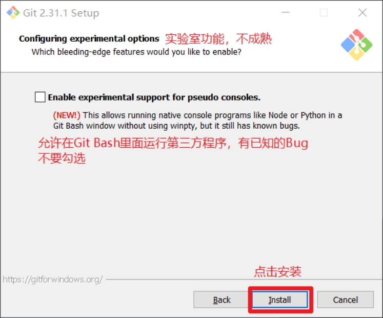

点击Finsh按钮，Git安装成功！


右键任意位置，在右键菜单里选择Git Bash Here即可打开Git Bash命令行终端。


在Git Bash终端里输入git --version查看git版本，如图所示，说明Git安装成功。


# 第3章 Git常用命令

| **命令名称**                         | **作用***      |
| ------------------------------------ | -------------- |
| git config --global user.name 用户名 | 设置用户签名   |
| git config --global user.email 邮箱  | 设置用户邮箱   |
| git init                             | 初始化本地库   |
| git status                           | 查看本地库状态 |
| git add 文件名                       | 添加到暂存区   |
| git commit -m "日志信息" 文件名      | 提交到本地库   |
| git reflog                           | 查看历史记录   |
| git reset --hard 版本号              | 版本穿梭       |

## 1 设置用户签名

### 1.1 基本语法

git config --global user.name 用户名

git config --global user.email 邮箱

### 1.2 案例实操

全局范围的签名设置：

```shell
git config --global user.name Layne
git config --global user.email Layne@atguigu.com
git config --list # 查看全局配置
cat ~/.gitconfig  # cat linux中查看文本的命令  ~ 家 [你当前用户的家]/ .gitconfig
```

说明：

签名的作用是区分不同操作者身份。用户的签名信息在每一个版本的提交信息中能够看到，以此确认本次提交是谁做的。Git首次安装必须设置一下用户签名，否则无法提交代码。

※注意：这里设置用户签名和将来登录GitHub（或其他代码托管中心）的账号没有任何关系。


## **2** **初始化本地库**

### 2.1 基本语法

**git init**

### 2.2 案例实操


结果查看

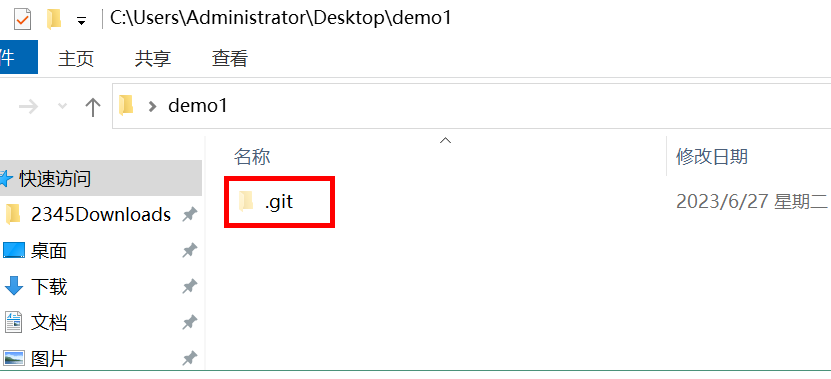


## **3** **查看本地库状态**

### 3.1 基本语法

**git status**


### 3.2 案例实操

#### （1）首次查看（工作区没有文件）


#### （2）新增文件

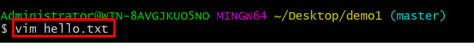

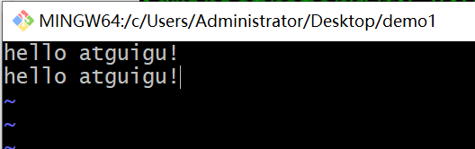

####  （3）再次查看（检测到未追踪文件）


## 4 添加暂存区

### 4.1 将工作区的文件添加到暂存区

#### （1）基本语法

**git** **add** **文件名**

#### （2）案例实操


### 4.2 查看状态（检测到暂存区有新文件）


## 5 提交本地库

### 5.1 暂存区文件提交到本地库

#### （1）基本语法

**git commit -m "日志信息" 文件名**

#### （2）案例实操


### 5.2 查看状态（没有文件需要提交）

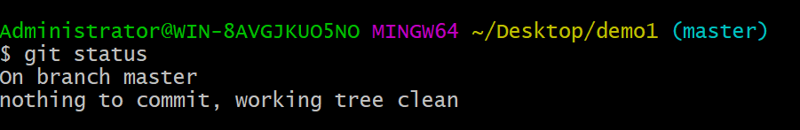


## 6 修改文件（hello.txt）

### 6.1 查看状态（检测到工作区有文件被修改）

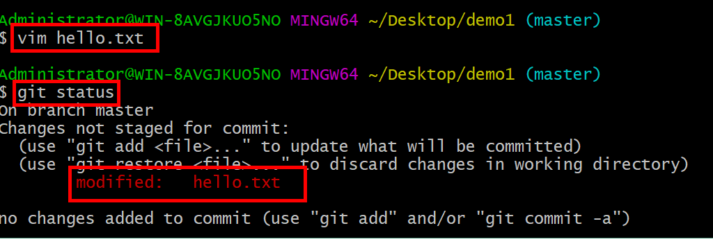


### 6.2 将修改的文件再次添加暂存区


### 6.3 查看状态（工作区的修改添加到了暂存区）


### 6.4 将暂存区文件提交到本地库


## 7 历史版本

### 7.1 查看历史版本

#### （1）基本语法

**git reflog**  **查看版本信息**

git reflog -n 数量

**git log**  **查看版本详细信息**

#### （2）案例实操


### 7.2 版本穿梭

#### （1）基本语法

**git reset --hard** **版本号**

#### （2）案例实操

--首先查看当前的历史记录，可以看到当前是在48f4e22这个版本


--切换到之前版本，8ca80d7版本，也就是我们第一次提交的版本


--切换完毕之后再查看历史记录，当前成功切换到了8ca80d7版本


--然后查看文件hello.txt，发现文件内容已经变化


 Git切换版本，底层其实是移动的HEAD指针。


# 第4章 Git分支操作

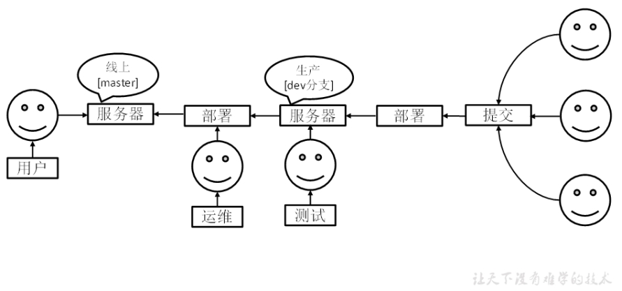

## **1** **什么是分支**

在版本控制过程中，同时推进多个任务，为每个任务，我们就可以创建每个任务的单独分支。使用分支意味着程序员可以把自己的工作从开发主线上分离开来，开发自己分支的时候，不会影响主线分支的运行。对于初学者而言，分支可以简单理解为副本，一个分支就是一个单独的副本。（分支底层其实也是指针的引用）


## **2** **分支的好处**

同时并行推进多个功能开发，提高开发效率。

各个分支在开发过程中，如果某一个分支开发失败，不会对其他分支有任何影响。失败的分支删除重新开始即可。


## **3** **分支的操作**

| **命令名称**        | **作用**                     |
| ------------------- | ---------------------------- |
| git branch 分支名   | 创建分支                     |
| git branch -v       | 查看分支                     |
| git checkout 分支名 | 切换分支                     |
| git merge 分支名    | 把指定的分支合并到当前分支上 |

### 3.1 查看分支

#### （1）基本语法

**git branch -v**

#### （2）案例实操


### 3.2 创建分支

#### （1）基本语法

**git branch** **分支名**

#### （2）案例实操


### 3.3 修改分支

--在maste分支上做修改


--添加暂存区


--提交本地库

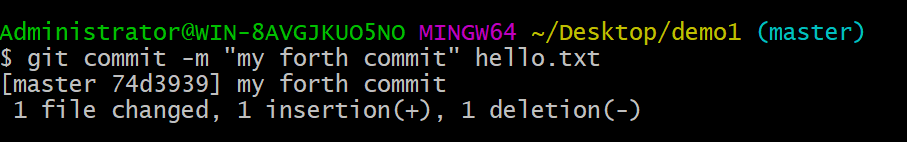

--查看分支


 --查看master分支上的文件内容


### 3.4 切换分支

#### （1）基本语法

**git checkout** **分支名**

#### （2）案例实操

--分支由master改为hot-fix


--查看hot-fix分支上的文件内容发现与master分支上的内容不同

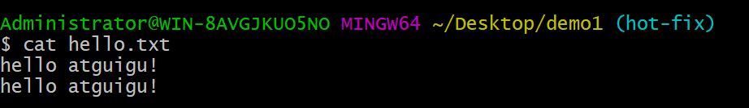

--在hot-fix分支上做修改


--添加暂存区


--提交本地库

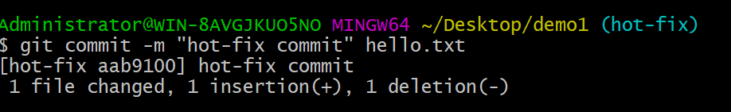


### 3.5 合并分支

#### （1）基本语法

**git merge** **分支名**

#### （2）案例实操

-- 切换回到master分支

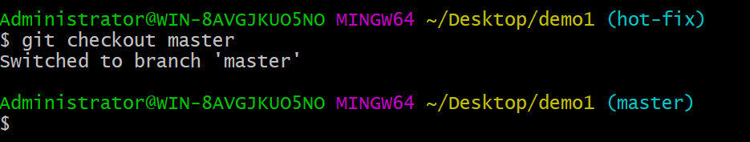

 -- 在master分支上合并hot-fix分支

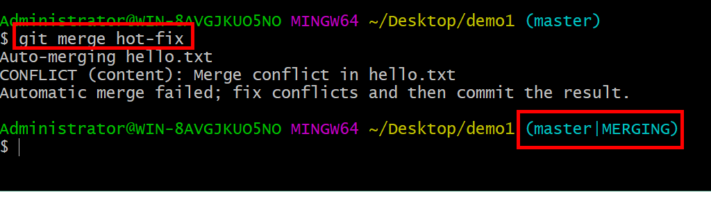


### 3.6 产生冲突

#### （1）冲突产生的表现

后面状态为MERGING

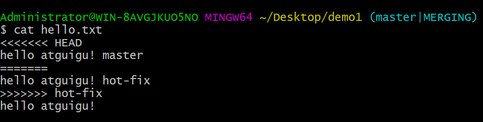


#### （2）冲突产生的原因

合并分支时，两个分支在**同一个文件的同一个位置**有两套完全不同的修改。Git无法替我们决定使用哪一个。必须**人为决定**新代码内容。

查看状态（检测到有文件有两处修改）


### 3.7 解决冲突

#### （1）编辑有冲突的文件

删除特殊符号，决定要使用的内容

特殊符号：<<<<<<< HEAD 当前分支的代码 =======  合并过来的代码 >>>>>>> hot-fix


#### （2）添加到暂存区


#### （3）执行提交

注意：此时使用git commit命令时**不能带文件名**


--发现后面MERGING消失，变为正常


## 4 创建分支和切换分支图解

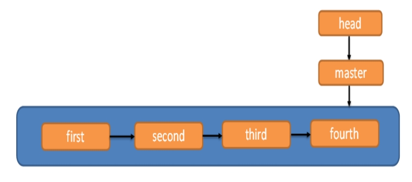

master、hot-fix其实都是指向具体版本记录的指针。当前所在的分支，其实是由HEAD决定的。所以创建分支的本质就是多创建一个指针。

HEAD如果指向master，那么我们现在就在master分支上，HEAD如果执行hotfix，那么我们现在就在hotfix分支上。

所以切换分支的本质就是移动HEAD指针。


# 第5章 Gitee（码云）操作

## **1 Git 代码托管服务**

前面我们已经知道了Git中存在两种类型的仓库，即**本地仓库**和**远程仓库**。那么我们如何搭建Git远程仓库呢？我们可以借助互联网上提供的一些代码托管服务来实现，其中比较常用的有GitHub、码云、GitLab等。

l gitHub（ 地址：https://github.com/ ）

是一个面向开源及私有软件项目的托管平台，因为只支持Git 作为唯一的版本库格式进行托管，故名gitHub

l 码云（地址： https://gitee.com/ ）

是**国内**的一个代码托管平台，由于服务器在国内，所以相比于GitHub，码云速度会更快

l GitLab （地址： https://about.gitlab.com/ ）

是一个用于仓库管理系统的开源项目，使用Git作为代码管理工具，并在此基础上搭建起来的web服务

## **2 Gitee简介**

1.是什么： gitee是一个git项目托管网站，主要提供基于git的版本托管服务

2.能干嘛： gitee是一个基于git的代码托管平台， Git 并不像 SVN 那样有个中心服务器。目前我们使用到的 Git 命令都是在本地执行，如果你想通过 Git 分享你的代码或者与其他开发人员合作。 你就需要将数据放到一台其他开发人员能够连接的服务器上。

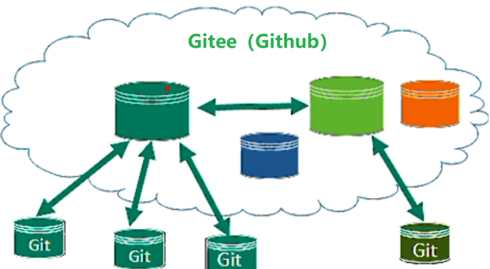

3.去哪下： https://gitee.com/

4.怎么玩：见课堂演示

前面执行的命令操作都是针对的本地仓库，本章节我们会学习关于远程仓库的一些操作，具体包括：

l 查看远程仓库

l 添加远程仓库

l 从远程仓库克隆

l 从远程仓库中抓取与拉取

l 推送到远程仓库


## **3** 码云帐号注册和登录

进入码云官网地址：https://gitee.com/，点击注册Gitee


​	输入个人信息，进行注册即可。

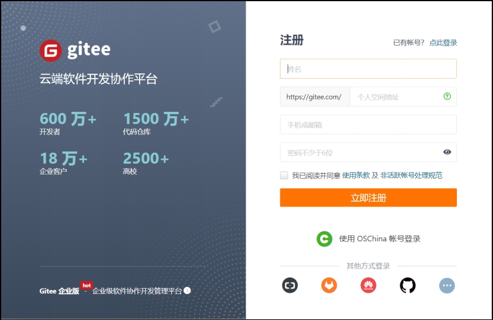

​	帐号注册成功以后，直接登录。

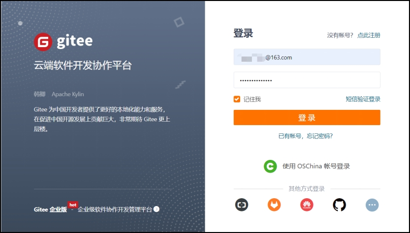
    登录以后，就可以看到码云官网首页了。

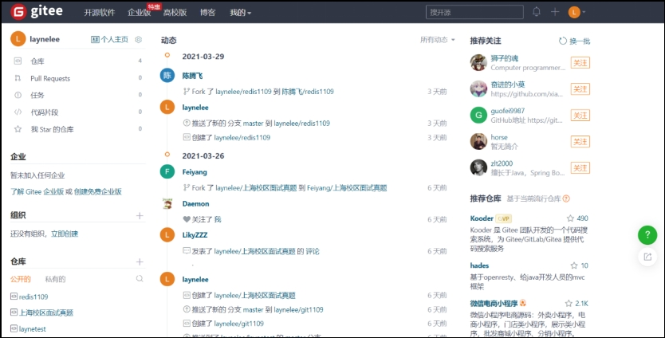


## 4 创建远程仓库


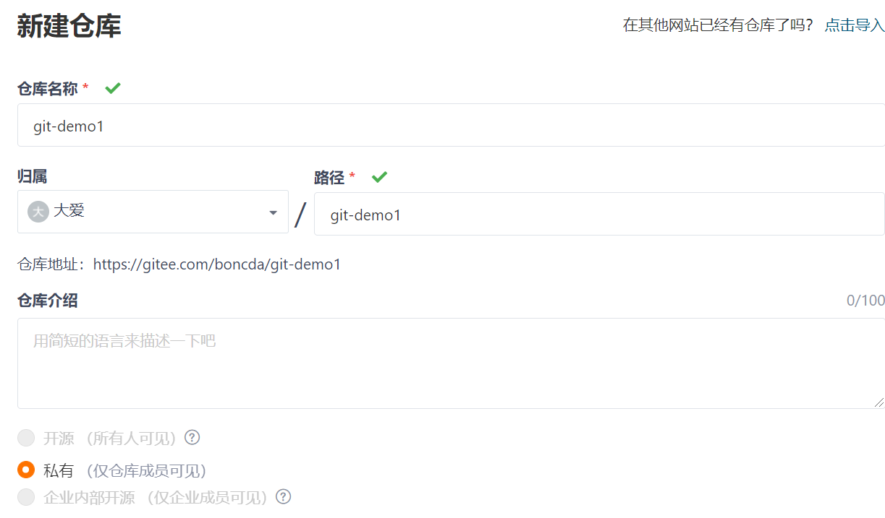


## 5 远程仓库操作

| **命令名称***                      | **作用**                                                 |
| ---------------------------------- | -------------------------------------------------------- |
| git remote -v                      | 查看当前所有远程地址别名                                 |
| git remote add 别名 远程地址       | 起别名                                                   |
| git push 别名 分支(本地分支名)     | 推送本地分支上的内容到远程仓库                           |
| git clone 远程地址                 | 将远程仓库的内容克隆到本地                               |
| git pull 远程库地址别名 远程分支名 | 将远程仓库对于分支最新内容拉下来后与当前本地分支直接合并 |

###  5.1 创建远程仓库别名

#### （1）基本语法

**git remote -v** **查看当前所有远程地址别名**

**git remote add** **别名** **远程地址**

#### （2）案例实操

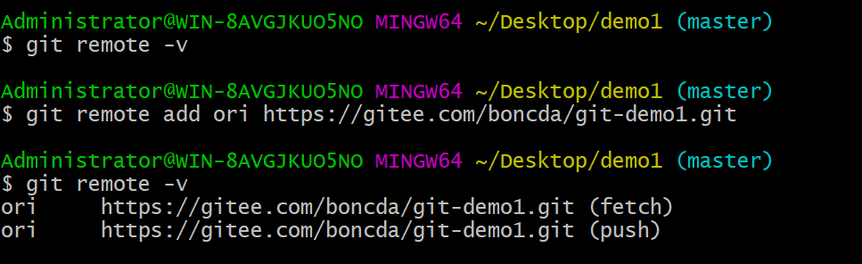

**https://gitee.com/boncda/git-demo1.git**

***\*这个地址在创建完远程仓库后生成的连接，如图所示红框中\****

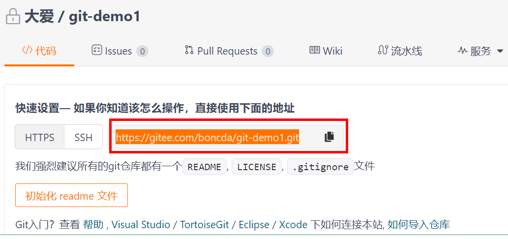


### 5.2 推送本地分支到远程仓库

#### （1）基本语法

**git push** **别名** **分支**

#### （2）案例实操

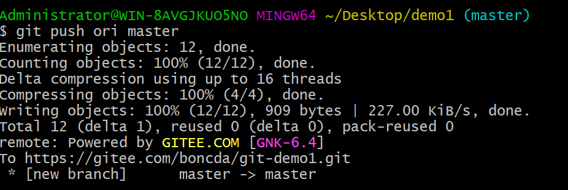

第一次需要输入**码云的用户名和密码**

此时发现已将我们master分支上的内容推送到Gitee创建的远程仓库。

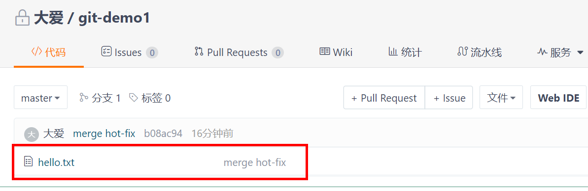


### 5.3 克隆远程仓库到本地

#### （1）基本语法

**git clone** **远程地址**

#### （2）案例实操

**创建新文件夹，执行**

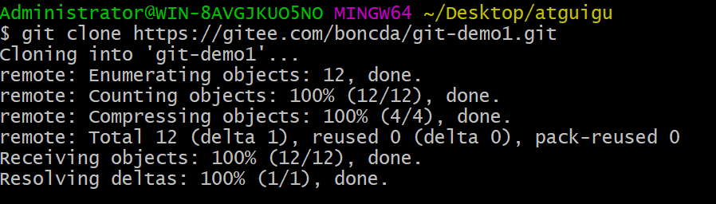

 这个地址为远程仓库地址，克隆结果：初始化本地仓库


进入git-demo1执行


小结：clone会做如下操作。1、拉取代码。2、初始化本地仓库。3、创建别名


### 5.4 邀请加入团队

#### **（1）点击管理**


#### （2）选择仓库成员管理


#### （3）选择邀请用户


#### （4）有多种方式可以添加

下面演示直接添加

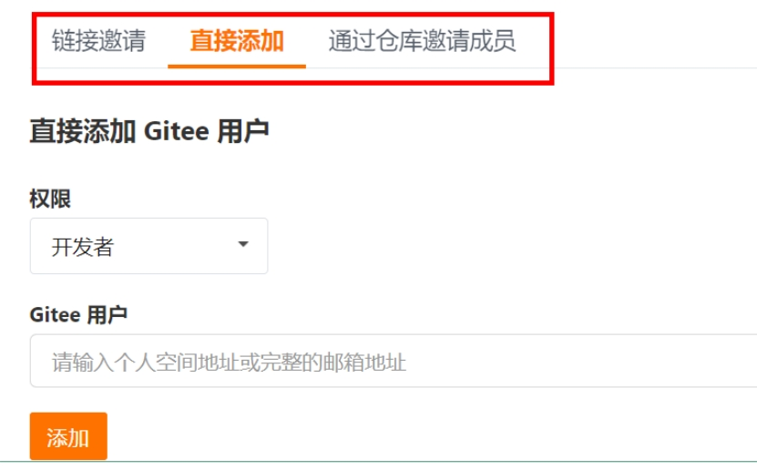

直接输入用户名称添加

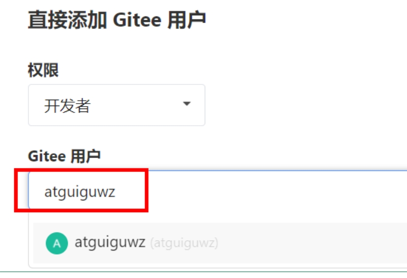

指定权限，提交

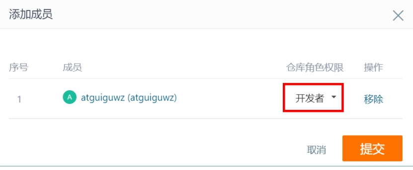


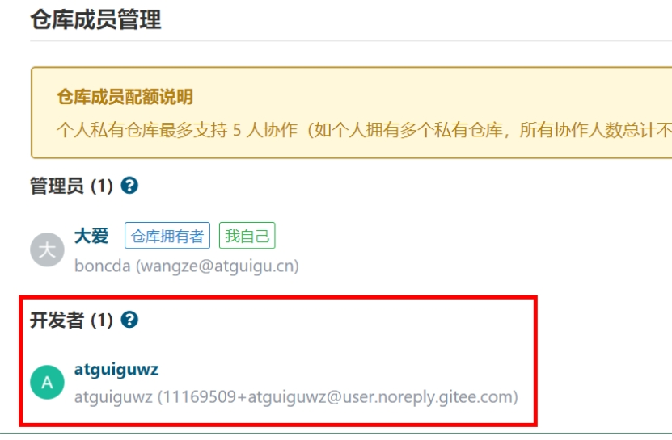

#### （5）测试功能

第一，使用atguiguwz登录码云，修改文件


第二 atguiguwz提交文件

第三 使用另外用户登录，发现文件已经更新


### 5.5 拉取远程库内容

#### （1）基本语法

**git pull** **远程库地址别名** **远程分支名**

#### （2）案例实操


## 6 SSH免密登录（了解）

我们可以看到远程仓库中还有一个SSH的地址，因此我们也可以使用SSH进行访问。

你可以按如下命令来生成 sshkey:

ssh-keygen -t ed25519 -C "xxxxx@xxxxx.com"

\# Generating public/private ed25519 key pair...

注意：这里的 xxxxx@xxxxx.com 只是生成的 sshkey 的名称，并不约束或要求具体命名为某个邮箱。
现网的大部分教程均讲解的使用邮箱生成，其一开始的初衷仅仅是为了便于辨识所以使用了邮箱。

按照提示完成三次回车，即可生成 ssh key。通过查看 ~/.ssh/id_ed25519.pub 文件内容，获取到你的 public key

cat ~/.ssh/id_ed25519.pub

\# ssh-ed25519 AAAAB3NzaC1yc2EAAAADAQABAAABAQC6eNtGpNGwstc....


复制生成后的 ssh key，通过仓库主页 **「管理」->「部署公钥管理」->「添加部署公钥」** ，添加生成的 public key 添加到仓库中。


添加后，在终端（Terminal）中输入

ssh -T git@gitee.com

首次使用需要确认并添加主机到本机SSH可信列表。若返回 Hi XXX! You've successfully authenticated, but Gitee.com does not provide shell access. 内容，则证明添加成功。


添加成功后，就可以使用SSH协议对仓库进行操作了。


# 第6章 IDEA集成Git（本地库）

## 1 配置Git忽略文件

### 6.1 IDEA特定文件


### 6.2 Maven工程的target目录


### 6.3 为什么要忽略他们

与项目的实际功能无关，不参与服务器上部署运行。把它们忽略掉能够屏蔽IDE工具之间的差异。


### 6.4 怎么忽略

#### （1）创建忽略规则文件

* **文件名称：xxxx.ignore**（前缀名随便起，建议是git.ignore）

* 这个文件的存放位置原则上在哪里都可以，为了便于让~/.gitconfig文件引用，建议也放在用户家目录下

* git.ignore文件模版内容如下

```ignore
# Compiled class file
*.class

erdaye

# Log file
*.log

# BlueJ files
*.ctxt

# Mobile Tools for Java (J2ME)
.mtj.tmp/

# Package Files #
*.jar
*.war
*.nar
*.ear
*.zip
*.tar.gz
*.rar

# virtual machine crash logs, see http://www.java.com/en/download/help/error_hotspot.xml
hs_err_pid*

.classpath
.project
.settings
target
.idea
*.iml
```

#### （2）在.gitconfig文件中引用

（此文件在Windows的家目录中）

```
[user]
    name = Layne
    email = Layne@atguigu.com
[core]
    excludesfile = C:/Users/asus/git.ignore   \\  \\  \\
```

注意：这里要使用正斜线（/），不要使用反斜线（\）

## 2 定位Git程序


## 3 初始化本地库


 选择要创建Git本地仓库的工程。


## 4 添加到暂存区

右键点击项目选择Git -> Add将项目添加到暂存区。


## 5 **提交到本地库**

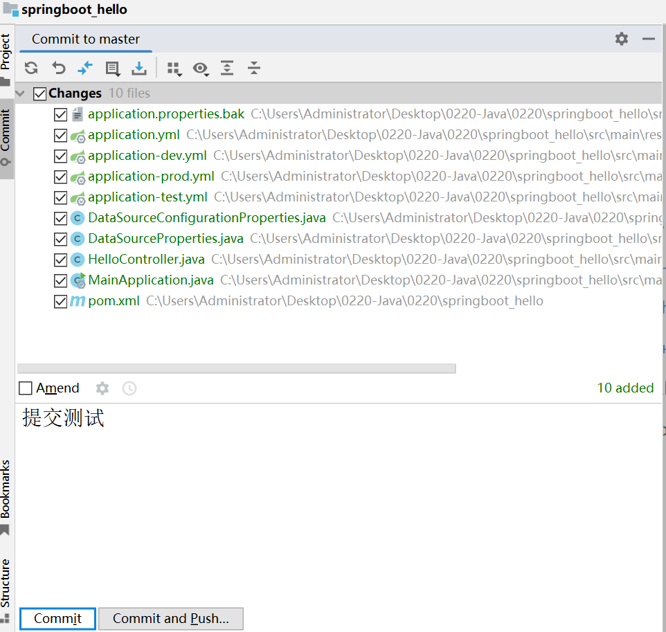


## 6 **切换版本**

查看历史版本


右键选择要切换的版本，然后在菜单里点击Checkout Revision。

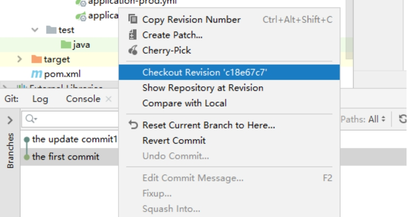


## 7 创建分支

选择Git，在Repository里面，点击Branches按钮。


在弹出的Git Branches框里，点击New Branch按钮。

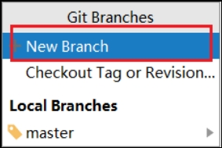

填写分支名称，创建hot-fix分支。


然后看到hot-fix，说明分支创建成功，并且当前已经切换成hot-fix分支

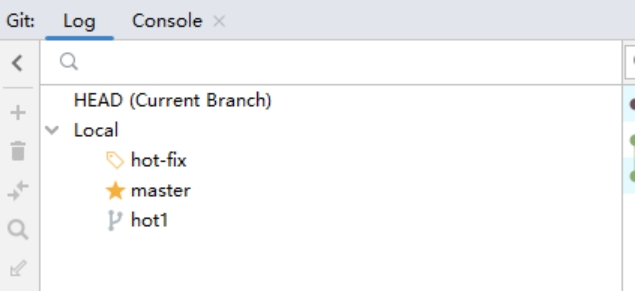


## 8 **切换分支**

切换到master分支

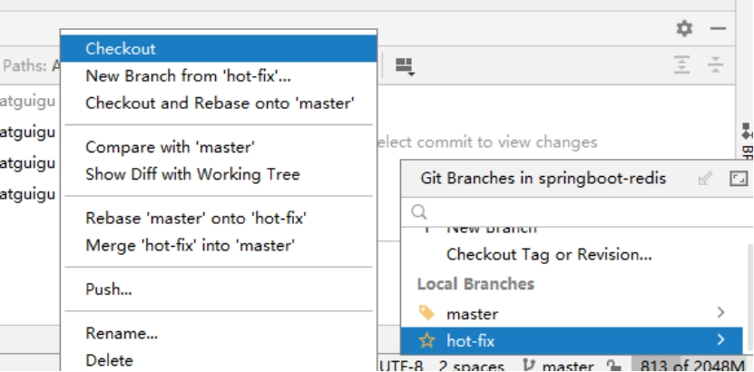


## 9 **合并分支**

切换到master分支，将hot-fix分支合并到当前master分支。


如果代码没有冲突，分支直接合并成功，分支合并成功以后，代码自动提交，无需手动提交本地库。

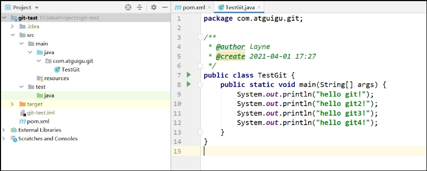


## 10 **解决冲突**

如图所示，如果master分支和hot-fix分支都修改了代码，在合并分支的时候就会发生冲突。


我们现在站在master分支上合并hot-fix分支，就会发生代码冲突。


点击Conflicts框里的Merge按钮，进行手动合并代码。


手动合并完代码以后，点击右下角的Apply按钮。

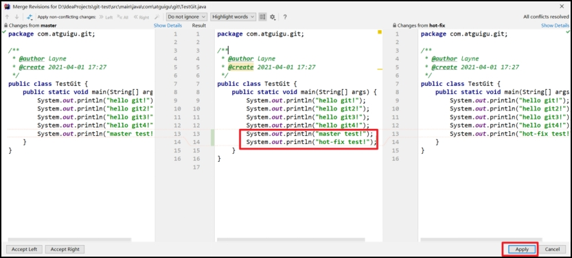

代码冲突解决，自动提交本地库。

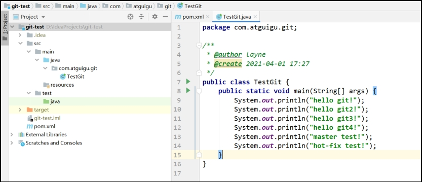


# 第7章 IDEA集成Gitee（码云）

## 1 IDEA安装码云插件

Idea默认不带码云插件，我们第一步要安装Gitee插件

如图所示，在Idea插件商店搜索Gitee，然后点击右侧的Install按钮。

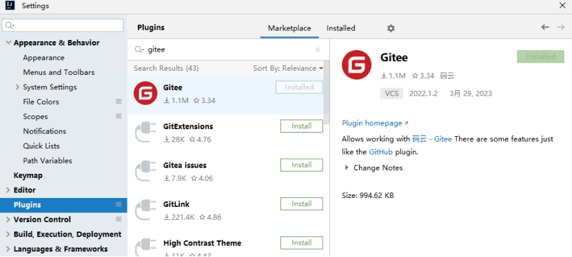

安装成功后，重启Idea


​	Idea重启以后在Version Control设置里面看到Gitee，说明码云插件安装成功


​	然后在码云插件里面添加码云帐号，我们就可以用Idea连接码云了。

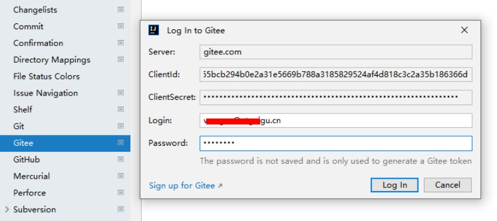

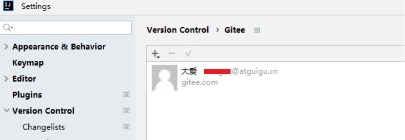


## 2 push推送本地库到远程库

首先在Idea里面创建一个工程，初始化git工程，然后将代码添加到暂存区，提交到本地库，这些步骤上面已经讲过，此处不再赘述。

将本地代码push到码云远程库


自定义远程库链接。


给远程库链接定义个name，然后再URL里面填入码云远程库的链接即可


然后选择定义好的远程链接，点击Push即可

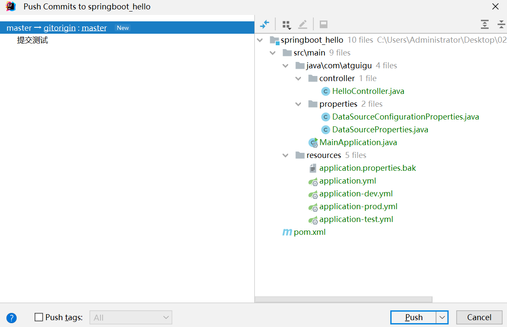

 去码云远程库查看代码。

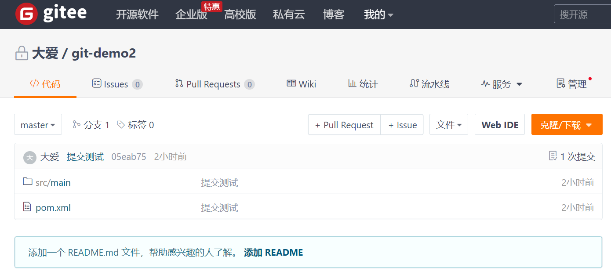


## 3 pull拉取远程库到本地库

（1）在码云上直接修改代码内容，之后提交，为了进行测试


（2）右键点击项目，可以将远程仓库的内容pull到本地仓库。

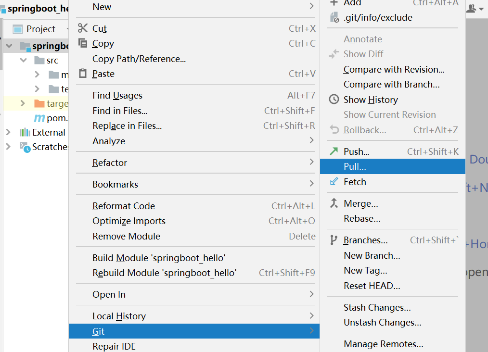

（3）选择远程库

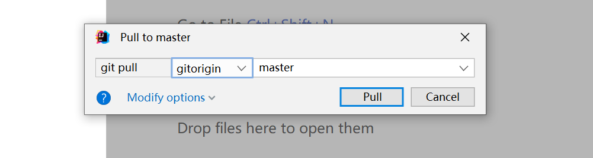

（4）pull了远程库中最新内容


注意：pull是拉取远端仓库代码到本地，如果远程库代码和本地库代码不一致，会自动合并，如果自动合并失败，还会涉及到手动解决冲突的问题。


## 4 clone克隆远程库到本地

（1）选择Clone

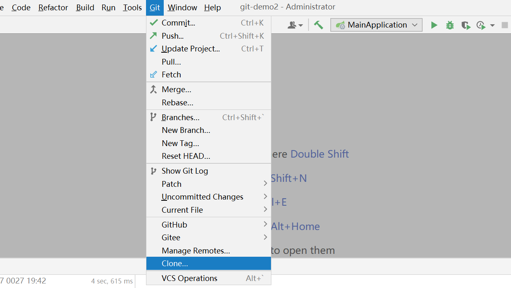

（2）输入远程码云仓库地址


（3）完成clone操作


 git