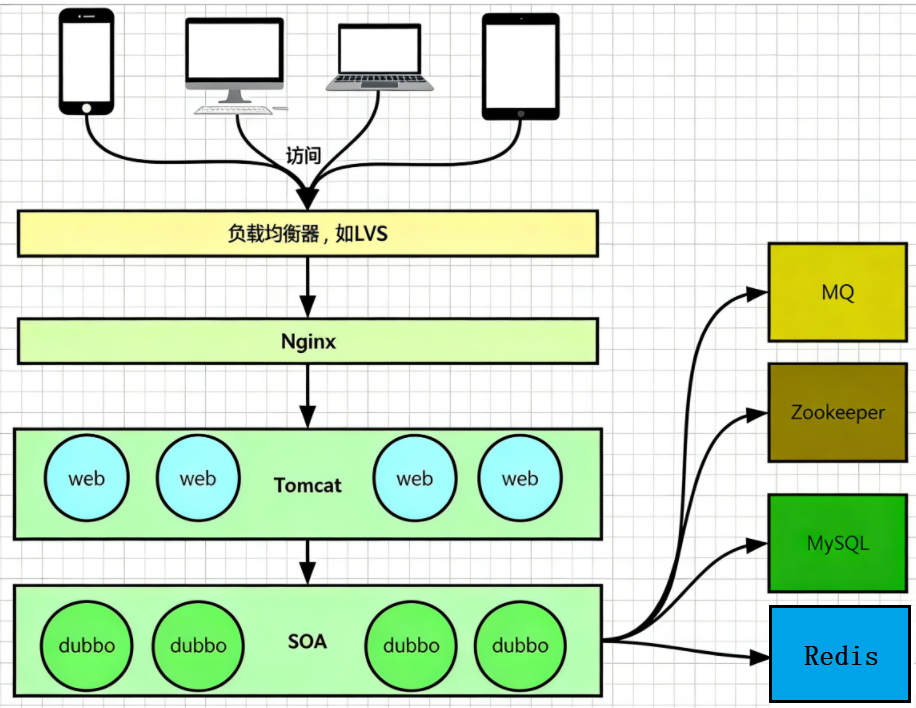
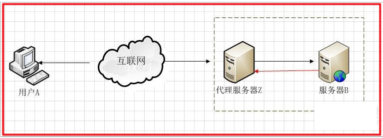
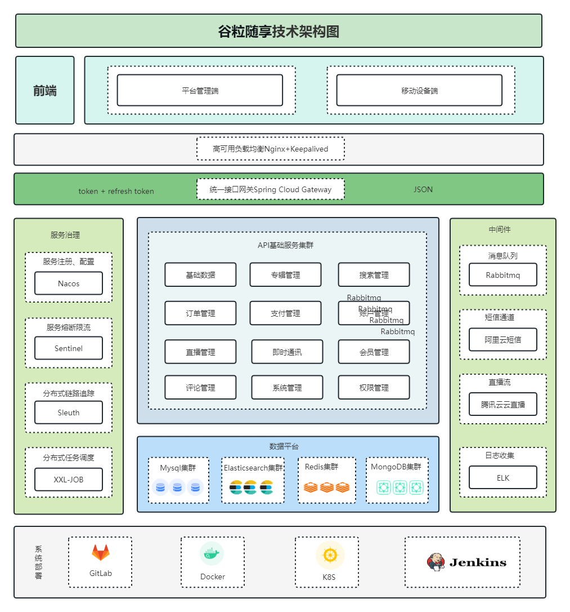
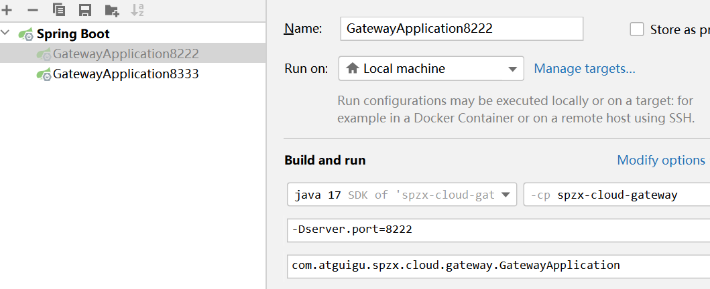

# 1 Nginx简介

## 1.1 Nginx概述

*Nginx* (engine x) 是一个高性能的[HTTP](https://baike.baidu.com/item/HTTP/243074?fromModule=lemma_inlink)和[反向代理](https://baike.baidu.com/item/反向代理/7793488?fromModule=lemma_inlink)web服务器，同时也提供了IMAP/POP3/[SMTP](https://baike.baidu.com/item/SMTP/175887?fromModule=lemma_inlink)服务。Nginx是由伊戈尔·赛索耶夫为[俄罗斯](https://baike.baidu.com/item/俄罗斯/125568?fromModule=lemma_inlink)[访问量](https://baike.baidu.com/item/访问量/392852?fromModule=lemma_inlink)第二的Rambler.ru站点（[俄文](https://baike.baidu.com/item/俄文/5491693?fromModule=lemma_inlink)：Рамблер）开发的，公开版本1.19.6发布于2020年12月15日。

主要作用:

* http服务器
* 反向代理
* 负载均衡


## 1.2 Nginx优点

Nginx 是一个很强大的高性能Web和反向代理服务器，它具有很多非常优越的特性：

在连接高并发的情况下，Nginx是Apache服务器不错的替代品：Nginx能够支持高达 50,000 个并发连接数的响应


## 1.3 为什么使用Nginx

互联网飞速发展的今天，大用户量高并发已经成为互联网的主体。怎样能让一个网站能够承载几万个或几十万个用户的持续访问呢？这是一些中小网站急需解决的问题。用单机tomcat搭建的网站，在比较理想状态下能够承受的并发访问量在150到200左右。按照并发访问量占总用户数量的5%到10%这样计算，单点tomcat网站的用户人数在1500到4000左右。对于为全国范围提供服务的网站显然是不够用的，为了解决这个问题引入了负载均衡方法。

**负载均衡就是一个web服务器解决不了的问题可以通过多个web服务器来平均分担压力来解决，并发过来的请求被平均分配到多个后台web服务器来处理，这样压力就被分解开来。**

负载均衡服务器分为两种：

一种是通过硬件实现的负载均衡服务器，简称硬负载。

另一种是通过软件来实现的负载均衡，简称软负载：例如apache和nginx。


## 1.4 正向代理

Nginx是一款轻量级的Web服务器、反向代理服务器，由于它的内存占用少，启动极快，高并发能力强，在互联网项目中广泛应用。



**正向代理：**如果把局域网外的Internet想象成一个巨大的资源库，则局域网中的客户端要访问Internet，则需要通过代理服务器来访问，这种代理服务就称为正向代理。


由于防火墙的原因，我们并不能直接访问谷歌，那么我们可以借助VPN来实现，这就是一个简单的正向代理的例子。这里你能够发现，正向代理“代理”的是客户端，而且客户端是知道目标的，而目标是不知道客户端是通过VPN访问的。

一般情况下，如果没有特别说明，代理技术默认说的是正向代理技术。

关于正向代理的概念如下： 正 向代理(forward)是一个位于客户端【用户A】和原始服务器(origin server)【服务器B】之间的服务器【代理服务器Z】，为了从原始服务器取得内容，用户A向代理服务器Z发送一个请求并指定目标(服务器B)，然后代理服务器Z向服务器B转交请求并将获得的内容返回给客户端。


从上面的概念中，我们看出，文中所谓的正向代理就是代理服务器替代访问方【用户A】去访问目标服务器【服务器B】

这就是正向代理的意义所在。而为什么要用代理服务器去代替访问方【用户A】去访问服务器B呢？这就要从代理服务器使用的意义说起。

使用正向代理服务器作用主要有以下几点：

① 访问本无法访问的服务器B，如下图


我们抛除复杂的网络路由情节来看图，假设图中路由器从左到右命名为R1，R2 假设最初用户A要访问服务器B需要经过R1和R2路由器这样一个路由节点，如果路由器R1或者路由器R2发生故障，那么就无法访问服务器B了。但是如果用户 A让代理服务器Z去代替自己访问服务器B，由于代理服务器Z没有在路由器R1或R2节点中，而是通过其它的路由节点访问服务器B，那么用户A就可以得到服务器B的数据了。现实中的例子就是“翻墙”。

② 隐藏访问者的行踪

如下图 ，我们可以看出服务器B并不知道访问自己的实际是用户A，因为代理服务器Z代替用户A去直接与服务器B进行交互。



**我们总结一下 正向代理是一个位于客户端和原始服务器(originserver)之间的服务器，为了从原始服务器取得内容，客户端向代理发送一个请求并指定目标(原始服务器)，然后代理向原始服务器转交请求并将获得的内容返回给客户端。**

**总之一句话：正向代理，隐藏的是客户端**


## 1.5 反向代理


反向代理指的是代理服务器根据客户端的请求，从其关系的一组或多组后端服务器（如Web服务器）上获取资源，然后再将这些资源返回给客户端的过程，客户端只会得知代理服务器的IP地址，而不知道在代理服务器后面的服务器集群的存在。

**反向代理：**其实客户端对代理是无感知的，因为客户端不需要任何配置就可以访问，我们只需要将请求发送到反向代理服务器，由反向代理服务器去选择目标服务器获取数据后，在返回给客户端，此时反向代理服务器和目标服务器对外就是一个服务器，暴露的是代理服务器地址，隐藏了真实服务器IP地址。


反向代理正好与正向代理相反，对于客户端而言代理服务器就像是原始服务器，并且客户端不需要进行任何特别的设置。客户端向反向代理发送普通请求，接着反向代理将判断向何处(原始服务器)转交请求，并将获得的内容返回给客户端。

使用反向代理服务器的作用如下：

① 保护和隐藏原始资源服务器如下图


用户A始终认为它访问的是原始服务器B而不是代理服务器Z，但实际上反向代理服务器接受用户A的应答，从原始资源服务器B中取得用户A的需求资源，然后发送给用户A。由于防火墙的作用，只允许代理服务器Z访问原始资源服务器B。尽管在这个虚拟的环境下，防火墙和反向代理的共同作用保护了原始资源服务器B，但用户A并不知情。

**总之一句话：反向代理，隐藏的是服务器**


## 1.6 负载均衡

客户端发送多个请求到服务器，服务器处理请求，有一些可能要与数据库进行交互，服务器处理完毕后，再将结果返回给客户端。

这种架构模式对于早期的系统相对单一，并发请求相对较少的情况下是比较适合的，成本也低。但是随着信息数量的不断增长，访问量和数据量的飞速增长，以及系统业务的复杂度增加，这种架构会造成服务器相应客户端的请求日益缓慢，并发量特别大的时候，还容易造成服务器直接崩溃。很明显这是由于服务器性能的瓶颈造成的问题，那么如何解决这种情况呢？

我们首先想到的可能是升级服务器的配置，比如提高CPU执行频率，加大内存等提高机器的物理性能来解决此问题，硬件的性能提升已经不能满足日益提升的需求了。最明显的一个例子，天猫双十一当天，某个热销商品的瞬时访问量是极其庞大的，那么类似上面的系统架构，将机器都增加到现有的顶级物理配置，都是不能够满足需求的。那么怎么办呢？

上面的分析我们去掉了增加服务器物理配置来解决问题的办法，也就是说纵向解决问题的办法行不通了，那么横向增加服务器的数量呢？这时候集群的概念产生了，单个服务器解决不了，我们增加服务器的数量，然后将请求分发到各个服务器上，将原先请求集中到单个服务器上的情况改为将请求分发到多个服务器上，将负载分发到不同的服务器，也就是我们所说的**负载均衡。**




## 1.7 动静分离

为了加快网站的解析速度，可以把动态页面和静态页面由不同的服务器来解析，加快解析速度。降低原来单个服务器的压力。


　

# 2 Nginx安装

官方网站：http://nginx.org/

## 2.1 Nginx在linux下安装

Nginx官网有详细的安装步骤，具体内容可参考官网 https://nginx.org/

1. **配置Nginx yum存储库**

   创建`/etc/yum.repos.d/nginx.repo`文件

   ```bash
   sudo vim /etc/yum.repos.d/nginx.repo
   ```

   增加如下内容

   ```ini
   [nginx-stable]
   name=nginx stable repo
   baseurl=http://nginx.org/packages/centos/$releasever/$basearch/
   gpgcheck=1
   enabled=1
   gpgkey=https://nginx.org/keys/nginx_signing.key
   module_hotfixes=true

   [nginx-mainline]
   name=nginx mainline repo
   baseurl=http://nginx.org/packages/mainline/centos/$releasever/$basearch/
   gpgcheck=1
   enabled=0
   gpgkey=https://nginx.org/keys/nginx_signing.key
   module_hotfixes=true
   ```

2. **在线安装Nginx**

   执行以下命令，安装Nginx

   ```bash
   sudo yum install nginx
   ```

3. **启动Nginx**

   执行以下命令启动Nginx

   ```bash
   sudo systemctl start nginx
   ```

   执行以下命令查看Nginx运行状态

   ```bash
   sudo systemctl status nginx
   ```

   执行以下命令设置开机自启

   ```bash
   sudo systemctl enable nginx
   ```

4. **访问Nginx服务默认首页**

   访问`http://192.168.10.102`，能访问到如下页面，则证明Nginx运行正常。

   


## 2.2 docker安装Nginx

第一步：拉取镜像

> docker pull nginx

第二步：启动

> docker run  -d --name=nginx -p 80:80 -v nginx_conf:/etc/nginx -v nginx_html:/usr/share/nginx/html -v nginx_logs:/var/log/nginx nginx


# 3 Nginx配置与应用

## 3.1 重要的目录、文件

Nginx中有很多十分重要的目录或者文件，下面对核心内容进行介绍

1. **配置文件相关**
   - `/etc/nginx/`：主要的Nginx配置文件目录。
   - `/etc/nginx/nginx.conf`：Nginx的主配置文件，包含全局配置信息。
   - `/etc/nginx/conf.d/`：这个目录通常包含一些附加的配置文件，默认情况下主配置文件`/etc/nginx/nginx.conf`会引入该目录的所有文件。
2. **日志相关**
   - `/var/log/nginx/`：Nginx的日志文件目录，包括访问日志和错误日志。
   - `/var/log/nginx/access.log`：访问日志，记录所有进入服务器的请求。
   - `/var/log/nginx/error.log`：错误日志，记录服务器处理过程中的错误信息。

## 3.2 nginx配置文件详解

配置文件中有很多#， 开头的表示注释内容，我们去掉所有以 # 开头的段落，精简之后的内容如下：

```json
#配置工作进程数目，根据硬件调整，通常等于CPU数量或者2倍于CPU数量
worker_processes  1;

#配置工作模式和连接数
events {
    worker_connections  1024;
}

#配置http服务器,利用它的反向代理功能提供负载均衡支持
http {
    #配置nginx支持哪些多媒体类型，可以在conf/mime.types查看支持哪些多媒体类型
    include       mime.types;
    #默认文件类型 流类型，可以理解为支持任意类型
    default_type  application/octet-stream;
    #开启高效文件传输模式
    sendfile        on;
    #长连接超时时间，单位是秒
    keepalive_timeout  65;


    #配置虚拟主机
    server {
        #配置监听端口
        listen       80;
        #配置服务名
        server_name  localhost;


        #默认的匹配斜杠/的请求，当访问路径中有斜杠/，会被该location匹配到并进行处理
        location / {
            #root是配置服务器的默认网站根目录位置，默认为nginx安装主目录下的html目录
            root   html;
            #配置首页文件的名称
            index  index.html index.htm;
        }

        #配置50x错误页面
        error_page   500 502 503 504  /50x.html;
        location = /50x.html {
            root   html;
        }

}根据上述文件，我们可以很明显的将nginx.conf 配置文件分为三部分：
```

### 第一部分：全局块

从配置文件开始到 events 块之间的内容，主要会设置一些影响nginx 服务器整体运行的配置指令，主要包括配置运行 Nginx 服务器的用户（组）、允许生成的 worker process 数，进程 PID 存放路径、日志存放路径和类型以及配置文件的引入等。

比如上面第一行配置的：

```
worker_processes  1;
```

**这是 Nginx 服务器并发处理服务的关键配置，worker_processes值越大，可以支持的并发处理量也越多，但是会受到硬件、软件等设备的制约**

### 第二部分：events块

```
events {
    worker_connections  1024;
}
```

events 块涉及的指令主要影响 Nginx 服务器与用户的网络连接，常用的设置包括是否开启对多 work process 下的网络连接进行序列化，是否允许同时接收多个网络连接，选取哪种事件驱动模型来处理连接请求，每个 work process 可以同时支持的最大连接数等。

**上述例子就表示每个 work process 支持的最大连接数为 1024.**

### 第三部分：http块

http块是Nginx配置的主要部分，用于配置HTTP服务器和相关功能。

- **server block**

  `server block`用于虚拟主机的具体配置。一个`http block`可以包含多个`server block`。

  > 虚拟主机：
  >
  > Nginx支持在一台物理服务上托管多个web应用，每个web应用对应着一个虚拟主机，例如我们需要在`server02`中部署移动端和后台管理系统的两个前端项目，就需要配置两个`server block`。

  - `listen`：指定虚拟主机监听的端口号。

  - `server_name`：指定虚拟主机的域名或者IP。

    **知识点**

    由于一台物理服务器可以多个IP地址（例如，双网卡），并且一个IP地址还可以绑定多个域名。所以在匹配虚拟主机时，客户端请求的域名（或IP地址）也会作为一个判断根据。所以不同的虚拟主机可能拥有不同的`server_name`。

  - **location block**：用于配置请求内容的位置，一个`server block`可以包含多个`location block`。

    - `root`：指定用于查找静态文件的根目录。
    - `proxy_pass`：配置反向代理到后端服务器的地址。

```json
http {

    include       mime.types;
    default_type  application/octet-stream;

    sendfile        on;


    upstream serverlist{
        server localhost:8080;
        server localhost:8090;
    }

    keepalive_timeout  65;

    server {
        listen       80;
        server_name  localhost;

        location / {
            #root   html;
            #index  index.html index.htm;
            proxy_pass http://serverlist;

        }

        error_page   500 502 503 504  /50x.html;
        location = /50x.html {
            root   html;
        }

    }

}
```

这算是 Nginx 服务器配置中最频繁部分，代理、缓存和日志定义等绝大多数功能和第三方模块的配置都在这里。


# 4 静态资源服务器案例

## 4.1 案例实现

下面完成一个简单案例，使用Nginx作为静态资源服务器。

项目资料中有一个简单的前端项目`hello-nginx`，其中只包含html、css等静态资源，现将其部署

1. **上传静态资源到服务器**

   将`hello-nginx.zip`上传到`nginx`服务器任意路径。

2. **解压`hello-nginx.zip`到`/usr/share/nginx/html`中**

   ```bash
   sudo unzip hello-nginx.zip -d /usr/share/nginx/html
   ```

   最终的路径结构如下

   ```tex
   /usr
   └── share
       └── nginx
           └── html
               └── hello-nginx
                   ├── css
                   │   └── style.css
                   ├── images
                   │   └── img.png
                   └── index.html
   ```


3. **配置Nginx虚拟主机**

   虚拟主机的配置应位于`/etc/nginx/nginx.conf`的**server block**中，由于`/etc/nginx/nginx.conf`的**http bolck**中引入了`/etc/nginx/conf.d/*.conf`，所以虚拟主机在`/etc/nginx/conf.d/`目录下的任意`.conf`文件配置即可。

   - 创建`/etc/nginx/conf.d/hello-nginx.conf`文件

     ```bash
     sudo vim /etc/nginx/conf.d/hello-nginx.conf
     ```

   - 添加如下内容

     ```nginx
     server {
         listen       8080;
         server_name  192.168.10.102;

         location /hello-nginx {
             root   /usr/share/nginx/html;
             index  index.html;
         }
     }
     ```

   - 重新加载Nginx的配置文件

     ```bash
     sudo systemctl reload nginx
     ```

4. **访问项目**

   访问路径为http://192.168.10.102:8080/hello-nginx，若部署成功，可见到如下页面

   

5. **案例剖析**

   下面通过上述案例来了解Ngxin处理请求的逻辑。

   - **匹配server**

     由于Nginx中可存在多个虚拟主机的配置，故接收到一个请求后，Nginx首先要确定请求交给哪个虚拟主机进行处理。这很显然是根据`server_name`和`listen`进行判断的。例如上述的请求路径http://192.168.10.102:8080/hello-nginx，就会匹配到以下的虚拟主机

     ```nginx
     server {
         listen       8080;
         server_name  192.168.10.102;
         ......
     }
     ```

   - **匹配location**

     由于一个**server block**中可能包含多个**location block**，故Nginx在完成**server**匹配后，还要匹配**location**，**location**的匹配是根据请求路径进行判断的。例如以下写法`location`关键字后边的`/hello-nginx`就是匹配规则，它表达的含义是匹配以`/hello-nginx`为前缀的请求，例如上述的http://192.168.10.102:8080/hello-nginx请求就会匹配到该**location**，而

     http://192.168.10.102:8080/nginx则不会。

     ```nginx
     location /hello-nginx {
         ......
     }
     ```

   - **定位文件**

     完成**location**的匹配后，Nginx会以**location block**中的`root`作为根目录，然后查找请求路径对应的资源，例如以下配置

     ```nginx
     location /hello-nginx {
         root   /usr/share/nginx/html;
         index  index.html;
     }
     ```

     当请求http://192.168.10.102:8080/hello-nginx 时，Ngxin会在`/usr/share/nginx/html/hello-nginx`路径中查找资源，由于该路径为**目录**（而非文件），故Nginx会在该目录下寻找`index`，也就是上述配置的`index.html`。然后将`index.html`响应给客户端。至此，该请求的处理就结束了。

     **注意**：上述提到的**server_name**和**location**均有多种匹配模式，例如精确匹配、前缀匹配、正则匹配，此处不再展开。


## 4.2 location匹配规则详解

Nginx 的 `location` 指令用于匹配请求的 URI（统一资源标识符），并为匹配的请求配置对应的处理规则（如反向代理、静态资源返回、重定向等）。

### 4.2.1 location 匹配语法分类

```nginx
# 1. 精准匹配（=）：优先级最高
location = /uri { ... }

# 2. 前缀匹配（^~）：次高，匹配成功后不再匹配正则
location ^~ /uri { ... }

# 3. 正则匹配（~ 区分大小写 / ~* 不区分大小写）：优先级低于前缀匹配，按定义顺序匹配
location ~ /uri { ... }
location ~* /uri { ... }

# 4. 普通前缀匹配（无符号）：优先级最低，按最长匹配原则
location /uri { ... }


# 5. 通用匹配（/）：匹配所有未被其他 location 匹配的请求，优先级最低
location / { ... }
```

### 4.2.2 各类匹配规则详解

#### 1. 精准匹配（=）

- **规则**：严格匹配 URI 全路径，仅当请求 URI 与配置的 `/uri` 完全一致时才匹配。

- **特点**：优先级最高，匹配成功后立即终止后续匹配。

- **适用场景**：高频访问的固定 URI（如首页、接口根路径），提升匹配效率。

- 示例

  ```nginx
  # 仅匹配 http://domain/ （注意：http://domain/index.html 不匹配）
  location = / {
      root /usr/share/nginx/html;
      index index.html;
  }

  # 仅匹配 http://domain/api/login （/api/login/ 或 /api/login?param=1 都不匹配）
  location = /api/login {
      proxy_pass http://backend:8080/login;
  }
  ```


#### 2. 前缀匹配（^~）

- **规则**：匹配以指定 `/uri` 为前缀的 URI，匹配成功后**跳过所有正则匹配**。

- **特点**：优先级高于正则匹配，适合优先匹配的静态资源路径。

- **适用场景**：静态资源（JS/CSS/ 图片）、需优先匹配的业务前缀路径。

- 示例

  ```nginx
  # 匹配所有以 /static/ 开头的请求（如 /static/js/app.js、/static/img/logo.png）
  # 匹配成功后不再检查正则 location
  location ^~ /static/ {
      root /usr/share/nginx/static;
      expires 7d; # 静态资源缓存7天
  }
  ```


#### 3. 正则匹配（~ / ~*）

- 规则：

  - `~`：区分大小写的正则匹配；
  - `~*`：不区分大小写的正则匹配；
  - 按 `location` 在配置文件中的**定义顺序**匹配，第一个匹配成功即生效。

- **特点**：优先级低于精准匹配和 `^~` 前缀匹配，支持复杂的模糊匹配。

- **适用场景**：按文件后缀、动态规则匹配 URI（如图片格式、版本号、多域名适配）。

- 示例

  ```nginx
  # 匹配所有 .html 后缀的请求（区分大小写，如 .HTML 不匹配）
  location ~ \.html$ {
      root /usr/share/nginx/html;
  }

  # 匹配所有图片格式请求（不区分大小写，如 .PNG、.jpg、.gif）
  location ~* \.(png|jpg|jpeg|gif|ico)$ {
      root /usr/share/nginx/img;
      expires 30d;
  }

  # 匹配 /api/v1/ 或 /api/v2/ 等版本化接口（正则分组）
  location ~ ^/api/v\d+/ {
      proxy_pass http://backend-api:8080;
  }
  ```


#### 4. 普通前缀匹配（无符号）

- **规则**：匹配以指定 `/uri` 为前缀的 URI，按**最长匹配原则**生效（即匹配的前缀越长，优先级越高）。

- **特点**：优先级最低（除通用匹配 `/`），若存在更长的前缀匹配，优先生效。

- **适用场景**：无特殊优先级要求的业务前缀路径。

- 示例

  ```nginx
  # 匹配以 /api/ 开头的请求，但如果有location /api/user/（更长前缀），则优先匹配后者
  location /api/ {
      proxy_pass http://backend:8080/api/;
  }

  # 更长前缀，优先于 /api/ 匹配（如 /api/user/info 匹配此规则，/api/order 匹配上一条）
  location /api/user {
      proxy_pass http://backend-user:8080/user/;
  }

  ```


#### 5. 通用匹配（/）

- **规则**：匹配所有未被上述规则匹配的请求，是 “兜底” 规则。

- **特点**：优先级最低，仅当其他 `location` 都不匹配时生效。

- **适用场景**：默认请求处理（如反向代理到后端服务、404 页面）。

- 示例

  ```nginx
  # 所有未匹配的请求都反向代理到后端应用
  location / {
      proxy_pass http://backend-app:8080;
      proxy_set_header Host $host;
  }
  ```


# 5 反向代理案例

下面完成一个简单案例，使用Nginx作为反向代理。

使用Nginx反向代理其他网站，比如`http://www.baidu.com`。

## 5.1 配置虚拟主机

创建`/etc/nginx/conf.d/hello-proxy.conf`文件

```bash
sudo vim /etc/nginx/conf.d/hello-proxy.conf
```

内容如下

``` nginx
server {
    listen       9090;
    server_name  192.168.10.102;

    location / {
        proxy_pass http://www.atguigu.com;
    }
}
```


## 5.2 重新加载Nginx配置文件

```bash
sudo systemctl reload nginx
```


## 5.3 观察代理效果

使用浏览器访问http://192.168.10.102:9090，观察响应结果。


## 5.4 禁用：SELinxu安全保护

```shell
sudo setenforce 0
```


# 6 负载均衡案例

随着互联网信息的爆炸性增长，负载均衡（load balance）已经不再是一个很陌生的话题，顾名思义，负载均衡即是将负载分摊到不同的服务单元，既保证服务的可用性，又保证响应足够快，给用户很好的体验。快速增长的访问量和数据流量催生了各式各样的负载均衡产品，很多专业的负载均衡硬件提供了很好的功能，但却价格不菲，这使得负载均衡软件大受欢迎，nginx就是其中的一个，在linux下有Nginx、LVS、Haproxy等等服务可以提供负载均衡服务，而且Nginx提供了几种分配方式(策略)：

## 6.1 实现效果

* Nginx配合springcloud网关进行轮询服务案例

浏览器地址栏输入地址 http://localhost/api/user/findUserByUserId/1，负载均衡效果，将请求平均分配到8222和8333两台网关服务器上。


## 6.2 准备工作

* **基于SpringCloud课程中案例**

)


* **通过idea修改启动网关端口号**




## 6.3 轮询（默认）

Nginx根据请求次数，将每个请求均匀分配到每台服务器

每个请求按时间顺序逐一分配到不同的后端服务器，如果后端服务器down掉，能自动剔除。

```json
    upstream atguigu{
       server localhost:8222;
       server localhost:8333;
    }
```

完整配置

```json
worker_processes  1;

events {
    worker_connections  1024;
}

http {
    include       mime.types;
    default_type  application/octet-stream;

    sendfile        on;
    keepalive_timeout  65;

    upstream atguigu{
       server localhost:8222;
       server localhost:8333;
    }

    server {
        listen       80;
        server_name  localhost;

        location /api/user/ {
            proxy_pass	http://atguigu;
        }

        error_page   500 502 503 504  /50x.html;
        location = /50x.html {
            root   html;
        }
    }
}
```


## 6.4 weight 权重

所谓的负载均衡简单说就是将一台服务原来承受的压力由多台服务器来分配，可以在nginx中实现tomcat集群，通过weight来分配权重。

weight 代表权重，默认为1,权重越高被分配的客户端越多

指定轮询几率，weight和访问比率成正比，用于后端服务器性能不均的情况。 例如：

```json
# 反向代理配置
upstream server_list{
# 这个是tomcat的访问路径
server localhost:8222 weight=5;
server localhost:8333 weight=1;
}
```


## 6.5 ip_hash

绑定处理请求的服务器。第一次请求时，根据该客户端的IP算出一个HASH值，将请求分配到集群中的某一台服务器上。后面该客户端的所有请求，都将通过HASH算法，找到之前处理这台客户端请求的服务器，然后将请求交给它来处理。可以解决会话Session丢失的问题

```json
upstream backserver {
        ip_hash;
        server 127.0.0.1:8222;
        server 127.0.0.1:8333;
}
```

不管刷新多少遍，始终访问的是同一台tomcat服务器


## 6.6 最少连接

将请求分配给连接数最少的服务器。Nginx会统计哪些服务器的连接数最少。

web请求会被转发到连接数最少的服务器上

```json
upstream backserver {
    least_conn;
    server 127.0.0.1:8222;
    server 127.0.0.1:8333;
}
```