# RabbitMQ

# 一、消息中间件概述

## 1 为什么学习消息队列

在互联网应用中，经常需要对庞大的海量数据进行监控，随着网络技术和软件开发技术的不断提高，在实战开发中MQ的使用与日俱增，特别是RabbitMQ在分布式系统中存储转发消息，可以保证数据不丢失，也能保证高可用性，即集群部署的时候部分机器宕机可以继续运行。在大型电子商务类网站，如京东、淘宝、去哪儿等网站有着深入的应用 。

消息队列的主要作用是**消除高并发访问高峰，加快网站的响应速度**。

在不使用消息队列的情况下，用户的请求数据直接写入数据库，在高并发的情况下，会对数据库造成巨大的压力，同时也使得系统响应延迟加剧。


## 2 什么是消息中间件

MQ全称为**Message Queue**， 消息队列(MQ)是一种应用程序对应用程序的通信方法。

介绍：消息队列就是基础数据结构中的“先进先出”的一种数据机构。想一下，生活中买东西，需要排队，先排的人先买消费，就是典型的“先进先出”。

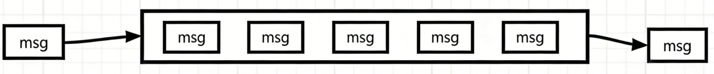

**消息传递：**指的是程序之间通过消息发送数据进行通信，而不是通过直接调用彼此来通信，直接调用通常是用于诸如远程过程调用的技术。

**排队：**指的是应用程序通过队列来通信。

**业务场景说明：**

消息队列在大型电子商务类网站，如京东、淘宝等网站有着深入的应用，为什么会产生消息队列？有几个原因：

不同进程（process）之间传递消息时，两个进程之间**耦合**程度过高，改动一个进程，引发必须修改另一个进程，为了**隔离**这两个进程，在两进程间抽离出一层（一个模块），所有两进程之间传递的消息，都必须通过消息队列来传递，单独修改某一个进程，不会影响另一个；

不同进程（process）之间传递消息时，为了实现标准化，将消息的格式规范化了，并且，某一个进程接受的**消息太多**，一下子无法处理完，并且也有先后顺序，必须对收到的消息**进行排队**，因此诞生了事实上的消息队列；

在项目中，可将一些无需即时返回且耗时的操作提取出来，进行**异步处理**，而这种异步处理的方式大大的节省了服务器的请求响应时间，从而**提高**了**系统**的**吞吐量**。


## 3 消息队列应用场景

首先我们先说一下消息中间件的主要的作用：

　　**[1]异步处理**

　　**[2]解耦服务**

　　**[3]流量削峰**

上面的三点是我们使用消息中间件最主要的目的.


### 3.1 应用解耦

* 以下单功能为例，如下图，存在功能耦合度高的问题。
* 用户下单，需要保存订单，更新购物车，更新库存，还要更新积分，如果在操作过程中，有任何一个环节失败了，最终会导致操作失败，返回错误信息

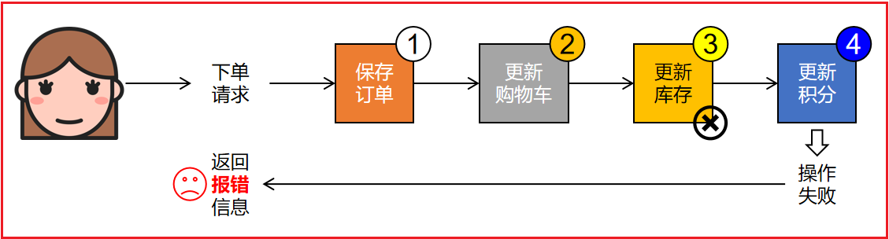

* 而采用消息队列方式，可以很好的解决耦合度过高问题

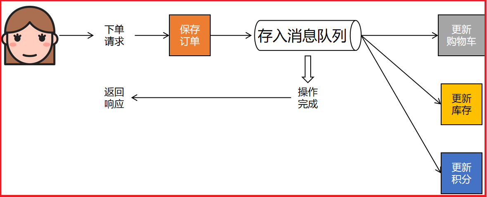

### 3.2 异步处理

场景说明：用户注册后，需要发注册邮件和注册短信，传统的做法有两种

* 串行的方式

* 并行的方式

**(1)** **串行方式：**

将注册信息写入数据库后，发送注册邮件，再发送注册短信，以上三个任务全部完成后才返回给客户端。 这有一个问题是，邮件，短信并不是必须的，它只是一个通知，而这种做法让客户端等待没有必要等待的东西。

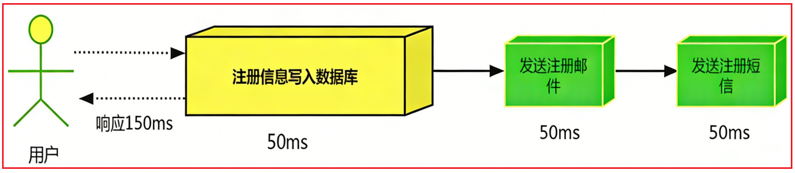

**(2)** **并行方式：**

将注册信息写入数据库后，发送邮件的同时，发送短信，以上三个任务完成后，返回给客户端，并行的方式能提高处理的时间。

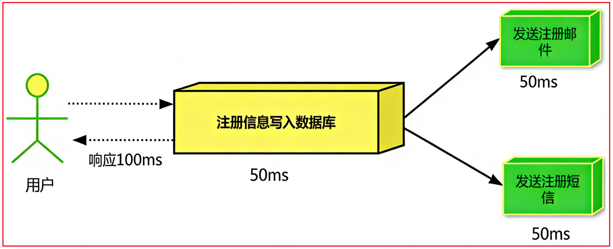

假设三个业务节点分别使用50ms，串行方式使用时间150ms，并行使用时间100ms。虽然并行已经提高了处理时间，但是，前面说过，邮件和短信对我正常的使用网站没有任何影响，客户端没有必要等着其发送完成才显示注册成功，应该是写入数据库后就返回.

**(3)消息队列**
引入消息队列后，把发送邮件，短信不是必须的业务逻辑异步处理

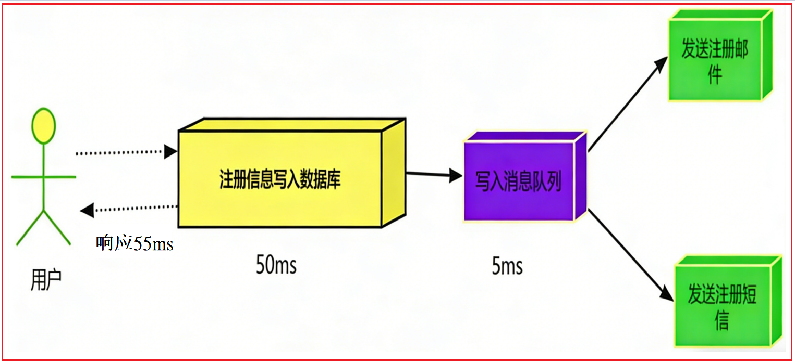

 由此可以看出，引入消息队列后，用户的响应时间就等于写入数据库的时间+写入消息队列的时间(可以忽略不计)，

引入消息队列后处理后，响应时间是串行的3分之1，是并行的2分之1。

**传统模式的缺点：**

· 一些非必要的业务逻辑以同步的方式运行，太耗费时间。

**中间件模式的的优点：**

· 将消息写入消息队列，非必要的业务逻辑以异步的方式运行，加快响应速度


### 3.3 流量削峰

流量削峰一般在秒杀活动中应用广泛

**场景：** 秒杀活动，一般会因为流量过大，导致应用挂掉，为了解决这个问题，一般在应用前端加入消息队列。

**传统模式**

如订单系统，在下单的时候就会往数据库写数据。但是数据库只能支撑每秒1000左右的并发写入，并发量再高就容易宕机。低峰期的时候并发也就100多个，但是在高峰期时候，并发量会突然激增到5000以上，这个时候数据库肯定卡死了。

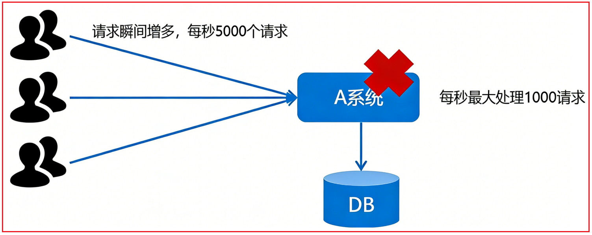

**传统模式的缺点：**

· 并发量大的时候，所有的请求直接怼到数据库，造成数据库连接异常

**中间件模式：**

消息被MQ保存起来了，然后系统就可以按照自己的消费能力来消费，比如每秒1000个数据，这样慢慢写入数据库，这样就不会卡死数据库了。

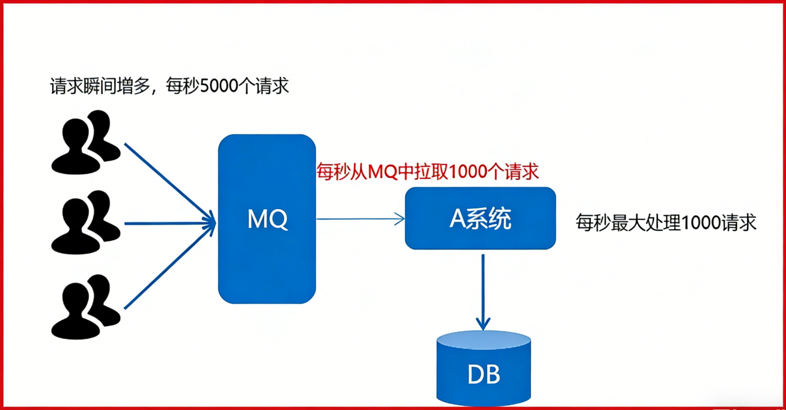

**中间件模式的的优点：**

系统A慢慢按照数据库能处理的并发量，从消息队列中拉取消息。在生产中，这个短暂的高峰期积压是允许的。

**流量削峰也叫做削峰填谷**

使用了MQ之后，限制消费消息的速度为1000，但是这样一来，高峰期产生的数据势必会被积压在MQ中，高峰就被“削”掉了。但是因为消息积压，在高峰期过后的一段时间内，消费消息的速度还是会维持在 3消费完积压的消息，这就叫做“填谷”


## **4 AMQP 和 JMS**

MQ是消息通信的模型；实现MQ的大致有两种主流方式：AMQP、JMS。

### **4.1. AMQP**

AMQP是一种**高级消息队列协议（Advanced Message Queuing Protocol），更准确的说是一种binary wire-level protocol（**链接协议）。这是其和JMS的本质差别，AMQP不从API层进行限定，而是直接定义网络交换的数据格式。

### **4.2. JMS**

JMS即**Java消息服务（JavaMessage Service）**应用程序接口，是一个Java平台中关于面向消息中间件（MOM）的API，用于在两个应用程序之间，或分布式系统中发送消息，进行异步通信。

### **4.3. AMQP 与 JMS 区别**

· JMS是定义了统一的接口，来对消息操作进行统一；AMQP是通过规定协议来统一数据交互的格式

· JMS限定了必须使用Java语言；AMQP只是协议，不规定实现方式，因此是跨语言的。

· JMS规定了两种消息模式；而AMQP的消息模式更加丰富


## **5 消息队列产品**

市场上常见的消息队列有如下：

· ActiveMQ：基于JMS

· Rabbitmq:基于AMQP协议，erlang语言开发，稳定性好

· RocketMQ：基于JMS，阿里巴巴产品

· Kafka：类似MQ的产品；分布式消息系统，高吞吐量

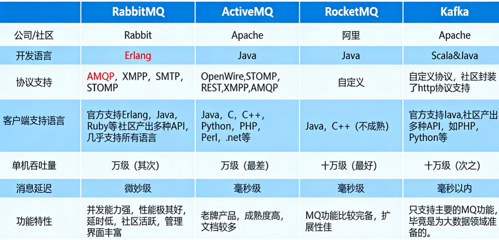


## 6 RabbitMQ介绍

### 6.1 简介

RabbitMQ是由erlang语言开发，基于AMQP（Advanced Message Queue 高级消息队列协议）协议实现的消息队列，它是一种应用程序之间的通信方法，消息队列在分布式系统开发中应用非常广泛。

AMQP，即 Advanced Message Queuing Protocol（高级消息队列协议），是一个网络协议，是应用层协议的一个开放标准，为面向消息的中间件设计。基于此协议的客户端与消息中间件可传递消息，并不受客户端/中间件不同产品，不同的开发语言等条件的限制。2006年，AMQP 规范发布。类比HTTP。

2007年，Rabbit 技术公司基于 AMQP 标准开发的 RabbitMQ 1.0 发布。RabbitMQ 采用 Erlang 语言开发。Erlang 语言由 Ericson 设计，专门为开发高并发和分布式系统的一种语言，在电信领域使用广泛。

RabbitMQ官方地址：http://www.rabbitmq.com/

RabbitMQ提供了**多种工作模式**：简单模式，work模式 ，Publish/Subscribe发布与订阅模式，Routing路由模式，Topics主题模式等

官网对应模式介绍：https://www.rabbitmq.com/getstarted.html

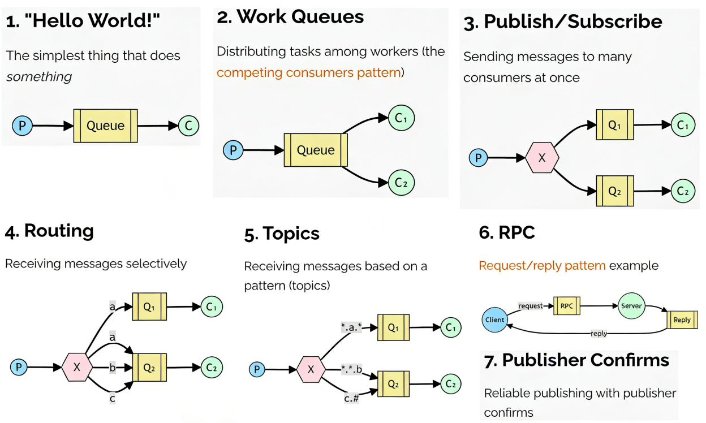

### 6.2 RabbitMQ基础架构

* **基础架构图**

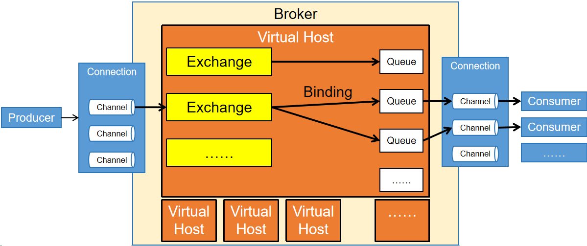

* **RabbitMQ相关概念**

**Broker：**接收和分发消息的应用，RabbitMQ Server就是 Message Broker

**Virtual host：**出于多租户和安全因素设计的，把 AMQP 的基本组件划分到一个虚拟的分组中，类似于网络中的 namespace 概念。当多个不同的用户使用同一个 RabbitMQ server 提供的服务时，可以划分出多个vhost，每个用户在自己的 vhost 创建 exchange／queue 等

**Connection：**publisher／consumer 和 broker 之间的 TCP 连接

**Channel：**如果每一次访问 RabbitMQ 都建立一个 Connection，在消息量大的时候建立 TCP Connection的开销将是巨大的，效率也较低。Channel 是在 connection 内部建立的逻辑连接，如果应用程序支持多线程，通常每个thread创建单独的 channel 进行通讯，AMQP method 包含了channel id 帮助客户端和message broker 识别 channel，所以 channel 之间是完全隔离的。Channel 作为轻量级的 Connection 极大减少了操作系统建立 TCP connection 的开销

**Exchange：**message 到达 broker 的第一站，根据分发规则，匹配查询表中的 routing key，分发消息到queue 中去。常用的类型有：**direct (point-to-point)**， **topic (publish-subscribe)** and **fanout (multicast)**

**Queue：**存储消息的容器，消息最终被送到这里，等待 consumer 取走

**Binding：**exchange 和 queue 之间的虚拟连接，binding 中可以包含 routing key。Binding 信息被保存到 exchange 中的查询表中，用于 message 的分发依据


# 二、RabbitMQ安装

## 1 安装

```shell
# 拉取镜像
docker pull rabbitmq:3.13-management

# -d 参数：后台运行 Docker 容器
# --name 参数：设置容器名称
# -p 参数：映射端口号，格式是“宿主机端口号:容器内端口号”。5672供客户端程序访问，15672供后台管理界面访问
# -v 参数：卷映射目录
# -e 参数：设置容器内的环境变量，这里我们设置了登录RabbitMQ管理后台的默认用户和密码
docker run -d \
--name rabbitmq \
-p 5672:5672 \
-p 15672:15672 \
-v rabbitmq-plugin:/plugins \
-e RABBITMQ_DEFAULT_USER=guest \
-e RABBITMQ_DEFAULT_PASS=123456 \
rabbitmq:3.13-management
```


## 2 验证

访问后台管理界面：http://192.168.200.100:15672

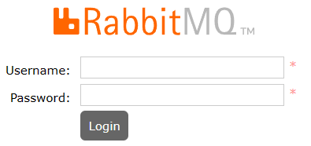


使用上面创建Docker容器时指定的默认用户名、密码登录：

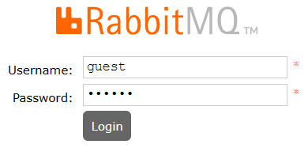


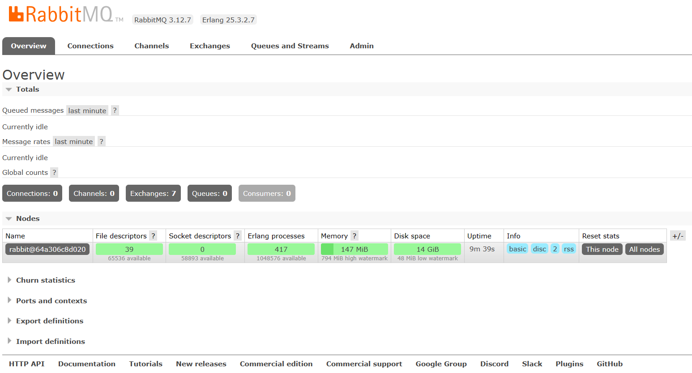


# 三、RabbitMQ入门案例

## 1 实现目标

生产者发送消息，消费者接收消息，用最简单的方式实现


## 2 创建队列

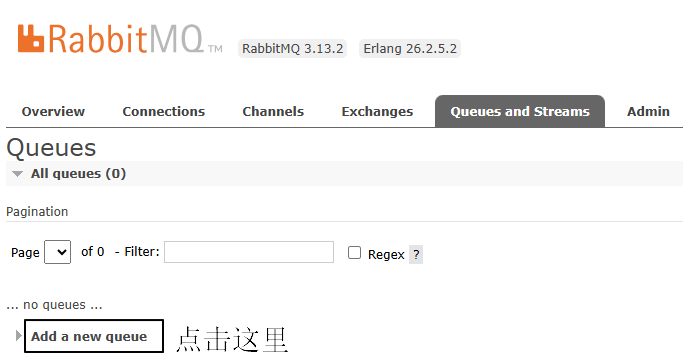


队列名称：atguigu.queue.simple

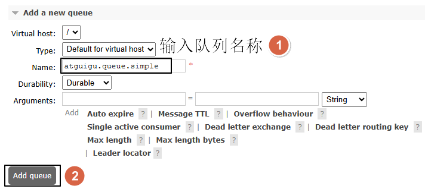


## 3 整合 SpringBoot

### 3.1 创建SpringBoot工程

* **项目结构**

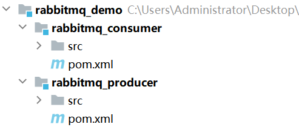

* **引入依赖**

```xml
<parent>
    <groupId>org.springframework.boot</groupId>
    <artifactId>spring-boot-starter-parent</artifactId>
    <version>3.0.5</version>
</parent>

<dependencies>
    <dependency>
        <groupId>org.springframework.boot</groupId>
        <artifactId>spring-boot-starter-amqp</artifactId>
    </dependency>
    <dependency>
        <groupId>org.springframework.boot</groupId>
        <artifactId>spring-boot-starter-test</artifactId>
    </dependency>
</dependencies>
```


### 3.2 生产者端工程

#### ①创建module

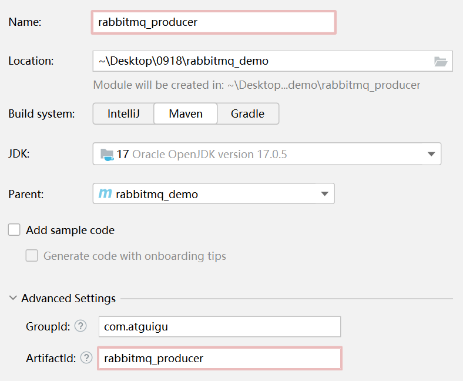


#### ②YAML

```yaml
spring:
  rabbitmq:
    host: 192.168.200.130
    port: 5672
    username: guest
    password: guest
    virtual-host: /
```


#### ③主启动类

```java
package com.atguigu.mq;

import org.springframework.boot.SpringApplication;
import org.springframework.boot.autoconfigure.SpringBootApplication;

@SpringBootApplication
public class RabbitMQProducerMainType {

    public static void main(String[] args) {
        SpringApplication.run(RabbitMQProducerMainType.class, args);
    }

}
```


#### ④测试程序

```java
package com.atguigu.mq.test;

import org.junit.jupiter.api.Test;
import org.springframework.amqp.rabbit.core.RabbitTemplate;
import org.springframework.beans.factory.annotation.Autowired;
import org.springframework.boot.test.context.SpringBootTest;

@SpringBootTest
public class RabbitMQTest {

    // 在简单模式下，没有用到交换机
    public static final String EXCHANGE_DIRECT = "";

    // 在简单模式下，消息直接发送到队列，此时生产者端需要把队列名称从路由键参数这里传入
    public static final String ROUTING_KEY_SIMPLE = "atguigu.queue.simple";

    // 注入 RabbitTemplate 执行
    @Autowired
    private RabbitTemplate rabbitTemplate;

    @Test
    public void testSendMessageSimple() {
        // 发送消息
        rabbitTemplate.convertAndSend(
                EXCHANGE_DIRECT,   	// 指定交换机名称
                ROUTING_KEY_SIMPLE, // 指定路由键名称
                "Hello atguigu");   // 消息内容，也就是消息数据本身
    }

}
```


#### ⑤测试效果

消息发送到了队列中：


### 3.3 消费端工程

#### ①创建module

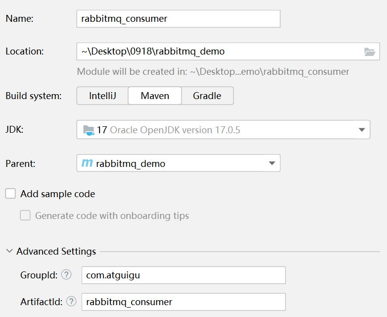


#### ②YAML

```yaml
spring:
  rabbitmq:
    host: 192.168.200.130
    port: 5672
    username: guest
    password: guest
    virtual-host: /
```


#### ③主启动类

仿照生产者工程的主启动类，改一下类名即可

```java
package com.atguigu.mq;

import org.springframework.boot.SpringApplication;
import org.springframework.boot.autoconfigure.SpringBootApplication;

@SpringBootApplication
public class RabbitMQConsumerMainType {

    public static void main(String[] args) {
        SpringApplication.run(RabbitMQConsumerMainType.class, args);
    }

}
```


#### ④监听器

- 使用 @RabbitListener 注解设定要监听的队列名称
- 消息数据使用和发送端一样的数据类型接收

```java
package com.atguigu.mq.listener;

import com.rabbitmq.client.Channel;
import org.springframework.amqp.core.Message;
import org.springframework.amqp.rabbit.annotation.RabbitListener;
import org.springframework.stereotype.Component;

@Component
public class MyMessageListener {

    @RabbitListener(queues = {"atguigu.queue.simple"})
    public void processMessage(String messageContent, Message message, Channel channel) {
        System.out.println("messageContent = " + messageContent);
    }

}
```


#### ⑤执行测试

监听方法不能直接运行，请大家通过主启动类运行微服务。消费端取走消息之后，队列中就没有消息了：

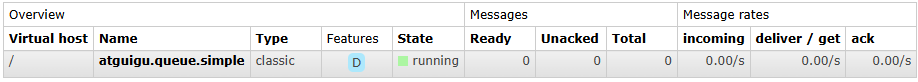


# 四、RabbitMQ工作模式

* RabbitMQ提供了**多种工作模式**：简单模式，work模式 ，Publish/Subscribe发布与订阅模式，Routing路由模式，Topics主题模式等

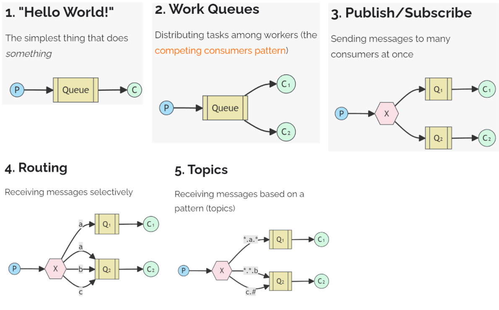

官网对应模式介绍：https://www.rabbitmq.com/getstarted.html

## **1 Work queues工作队列模式**

### **1.1 模式说明**


Work Queues与入门程序的简单模式相比，多了一个或一些消费端，多个消费端共同消费同一个队列中的消息。

**应用场景**：对于 任务过重或任务较多情况使用工作队列可以提高任务处理的速度

比如：生产者将 1000 个订单处理任务发送到工作队列，部署 5 个消费者实例，每个消费者处理 200 个订单，避免单实例处理耗时过长


### 1.2 工作队列模式代码

#### 1.2.1 生产者代码

```java
public static final String EXCHANGE_DIRECT = "";
public static final String ROUTING_KEY_WORK = "atguigu.queue.work";

@Test
public void testSendMessageWork() {
    for (int i = 0; i < 10; i++) {
        rabbitTemplate.convertAndSend(
                EXCHANGE_DIRECT,
                ROUTING_KEY_WORK,
                "Hello atguigu " + i);
    }
}
```


* **发送消息效果**

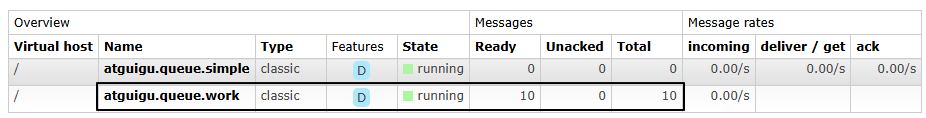


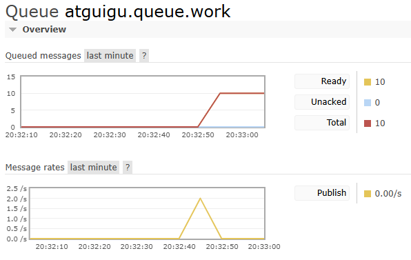


#### 1.2.2 消费者代码

##### 监听器

```java
package com.atguigu.mq.listener;

import com.rabbitmq.client.Channel;
import org.springframework.amqp.core.Message;
import org.springframework.amqp.rabbit.annotation.RabbitListener;
import org.springframework.beans.factory.annotation.Value;
import org.springframework.stereotype.Component;

@Component
public class MyMessageListener {

    @Value("${server.port}")
    private String serverPort;

    @RabbitListener(queues = {"atguigu.queue.work"})
    public void processMessage(String messageContent, Message message, Channel channel) {
        System.out.println("Server Port:" + serverPort + " Message Content:" + messageContent);
    }

}
```


#### 1.2.3 运行效果

##### ①消费端A

> Server Port:10000 Message Content:Hello atguigu 0
> Server Port:10000 Message Content:Hello atguigu 2
> Server Port:10000 Message Content:Hello atguigu 4
> Server Port:10000 Message Content:Hello atguigu 6
> Server Port:10000 Message Content:Hello atguigu 8


##### ②消费端B

> Server Port:20000 Message Content:Hello atguigu 1
> Server Port:20000 Message Content:Hello atguigu 3
> Server Port:20000 Message Content:Hello atguigu 5
> Server Port:20000 Message Content:Hello atguigu 7
> Server Port:20000 Message Content:Hello atguigu 9


## **2 订阅模式类型**

订阅模式示例图：


前面2个案例中，只有3个角色：

· P：生产者，也就是要发送消息的程序

· C：消费者：消息的接受者，会一直等待消息到来。

· queue：消息队列，图中红色部分

而在订阅模型中，多了一个exchange角色，而且过程略有变化：

· P：生产者，也就是要发送消息的程序，但是不再发送到队列中，而是发给X（交换机）

· C：消费者，消息的接受者，会一直等待消息到来。

· Queue：消息队列，接收消息、缓存消息。

· Exchange：交换机，图中的X。一方面，接收生产者发送的消息。另一方面，知道如何处理消息，例如递交给某个特别队列、递交给所有队列、或是将消息丢弃。到底如何操作，取决于Exchange的类型。

**Exchange有常见以下3种类型**：

o Fanout：广播，将消息交给所有绑定到交换机的队列

o Direct：定向，把消息交给符合指定routing key 的队列

o Topic：通配符，把消息交给符合routing pattern（路由模式） 的队列

**Exchange（交换机）只负责转发消息，不具备存储消息的能力**，因此如果没有任何队列与Exchange绑定，或者没有符合路由规则的队列，那么消息会丢失！


## 3 Publish/Subscribe发布订阅模式

### 3.1 模式说明


发布订阅模式：
1、每个消费者监听自己的队列。
2、生产者将消息发给broker，由交换机将消息转发到绑定此交换机的每个队列，每个绑定交换机的队列都将接收
到消息

**应用场景**：用户下单并支付成功后，支付服务向交换机发布消息，绑定的 4 个队列（库存、物流、财务、消息）各自消费，5 个业务模块无需直接调用，降低耦合


### 3.2 代码实现

#### 1 创建组件

* 名称列表

| 组件   | 组件名称                                           |
| ------ | -------------------------------------------------- |
| 交换机 | atguigu.exchange.fanout                            |
| 队列   | atguigu.queue.fanout01<br />atguigu.queue.fanout02 |


#### 2 创建交换机

<span style="color:blue;">**注意**</span>：发布订阅模式要求交换机是Fanout类型


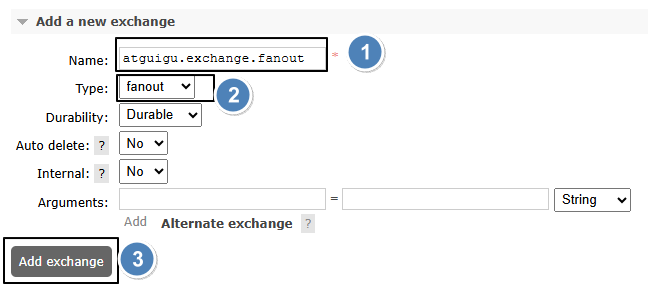


#### 3 创建队列并绑定交换机


此时可以到交换机下查看绑定关系：


#### 4 生产者代码

```java
public static final String EXCHANGE_FANOUT = "atguigu.exchange.fanout";

@Test
public void testSendMessageFanout() {
    rabbitTemplate.convertAndSend(EXCHANGE_FANOUT, "", "Hello fanout ~");
}
```


#### 5 消费者代码

两个监听器可以写在同一个微服务中，分别监听两个不同队列：

```java
package com.atguigu.mq.listener;

import com.rabbitmq.client.Channel;
import org.springframework.amqp.core.Message;
import org.springframework.amqp.rabbit.annotation.RabbitListener;
import org.springframework.stereotype.Component;

@Component
public class MyMessageListener {

    @RabbitListener(queues = {"atguigu.queue.fanout01"})
    public void processMessage01(String messageContent, Message message, Channel channel) {
        System.out.println("Consumer01 Message Content:" + messageContent);
    }

    @RabbitListener(queues = {"atguigu.queue.fanout02"})
    public void processMessage02(String messageContent, Message message, Channel channel) {
        System.out.println("Consumer02 Message Content:" + messageContent);
    }

}
```


#### 6 运行效果

先启动消费者，然后再运行生产者程序发送消息：

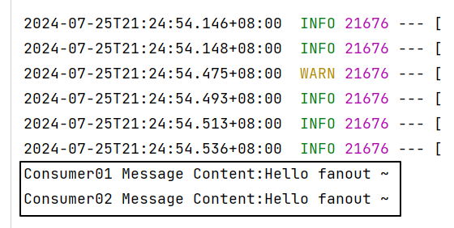


### 3.3 小结

交换机需要与队列进行绑定，绑定之后；一个消息可以被多个消费者都收到。

**发布订阅模式与工作队列模式的区别：**

- 工作队列模式本质上是绑定默认交换机
- 发布订阅模式绑定指定交换机
- 监听同一个队列的消费端程序彼此之间是竞争关系
- 绑定同一个交换机的多个队列在发布订阅模式下，消息是广播的，每个队列都能接收到消息


## 4 Routing路由模式

### 4.1 模式说明

路由模式特点：

· 队列与交换机的绑定，不能是任意绑定了，而是要指定一个RoutingKey（路由key）

· 消息的发送方在 向 Exchange发送消息时，也必须指定消息的 RoutingKey。

· Exchange不再把消息交给每一个绑定的队列，而是根据消息的Routing Key进行判断，只有队列的Routingkey与消息的 Routing key完全一致，才会接收到消息

**应用场景：**用户取消订单，生产者发送路由键为 `order.cancel` 的消息到 Direct 交换机，仅库存服务、优惠券服务的队列收到消息，物流 / 财务服务无感知，避免无效消费

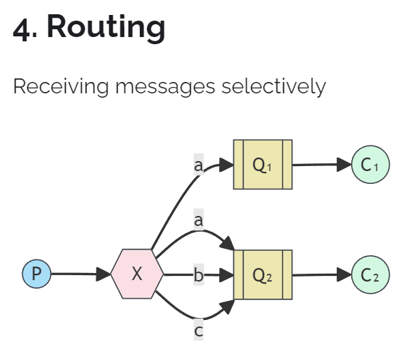

图解：

· P：生产者，向Exchange发送消息，发送消息时，会指定一个routing key。

· X：Exchange（交换机），接收生产者的消息，然后把消息递交给 与routing key完全匹配的队列

· C1：消费者，其所在队列指定了需要routing key 为 error 的消息

· C2：消费者，其所在队列指定了需要routing key 为 info、error、warning 的消息


### 4.2 代码实现

#### 1 创建组件

* 组件清单

没有特殊设置，名称外的其它参数都使用默认值：

| 组件   | 组件名称                 |
| ------ | ------------------------ |
| 交换机 | atguigu.exchange.direct  |
| 路由键 | atguigu.routing.key.good |
| 队列   | atguigu.queue.direct     |


#### 2 绑定


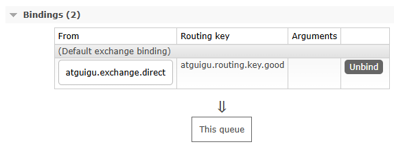


#### 3 生产者代码

```java
public static final String EXCHANGE_DIRECT = "atguigu.exchange.direct";

public static final String ROUTING_KEY_GOOD = "atguigu.routing.key.good";

@Test
public void testSendMessageRouting() {
    rabbitTemplate.convertAndSend(EXCHANGE_DIRECT, ROUTING_KEY_GOOD, "Hello routing ~");
}
```


#### 4 消费者代码

```java
@RabbitListener(queues = {"atguigu.queue.direct"})
public void processMessageRouting(String messageContent, Message message, Channel channel) {
    System.out.println("Message Content:" + messageContent);
}
```


#### 5 运行结果


## 5 Topics通配符模式

### **5.1. 模式说明**

Topic类型与Direct相比，都是可以根据RoutingKey把消息路由到不同的队列。只不过Topic类型Exchange可以让队列在绑定Routing key 的时候**使用通配符**！

Routingkey 一般都是有一个或多个单词组成，多个单词之间以”.”分割，例如： item.insert

通配符规则：

\#：匹配零个或多个词

*：匹配不多不少恰好1个词

举例：

item.#：能够匹配item.insert.abc 或者 item.insert

item.*：只能匹配item.insert

**应用场景：**用户支付订单失败（路由键 `order.pay.fail`），异常监控服务（绑定 `#.fail`）和订单服务（绑定 `order.*.*`）同时收到消息，前者触发告警，后者处理订单失败逻辑，无需为每个失败场景单独绑定


### 5.2 代码实现

#### 1 创建组件

* 组件清单

| 组件   | 组件名称                                       |
| ------ | ---------------------------------------------- |
| 交换机 | atguigu.exchange.topic                         |
| 路由键 | #.error<br />order.*<br />\*.\*                |
| 队列   | atguigu.queue.message<br />atguigu.queue.order |


#### 2 创建交换机

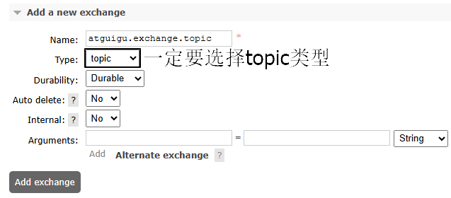


#### 3 绑定关系


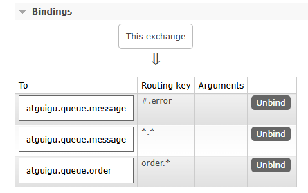


#### 4 生产者代码

```java
public static final String EXCHANGE_TOPIC = "atguigu.exchange.topic";
public static final String ROUTING_KEY_ERROR = "#.error";
public static final String ROUTING_KEY_ORDER = "order.*";
public static final String ROUTING_KEY_ALL = "*.*";

@Test
public void testSendMessageTopic() {
    rabbitTemplate.convertAndSend(EXCHANGE_TOPIC, "order.info", "message order info ...");
    rabbitTemplate.convertAndSend(EXCHANGE_TOPIC, "goods.info", "message goods info ...");
    rabbitTemplate.convertAndSend(EXCHANGE_TOPIC, "goods.error", "message goods error ...");
}
```


#### 5 消费者代码

```java
package com.atguigu.mq.listener;

import com.rabbitmq.client.Channel;
import org.springframework.amqp.core.Message;
import org.springframework.amqp.rabbit.annotation.RabbitListener;
import org.springframework.stereotype.Component;

@Component
public class MyMessageListener {

    @RabbitListener(queues = {"atguigu.queue.message"})
    public void processMessage01(String messageContent, Message message, Channel channel) {
        System.out.println("Queue Message:" + messageContent);
    }

    @RabbitListener(queues = {"atguigu.queue.order"})
    public void processMessage02(String messageContent, Message message, Channel channel) {
        System.out.println("Queue Order:" + messageContent);
    }

}
```


#### 6 运行效果


## 6 模式总结

### **1、简单模式 HelloWorld**

一个生产者、一个消费者，不需要设置交换机（使用默认的交换机）


### **2、工作队列模式 Work Queue**

一个生产者、多个消费者（竞争关系），不需要设置交换机（使用默认的交换机）


### **3、发布订阅模式 Publish/subscribe**

需要设置类型为fanout的交换机，并且交换机和队列进行绑定，当发送消息到交换机后，交换机会将消息发送到绑定的队列

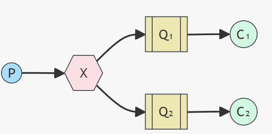


### **4、路由模式 Routing**

需要设置类型为direct的交换机，交换机和队列进行绑定，并且指定routing key，当发送消息到交换机后，交换机会根据routing key将消息发送到对应的队列

 


### **5、通配符模式 Topic**

需要设置类型为topic的交换机，交换机和队列进行绑定，并且指定通配符方式的routing key，当发送消息到交换机后，交换机会根据routing key将消息发送到对应的队列

 


# 五、消息的可靠性投递

## 1 概述

### 1.1 问题引入

* **正常的下单流程**

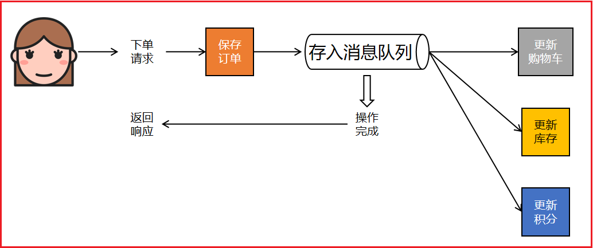

* **故障情况1：**

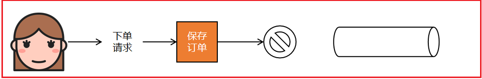

消息没有发送到消息队列上，后果：消费者拿不到消息，业务功能缺失，数据错误


* **故障情况2：**

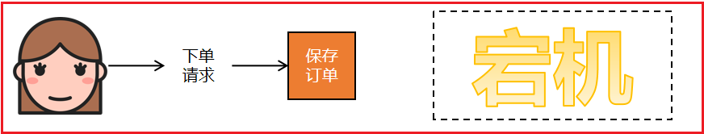

消息成功存入消息队列，但是消息队列服务器宕机了，原本保存在内存中的消息也丢失了，即使服务器重新启动，消息也找不回来了。后果：消费者拿不到消息，业务功能缺失，数据错误


* **故障情况3：**

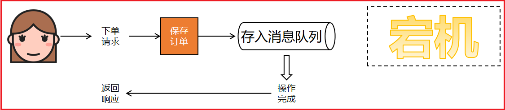

消息成功存入消息队列，但是消费端出现问题，例如：宕机、抛异常等等。后果：业务功能缺失，数据错误


### 1.2 解决方案

* 故障情况1：消息没有发送到消息队列在生产者端进行确认，具体操作中我们会分别针对交换机和队列来确认，如果没有成功发送到消息队列服务器上，那就可以尝试重新发送


* 故障情况2：消息队列服务器宕机导致内存中消息丢失解决思路：消息持久化到硬盘上，哪怕服务器重启也不会导致消息丢失


* 故障情况3：消费端宕机或抛异常导致消息没有成功被消费消费端消费消息成功，给服务器返回ACK信息，然后消息队列删除该消息消费端消费消息失败，给服务器端返回NACK信息，同时把消息恢复为待消费的状态，这样就可以再次取回消息，重试一次（当然，这就需要消费端接口支持幂等性）


## 2 故障1解决：生产者端消息确认机制

### 2.1 概述

* 在使用 RabbitMQ 的时候，作为消息发送方希望**杜绝任何消息丢失**或者**投递失败**场景。RabbitMQ 为我们提供了**两种方式**用来**控制消息的投递可靠性模式**。

**·** **confirm 确认模式**

**·** **return 退回模式**


* **rabbitmq 整个消息投递的路径为：**

producer—>rabbitmq broker—>exchange—>queue—>consumer

**·** 消息从 producer 到 exchange 则会返回一个 confirmCallback 。

**·** 消息从 exchange–>queue 投递失败则会返回一个 returnCallback 。

我们将利用这两个 callback 控制消息的可靠性投递


### 2.2 修改生产者端yml文件

<span style="color:blue;font-weight:bold;">注意</span>：publisher-confirm-type和publisher-returns是两个必须要增加的配置，如果没有则本节功能不生效

```yaml
spring:
  rabbitmq:
    host: 192.168.200.100
    port: 5672
    username: guest
    password: 123456
    virtual-host: /
    publisher-confirm-type: CORRELATED # 交换机的确认
    publisher-returns: true # 队列的确认
logging:
  level:
    com.atguigu.mq.config.MQProducerAckConfig: info
```


### 2.3 创建配置类

#### 1、目标

在这里我们为什么要创建这个配置类呢？首先，我们需要声明回调函数来接收RabbitMQ服务器返回的确认信息：

| 方法名            | 方法功能                 | 所属接口        | 接口所属类     |
| ----------------- | ------------------------ | --------------- | -------------- |
| confirm()         | 确认消息是否发送到交换机 | ConfirmCallback | RabbitTemplate |
| returnedMessage() | 确认消息是否发送到队列   | ReturnsCallback | RabbitTemplate |


然后，就是对RabbitTemplate的功能进行增强，因为回调函数所在对象必须设置到RabbitTemplate对象中才能生效。

原本RabbitTemplate对象并没有生产者端消息确认的功能，要给它设置对应的组件才可以。

而设置对应的组件，需要调用RabbitTemplate对象下面两个方法：

| 设置组件调用的方法   | 所需对象类型            |
| -------------------- | ----------------------- |
| setConfirmCallback() | ConfirmCallback接口类型 |
| setReturnCallback()  | ReturnCallback接口类型  |


#### 2、API说明

##### ①ConfirmCallback接口

这是RabbitTemplate内部的一个接口，源代码如下：

```java
    /**
     * A callback for publisher confirmations.
     *
     */
    @FunctionalInterface
    public interface ConfirmCallback {

        /**
         * Confirmation callback.
         * @param correlationData correlation data for the callback.
         * @param ack true for ack, false for nack
         * @param cause An optional cause, for nack, when available, otherwise null.
         */
        void confirm(@Nullable CorrelationData correlationData, boolean ack, @Nullable String cause);

    }
```

生产者端发送消息之后，回调confirm()方法

- ack参数值为true：表示消息成功发送到了交换机
- ack参数值为false：表示消息没有发送到交换机


##### ②ReturnCallback接口

同样也RabbitTemplate内部的一个接口，源代码如下：

```java
    /**
     * A callback for returned messages.
     *
     * @since 2.3
     */
    @FunctionalInterface
    public interface ReturnsCallback {

        /**
         * Returned message callback.
         * @param returned the returned message and metadata.
         */
        void returnedMessage(ReturnedMessage returned);

    }
```

<span style="color:blue;font-weight:bold;">注意</span>：接口中的returnedMessage()方法<span style="color:blue;font-weight:bold;font-size:25px;">仅</span>在消息<span style="color:blue;font-weight:bold;font-size:25px;">没有</span>发送到队列时调用

ReturnedMessage类中主要属性含义如下：

| 属性名     | 类型                                  | 含义                         |
| ---------- | ------------------------------------- | ---------------------------- |
| message    | org.springframework.amqp.core.Message | 消息以及消息相关数据         |
| replyCode  | int                                   | 应答码，类似于HTTP响应状态码 |
| replyText  | String                                | 应答码说明                   |
| exchange   | String                                | 交换机名称                   |
| routingKey | String                                | 路由键名称                   |


#### 3、配置类代码

##### ①要点1

加@Component注解，加入IOC容器


##### ②要点2

配置类自身实现ConfirmCallback、ReturnCallback这两个接口，然后通过this指针把配置类的对象设置到RabbitTemplate对象中。

操作封装到了一个专门的void init()方法中。

为了保证这个void init()方法在应用启动时被调用，我们使用@PostConstruct注解来修饰这个方法。

关于@PostConstruct注解大家可以参照以下说明：

> @PostConstruct注解是<span style="color:blue;font-weight:bolder;">Java中的一个标准注解</span>，它用于指定在<span style="color:blue;font-weight:bolder;">对象创建之后立即执行</span>的方法。当使用依赖注入（如Spring框架）或者其他方式创建对象时，@PostConstruct注解可以确保在对象完全初始化之后，执行相应的方法。
>
> 使用@PostConstruct注解的方法必须满足以下条件：
>
> 1. <span style="color:blue;font-weight:bolder;">方法不能有任何参数</span>。
> 2. <span style="color:blue;font-weight:bolder;">方法必须是非静态的</span>。
> 3. <span style="color:blue;font-weight:bolder;">方法不能返回任何值</span>。
>
> 当容器实例化一个带有@PostConstruct注解的Bean时，它会在<span style="color:blue;font-weight:bolder;">调用构造函数之后</span>，并在<span style="color:blue;font-weight:bolder;">依赖注入完成之前</span>调用被@PostConstruct注解标记的方法。这样，我们可以在该方法中进行一些初始化操作，比如读取配置文件、建立数据库连接等。


##### ③代码

有了以上说明，下面我们就可以展示配置类的整体代码：

```java
package com.atguigu.mq.config;

import jakarta.annotation.PostConstruct;
import lombok.extern.slf4j.Slf4j;
import org.springframework.amqp.core.ReturnedMessage;
import org.springframework.amqp.rabbit.connection.CorrelationData;
import org.springframework.amqp.rabbit.core.RabbitTemplate;
import org.springframework.beans.factory.annotation.Autowired;
import org.springframework.stereotype.Component;

@Component
@Slf4j
public class MQProducerAckConfig implements RabbitTemplate.ConfirmCallback, RabbitTemplate.ReturnsCallback{

    @Autowired
    private RabbitTemplate rabbitTemplate;

    @PostConstruct
    public void init() {
        rabbitTemplate.setConfirmCallback(this);
        rabbitTemplate.setReturnsCallback(this);
    }

    @Override
    public void confirm(CorrelationData correlationData, boolean ack, String cause) {
        if (ack) {
            log.info("消息发送到交换机成功！数据：" + correlationData);
        } else {
            log.info("消息发送到交换机失败！数据：" + correlationData + " 原因：" + cause);
        }
    }

    @Override
    public void returnedMessage(ReturnedMessage returned) {
        log.info("消息主体: " + new String(returned.getMessage().getBody()));
        log.info("应答码: " + returned.getReplyCode());
        log.info("描述：" + returned.getReplyText());
        log.info("消息使用的交换器 exchange : " + returned.getExchange());
        log.info("消息使用的路由键 routing : " + returned.getRoutingKey());
    }
}
```


### 2.5 发送消息

```java
package com.atguigu.mq.test;

import org.junit.jupiter.api.Test;
import org.springframework.amqp.rabbit.core.RabbitTemplate;
import org.springframework.beans.factory.annotation.Autowired;
import org.springframework.boot.test.context.SpringBootTest;

@SpringBootTest
public class RabbitMQTest {

    public static final String EXCHANGE_DIRECT = "exchange.direct.order";
    public static final String ROUTING_KEY = "order";

    @Autowired
    private RabbitTemplate rabbitTemplate;

    @Test
    public void testSendMessage() {
        rabbitTemplate.convertAndSend(
                EXCHANGE_DIRECT,
                ROUTING_KEY,
                "Hello atguigu");
    }

}
```

通过调整代码，测试如下三种情况：

- 交换机正确、路由键正确
- 交换机正确、路由键不正确，无法发送到队列
- 交换机不正确，无法发送到交换机


## 3 故障2解决：交换机和队列持久化

### 3.1 测试非持久化交换机和队列

#### 1、创建非持久化交换机

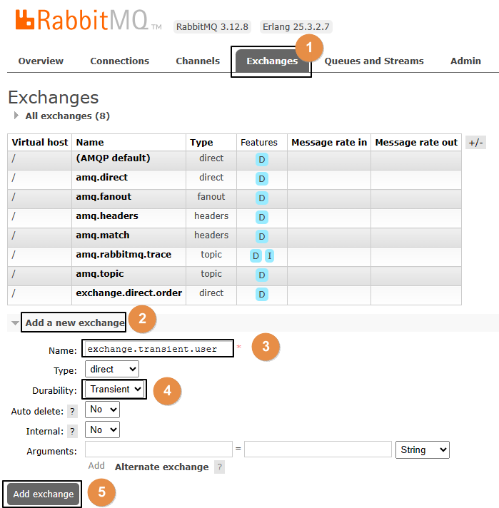


创建之后，可以在列表中看到：

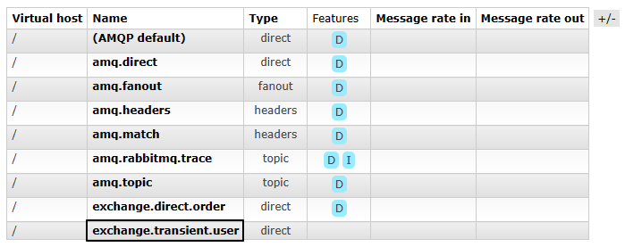


#### 2、创建非持久化队列

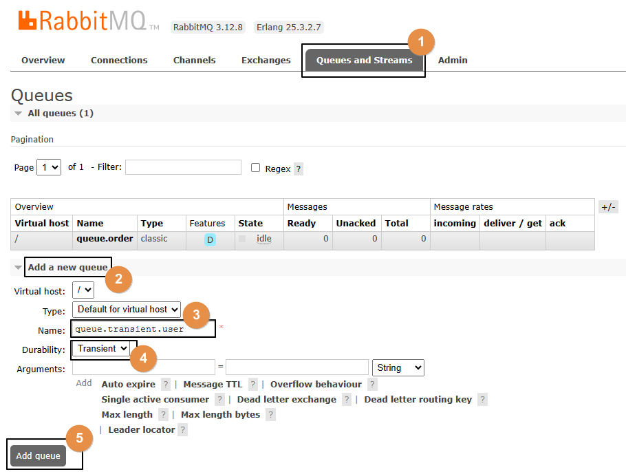


创建之后，可以在列表中看到：

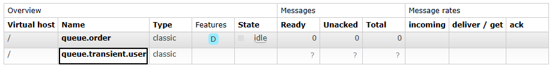


#### 3、绑定

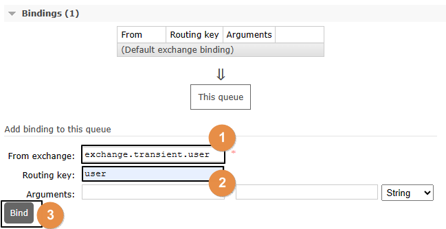


#### 4、发送消息

```java
    public static final String EXCHANGE_TRANSIENT = "exchange.transient.user";
    public static final String ROUTING_KEY_TRANSIENT = "user";

    @Test
    public void testSendMessageTransient() {
        rabbitTemplate.convertAndSend(
                EXCHANGE_TRANSIENT,
                ROUTING_KEY_TRANSIENT,
                "Hello atguigu user~~~");
    }
```


#### 5、查看已发送消息

#### 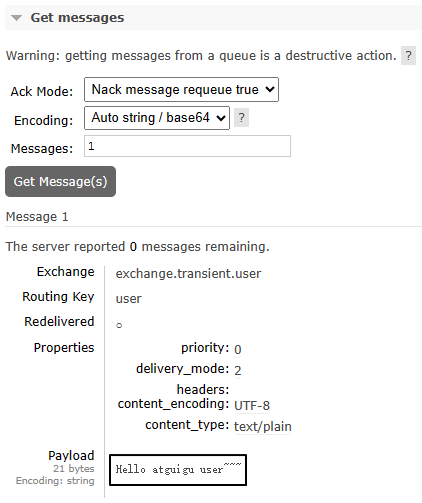

结论：临时性的交换机和队列也能够接收消息，但如果RabbitMQ服务器重启之后会怎么样呢？


#### 6、重启RabbitMQ服务器

```shell
docker restart rabbitmq
```

重启之后，刚才临时性的交换机和队列都没了。在交换机和队列这二者中，队列是消息存储的容器，队列没了，消息就也跟着没了。


### 3.2 持久化的交换机和队列

我们其实不必专门创建持久化的交换机和队列，因为它们默认就是持久化的。接下来我们只需要确认一下：存放到队列中，尚未被消费端取走的消息，是否会随着RabbitMQ服务器重启而丢失？

#### 1、发送消息

运行以前的发送消息方法即可，不过要关掉消费端程序


#### 2、在管理界面查看消息

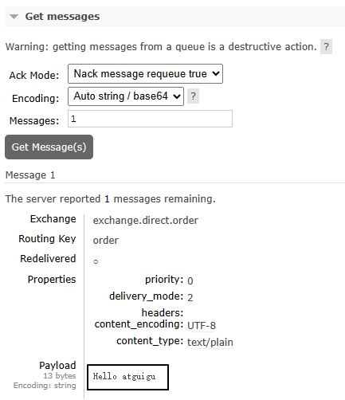


#### 3、重启RabbitMQ服务器

```shell
docker restart rabbitmq
```


#### 4、再次查看消息

仍然还在：

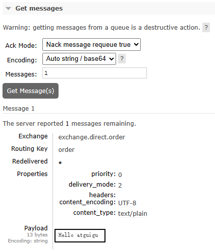


### 3.3 结论

在后台管理界面创建交换机和队列时，默认就是持久化的模式。

此时消息也是持久化的，不需要额外设置。


## 4 故障3解决：消费端消息确认

### 4.1 默认情况

默认情况下，消费端取回消息后，默认会自动返回ACK确认消息，所以在前面的测试中消息被消费端消费之后，RabbitMQ得到ACK确认信息就会删除消息

但实际开发中，消费端根据消息队列投递的消息执行对应的业务，未必都能执行成功，如果希望能够多次重试，那么默认设定就不满足要求了

所以还是要修改成手动确认

注：ACK是acknowledge的缩写，表示已确认


### 4.2 修改消费端yml文件

增加针对监听器的设置：

```yaml
spring:
  rabbitmq:
    host: 192.168.200.130
    port: 5672
    username: guest
    password: 123456
    virtual-host: /
    listener:
      simple:
        acknowledge-mode: manual # 把消息确认模式改为手动确认
```


### 4.3 消费端监听器

#### 1、创建监听器方法

* **在接收消息的方法上应用注解**

```java
// 修饰监听方法
@RabbitListener(
        // 设置绑定关系
        bindings = @QueueBinding(

            // 配置队列信息：durable 设置为 true 表示队列持久化；autoDelete 设置为 false 表示关闭自动删除
            value = @Queue(value = QUEUE_NAME, durable = "true", autoDelete = "false"),

            // 配置交换机信息：durable 设置为 true 表示队列持久化；autoDelete 设置为 false 表示关闭自动删除
            exchange = @Exchange(value = EXCHANGE_DIRECT, durable = "true", autoDelete = "false"),

            // 配置路由键信息
            key = {ROUTING_KEY}
))
public void processMessage(String dataString, Message message, Channel channel) {

}
```


#### 2、接收消息方法内部逻辑

- 业务处理成功：手动返回ACK信息，表示消息成功消费
- 业务处理失败：手动返回NACK信息，表示消息消费失败。此时有两种后续操作供选择：
  - 把消息重新放回消息队列，RabbitMQ会重新投递这条消息，那么消费端将重新消费这条消息——从而让业务代码再执行一遍
  - 不把消息放回消息队列，返回reject信息表示拒绝，那么这条消息的处理就到此为止


#### 3、相关API

先回到PPT理解“deliveryTag：交付标签机制”

下面我们探讨的三个方法都是来自于com.rabbitmq.client.<span style="color:blue;font-weight:bolder;">Channel</span>接口

##### ①basicAck()方法

- 方法功能：给Broker返回ACK确认信息，表示消息已经在消费端成功消费，这样Broker就可以把消息删除了
- 参数列表：

| 参数名称         | 含义                                                         |
| ---------------- | ------------------------------------------------------------ |
| long deliveryTag | Broker给每一条进入队列的消息都设定一个唯一标识               |
| boolean multiple | 取值为true：为小于、等于deliveryTag的消息批量返回ACK信息<br/>取值为false：仅为指定的deliveryTag返回ACK信息 |


##### ②basicNack()方法

- 方法功能：给Broker返回NACK信息，表示消息在消费端消费失败，此时Broker的后续操作取决于参数requeue的值
- 参数列表：

| 参数名称         | 含义                                                         |
| ---------------- | ------------------------------------------------------------ |
| long deliveryTag | Broker给每一条进入队列的消息都设定一个唯一标识               |
| boolean multiple | 取值为true：为小于、等于deliveryTag的消息批量返回ACK信息<br/>取值为false：仅为指定的deliveryTag返回ACK信息 |
| boolean requeue  | 取值为true：Broker将消息重新放回队列，接下来会重新投递给消费端<br/>取值为false：Broker将消息标记为已消费，不会放回队列 |


##### ③basicReject()方法

- 方法功能：根据指定的deliveryTag，对该消息表示拒绝
- 参数列表：

| 参数名称         | 含义                                                         |
| ---------------- | ------------------------------------------------------------ |
| long deliveryTag | Broker给每一条进入队列的消息都设定一个唯一标识               |
| boolean requeue  | 取值为true：Broker将消息重新放回队列，接下来会重新投递给消费端<br/>取值为false：Broker将消息标记为已消费，不会放回队列 |

- basicNack()和basicReject()有啥区别？
  - basicNack()有批量操作
  - basicReject()没有批量操作


#### 4、完整代码示例

```java
@Component
@Slf4j
public class MyMessageListener {

    public static final String EXCHANGE_DIRECT = "exchange.direct.order";
    public static final String ROUTING_KEY = "order";
    public static final String QUEUE_NAME  = "queue.order";

    // 修饰监听方法
    @RabbitListener(
            // 设置绑定关系
            bindings = @QueueBinding(

                // 配置队列信息：durable 设置为 true 表示队列持久化；autoDelete 设置为 false 表示关闭自动删除
                value = @Queue(value = QUEUE_NAME, durable = "true", autoDelete = "false"),

                // 配置交换机信息：durable 设置为 true 表示队列持久化；autoDelete 设置为 false 表示关闭自动删除
                exchange = @Exchange(value = EXCHANGE_DIRECT, durable = "true", autoDelete = "false"),

                // 配置路由键信息
                key = {ROUTING_KEY}
    ))
    public void processMessage(String dataString, Message message, Channel channel) throws IOException {

        // 1、获取当前消息的 deliveryTag 值备用
        long deliveryTag = message.getMessageProperties().getDeliveryTag();
        try {
            // 2、正常业务操作
            log.info("消费端接收到消息内容：" + dataString);

            // System.out.println(10 / 0);

            // 3、给 RabbitMQ 服务器返回 ACK 确认信息
            channel.basicAck(deliveryTag, false);
        } catch (Exception e) {

            // 4、获取信息，看当前消息是否曾经被投递过
            Boolean redelivered = message.getMessageProperties().getRedelivered();

            if (!redelivered) {
                // 5、如果没有被投递过，那就重新放回队列，重新投递，再试一次
                channel.basicNack(deliveryTag, false, true);
            } else {
                // 6、如果已经被投递过，且这一次仍然进入了 catch 块，那么返回拒绝且不再放回队列
                channel.basicReject(deliveryTag, false);
            }
        }
    }
}
```


## 5 要点总结

- 要点1：把消息确认模式改为<span style="color:blue;font-weight:bold;">手动确认</span>
- 要点2：调用Channel对象的方法返回信息
  - ACK：Acknowledgement，表示消息处理成功
  - NACK：Negative Acknowledgement，表示消息处理失败
  - Reject：拒绝，同样表示消息处理失败
- 要点3：后续操作
  - requeue为true：重新放回队列，重新投递，再次尝试
  - requeue为false：不放回队列，不重新投递
- 要点4：deliveryTag 消息的唯一标识，查找具体某一条消息的依据


## 6 流程梳理


## 7 多啰嗦一句

消费端如果设定消息重新放回队列，Broker重新投递消息，那么消费端就可以再次消费消息，这是一种“重试”机制，这需要消费端代码支持“<span style="color:blue;font-weight:bold;">幂等性</span>”——这属于前置知识，不展开了。


# 六、消费端限流

## 1 概述

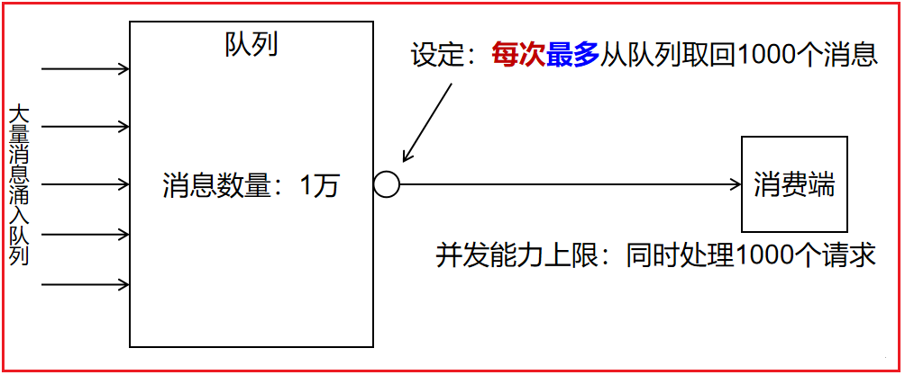

- 生产者发送10000个消息
- 消费端并发能力上限：同时处理1000个请求
- 设定：

​		每次最多从队列取回1000个请求


## 2 生产者端代码

```java
@Test
public void testSendMessage() {
    for (int i = 0; i < 100; i++) {
        rabbitTemplate.convertAndSend(
                EXCHANGE_DIRECT,
                ROUTING_KEY,
                "Hello atguigu" + i);
    }
}
```


## 3 消费者端代码

```java
// 2、正常业务操作
log.info("消费端接收到消息内容：" + dataString);

// System.out.println(10 / 0);
TimeUnit.SECONDS.sleep(1);

// 3、给 RabbitMQ 服务器返回 ACK 确认信息
channel.basicAck(deliveryTag, false);
```


## 4 测试

### 4.1 未使用prefetch

- 不要启动消费端程序，如果正在运行就把它停了
- 运行生产者端程序发送100条消息
- 查看队列中消息的情况：


- 说明：
  - Ready表示已经发送到队列的消息数量
  - Unacked表示已经发送到消费端但是消费端尚未返回ACK信息的消息数量
  - Total未被删除的消息总数

- 接下来启动消费端程序，再查看队列情况：


- 能看到消息全部被消费端取走了，正在逐个处理、确认，说明有多少消息消费端就并发处理多少


### 4.2 设定prefetch

#### ①YAML配置

```yaml
spring:
  rabbitmq:
    host: 192.168.200.130
    port: 5672
    username: guest
    password: 123456
    virtual-host: /
    listener:
      simple:
        acknowledge-mode: manual
        prefetch: 1 # 设置每次最多从消息队列服务器取回多少消息
```


#### ②测试流程

- 停止消费端程序
- 运行生产者端程序发送100条消息
- 查看队列中消息的情况：


- 接下来启动消费端程序，持续观察队列情况：


- 能看到消息不是一次性全部取回的，而是有个过程


# 七、消息超时

## 1 概述

TTL 全称 Time To Live（存活时间/过期时间）。

当消息到达存活时间后，还没有被消费，会被自动清除。

RabbitMQ可以对消息设置过期时间，也可以对整个队列（Queue）设置过期时间。

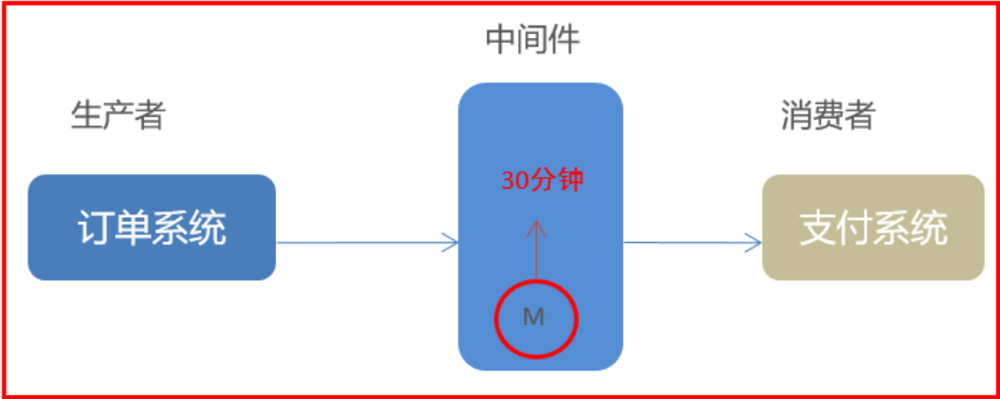


## 2 具体实现

### 2.1 队列层面设置

#### 1、设置

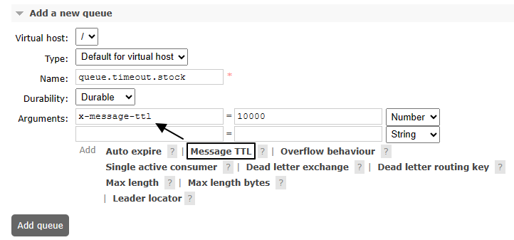


别忘了设置绑定关系：

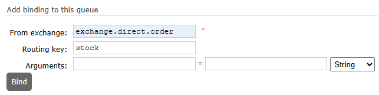


#### 2、测试

- 不启动消费端程序
- 向设置了过期时间的队列中发送100条消息
- 等10秒后，看是否全部被过期删除

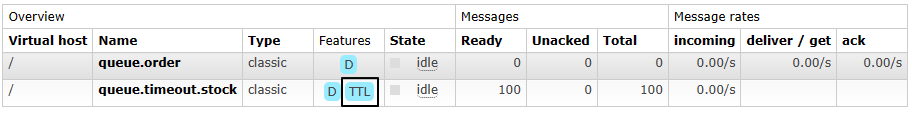


### 2.2 消息层面设置

#### 1、设置

```java
import org.springframework.amqp.core.Message;
import org.springframework.amqp.core.MessagePostProcessor;

@Test
public void testSendMessageTTL() {

    // 1、创建消息后置处理器对象
    MessagePostProcessor messagePostProcessor = (Message message) -> {

        // 设定 TTL 时间，以毫秒为单位
        message.getMessageProperties().setExpiration("5000");

        return message;
    };

    // 2、发送消息
    rabbitTemplate.convertAndSend(
            EXCHANGE_DIRECT,
            ROUTING_KEY,
            "Hello atguigu", messagePostProcessor);
}
```


#### 2、查看效果

这次我们是发送到普通队列上：


# 八、死信队列

## 1 概述

### 1.1 什么是死信队列

死信队列，英文缩写：DLX 。DeadLetter Exchange（死信交换机），当消息成为Dead message后，可以被重新发送到另一个交换机，这个交换机就是DLX。

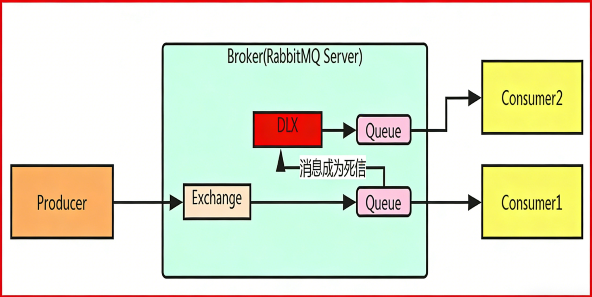

先从概念解释上搞清楚这个定义，死信，顾名思义就是无法被消费的消息，字面意思可以这样理解，一般来说，producer将消息投递到broker或者直接到queue里了，consumer从queue取出消息进行消费，但某些时候由于特定的原因导致queue中的某些消息无法被消费，这样的消息如果没有后续的处理，就变成了死信，有死信，自然就有了死信队列；


### 1.2 **消息成为死信的三种情况**

* **拒绝：**消费者拒接消息，basicNack()/basicReject()，并且不把消息重新放入原目标队列，requeue=false
* **溢出：**队列中消息数量到达限制。比如队列最大只能存储10条消息，且现在已经存储了10条，此时如果再发送一条消息进来，根据先进先出原则，队列中最早的消息会变成死信
* **超时：**消息到达超时时间未被消费


### 1.3 死信的处理方式

死信的产生既然不可避免，那么就需要从实际的业务角度和场景出发，对这些死信进行后续的处理，常见的处理方式大致有下面几种，

**① 丢弃，**如果不是很重要，可以选择丢弃

**② 记录死信入库，**然后做后续的业务分析或处理

**③ 通过死信队列，**由负责监听死信的应用程序进行处理

综合来看，更常用的做法是第三种，即通过死信队列，将产生的死信通过程序的配置路由到指定的死信队列，然后应用监听死信队列，对接收到的死信做后续的处理，


## 2 实现

### 2.1 测试相关准备

#### 1、创建死信交换机和死信队列

常规设定即可，没有特殊设置：

- 死信交换机：exchange.dead.letter.video
- 死信队列：queue.dead.letter.video
- 死信路由键：routing.key.dead.letter.video


#### 2、创建正常交换机和正常队列

<span style="color:blue;font-weight:bolder;">注意</span>：一定要注意正常队列有诸多限定和设置，这样才能让无法处理的消息进入死信交换机


- 正常交换机：exchange.normal.video
- 正常队列：queue.normal.video
- 正常路由键：routing.key.normal.video


全部设置完成后参照如下细节：

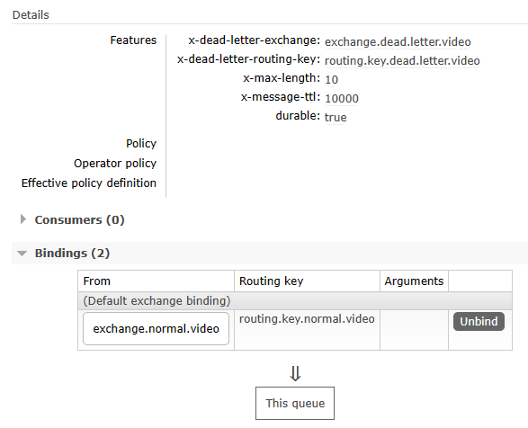


#### 3、Java代码中的相关常量声明

```java
public static final String EXCHANGE_NORMAL = "exchange.normal.video";
public static final String EXCHANGE_DEAD_LETTER = "exchange.dead.letter.video";

public static final String ROUTING_KEY_NORMAL = "routing.key.normal.video";
public static final String ROUTING_KEY_DEAD_LETTER = "routing.key.dead.letter.video";

public static final String QUEUE_NORMAL = "queue.normal.video";
public static final String QUEUE_DEAD_LETTER = "queue.dead.letter.video";
```


### 2.2 消费端拒收消息

#### 1、发送消息的代码

```java
@Test
public void testSendMessageButReject() {
    rabbitTemplate
            .convertAndSend(
                    EXCHANGE_NORMAL,
                    ROUTING_KEY_NORMAL,
                    "测试死信情况1：消息被拒绝");
}
```


#### 2、接收消息的代码

##### ①监听正常队列

```java
@RabbitListener(queues = {QUEUE_NORMAL})
public void processMessageNormal(Message message, Channel channel) throws IOException {
    // 监听正常队列，但是拒绝消息
    log.info("★[normal]消息接收到，但我拒绝。");
    channel.basicReject(message.getMessageProperties().getDeliveryTag(), false);
}
```

##### ②监听死信队列

```java
@RabbitListener(queues = {QUEUE_DEAD_LETTER})
public void processMessageDead(String dataString, Message message, Channel channel) throws IOException {
    // 监听死信队列
    log.info("★[dead letter]dataString = " + dataString);
    log.info("★[dead letter]我是死信监听方法，我接收到了死信消息");
    channel.basicAck(message.getMessageProperties().getDeliveryTag(), false);
}
```


#### 3、执行结果

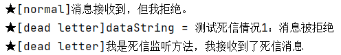


### 2.3 消息数量超过队列容纳极限

#### 1、发送消息的代码

```java
@Test
public void testSendMultiMessage() {
    for (int i = 0; i < 20; i++) {
        rabbitTemplate.convertAndSend(
                EXCHANGE_NORMAL,
                ROUTING_KEY_NORMAL,
                "测试死信情况2：消息数量超过队列的最大容量" + i);
    }
}
```


#### 2、接收消息的代码

消息接收代码不再拒绝消息：

```java
@RabbitListener(queues = {QUEUE_NORMAL})
public void processMessageNormal(Message message, Channel channel) throws IOException {
    // 监听正常队列
    log.info("★[normal]消息接收到。");
    channel.basicAck(message.getMessageProperties().getDeliveryTag(), false);
}
```

重启微服务使代码修改生效。


#### 3、执行效果

正常队列的参数如下图所示：

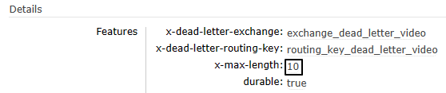


生产者发送20条消息之后，消费端死信队列接收到前10条消息：

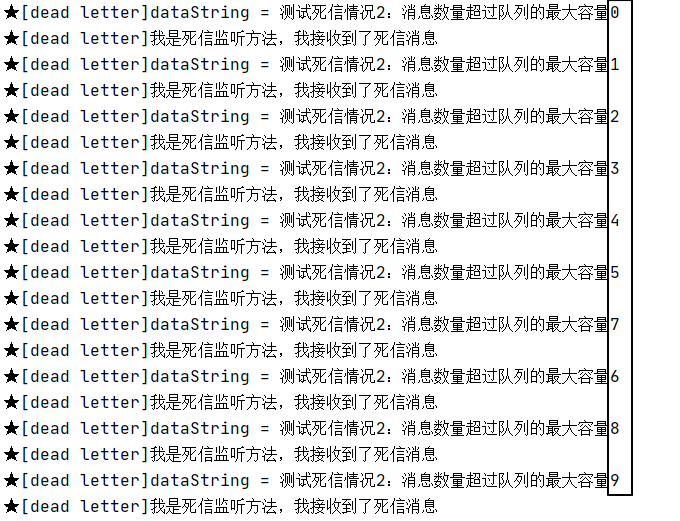


### 2.4 消息超时未消费

#### 1、发送消息的代码

正常发送一条消息即可，所以使用第一个例子的代码。

```java
@Test
public void testSendMessageTimeout() {
    rabbitTemplate
            .convertAndSend(
                    EXCHANGE_NORMAL,
                    ROUTING_KEY_NORMAL,
                    "测试死信情况3：消息超时");
}
```


#### 2、执行效果

队列参数生效：


因为没有消费端监听程序，所以消息未超时前滞留在队列中：

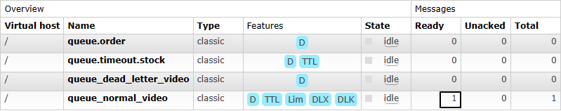


消息超时后，进入死信队列：

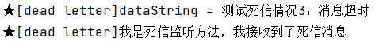


# 九、延迟队列

## 1 概述

* 延迟队列存储的对象肯定是对应的延时消息，所谓”延时消息”是指当消息被发送以后，并不想让消费者立即拿到消息，而是等待指定时间后，消费者才拿到这个消息进行消费。

* 场景：在订单系统中，一个用户下单之后通常有30分钟的时间进行支付，如果30分钟之内没有支付成功，那么这个订单将进行取消处理。这时就可以使用延时队列将订单信息发送到延时队列。

* 需求：

1. 下单后，30分钟未支付，取消订单，回滚库存。

2. 新用户注册成功30分钟后，发送短信问候。

* 实现：

使用延迟队列实现

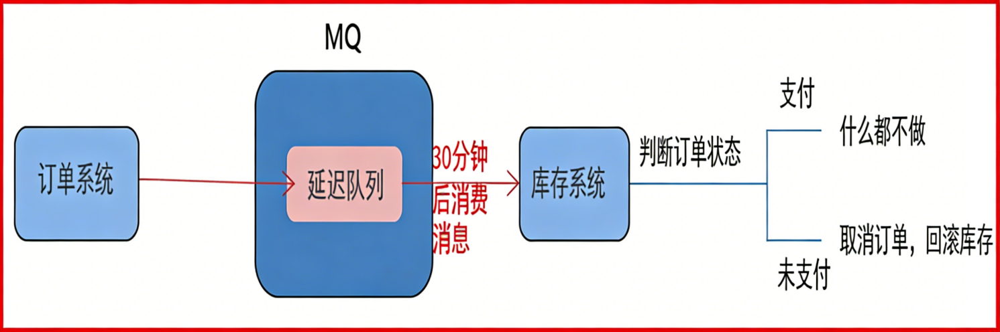

很可惜，在RabbitMQ中并未提供延迟队列功能


我们可以采用以下方案实现：

方案1：借助消息超时时间+死信队列

方案2：给RabbitMQ安装插件

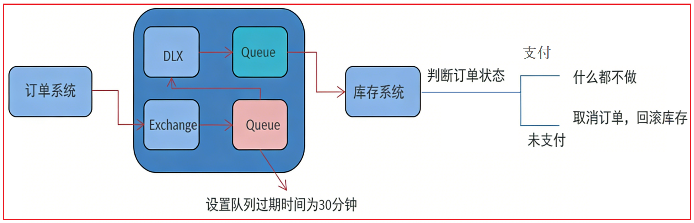

注：使用消息超时时间+死信队列，前面已经演示过了


## 2 延迟插件

### 2.1 插件简介

- 官网地址：https://github.com/rabbitmq/rabbitmq-delayed-message-exchange
- 延迟极限：最多两天


### 2.2 插件安装

#### 1、确定卷映射目录

```shell
docker inspect rabbitmq
```


运行结果：

```json
        "Mounts": [
            {
                "Type": "volume",
                "Name": "rabbitmq-plugin",
                "Source": "/var/lib/docker/volumes/rabbitmq-plugin/_data",
                "Destination": "/plugins",
                "Driver": "local",
                "Mode": "z",
                "RW": true,
                "Propagation": ""
            },
            {
                "Type": "volume",
                "Name": "cca7bc3012f5b76bd6c47a49ca6911184f9076f5f6263b41f4b9434a7f269b11",
                "Source": "/var/lib/docker/volumes/cca7bc3012f5b76bd6c47a49ca6911184f9076f5f6263b41f4b9434a7f269b11/_data",
                "Destination": "/var/lib/rabbitmq",
                "Driver": "local",
                "Mode": "",
                "RW": true,
                "Propagation": ""
            }
        ]
```

和容器内/plugins目录对应的宿主机目录是：/var/lib/docker/volumes/rabbitmq-plugin/_data


#### 2、下载延迟插件

官方文档说明页地址：https://www.rabbitmq.com/community-plugins.html


下载插件安装文件：

```shell
wget https://github.com/rabbitmq/rabbitmq-delayed-message-exchange/releases/download/v3.13.0/rabbitmq_delayed_message_exchange-3.13.0.ez
mv rabbitmq_delayed_message_exchange-3.13.0.ez /var/lib/docker/volumes/rabbitmq-plugin/_data
```


#### 3、启用插件

```shell
# 登录进入容器内部
docker exec -it rabbitmq /bin/bash

# rabbitmq-plugins命令所在目录已经配置到$PATH环境变量中了，可以直接调用
rabbitmq-plugins enable rabbitmq_delayed_message_exchange

# 退出Docker容器
exit

# 重启Docker容器
docker restart rabbitmq
```


#### 4、确认

确认点1：查看当前节点已启用插件的列表：


确认点2：如果创建新交换机时可以在type中看到x-delayed-message选项，那就说明插件安装好了


### 2.3 创建交换机

rabbitmq_delayed_message_exchange插件在工作时要求交换机是<span style="color:blue;font-weight:bolder;">x-delayed-message</span>类型才可以，创建方式如下：


关于<span style="color:blue;font-weight:bolder;">x-delayed-type</span>参数的理解：

> 原本指定交换机类型的地方使用了x-delayed-message这个值，那么这个交换机除了支持延迟消息之外，到底是direct、fanout、topic这些类型中的哪一个呢？
>
> 这里就额外使用x-delayed-type来指定交换机本身的类型


### 2.4 代码测试

#### 1、生产者端代码

```java
@Test
public void testSendDelayMessage() {
    rabbitTemplate.convertAndSend(
            EXCHANGE_DELAY,
            ROUTING_KEY_DELAY,
            "测试基于插件的延迟消息 [" + new SimpleDateFormat("hh:mm:ss").format(new Date()) + "]",
            messageProcessor -> {

                // 设置延迟时间：以毫秒为单位
                messageProcessor.getMessageProperties().setHeader("x-delay", "10000");

                return messageProcessor;
            });
}
```


#### 2、消费者端代码

##### ①情况A：资源已创建

```java
package com.atguigu.mq.listener;

import com.rabbitmq.client.Channel;
import lombok.extern.slf4j.Slf4j;
import org.springframework.amqp.core.Message;
import org.springframework.amqp.rabbit.annotation.RabbitListener;
import org.springframework.stereotype.Component;

import java.io.IOException;
import java.text.SimpleDateFormat;
import java.util.Date;

@Component
@Slf4j
public class MyDelayMessageListener {

    public static final String QUEUE_DELAY = "queue.delay.video";

    @RabbitListener(queues = {QUEUE_DELAY})
    public void process(String dataString, Message message, Channel channel) throws IOException {
        log.info("[生产者]" + dataString);
        log.info("[消费者]" + new SimpleDateFormat("hh:mm:ss").format(new Date()));
        channel.basicAck(message.getMessageProperties().getDeliveryTag(), false);
    }

}
```

##### ②情况B：资源未创建

```java
package com.atguigu.mq.listener;

import com.rabbitmq.client.Channel;
import lombok.extern.slf4j.Slf4j;
import org.springframework.amqp.core.Message;
import org.springframework.amqp.rabbit.annotation.*;
import org.springframework.stereotype.Component;

import java.io.IOException;
import java.text.SimpleDateFormat;
import java.util.Date;

@Component
@Slf4j
public class MyDelayMessageListener {

    public static final String EXCHANGE_DELAY = "exchange.delay.video";
    public static final String ROUTING_KEY_DELAY = "routing.key.delay.video";
    public static final String QUEUE_DELAY = "queue.delay.video";

    @RabbitListener(bindings = @QueueBinding(
        value = @Queue(value = QUEUE_DELAY, durable = "true", autoDelete = "false"),
        exchange = @Exchange(
                value = EXCHANGE_DELAY,
                durable = "true",
                autoDelete = "false",
                type = "x-delayed-message",
                arguments = @Argument(name = "x-delayed-type", value = "direct")),
        key = {ROUTING_KEY_DELAY}
    ))
    public void process(String dataString, Message message, Channel channel) throws IOException {
        log.info("[生产者]" + dataString);
        log.info("[消费者]" + new SimpleDateFormat("hh:mm:ss").format(new Date()));
        channel.basicAck(message.getMessageProperties().getDeliveryTag(), false);
    }

}
```


#### 3、执行效果

##### ①交换机类型


##### ②生产者端效果

<span style="color:blue;font-weight:bolder;">注意</span>：使用rabbitmq_delayed_message_exchange插件后，即使消息成功发送到队列上，也会导致returnedMessage()方法执行


##### ③消费者端效果


# 十、消息百分百成功投递

## 1 消息百分百成功投递

谈到消息的可靠性投递，无法避免的，在实际的工作中会经常碰到，比如一些核心业务需要保障消息不丢失，接下来我们看一个可靠性投递的流程图，说明可靠性投递的概念：

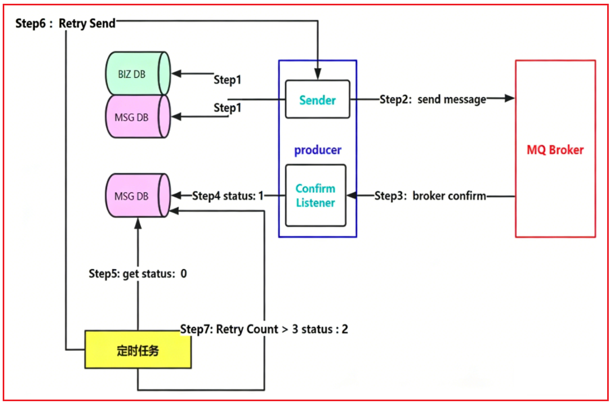

Step 1： 首先把消息信息(业务数据）存储到数据库中，紧接着，我们再把这个消息记录也存储到一张消息记录表里（或者另外一个同源数据库的消息记录表）

Step 2：发送消息到MQ Broker节点（采用confirm方式发送，会有异步的返回结果）

Step 3、4：生产者端接受MQ Broker节点返回的Confirm确认消息结果，然后进行更新消息记录表里的消息状态。比如默认Status = 0 当收到消息确认成功后，更新为1即可！

Step 5：但是在消息确认这个过程中可能由于网络闪断、MQ Broker端异常等原因导致 回送消息失败或者异常。这个时候就需要发送方（生产者）对消息进行可靠性投递了，保障消息不丢失，100%的投递成功！（有一种极限情况是闪断，Broker返回的成功确认消息，但是生产端由于网络闪断没收到，这个时候重新投递可能会造成消息重复，需要消费端去做幂等处理）所以我们需要有一个定时任务，（比如每5分钟拉取一下处于中间状态的消息，当然这个消息可以设置一个超时时间，比如超过1分钟 Status = 0 ，也就说明了1分钟这个时间窗口内，我们的消息没有被确认，那么会被定时任务拉取出来）

Step 6：接下来我们把中间状态的消息进行重新投递 retry send，继续发送消息到MQ ，当然也可能有多种原因导致发送失败

Step 7：我们可以采用设置最大努力尝试次数，比如投递了3次，还是失败，那么我们可以将最终状态设置为Status = 2 ，最后 交由人工解决处理此类问题（或者把消息转储到失败表中）。


## 2 消息幂等性保障

幂等性指一次和多次请求某一个资源,对于资源本身应该具有同样的结果。也就是说,其任意多次执行对资源本身所产生的影响均与一次执行的影响相同。

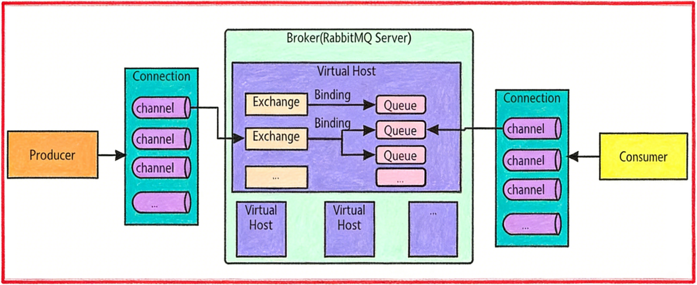

在MQ中指,消费多条相同的消息,得到与消费该消息一次相同的结果。

**消息幂等性保障 乐观锁机制**

生产者发送消息：

```sql
id=1,money=500,version=1
```


消费者接收消息

```sql
id=1,money=500,version=1

id=1,money=500,version=1
```


消费者需要保证幂等性：第一次执行SQL语句

第一次执行：version=1

```sql
update account set money = money - 500 , version = version + 1
where id = 1 and version = 1
```


消费者需要保证幂等性：第二次执行SQL语句

第二次执行：version=2

```sql
update account set money = money - 500 , version = version + 1
where id = 1 and version = 1
```
