# 第1章 尚品甄选项目搭建

## 1.1 项目简介

`尚品甄选`是基于`若依`微服务版本框架开发的一个电商系统，项目包含平台管理端与手机H5端。有一套完善的电商业务流程：商品管理、商品详情、购物车、单点登录、订单、支付、库存管理等，其中覆盖了分布式文件系统、高速缓存、消息队列等多种业务场景和技术实现。

### 1.1.1 为什么我们要讲电商？

因为就互联网平台来说，电商网站有很多典型的特征：

- 访问量大
- 数据量大
- 有一定的业务复杂性
- 涉及支付考虑一定安全性{幂等性}

### 1.1.2 电商的主要模式

**1、B2B（Business to Business）**

  B2B （ Business to Business）是指进行电子商务交易的供需双方都是商家（或企业、公司），她（他）们使用了互联网的技术或各种商务网络平台，完成商务交易的过程。电子商务是现代 B2B marketing的一种具体主要的表现形式。

  案例：阿里巴巴1688


**2、C2C（Consumer to Customer）**

  C2C即 Customer（Consumer） to Customer（Consumer），意思就是消费者个人间的电子商务行为。比如一个消费者有一台电脑，通过网络进行交易，把它出售给另外一个消费者，此种交易类型就称为C2C电子商务。

案例：淘宝、易趣、瓜子二手车、闲鱼


**3、B2C（Business-to-Customer）**

  B2C是Business-to-Customer的缩写，而其中文简称为“商对客”。“商对客”是电子商务的一种模式，也就是通常说的直接面向消费者销售产品和服务商业零售模式。这种形式的电子商务一般以网络零售业为主，主要借助于互联网开展在线销售活动。B2C即企业通过互联网为消费者提供一个新型的购物环境——网上商店，消费者通过网络在网上购物、网上支付等消费行为。

  案例：唯品会、乐蜂网


 **4、B2B2C（Business to Business to Consumer）**

  B2B2C是一种电子商务类型的网络购物商业模式，B是BUSINESS的简称，C是CUSTOMER的简称，第一个B指的是商品或服务的供应商，第二个B指的是从事电子商务的企业，C则是表示消费者。

案例：京东商城、天猫商城


**5、C2B（Consumer to Business）**

  C2B（Consumer to Business，即消费者到企业），是互联网经济时代新的商业模式。这一模式改变了原有生产者（企业和机构）和消费者的关系，是一种消费者贡献价值（Create Value）， 企业和机构消费价值（Consume Value）。

  C2B模式和我们熟知的供需模式（DSM, Demand SupplyModel）恰恰相反，**真正的C2B 应该先有消费者需求产生而后有企业生产，即先有消费者提出需求，后有生产企业按需求组织生产**。通常情况为消费者根据自身需求定制产品和价格，或主动参与产品设计、生产和定价，产品、价格等彰显消费者的个性化需求，生产企业进行定制化生产。

案例：猪八戒


**6、O2O（Online To Offline）**

  O2O即Online To Offline（在线离线/线上到线下），是指将线下的商务机会与互联网结合，让互联网成为线下交易的平台，这个概念最早来源于美国。O2O的概念非常广泛，既可涉及到线上，又可涉及到线下,可以通称为O2O。主流商业管理课程均对O2O这种新型的商业模式有所介绍及关注。

  案例：美团、饿了么


### 1.1.3 我们能从这个项目中学到什么？

#### 1、温故知新

尚品甄选作为一个前后端分离的项目，可以巩固以前的前端+后端知识，同时加入了新的技术点与技术点应用场景，**掌握电商业务流程**

尚品甄选分为后台系统和前台系统。

**后台系统功能**:(用户登录、系统管理员列表、角色管理、权限规则管理、商品管理、商品分类、商品规格、...)

**前台系统功能**: (首页商品分类查询、分类模块：分类查询、根据分类查询商品数据、登录功能、用户收货地址管理、购物车模块、订单模块...)

#### 2、核心技术

- **SpringBoot**：简化新Spring应用的初始搭建以及开发过程；
- **SpringCloud**：基于Spring Boot实现的云原生应用开发工具，SpringCloud使用的技术：（Spring Cloud Gateway、Spring Cloud Alibaba Nacos、Spring Cloud Alibaba Sentinel、Spring Cloud Task和Spring Cloud Feign等）
- **SpringBoot+SpringCloudAlibaba(Nacos，Sentinel)+Cloud OpenFeign**
- MyBatis-Plus：持久层框架，也依赖mybatis
- Redis：内存做缓存
- Redisson：基于redis的Java驻内存数据网格 - 框架；操作redis的框架
- RabbitMQ：消息中间件；大型分布式项目是标配；分布式事务最终一致性
- ThreadPoolExecutor：线程池来实现异步操作，提高效率
- Knife4J：接口文档工具
- MinIO（私有化对象存储集群）：分布式文件存储 类似于OSS（公有）
- 支付宝支付：alipay.com
- MySQL：关系型数据库
- Lombok: 实体类的中get/set 生成的jar包
- Ngrok/natapp：内网穿透
- Docker：容器化技术;  生产环境Redis（运维人员）；快速搭建环境Docker run

前端技术栈

- Vue 3： Vue.js 的最新版本
- Element Plus：一个基于 Vue.js 3.0 的组件库，它是 Element UI 的升级版本
- Vite：一种新型前端构建工具
- Node.js： JavaScript 运行环境

#### 3、需要掌握的解决方案

微服务架构、缓存解决方案、分布式事务、后台管理、文件管理系统等

课前说明：

- 建议内存16个G以上

- 培养自己独立阅读代码的能力

- 帮助大家分析 解构业务需求

- 新的知识点，难点敲

- 重复的功能 自己开发


## 1.2 若依框架简介

官网：https://doc.ruoyi.vip/

微服务版本文档：https://doc.ruoyi.vip/ruoyi-cloud/

### 1.2.1 介绍

**RuoYi-Cloud** 是一个 Java EE 分布式微服务架构平台，基于经典技术组合（Spring Boot、Spring Cloud & Alibaba、Vue、Element），内置模块如：部门管理、角色用户、菜单及按钮授权、数据权限、系统参数、日志管理、代码生成等。在线定时任务配置；支持集群，支持多数据源。

### 1.2.2 架构图


### 1.2.3 在线体验

- 若依官网：[http://ruoyi.vip(opens new window)](http://ruoyi.vip/)

- 演示地址：[http://cloud.ruoyi.vip(opens new window)](http://cloud.ruoyi.vip/)

- 代码下载：<https://gitee.com/y_project/RuoYi-Cloud>


## 1.3 准备软件环境

请参考《尚硅谷_尚品甄选项目_附录1_准备软件环境.md》


## 1.4 搭建项目环境

### 1.4.1 服务端

#### 1、下载若依源码

下载”RuoYi-Cloud 微服务版“

https://ruoyi.vip/

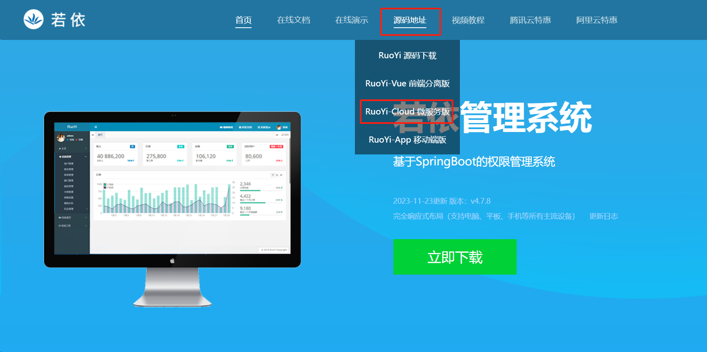

当前RuoYi-Cloud 微服务版本：3.6.3

查看项目版本如图：

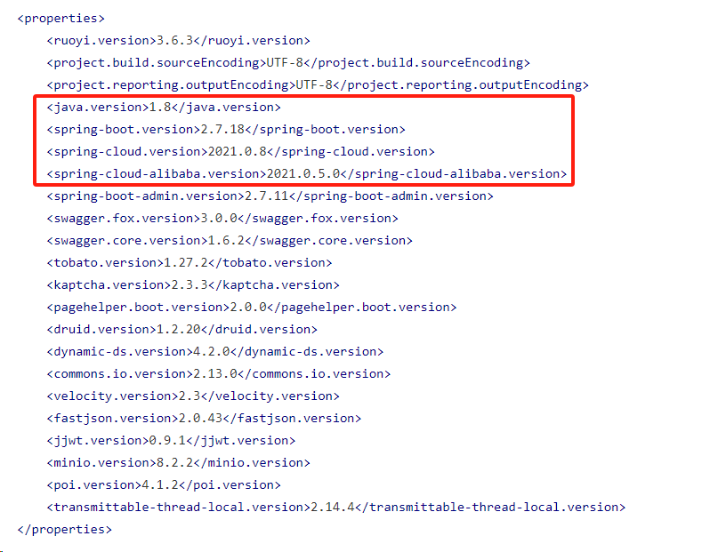

项目版本jdk为：1.8，spring-boot为：2.7.18，不是我们预期的版本，因此我们给改项目做了升级，升级后的项目模板在：资料/项目模板/spzx-parent.zip

升级后的项目版本如图：

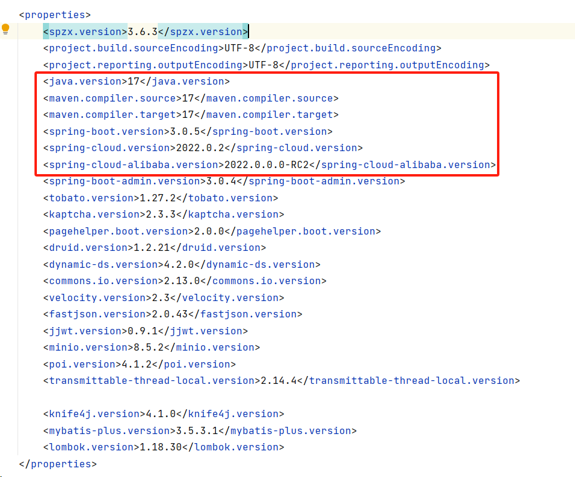

#### 2、导入项目

第一步：解压课件资料

解压课件资料/项目模板下的`spzx-parent.rar`到工作空间

第二步：修改maven配置

修改maven配置为自己安装的

第三步：导入项目源码

导入项目源码到idea，如图：

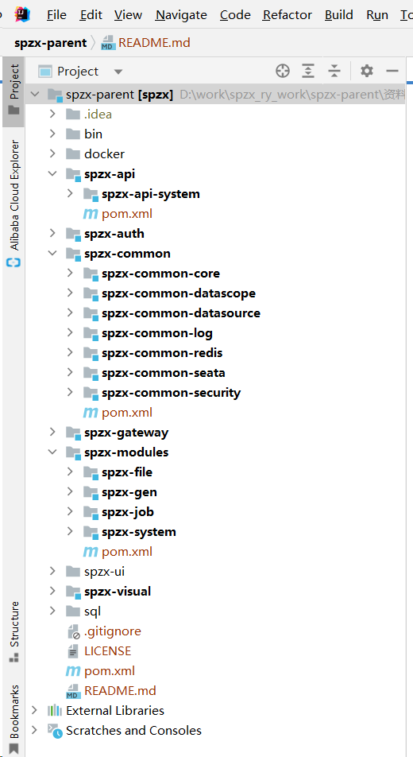

项目模块介绍：

```java
com.spzx
├── spzx-gateway         // 网关模块 [8080]
├── spzx-auth            // 认证中心 [9200]
├── spzx-api             // 接口模块
│       └── spzx-api-system                        // 系统接口
├── spzx-common          // 通用模块
│       └── spzx-common-core                         // 核心模块
│       └── spzx-common-datascope                    // 权限范围
│       └── spzx-common-datasource                   // 多数据源
│       └── spzx-common-log                          // 日志记录
│       └── spzx-common-redis                        // 缓存服务
│       └── spzx-common-security                     // 安全模块
├── spzx-modules         // 业务模块
│       └── spzx-system                              // 系统模块 [9201]
│       └── spzx-gen                                 // 代码生成 [9202]
│       └── spzx-job                                 // 定时任务 [9203]
│       └── spzx-file                                // 文件服务 [9300]
├── spzx-ui              // 前端框架 [80]
├── spzx-visual          // 图形化管理模块
│       └── spzx-monitor                             // 监控中心 [9100]
├──pom.xml                // 公共依赖
```

#### 3、导入数据库表

导入数据库脚本：资料/sql/spzx-system.sql【系统管理相关数据库表】

导入数据库脚本：资料/sql/spzx.sql【尚品甑选业务相关数据库表】

注意：用 "老师的sql脚本"

#### 4、启动项目

第一步：导入nacos配置文件

- 启动nacos，访问nacos控制台：http://虚拟机IP:8848/nacos/

- 在nacos控制台：配置管理 ->  配置列表 导入配置文件

- 配置文件资源：资料/nacos配置/DEFAULT_GROUP.zip


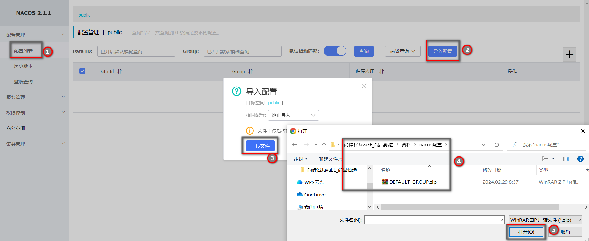

- 导入成功后，如图：


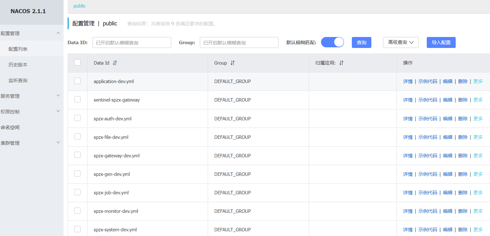

第二步：修改nacos配置

说明：

​    涉及数据源的地方都要修改，mysql、redis、minio等等，地址需要修改为自己虚拟机的地址

**例如：** spzx-system-dev.yml

​		使用了redis和mysql，需要修改连接地址

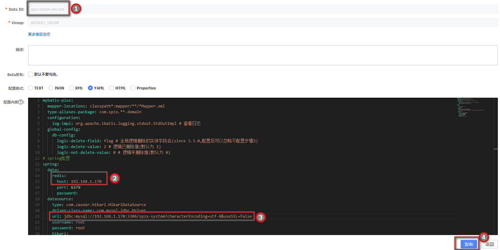

**参考上面 检查并修改其他配置文件中的连接地址**

第三步：运行项目模块

修改各个模块nacos配置中心、注册中心地址、sentinel地址

启动没有先后顺序

SpzxGatewayApplication （网关模块 必须）

SpzxAuthApplication （认证模块 必须）

SpzxSystemApplication （系统模块 必须）
...【其他模块】

**注意：**定时任务模块不要启动，未导入表，未使用


### 1.4.2 前端

#### 1、前端项目部署

```shell
# node版本 node-v20.11.1-x64
node -v

#安装yarn
#安装yarn出现问题，可以忽略校验
npm config set strict-ssl false
npm install -g yarn

# 进入项目目录
cd spzx-ui

# 安装依赖
yarn --registry=https://registry.npmmirror.com

# 启动服务
yarn dev
或
npm run dev

# 构建测试环境 yarn build:stage
# 构建生产环境 yarn build:prod
```

#### 2、前端项目修改

第一步：修改图表

- 拷贝课件 ` 资料\图标\favicon.ico` 到spzx-ui项目 `public`目录下替换默认图标

- 修改spzx-ui项目 `index.html`中的标题图标默认使用上面的图标

- 修改spzx-ui项目`src\layout\components\Sidebar\Logo.vue`中使用的菜单栏图标

  **注意：**一共两处

  ```html
  
  ```

  效果图：

  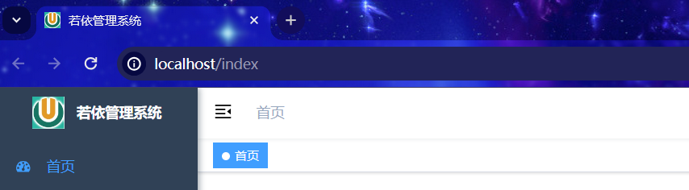

第二步：修改项目标题

- 修改登录页`src\views\login.vue`页面中的标题

  ```html
   <h3 class="title">尚品甄选后台管理系统</h3>
  ```

- 修改标签和菜单栏标题:

  修改`.env.development`和 `.env.production`文件中的标题

  ```properties
  VITE_APP_TITLE = 尚品甄选管理系统
  ```

  效果图：

  


## 1.5 若依-源码分析

参考`系统管理-> 角色管理`

### 1.5.1  前端请求

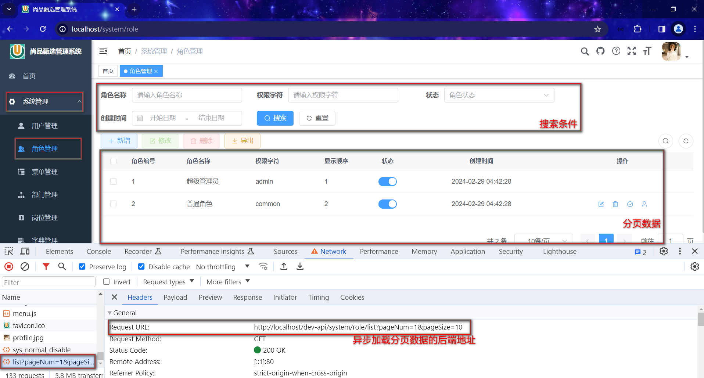

**返回的分页数据：**

```json
{
    "total": 2,
    "rows": [
        {
            "id": null,
            "createBy": null,
            "createTime": "2024-02-29 04:42:28",
            "updateBy": null,
            "updateTime": null,
            "remark": "超级管理员",
            "delFlag": "0",
            "roleId": 1,
            "roleName": "超级管理员",
            "roleKey": "admin",
            "roleSort": 1,
            "dataScope": "1",
            "menuCheckStrictly": true,
            "deptCheckStrictly": true,
            "status": "0",
            "flag": false,
            "menuIds": null,
            "deptIds": null,
            "permissions": null,
            "admin": true
        },
        {
            "id": null,
            "createBy": null,
            "createTime": "2024-02-29 04:42:28",
            "updateBy": null,
            "updateTime": null,
            "remark": "普通角色",
            "delFlag": "0",
            "roleId": 2,
            "roleName": "普通角色",
            "roleKey": "common",
            "roleSort": 2,
            "dataScope": "2",
            "menuCheckStrictly": true,
            "deptCheckStrictly": true,
            "status": "0",
            "flag": false,
            "menuIds": null,
            "deptIds": null,
            "permissions": null,
            "admin": false
        }
    ],
    "code": 200,
    "msg": "查询成功"
}
```


### 1.5.2 后端分析

`spzx-modules下的spzx-system模块`处理系统管理相关请求，包括角色的CRUD

#### 1、SysRoleController

```java
@RestController
@RequestMapping("/role")
public class SysRoleController extends BaseController //BaseController提供了一些通用方法
{
    @Autowired
    private ISysRoleService roleService;

    @Autowired
    private ISysUserService userService;

    @Autowired
    private ISysDeptService deptService;

    @RequiresPermissions("system:role:list")
    @GetMapping("/list") //查询角色的分页数据
    public TableDataInfo list(SysRole role)//role用来pojo入参获取查询参数
    {
        startPage(); //调用BaseController中的分页方法
        List<SysRole> list = roleService.selectRoleList(role); //执行分页查询
        return getDataTable(list);//调用BaseController中的方法封装分页数据
    }
    //.....省略
}
```

#### 2、BaseController

```java
public class BaseController
{
    protected final Logger logger = LoggerFactory.getLogger(this.getClass());

    /**
     * 将前台传递过来的日期格式的字符串，自动转化为Date类型
     */
    @InitBinder
    public void initBinder(WebDataBinder binder)
    {
        // Date 类型转换
        binder.registerCustomEditor(Date.class, new PropertyEditorSupport()
                                    {
                                        @Override
                                        public void setAsText(String text)
                                        {
                                            setValue(DateUtils.parseDate(text));
                                        }
                                    });
    }

    /**
     * 设置请求分页数据
     */
    protected void startPage()
    {
        PageUtils.startPage();
    }

    /**
     * 清理分页的线程变量
     */
    protected void clearPage()
    {
        PageUtils.clearPage();
    }

    /**
     * 响应请求分页数据
     */
    @SuppressWarnings({ "rawtypes", "unchecked" })
    protected TableDataInfo getDataTable(List<?> list)
    {
        TableDataInfo rspData = new TableDataInfo();
        rspData.setCode(HttpStatus.SUCCESS);
        rspData.setRows(list);
        rspData.setMsg("查询成功");
        rspData.setTotal(new PageInfo(list).getTotal());
        return rspData;
    }

    /**
     * 返回成功
     */
    public AjaxResult success()
    {
        return AjaxResult.success();
    }

    /**
     * 返回成功消息
     */
    public AjaxResult success(String message)
    {
        return AjaxResult.success(message);
    }

    /**
     * 返回成功消息
     */
    public AjaxResult success(Object data)
    {
        return AjaxResult.success(data);
    }

    /**
     * 返回失败消息
     */
    public AjaxResult error()
    {
        return AjaxResult.error();
    }

    /**
     * 返回失败消息
     */
    public AjaxResult error(String message)
    {
        return AjaxResult.error(message);
    }

    /**
     * 返回警告消息
     */
    public AjaxResult warn(String message)
    {
        return AjaxResult.warn(message);
    }

    /**
     * 响应返回结果
     *
     * @param rows 影响行数
     * @return 操作结果
     */
    protected AjaxResult toAjax(int rows)
    {
        return rows > 0 ? AjaxResult.success() : AjaxResult.error();
    }

    /**
     * 响应返回结果
     *
     * @param result 结果
     * @return 操作结果
     */
    protected AjaxResult toAjax(boolean result)
    {
        return result ? success() : error();
    }
}
```

**PageUtils**

```java
public class PageUtils extends PageHelper
{
    /**
     * 设置请求分页数据
     */
    public static void startPage()
    {
        PageDomain pageDomain = TableSupport.buildPageRequest();
        Integer pageNum = pageDomain.getPageNum();
        Integer pageSize = pageDomain.getPageSize();
        String orderBy = SqlUtil.escapeOrderBySql(pageDomain.getOrderBy());
        Boolean reasonable = pageDomain.getReasonable();
        PageHelper.startPage(pageNum, pageSize, orderBy).setReasonable(reasonable);
    }

    /**
     * 清理分页的线程变量
     */
    public static void clearPage()
    {
        PageHelper.clearPage();
    }
}
```

#### 3、AjaxResult

```java
public class AjaxResult extends HashMap<String, Object>
{
    private static final long serialVersionUID = 1L;

    /** 状态码 */
    public static final String CODE_TAG = "code";

    /** 返回内容 */
    public static final String MSG_TAG = "msg";

    /** 数据对象 */
    public static final String DATA_TAG = "data";

    /**
     * 初始化一个新创建的 AjaxResult 对象，使其表示一个空消息。
     */
    public AjaxResult()
    {
    }

    /**
     * 初始化一个新创建的 AjaxResult 对象
     *
     * @param code 状态码
     * @param msg 返回内容
     */
    public AjaxResult(int code, String msg)
    {
        super.put(CODE_TAG, code);
        super.put(MSG_TAG, msg);
    }

    /**
     * 初始化一个新创建的 AjaxResult 对象
     *
     * @param code 状态码
     * @param msg 返回内容
     * @param data 数据对象
     */
    public AjaxResult(int code, String msg, Object data)
    {
        super.put(CODE_TAG, code);
        super.put(MSG_TAG, msg);
        if (StringUtils.isNotNull(data))
        {
            super.put(DATA_TAG, data);
        }
    }

    /**
     * 返回成功消息
     *
     * @return 成功消息
     */
    public static AjaxResult success()
    {
        return AjaxResult.success("操作成功");
    }

    /**
     * 返回成功数据
     *
     * @return 成功消息
     */
    public static AjaxResult success(Object data)
    {
        return AjaxResult.success("操作成功", data);
    }

    /**
     * 返回成功消息
     *
     * @param msg 返回内容
     * @return 成功消息
     */
    public static AjaxResult success(String msg)
    {
        return AjaxResult.success(msg, null);
    }

    /**
     * 返回成功消息
     *
     * @param msg 返回内容
     * @param data 数据对象
     * @return 成功消息
     */
    public static AjaxResult success(String msg, Object data)
    {
        return new AjaxResult(HttpStatus.SUCCESS, msg, data);
    }

    /**
     * 返回警告消息
     *
     * @param msg 返回内容
     * @return 警告消息
     */
    public static AjaxResult warn(String msg)
    {
        return AjaxResult.warn(msg, null);
    }

    /**
     * 返回警告消息
     *
     * @param msg 返回内容
     * @param data 数据对象
     * @return 警告消息
     */
    public static AjaxResult warn(String msg, Object data)
    {
        return new AjaxResult(HttpStatus.WARN, msg, data);
    }

    /**
     * 返回错误消息
     *
     * @return 错误消息
     */
    public static AjaxResult error()
    {
        return AjaxResult.error("操作失败");
    }

    /**
     * 返回错误消息
     *
     * @param msg 返回内容
     * @return 错误消息
     */
    public static AjaxResult error(String msg)
    {
        return AjaxResult.error(msg, null);
    }

    /**
     * 返回错误消息
     *
     * @param msg 返回内容
     * @param data 数据对象
     * @return 错误消息
     */
    public static AjaxResult error(String msg, Object data)
    {
        return new AjaxResult(HttpStatus.ERROR, msg, data);
    }

    /**
     * 返回错误消息
     *
     * @param code 状态码
     * @param msg 返回内容
     * @return 错误消息
     */
    public static AjaxResult error(int code, String msg)
    {
        return new AjaxResult(code, msg, null);
    }

    /**
     * 是否为成功消息
     *
     * @return 结果
     */
    public boolean isSuccess()
    {
        return Objects.equals(HttpStatus.SUCCESS, this.get(CODE_TAG));
    }

    /**
     * 是否为警告消息
     *
     * @return 结果
     */
    public boolean isWarn()
    {
        return Objects.equals(HttpStatus.WARN, this.get(CODE_TAG));
    }

    /**
     * 是否为错误消息
     *
     * @return 结果
     */
    public boolean isError()
    {
        return Objects.equals(HttpStatus.ERROR, this.get(CODE_TAG));
    }

    /**
     * 方便链式调用
     *
     * @param key
     * @param value
     * @return
     */
    @Override
    public AjaxResult put(String key, Object value)
    {
        super.put(key, value);
        return this;
    }
}
```

#### 4、SysRoleServiceImpl

```java
@Service
public class SysRoleServiceImpl implements ISysRoleService{

    @Autowired
    private SysRoleMapper roleMapper;
    /**
     * 根据条件分页查询角色数据
     *
     * @param role 角色信息
     * @return 角色数据集合信息
     */
    @Override
    @DataScope(deptAlias = "d")
    public List<SysRole> selectRoleList(SysRole role)
    {
        return roleMapper.selectRoleList(role);
    }

}
```

#### 5、SysRoleMapper

```java
public interface SysRoleMapper
{
    /**
     * 根据条件分页查询角色数据
     *
     * @param role 角色信息
     * @return 角色数据集合信息
     */
    public List<SysRole> selectRoleList(SysRole role);
    //..........省略
}
```

#### 6、SysRoleMapper.xml

省略


## 1.6 若依-权限控制

### 1.6.1 介绍

 `权限控制`主要目的是保护系统的安全性和完整性,防止未经授权的用户获取敏感信息、执行非法操作或对系统进行恶意操作 。

常见的权限控制框架有SpringSecurity和Shiro。

若依的权限管理是通过`RBAC`（Role-based Access Control 基于角色的访问控制）模型自己设计的。

RBAC模型将权限控制分为角色管理和权限管理两个部分。在若依中，角色是指对系统的一类用户或操作者的定义，而权限是指对系统中某个资源或操作的访问控制。通过为每个角色分配相应的权限，可以实现对系统的全面管理和控制。

具体来说，若依的权限管理包括以下几个方面：

1. `菜单管理`：通过对系统菜单进行管理，可以控制用户在系统中能够访问的页面和功能。
2. `按钮权限`：在系统中，某些操作需要特定的权限才能进行，例如删除、修改等操作。通过对按钮权限的控制，可以限制用户对系统的访问和操作。
3. `数据权限`：在某些情况下，需要根据用户的角色或部门来限制其对数据的访问。通过数据权限的设置，可以实现对数据的细粒度控制。
4. `API接口权限`：在若依中，API也可以通过权限的方式进行控制。通过对API的权限进行管理，可以限制用户对API的访问和使用。

### 1.6.2 数据库表结构设计

在数据库表结构方面，若依采用了RBAC模型的设计。其中，主要包括以下表：

- `sys_menu`：存储系统菜单信息，包括菜单ID、菜单名称、访问路径、菜单类型等字段。
- `sys_role`：存储系统角色信息，包括角色ID、角色名称、角色标识、角色描述等字段。
- `sys_user`：存储系统用户信息，包括用户ID、用户名、密码、昵称、邮箱、电话等字段。
- `sys_role_menu`：存储角色和菜单之间的关联关系，包括角色ID和菜单ID两个字段。
- `sys_user_role`：存储用户和角色之间的关联关系，包括用户ID和角色ID两个字段。

通过这些表的设计，可以实现对系统中菜单、角色和用户的管理。同时，通过角色和菜单之间的关联关系，可以实现对菜单访问权限的控制。通过用户和角色之间的关联关系，可以实现对用户访问权限的控制。

### 1.6.3 菜单管理

**目录、菜单和按钮的区别**

在若依（RuoYi）中，菜单和目录是两个不同的概念，它们之间的区别如下：

**1.目录（Directory）：**

目录是用来组织和分类菜单的容器。目录本身没有功能，它只是一个容器，可以包含若干个菜单。目录通常是一个抽象的概念，用于将一组相关的菜单组织在一起。

在若依中，目录是以“系统管理”、“运营管理”等大模块的方式组织菜单的，用于区分不同的功能模块。目录通常以左侧的菜单树的形式展现，用户可以通过点击不同的目录来展开或收缩对应的菜单列表。

**2.菜单（Menu）：**

菜单是具有一定功能的操作项，通常是一组具有相同功能的页面或功能点的集合。每个菜单通常对应一个页面或者一个功能模块。

在若依中，菜单通常是以左侧的树形菜单的形式展现，用户可以通过点击不同的菜单来跳转到对应的页面或功能模块。每个菜单都有一个唯一的标识符，通常以URL的形式表示。

**3.按钮（Button）：**

按钮是指菜单中的操作按钮，用于触发一些具体的操作。在若依中，按钮通常是与表格或表单等组件配合使用的，用于进行数据的增删改查等操作。按钮通常会与权限控制结合起来，只有拥有相应权限的用户才能看到并使用该按钮。

总的来说，目录、菜单、按钮是若依系统中的三种不同的概念。目录是为了方便管理菜单和模块，菜单是系统的核心功能模块，按钮是菜单中的具体操作按钮。在实际应用中，它们通常会结合起来，形成一个完整的用户界面和操作流程。

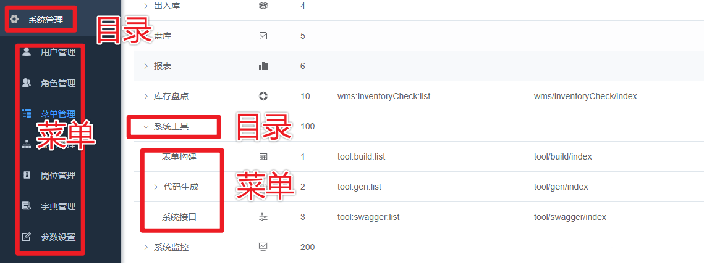

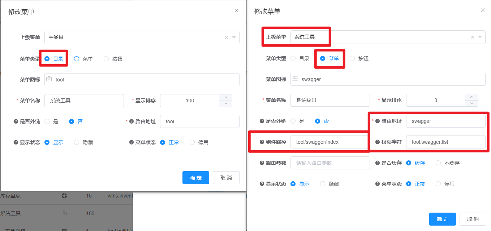


### 1.6.4 菜单权限

在若依中，实现不同用户看到不同的菜单可以通过以下步骤实现：

1. 在数据库中维护菜单的权限信息，可以为每个菜单设置一个权限标识。
2. 在用户登录系统时，将该用户所拥有的菜单权限信息从数据库中获取出来。
3. 根据用户的菜单权限信息动态生成菜单，使用户只能看到其拥有权限的菜单。

用户登录之后会请求后端的SysMenuController#getRouters接口获取登录用户可访问的菜单数据：

```sql
select distinct m.menu_id, m.parent_id, m.menu_name, m.path, m.component, m.`query`, m.visible, m.status, ifnull(m.perms,'') as perms, m.is_frame, m.is_cache, m.menu_type, m.icon, m.order_num, m.create_time
from sys_menu m
    left join sys_role_menu rm on m.menu_id = rm.menu_id
    left join sys_user_role ur on rm.role_id = ur.role_id
    left join sys_role ro on ur.role_id = ro.role_id
    left join sys_user u on ur.user_id = u.user_id
where u.user_id = #{userId} and m.menu_type in ('M', 'C') and m.status = 0  AND ro.status = 0
order by m.parent_id, m.order_num
```

菜单类型（M目录 C菜单 F按钮）；菜单状态（0显示 1隐藏）

前端会根据该接口返回的数据渲染出不同的菜单。

### 1.6.5 api接口权限

**配置方法**

每一个按钮基本上都会对应着一个后端的接口，前端会根据权限标志显示或者隐藏按钮，但是如果用户不点击按钮，直接通过http请求工具请求后端咋办？所以接口权限也是要有的，该权限和按钮上权限完全一致。

若依系统实现了这部分功能，实现模块：spzx-common-security，比如，用户管理页面中的修改用户按钮对应的后端接口长这个样子。

```java
@RequiresPermissions("system:user:edit")
@PutMapping
public AjaxResult edit(@Validated @RequestBody SysUser user) {
    ...
    return toAjax();
}
```

和其对应的前端按钮权限标志一样

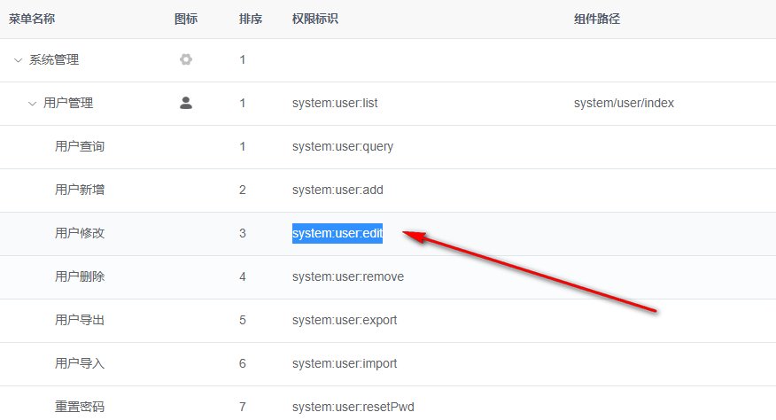

前端控制

v-hasPermi="['system:user:edit']"

```vue
<el-button link type="primary" icon="Edit" @click="handleUpdate(scope.row)"
           v-hasPermi="['system:user:edit']"></el-button>
```

#### 1、后台权限注解

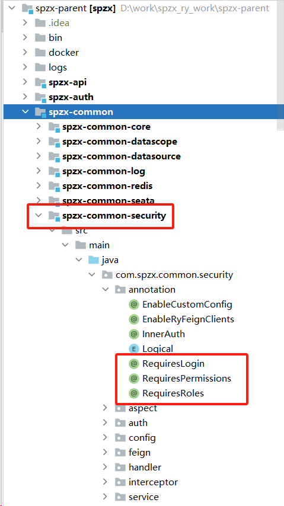

##### @RequiresLogin

`@RequiresLogin`注解用于配置接口要求用户必须登录才可访问，它没有参数

示例1: 以下代码表示必须拥有`admin`角色才可访问

```java
@RequiresLogin("admin")
public AjaxResult getInfo(...)
{
    return AjaxResult.success(...);
}
```


##### @RequiresPermissions

`@RequiresPermissions`注解用于配置接口要求用户拥有某（些）权限才可访问，它拥有两个参数

| 参数    | 类型     | 描述                                  |
| ------- | -------- | ------------------------------------- |
| value   | String[] | 权限列表                              |
| logical | Logical  | 权限之间的判断关系，默认为Logical.AND |

示例1: 以下代码表示必须拥有`system:user:add`权限才可访问

```java
@RequiresPermissions("system:user:add")
public AjaxResult save(...)
{
    return AjaxResult.success(...);
}
```

示例2: 以下代码表示必须拥有`system:user:add`和`system:user:edit`权限才可访问

```java
@RequiresPermissions({"system:user:add", "system:user:edit"})
public AjaxResult save(...)
{
    return AjaxResult.success(...);
}
```

示例3: 以下代码表示需要拥有`system:user:add`或`system:user:edit`权限才可访问

```java
@RequiresPermissions(value = {"system:user:add", "system:user:edit"}, logical = Logical.OR)
public AjaxResult save(...)
{
    return AjaxResult.success(...);
}
```


##### @RequiresRoles

`@RequiresRoles`注解用于配置接口要求用户拥有某（些）角色才可访问，它拥有两个参数

| 参数    | 类型     | 描述                                  |
| ------- | -------- | ------------------------------------- |
| value   | String[] | 角色列表                              |
| logical | Logical  | 角色之间的判断关系，默认为Logical.AND |

示例1: 以下代码表示必须拥有`admin`角色才可访问

```java
@RequiresRoles("admin")
public AjaxResult save(...)
{
    return AjaxResult.success(...);
}
```

示例2: 以下代码表示必须拥有`admin`和`common`角色才可访问

```java
@RequiresRoles({"admin", "common"})
public AjaxResult save(...)
{
    return AjaxResult.success(...);
}
```

示例3: 以下代码表示需要拥有`admin`或`common`角色才可访问

```java
@RequiresRoles(value = {"admin", "common"}, logical = Logical.OR)
public AjaxResult save(...)
{
    return AjaxResult.success(...);
}
```

#### 2、实现原理

实现原理：一个拦截器【HeaderInterceptor】 + 一个AOP【PreAuthorizeAspect】

springboot 拦截器与AOP执行顺序：

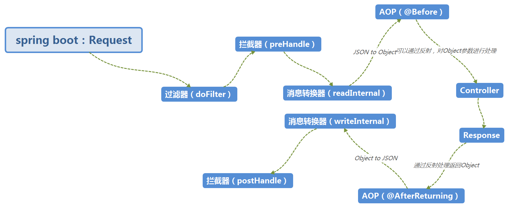

拦截器HeaderInterceptor负责解析用户token信息，并将解析出的用户信息存入**ThreadLocal**中，然后PreAuthorizeAspect负责解析权限注解，判断当前用户是否拥有注解权限。


## 1.7 若依-系统日志

实现模块：spzx-common-log

在实际开发中，对于某些关键业务，我们通常需要记录该操作的内容，一个操作调一次记录方法，每次还得去收集参数等等，会造成大量代码重复。 我们希望代码中只有业务相关的操作，在项目中使用注解来完成此项功能。

在需要被记录日志的`controller`方法上添加`@Log`注解，使用方法如下：

```java
@Log(title = "用户管理", businessType = BusinessType.INSERT)
public AjaxResult addSave(...)
{
    return success(...);
}
```

### 1.7.1 注解参数说明

| 参数               | 类型         | 默认值 | 描述                                                         |
| ------------------ | ------------ | ------ | ------------------------------------------------------------ |
| title              | String       | 空     | 操作模块                                                     |
| businessType       | BusinessType | OTHER  | 操作功能（`OTHER`其他、`INSERT`新增、`UPDATE`修改、`DELETE`删除、`GRANT`授权、`EXPORT`导出、`IMPORT`导入、`FORCE`强退、`GENCODE`生成代码、`CLEAN`清空数据） |
| operatorType       | OperatorType | MANAGE | 操作人类别（`OTHER`其他、`MANAGE`后台用户、`MOBILE`手机端用户） |
| isSaveRequestData  | boolean      | true   | 是否保存请求的参数                                           |
| isSaveResponseData | boolean      | true   | 是否保存响应的参数                                           |
| excludeParamNames  | String[]     | {}     | 排除指定的请求参数                                           |


### 1.7.2 自定义操作功能

1、在`BusinessType`中新增业务操作类型如:

```java
/**
 * 测试
 */
TEST,
```

2、在`sys_dict_data`字典数据表中初始化操作业务类型

```java
insert into sys_dict_data values(25, 10, '测试',     '10', 'sys_oper_type',       '',   'primary', 'N', '0', 'admin', '2018-03-16 11-33-00', 'ry', '2018-03-16 11-33-00', '测试操作');
```

3、在`Controller`中使用注解

```java
@Log(title = "测试标题", businessType = BusinessType.TEST)
public AjaxResult test(...)
{
    return success(...);
}
```

操作日志记录逻辑实现代码[LogAspect.java]
登录系统（系统管理-操作日志）可以查询操作日志列表和详细信息。


## 1.8 项目数据模型

### 1.8.1 用户

**spzx-user**

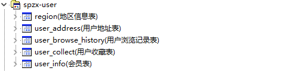

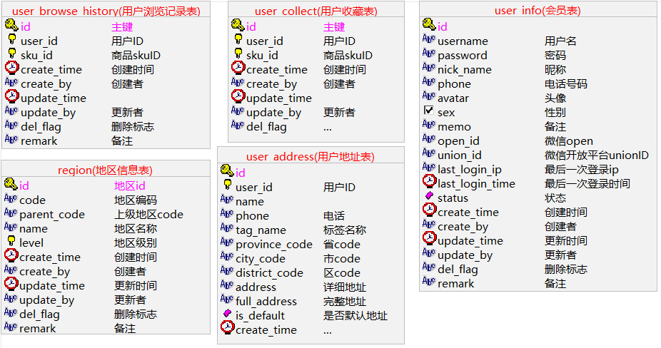


### 1.8.2 商品

#### 1、核心概念

**（1）商品规格介绍**

在电商项目中，商品规格指的是商品属性、型号、尺寸、颜色等具体描述商品特点和属性的标准化信息。

以手机为例子，它的规格可能包括以下几个方面：

- 操作系统：Android、iOS、HarmonyOS 等。
- 屏幕尺寸：5.5 吋、6.7 吋等。

- 分辨率：1920x1080、2960x1440、2532x1170 等。

- 运行内存：6GB、8GB、12GB 等。

- 存储容量：64GB、128GB、256GB 等。

- 摄像头：单摄、双摄、四摄等。

- 电池容量：3500mAh、4500mAh、5000mAh 等。

以T恤衫举例子，它的规格可能包括以下几个方面：

- 颜色：白色
- 尺码：S、M、L、XL等

- 款式：圆领、V领、印花等


**（2）SPU和SKU**

- **SPU**

SPU = Standard Product Unit （标准化产品单元）, SPU是商品信息聚合的最小单位，是一组可复用、易检索的标准化信息的**集合**，该[集合](https://so.csdn.net/so/search?q=集合&spm=1001.2101.3001.7020)描述了一个产品的特性。通俗点讲就是泛指一类商品，这种商品具有相同的属性。

- **SKU**

SKU = stock keeping unit(库存量单位) SKU即库存进出计量的单位（买家购买、商家进货、供应商备货、工厂生产都是依据SKU进行的）。是和具体的属性值有直接的关联关系。SKU是**物理上不可分割的最小存货单元。**也就是说一款商品，可以**根据SKU来确定具体的货物存量。**


以手机为例，假设有一款名为 "XPhone" 的手机品牌，它推出了一款型号为 "X10" 的手机。这款手机一共有以下几种属性：

- 颜色：黑色、白色、金色

- 存储容量：64GB、128GB

- 内存大小：4GB、6GB


那么，**“X10” 这款手机就是商品的 SPU，它包含的属性。根据不同的属性组合，可以形成多个不同的 SKU。**如下所示：

| SPU  |  SKU  | 颜色 | 存储容量 | 内存大小 |
| :--: | :---: | :--: | :------: | :------: |
| X10  | SKU1  | 黑色 |   64GB   |   4GB    |
| X10  | SKU2  | 白色 |   64GB   |   4GB    |
| X10  | SKU3  | 金色 |   64GB   |   4GB    |
| X10  | SKU4  | 黑色 |  128GB   |   4GB    |
| X10  | SKU5  | 白色 |  128GB   |   4GB    |
| X10  | SKU6  | 金色 |  128GB   |   4GB    |
| X10  | SKU7  | 黑色 |   64GB   |   6GB    |
| X10  | SKU8  | 白色 |   64GB   |   6GB    |
| X10  | SKU9  | 金色 |   64GB   |   6GB    |
| X10  | SKU10 | 黑色 |  128GB   |   6GB    |
| X10  | SKU11 | 白色 |  128GB   |   6GB    |
| X10  | SKU12 | 金色 |  128GB   |   6GB    |


再以衣服为例，假设有一家服装网店推出了一款名为 "A衬衫" 的衣服。这款衣服一共有以下几种属性：

- 尺寸：S、M、L、XL

- 颜色：白色、黑色、灰色、蓝色


那么，“A衬衫” 这款衣服就是这个商品的 SPU，它包含所有属性。而根据不同的属性组合，可以形成多个不同的 SKU。如下所示：

|  SPU  |  SKU  | 尺寸 | 颜色 |
| :---: | :---: | :--: | :--: |
| A衬衫 | SKU1  |  S   | 白色 |
| A衬衫 | SKU2  |  M   | 白色 |
| A衬衫 | SKU3  |  L   | 白色 |
| A衬衫 | SKU4  |  XL  | 白色 |
| A衬衫 | SKU5  |  S   | 黑色 |
| A衬衫 | SKU6  |  M   | 黑色 |
| A衬衫 | SKU7  |  L   | 黑色 |
| A衬衫 | SKU8  |  XL  | 黑色 |
| A衬衫 | SKU9  |  S   | 灰色 |
| A衬衫 | SKU10 |  M   | 灰色 |
| A衬衫 | SKU11 |  L   | 灰色 |
| A衬衫 | SKU12 |  XL  | 灰色 |
| A衬衫 | SKU13 |  S   | 蓝色 |
| A衬衫 | SKU14 |  M   | 蓝色 |
| A衬衫 | SKU15 |  L   | 蓝色 |
| A衬衫 | SKU16 |  XL  | 蓝色 |


#### 2、表结构

**spzx-product**

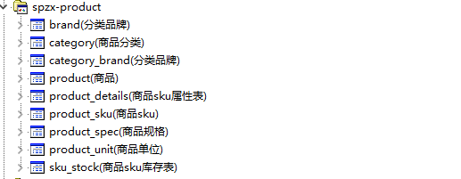

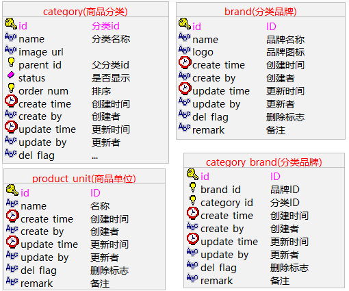

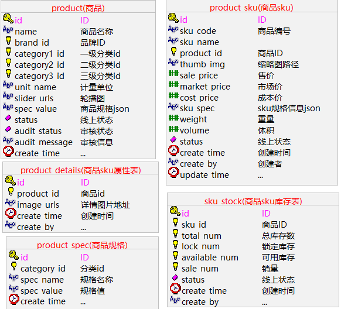


### 1.8.3 订单

**spzx-order**

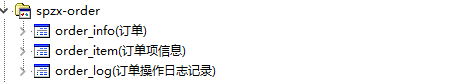

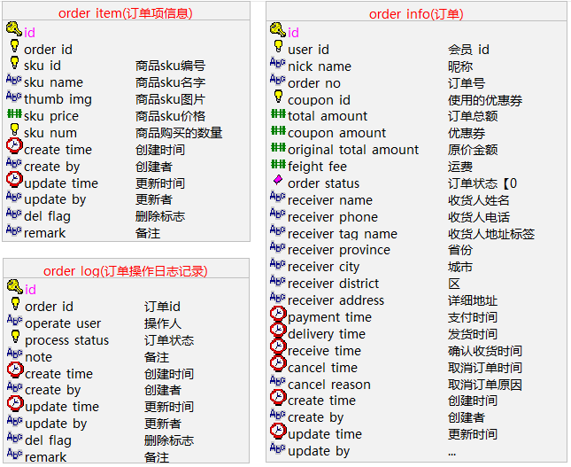


### 1.8.4 支付

**spzx-payment**


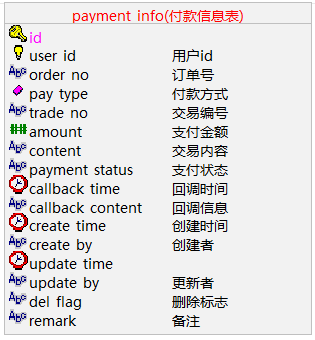

### 1.8.5 其他

**spzx-system**

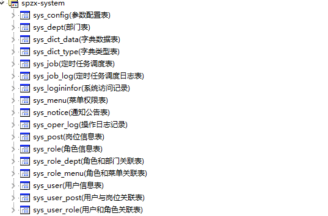

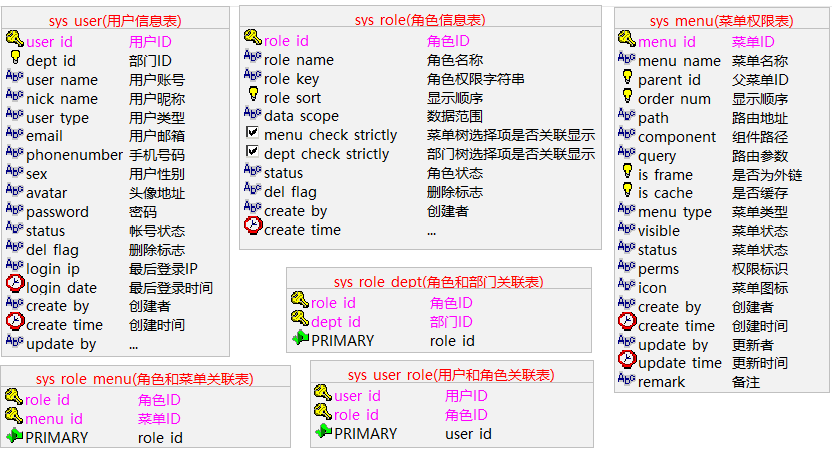

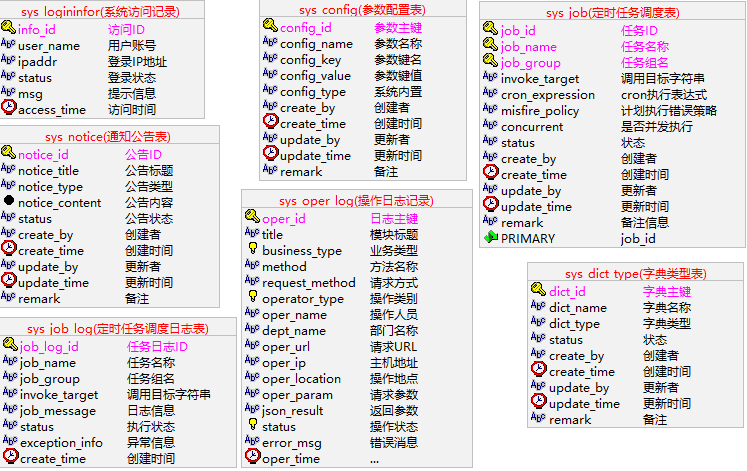

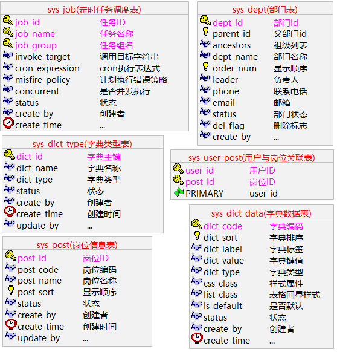


## 1.9 后台功能演示

### 1.9.1 品牌管理

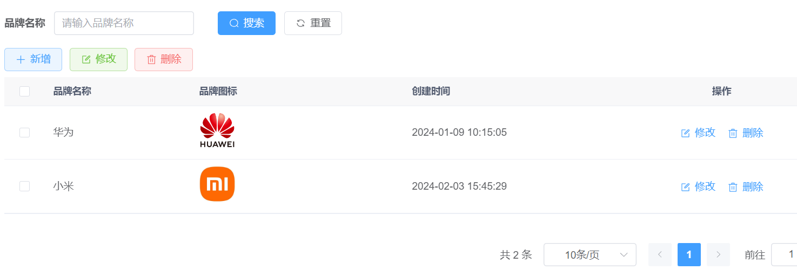

### 1.9.2 分类管理

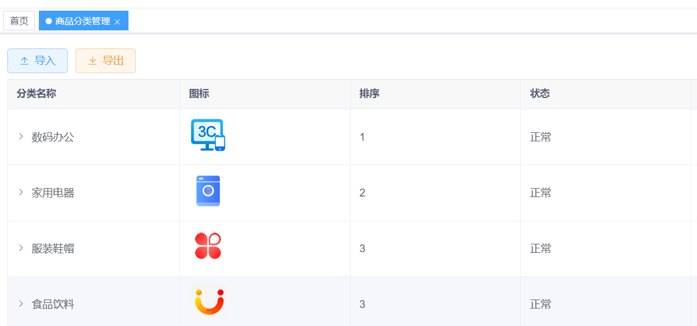


### 1.9.3 商品管理

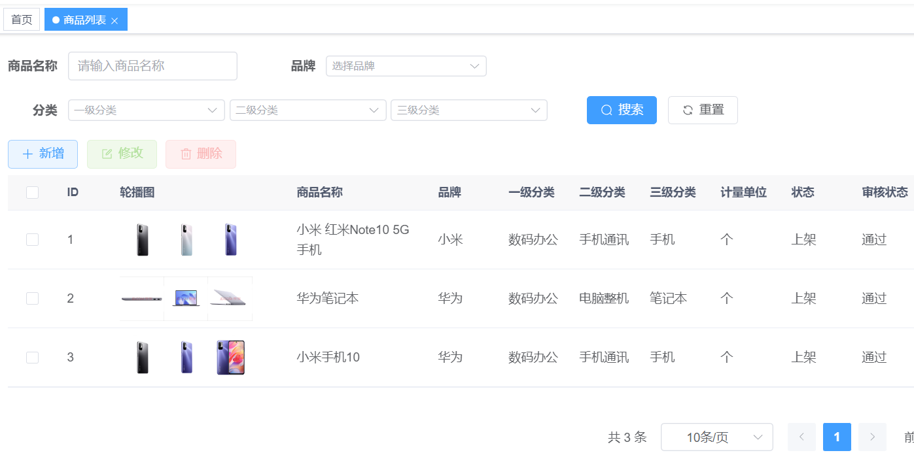

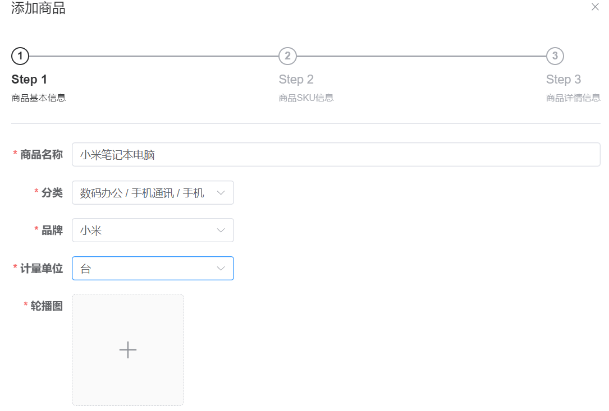


## 1.10 代码推送到远程仓库

### 1.10.1 新建远程仓库

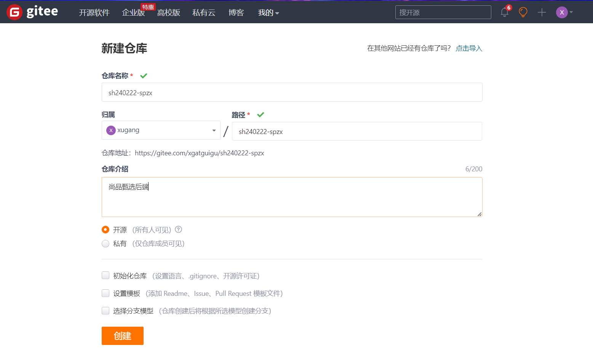


### 1.10.2 提交代码推送到远程仓库

#### 1、查看gitee远程仓库地址

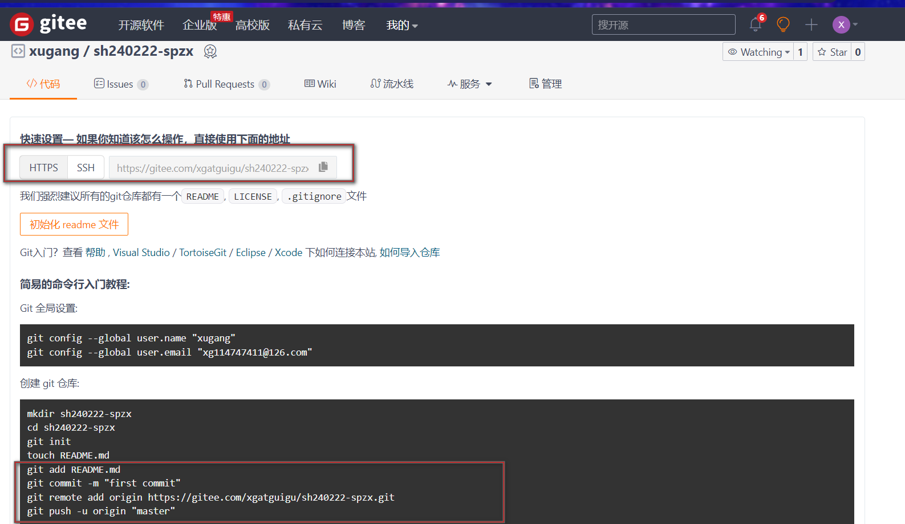

#### 2、参考上图推送代码到远程仓库

**初始化本地仓库：**

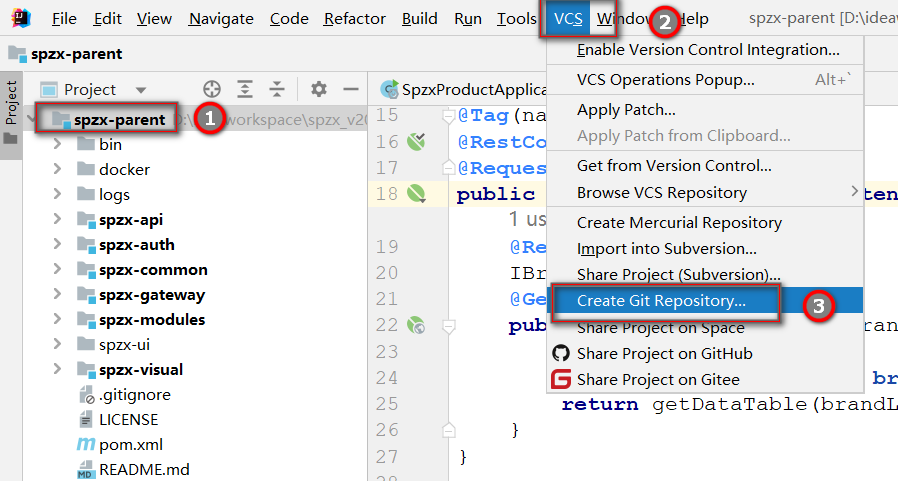

**提交到本地仓库：**

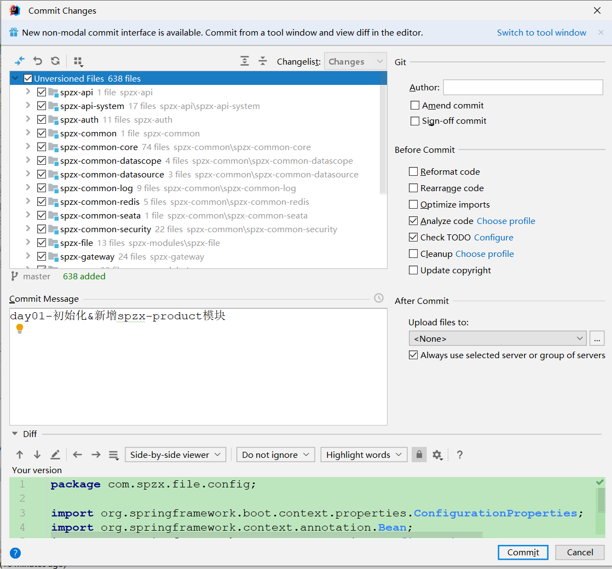

**推送到远程仓库：**

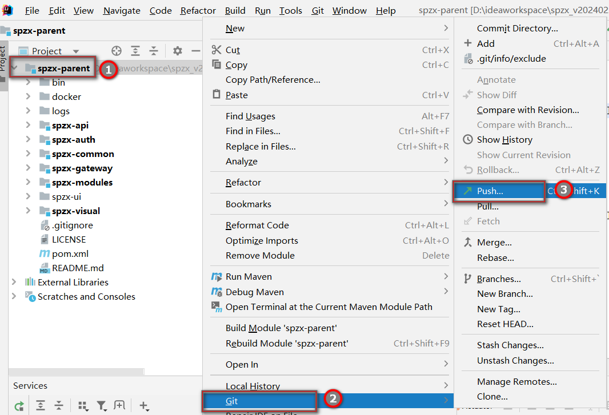

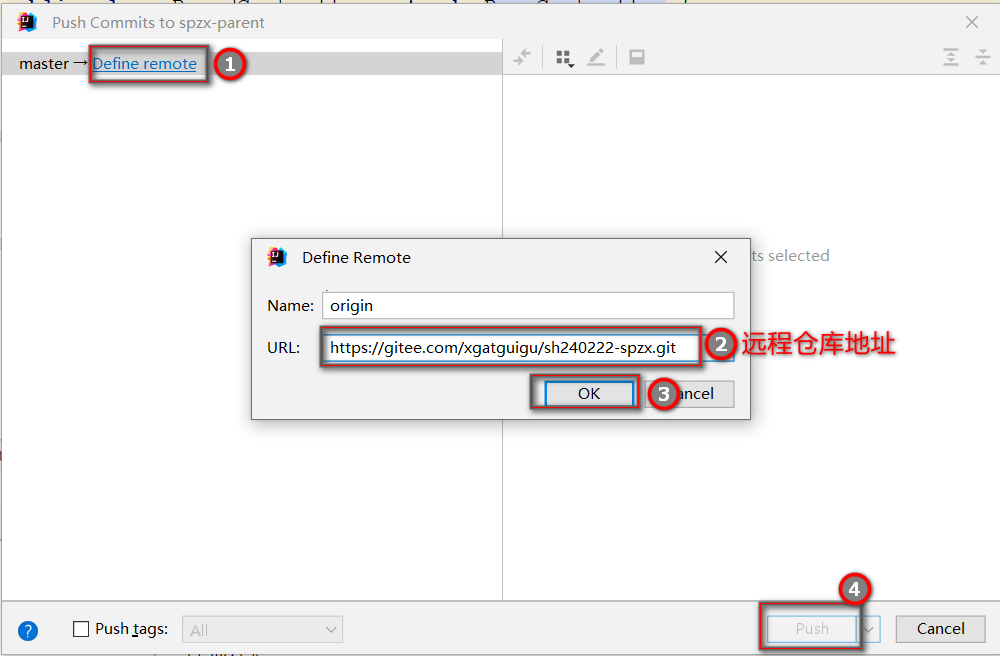
