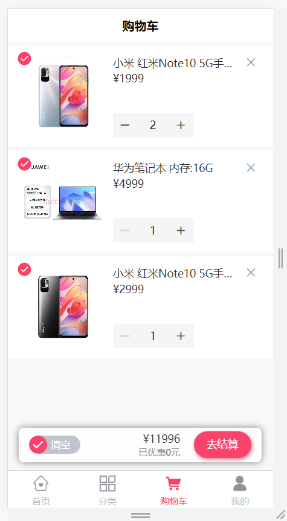
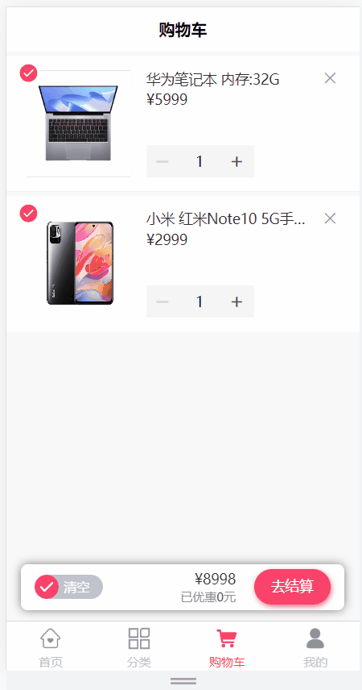
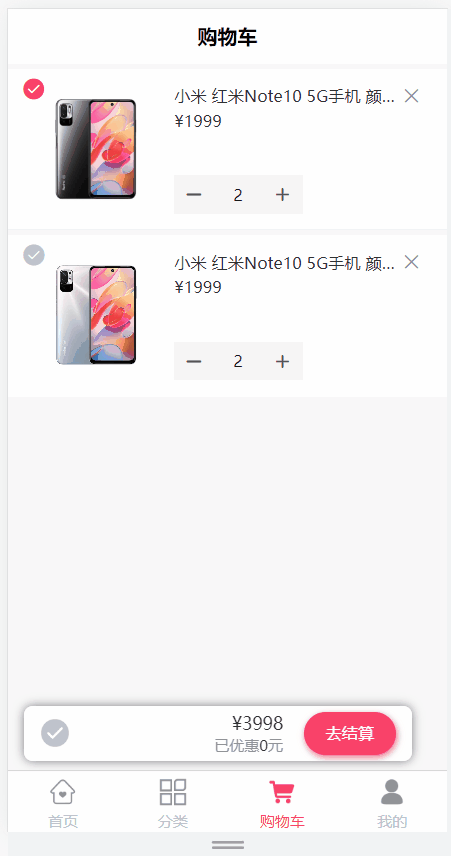
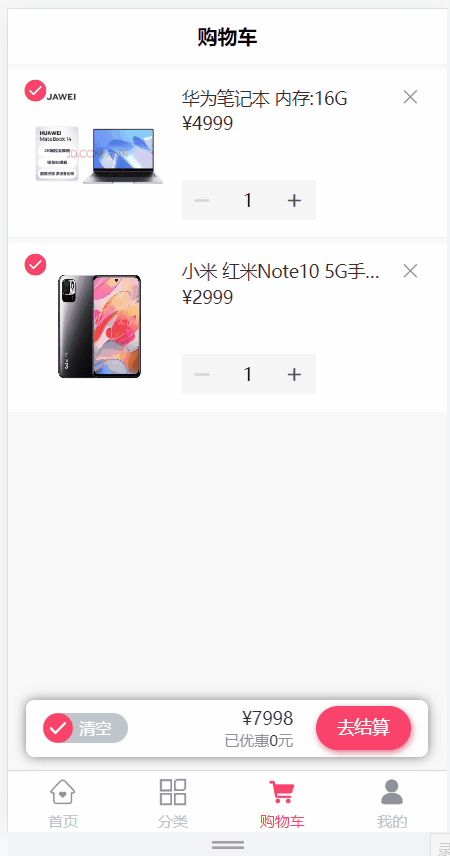
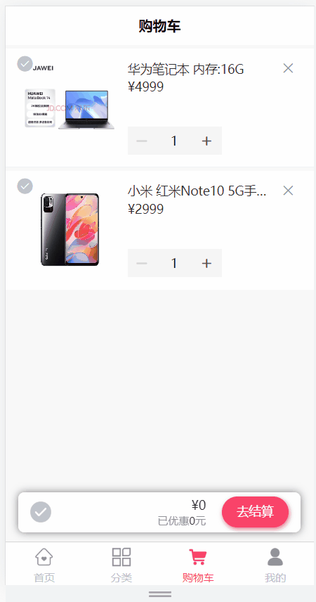

# 第3章 尚品甄选-购物车

## 3.1 购物车介绍

在购物车中存储用户所选的的商品，记录下所选商品，当用户决定购买时，用户可以选择决定购买的商品进入结算页面。

购物车模块功能说明：

1、用户必须登录后才可以使用购物车

2、添加商品到购物车

3、查询购物车列表数据

4、删除购物车商品数据

5、更新选中商品状态

6、完成购物车商品的全选

7、清空购物车商品数据

数据存储：为了提高对购物车数据操作的性能，可以使用Redis【HASH】存储购物车数据。

页面效果：




## 3.2 环境搭建

### 3.2.1 新建模块

在spzx-modules模块下新建子模块`spzx-cart`

### 3.2.2 pom.xml

```xml
<?xml version="1.0" encoding="UTF-8"?>
<project xmlns:xsi="http://www.w3.org/2001/XMLSchema-instance"
         xmlns="http://maven.apache.org/POM/4.0.0"
         xsi:schemaLocation="http://maven.apache.org/POM/4.0.0 http://maven.apache.org/xsd/maven-4.0.0.xsd">
    <parent>
        <groupId>com.spzx</groupId>
        <artifactId>spzx-modules</artifactId>
        <version>3.6.3</version>
    </parent>
    <modelVersion>4.0.0</modelVersion>

    <artifactId>spzx-cart</artifactId>

    <description>
        spzx-cart购物车模块
    </description>

    <dependencies>
        <!-- SpringCloud Alibaba Nacos -->
        <dependency>
            <groupId>com.alibaba.cloud</groupId>
            <artifactId>spring-cloud-starter-alibaba-nacos-discovery</artifactId>
        </dependency>

        <!-- SpringCloud Alibaba Nacos Config -->
        <dependency>
            <groupId>com.alibaba.cloud</groupId>
            <artifactId>spring-cloud-starter-alibaba-nacos-config</artifactId>
        </dependency>

        <!-- SpringCloud Alibaba Sentinel -->
        <dependency>
            <groupId>com.alibaba.cloud</groupId>
            <artifactId>spring-cloud-starter-alibaba-sentinel</artifactId>
        </dependency>

        <!-- SpringBoot Actuator -->
        <dependency>
            <groupId>org.springframework.boot</groupId>
            <artifactId>spring-boot-starter-actuator</artifactId>
        </dependency>

        <!-- Mysql Connector -->
        <dependency>
            <groupId>com.mysql</groupId>
            <artifactId>mysql-connector-j</artifactId>
        </dependency>

        <!-- spzx Common DataScope -->
        <dependency>
            <groupId>com.spzx</groupId>
            <artifactId>spzx-common-datascope</artifactId>
        </dependency>

        <!-- spzx Common Log -->
        <dependency>
            <groupId>com.spzx</groupId>
            <artifactId>spzx-common-log</artifactId>
        </dependency>

    </dependencies>

</project>
```

### 3.2.3 banner.txt

在resources目录下新建banner.txt

```text
Spring Boot Version: ${spring-boot.version}
Spring Application Name: ${spring.application.name}
                            _                           _
                           (_)                         | |
 _ __  _   _   ___   _   _  _  ______  ___  _   _  ___ | |_   ___  _ __ ___
| '__|| | | | / _ \ | | | || ||______|/ __|| | | |/ __|| __| / _ \| '_ ` _ \
| |   | |_| || (_) || |_| || |        \__ \| |_| |\__ \| |_ |  __/| | | | | |
|_|    \__,_| \___/  \__, ||_|        |___/ \__, ||___/ \__| \___||_| |_| |_|
                      __/ |                  __/ |
                     |___/                  |___/
```

### 3.2.4 bootstrap.yml

在resources目录下新建bootstrap.yml

```yaml
# Tomcat
server:
  port: 9209

# Spring
spring:
  application:
    # 应用名称
    name: spzx-cart
  profiles:
    # 环境配置
    active: dev
  main:
    allow-bean-definition-overriding: true #当遇到同样名字的时候，是否允许覆盖注册
  cloud:
    nacos:
      discovery:
        # 服务注册地址
        server-addr: 127.0.0.1:8848
      config:
        # 配置中心地址
        server-addr: 127.0.0.1:8848
        # 配置文件格式
        file-extension: yml
        # 共享配置
        shared-configs:
          - application-${spring.profiles.active}.${spring.cloud.nacos.config.file-extension}
```

### 3.2.5 spzx-cart-dev.yml

在nacos上添加商品服务配置文件

```yaml
# spring配置
spring:
  data:
    redis:
      host: localhost
      port: 6379
      password:
```

### 3.2.6 logback.xml

在resources目录下新建logback.xml

```xml
<?xml version="1.0" encoding="UTF-8"?>
<configuration scan="true" scanPeriod="60 seconds" debug="false">
    <!-- 日志存放路径 -->
   <property name="log.path" value="logs/spzx-cart" />
   <!-- 日志输出格式 -->
   <property name="log.pattern" value="%d{HH:mm:ss.SSS} [%thread] %-5level %logger{20} - [%method,%line] - %msg%n" />

    <!-- 控制台输出 -->
   <appender name="console" class="ch.qos.logback.core.ConsoleAppender">
      <encoder>
         <pattern>${log.pattern}</pattern>
      </encoder>
   </appender>

    <!-- 系统日志输出 -->
   <appender name="file_info" class="ch.qos.logback.core.rolling.RollingFileAppender">
       <file>${log.path}/info.log</file>
        <!-- 循环政策：基于时间创建日志文件 -->
      <rollingPolicy class="ch.qos.logback.core.rolling.TimeBasedRollingPolicy">
            <!-- 日志文件名格式 -->
         <fileNamePattern>${log.path}/info.%d{yyyy-MM-dd}.log</fileNamePattern>
         <!-- 日志最大的历史 60天 -->
         <maxHistory>60</maxHistory>
      </rollingPolicy>
      <encoder>
         <pattern>${log.pattern}</pattern>
      </encoder>
      <filter class="ch.qos.logback.classic.filter.LevelFilter">
            <!-- 过滤的级别 -->
            <level>INFO</level>
            <!-- 匹配时的操作：接收（记录） -->
            <onMatch>ACCEPT</onMatch>
            <!-- 不匹配时的操作：拒绝（不记录） -->
            <onMismatch>DENY</onMismatch>
        </filter>
   </appender>

    <appender name="file_error" class="ch.qos.logback.core.rolling.RollingFileAppender">
       <file>${log.path}/error.log</file>
        <!-- 循环政策：基于时间创建日志文件 -->
        <rollingPolicy class="ch.qos.logback.core.rolling.TimeBasedRollingPolicy">
            <!-- 日志文件名格式 -->
            <fileNamePattern>${log.path}/error.%d{yyyy-MM-dd}.log</fileNamePattern>
         <!-- 日志最大的历史 60天 -->
         <maxHistory>60</maxHistory>
        </rollingPolicy>
        <encoder>
            <pattern>${log.pattern}</pattern>
        </encoder>
        <filter class="ch.qos.logback.classic.filter.LevelFilter">
            <!-- 过滤的级别 -->
            <level>ERROR</level>
         <!-- 匹配时的操作：接收（记录） -->
            <onMatch>ACCEPT</onMatch>
         <!-- 不匹配时的操作：拒绝（不记录） -->
            <onMismatch>DENY</onMismatch>
        </filter>
    </appender>

    <!-- 系统模块日志级别控制  -->
   <logger name="com.spzx" level="info" />
   <!-- Spring日志级别控制  -->
   <logger name="org.springframework" level="warn" />

   <root level="info">
      <appender-ref ref="console" />
   </root>

   <!--系统操作日志-->
    <root level="info">
        <appender-ref ref="file_info" />
        <appender-ref ref="file_error" />
    </root>
</configuration>
```

### 3.2.7 SpzxCartApplication

添加启动类

```java
package com.spzx.cart;

/**
 * 购物车模块
 */
@EnableCustomConfig
@EnableRyFeignClients
@SpringBootApplication(exclude = DataSourceAutoConfiguration.class)//取消数据源自动配置
public class SpzxCartApplication
{
    public static void main(String[] args)
    {
        SpringApplication.run(SpzxCartApplication.class, args);
        System.out.println("(♥◠‿◠)ﾉﾞ  系统模块启动成功   ლ(´ڡ`ლ)ﾞ  \n" +
                " .-------.       ____     __        \n" +
                " |  _ _   \\      \\   \\   /  /    \n" +
                " | ( ' )  |       \\  _. /  '       \n" +
                " |(_ o _) /        _( )_ .'         \n" +
                " | (_,_).' __  ___(_ o _)'          \n" +
                " |  |\\ \\  |  ||   |(_,_)'         \n" +
                " |  | \\ `'   /|   `-'  /           \n" +
                " |  |  \\    /  \\      /           \n" +
                " ''-'   `'-'    `-..-'              ");
    }
}
```

### 3.2.8 配置网关

在spzx-gateway-dev.yml配置文件中添加会员服务的网关信息

```yaml
        # 购物车服务
        - id: spzx-cart
          uri: lb://spzx-cart
          predicates:
            - Path=/cart/**
          filters:
            - StripPrefix=1
```


## 3.3 添加购物车

### 3.3.1 需求说明

1、商品详情页加入购物车

2、加入购物车必须登录

3、购物车页面加减商品数量与商品详情页加入购物车是同一个接口

加入购物车功能如图所示：


**查看接口文档：**

添加购物车接口地址及返回结果

```json
get /cart/addToCart/{skuId}/{skuNum}
返回结果：
{
    "msg": "操作成功",
    "code": 200
}
```


### 3.3.2 搭建购物车服务远程接口模块

参考：spzx-api-system模块

#### 1、新建模块

在spzx-api模块下新建子模块spzx-api-cart

#### 2、pom.xml

```xml
<?xml version="1.0" encoding="UTF-8"?>
<project xmlns:xsi="http://www.w3.org/2001/XMLSchema-instance"
         xmlns="http://maven.apache.org/POM/4.0.0"
         xsi:schemaLocation="http://maven.apache.org/POM/4.0.0 http://maven.apache.org/xsd/maven-4.0.0.xsd">
    <parent>
        <groupId>com.spzx</groupId>
        <artifactId>spzx-api</artifactId>
        <version>3.6.3</version>
    </parent>
    <modelVersion>4.0.0</modelVersion>

    <artifactId>spzx-api-cart</artifactId>

    <description>
        spzx-api-cart购物车接口模块
    </description>

    <dependencies>

        <!-- spzx Common Core-->
        <dependency>
            <groupId>com.spzx</groupId>
            <artifactId>spzx-common-core</artifactId>
        </dependency>

    </dependencies>

</project>
```

#### 3、spzx-modules模块引入依赖

```xml
<dependency>
    <groupId>com.spzx</groupId>
    <artifactId>spzx-api-cart</artifactId>
    <version>3.6.3</version>
</dependency>
```


### 3.3.3 后端业务接口

#### 1、CartInfo

操作模块：spzx-api-cart

定义一个实体类来封装购物车中的商品数据(购物项数据)，该实体类的定义依据：购物车列表页面需要展示的数据。如下所示：

```java
package com.spzx.cart.api.domain;

@Data
@Schema(description = "购物车")
public class CartInfo extends BaseEntity {

   private static final long serialVersionUID = 1L;

   @Schema(description = "用户id")
   private Long userId;

   @Schema(description = "skuid")
   private Long skuId;

   @Schema(description = "放入购物车时价格")
   private BigDecimal cartPrice;

   @Schema(description = "实时价格")
   private BigDecimal skuPrice;

   @Schema(description = "数量")
   private Integer skuNum;

   @Schema(description = "图片文件")
   private String thumbImg;

   @Schema(description = "sku名称 (冗余)")
   private String skuName;

   @Schema(description = "isChecked")
   private Integer isChecked = 1;

}
```

#### 2、CartController

操作模块：spzx-cart

```java
package com.spzx.cart.controller;

@Tag(name = "购物车接口")
@RestController
@RequestMapping
public class CartController extends BaseController {

    @Autowired
    private ICartService cartService;

    @Operation(summary = "添加购物车")
    @RequiresLogin
    @GetMapping("addToCart/{skuId}/{skuNum}")
    public AjaxResult addToCart(@Parameter(name = "skuId", description = "商品skuId", required = true) @PathVariable("skuId") Long skuId,
                                @Parameter(name = "skuNum", description = "数量", required = true) @PathVariable("skuNum") Integer skuNum) {
        cartService.addToCart(skuId, skuNum);
        return success();
    }

}
```

#### 3、ICartService

```java
package com.spzx.cart.service;

public interface ICartService {
    void addToCart(Long skuId, Integer skuNum);
}
```

#### 4、CartServiceImpl

```java
package com.spzx.cart.service.impl;

@Service
@Slf4j
public class CartServiceImpl implements ICartService {

    @Autowired
    private RedisTemplate redisTemplate;

    @Autowired
    private RemoteProductService remoteProductService;

    private String getCartKey(Long userId) {
        //定义key user:userId:cart
        return "user:cart:" + userId;
    }

    @Override
    public void addToCart(Long skuId, Integer skuNum) {
        // 获取当前登录用户的id
        Long userId = SecurityContextHolder.getUserId();

        //1.构建“用户”购物车hash结构key  user：用户ID：cart
        String cartKey = getCartKey(userId);

        //2.创建Hash结构绑定操作对象（方便对hash进行操作）
        BoundHashOperations<String, String, CartInfo> hashOps = redisTemplate.boundHashOps(cartKey);

        //4.判断用户购物车中是否包含该商品 如果包含：数量进行累加(某件商品数量上限99) 不包含：新增购物车商品
        String hashKey = skuId.toString();
        Integer threshold = 99;
        if (hashOps.hasKey(hashKey)) {
            //4.1 说明该商品在购物车中已有，对数量进行累加 ，不能超过指定上限99
            CartInfo cartInfo = hashOps.get(hashKey);
            int totalCount = cartInfo.getSkuNum() + skuNum;
            cartInfo.setSkuNum(totalCount > threshold ? threshold : totalCount);
            hashOps.put(hashKey, cartInfo);
        } else {
            //3.判断购物车商品种类（不同SKU）总数大于50件
            Long count = hashOps.size();
            if (++count > 50) {
                throw new RuntimeException("商品种类数量超过上限！");
            }
            //4. 说明购物车没有该商品，构建购物车对象，存入Redis
            CartInfo cartInfo = new CartInfo();
            cartInfo.setUserId(userId);
            cartInfo.setSkuNum(skuNum > threshold ? threshold : skuNum);
            cartInfo.setUpdateTime(new Date());
            cartInfo.setCreateTime(new Date());
            //4.1 远程调用商品服务获取商品sku基本信息
            R<ProductSku> productSkuResult = remoteProductService.getProductSku(skuId, SecurityConstants.INNER);
            if (R.FAIL == productSkuResult.getCode()) {
                throw new ServiceException(productSkuResult.getMsg());
            }
            ProductSku productSku = productSkuResult.getData();
            cartInfo.setSkuId(skuId);
            cartInfo.setSkuName(productSku.getSkuName());
            cartInfo.setThumbImg(productSku.getThumbImg());

            //4.2 远程调用商品服务获取商品实时价格
            R<SkuPrice> skuPriceResult = remoteProductService.getSkuPrice(skuId, SecurityConstants.INNER);
            if (R.FAIL == skuPriceResult.getCode()) {
                throw new ServiceException(skuPriceResult.getMsg());
            }
            SkuPrice skuPrice = skuPriceResult.getData();
            cartInfo.setCartPrice(skuPrice.getSalePrice());
            cartInfo.setSkuPrice(skuPrice.getSalePrice());

            //4.3 将购物车商品存入Redis
            hashOps.put(hashKey, cartInfo);
        }
    }
}
```


## 3.4 购物车列表查询

### 3.4.1 需求说明

当用户在商品详情页面点击**购物车**按钮的时候，那么此时就需要将当前登录用户的所对应的所有的购物车数据在购物车页面展出出来。如下图所示，**当商品价格变化时，页面可以显示实时价格：**


**查看接口文档：**

购物车列表接口地址及返回结果

```json
get /cart/cartList
返回结果：
{
    "msg": "操作成功",
    "code": 200,
    "data": [
        {
            "id": null,
            "createTime": "2024-02-26 16:25:54",
            "updateTime": "2024-02-26 16:25:54",
            "userId": 1,
            "skuId": 5,
            "cartPrice": 1999.00,
            "skuPrice": 1999.00,
            "skuNum": 1,
            "thumbImg": "http://139.198.127.41:9000/spzx/20230525/665832167-1_u_1.jpg",
            "skuName": "小米 红米Note10 5G手机 黑色 + 8G",
            "isChecked": 1
        }
        ...
    ]
}
```


### 3.4.2 后端业务接口

#### 1、批量查询商品实时价格

操作模块：`spzx-product`

（1）ProductController

```java
@Operation(summary = "批量获取商品sku最新价格信息")
@InnerAuth
@PostMapping(value = "/getSkuPriceList")
public R<List<SkuPrice>> getSkuPriceList(@RequestBody List<Long> skuIdList)
{
    return R.ok(productService.getSkuPriceList(skuIdList));
}
```

（2）IProductService

```java
List<SkuPrice> getSkuPriceList(List<Long> skuIdList);
```

（3）ProductServiceImpl

```java
@Override
public List<SkuPrice> getSkuPriceList(List<Long> skuIdList) {
    List<ProductSku> productSkuList = productSkuMapper.selectList(new LambdaQueryWrapper<ProductSku>().in(ProductSku::getId, skuIdList).select(ProductSku::getId, ProductSku::getSalePrice));
    return productSkuList.stream().map(item -> {
        SkuPrice skuPrice = new SkuPrice();
        skuPrice.setSkuId(item.getId());
        skuPrice.setSalePrice(item.getSalePrice());
        return skuPrice;
    }).collect(Collectors.toList());
}
```


#### 2、批量查询商品实时价格openFeign接口定义

操作模块：`spzx-api-product`

（1）RemoteProductService

```java
@PostMapping(value = "/product/getSkuPriceList")
public R<List<SkuPrice>> getSkuPriceList(@RequestBody List<Long> skuIdList, @RequestHeader(SecurityConstants.FROM_SOURCE) String source);
```

（2）RemoteProductFallbackFactory

```java
@Override
public R<List<SkuPrice>> getSkuPriceList(List<Long> skuIdList, String source) {
    return R.fail("获取商品sku价格列表失败:" + throwable.getMessage());
}
```


#### 3、CartController

操作模块：`spzx-cart`

```java
@Operation(summary = "查询购物车")
@RequiresLogin
@GetMapping("cartList")
public AjaxResult cartList() {
    return success(cartService.getCartList());
}
```

#### 4、ICartService

```java
List<CartInfo> getCartList();
```

#### 5、CartServiceImpl

```java
@Override
public List<CartInfo> getCartList() {
    // 获取当前登录用户的id
    Long userId = SecurityContextHolder.getUserId();
    String cartKey = this.getCartKey(userId);
    // 获取数据
    List<CartInfo> cartInfoList = redisTemplate.opsForHash().values(cartKey);
    if (!CollectionUtils.isEmpty(cartInfoList)) {
        List<CartInfo> infoList = cartInfoList.stream()
            .sorted((o1, o2) -> o2.getCreateTime().compareTo(o1.getCreateTime()))
            .collect(Collectors.toList());

        //获取skuId列表
        List<Long> skuIdList = infoList.stream().map(CartInfo::getSkuId).collect(Collectors.toList());
        //查询商品的实时价格
        R<List<SkuPrice>> SkuPriceListResult = remoteProductService.getSkuPriceList(skuIdList, SecurityConstants.INNER);
        if (R.FAIL == SkuPriceListResult.getCode()) {
            throw new ServiceException(SkuPriceListResult.getMsg());
        }
        Map<Long, BigDecimal> skuIdToPriceMap = SkuPriceListResult.getData().stream().collect(Collectors.toMap(SkuPrice::getSkuId, SkuPrice::getSalePrice));

        infoList.forEach(item -> {
            //设置实时价格
            item.setSkuPrice(skuIdToPriceMap.get(item.getSkuId()));
        });
        return infoList ;
    }
    return new ArrayList<>();
}
```


## 3.5 删除购物车商品

### 3.5.1 需求说明

删除功能如图所示：



**查看接口文档：**

删除购物车商品接口地址及返回结果

```json
delete /cart/deleteCart/{skuId}
返回结果：
{
    "msg": "操作成功",
    "code": 200
}
```


### 3.5.2 后端业务接口

#### 1、CartController

```java
@Operation(summary = "删除购物车商品")
@RequiresLogin
@DeleteMapping("deleteCart/{skuId}")
public AjaxResult deleteCart(@Parameter(name = "skuId", description = "商品skuId", required = true) @PathVariable("skuId") Long skuId) {
    cartService.deleteCart(skuId);
    return success();
}
```

#### 2、ICartService

```java
void deleteCart(Long skuId);
```

#### 3、CartServiceImpl

```java
@Override
public void deleteCart(Long skuId) {
    // 获取当前登录用户的id
    Long userId = SecurityContextHolder.getUserId();
    String cartKey = getCartKey(userId);
    //获取缓存对象
    BoundHashOperations<String, String, CartInfo> hashOperations = redisTemplate.boundHashOps(cartKey);
    hashOperations.delete(skuId.toString());
}
```


## 3.6 更新选中商品状态

### 3.6.1 需求说明

更新选中商品状态功能如图所示：



**查看接口文档：**

更新选中商品状态接口地址及返回结果

```json
get /cart/checkCart/{skuId}/{isChecked}
返回结果：
{
    "msg": "操作成功",
    "code": 200
}
```


### 3.6.2 后端业务接口

#### 1、CartController

```java
@Operation(summary="更新选中状态")
@RequiresLogin
@GetMapping("checkCart/{skuId}/{isChecked}")
public AjaxResult checkCart(@Parameter(name = "skuId", description = "商品skuId", required = true) @PathVariable(value = "skuId") Long skuId,
                            @Parameter(name = "isChecked", description = "是否选中 1:选中 0:取消选中", required = true) @PathVariable(value = "isChecked") Integer isChecked) {
    cartService.checkCart(skuId, isChecked);
    return success();
}
```

#### 2、ICartService

```java
void checkCart(Long skuId, Integer isChecked);
```

#### 3、CartServiceImpl

```java
@Override
public void checkCart(Long skuId, Integer isChecked) {
    // 获取当前登录用户的id
    Long userId = SecurityContextHolder.getUserId();
    // 修改缓存
    String cartKey = this.getCartKey(userId);
    BoundHashOperations<String, String, CartInfo> hashOperations = redisTemplate.boundHashOps(cartKey);
    // 先获取用户选择的商品
    if (hashOperations.hasKey(skuId.toString())) {
        CartInfo cartInfoUpd = hashOperations.get(skuId.toString());
        // cartInfoUpd 写会缓存
        cartInfoUpd.setIsChecked(isChecked);
        // 更新缓存
        hashOperations.put(skuId.toString(), cartInfoUpd);
    }
}
```


## 3.7 完成购物车商品的全选

### 3.7.1 需求说明

更新购物车商品全部选中状态功能如图所示：



**查看接口文档：**

更新购物车商品全部选中状态接口地址及返回结果

```json
get /cart/allCheckCart/{isChecked}
返回结果：
{
    "msg": "操作成功",
    "code": 200
}
```


### 3.7.2 后端业务接口

#### 1、CartController

```java
@Operation(summary="更新购物车商品全部选中状态")
@RequiresLogin
@GetMapping("allCheckCart/{isChecked}")
public AjaxResult allCheckCart(@Parameter(name = "isChecked", description = "是否选中 1:选中 0:取消选中", required = true) @PathVariable(value = "isChecked") Integer isChecked){
    cartService.allCheckCart(isChecked);
    return success();
}
```

#### 2、ICartService

```java
void allCheckCart(Integer isChecked);
```

#### 3、CartServiceImpl

```java
@Override
public void allCheckCart(Integer isChecked) {
    // 获取当前登录用户的id
    Long userId = SecurityContextHolder.getUserId();
    String cartKey = getCartKey(userId);
    BoundHashOperations<String, String, CartInfo> hashOperations = redisTemplate.boundHashOps(cartKey);
    List<CartInfo> cartInfoList = hashOperations.values();

    //redisTemplate.opsForHash().values(cartKey);
    cartInfoList.forEach(item -> {
        CartInfo cartInfoUpd = hashOperations.get(item.getSkuId().toString());
        cartInfoUpd.setIsChecked(isChecked);

        // 更新缓存
        hashOperations.put(item.getSkuId().toString(), cartInfoUpd);
    });
}
```


## 3.8 清空购物车

### 3.8.1 需求说明

清空购物车功能如图所示：



**查看接口文档：**

清空购物车接口地址及返回结果

```json
get /cart/clearCart
返回结果：
{
    "msg": "操作成功",
    "code": 200
}
```


### 3.8.2 后端业务接口

#### 1、CartController

```java
@Operation(summary="清空购物车")
@RequiresLogin
@GetMapping("clearCart")
public AjaxResult clearCart(){
    cartService.clearCart();
    return success();
}
```

#### 2、ICartService

```java
void clearCart();
```

#### 3、CartServiceImpl

```java
@Override
public void clearCart() {
    // 获取当前登录用户的id
    Long userId = SecurityContextHolder.getUserId();
    String cartKey = getCartKey(userId);
    //获取缓存对象
    redisTemplate.delete(cartKey);
}
```
