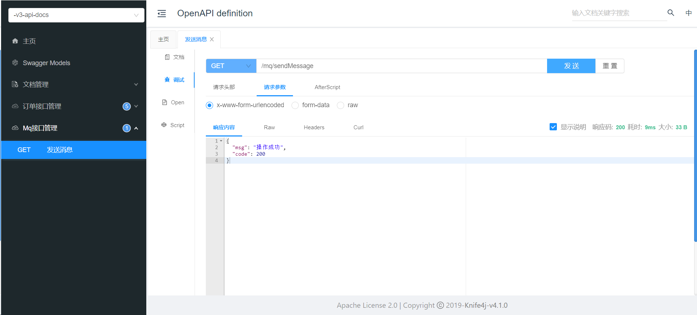
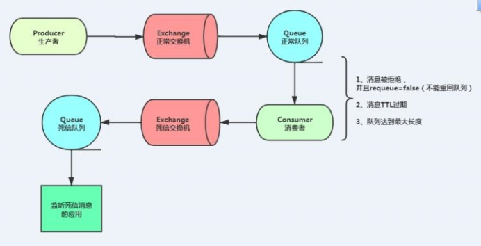

# 第4章 尚品甄选-订单

## 4.1 商品结算

### 4.1.1 需求说明

入口：购物车点击去结算按钮 ，进入结算页面(订单确认页面)，如图所示：


分析页面需要的数据：

1、 用户地址信息列表管理（增删改查），结算页选中默认地址

2、 购物车中选择的商品列表，及商品的总金额


**查看接口文档：**

用户地址信息接口地址及返回结果：

```json
#用户地址列表
get /user/userAddress/list
返回结果：
{
    "msg": "操作成功",
    "code": 200,
    "data": [
        {
            "id": 60,
            "userId": 1,
            "name": "晴天",
            "phone": "15023656352",
            "tagName": "家",
            "provinceCode": "110000",
            "cityCode": "110100",
            "districtCode": "110101",
            "address": "东直门1号",
            "fullAddress": "北京市北京市东城区东直门1号",
            "isDefault": 1
        },
        ...
    ]
}

#添加用户地址
post /user/userAddress
参数：
{
    "id": null,
    "name": "cs",
    "phone": "15090909090",
    "provinceCode": "110000",
    "cityCode": "110100",
    "districtCode": "110102",
    "address": "111",
    "tagName": "家",
    "isDefault": 0
}
返回结果：
{
    "msg": "操作成功",
    "code": 200
}

#修改用户地址
put /user/userAddress
参数：
{
    "id": 60
    "name": "cs",
    "phone": "15090909090",
    "provinceCode": "110000",
    "cityCode": "110100",
    "districtCode": "110102",
    "address": "111",
    "tagName": "家",
    "isDefault": 0
}
返回结果：
{
    "msg": "操作成功",
    "code": 200
}

#删除用户地址
delete /user/userAddress/{id}
返回结果：
{
    "msg": "操作成功",
    "code": 200
}
```

结算接口地址及返回结果：

```json
get /order/orderInfo/trade
返回结果：
{
    "msg": "操作成功",
    "code": 200,
    "data": {
        "totalAmount": 8998.00,
        "orderItemList": [
            {
                "orderId": null,
                "skuId": 9,
                "skuName": "华为笔记本 32G",
                "thumbImg": "http://139.198.127.41:9000/spzx/20230525/c8f2eae0d36b6270.jpg.avif",
                "skuPrice": 5999.00,
                "skuNum": 1
            },
            ...
        ],
        "tradeNo": "1d76f36b59414e869e843fc742e21469"
    }
}
```


### 4.1.2 地址管理接口

操作模块：spzx-user

#### 1、UserAddressController

```java
package com.spzx.user.controller;

@RestController
@RequestMapping("/userAddress")
public class UserAddressController extends BaseController
{
    @Autowired
    private IUserAddressService userAddressService;

    /**
     * 查询用户地址列表
     */
    @Operation(summary = "查询用户地址列表")
    @RequiresLogin
    @GetMapping("/list")
    public AjaxResult list()
    {
        List<UserAddress> list = userAddressService.selectUserAddressList();
        return success(list);
    }

    /**
     * 新增用户地址
     */
    @Operation(summary = "新增用户地址")
    @RequiresLogin
    @PostMapping
    public AjaxResult add(@RequestBody UserAddress userAddress)
    {
        return toAjax(userAddressService.insertUserAddress(userAddress));
    }

    /**
     * 修改用户地址
     */
    @Operation(summary = "修改用户地址")
    @RequiresLogin
    @PutMapping
    public AjaxResult edit(@RequestBody UserAddress userAddress)
    {
        return toAjax(userAddressService.updateUserAddress(userAddress));
    }

    /**
     * 删除用户地址
     */
    @Operation(summary = "删除用户地址")
    @RequiresLogin
    @DeleteMapping("/{id}")
    public AjaxResult remove(@PathVariable Long id)
    {
        return toAjax(userAddressService.removeById(id));
    }
}
```

#### 2、IUserAddressService

```java
package com.spzx.user.service;

public interface IUserAddressService extends IService<UserAddress>
{

    /**
     * 查询用户地址列表
     * @return 用户地址集合
     */
    public List<UserAddress> selectUserAddressList();

    /**
     * 新增用户地址
     * @param userAddress 用户地址
     * @return 结果
     */
    public int insertUserAddress(UserAddress userAddress);

    /**
     * 修改用户地址
     * @param userAddress 用户地址
     * @return 结果
     */
    public int updateUserAddress(UserAddress userAddress);

}
```

#### 3、UserAddressServiceImpl

```java
package com.spzx.user.service.impl;

@Service
public class UserAddressServiceImpl extends ServiceImpl<UserAddressMapper, UserAddress> implements IUserAddressService
{
    @Autowired
    private UserAddressMapper userAddressMapper;

    @Autowired
    private IRegionService regionService;

    /**
     * 查询用户地址列表
     * @return 用户地址
     */
    @Override
    public List<UserAddress> selectUserAddressList()
    {
        // 获取当前登录用户的id
        Long userId = SecurityContextHolder.getUserId();
        return userAddressMapper.selectList(new LambdaQueryWrapper<UserAddress>().eq(UserAddress::getUserId, userId));
    }

    /**
     * 新增用户地址
     * @param userAddress 用户地址
     * @return 结果
     */
    @Override
    public int insertUserAddress(UserAddress userAddress)
    {
        userAddress.setUserId(SecurityContextHolder.getUserId());
        String provinceName = regionService.getNameByCode(userAddress.getProvinceCode());
        String cityName = regionService.getNameByCode(userAddress.getCityCode());
        String districtName = regionService.getNameByCode(userAddress.getDistrictCode());
        String fullAddress = provinceName + cityName + districtName + userAddress.getAddress();
        userAddress.setFullAddress(fullAddress);
        userAddress.setCreateTime(DateUtils.getNowDate());

        //如果是默认地址，其他地址更新为非默认地址
        if(userAddress.getIsDefault().intValue() == 1) {
            UserAddress updateUserAddress = new UserAddress();
            updateUserAddress.setIsDefault(0L);
            userAddressMapper.update(updateUserAddress, new LambdaQueryWrapper<UserAddress>().eq(UserAddress::getUserId, userAddress.getUserId()));
        }
        return userAddressMapper.insert(userAddress);
    }

    /**
     * 修改用户地址
     * @param userAddress 用户地址
     * @return 结果
     */
    @Override
    public int updateUserAddress(UserAddress userAddress)
    {
        String provinceName = regionService.getNameByCode(userAddress.getProvinceCode());
        String cityName = regionService.getNameByCode(userAddress.getCityCode());
        String districtName = regionService.getNameByCode(userAddress.getDistrictCode());
        String fullAddress = provinceName + cityName + districtName + userAddress.getAddress();
        userAddress.setFullAddress(fullAddress);
        userAddress.setUpdateTime(DateUtils.getNowDate());
        //如果是默认地址，其他地址更新为非默认地址
        if(userAddress.getIsDefault().intValue() == 1) {
            UserAddress updateUserAddress = new UserAddress();
            updateUserAddress.setIsDefault(0L);
            userAddressMapper.update(updateUserAddress, new LambdaQueryWrapper<UserAddress>().eq(UserAddress::getUserId, userAddress.getUserId()));
        }
        return userAddressMapper.updateById(userAddress);
    }

}
```

#### 4、IRegionService

```java
/**
 * 根据code获取地区名称
 * @param code
 * @return
 */
String getNameByCode(String code);
```

#### 5、RegionServiceImpl

```java
@Override
public String getNameByCode(String code) {
    if (StringUtils.isEmpty(code)) {
        return "";
    }
    Region region = regionMapper.selectOne(new LambdaQueryWrapper<Region>().eq(Region::getCode,code).select(Region::getName));
    if(null != region) {
        return region.getName();
    }
    return "";
}
```


### 4.1.3 获取选中购物项数据接口

#### 1、远程调用接口开发

操作模块：spzx-cart

（1）CartController

```java
@Operation(summary="查询用户购物车列表中选中商品列表")
@InnerAuth
@GetMapping("/getCartCheckedList/{userId}")
public R<List<CartInfo>> getCartCheckedList(@Parameter(name = "userId", description = "会员id", required = true) @PathVariable Long userId){
return R.ok(cartService.getCartCheckedList(userId));
}
```

（2）ICartService

```java
List<CartInfo> getCartCheckedList(Long userId);
```

（3）CartServiceImpl

```java
@Override
public List<CartInfo> getCartCheckedList(Long userId) {
    List<CartInfo> cartInfoList = new ArrayList<>();

    String cartKey = this.getCartKey(userId);
    List<CartInfo> cartCachInfoList = redisTemplate.opsForHash().values(cartKey);
    if (!CollectionUtils.isEmpty(cartCachInfoList)) {
        for (CartInfo cartInfo : cartCachInfoList) {
            // 获取选中的商品！
            if (cartInfo.getIsChecked().intValue() == 1) {
                cartInfoList.add(cartInfo);
            }
        }
    }
    return cartInfoList;
}
```

#### 2、openFeign接口定义

操作模块：spzx-api-cart

（1）RemoteCartService

```java
package com.spzx.cart.api;

@FeignClient(value = ServiceNameConstants.CART_SERVICE, fallbackFactory = RemoteCartFallbackFactory.class)
public interface RemoteCartService
{

    @GetMapping("/getCartCheckedList/{userId}")
    public R<List<CartInfo>> getCartCheckedList(@PathVariable("userId") Long userId, @RequestHeader(SecurityConstants.FROM_SOURCE)String source);

}
```

（2）ServiceNameConstants

```java
/**
 * 购物车服务的serviceid
 */
public static final String CART_SERVICE = "spzx-cart";
```

（3）RemoteCartFallbackFactory

```java
package com.spzx.user.api.factory;

/**
 * 购物车降级处理
 * @author atguigu
 */
@Component
public class RemoteCartFallbackFactory implements FallbackFactory<RemoteCartService>
{
    private static final Logger log = LoggerFactory.getLogger(RemoteCartFallbackFactory.class);

    @Override
    public RemoteCartService create(Throwable throwable)
    {
        log.error("购物车服务调用失败:{}", throwable.getMessage());
        return new RemoteCartService()
        {

            @Override
            public R<List<CartInfo>> getCartCheckedList(Long userId, String source) {
                return R.fail("获取用户购物车选中数据失败:" + throwable.getMessage());
            }

        };
    }
}
```

（4）加载配置类

resources/META-INF/spring/org.springframework.boot.autoconfigure.AutoConfiguration.imports

```java
com.spzx.cart.api.factory.RemoteCartFallbackFactory
```


### 4.1.4 后端业务接口

操作模块：spzx-order

#### 1、TradeVo

```java
package com.spzx.order.domain;

@Data
@Schema(description = "结算实体类")
public class TradeVo {

    @Schema(description = "结算总金额")
    private BigDecimal totalAmount;

    @Schema(description = "结算商品列表")
    private List<OrderItem> orderItemList;

    @Schema(description = "交易号")
    private String tradeNo;

}
```

#### 2、OrderInfoController

```java
@Operation(summary = "订单结算")
@RequiresLogin
@GetMapping("/trade")
public AjaxResult orderTradeData() {
    return success(orderInfoService.orderTradeData());
}
```

#### 3、IOrderInfoService

```java
TradeVo orderTradeData();
```

#### 4、OrderInfoServiceImpl

```java
@Autowired
private RemoteCartService remoteCartService;

@Autowired
private RedisTemplate redisTemplate;

@Override
public TradeVo orderTradeData() {
    // 获取当前登录用户的id
    Long userId = SecurityContextHolder.getUserId();

    R<List<CartInfo>> cartInfoListResult = remoteCartService.getCartCheckedList(userId, SecurityConstants.INNER);
    if (R.FAIL == cartInfoListResult.getCode()) {
        throw new ServiceException(cartInfoListResult.getMsg());
    }
    List<CartInfo> cartInfoList = cartInfoListResult.getData();
    if (CollectionUtils.isEmpty(cartInfoList)) {
        throw new ServiceException("购物车无选中商品");
    }

    //将集合泛型从购物车改为订单明细
    List<OrderItem> orderItemList = null;
    BigDecimal totalAmount = new BigDecimal(0);
    if (!CollectionUtils.isEmpty(cartInfoList)) {
        orderItemList = cartInfoList.stream().map(cartInfo -> {
            OrderItem orderItem = new OrderItem();
            BeanUtils.copyProperties(cartInfo, orderItem);
            orderItem.setSkuPrice(cartInfo.getSkuPrice());
            return orderItem;
        }).collect(Collectors.toList());

        //订单总金额
        for(OrderItem orderItem : orderItemList) {
            totalAmount = totalAmount.add(orderItem.getSkuPrice().multiply(new BigDecimal(orderItem.getSkuNum())));
        }
    }

    //渲染订单确认页面-生成用户流水号
    String tradeNo = this.generateTradeNo(userId);

    TradeVo tradeVo = new TradeVo();
    tradeVo.setTotalAmount(totalAmount);
    tradeVo.setOrderItemList(orderItemList);
    tradeVo.setTradeNo(tradeNo);
    return tradeVo;
}

/**
 * 渲染订单确认页面-生成用户流水号
 * @param userId
 * @return
 */
private String generateTradeNo(Long userId) {
    //1.构建流水号Key
    String userTradeKey = "user:tradeNo:" + userId;
    //2.构建流水号value
    String tradeNo = UUID.randomUUID().toString().replaceAll("-", "");
    //3.将流水号存入Redis 暂存5分钟
    redisTemplate.opsForValue().set(userTradeKey, tradeNo, 5, TimeUnit.MINUTES);
    return tradeNo;
}
```


## 4.2 商品下单

### 4.2.1 需求说明

需求说明：用户在结算页面点击提交订单按钮，那么此时就需要保存订单信息(order_info)、订单项信息(order_item)及记录订单日志(order_log)，下单成功重定向到订单支付页面

**查看接口文档：**

下单接口地址及返回结果：

```json
post /order/orderInfo/submitOrder
参数：
{
    "orderItemList": [
        {
            "skuId": 6,
            "skuName": "小米 红米Note10 5G手机 颜色:黑色 内存:18G",
            "thumbImg": "http://139.198.127.41:9000/spzx/20230525/665832167-1_u_1.jpg",
            "skuPrice": 2999,
            "skuNum": 1
        },
        ...
    ],
    "userAddressId": 2,
    "feightFee": 0,
    "remark": "赶快发货",
    "tradNo": "4a20bfd854c6e86e7488"
}
返回结果(订单id)：
{
    "code": 200,
    "message": "操作成功",
    "data": 1
}
```


### 4.2.2 创建order_log表代码

操作spzx-order模块

**OrderLog**

```java
package com.spzx.order.domain;

import io.swagger.v3.oas.annotations.media.Schema;
import lombok.Data;
import com.spzx.common.core.annotation.Excel;
import com.spzx.common.core.web.domain.BaseEntity;

/**
 * 订单操作日志记录对象 order_log
 */
@Data
@Schema(description = "订单操作日志记录")
public class OrderLog extends BaseEntity
{
    private static final long serialVersionUID = 1L;

    /** 订单id */
    @Excel(name = "订单id")
    @Schema(description = "订单id")
    private Long orderId;

    /** 操作人：用户；系统；后台管理员 */
    @Excel(name = "操作人：用户；系统；后台管理员")
    @Schema(description = "操作人：用户；系统；后台管理员")
    private String operateUser;

    /** 订单状态 */
    @Excel(name = "订单状态")
    @Schema(description = "订单状态")
    private Long processStatus;

    /** 备注 */
    @Excel(name = "备注")
    @Schema(description = "备注")
    private String note;

}
```


**OrderLogMapper**

```java
package com.spzx.order.mapper;

public interface OrderLogMapper extends BaseMapper<OrderLog>
{

}
```


### 4.2.3 批量获取商品价格接口

获取最新商品sku价格与购物车价格比较，校验价格是否变化，价格变化就更新购物车价格

这个接口之前已经开发过了，这里直接使用。


### 4.2.4 更新购物车最新价格

操作模块：spzx-cart

#### 1、远程调用接口开发

（1）CartController

```java
@Operation(summary="更新用户购物车列表价格")
@InnerAuth
@GetMapping("/updateCartPrice/{userId}")
public R<Boolean> updateCartPrice(@PathVariable("userId") Long userId){
    return R.ok(cartService.updateCartPrice(userId));
}
```

（2）ICartService

```java
Boolean updateCartPrice(Long userId);
```

（3）CartServiceImpl

```java
@Override
public Boolean updateCartPrice(Long userId) {
    String cartKey = getCartKey(userId);
    BoundHashOperations<String, String, CartInfo> hashOperations = redisTemplate.boundHashOps(cartKey);
    List<CartInfo> cartCachInfoList = hashOperations.values();
    if (!CollectionUtils.isEmpty(cartCachInfoList)) {
        for (CartInfo cartInfo : cartCachInfoList) {
            if (cartInfo.getIsChecked().intValue() == 1) {
                SkuPrice skuPrice = remoteProductService.getSkuPrice(cartInfo.getSkuId(), SecurityConstants.INNER).getData();
                cartInfo.setCartPrice(skuPrice.getSalePrice());
                cartInfo.setSkuPrice(skuPrice.getSalePrice());
                hashOperations.put(cartInfo.getSkuId().toString(), cartInfo);
            }
        }
    }
    return true;
}
```

#### 2、openFeign接口定义

操作模块：spzx-api-cart

（1）RemoteCartService

```java
@GetMapping("/updateCartPrice/{userId}")
public R<Boolean> updateCartPrice(@PathVariable("userId") Long userId, @RequestHeader(SecurityConstants.FROM_SOURCE)String source);
```

（2）RemoteCartFallbackFactory

```java
@Override
public R<Boolean> updateCartPrice(Long userId, String source) {
    return R.fail("更新购物车价格失败:" + throwable.getMessage());
}
```


### 4.2.5 删除购物车选中商品

下单成功后，删除购物车选中的商品

操作模块：spzx-cart

#### 1、远程调用接口开发

（1）CartController

```java
@Operation(summary="删除用户购物车列表中选中商品列表")
@InnerAuth
@GetMapping("/deleteCartCheckedList/{userId}")
public R<Boolean> deleteCartCheckedList(@PathVariable("userId") Long userId){
    return R.ok(cartService.deleteCartCheckedList(userId));
}
```

（2）ICartService

```java
 Boolean deleteCartCheckedList(Long userId);
```

（3）CartServiceImpl

```java
@Override
public Boolean deleteCartCheckedList(Long userId) {
    String cartKey = getCartKey(userId);
    BoundHashOperations<String, String, CartInfo> hashOperations = redisTemplate.boundHashOps(cartKey);
    List<CartInfo> cartCachInfoList = hashOperations.values();
    if (!CollectionUtils.isEmpty(cartCachInfoList)) {
        for (CartInfo cartInfo : cartCachInfoList) {
            // 获取选中的商品！
            if (cartInfo.getIsChecked().intValue() == 1) {
                hashOperations.delete(cartInfo.getSkuId().toString());
            }
        }
    }
    return true;
}
```

#### 2、openFeign接口定义

操作模块：spzx-api-cart

（1）RemoteCartService

```java
@GetMapping("/deleteCartCheckedList/{userId}")
public R<Boolean> deleteCartCheckedList(@PathVariable("userId") Long userId, @RequestHeader(SecurityConstants.FROM_SOURCE)String source);
```

（2）RemoteCartFallbackFactory

```java
@Override
public R<Boolean> deleteCartCheckedList(Long userId, String source) {
    return R.fail("删除用户购物车选中数据失败:" + throwable.getMessage());
}
```


### 4.2.6 获取用户地址信息

#### 1、远程调用接口

操作模块：spzx-user

（1）UserAddressController

```java
@InnerAuth
@GetMapping(value = "/getUserAddress/{id}")
public R<UserAddress> getUserAddress(@PathVariable("id") Long id)
{
    return R.ok(userAddressService.getById(id));
}
```

（2）UserAddress

将spzx-user模块UserAddress实体类，移动到spzx-api-user模块

#### 2、openFeign接口定义

操作模块：spzx-api-user

（1）RemoteUserAddressService

```java
package com.spzx.user.api;

@FeignClient(contextId = "remoteUserAddressService" , value = ServiceNameConstants.USER_SERVICE, fallbackFactory = RemoteUserAddressFallbackFactory.class)
public interface RemoteUserAddressService {

    @GetMapping(value = "/userAddress/getUserAddress/{id}")
    public R<UserAddress> getUserAddress(@PathVariable("id") Long id, @RequestHeader(SecurityConstants.FROM_SOURCE) String source);
}
```

（2）RemoteUserAddressFallbackFactory

```java
package com.spzx.user.api.factory;

/**
 * 服务降级处理
 */
@Component
public class RemoteUserAddressFallbackFactory implements FallbackFactory<RemoteUserAddressService>
{
    private static final Logger log = LoggerFactory.getLogger(RemoteUserAddressFallbackFactory.class);

    @Override
    public RemoteUserAddressService create(Throwable throwable)
    {
        log.error("用户服务调用失败:{}", throwable.getMessage());
        return new RemoteUserAddressService()
        {

            @Override
            public R<UserAddress> getUserAddress(Long id, String source) {
                return R.fail("获取用户地址失败:" + throwable.getMessage());
            }
        };
    }
}
```

（3）加载配置类

resources/META-INF.spring/org.springframework.boot.autoconfigure.AutoConfiguration.imports

```java
com.spzx.user.api.factory.RemoteUserAddressFallbackFactory
```


### 4.2.7 后端业务接口

操作模块：spzx-order

1、OrderForm

```java
package com.spzx.order.domain;

@Data
public class OrderForm {

    @Schema(description = "用户流水号")
    private String tradeNo;

    //送货地址id
    @Schema(description = "送货地址id")
    private Long userAddressId;

    //运费
    @Schema(description = "运费")
    private BigDecimal feightFee;

    //备注
    @Schema(description = "备注")
    private String remark;

    @Schema(description = "结算商品列表")
    private List<OrderItem> orderItemList;
}
```


2、OrderInfoController

```java
@Operation(summary = "用户提交订单")
@RequiresLogin
@PostMapping("/submitOrder")
public AjaxResult submitOrder(@RequestBody OrderForm orderForm) {
    return success(orderInfoService.submitOrder(orderForm));
}
```


3、IOrderInfoService

```java
Long submitOrder(OrderForm orderForm);
```


4、OrderInfoServiceImpl

```java
@Autowired
private RemoteProductService remoteProductService;

@Autowired
private RemoteUserAddressService remoteUserAddressService;

@Autowired
private OrderLogMapper orderLogMapper;

/**
 * 验证页面提交流水号是否有效
 *
 * @param userId
 * @param tradeNo
 * @return
 */
private Boolean checkTradeNo(String userId, String tradeNo) {
    String userTradeKey = "user:tradeNo:" + userId;
    String redisTradeNo = (String) redisTemplate.opsForValue().get(userTradeKey);
    return tradeNo.equals(redisTradeNo);
}

/**
 * 删除流水号
 * @param userId
 */
private void deleteTradeNo(String userId) {
    String userTradeKey = "user:tradeNo:" + userId;
    redisTemplate.delete(userTradeKey);
}

@Transactional(rollbackFor = Exception.class)
@Override
public Long submitOrder(OrderForm orderForm) {
    // 获取当前登录用户的id
    Long userId = SecurityContextHolder.getUserId();

    //1.验证用户是否通过浏览器回退进行重复提交订单
    //1.1 获取Redis中存放流水号 跟用户提交比较
    //Boolean flag = this.checkTradeNo(orderInfo.getUserId().toString(), tradeNo);
    //if (!flag) {
    //    throw new RuntimeException("请勿重复提交订单，请尝试重试");
    //}
    //1.2 验证通过，将Redis中存放流水号删除
    //this.deleteTradeNo(orderInfo.getUserId().toString());

    //1.3 采用Lua脚本保证判断删除流水号原子性 KEYS[1]:流水号Key    ARGV[1]：用户流水号
    String userTradeKey = "user:tradeNo:" + userId;
    String scriptText = "if redis.call(\"get\",KEYS[1]) == ARGV[1]\n" +
            "then\n" +
            "    return redis.call(\"del\",KEYS[1])\n" +
            "else\n" +
            "    return 0\n" +
            "end";
    DefaultRedisScript<Long> redisScript = new DefaultRedisScript<>();
    redisScript.setScriptText(scriptText);
    redisScript.setResultType(Long.class);
    Long flag = (Long) redisTemplate.execute(redisScript, Arrays.asList(userTradeKey), orderForm.getTradeNo());
    if (flag == 0) {
        throw new ServiceException("请勿重复提交订单，请尝试重试");
    }

    //2. 判断购物项
    List<OrderItem> orderItemList = orderForm.getOrderItemList();
    if (CollectionUtils.isEmpty(orderItemList)) {
        throw new ServiceException("请求不合法");
    }

    //3.订单校验
    //3.1.校验价格
    List<Long> skuIdList = orderItemList.stream().map(OrderItem::getSkuId).collect(Collectors.toList());

    R<List<SkuPrice>> skuPriceListResult = remoteProductService.getSkuPriceList(skuIdList, SecurityConstants.INNER);
    if (R.FAIL == skuPriceListResult.getCode()) {
        throw new ServiceException(skuPriceListResult.getMsg());
    }
    List<SkuPrice> skuPriceList = skuPriceListResult.getData();

    Map<Long, BigDecimal> skuIdToSalePriceMap = skuPriceList.stream().collect(Collectors.toMap(SkuPrice::getSkuId, SkuPrice::getSalePrice));

    String priceCheckResult = "";
    for (OrderItem orderItem : orderItemList) {
        if (orderItem.getSkuPrice().compareTo(skuIdToSalePriceMap.get(orderItem.getSkuId())) != 0) {
            priceCheckResult += orderItem.getSkuName() + "价格变化了; ";
        }
    }
    if(StringUtils.isNotEmpty(priceCheckResult)) {
        //更新购物车价格
        remoteCartService.updateCartPrice(userId, SecurityConstants.INNER);

        throw new ServiceException(priceCheckResult);
    }

    //3.2.校验库存并锁定库存
    //TODO ...

    Long orderId = null;
    try {
        //4 下单
        orderId = this.saveOrder(orderForm);
    } catch (Exception e) {
        e.printStackTrace();
        //抛出异常
        throw new ServiceException("下单失败");
    }

    //5 删除购物车选项
    remoteCartService.deleteCartCheckedList(userId, SecurityConstants.INNER);
    return orderId;
}

@Transactional(rollbackFor = Exception.class)
public Long saveOrder(OrderForm orderForm) {
    // 获取当前登录用户的id
    Long userId = SecurityContextHolder.getUserId();
    String userName = SecurityContextHolder.getUserName();

    OrderInfo orderInfo = new OrderInfo();
    orderInfo.setOrderNo(orderForm.getTradeNo());
    orderInfo.setUserId(userId);
    orderInfo.setNickName(userName);
    orderInfo.setRemark(orderForm.getRemark());
    UserAddress userAddress = remoteUserAddressService.getUserAddress(orderForm.getUserAddressId(), SecurityConstants.INNER).getData();
    orderInfo.setReceiverName(userAddress.getName());
    orderInfo.setReceiverPhone(userAddress.getPhone());
    orderInfo.setReceiverTagName(userAddress.getTagName());
    orderInfo.setReceiverProvince(userAddress.getProvinceCode());
    orderInfo.setReceiverCity(userAddress.getCityCode());
    orderInfo.setReceiverDistrict(userAddress.getDistrictCode());
    orderInfo.setReceiverAddress(userAddress.getFullAddress());

    List<OrderItem> orderItemList = orderForm.getOrderItemList();
    BigDecimal totalAmount = new BigDecimal(0);
    for (OrderItem orderItem : orderItemList) {
        totalAmount = totalAmount.add(orderItem.getSkuPrice().multiply(new BigDecimal(orderItem.getSkuNum())));
    }
    orderInfo.setTotalAmount(totalAmount);
    orderInfo.setCouponAmount(new BigDecimal(0));
    orderInfo.setOriginalTotalAmount(totalAmount);
    orderInfo.setFeightFee(orderForm.getFeightFee());
    //OrderInfo类的orderStatus属性的类型改为Integer
    orderInfo.setOrderStatus(0);
    orderInfoMapper.insert(orderInfo);

    //保存订单明细
    for (OrderItem orderItem : orderItemList) {
        orderItem.setOrderId(orderInfo.getId());
        orderItemMapper.insert(orderItem);
    }

    //记录日志
    OrderLog orderLog = new OrderLog();
    orderLog.setOrderId(orderInfo.getId());
    orderLog.setProcessStatus(0);
    orderLog.setNote("提交订单");
    orderLog.setOperateUser("用户");
    orderLogMapper.insert(orderLog);
    return orderInfo.getId();
}
```


## 4.3 检查与锁定库存

我们的商品不允许超卖，为了防止超卖，我们下单必须检查与锁定库存，下单失败或取消订单要解锁库存，支付成功扣减库存

### 4.3.1 远程调用接口

操作模块：spzx-product

1、ProductController

```java
@InnerAuth
@Operation(summary = "检查与锁定库存")
@PostMapping("checkAndLock/{orderNo}")
public R<String> checkAndLock(@PathVariable String orderNo, @RequestBody List<SkuLockVo> skuLockVoList) {
    try {
        return R.ok(productService.checkAndLock(orderNo, skuLockVoList));
    } catch (ServiceException e) {
        e.printStackTrace();
        return R.ok(e.getMessage());
    } catch (Exception e) {
        e.printStackTrace();
        return R.ok("库存不足");
    }
}
```

2、SkuLockVo

操作模块：spzx-api-product

```java
package com.spzx.product.api.domain;

@Data
public class SkuLockVo
{

    private Long skuId;

    private Integer skuNum;

    /** 是否有库存 **/
    private Boolean isHaveStock = false;

}
```

3、IProductService

```java
String checkAndLock(String orderNo, List<SkuLockVo> skuLockVoList);
```

4、ProductServiceImpl

```java
@Transactional(rollbackFor = {Exception.class})
@Override
public String checkAndLock(String orderNo, List<SkuLockVo> skuLockVoList) {
    String key = "sku:checkAndLock:" + orderNo;
    String dataKey = "sku:lock:data:" + orderNo;
    //防止重复请求
    boolean isExist = redisTemplate.opsForValue().setIfAbsent(key, orderNo, 1, TimeUnit.HOURS);
    if (!isExist) {
        //如果存在，则已执行过库存锁定
        if(redisTemplate.hasKey(dataKey)) {
            return "";
        } else {
            return "重复提交";
        }
    }

    // 遍历所有商品，验库存并锁库存，要具备原子性
    skuLockVoList.forEach(skuLockVo -> {
        // 验库存：查询，返回的是满足要求的库存列表
        SkuStock skuStock = skuStockMapper.check(skuLockVo.getSkuId(), skuLockVo.getSkuNum());
        // 如果没有一个商品满足要求，这里就验库存失败
        if (null == skuStock) {
            skuLockVo.setIsHaveStock(false);
        } else {
            skuLockVo.setIsHaveStock(true);
        }
    });

    // 只要有一个商品锁定失败，所有锁定成功的商品要解锁库存
    if (skuLockVoList.stream().anyMatch(skuLockVo -> !skuLockVo.getIsHaveStock())) {
        // 获取所有锁定成功的商品，遍历解锁库存
        StringBuffer result = new StringBuffer();
        //获取没有库存的对象列表
        List<SkuLockVo> noHaveStockSkuLockVoList = skuLockVoList.stream().filter(item -> !item.getIsHaveStock()).collect(Collectors.toList());
        for(SkuLockVo noHaveStockSkuLockVo : noHaveStockSkuLockVoList) {
            result.append("商品: " + noHaveStockSkuLockVo.getSkuId() + " 库存不足; ");
        }
        //锁定失败，解除
        redisTemplate.delete(key);
        // 响应锁定状态
        return result.toString();
    } else {
        //锁定库存
        skuLockVoList.forEach(skuLockVo -> {
            int row = skuStockMapper.lock(skuLockVo.getSkuId(), skuLockVo.getSkuNum());
            if(row == 0) {
                //解除去重
                this.redisTemplate.delete(key);
                throw new ServiceException("库存锁定失败");
            }
        });
    }

    // 如果所有商品都锁定成功的情况下，需要缓存锁定信息到redis。以方便将来解锁库存 或者 减库存
    this.redisTemplate.opsForValue().set(dataKey, skuLockVoList);
    return "";
}
```

5、SkuStockMapper

```java
SkuStock check(@Param("skuId") Long skuId, @Param("num")Integer num);

Integer lock(@Param("skuId") Long skuId, @Param("num")Integer num);
```

6、SkuStockMapper.xml

```xml
<?xml version="1.0" encoding="UTF-8" ?>
<!DOCTYPE mapper
PUBLIC "-//mybatis.org//DTD Mapper 3.0//EN"
"http://mybatis.org/dtd/mybatis-3-mapper.dtd">
<mapper namespace="com.spzx.product.mapper.SkuStockMapper">

    <resultMap type="SkuStock" id="SkuStockResult" autoMapping="true">
    </resultMap>

    <select id="check" resultMap="SkuStockResult">
        select * from sku_stock where sku_id = #{skuId} and available_num > #{num} for update
    </select>

    <update id="lock">
        update sku_stock
        set lock_num = lock_num + #{num}, available_num = available_num - #{num}
        where sku_id = #{skuId}
    </update>

</mapper>
```

select for update 这个语句的作用是在读取数据时给数据行加锁，以防止其他事务并发修改相同的数据行。


### 4.3.2 openFeign接口定义

RemoteProductService

```java
@PostMapping("/product/checkAndLock/{orderNo}")
public R<String> checkAndLock(@PathVariable("orderNo") String orderNo, @RequestBody List<SkuLockVo> skuLockVoList, @RequestHeader(SecurityConstants.FROM_SOURCE) String source);
```


## 4.4 RabbitMQ使用

### 4.4.1 封装RabbitMQ

由于消息队列是公共模块，我们把mq的相关代码（生产者）封装到该模块，其他service微服务模块都可能使用，因此我们把他封装到一个单独的模块 ，需要使用mq的模块直接引用该模块即可

1、新建模块

在`spzx-common`模块下新建`spzx-common-rabbit`模块

2、pom.xml

```xml
<?xml version="1.0" encoding="UTF-8"?>
<project xmlns:xsi="http://www.w3.org/2001/XMLSchema-instance"
         xmlns="http://maven.apache.org/POM/4.0.0"
         xsi:schemaLocation="http://maven.apache.org/POM/4.0.0 http://maven.apache.org/xsd/maven-4.0.0.xsd">
    <parent>
        <groupId>com.spzx</groupId>
        <artifactId>spzx-common</artifactId>
        <version>3.6.3</version>
    </parent>
    <modelVersion>4.0.0</modelVersion>

    <artifactId>spzx-common-rabbit</artifactId>

    <description>
        spzx-common-rabbit服务
    </description>

    <dependencies>
        <dependency>
            <groupId>org.springframework.boot</groupId>
            <artifactId>spring-boot-starter-web</artifactId>
        </dependency>

        <!--rabbitmq消息队列-->
        <dependency>
            <groupId>org.springframework.cloud</groupId>
            <artifactId>spring-cloud-starter-bus-amqp</artifactId>
        </dependency>

        <dependency>
            <groupId>com.alibaba.fastjson2</groupId>
            <artifactId>fastjson2</artifactId>
        </dependency>

        <dependency>
            <groupId>org.projectlombok</groupId>
            <artifactId>lombok</artifactId>
        </dependency>

        <!-- 缓存服务 -->
        <dependency>
            <groupId>com.spzx</groupId>
            <artifactId>spzx-common-redis</artifactId>
        </dependency>
    </dependencies>
</project>
```

3、RabbitService

```java
package com.spzx.common.rabbit.service;

@Service
public class RabbitService {

    @Autowired
    private RabbitTemplate rabbitTemplate;

    /**
     * 发送消息
     * @param exchange   交换机
     * @param routingKey 路由键
     * @param message    消息
     */
    public boolean sendMessage(String exchange, String routingKey, Object message) {
        rabbitTemplate.convertAndSend(exchange, routingKey, message);
        return true;
    }

}
```

4、加载配置类

resources/META-INF/spring/org.springframework.boot.autoconfigure.AutoConfiguration.imports

```java
com.spzx.common.rabbit.service.RabbitService
```

5、MqConst

提供常量类 MqConst

```java
package com.spzx.common.rabbit.constant;

public class MqConst {
    /**
     * 测试
     */
    public static final String EXCHANGE_TEST = "spzx.test";
    public static final String ROUTING_TEST = "spzx.test";
    public static final String ROUTING_CONFIRM = "spzx.confirm";
    //队列
    public static final String QUEUE_TEST  = "spzx.test";
    public static final String QUEUE_CONFIRM  = "spzx.confirm";

    /**
     * 库存
     */
    public static final String EXCHANGE_PRODUCT = "spzx.product";
    public static final String ROUTING_UNLOCK = "spzx.unlock";
    public static final String ROUTING_MINUS = "spzx.minus";
    //队列
    public static final String QUEUE_UNLOCK  = "spzx.unlock";
    public static final String QUEUE_MINUS  = "spzx.minus";

    /**
     * 支付
     */
    public static final String EXCHANGE_PAYMENT_PAY = "spzx.payment";
    public static final String ROUTING_PAYMENT_PAY = "spzx.payment.pay";
    public static final String ROUTING_PAYMENT_CLOSE = "spzx.payment.close";;
    public static final String QUEUE_PAYMENT_PAY = "spzx.payment.pay";
    public static final String QUEUE_PAYMENT_CLOSE  = "queue.payment.close";

    /**
     * 取消订单延迟消息
     */
    public static final String EXCHANGE_CANCEL_ORDER = "spzx.cancel.order";
    public static final String ROUTING_CANCEL_ORDER = "spzx.cancel.order";
    public static final String QUEUE_CANCEL_ORDER = "spzx.cancel.order";
    public static final Integer CANCEL_ORDER_DELAY_TIME = 15 * 60;
}
```


### 4.4.2 RabbitMQ测试

我们在`spzx-order`模块测试mq消息

1、配置RabbitMQ

在nacos配置中心，spzx-order-dev.yml文件添加配置

```yaml
spring:
  rabbitmq:
    host: 127.0.0.1
    port: 5672
    username: guest
    password: guest
```

说明：host改为实际的IP

2、引入spzx-common-rabbit模块

在`spzx-order`模块pom.xml文件添加依赖

```xml
<dependency>
    <groupId>com.spzx</groupId>
    <artifactId>spzx-common-rabbit</artifactId>
    <version>3.6.3</version>
</dependency>
```

3、MqController

 发送消息

```java
package com.spzx.order.controller;

@Tag(name = "Mq接口管理")
@RestController
@RequestMapping("/mq")
public class MqController extends BaseController
{
    @Autowired
    private RabbitService rabbitService;

    @Operation(summary = "发送消息")
    @GetMapping("/sendMessage")
    public AjaxResult sendMessage()
    {
        rabbitService.sendMessage(MqConst.EXCHANGE_TEST, MqConst.ROUTING_TEST, "hello");
        return success();
    }

}
```

4、TestReceiver

监听消息

```java
package com.spzx.order.receiver;

@Slf4j
@Component
public class TestReceiver {
    /**
     * 监听消息
     * @param message
     */
    @SneakyThrows
    @RabbitListener(bindings = @QueueBinding(
            exchange = @Exchange(value = MqConst.EXCHANGE_TEST, durable = "true"),
            value = @Queue(value = MqConst.QUEUE_TEST, durable = "true"),
            key = MqConst.ROUTING_TEST
    ))
    public void test(String content, Message message) {
        //都可以
        log.info("接收消息：{}", content);
        //log.info("接收消息：{}", new String(message.getBody()));
    }
}
```

5、knife4j测试

发送消息



监听消息：查看idea打印结果


### 4.4.3 消息可靠性配置

#### 1、介绍

MQ消息的可靠性，一般需要三个方面一起保证：

1. 生产者不丢数据
2. MQ服务器不丢数据
3. 消费者不丢数据

保证消息不丢失有两种实现方式：

- 开启事务模式
- 消息确认模式（生产者，消费者）

**说明：**开启事务会大幅降低消息发送及接收效率，使用的相对较少，因此我们生产环境一般都采取消息确认模式，以下我们只是讲解消息确认模式


#### 2、消息发送确认配置

消息发送确认可以保证生产者不丢数据

（1）封装发送端消息确认配置类

操作模块：`spzx-common-rabbit`

```java
package com.spzx.common.rabbit.config;

import lombok.extern.slf4j.Slf4j;
import org.springframework.amqp.rabbit.core.RabbitTemplate;
import org.springframework.beans.factory.annotation.Autowired;
import org.springframework.boot.context.event.ApplicationReadyEvent;
import org.springframework.context.ApplicationListener;
import org.springframework.data.redis.core.RedisTemplate;
import org.springframework.stereotype.Component;

@Slf4j
@Component
public class RabbitInitConfigApplicationListener implements ApplicationListener<ApplicationReadyEvent> {

    @Autowired
    private RabbitTemplate rabbitTemplate;

    @Override
    public void onApplicationEvent(ApplicationReadyEvent event) {
        this.setupCallbacks();
    }

    private void setupCallbacks() {

        /**
         * 只确认消息是否正确到达 Exchange 中,成功与否都会回调
         *
         * @param correlation 相关数据  非消息本身业务数据
         * @param ack             应答结果
         * @param reason           如果发送消息到交换器失败，错误原因
         */
        this.rabbitTemplate.setConfirmCallback((correlationData, ack, reason) -> {
            if (ack) {
                //消息到交换器成功
                log.info("消息发送到Exchange成功：{}", correlationData);
            } else {
                //消息到交换器失败
                log.error("消息发送到Exchange失败：{}", reason);
            }
        });

        /**
         * 消息没有正确到达队列时触发回调，如果正确到达队列不执行
         */
        this.rabbitTemplate.setReturnsCallback(returned -> {
            log.error("Returned: " + returned.getMessage() + "\nreplyCode: " + returned.getReplyCode()
                    + "\nreplyText: " + returned.getReplyText() + "\nexchange/rk: "
                    + returned.getExchange() + "/" + returned.getRoutingKey());

        });
    }

}
```

（2）加载配置类

resources/META-INF/spring/org.springframework.boot.autoconfigure.AutoConfiguration.imports

```java
com.spzx.common.rabbit.config.RabbitInitConfigApplicationListener
```

（3）修改配置

在nacos配置中心，修改spzx-order-dev.yml配置

```yaml
spring:
  rabbitmq:
    host: 127.0.0.1
    port: 5672
    username: guest
    password: guest
    publisher-confirm-type: CORRELATED #发布消息成功到交换器后会触发回调方法
    publisher-returns: true # 未投递到Queue退回模式
    listener:
      simple:
        cknowledge-mode: manual #默认自动确认，手动确认manual
        prefetch: 1 # 消费者从队列获取最大的消息数量。不设置：轮询分发，设置1：能者多劳
```

（4）MqController

发送确认消息

```java
@Operation(summary = "发送确认消息")
@GetMapping("/sendConfirmMessage")
public AjaxResult sendConfirmMessage(){
    rabbitService.sendMessage(MqConst.EXCHANGE_TEST, MqConst.ROUTING_CONFIRM, "hello, confirm");
    return success();
}
```

（5）TestReceiver

监听确认消息

```java
import com.rabbitmq.client.Channel;

/**
 * 监听确认消息
 * @param message
 */
@SneakyThrows
@RabbitListener(bindings = @QueueBinding(
        exchange = @Exchange(value = MqConst.EXCHANGE_TEST, durable = "true"),
        value = @Queue(value = MqConst.QUEUE_CONFIRM, durable = "true"),
        key = MqConst.ROUTING_CONFIRM
))
public void confirm(String content, Message message, Channel channel) {
    log.info("接收确认消息：{}", content);

    // false 确认一个消息，true 批量确认
    channel.basicAck(message.getMessageProperties().getDeliveryTag(), false);
}
```


#### 3、消息发送失败后设置重发机制

实现思路：借助redis来实现重发机制

操作模块：`pzx-common-rabbit`

（1）GuiguCorrelationData

自定义一个实体类来接收消息

```java
package com.spzx.common.rabbit.entity;

import lombok.Data;
import org.springframework.amqp.rabbit.connection.CorrelationData;

@Data
public class GuiguCorrelationData extends CorrelationData {

    //消息体
    private Object message;
    //交换机
    private String exchange;
    //路由键
    private String routingKey;
    //重试次数
    private int retryCount = 0;
    //是否延迟消息
    private boolean isDelay = false;
    //延迟时长
    private int delayTime = 10;
}
```

（2）RabbitService

修改发送方法

```java
@Autowired
private RedisTemplate redisTemplate;

/**
 *  发送消息
 * @param exchange 交换机
 * @param routingKey 路由键
 * @param message 消息
 */
public boolean sendMessage(String exchange, String routingKey, Object message) {
    //1.创建自定义相关消息对象-包含业务数据本身，交换器名称，路由键，队列类型，延迟时间,重试次数
    GuiguCorrelationData correlationData = new GuiguCorrelationData();
    String uuid = "mq:" + UUID.randomUUID().toString().replaceAll("-", "");
    correlationData.setId(uuid);
    correlationData.setMessage(message);
    correlationData.setExchange(exchange);
    correlationData.setRoutingKey(routingKey);

    //2.将相关消息存入Redis  Key：UUID  相关消息对象  10 分钟
    redisTemplate.opsForValue().set(uuid, JSON.toJSONString(correlationData), 10, TimeUnit.MINUTES);

    //3.将相关消息封装到发送消息方法中（注意：步骤2和3的代码顺序）
    rabbitTemplate.convertAndSend(exchange, routingKey, message, correlationData);

    return true;
}
```

（3）RabbitInitConfigApplicationListener

修改RabbitInitConfigApplicationListener类

```java
package com.spzx.common.rabbit.config;

@Slf4j
@Component
public class RabbitInitConfigApplicationListener implements ApplicationListener<ApplicationReadyEvent> {

    @Autowired
    private RabbitTemplate rabbitTemplate;

    @Autowired
    private RedisTemplate redisTemplate;

    @Override
    public void onApplicationEvent(ApplicationReadyEvent event) {
        this.setupCallbacks();
    }

    private void setupCallbacks() {

        /**
         * 只确认消息是否正确到达 Exchange 中,成功与否都会回调
         * @param correlation 相关数据  非消息本身业务数据
         * @param ack         应答结果
         * @param reason      如果发送消息到交换器失败，错误原因
         */
        this.rabbitTemplate.setConfirmCallback((correlationData, ack, reason) -> {
            if (ack) {
                //消息到交换器成功
                log.info("消息发送到Exchange成功：{}", correlationData);
            } else {
                //消息到交换器失败
                log.error("消息发送到Exchange失败：{}", reason);

                //执行消息重发
                this.retrySendMsg(correlationData);
            }
        });

        /**
         * 消息没有正确到达队列时触发回调，如果正确到达队列不执行
         */
        this.rabbitTemplate.setReturnsCallback(returned -> {
            log.error("Returned: " + returned.getMessage() + "\nreplyCode: " + returned.getReplyCode()
                    + "\nreplyText: " + returned.getReplyText() + "\nexchange/rk: "
                    + returned.getExchange() + "/" + returned.getRoutingKey());

            //当路由队列失败 也需要重发
            //1.构建相关数据对象
            String redisKey = returned.getMessage().getMessageProperties().getHeader("spring_returned_message_correlation");
            String correlationDataStr = (String) redisTemplate.opsForValue().get(redisKey);
            GuiguCorrelationData guiguCorrelationData = JSON.parseObject(correlationDataStr, GuiguCorrelationData.class);
            //2.调用消息重发方法
            this.retrySendMsg(guiguCorrelationData);
        });
    }

    /**
     * 消息重新发送
     * @param correlationData
     */
    private void retrySendMsg(CorrelationData correlationData) {
        //1.获取相关数据
        GuiguCorrelationData guiguCorrelationData = (GuiguCorrelationData) correlationData;

        //获取redis中存放重试次数
        //先重发，在写会到redis中次数
        int retryCount = guiguCorrelationData.getRetryCount();
        if (retryCount >= 3) {
            //超过最大重试次数
            log.error("生产者超过最大重试次数，将失败的消息存入数据库用人工处理；给管理员发送邮件；给管理员发送短信；");
            return;
        }

        //2.重发次数+1
        retryCount += 1;
        guiguCorrelationData.setRetryCount(retryCount);
        redisTemplate.opsForValue().set(guiguCorrelationData.getId(), JSON.toJSONString(guiguCorrelationData), 10, TimeUnit.MINUTES);

        //3.重发消息（注意：步骤2和3的代码顺序）
        rabbitTemplate.convertAndSend(guiguCorrelationData.getExchange(), guiguCorrelationData.getRoutingKey(), guiguCorrelationData.getMessage(), guiguCorrelationData);

        log.info("进行消息重发！");
    }

}
```


### 4.4.4 延迟消息

延迟消息：生产者发送消息时指定一个时间，消费者不会立刻收到消息，而是在指定时间后才收到消息。

延迟消息有两种实现方案：

1，基于死信队列

2，集成延迟插件

#### 4.4.4.1 基于死信实现延迟消息

使用RabbitMQ来实现延迟消息必须先了解RabbitMQ的两个概念：消息的TTL和死信Exchange，通过这两者的组合来实现延迟队列

##### 1、消息的TTL（Time To Live）

消息的TTL就是消息的存活时间。RabbitMQ可以对队列和消息分别设置TTL。对队列设置就是队列没有消费者连着的保留时间，也可以对每一个单独的消息做单独的设置。超过了这个时间，我们认为这个消息就死了，称之为死信。

如何设置TTL：

我们创建一个队列queue.temp，在Arguments 中添加x-message-ttl 为5000 （单位是毫秒），那所有压在这个队列的消息在5秒后会消失。

##### 2、死信交换机  Dead Letter Exchanges

一个消息在满足如下条件下，会进死信路由，记住这里是路由而不是队列，一个路由可以对应很多队列。

（1） 一个消息被Consumer拒收了，并且reject方法的参数里requeue是false。也就是说不会被再次放在队列里，被其他消费者使用。

（2）**上面的消息的TTL到了，消息过期了。**

（3）队列的长度限制满了。排在前面的消息会被丢弃或者扔到死信路由上。

Dead Letter Exchange其实就是一种普通的exchange，和创建其他exchange没有两样。只是在某一个设置Dead Letter Exchange的队列中有消息过期了，会自动触发消息的转发，发送到Dead Letter Exchange中去。




我们现在可以测试一下延迟队列。

（1）创建死信队列

（2）创建交换机

（3）建立交换器与队列之间的绑定

（4）创建队列

##### 3、代码实现

操作模块：`spzx-order`

（1）DeadLetterMqConfig

```java
package com.spzx.order.configure;

import org.springframework.amqp.core.Binding;
import org.springframework.amqp.core.BindingBuilder;
import org.springframework.amqp.core.DirectExchange;
import org.springframework.amqp.core.Queue;
import org.springframework.context.annotation.Bean;
import org.springframework.context.annotation.Configuration;

import java.util.HashMap;

@Configuration
public class DeadLetterMqConfig {
    // 声明一些变量
    public static final String exchange_dead = "exchange.dead";
    public static final String routing_dead_1 = "routing.dead.1";
    public static final String routing_dead_2 = "routing.dead.2";
    public static final String queue_dead_1 = "queue.dead.1";
    public static final String queue_dead_2 = "queue.dead.2";

    // 定义交换机
    @Bean
    public DirectExchange exchange() {
        return new DirectExchange(exchange_dead, true, false, null);
    }

    @Bean
    public Queue queue1() {
        // 设置如果队列一 出现问题，则通过参数转到exchange_dead，routing_dead_2 上！
        HashMap<String, Object> map = new HashMap<>();
        // 参数绑定 此处的key 固定值，不能随意写
        map.put("x-dead-letter-exchange", exchange_dead);
        map.put("x-dead-letter-routing-key", routing_dead_2);
        // 设置延迟时间
        map.put("x-message-ttl", 10 * 1000);
        // 队列名称，是否持久化，是否独享、排外的【true:只可以在本次连接中访问】，是否自动删除，队列的其他属性参数
        return new Queue(queue_dead_1, true, false, false, map);
    }

    @Bean
    public Binding binding() {
        // 将队列一 通过routing_dead_1 key 绑定到exchange_dead 交换机上
        return BindingBuilder.bind(queue1()).to(exchange()).with(routing_dead_1);
    }

    // 这个队列二就是一个普通队列
    @Bean
    public Queue queue2() {
        return new Queue(queue_dead_2, true, false, false, null);
    }

    // 设置队列二的绑定规则
    @Bean
    public Binding binding2() {
        // 将队列二通过routing_dead_2 key 绑定到exchange_dead交换机上！
        return BindingBuilder.bind(queue2()).to(exchange()).with(routing_dead_2);
    }
}
```

（2）MqController

```java
/**
 * 消息发送延迟消息：基于死信实现
 */
@Operation(summary = "发送延迟消息：基于死信实现")
@GetMapping("/sendDeadLetterMsg")
public AjaxResult sendDeadLetterMsg() {
    rabbitService.sendMessage(DeadLetterMqConfig.exchange_dead, DeadLetterMqConfig.routing_dead_1, "我是延迟消息");
    return success();
}
```

（3）TestReceiver

接收消息

```java
/**
 * 监听延迟消息
 * @param msg
 * @param message
 * @param channel
 */
@SneakyThrows
@RabbitListener(queues = {DeadLetterMqConfig.queue_dead_2})
public void getDeadLetterMsg(String msg, Message message, Channel channel) {
    log.info("死信消费者：{}", msg);
    channel.basicAck(message.getMessageProperties().getDeliveryTag(), false);
}
```


#### 4.4.4.2 基于延迟插件实现延迟消息

Rabbitmq实现了一个插件x-delay-message来实现延时队列

##### 1、插件安装

参考`01-软件环境准备#6`

##### 2、代码实现

操作模块：`spzx-order`

（1）DelayedMqConfig

```java
package com.spzx.order.configure;

import org.springframework.amqp.core.Binding;
import org.springframework.amqp.core.BindingBuilder;
import org.springframework.amqp.core.CustomExchange;
import org.springframework.amqp.core.Queue;
import org.springframework.context.annotation.Bean;
import org.springframework.context.annotation.Configuration;

import java.util.HashMap;
import java.util.Map;

@Configuration
public class DelayedMqConfig {

    public static final String exchange_delay = "exchange.delay";
    public static final String routing_delay = "routing.delay";
    public static final String queue_delay_1 = "queue.delay.1";

    @Bean
    public Queue delayQeue1() {
        // 第一个参数是创建的queue的名字，第二个参数是是否支持持久化
        return new Queue(queue_delay_1, true);
    }

    @Bean
    public CustomExchange delayExchange() {
        Map<String, Object> args = new HashMap<String, Object>();
        args.put("x-delayed-type", "direct");
        return new CustomExchange(exchange_delay, "x-delayed-message", true, false, args);
    }

    @Bean
    public Binding delayBbinding1() {
        return BindingBuilder.bind(delayQeue1()).to(delayExchange()).with(routing_delay).noargs();
    }
}
```

（2）MqController

```java
@Operation(summary = "发送延迟消息：基于延迟插件")
@GetMapping("/sendDelayMsg")
public AjaxResult sendDelayMsg() {
    //调用工具方法发送延迟消息
    int delayTime = 10;
    rabbitService.sendDealyMessage(DelayedMqConfig.exchange_delay, DelayedMqConfig.routing_delay, "我是延迟消息", delayTime);
    return success();
}
```

（3）RabbitService

封装到工具类模块

操作模块：`spzx-common-rabbit`

```java
/**
 * 发送延迟消息方法
 * @param exchange 交换机
 * @param routingKey 路由键
 * @param message 消息数据
 * @param delayTime 延迟时间，单位为：秒
 */
public boolean sendDealyMessage(String exchange, String routingKey, Object message, int delayTime) {
    //1.创建自定义相关消息对象-包含业务数据本身，交换器名称，路由键，队列类型，延迟时间,重试次数
    GuiguCorrelationData correlationData = new GuiguCorrelationData();
    String uuid = "mq:" + UUID.randomUUID().toString().replaceAll("-", "");
    correlationData.setId(uuid);
    correlationData.setMessage(message);
    correlationData.setExchange(exchange);
    correlationData.setRoutingKey(routingKey);
    correlationData.setDelay(true);
    correlationData.setDelayTime(delayTime);


    //2.将相关消息存入Redis  Key：UUID  相关消息对象  10 分钟
    redisTemplate.opsForValue().set(uuid, JSON.toJSONString(correlationData), 10, TimeUnit.MINUTES);

    //3.将相关消息封装到发送消息方法中
    rabbitTemplate.convertAndSend(exchange, routingKey, message,message1 -> {
        message1.getMessageProperties().setDelay(delayTime*1000);
        return message1;
    }, correlationData);

    return true;
}
```

##### 3、消费者端幂等性处理

消费结果会发送多次，也被消费多次！

如何保证消息幂等性？

1. 使用数据库方式
2. **使用redis setnx 命令解决（推荐）**

```java
//监听延迟消息
@SneakyThrows
@RabbitListener(queues = {DeadLetterMqConfig.queue_dead_2})
public void getDeadLetterMsg(String msg, Message message, Channel channel) {
    //接收消息，消费者端判断是否需要做幂等性处理，如果业务保证幂等性，基于redis setnx保证
    String key = "mq:" + msg;
    Boolean flag = redisTemplate.opsForValue().setIfAbsent(key, "", 200, TimeUnit.SECONDS);
    if (!flag) {
        //说明该业务数据已经被执行
        channel.basicAck(message.getMessageProperties().getDeliveryTag(), false);
        return;
    }
    // 执行业务
    //  TODO
    channel.basicAck(message.getMessageProperties().getDeliveryTag(), false);
}
```


## 4.5 库存接口

### 4.5.1 解锁库存

下单失败，接口抛出异常，解锁库存我们必须保证执行成功，那么怎么办呢？前面讲解了Rabbit，它能保证数据的最终一致性，因此我们提供一个mq接口解锁库存。

操作模块：`spzx-product`

1、pom.xml

`spzx-product`模块添加依赖

```xml
<dependency>
    <groupId>com.spzx</groupId>
    <artifactId>spzx-common-rabbit</artifactId>
    <version>3.6.3</version>
</dependency>
```

2、spzx-product-dev.yml

添加配置

```yaml
spring:
  rabbitmq:
    host: 127.0.0.1
    port: 5672
    username: guest
    password: guest
    publisher-confirm-type: CORRELATED
    publisher-returns: true
    listener:
      simple:
        cknowledge-mode: manual #默认自动确认，手动确认为manual
        prefetch: 1 # 消费者最大抓取消息数量。此属性不设置为轮询分发；设置1为公平分发(能者多劳)
```

3、ProductReceiver

```java
package com.spzx.product.receiver;

import com.spzx.common.rabbit.constant.MqConst;
import com.spzx.product.service.IProductService;
import lombok.SneakyThrows;
import lombok.extern.slf4j.Slf4j;
import org.apache.commons.lang3.StringUtils;
import org.springframework.amqp.core.Message;
import org.springframework.amqp.rabbit.annotation.Exchange;
import org.springframework.amqp.rabbit.annotation.Queue;
import org.springframework.amqp.rabbit.annotation.QueueBinding;
import org.springframework.amqp.rabbit.annotation.RabbitListener;
import org.springframework.beans.factory.annotation.Autowired;
import org.springframework.stereotype.Component;
import com.rabbitmq.client.Channel;

@Slf4j
@Component
public class ProductReceiver {

    @Autowired
    private IProductService productService;

    /**
     * 解锁库存
     * @param orderNo 订单号
     */
    @SneakyThrows
    @RabbitListener(bindings = @QueueBinding(
            exchange = @Exchange(value = MqConst.EXCHANGE_PRODUCT, durable = "true"),
            value = @Queue(value = MqConst.QUEUE_UNLOCK, durable = "true"),
            key = {MqConst.ROUTING_UNLOCK}
    ))
    public void unlock(String orderNo, Message message, Channel channel) {
        //业务处理
        if (StringUtils.isNotEmpty(orderNo)){
            log.info("[商品服务]监听解锁库存消息：{}", orderNo);
            //解锁库存
            productService.unlock(orderNo);
        }

        //手动应答
        channel.basicAck(message.getMessageProperties().getDeliveryTag(), false);
    }
}
```

4、IProductService

```java
void unlock(String orderNo);
```

5、ProductServiceI

```java
@Transactional(rollbackFor = {Exception.class})
@Override
public void unlock(String orderNo) {
    String key = "sku:unlock:" + orderNo;
    String dataKey = "sku:lock:data:" + orderNo;
    //业务去重，防止重复消费
    Boolean isExist = redisTemplate.opsForValue().setIfAbsent(key, orderNo, 1, TimeUnit.HOURS);
    if(!isExist) return;

    // 获取锁定库存的缓存信息
    List<SkuLockVo> skuLockVoList = (List<SkuLockVo>)this.redisTemplate.opsForValue().get(dataKey);
    if (CollectionUtils.isEmpty(skuLockVoList)){
        return ;
    }

    // 解锁库存
    skuLockVoList.forEach(skuLockVo -> {
        int row = skuStockMapper.unlock(skuLockVo.getSkuId(), skuLockVo.getSkuNum());
        if(row == 0) {
            //解除去重
            this.redisTemplate.delete(key);
            throw new ServiceException("解锁出库失败");
        }
    });

    // 解锁库存之后，删除锁定库存的缓存。以防止重复解锁库存
    this.redisTemplate.delete(dataKey);
}
```

6、SkuStockMapper

```java
Integer unlock(@Param("skuId") Long skuId, @Param("num")Integer num);
```

7、SkuStockMapper.xml

```xml
<update id="unlock">
    update sku_stock
    set lock_num = lock_num - #{num}, available_num = available_num + #{num}
    where sku_id = #{skuId}
</update>
```


### 4.5.2 扣减库存

订单支付成功之后，通过发送mq消息，实现库存的真正去扣减

扣减库存跟解锁库存一样，提供mq接收端

1、ProductReceiver

```java
/**
 * 扣减库存
 * @param orderNo  订单号
 */
@SneakyThrows
@RabbitListener(bindings = @QueueBinding(
        exchange = @Exchange(value = MqConst.EXCHANGE_PRODUCT, durable = "true"),
        value = @Queue(value = MqConst.QUEUE_MINUS, durable = "true"),
        key = {MqConst.ROUTING_MINUS}
))
public void minus(String orderNo, Channel channel, Message message) {
    //业务处理
    if (StringUtils.isNotEmpty(orderNo)){
        log.info("[商品服务]监听减库存消息：{}", orderNo);
        //扣减库存
        productService.minus(orderNo);
    }

    //手动应答
    channel.basicAck(message.getMessageProperties().getDeliveryTag(), false);
}
```

2、IProductService

```java
void minus(String orderNo);
```

3、ProductServiceI

```java
@Transactional(rollbackFor = {Exception.class})
@Override
public void minus(String orderNo) {
    String key = "sku:minus:" + orderNo;
    String dataKey = "sku:lock:data:" + orderNo;
    //业务去重，防止重复消费
    Boolean isExist = redisTemplate.opsForValue().setIfAbsent(key, orderNo, 1, TimeUnit.HOURS);
    if(!isExist) return;

    // 获取锁定库存的缓存信息
    List<SkuLockVo> skuLockVoList = (List<SkuLockVo>)this.redisTemplate.opsForValue().get(dataKey);
    if (CollectionUtils.isEmpty(skuLockVoList)){
        return ;
    }

    // 减库存
    skuLockVoList.forEach(skuLockVo -> {
        int row = skuStockMapper.minus(skuLockVo.getSkuId(), skuLockVo.getSkuNum());
        if(row == 0) {
            //解除去重
            this.redisTemplate.delete(key);
            throw new ServiceException("减出库失败");
        }
    });

    // 解锁库存之后，删除锁定库存的缓存。以防止重复解锁库存
    this.redisTemplate.delete(dataKey);
}
```

4、SkuStockMapper

```java
Integer minus(@Param("skuId") Long skuId, @Param("num")Integer num);
```

5、SkuStockMapper.xml

```xml
<update id="minus">
    update sku_stock
    set lock_num = lock_num - #{num}, total_num = total_num - #{num}, sale_num = sale_num + #{num}
    where sku_id = #{skuId}
</update>
```


### 4.5.3 下单接口改造

**操作OrderInfoServiceImpl**

```java
@Transactional(rollbackFor = Exception.class)
@Override
public Long submitOrder(OrderForm orderForm) {
    ...

    //3.2.校验库存并锁定库存
    List<SkuLockVo> skuLockVoList = orderItemList.stream().map(item -> {
        SkuLockVo skuLockVo = new SkuLockVo();
        skuLockVo.setSkuId(item.getSkuId());
        skuLockVo.setSkuNum(item.getSkuNum());
        return skuLockVo;
    }).collect(Collectors.toList());
    String checkAndLockResult = remoteProductService.checkAndLock(orderForm.getTradeNo(), skuLockVoList, SecurityConstants.INNER).getData();
    if(StringUtils.isNotEmpty(checkAndLockResult)) {
        throw new ServiceException(checkAndLockResult);
    }

    Long orderId = null;
    try {
        //4 下单
        ...
    } catch (Exception e) {
        e.printStackTrace();
        //4.1 下单失败，解锁库存
        rabbitService.sendMessage(MqConst.EXCHANGE_PRODUCT, MqConst.ROUTING_UNLOCK, orderForm.getTradeNo());
        //抛出异常
        throw new ServiceException("下单失败");
    }

    //5 删除购物车选项
    ...
    //7.发送延迟消息,取消订单 (15分钟未支付，消费者就会进行关闭订单->解锁库存。)
    rabbitService.sendDealyMessage(MqConst.EXCHANGE_CANCEL_ORDER,
                MqConst.ROUTING_CANCEL_ORDER,
                String.valueOf(orderId), MqConst.CANCEL_ORDER_DELAY_TIME);

    return orderId;
}
```


OrderReceiver:

```java
/**
 * 延迟关闭订单消费者
 * @param orderId
 * @throws IOException
 */
@SneakyThrows
@RabbitListener(queues = MqConst.QUEUE_CANCEL_ORDER)
public void processCloseOrder(String orderId, Message message, Channel channel) throws IOException {
    //1.处理业务
    if (StringUtils.isNotEmpty(orderId)) {
        log.info("【订单微服务】关闭订单消息：{}", orderId);
        orderInfoService.processCloseOrder(Long.parseLong(orderId));
    }
    //2.手动应答
    channel.basicAck(message.getMessageProperties().getDeliveryTag(), false);
}
```
IOrderInfoService:

```java
    /**
     * 关闭订单
     * @param orderId
     */
    void processCloseOrder(Long orderId);
```

OrderInfoServiceImpl

```java
    @Transactional(rollbackFor = Exception.class)
    @Override
    public void processCloseOrder(Long orderId) {
        OrderInfo orderInfo = orderInfoMapper.selectById(orderId);
        if(null != orderInfo && orderInfo.getOrderStatus().intValue() == 0) { //  订单状态orderStatus=0 说明15分钟未支付。
            orderInfo.setOrderStatus(-1); //  -1 取消订单
            orderInfo.setCancelTime(new Date());
            orderInfo.setCancelReason("未支付自动取消");
            orderInfoMapper.updateById(orderInfo);

            //记录日志
            OrderLog orderLog = new OrderLog();
            orderLog.setOrderId(orderInfo.getId());
            orderLog.setProcessStatus(-1);
            orderLog.setNote("系统取消订单");
            orderLogMapper.insert(orderLog);

            //发送MQ消息通知商品系统解锁库存
            rabbitService.sendMessage(MqConst.EXCHANGE_PRODUCT, MqConst.ROUTING_UNLOCK, orderInfo.getOrderNo());
        }
    }
```


## 4.6 支付页

### 4.6.1 需求说明

提交订单成功，跳转到支付页面，根据订单id获取订单详细信息，展示订单支付信息

**查看接口文档：**

根据订单id获取订单信息接口地址及返回结果：

```json
get /order/orderInfo/getOrderInfo/{orderId}
返回结果：
{
    "msg": "操作成功",
    "code": 200,
    "data": {
        "id": 2,
        "createTime": "2024-02-28 08:29:36",
        "userId": 1,
        "nickName": "13700032456",
        "orderNo": "f1866bad38bc4627958542d72a15ca9c",
        "couponId": null,
        "totalAmount": 9997.00,
        "couponAmount": 0.00,
        "originalTotalAmount": 9997.00,
        "feightFee": 0.00,
        "orderStatus": 0,
        "receiverName": "晴天",
        "receiverPhone": "15023656352",
        "receiverTagName": "家",
        "receiverProvince": "110000",
        "receiverCity": "110100",
        "receiverDistrict": "110101",
        "receiverAddress": "北京市北京市东城区东直门1号",
        "paymentTime": null,
        "deliveryTime": null,
        "receiveTime": null,
        "cancelTime": null,
        "cancelReason": null,
        "orderItemList": null
    }
}
```


### 4.6.2 后端业务接口

**操作OrderInfoController**

```java
@Operation(summary = "获取订单信息")
@RequiresLogin
@GetMapping("getOrderInfo/{orderId}")
public AjaxResult getOrderInfo(@PathVariable Long orderId) {
    OrderInfo orderInfo = orderInfoService.getById(orderId);
    return success(orderInfo);
}
```
