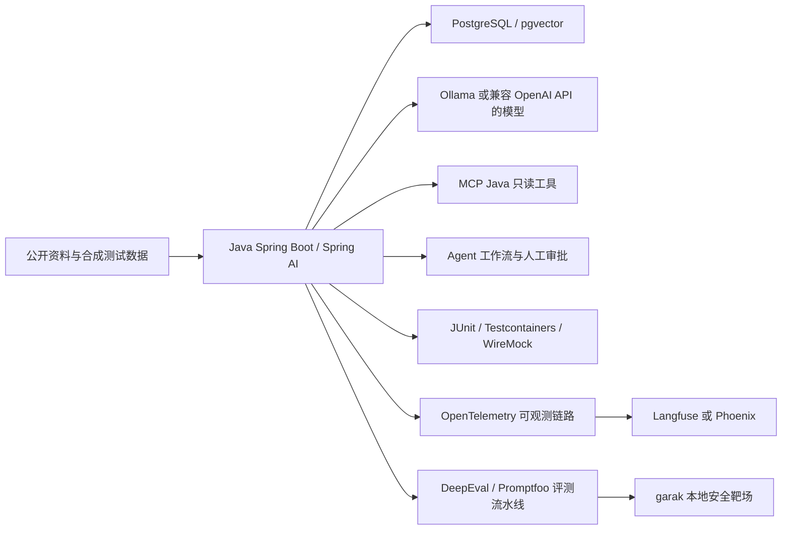

# 开源项目学习地图

> 核对日期：2026-07-27  
> 适用人群：希望从软件测试、自动化测试或测试开发转向人工智能应用开发、Agent 开发的学习者。  
## 一、先看结论

测试工程师转向人工智能开发，最有优势的方向不是从头训练大模型，而是把现有的接口测试、自动化、性能、安全和质量治理能力迁移到人工智能应用工程中。

建议采用两条互补路线：

1. **Java 人工智能应用主线**
   - Java 17 或 Java 21。
   - Spring Boot。
   - Spring AI。
   - PostgreSQL 与 pgvector。
   - Ollama 或兼容 OpenAI API 的模型服务。
   - 官方 MCP Java SDK。
   - Spring AI Alibaba Agent Framework。
   - JUnit 5、Testcontainers、WireMock。
   - OpenTelemetry、Langfuse 或 Phoenix。
2. **Python Agent 与评测补充线**
   - Python 只承担 Agent 原型、人工智能评测和安全测试。
   - LangGraph 或 OpenAI Agents SDK 用于理解行业通用 Agent 模式。
   - DeepEval、Promptfoo、garak 用于质量和安全回归。
   - 不重复建设第二套完整后端。

推荐的一套个人项目组合如下：

## 二、项目分层规则

| 层级 | 含义 | 学习要求 |
| --- | --- | --- |
| 主线 | 能直接构成完整 Java 人工智能应用，且与测试能力衔接紧密 | 必须完成最小练习并写自动化测试 |
| 备选 | 与主线存在替代关系，或用于理解另一种产品和技术路线 | 按实际岗位与项目需求二选一 |
| 延后 | 有价值但复杂、资源要求高，或当前维护状态不适合新项目 | 完成主线毕业项目后再学 |

选择项目时不以 GitHub Star 数量作为唯一标准，而同时考虑：

- 官方仓库是否归档。
- 最近是否仍有提交、版本发布或文档维护。
- 是否有明确的稳定版本、升级说明和测试。
- 是否能形成可验证的个人项目。
- 是否存在许可证、商用、自托管或企业版边界。
- 是否能安全地使用公开或合成数据练习。

## 三、Java 人工智能开发主线

### 3.1 主线项目完整矩阵

| 项目 | 主要用途 | 建议阶段 | 最小练习 | 主要风险与不要做的事 | 许可证与版本注意 |
| --- | --- | --- | --- | --- | --- |
| [Spring AI](https://github.com/spring-projects/spring-ai) / [官方示例](https://github.com/spring-projects/spring-ai-examples) / [官方文档](https://docs.spring.io/spring-ai/reference/) | Java 人工智能应用主框架，覆盖模型调用、流式响应、结构化输出、记忆、RAG、工具调用与 MCP | 第 5 至 10 周 | 使用 Spring Boot 开发 `/聊天` 与 `/缺陷分析` 接口；把模型输出映射为 Java 对象；覆盖超时、限流、坏 JSON、断流和错误码 | 不要同时跟随两个大版本的示例；不要只会注解而不理解 HTTP、消息、上下文、token、超时和重试 | Apache-2.0，见[许可证](https://github.com/spring-projects/spring-ai/blob/main/LICENSE.txt)。官方仓库当前说明：Spring AI 2.x 主线对应 Spring Boot 4.x，Spring AI 1.1.x 对应 Spring Boot 3.5.x。初学项目建议选稳定线并使用 BOM 锁定依赖 |
| [Spring AI Alibaba](https://github.com/alibaba/spring-ai-alibaba) / [官方示例](https://github.com/spring-ai-alibaba/examples) | Java Agent、Graph、顺序、并行、路由、循环、人工参与、MCP 与 A2A 集成 | 第 15 至 18 周 | 实现“公开缺陷分诊 Agent”：分类、检索公开规范、生成建议、人工批准、写入模拟工单 | 不要一开始就做多 Agent；不要把云厂商集成与通用 Agent 原理混在一起；严禁直接连接真实公司工单和数据 | 主项目 Apache-2.0，但部分子模块含独立许可证说明，见[许可证文件](https://github.com/alibaba/spring-ai-alibaba/blob/main/LICENSE)。必须核对其版本与 Spring AI 版本矩阵，不要混用不兼容的 BOM |
| [官方 MCP Java SDK](https://github.com/modelcontextprotocol/java-sdk) / [MCP 官方文档](https://modelcontextprotocol.io/docs/getting-started/intro) | 实现 MCP Client 与 Server，让 Agent 以标准协议使用工具、资源和提示模板 | 第 13 至 14 周 | 暴露只读的“查询公开测试术语”和“查询合成测试用例”工具；为参数 Schema、超时、取消、错误映射和并发写契约测试 | 初期禁止提供 shell、任意文件、数据库写入和真实外部系统权限；服务描述、参数和返回内容都视为不可信输入 | MIT，见[许可证](https://github.com/modelcontextprotocol/java-sdk/blob/main/LICENSE)。协议与 SDK 仍快速演进，应锁定稳定版本并保存契约测试，升级时先读迁移说明 |
| [pgvector](https://github.com/pgvector/pgvector) | 在 PostgreSQL 中保存向量并完成相似度检索，适合作为第一套 RAG 存储 | 第 9 至 12 周 | 导入 50 篇公开软件测试资料，完成清洗、切块、embedding、top-k 检索、引用和元数据过滤；测 Recall@5 | 不要把“把文本存成向量”当作完整 RAG；先做小数据精确检索，再做近似索引；必须测试跨用户数据隔离 | PostgreSQL License，见[许可证](https://github.com/pgvector/pgvector/blob/master/LICENSE)。固定 PostgreSQL、扩展和镜像版本，升级索引前先做备份与回归 |
| [Ollama](https://github.com/ollama/ollama) / [官方文档](https://docs.ollama.com/) | 在个人电脑快速运行开放模型，通过 HTTP 接入 Spring AI | 第 5 至 8 周 | 本地运行一个小型对话模型和 embedding 模型；同一 Java 接口可在 WireMock、Ollama 和云端模型之间切换 | 本地跑通不代表生产容量；不要先钻研量化内核；不要下载来源和许可证不清楚的模型 | MIT，见[许可证](https://github.com/ollama/ollama/blob/main/LICENSE)。框架许可证不等于模型许可证，每个模型的使用范围、训练数据声明和分发条件要单独核对 |
| [Testcontainers Java](https://github.com/testcontainers/testcontainers-java) / [官方文档](https://java.testcontainers.org/) | JUnit 中启动真实 PostgreSQL、pgvector、Redis、Qdrant 等依赖，复用测试工程师优势 | 第 3 至 4 周并贯穿全程 | JUnit 自动启动 pgvector 容器、执行迁移、导入合成数据、运行检索与隔离测试，结束后自动清理 | 不要依赖 latest 镜像；不要把容器复用配置直接带入 CI；关注 Docker 资源、镜像供应链和并行测试隔离 | MIT，见[许可证](https://github.com/testcontainers/testcontainers-java/blob/main/LICENSE)。2.x 已有 JUnit 4 移除、模块和包名变化，旧教程要先核对 |
| [WireMock](https://github.com/wiremock/wiremock) / [官方文档](https://wiremock.org/docs/) | 模拟模型 HTTP API、SSE 流、429、500、延迟、断流和损坏响应 | 第 3 至 8 周并贯穿全程 | 模拟 `/v1/chat/completions`；验证超时、Retry-After、重试上限、结构化输出失败和敏感字段脱敏 | mock 不能替代少量真实模型契约测试；禁止录制真实密钥、内部提示词和公司请求数据 | Apache-2.0，见[许可证](https://github.com/wiremock/wiremock/blob/master/LICENSE.txt)。固定大版本，升级前检查 Jetty、Java 和扩展兼容性 |
| [DeepEval](https://github.com/confident-ai/deepeval) / [官方文档](https://deepeval.com/docs/getting-started) | pytest 风格的人工智能评测，覆盖 RAG、Agent、工具、多轮、幻觉、JSON 和自定义指标 | 第 11 至 12 周并贯穿全程 | 建立 30 至 50 条公开黄金数据；组合确定性断言、答案相关性、忠实度、召回、工具参数正确性和任务完成度 | LLM-as-a-judge 存在波动、偏差、成本和模型漂移；不能替代人工标注和确定性断言；评测提示词也要版本化 | Apache-2.0，见[许可证](https://github.com/confident-ai/deepeval/blob/main/LICENSE.md)。锁定 Python 依赖、评委模型、temperature 与阈值 |
| [Promptfoo](https://github.com/promptfoo/promptfoo) / [官方文档](https://www.promptfoo.dev/docs/intro/) | YAML 驱动的 prompt、模型、RAG 回归与红队测试，可接 CI | 第 11 至 12 周及第 21 周 | 使用同一黄金集比较 mock、本地和云模型；设置 JSON Schema、关键事实、引用和拒答阈值；仅攻击本地靶场 | 即使评测工具本地运行，所配置的 provider 仍可能收到数据；红队只允许测试自己的或明确授权的目标 | MIT，见[许可证](https://github.com/promptfoo/promptfoo/blob/main/LICENSE)。锁定 npm 版本和配置 Schema；升级后先在合成数据集回归 |
| [OpenTelemetry](https://github.com/open-telemetry/opentelemetry-java) / [官方文档](https://opentelemetry.io/docs/languages/java/) | 为模型、检索、工具和 Agent 状态建立统一 trace、metric 与 log 基础 | 第 19 至 20 周 | 追踪一次完整 RAG 请求，串联 API、embedding、retrieval、LLM 和 MCP tool span；统计 p95、错误率与 token | 不要在 span 中全量记录提示词、文档原文、密钥和用户隐私；必须设计脱敏、采样、访问控制和保留期 | Apache-2.0，见[许可证](https://github.com/open-telemetry/opentelemetry-java/blob/main/LICENSE)。语义约定仍会演进，属性名和导出器版本要锁定 |

### 3.2 Java 主线为什么不同时学习两个框架

Spring AI 与 LangChain4j 都能完成模型调用、RAG、工具和 Agent 集成。

初学阶段同时学习两套框架会造成三个问题：

- 同一概念拥有不同命名和抽象，增加记忆负担。
- 教程依赖版本容易混用。
- 最终只形成多个“Hello World”，没有完整工程。

因此建议：

- Spring Boot 岗位或国内 Java 后端岗位：Spring AI 作为主线。
- Quarkus、Jakarta EE 或希望使用更轻量 Java 库：LangChain4j 可作为备选。
- 完成一个可运行项目后，再用另一个框架重写一个小功能作比较，不重写整个系统。

## 四、Python Agent 补充线

Python 补充线的目的不是让学习者同时转成 Python 后端，而是理解 Agent 领域通用概念，并使用成熟的评测与安全工具。

### 4.1 补充线项目

| 项目 | 主要用途 | 建议阶段 | 最小练习 | 主要风险与不要做的事 | 许可证与版本注意 |
| --- | --- | --- | --- | --- | --- |
| [LangGraph](https://github.com/langchain-ai/langgraph) / [官方文档](https://docs.langchain.com/oss/python/langgraph/overview) | 低层状态图、持久化、暂停恢复、人工参与和长任务 Agent | 第 15 至 18 周 | 实现“合成缺陷分诊状态机”：输入校验、分类、公开知识检索、审批、输出；故障后从 checkpoint 恢复 | 先写确定性图，不要一开始写自由循环或多 Agent 群聊；必须设置步数、时间、token 和工具调用上限 | MIT，见[许可证](https://github.com/langchain-ai/langgraph/blob/main/LICENSE)。LangGraph 开源核心与 LangSmith 商业服务是不同边界，不应把商业部署能力当作开源核心能力 |
| [OpenAI Agents SDK for Python](https://github.com/openai/openai-agents-python) / [官方文档](https://openai.github.io/openai-agents-python/) | 用较少代码理解 Agent、tool、guardrail、handoff、session、HITL 与 tracing | 第 15 至 18 周的备选练习 | 一个 Agent 调用两个只读工具，增加输入输出 guardrail 和一次人工批准，并写 pytest | 不替代 Java 主线；不同模型 provider 的 tool calling 和 structured output 语义不完全一致；trace 可能包含敏感数据 | MIT，见[许可证](https://github.com/openai/openai-agents-python/blob/main/LICENSE)。使用锁文件固定 SDK 与依赖，升级后重跑工具和 guardrail 契约测试 |
| [Microsoft Agent Framework](https://github.com/microsoft/agent-framework) / [官方文档](https://learn.microsoft.com/agent-framework/) | AutoGen 与 Semantic Kernel 经验汇总后的生产型 Python/.NET Agent 框架，支持工作流、MCP、A2A 与可观测 | 完成 LangGraph 或 Java Agent 后作为生态备选 | 按官方入门依次完成单 Agent、tool、session、memory、workflow 和 hosting；只做一个本地只读工具 | 不需要为 Java 主线额外学习完整 .NET；官方集成中仍有 Preview/Experimental 功能，逐项核对状态 | MIT，见[许可证](https://github.com/microsoft/agent-framework/blob/main/LICENSE)。Python、.NET、Go 的发布状态和能力并不完全相同，不能把某语言文档直接套到另一语言 |

### 4.2 AutoGen 维护模式必须明确

[Microsoft AutoGen](https://github.com/microsoft/autogen) 曾是主流多 Agent 框架，但截至本地图核对日，官方仓库已经明确标注：

- AutoGen 进入 **maintenance mode**。
- 不再接收新功能或增强。
- 后续以社区维护、错误修复、安全补丁和文档改进为主。
- 新项目应优先使用 [Microsoft Agent Framework](https://github.com/microsoft/agent-framework)。
- 现有 AutoGen 用户应参考官方迁移说明。

因此 AutoGen 在本学习地图中的定位是：

- 可以阅读其 AgentChat、消息路由和多 Agent 设计，作为历史架构参考。
- 不作为新个人项目的首选框架。
- 不建议投入大量时间学习 AutoGen Studio。
- 不应依据旧版 AutoGen 0.2 教程创建新的长期维护项目。

AutoGen 仓库包含多个许可证文件，使用和再分发前应同时查看：

- [主许可证](https://github.com/microsoft/autogen/blob/main/LICENSE)
- [代码许可证](https://github.com/microsoft/autogen/blob/main/LICENSE-CODE)

## 五、备选项目矩阵

以下项目不是全部都学，而是按岗位、硬件和项目约束选择。

| 项目 | 可替代或补充什么 | 最小练习 | 风险与取舍 | 许可证与版本注意 |
| --- | --- | --- | --- | --- |
| [LangChain4j](https://github.com/langchain4j/langchain4j) / [官方示例](https://github.com/langchain4j/langchain4j-examples) / [官方文档](https://docs.langchain4j.dev/) | Spring AI 的 Java 备选，提供 AI Services、RAG、工具、Agent 与 MCP | 使用同一公开测试知识问答需求做一个小应用，比较接口、测试性和模型切换成本 | 与 Spring AI 二选一主学；部分模块可能是 beta；不要混用两个框架的示例依赖 | Apache-2.0，见[许可证](https://github.com/langchain4j/langchain4j/blob/main/LICENSE)。使用官方 BOM 或统一 dependency management |
| [Qdrant](https://github.com/qdrant/qdrant) / [官方文档](https://qdrant.tech/documentation/) | pgvector 之后的专用向量数据库，支持 dense、sparse、多向量、过滤和混合检索 | 用相同公开数据集对比 pgvector 与 Qdrant 的 Recall@k、p95、过滤正确性和资源占用 | 增加一个分布式服务就增加备份、恢复、监控和一致性成本；不要同时学习多套向量数据库 | Apache-2.0，见[许可证](https://github.com/qdrant/qdrant/blob/dev/LICENSE)。官方开发分支是 `dev`，学习项目应选择稳定 release |
| [Dify](https://github.com/langgenius/dify) / [官方文档](https://docs.dify.ai/) | 用可视化方式理解 Workflow、Chatflow、RAG、tool 与 LLMOps 产品形态 | 用公开合成客服资料建立 Chatflow，导出 DSL，再从 Java 调用发布后的 API | 不要把拖拽等同于工程能力；不要把 Dify 的内部实现当作 Java 主线；自托管也要做安全配置 | **不是纯 Apache-2.0**。采用带附加条件的 Dify Open Source License；多租户服务和前端 Logo/版权存在限制，详见[官方许可证](https://github.com/langgenius/dify/blob/main/LICENSE) |
| [RAGFlow](https://github.com/infiniflow/ragflow) / [官方文档](https://ragflow.io/docs/dev/) | 学习复杂文档解析、切块可视化、引用、重排和 RAG 产品测试 | 使用公开 PDF 建知识库，准备 30 道黄金问题，输出解析、召回、引用和拒答测试报告 | 自托管资源要求较高；官方镜像、CPU 架构和代码执行沙箱要求需先核对；不建议小白先通读全仓代码 | Apache-2.0，见[许可证](https://github.com/infiniflow/ragflow/blob/main/LICENSE)。选择稳定 tag，Docker 文件与镜像版本保持一致 |
| [Langfuse](https://github.com/langfuse/langfuse) / [官方文档](https://langfuse.com/docs) | OpenTelemetry 之后的 trace、prompt、dataset、eval 和 experiment 平台 | 用同一黄金集对两版 prompt 做实验，比较质量、成本和延迟 | 与 Phoenix 二选一；自托管仍需要数据库、备份、鉴权和升级策略；不要把生产 prompt 原样写入 trace | **开源核心为 MIT，但不是整个仓库统一 MIT**。`ee/`、`web/src/ee/`、`worker/src/ee/` 等目录有单独许可，见[官方许可证](https://github.com/langfuse/langfuse/blob/main/LICENSE) |
| [Phoenix](https://github.com/Arize-ai/phoenix) / [官方文档](https://arize.com/docs/phoenix) | Langfuse 的观测和评测备选，支持 OpenTelemetry、数据集、实验与提示词管理 | 本地追踪 RAG 与 Agent 链路，标记一次失败 retrieval 和一次错误 tool call | 不能在 trace 中保存密钥、隐私和内部数据；如需对外提供托管服务必须先审查许可 | 当前仓库采用 **Elastic License 2.0**，不是宽松型 MIT/Apache；许可证限制将软件作为向第三方提供主要功能的托管或管理服务，详见[官方许可证](https://github.com/Arize-ai/phoenix/blob/main/LICENSE) |
| [LiteLLM](https://github.com/BerriAI/litellm) / [官方文档](https://docs.litellm.ai/) | 多模型 API 网关、虚拟 key、预算、路由、fallback 与日志 | 配置两个测试 provider，注入 429 和超时，验证 fallback、预算、限流与密钥隔离 | 网关会成为关键基础设施；需要高可用、权限、审计、迁移和密钥管理；初学单模型时不必引入 | 社区与企业功能边界会变化，使用前检查[仓库许可证](https://github.com/BerriAI/litellm/blob/main/LICENSE)及官方部署文档；生产使用稳定镜像标签 |
| [Ragas](https://github.com/vibrantlabsai/ragas) / [官方文档](https://docs.ragas.io/) | 专注 RAG 的数据集与评测指标 | 对同一 RAG 数据集计算 context precision、recall、faithfulness 等指标 | 若 DeepEval 已覆盖当前需要，不必重复引入；LLM judge 仍需稳定性和成本治理 | Apache-2.0，见[许可证](https://github.com/vibrantlabsai/ragas/blob/main/LICENSE)。仓库组织名发生过变化，依赖和链接应以当前官方仓库为准 |
| [Guardrails AI](https://github.com/guardrails-ai/guardrails) / [官方文档](https://www.guardrailsai.com/docs) | 输入输出 validator、风险检查和结构化数据 | 给公开文本分类接口增加 PII、格式和 schema 校验，并验证失败策略 | Java 主线优先使用 Java Bean Validation、JSON Schema 和明确业务代码；不要把所有校验外包给模型或 validator | Apache-2.0，见[许可证](https://github.com/guardrails-ai/guardrails/blob/main/LICENSE)。Hub 中第三方 validator 还需单独审查来源和许可证 |

## 六、延后学习项目

### 6.1 延后矩阵

| 项目 | 为什么有价值 | 为什么延后 | 完成主线后的最小练习 | 许可证与版本注意 |
| --- | --- | --- | --- | --- |
| [A2A 协议](https://github.com/a2aproject/A2A) / [A2A Java SDK](https://github.com/a2aproject/a2a-java) / [官方样例](https://github.com/a2aproject/a2a-samples) | 用开放协议让独立 Agent 发现能力、委派长任务并交换结构化结果 | 单 Agent 和 MCP 尚未掌握时，多 Agent 只会放大调试、安全和成本问题 | 运行 Hello World Agent；校验 Agent Card；两个本地 Agent 完成一次委派；测试超时、重试、状态和不可信返回 | Apache-2.0。协议已进入 1.x，但 SDK 仍持续演进，客户端、服务端和 Agent Card 版本要做兼容测试 |
| [vLLM](https://github.com/vllm-project/vllm) / [官方文档](https://docs.vllm.ai/) | 高吞吐模型推理与 OpenAI-compatible 服务，适合 GPU 服务化 | 对初学者硬件、CUDA、驱动、显存和部署复杂度过高 | 部署一个小模型，用 k6 或 JMeter 测并发、p50、p95、tokens/s、流式取消和 OOM 保护 | Apache-2.0，见[许可证](https://github.com/vllm-project/vllm/blob/main/LICENSE)。模型许可证、驱动、CUDA 和框架版本需联合锁定 |
| [NVIDIA garak](https://github.com/NVIDIA/garak) / [官方文档](https://docs.garak.ai/) | 对模型和对话系统执行注入、泄漏、越狱、幻觉等安全探针 | 需要先有可控本地靶场、授权边界和稳定基线 | 仅对本地 Ollama 或自建 REST 靶场选择 2 至 3 类 probe，记录复现、失败率、修复和回归 | Apache-2.0，见[许可证](https://github.com/NVIDIA/garak/blob/main/LICENSE)。全量扫描成本高且结果有随机性，严禁扫描第三方或公司生产系统 |
| [Microsoft PyRIT](https://github.com/microsoft/PyRIT) / [官方文档](https://microsoft.github.io/PyRIT/) | 更系统地编排生成式人工智能红队、多轮攻击、转换与评分 | 比 Promptfoo 和 garak 更复杂，必须具备安全测试方法、隔离和授权 | 在本地隔离靶场完成一个多轮攻击，定义预算、停止条件、证据、复现和风险报告 | MIT，见[许可证](https://github.com/microsoft/PyRIT/blob/main/LICENSE)。当前官方仓库为 `microsoft/PyRIT`，旧 `Azure/PyRIT` 已归档；攻击数据和有害输出需要受控存储 |
| [AutoGen](https://github.com/microsoft/autogen) | 具有历史价值的事件驱动、多 Agent 和消息路由设计 | 官方已经进入维护模式，新项目应使用 Microsoft Agent Framework | 只读架构和迁移文档；不以 AutoGen Studio 创建毕业项目 | 维护模式下主要接收错误、安全和文档修复；许可证见仓库 `LICENSE` 与 `LICENSE-CODE`，新项目不要按旧 0.2 教程起步 |

### 6.2 MCP 与 A2A 的差异

MCP 与 A2A 解决的不是同一个问题。

| 对比项 | MCP | A2A |
| --- | --- | --- |
| 全称 | Model Context Protocol | Agent2Agent Protocol |
| 主要关系 | Agent 或模型应用与工具、资源、提示模板之间 | 独立 Agent 与独立 Agent 之间 |
| 典型用途 | 查询数据库、调用 API、读取公开资料、执行受控工具 | 能力发现、任务委派、长任务状态、Agent 间协作 |
| 学习顺序 | 先学 | 单 Agent 和 MCP 稳定后再学 |
| 主要风险 | 工具越权、参数注入、命令执行、密钥泄漏、写操作不可逆 | 恶意 Agent Card、跨 Agent prompt injection、身份与信任、任务失控 |
| 初学练习 | 只读查询公开术语和合成用例 | 两个本地 Agent 完成一次受控委派 |

一句话理解：

- MCP 是“Agent 怎样安全使用能力”。
- A2A 是“独立 Agent 怎样互相发现和协作”。

A2A 服务端 Agent 内部仍然可能通过 MCP 调用多个工具，两者可以组合，但不能混为一谈。

## 七、二十四周学习映射

每周按 8 至 12 小时设计。全职学习可以压缩，但不应跳过可验证产出。

| 周次 | 主题 | 对应开源项目 | 必须完成的产出 | 验收点 |
| --- | --- | --- | --- | --- |
| 第 1 至 2 周 | Java 与 Web 基础 | Spring Boot 官方生态 | Java 17/21 项目、REST API、统一异常、配置分层、OpenAPI | 能解释 Controller、Service、Repository；没有硬编码密钥 |
| 第 3 至 4 周 | 开发测试底座 | Testcontainers、WireMock | PostgreSQL 集成测试；模拟模型 API 的正常、429、500、延迟和坏 JSON | 测试可重复、自动清理、失败原因清晰 |
| 第 5 至 6 周 | 模型调用基础 | Spring AI、Ollama | `/聊天` 接口、流式输出、模型切换、超时和日志脱敏 | 本地模型和 mock 均可运行；异常有稳定错误码 |
| 第 7 至 8 周 | 结构化人工智能功能 | Spring AI、WireMock | `/缺陷分析` 接口，将公开合成缺陷描述转换成 Java 对象 | JSON Schema 或 Java 校验生效；损坏输出有降级策略 |
| 第 9 至 10 周 | RAG 数据链路 | pgvector、Testcontainers | 公开文档清洗、切块、embedding、入库、检索和引用 | 可复现数据版本；跨用户过滤测试通过 |
| 第 11 至 12 周 | RAG 质量评测 | DeepEval、Promptfoo、可选 Ragas | 30 至 50 条黄金集，包含正常、无答案、冲突、注入和边界问题 | 有 Recall@5、引用正确率、忠实度、拒答率和回归阈值 |
| 第 13 至 14 周 | MCP 工具开发 | MCP Java SDK | 两个只读工具、Client、Server、Schema 和契约测试 | 超时、取消、并发、坏参数、不可信结果均有测试 |
| 第 15 至 16 周 | 单 Agent 与状态图 | Spring AI Alibaba；可补 LangGraph | 分类、检索、生成建议的确定性 Agent 工作流 | 有最大步数、token、时间和工具调用上限 |
| 第 17 至 18 周 | 人工审批与失败恢复 | Spring AI Alibaba、LangGraph | 人工批准后才允许写入内存模拟工单；checkpoint 恢复 | 拒绝、超时、重复请求、恢复和幂等测试通过 |
| 第 19 至 20 周 | 可观测与实验 | OpenTelemetry；Langfuse 或 Phoenix 二选一 | 完整 trace、指标面板、两版 prompt 实验 | 可定位慢 retrieval、错误 tool call；trace 已脱敏 |
| 第 21 周 | 人工智能安全 | Promptfoo、garak | 仅对本地靶场进行 prompt injection、数据泄漏和工具越权测试 | 有授权边界、攻击证据、修复、回归和剩余风险 |
| 第 22 周 | 部署与模型网关 | Docker Compose；按需 LiteLLM | 本地一键启动应用、数据库、模型和观测；健康检查 | 密钥不进仓库；依赖有版本；失败服务可诊断 |
| 第 23 周 | 性能与韧性 | JMeter 或 k6、WireMock、OpenTelemetry | 并发、p95、限流、超时、断流、重试风暴和资源保护测试 | 报告包含容量、瓶颈、降级和风险，不只写 TPS |
| 第 24 周 | 毕业项目与面试材料 | 综合使用主线项目 | README、架构图、接口文档、测试报告、评测报告、安全报告和演示 | 陌生人能按文档运行；每项指标可复现；不含敏感资料 |

## 八、毕业项目：公开软件测试知识助手与缺陷分诊 Agent

### 8.1 业务范围

项目只使用：

- 公开软件测试标准和开源项目文档。
- 自己编写的通用教程。
- 合成的缺陷、测试用例、工单和用户。
- 公开演示应用产生的数据。

项目不连接：

- 任何公司内网。
- 任何真实公司工单系统。
- 任何公司数据库、日志、接口、截图或需求文档。
- 任何真实客户、员工、设备或账号数据。

### 8.2 功能迭代

1. 普通聊天与结构化缺陷分析。
2. 基于公开资料的 RAG 问答，必须返回引用。
3. MCP 只读工具：查询术语、查询公开规范、查询合成测试用例。
4. 确定性 Agent 工作流：分类、检索、证据检查、建议、人工批准。
5. 人工批准后写入内存或本地临时数据库中的模拟工单。
6. 完整评测、观测、安全和性能流水线。

### 8.3 必须度量的指标

| 类别 | 指标示例 |
| --- | --- |
| RAG | Recall@5、引用正确率、无答案拒答率、冲突资料处理率 |
| Agent | 任务完成率、正确工具选择率、参数正确率、平均步骤数、超限终止率 |
| 接口 | 成功率、错误码一致性、p50、p95、超时率 |
| 成本 | 每请求 token、每任务模型调用次数、评测成本 |
| 安全 | 注入攻击阻断率、越权工具调用阻断率、敏感数据泄漏数 |
| 可观测 | trace 覆盖率、错误定位时间、脱敏检查通过率 |

## 九、许可证与版本治理清单

开源不等于可以忽略许可证，也不等于所有功能都可自由商用。

每引入一个项目，至少记录：

- 项目名称与官方仓库。
- 使用的 tag、commit 或依赖版本。
- 许可证名称与许可证文件链接。
- 是否存在企业版、`ee` 目录、插件市场或商业镜像。
- 是否允许修改、再分发、SaaS、自托管和多租户。
- 是否带有 NOTICE、商标、Logo 或版权展示要求。
- 依赖的模型、数据集和插件是否另有许可证。

必须特别记住：

1. **Spring AI 版本线**
   - 2.x 主线与 Spring Boot 4.x 对齐。
   - 1.1.x 与 Spring Boot 3.5.x 对齐。
   - 不复制版本不匹配的教程代码。
   - 使用 BOM、lockfile 和依赖更新测试。
2. **Dify**
   - 使用带附加条件的 Dify Open Source License。
   - 多租户服务与前端 Logo、版权存在明确限制。
   - 商业使用前必须读当前 LICENSE，不能只看“基于 Apache 2.0”。
3. **Langfuse**
   - 开源核心为 MIT。
   - `ee/`、`web/src/ee/`、`worker/src/ee/` 等企业目录另有许可证。
   - 不能假设仓库中的每个文件都属于 MIT。
4. **Phoenix**
   - 当前为 Elastic License 2.0。
   - 对将主要功能作为第三方托管或管理服务存在限制。
5. **AutoGen**
   - 官方已标记 maintenance mode。
   - 新项目优先 Microsoft Agent Framework。

本节不是法律意见。正式商用、再分发、SaaS 或多租户部署前，应由有资质人员审查当时的最新许可证。

## 十、活跃性快照口径

### 10.1 核对方法

本地图以 2026-07-27 为快照日期，使用以下公开信号判断“主流且活跃”：

- 官方 GitHub 仓库没有标记 archived。
- 最近十二个月存在维护提交、release、迁移说明或官方文档更新。
- 有可运行示例、测试、Issue 或 Discussion。
- 项目仍能与当前模型、协议或 Java/Python 版本集成。
- 许可证和维护状态可以从官方渠道核对。

### 10.2 代表性快照

以下只用于说明核对口径，不应当写死为项目依赖：

- [LangGraph](https://github.com/langchain-ai/langgraph) 在核对日前仍有近期提交。
- [Spring AI](https://github.com/spring-projects/spring-ai) 同时维护稳定分支与 2.x 里程碑版本，必须区分 Spring Boot 兼容线。
- [LangChain4j](https://github.com/langchain4j/langchain4j) 在 2026 年仍持续发布 1.x 版本。
- [RAGFlow](https://github.com/infiniflow/ragflow) 在 2026 年仍持续发布 0.2x 版本。
- [vLLM](https://github.com/vllm-project/vllm) 在 2026 年仍保持频繁 release。
- [Langfuse](https://github.com/langfuse/langfuse)、[Phoenix](https://github.com/Arize-ai/phoenix) 在 2026 年仍持续维护。
- [Testcontainers Java](https://github.com/testcontainers/testcontainers-java) 已进入 2.x，需要警惕旧教程的包名与 JUnit 4 用法。
- [Microsoft Agent Framework](https://github.com/microsoft/agent-framework) 在 2026 年持续发布 Python 与 .NET 版本。
- [AutoGen](https://github.com/microsoft/autogen) 虽然仓库仍可用，但官方已明确进入维护模式，所以归入“延后与迁移参考”，不归入新项目主线。

### 10.3 使用快照的正确方式

- 文档中的版本号是调研证据，不是永远正确的安装命令。
- 实际创建项目时选择当时的稳定版本。
- 在 Maven、Gradle、Python 和 npm 中锁定版本。
- 升级前阅读 release notes、migration guide 和许可证变化。
- 升级后重新执行接口、工具、RAG、Agent、评测、安全和性能回归。

## 十一、暂时不要学的内容

在完成主线毕业项目前，以下内容应延后：

- 从零预训练大模型。
- 分布式训练与 CUDA kernel。
- 同时学习五个 Agent 框架。
- 同时部署五个向量数据库。
- 无最大步数和预算的自主 Agent 循环。
- 允许 Agent 任意执行 shell、浏览本机目录或修改真实系统。
- 为了演示而搭建没有测试、没有指标的多 Agent 群聊。
- 只研究提示词技巧，不研究数据、评测、观测、错误处理和安全。
- 只看 Dify 或 RAGFlow 界面，不理解其 API、数据链路和失败模式。
- 只依赖 LLM-as-a-judge，不做确定性断言和人工抽检。
- 在未授权渠道处理受限数据。

## 十二、学习完成标准

当学习者能够完成以下事项，才算具备从测试转向人工智能应用开发的完整项目能力：

- 能用 Java 设计和实现有异常治理的人工智能 REST API。
- 能独立实现 RAG 数据链路并用黄金数据评测，而不是凭感觉看回答。
- 能实现只读 MCP 工具、参数 Schema、鉴权边界和契约测试。
- 能实现有上限、有 checkpoint、有人工审批的 Agent 工作流。
- 能使用 WireMock 与 Testcontainers 构造稳定、可重复的测试环境。
- 能说明确定性测试、统计评测和人工评审分别解决什么问题。
- 能使用 OpenTelemetry 定位一次 retrieval 或 tool call 故障。
- 能完成 prompt injection、越权、泄漏、限流、超时和性能测试。
- 能解释 MCP 与 A2A 的差异。
- 能解释 Spring AI、Dify、Langfuse、Phoenix 和 AutoGen 的版本或许可证边界。
- 能确保仓库中只有公开或合成数据，不含任何公司内部内容。
