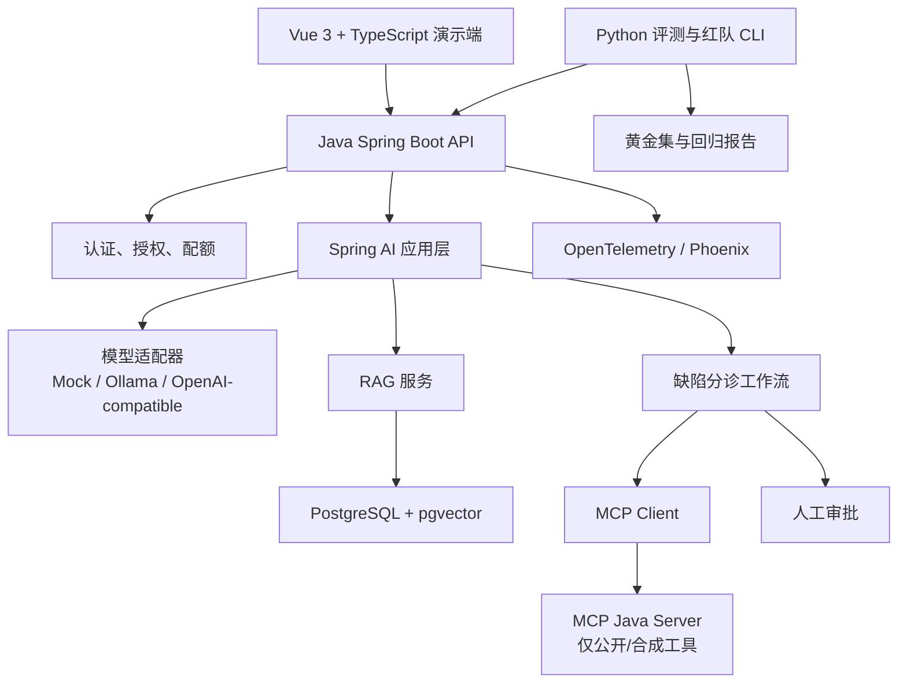
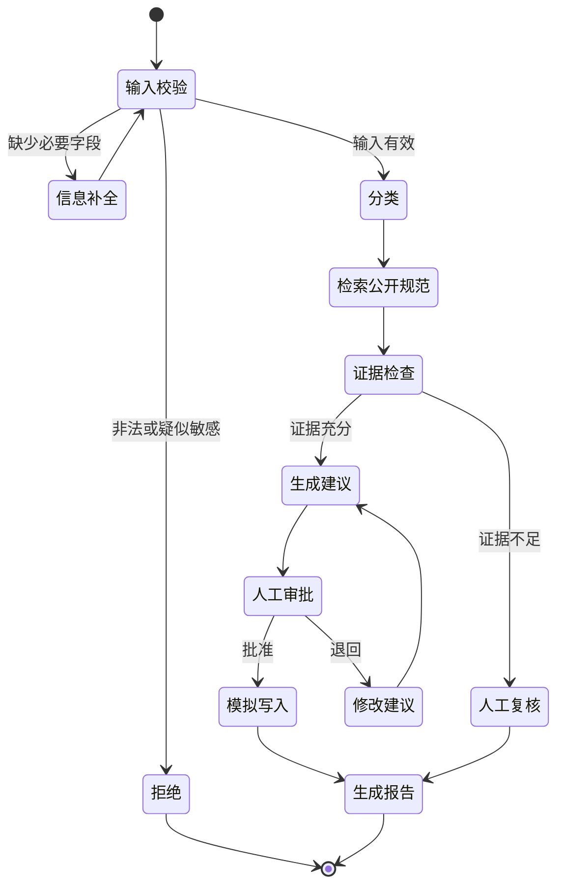

# 毕业项目：公开软件测试知识助手与缺陷分诊 Agent

> 项目性质：个人学习与求职作品
>
## 一、为什么选这个项目

普通聊天机器人很难证明开发深度。这个项目把测试经验转化为 AI 应用开发证据：

- 能理解测试领域，但数据完全公开；
- 有普通后端、RAG、Tool Calling、MCP、Agent 和前端；
- 可以展示单元、集成、契约、AI 评测、安全和性能；
- 可以模拟真实失败而不影响公司或第三方；
- Java 为主、Python 为评测补充，正好对应两条学习路线。

项目名称可以保持：

> **公开软件测试知识助手与缺陷分诊 Agent**

不要把它包装成真实企业平台，也不要伪造用户量、节省工时或线上收益。

## 二、用户故事

### 2.1 学习者

- 我输入一个通用测试问题，系统基于公开资料回答并给出引用；
- 没有足够证据时，系统明确拒答或提示需要补充信息；
- 我粘贴一段虚构需求，系统输出结构化测试点草案；
- 我输入一条合成缺陷，系统建议分类、严重程度和排查路径；
- 我可以查看回答用了哪些公开文档、调用了哪些工具、花了多长时间。

### 2.2 审核者

- 我可以查看 Agent 的每一步状态；
- 写入“模拟工单”前必须由我批准；
- 我可以拒绝、修改或重新执行；
- 我可以看到失败原因、重试次数和最终证据；
- 我可以对结果打标签，沉淀为公开评测集。

### 2.3 维护者

- 我可以导入、更新和删除公开文档；
- 索引版本与原文版本一致；
- 我可以切换 Mock、本地模型和云模型；
- 我可以运行离线回归并比较版本；
- 我可以查看质量、延迟、Token 和错误趋势。

## 三、范围与非目标

### 必做范围

1. 用户与权限；
2. 公开文档知识库；
3. 有引用的 RAG 问答；
4. 结构化测试点生成；
5. 合成缺陷分诊；
6. 只读工具与模拟写工具；
7. 人工审批和恢复；
8. AI 评测、安全回归和可观测性；
9. Docker Compose 与 CI；
10. 演示界面。

### 明确不做

- 不连接公司的 Jira、禅道、飞书、GitLab、数据库或内网；
- 不抓取需要登录或禁止自动访问的网站；
- 不自动攻击、扫描或压测第三方服务；
- 不做无限循环自主 Agent；
- 不让模型直接执行 Shell、任意 SQL 或文件写入；
- 不以微服务数量、Agent 数量或模型大小作为先进性；
- 第一版不做微调、不做自训练模型。

## 四、推荐架构



### 4.1 默认技术栈

| 层 | 主线 | 选择理由 |
|---|---|---|
| 前端 | Vue 3 + TypeScript | 两门课程项目都出现 Web 前端需求，便于演示流式与审批 |
| 后端 | Java 21 + Spring Boot | 先证明通用后端能力 |
| AI | Spring AI 稳定线 | 与 Spring 生态集成，支持模型、RAG、Tool 和 MCP |
| 数据 | PostgreSQL + pgvector | SQL、事务、元数据和向量放在一个可学习系统中 |
| 工具协议 | MCP Java SDK | 训练工具边界、Schema 和兼容测试 |
| 模型 | WireMock → Ollama → 可选云模型 | 先确定性、再本地、最后少量真实契约 |
| 观测 | OpenTelemetry + Phoenix | 追踪模型、检索、工具与 Agent 步骤 |
| AI 评测 | Python + pytest/DeepEval/Promptfoo | 利用测试人员现有能力，独立于生产语言 |
| 集成测试 | JUnit 5 + Testcontainers + WireMock | 真实数据库与可控模型故障 |
| 交付 | Docker Compose + CI | 个人电脑可复现 |

### 4.2 Python 主线替换

若目标岗位是 Python Agent：

- Java API 替换为 FastAPI + Pydantic + SQLAlchemy；
- Agent 图使用 LangGraph；
- MCP 使用官方 Python SDK；
- pytest 同时承担后端和评测；
- 其余领域模型、权限、数据、评测和验收保持不变。

不要同时维护两套完整后端。完成一套后，再用一个小型对照服务展示跨语言能力。

## 五、领域模块

### 5.1 用户与权限

- 用户；
- 角色；
- 配额；
- API Key/Token；
- 数据所有权；
- 工具授权；
- 审批权限；
- 审计事件。

学习版可以只提供“学习者”和“审核者”两个角色，但服务端必须真实检查权限。

### 5.2 公开知识库

- 资料来源；
- 文档；
- 文档版本；
- Chunk；
- Embedding 索引版本；
- 导入任务；
- 删除/重建任务；
- 引用。

每篇资料必须记录公开 URL、标题、许可证/使用说明、获取日期和内容哈希。

### 5.3 对话与生成

- 会话；
- 消息；
- 模型调用；
- Prompt 版本；
- 结构化测试点；
- 回答与引用；
- 用户反馈。

### 5.4 Agent 运行

- 运行；
- 状态；
- 步骤；
- 工具调用；
- 审批；
- 检查点；
- 错误；
- 重试；
- 最终结果。

### 5.5 评测

- 数据集；
- 样本；
- 运行配置；
- 指标；
- 单条结果；
- 人工标签；
- 基线；
- 回归结论。

## 六、API 设计草案

路径使用行业通用英文，文档和业务描述使用中文。

| 方法与路径 | 用途 | 关键约束 |
|---|---|---|
| `POST /api/v1/sessions` | 创建会话 | 认证、配额 |
| `POST /api/v1/sessions/{id}/messages` | 普通/流式问答 | 超时、取消、引用 |
| `POST /api/v1/test-points` | 生成结构化测试点 | JSON Schema、输入长度 |
| `POST /api/v1/defect-runs` | 创建缺陷分诊运行 | 幂等键、合成数据声明 |
| `GET /api/v1/defect-runs/{id}` | 查询状态与步骤 | 资源所有权 |
| `POST /api/v1/defect-runs/{id}/approvals` | 批准/拒绝模拟写入 | 审核者权限、审计 |
| `POST /api/v1/documents` | 导入公开文档 | 来源白名单、文件限制 |
| `DELETE /api/v1/documents/{id}` | 删除原文与索引 | 管理权限、异步状态 |
| `POST /api/v1/evaluations` | 启动评测 | 数据集/配置版本固定 |
| `GET /api/v1/traces/{id}` | 查看脱敏轨迹 | 不返回密钥和敏感正文 |

统一错误示例字段：

```json
{
  "code": "MODEL_RATE_LIMITED",
  "message": "模型服务暂时限流，请稍后重试",
  "traceId": "公开演示随机标识",
  "retryable": true
}
```

错误码至少区分输入、认证、授权、配额、模型、检索、工具、审批、超时和内部错误。

## 七、缺陷分诊状态图



每个节点需要：

- 明确输入/输出 Schema；
- 超时；
- 可重试错误和不可重试错误；
- 最大执行次数；
- 状态持久化；
- Trace；
- 单元测试。

模型不决定真实授权。人工批准也不能绕过服务端权限和参数校验。

## 八、MCP 工具清单

### 8.1 第一阶段只读工具

| 工具 | 输入 | 输出 | 风险控制 |
|---|---|---|---|
| `search_public_test_knowledge` | 关键词、标签、数量 | 公开文档摘要和 URL | 数量/长度上限 |
| `get_test_term` | 术语 | 自编解释和来源 | 只读固定语料 |
| `list_synthetic_defects` | 过滤条件 | 合成缺陷 | 分页、无真实数据 |
| `calculate_risk_score` | 影响、概率、可检测性 | 计算结果与公式 | 确定性实现 |

### 8.2 后期模拟写工具

| 工具 | 副作用 | 必须保护 |
|---|---|---|
| `create_mock_ticket` | 写入本地模拟工单表 | 人工批准、幂等、审计 |
| `update_mock_ticket_status` | 更新模拟状态 | 所有权、状态机校验 |
| `save_learning_note` | 保存个人学习笔记 | 长度/内容检查、仅本地 |

禁止提供任意 Shell、任意 SQL、任意 URL 请求和任意文件路径工具。

### 8.3 契约测试

对每个工具验证：

- Schema 与实现一致；
- 必填、类型、长度、枚举；
- 未认证、无权限、过期身份；
- 超时、取消、重复调用；
- 错误码和可重试语义；
- 恶意返回内容不会变成下一步高优先级指令；
- SDK/协议升级后的兼容性。

## 九、公开数据方案

可用：

- 本仓库自编的通用教程；
- 官方规范和开源项目 README 的短摘要及链接；
- OWASP、OpenAPI、pytest、Playwright、Appium 等官方文档中许可证允许的内容；
- 使用 Faker/脚本生成的虚构缺陷、用户和执行结果；
- 自己编写的问答与测试用例。

每个数据源建立清单：

| 字段 | 含义 |
|---|---|
| `source_id` | 稳定标识 |
| `title` | 标题 |
| `url` | 公开来源 |
| `license_note` | 许可证/引用边界 |
| `fetched_at` | 获取日期 |
| `content_hash` | 内容哈希 |
| `allowed_usage` | 允许的学习用途 |
| `review_status` | 人工审核状态 |

不要默认把整个网页、仓库或 PDF 复制进向量库；优先保存自己的摘要、必要短引文和原始链接。

## 十、测试与评测矩阵

### 10.1 确定性测试

- 输入 Schema；
- 权限和资源所有权；
- Chunk、去重、版本和删除；
- Prompt 模板变量；
- 预算和最大步数；
- 状态转换；
- 工具参数；
- 幂等；
- 错误映射；
- 脱敏规则。

### 10.2 RAG 评测

- 文档可检索性；
- Recall@k；
- Metadata Filter 正确率；
- 引用是否指向真实公开来源；
- 回答是否由上下文支持；
- 无答案/冲突资料的拒答；
- 文档更新和删除；
- 恶意文档的间接 Prompt Injection。

### 10.3 Agent 评测

- 任务完成；
- 选择正确工具；
- 参数正确；
- 步数与循环上限；
- 失败后恢复；
- 需要写入时是否停在审批；
- 审批拒绝后无副作用；
- 重复请求不重复创建；
- 越权工具不可调用。

### 10.4 指标阈值如何设

第一轮先建立人工审核基线，不凭空制定“行业标准”。门禁分三类：

1. **硬门禁**：越权、密钥泄露、未审批写入、Schema 破坏必须为零；
2. **相对门禁**：新版本不能明显低于已确认基线；
3. **目标门禁**：Recall@k、任务成功率、p95 和成本由当前公开数据集与本机环境逐步提高。

报告必须写明模型、数据集、Prompt、代码、环境和日期。

## 十一、故障注入

使用 WireMock、Stub 或本地代理制造：

- 429 + `Retry-After`；
- 500/502/503；
- 连接超时、读取超时；
- SSE 半途断开；
- 非法 JSON/不符合 Schema；
- 空回答和超长回答；
- Embedding 维度不一致；
- 向量库不可用；
- 工具返回恶意指令；
- 工具执行成功但响应丢失；
- 审批过程中服务重启；
- Agent 尝试超过最大步数。

每个故障记录：

```text
假设 → 注入方法 → 预期保护 → 实际证据 → 根因 → 修复 → 回归用例
```

## 十二、安全设计

### 12.1 信任边界

不可信输入：

- 用户文本和文件；
- 检索文档；
- 模型输出；
- MCP Tool Schema 和结果；
- 外部 Agent/Provider；
- 前端传来的身份、角色和审批结果。

可信决策必须在自己的服务端代码中执行。

### 12.2 必做控制

- 文件类型、大小、压缩炸弹和解析超时；
- URL 来源白名单，默认不做任意网络抓取；
- Prompt/文档与系统指令清晰分隔；
- 工具白名单和服务端授权；
- 写工具人工批准；
- 输出 Schema 和内容安全校验；
- 最大 Token、步骤、时间和金额；
- 密钥管理、日志脱敏、Trace 保留期；
- 依赖扫描和固定版本；
- 只对自有本地环境进行红队。

## 十三、可观测性

一次运行至少展示：

- 总耗时；
- 模型耗时和 Token；
- Embedding 和检索耗时；
- 返回 Chunk ID 和分数；
- Tool 名、授权结果和耗时；
- Agent 节点、状态和重试；
- 审批等待时间；
- 错误分类；
- 评测结果；
- 代码、Prompt、模型、知识库版本。

Prompt、Completion、Chunk 正文默认不进入普通日志。调试模式也只用于公开/合成数据，并有显式开关和过期清理。

## 十四、分阶段交付

### M0：项目设计

产出：

- 目标/非目标；
- 架构图；
- 威胁模型；
- 数据来源清单；
- API 草案；
- 评测计划。

### M1：普通后端

产出用户、权限、合成缺陷 CRUD、迁移、测试、Docker。此时不接模型。

### M2：模型基础

接 WireMock 和一个本地模型，完成结构化测试点、流式、超时和错误映射。

### M3：RAG

完成公开文档 ETL、pgvector、引用、拒答和索引更新。

### M4：评测

建立 30～50 条黄金集，运行检索/生成分层报告。

### M5：工具与 MCP

实现四个只读工具及完整契约测试。

### M6：受控 Agent

完成状态图、检查点、审批、模拟写入和恢复。

### M7：安全、观测和性能

完成攻击回归、Trace、仪表盘、负载与成本报告。

### M8：作品集

补齐一键运行、演示视频、架构决策、故障复盘、已知限制和路线回顾。

## 十五、建议仓库结构

真正开始编码时可在 `labs/` 下创建独立工程；固定工具文件名可保留行业约定，其余文件继续使用中文：

```text
智能测试助手/
├── README.md
├── 后端服务/
├── 前端界面/
├── 智能体工具服务/
├── 评测与安全/
├── 公开数据/
├── 合成数据/
├── 部署/
├── 架构决策/
└── 测试报告/
```

Maven/Gradle、Python 包、Node 和 Docker 要求的固定文件名属于工具约定，不要为了中文命名破坏构建。

## 十六、最终验收

项目完成时，陌生人应能：

1. 阅读 README 理解边界；
2. 用一条 Compose 命令启动；
3. 不配置云 Key 也能用 Mock 跑测试；
4. 导入一份公开样例并获得带引用回答；
5. 运行缺陷分诊，在模拟写入前看到审批；
6. 主动触发 429、超时和注入用例；
7. 查看 Trace 与评测报告；
8. 确认仓库没有公司内容或真实凭据；
9. 看到已知限制，而不是营销文案；
10. 复现你简历中写出的每一个指标。

