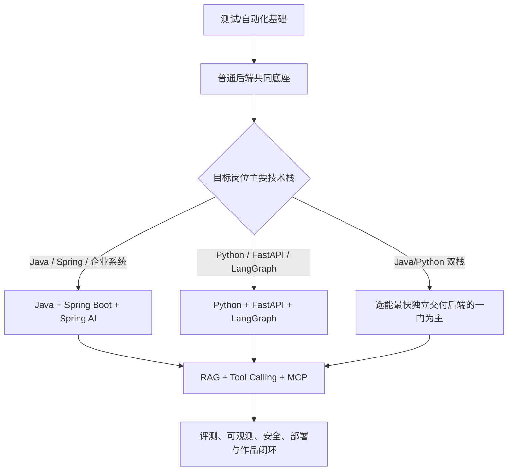

# 测试转人工智能应用与智能体开发

> 内容核对日期：**2026-07-27**

这个模块服务于已经从事软件测试、自动化测试或测试开发，希望未来转到下列岗位的学习者：

- Java 后端开发工程师（AI 应用方向）；
- 大模型应用开发工程师；
- RAG 应用开发工程师；
- Agent / 智能体应用开发工程师；
- AI 质量工程与 AI 应用开发交叉岗位。

这里不是把两张课程目录重新排版，也不承诺“学完必定转岗”。模块先核对两门公开课程当前展示的内容，再补齐开发岗位真正需要的后端工程、测试、评测、安全、可观测性和交付能力，最后把知识落实为可运行的公开作品。

## 两门课程如何使用

本模块参考：

- [AI 驱动 Java 全栈学习路线图（2026）](https://www.itszb.com/java)；
- [AI 大模型 Agent 智能体开发就业班](https://www.itszb.com/agent)。

课程页用于提供“待核对的大纲”，不是唯一依据。页面中的效率、薪资、就业和“精通”等宣传不作为市场事实；公开页面未展示的课时、代码、服务、项目验收和内部资料也不做推测。

截至核对日：

- Java 课程的实际主线是 JavaSE、数据库、前端、Spring、Spring AI、LangChain4j、微服务与项目；
- Agent 课程的实际主线是 Python、数据/机器学习基础、LangChain、LangGraph、MCP、FastAPI、RAG、微调部署和五个项目；
- Agent 页面文案写“六大阶段”，当前可见目录却只有四个编号阶段，本模块按“页面当前可见四阶段”记录；
- 两门课程都有较宽的技术覆盖，但公开目录不足以证明生产级测试、评测、安全、发布和运维闭环已经覆盖，因此这些内容由官方资料和开源实践补齐。

## 推荐结论：先看目标岗位，再选一条主线

2026-07-27 的 BOSS 当前样本同时存在 Python Agent、Java 企业 AI 集成和 Java/Python 双栈岗位，小样本不支持把任一语言写成全市场默认答案。完整来源见[人工智能开发岗位需求调研](11-人工智能开发岗位需求调研.md)。

不要同时深挖 Spring AI、LangChain4j、LangChain、LangGraph、多个向量库和多个低代码平台。先按目标 JD 和已有基础选择：



选择原则：

1. 转开发的首要门槛是能交付普通后端服务，不是会调用模型；
2. 目标 JD 以 Java/Spring、企业系统和后端集成为主时，走 Java 路线；
3. 目标 JD 以 Python、FastAPI、LangGraph 和 Agent 应用为主时，走 Python 路线；
4. 双栈岗位先以自己能独立交付的一门为主，另一门做到能读代码、调接口和写测试；
5. 先做确定性工作流和单 Agent，再做多 Agent；先用一种数据库和向量方案完成闭环，再扩展；
6. 测试背景的差异化要由数据集、断言、故障注入、追踪、安全和持续回归证明。

选择依据和自评表见[转岗定位与路线选择](01-转岗定位与路线选择.md)。

## 内容导航

| 顺序 | 文档 | 解决的问题 | 关键产出 |
|---:|---|---|---|
| 1 | [转岗定位与路线选择](01-转岗定位与路线选择.md) | 转哪类岗位，哪些测试能力能迁移，缺口是什么 | 目标岗位、主线语言、自评结果 |
| 2 | [人工智能应用开发课程拆解与补充](02-人工智能应用开发课程拆解与补充.md) | Java 课程实际讲什么，缺什么 | 课程核对表、补课清单 |
| 3 | [智能体开发课程拆解与补充](03-智能体开发课程拆解与补充.md) | Agent 课程实际讲什么，缺什么 | 四阶段/五项目核对、补课清单 |
| 4 | [共同基础能力学习清单](04-共同基础能力学习清单.md) | 两条路线共同的开发、AI 和生产基础 | 分级能力清单、基础验收 |
| 5 | [开源项目学习地图](05-开源项目学习地图.md) | 每个开源项目学什么、何时学、哪些暂缓 | 主线/备选/延后项目矩阵 |
| 6 | [人工智能应用开发实战路线](06-人工智能应用开发实战路线.md) | 如何从 Java 基础做到生产化 AI 应用 | 七阶段 Java 项目链 |
| 7 | [智能体开发实战路线](07-智能体开发实战路线.md) | 如何从 Python 后端做到可靠 Agent | 分阶段 Agent 项目链 |
| 8 | [智能测试助手综合项目](08-智能测试助手综合项目.md) | 如何把测试经验变成差异化毕业作品 | 可运行系统蓝图与验收矩阵 |
| 9 | [二十四周学习计划](09-二十四周学习计划.md) | 每周学什么、做什么、如何验收 | 24 周周计划和复盘节奏 |
| 10 | [作品集与转岗验收标准](10-作品集与转岗验收标准.md) | 怎样证明自己不是只看完课程 | 作品证据、评分表、演示脚本 |
| 11 | [人工智能开发岗位需求调研](11-人工智能开发岗位需求调研.md) | 公开岗位在要求哪些能力，样本有什么限制 | 岗位—能力—作品映射 |

本模块的第 5 篇负责精简主线；需要横向比较更多 Java/Python AI、RAG、Agent、MCP、模型服务及测试评测项目时，查阅[分类开源项目参考库](../../references/开源项目参考库/README.md)。

## 三条可选路径

### 路径 A：Java AI 应用开发主线

适合：

- 希望进入企业后端或 Java AI 应用岗位；
- Java 基础薄弱，想系统补齐开发能力；
- 当前主要会测试脚本，尚未独立维护过业务服务。

顺序：

```text
Java → Spring Boot → 数据库与鉴权 → 测试工程化
→ 模型 API 与结构化输出 → RAG → Tool Calling/MCP
→ 评测、可观测、安全、部署
```

第一框架选 Spring AI；LangChain4j 用于第二次实现和横向比较，不并行深挖。

### 路径 B：Python Agent 开发主线

适合：

- 已有较扎实 Python 自动化或数据处理经验；
- 目标岗位明确要求 FastAPI、LangChain/LangGraph；
- 已经能独立实现、测试和部署普通 Web API。

顺序：

```text
Python 工程化 → FastAPI/SQLAlchemy → 模型 API
→ RAG → 工具调用/MCP → LangGraph 状态机
→ HITL、恢复、评测、安全、部署
```

低代码 Dify/Coze 用于理解产品形态和快速原型，不替代代码、测试和部署能力。

### 路径 C：AI 质量开发交叉路线

适合：

- 暂不确定是否完全转开发；
- 希望先从 AI 测试、测试平台或质量工程切入；
- 想把现有优势转化为可验证作品。

顺序：

```text
AI 系统分层测试 → 黄金数据集 → RAG/Agent 评测
→ 模型与工具 Mock → 可观测性 → 质量门禁
→ 给开源 AI 应用补测试或开发评测服务
```

配套阅读：[AI 测试总览](../06-AI测试/README.md)。

## 学习纪律

每个主题必须完成六步：

1. 用自己的话解释原理、适用边界和失败模式；
2. 跑通官方最小示例并记录版本；
3. 不照抄示例，加入一个与公开测试学习有关的功能；
4. 主动制造超时、429、坏 JSON、错误检索或越权调用；
5. 增加自动化测试、日志、Trace、指标和回归门禁；
6. 写运行说明、架构图、测试报告、已知限制和复盘。

“能聊天”“页面能打开”“回答看起来不错”都不是完成标准。

## 模块完成标准

完成不是读完文档，而是能提供以下证据：

- 一个普通后端服务：鉴权、数据库迁移、错误模型、测试和 Docker；
- 一个带引用与拒答策略的 RAG 服务；
- 一个工具权限受控、可恢复、有人审的 Agent；
- 一套 30～50 条以上的版本化黄金评测集；
- 确定性测试、模型评分、人工抽检和安全用例；
- 模型、检索、工具的 Trace，以及延迟、质量、成本三维报告；
- 一键启动说明、CI 记录、故障复盘和可复现演示。

通过这些证据后，再决定是否学习微服务、多 Agent、A2A、微调或 GPU 推理服务。
