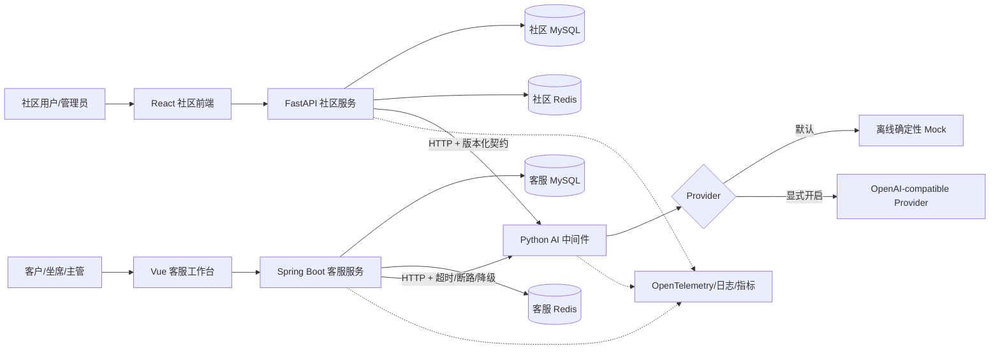

# 复杂系统测试实战

这个目录把仓库从“单一小型演示商城”扩展为两个可以长期演进的完整被测系统：

1. **社区问答系统**：Python + FastAPI + React + MySQL；
2. **企业智能客服系统**：Java + Spring Boot + Vue + MySQL；
3. **统一人工智能中间件**：Python + FastAPI，两个系统都通过 HTTP 契约调用。

`labs/demo-shop` 继续承担入门练习；本目录承担中级到高级的功能、接口、Web、性能、可靠性、安全、AI 评测和测试开发实战。首版先提供可运行骨架和关键业务闭环，后续按阶段持续补全，而不是一开始堆出不可维护的“万能系统”。

## 一、目录

```text
复杂系统测试实战/
├── README.md
├── 系统能力与测试矩阵.md
├── 参考开源项目与架构取舍.md
├── 技术版本基线与升级策略.md
├── 分阶段实现路线.md
├── 当前实现与后续边界.md
├── 一键质量检查.sh
├── 社区问答系统/
│   ├── backend/              # FastAPI
│   ├── frontend/             # React + TypeScript
│   ├── docker-compose.yml
│   └── README.md
├── 企业智能客服系统/
│   ├── backend/              # Spring Boot + Java
│   ├── frontend/             # Vue + TypeScript
│   ├── docker-compose.yml
│   └── README.md
├── 人工智能中间件/
│   ├── src/ai_middleware/    # Python FastAPI
│   ├── tests/
│   └── README.md
└── 共享测试资产/
    ├── README.md
    ├── 系统间接口契约.md
    └── 端到端业务场景.md
```

代码生态强制要求的 `pom.xml`、`package.json`、`Dockerfile`、Python 模块名、Java 类名等保留行业惯用英文；面向学习者的说明文档使用中文。

## 二、总架构

下图是持续演进的**目标架构**。当前版本已经打通两个前端、两个业务后端、社区问答
状态闭环、客服会话到工单链路、写请求幂等、多租户过滤、MySQL 编排和统一 AI HTTP
契约；Redis、消息队列、搜索、对象存储、WebSocket、RAG 与可观测平台仍是后续阶段
的测试建设项，不能把 Compose 中的预留服务当成业务已经接入。



### 为什么不是把 AI 直接写进 Java

- Python 的模型、评测、RAG 和数据生态更完整；
- Java 保持业务、权限、事务、工单和企业集成优势；
- HTTP 边界可以练习契约、超时、重试、断路器和可观测性；
- AI 服务可以独立升级，而核心业务不被模型框架绑定；
- 同一份 AI 契约可被 Python 与 Java 两种后端共同验证。

### 为什么 AI 必须可降级

AI 只能提供建议，不是关键业务的最终真值：

- 社区内容发布不能因为摘要服务故障而丢失；
- 工单创建和状态流转不能因为模型超时而失败；
- 审核、分类和回复建议必须保留人工确认；
- AI 返回需要记录模型/规则版本、耗时、request id 和降级状态；
- 默认离线 Mock 保证没有 API Key 也能学习和测试。

## 三、两个系统分别学习什么

| 系统 | 主要业务能力 | 主要工程能力 | 重点测试能力 |
|---|---|---|---|
| 社区问答系统 | 用户、问题、回答、评论、标签、投票、关注、通知、搜索、举报、审核 | REST、分页、并发计数、缓存、文件、异步任务、内容状态 | 功能模型、API/UI 自动化、权限、幂等、搜索、热点性能、内容安全 |
| 企业智能客服系统 | 租户、客户、会话、消息、工单、队列、坐席、SLA、知识库、审计 | Java 分层、事务、状态机、RBAC、事件、第三方集成、断路降级 | 多租户隔离、状态迁移、并发分配、SLA、契约、故障恢复、审计 |
| AI 中间件 | 审核、摘要、标签、分类、优先级、知识问答、回复建议 | Provider 抽象、版本化 Schema、超时、可观测性、离线替身 | 黄金集、确定性断言、模型评分、稳定性、安全、成本与延迟 |

## 四、建议学习顺序

```text
先运行三个后端的单元/API 测试
→ 启动社区系统，完成问题—回答—投票闭环
→ 启动客服系统，完成工单—分配—处理—关闭闭环
→ 验证两个后端对 AI 中间件的契约
→ 前端分别完成 React 与 Vue 关键旅程
→ 接入 MySQL、Redis 和容器
→ 增加契约、性能、安全、故障和 AI 评测
→ 最后再扩消息队列、搜索、对象存储与可观测平台
```

初学者不要同时启动所有可选基础设施。先使用测试配置和离线 AI Provider，把业务闭环与自动化跑通。

文档统一使用新版 `docker compose` 写法；如果本机只安装了独立的 Compose 可执行文件，可把命令等价替换为 `docker-compose`。先运行 `docker compose version` 或 `docker-compose version` 确认工具，不要同时维护两份编排文件。

两个 Compose 项目的默认宿主机端口已错开：社区后端使用 `8000`，客服 Java
后端使用 `8080`，客服栈内 AI 使用 `8091`，社区可选 AI 使用 `8090`。容器之间仍通过
各自网络内的 `ai-middleware:8000` 调用；“统一”指共用同一份中间件实现和契约，
不是要求两个 Compose 项目共享同一个容器。

## 五、一键执行本地质量检查

已经准备好依赖时，在本目录执行：

```bash
bash ./一键质量检查.sh
```

第一次运行可让脚本严格依据锁文件准备 Python 和前端依赖：

```bash
INSTALL_DEPS=1 bash ./一键质量检查.sh
```

脚本会依次检查社区 Python 后端、统一 AI 中间件、React 前端、Vue 前端、
Spring Boot 后端和两个 Compose 文件。Java 检查要求 JDK 21 或更高版本；macOS
如果已经通过 Homebrew 安装新版 `openjdk`，脚本会在系统默认 Java 版本过低时自动
使用它，但不会修改全局 Java 配置。

## 六、统一质量要求

两个系统新增能力时都要满足：

1. 有需求、角色、状态、权限和风险说明；
2. API 有版本、Schema、错误码、分页和 request id；
3. 正常、边界、异常、并发和恢复路径都有测试；
4. 数据可以一键生成和清理；
5. 日志、截图、Trace、Prompt 默认脱敏；
6. AI 输出有版本、证据、降级状态和人工确认；
7. Docker 镜像、依赖和数据库迁移可固定版本；
8. 公共 Demo 不承担性能、安全和破坏性测试；
9. 每一阶段都有可运行验收，不靠“代码看起来完整”判定完成。

详细覆盖见[系统能力与测试矩阵](系统能力与测试矩阵.md)，当前能运行什么以及仍未实现
什么见[当前实现与后续边界](当前实现与后续边界.md)，实现顺序见
[分阶段实现路线](分阶段实现路线.md)，依赖升级前先看
[技术版本基线与升级策略](技术版本基线与升级策略.md)。

## 七、代码与教程的关系

本目录的系统是“被测对象”，不是替代现有教程：

- 功能测试方法继续放在 `docs/01-功能测试/`；
- API 框架继续放在 `docs/02-接口测试/`；
- Playwright、Appium 继续放在 `docs/03-UI自动化/` 和 `docs/09-自动化实战/`；
- 性能继续放在 `docs/04-性能测试/`；
- AI 评测与安全继续放在 `docs/06-AI测试/`；
- 本目录提供统一、复杂、可持续演进的真实练习目标。
