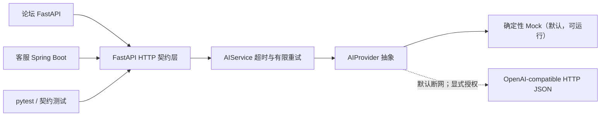

# 人工智能中间件：离线可运行的全链路测试骨架

这是一个面向学习与测试的 Python 3.12 + FastAPI 中间件。它把“论坛内容处理”和
“客服辅助”抽象成稳定的 HTTP 契约，让论坛 FastAPI、客服 Spring Boot 以及自动化测试
都不必直接依赖某个模型厂商。

默认 `mock` Provider 完全离线、无随机数、不读取本机资料、不持久化请求，也不会访问
互联网。OpenAI-compatible 实现也默认断网，必须由使用者显式启用并通过 HTTPS、主机
白名单、模型和密钥校验才会发送当前请求。

## 能学到什么

- 用应用工厂和依赖注入隔离 HTTP 层、业务编排层和 AI Provider。
- 为 AI 能力设计可版本化、可回归的输入输出契约。
- 测试确定性 Mock、超时、有限重试、错误模型、健康检查和就绪检查。
- 实践有依据的知识问答、人工复核、输入控制和防 SSRF 配置。
- 让 Python 与 Java 服务通过普通 JSON/HTTP 协作。

## 能力与路由

| 场景 | 方法与路径 | 说明 |
|---|---|---|
| 存活检查 | `GET /health` | 进程可以响应，不代表 Provider 可服务 |
| 就绪检查 | `GET /ready` | Provider 可处理请求时返回 200，否则返回 503 |
| 内容审核 | `POST /api/v1/moderation` | 输出 allow/review/block、风险分类与分数 |
| 摘要和标签 | `POST /api/v1/content/analyze` | 确定性摘要与标签 |
| 工单分类 | `POST /api/v1/tickets/classify` | 输出分类、P0–P3 和判断依据 |
| 知识问答 | `POST /api/v1/knowledge/answer` | 只从请求携带的合成/公开资料中检索回答 |
| 坐席建议 | `POST /api/v1/agents/reply-suggestions` | 输出必须人工复核的回复草稿 |
| 论坛兼容接口 | `POST /api/v1/forum/summarize` | 兼容 `title/content/answers` 调用 |
| 客服兼容接口 | `POST /api/v1/customer-service/suggest` | 对齐现有 Spring Boot record 的扁平响应 |

完整字段与示例见[接口说明](./接口说明.md)，安全约束见
[安全控制与风险测试](./安全控制与风险测试.md)。

## 五分钟启动

要求 Python 3.12。推荐使用 `uv`：

```bash
cd labs/复杂系统测试实战/人工智能中间件
uv sync --extra test --locked
uv run --frozen uvicorn ai_middleware.app:app --reload --port 8000
```

打开：

- Swagger UI：`http://127.0.0.1:8000/docs`
- OpenAPI：`http://127.0.0.1:8000/openapi.json`
- 健康检查：`http://127.0.0.1:8000/health`

不使用 `uv` 时：

```bash
python3.12 -m venv .venv
. .venv/bin/activate
python -m pip install -e '.[test]'
uvicorn ai_middleware.app:app --reload --port 8000
```

## 第一次调用

```bash
curl -sS http://127.0.0.1:8000/api/v1/forum/summarize \
  -H 'Content-Type: application/json' \
  -H 'X-Request-ID: learning-forum-001' \
  -d '{
    "title": "如何学习接口测试",
    "content": "我正在使用公开演示 API 学习状态码、断言和数据驱动。",
    "answers": ["先覆盖正常、异常和边界场景，再补充契约测试。"]
  }'
```

返回字段至少包含：

```json
{
  "api_version": "v1",
  "request_id": "learning-forum-001",
  "summary": "标题：如何学习接口测试 正文：我正在使用公开演示 API 学习状态码、断言和数据驱动。",
  "risk_hints": [],
  "model": "mock/deterministic-rules@2026.07"
}
```

## 测试

```bash
uv sync --extra test --locked
uv run --frozen pytest
uv run --frozen ruff check src tests
```

测试覆盖：

- 所有必需路由和 OpenAPI 契约；
- 请求 ID 透传与非法请求 ID 替换；
- 内容审核、分类、知识问答和回复建议；
- 论坛 FastAPI 与客服 Spring Boot 兼容响应；
- 422、404、503、504 统一错误结构；
- 临时失败重试、调用超时和不可用 Provider；
- Mock 同输入同输出，以及 OpenAI-compatible 默认断网、显式授权和 MockTransport。

依赖同时包含 `httpx` 与测试专用的 `httpx2`：OpenAI-compatible 运行时使用 `httpx`；
FastAPI 0.140.1 对应的 Starlette 1.3.1 `TestClient` 已优先使用 `httpx2`，缺少它时会
回退到 `httpx` 并给出弃用警告。`httpx2` 只在 `test` extra 中，不进入运行时依赖。

## Docker

```bash
docker build -t learning-ai-middleware .
docker run --rm -p 8000:8000 \
  -e AI_PROVIDER=mock \
  learning-ai-middleware
```

Dockerfile 固定 Python 3.12.13 与 uv 0.11.26，并通过 `uv sync --frozen --no-dev`
严格消费已提交的 `uv.lock`：先缓存运行时依赖，再复制源码安装项目。镜像使用非 root
用户运行。不要把 `.env`、密钥或真实数据复制进镜像。

## 架构



代码职责：

```text
src/ai_middleware/
├── app.py                         # 应用工厂、路由、中间件、错误处理
├── config.py                      # 环境变量和安全校验
├── models.py                      # 严格请求/响应模型
├── service.py                     # 超时、有限重试、Provider 错误映射
└── providers/
    ├── base.py                    # 可注入 Provider 抽象
    ├── mock.py                    # 离线确定性规则
    └── openai_compatible.py       # 默认断网、显式授权、可 MockTransport 测试的兼容实现
```

## 注入自己的测试 Provider

测试或后续实验不需要改路由：

```python
from ai_middleware.app import create_app
from ai_middleware.config import Settings
from ai_middleware.providers.mock import MockProvider


class MySyntheticProvider(MockProvider):
    """只对公开或合成数据做实验。"""


app = create_app(settings=Settings(), provider=MySyntheticProvider())
```

Provider 必须实现审核、摘要、分类、知识问答和回复建议五个异步方法。调用层只会对明确
的临时错误和超时重试，不会对验证错误、永久错误或业务拒绝盲目重试。

## 配置

复制 `.env.example` 后由运行环境显式加载；示例程序不会自行扫描 `.env`。

| 环境变量 | 默认值 | 含义 |
|---|---:|---|
| `AI_PROVIDER` | `mock` | `mock` 或 `openai-compatible` |
| `AI_SERVICE_VERSION` | `0.1.0` | 服务版本 |
| `AI_DEFAULT_TIMEOUT_MS` | `1500` | 每次 Provider 尝试的超时 |
| `AI_DEFAULT_MAX_RETRIES` | `1` | 临时失败后的最大重试次数，0–3 |
| `AI_MAX_INPUT_CHARS` | `10000` | 预留的统一输入限制配置 |
| `AI_OPENAI_BASE_URL` | 官方 HTTPS 地址 | 未来兼容接口地址 |
| `AI_OPENAI_NETWORK_ENABLED` | `false` | 外发总开关；只有显式设为 `true` 才可能联网 |
| `AI_OPENAI_MODEL` | `replace-me` | 兼容端点模型名；联网时不允许占位值 |
| `AI_OPENAI_API_KEY` | 空 | 运行时注入的密钥，绝不写入仓库或日志 |
| `AI_OPENAI_ALLOWED_HOSTS` | `api.openai.com` | 显式主机白名单 |
| `AI_OPENAI_TIMEOUT_MS` | `10000` | 兼容端点 HTTP 超时，100–60000 毫秒 |
| `AI_OPENAI_MAX_OUTPUT_TOKENS` | `1000` | 单次最大输出 token，64–8192 |
| `AI_OPENAI_MAX_RESPONSE_BYTES` | `1000000` | 上游 HTTP 响应大小硬上限 |

只设置 `AI_PROVIDER=openai-compatible` 不会联网：此时 `/ready` 返回 503，推理调用返回
统一的 `provider_unavailable`。确需使用公开模型服务时，还必须显式设置
`AI_OPENAI_NETWORK_ENABLED=true`，在运行环境注入密钥，并把实际 HTTPS 主机列入白名单。
客户端不跟随重定向、不读取系统代理，限制响应体大小；429/5xx 可有限重试，鉴权、契约
或安全错误不会盲目重试。模型输出还会通过 Pydantic 严格校验，知识引用不得指向请求
资料之外的来源，回复草稿始终强制人工复核。

```bash
# 仅示意变量名；不要把真实值写进 .env.example 或提交到 Git。
export AI_PROVIDER=openai-compatible
export AI_OPENAI_NETWORK_ENABLED=true
export AI_OPENAI_BASE_URL=https://your-reviewed-provider.example/v1
export AI_OPENAI_ALLOWED_HOSTS=your-reviewed-provider.example
export AI_OPENAI_MODEL=your-reviewed-model
export AI_OPENAI_API_KEY='从本机密钥管理器或 CI Secret 注入'
```

测试使用 `httpx.MockTransport` 截获全部请求，不会访问公网，覆盖成功响应、限流、重定向、
不受信引用和“配置失败零请求”等安全场景。

## 学习顺序

1. 运行测试，观察 Mock 为什么稳定。
2. 修改一条合成规则，先补测试再改实现。
3. 为两个调用方编写消费者契约测试。
4. 注入“首次失败、第二次成功”的测试 Provider，观察 attempts。
5. 在独立分支设计真实 Provider，但先完成安全、隐私、成本和供应商评审。

本骨架不是生产级内容审核器、法律判断器或自动客服决策系统。任何发布、封禁、退款、
赔偿、安全处置等动作必须由授权人员依据正式制度确认。
