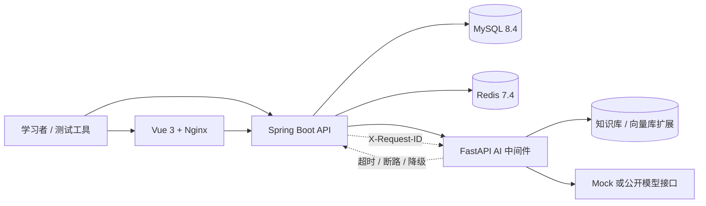

# 企业智能客服系统架构

## 1. 设计目标

系统首先是一套可长期扩展的测试靶场，其次才是业务演示。架构需要同时支持：

- 新手能够用 H2 和 Mock AI 快速启动。
- 接口、UI、性能、安全、可靠性和 AI 测试都有真实业务状态可验证。
- Java 核心业务不依赖某一家大模型，Python 统一承接 AI 变化。
- 所有模块只使用公开合成数据，和公司环境形成硬隔离。

## 2. 组件关系



## 3. 后端分层

```text
web             Controller、请求校验、响应 DTO
service         工单状态机、租户边界、AI 编排
domain          JPA 实体、枚举、审计和乐观锁
repository      只通过 tenantId + 资源 ID 查询业务数据
ai              Java/Python 稳定 HTTP 契约和断路降级
config          H2/MySQL、HTTP 超时、演示数据
common          业务异常和统一错误响应
```

### 租户边界

当前演示通过 `X-Tenant-Code` 解析租户，所有工单、客户、会话和知识查询都会再次带入 `tenantId`。这能练习越权测试，但不等于生产级鉴权。生产版本必须从已验证的 OIDC/JWT 声明解析租户，并在数据库层增加组合唯一约束或行级安全策略。

### 一致性与并发

- 工单与会话使用 JPA `@Version` 乐观锁；状态流转、坐席分配和会话消息必须提交
  `expectedVersion`。
- 会话消息写入额外使用会话行悲观锁，保证同一会话中的消息序号不会并发重复。
- 服务先比对客户端版本，变更后显式 flush，确保响应携带数据库递增后的新版本。
- 过期版本和提交时发生的 JPA 乐观锁冲突统一返回 409 `CONCURRENT_MODIFICATION`。
- 工单状态和状态历史在同一事务提交。
- 坐席变更同时写入 `agent_assignments` 审计表。
- 创建会话、发送消息、改变会话状态和创建工单支持 `Idempotency-Key`；幂等记录与
  业务数据在同一事务提交，同键异内容被明确拒绝。
- 内部备注与状态审计消息标记为 `INTERNAL`；默认详情只读取客户可见消息。
- AI 建议记录在本地，但 AI 失败不回滚核心工单事务。

注意：当前 `AiSuggestionService` 在数据库事务中进行外部 HTTP 请求，是为了让学习代码更直观。生产迭代应采用短事务、Outbox/异步任务和幂等消费，避免长事务占用连接。

## 4. 状态机

| 当前状态 | 允许目标 |
|---|---|
| NEW | TRIAGED、IN_PROGRESS |
| TRIAGED | IN_PROGRESS、WAITING_CUSTOMER |
| IN_PROGRESS | WAITING_CUSTOMER、RESOLVED |
| WAITING_CUSTOMER | IN_PROGRESS、RESOLVED |
| RESOLVED | CLOSED、REOPENED |
| REOPENED | IN_PROGRESS、RESOLVED |
| CLOSED | 无 |

状态机比“任意修改 status 字段”更适合学习等价类、判定表、状态迁移、并发和审计测试。

## 5. AI 边界

Java 只理解稳定的业务 DTO，不直接集成模型 SDK。Python 中间件负责：

1. 输入清洗和敏感信息防护。
2. 检索公开学习知识。
3. 模型/Mock 提供商路由。
4. 结构化输出、风险标记和引用。
5. 离线评测、提示词版本和成本记录。

Java 负责：

1. 只发送当前租户的必要上下文。
2. 只接受 `[A-Za-z0-9._:-]{1,128}` 的请求 ID，否则生成 UUID；同一 canonical
   值写入响应头、错误体和 Python 请求。
3. 配置连接/读取超时与断路器。
4. 对 2xx 响应执行消费者侧必填、枚举、范围和列表契约校验。
5. 对空响应、非法契约、异常和断路状态生成 `degraded=true` 的确定性结果，且不把
   上游内容写入降级原因。
6. 保留建议记录，但禁止自动向客户发送。

## 6. 部署拓扑

本地 Compose 将五类进程拆开：Nginx/Vue、Spring Boot、FastAPI AI、MySQL、Redis。这使学习者可以独立停止 AI、注入网络延迟、重启数据库或扩容后端，观察不同故障对主链路的影响。

生产演进应增加：

- API 网关、OIDC 身份提供方和密钥管理。
- 数据库迁移、备份、读写分离与连接池监控。
- 消息队列、事务 Outbox 和异步通知 Worker。
- OpenTelemetry Collector、指标、日志和告警。
- AI 内容安全、提示注入防护、质量门禁和人工复核队列。

## 7. 安全边界

- 示例域名使用 `.invalid`，不会指向真实收件人。
- 不接受真实密码、验证码、令牌、客户 ID、生产日志和内部知识库。
- `.env` 已被 Git 忽略；`.env.example` 只能放无敏感默认值。
- AI 输入输出都应当按外部不可信数据处理。
- Swagger 和 Actuator 在生产环境需要鉴权或关闭公开访问。
