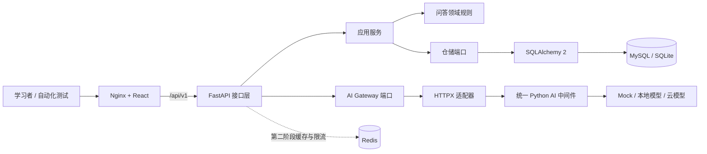
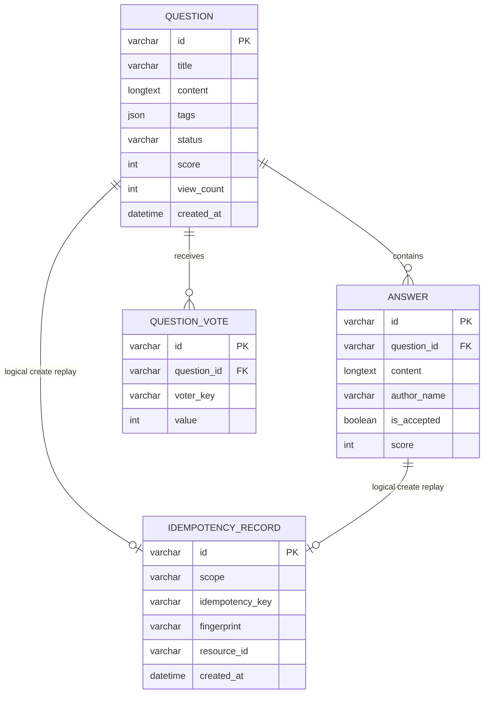

# 社区问答系统架构设计

## 1. 设计目标

该系统既要能运行，也要能持续长成复杂测试靶场：

- 小白可以用 SQLite 和 Mock AI 快速开始；
- 进阶学习者可以切换 MySQL、Redis、真实 AI 和容器网络；
- 业务复杂度来自真实应用场景，而不是无意义堆技术；
- 每层有清晰契约，便于单元、接口、契约、UI、性能和故障测试；
- AI 通过统一中间件隔离，Java 项目也可以复用同一服务；
- 所有默认数据都是公开或合成数据。

## 2. 运行架构



前端只知道 `/api/v1`，Nginx 将请求转发给后端。后端不知道模型厂商，只知道 AI 中间件契约。数据库在本地快速模式使用 SQLite，在 Compose 使用 MySQL。

## 3. 后端分层

| 层 | 目录 | 允许依赖 | 不应承担 |
|---|---|---|---|
| 接口层 | `app/interfaces/api` | FastAPI、应用服务、Schema | SQL 拼接、业务决策 |
| 应用层 | `app/application` | 领域实体与端口 | HTTP、具体数据库 |
| 领域层 | `app/domain` | Python 标准库 | FastAPI、SQLAlchemy、模型厂商 |
| 基础设施层 | `app/infrastructure` | SQLAlchemy、HTTPX、端口定义 | 修改业务规则 |
| 核心横切层 | `app/core` | Settings、错误响应 | 具体领域流程 |

当前仓储使用同步 SQLAlchemy，原因是首阶段更便于小白理解和调试。回答写入、状态
变化、回答采纳和投票聚合会先锁定问题行，避免 MySQL 下的并发状态覆盖或计数丢失。
SQLite 不实现等价的 `SELECT ... FOR UPDATE`，因此并发正确性必须回到 MySQL 验收。
后续压测发现数据库等待成为瓶颈后，可以开一条真实重构任务：迁移 AsyncSession，
并通过回归与性能数据验证收益，而不是为了“看起来高级”提前增加复杂度。

## 4. 核心领域模型



`IDEMPOTENCY_RECORD.resource_id` 是可复用到多种资源的逻辑关联，不建立数据库外键；
因此生产化清理流程还必须检查并处理孤儿记录。

关键约束：

- 一个问题下，同一 `voter_key` 只能有一条投票；
- 投票只能是 `1` 或 `-1`；
- 相同方向重复投票返回 `409 duplicate_vote`；
- 修改投票方向时，分数按差值更新，例如 `1 → -1` 应减少 2；
- 标签去空格、转小写、去重，最多保留 5 个；
- 问题状态只有 `open` 和 `closed`，关闭后新回答返回稳定的 409；
- 同一问题最多一个回答 `is_accepted=true`，切换采纳在一个事务中完成；
- `scope + idempotency_key` 唯一；同键同内容返回原资源，同键异内容返回 409；
- 删除问题时级联删除回答和投票；
- 首期的 `voter_key` 和作者昵称都是合成标识，不是正式身份系统。
- MySQL 的问题与回答正文使用 `LONGTEXT`，SQLite 测试使用方言变体 `TEXT`；
  这可承载接口允许的 20,000 个 Unicode 字符，避免多字节中文或 Emoji 超出
  MySQL 普通 `TEXT` 的 65,535 字节限制。

## 5. API 设计

| 方法 | 路径 | 当前作用 | 重点测试 |
|---|---|---|---|
| GET | `/api/v1/health` | 数据库健康检查、AI 是否已配置 | 数据库中断、响应时间、不得泄露内部地址 |
| GET | `/api/v1/questions` | 分页、关键词、标签查询 | 边界、排序、空结果、注入 |
| POST | `/api/v1/questions` | 创建问题 | 长度、Unicode、标签归一化 |
| GET | `/api/v1/questions/{id}` | 详情和浏览量 | 不存在、并发计数 |
| POST | `/api/v1/questions/{id}/answers` | 创建回答 | 外键、内容边界 |
| PATCH | `/api/v1/questions/{id}/status` | 关闭或重新开放 | 非法状态、重复请求、回答门禁 |
| PUT | `/api/v1/questions/{id}/answers/{answer_id}/acceptance` | 采纳/取消采纳 | 回答归属、单选切换、事务 |
| POST | `/api/v1/questions/{id}/votes` | 投票和改票 | 唯一约束、并发、事务 |
| POST | `/api/v1/questions/{id}/ai-summary` | AI 摘要 | 超时、502、格式、质量、安全 |

分页响应固定包含：

```json
{
  "items": [],
  "page": 1,
  "page_size": 20,
  "total": 0,
  "total_pages": 0
}
```

错误响应固定包含：

```json
{
  "error": {
    "code": "resource_not_found",
    "message": "问题不存在",
    "details": {},
    "request_id": "规范的请求关联标识",
    "trace_id": "用于串联日志的标识"
  }
}
```

稳定的错误码用于断言；中文消息用于用户展示，不建议自动化测试只断言整段消息。
`request_id` 是规范字段，`trace_id` 暂时保持相同值以兼容已有调用方。入口 ID
仅允许 `[A-Za-z0-9._:-]` 且最长 128 字符，非法值换成 UUID；所有成功和受控错误
响应都会返回 `X-Request-ID` 与兼容的 `X-Trace-ID`。

### 5.1 写请求幂等

问题和回答创建接受可选的 `Idempotency-Key`。应用层先对已经去空格、标签小写去重
后的业务载荷做确定性 JSON 序列化，再计算 SHA-256 指纹；基础设施层在同一事务里
写业务行和幂等记录。

- 首次成功：`201`，`Idempotency-Replayed: false`；
- 同键同指纹：不重复写，返回首次资源和 `200`，响应头为 `true`；
- 同键异指纹：`409 idempotency_key_reused`；
- 唯一约束解决两个并发请求同时“查不到记录”的竞态；
- 回答的 scope 包含问题 ID，避免不同问题之间错误重放。

学习版会永久保留幂等记录。正式系统需要根据客户端最长重试窗口设计 TTL 或归档，
同时监控记录量、唯一约束冲突率和孤儿记录。幂等只解决重复写，不代替身份认证、
业务唯一约束或分布式事务。

## 6. AI 边界

AI 不是直接写在问题服务里的一个 SDK 调用。应用层定义 `AIGateway`，基础设施层用 `HttpAIGateway` 实现。这样可以：

- 测试中替换成确定性 Fake；
- 统一超时与上游错误转换；
- 在不改社区代码的情况下切换模型；
- 让 Spring Boot 客服系统复用同一中间件；
- 独立完成 AI 安全、质量、成本、延迟和回归评测。

首期 AI 请求只发送标题、正文、回答文本。未来接真实模型前必须增加：

1. 敏感信息与密钥检测；
2. 最大长度和 Token 预算；
3. 提示词注入防护与输出过滤；
4. 缓存键中包含模型和提示词版本；
5. 质量数据集、基线阈值和人工复核；
6. Trace ID、模型、耗时、Token、错误分类观测；
7. 未经允许不训练、不长期存储请求内容。

论坛正文上限大于 AI 契约，因此 HTTP 适配器只对“发给 AI 的副本”执行确定性预算：
标题最多 300 字符、正文最多 10,000 字符、前 100 条回答每条最多 5,000 字符，
总计最多 20,000 字符。分配顺序为标题、正文前缀、按时间排序的回答前缀，确保
核心问题上下文优先。长度按 Unicode 码点计算。该过程不会写回领域实体或数据库，
所以原帖和回答保持完整。

返回方向同样执行严格消费者契约：顶层只接受对象；摘要、模型标识必须是有界的
非空字符串；风险提示必须是最多 20 项、单项最多 500 字符的纯字符串列表。禁止
将数字等类型隐式转成字符串，也不把缺失模型伪装成 `unknown`。任何不合规 2xx
统一映射成不包含上游原文的 502，避免 AttributeError 演变成论坛自身 500，也避免
畸形或超大模型输出进入前端。

兼容响应的 `api_version` 是必填字段且必须为 `v1`；`request_id` 也必填，并且
必须与 HTTP 客户端本次实际发出的、已校验 canonical ID 完全相同。缺失、错误版本
或 ID 不匹配都按契约故障处理，防止把串线响应、错误版本响应当成本次请求结果。

论坛侧默认 AI 超时为 25 秒，并可由 `AI_TIMEOUT_SECONDS` 覆盖。推导依据是中间件
最多处理 3 块内容，每块包含分析/审核 2 类操作，每次按 1.5 秒、最多 2 次尝试：
`3 × 2 × 1.5 × 2 = 18 秒`；剩余约 7 秒用于网络、连接、序列化和调度余量。
配置校验限制为 `0 < timeout <= 120`。这保证论坛不会用旧的 10 秒预算抢先终止
中间件的合法工作，同时仍通过有限上界防止无限等待。

## 7. 时间语义

应用内所有新时间以 UTC 创建，数据库统一按 UTC 存储。SQLite 和 MySQL 的
`DATETIME` 驱动可能在读取时丢失 `tzinfo`，因此 API Schema 映射边界执行统一规则：

- naive `datetime` 按数据库约定解释为 UTC，而不是服务器本地时区；
- aware `datetime` 使用 `astimezone(UTC)` 转成 UTC；
- 问题列表、问题详情和回答的所有时间均输出带 `Z` 或 `+00:00` 的 ISO 8601。

该规则避免开发机、容器和不同时区部署下出现同一瞬间被解释成不同时间。未来若接入
外部历史数据，必须在导入时明确原时区，不能盲目套用 naive=UTC 约定。

## 8. Redis 演进路线

Redis 当前只完成连接配置和容器编排，建议按以下顺序实装：

1. 问题列表 30 秒只读缓存；
2. 问题变更后精确失效；
3. 浏览量写 Redis、定时合并数据库；
4. 发布和 AI 接口按合成用户限流；
5. AI 摘要按内容哈希、模型、提示词版本缓存；
6. 引入任务队列处理通知和审核。

每一步都应增加缓存命中、失效、过期、击穿、雪崩、脏读和 Redis 故障降级测试。

## 9. 一致性与并发风险

问题关闭/开放和回答采纳会对问题行加 `FOR UPDATE`（SQLite 练习模式由数据库自身
串行写入），避免两个管理操作互相覆盖；幂等记录依靠数据库唯一约束处理并发重放。

投票实现了数据库唯一约束，但仓储内的“读分数 → 修改 → 提交”仍可能在高并发下丢更新。这是刻意保留的进阶测试题：

- 用并发接口测试复现丢更新；
- 比较悲观锁、乐观锁、原子 SQL 更新三种修复；
- 增加死锁重试和事务隔离测试；
- 确认投票记录之和与问题分数一致；
- 使用故障注入验证提交失败不会出现半成功。

正式演进时推荐让投票记录成为事实源，分数作为可重建聚合值，并通过对账任务发现漂移。

## 10. 安全与隐私

- 当前没有正式认证，不能暴露到公网；
- `voter_key` 仅用于本地练习，不能当安全身份；
- 所有输入都应继续进行 XSS、SQL 注入、超长、恶意 Unicode 测试；
- React 默认转义文本，未来增加 Markdown 时必须选择白名单消毒；
- 正式环境要加 OAuth2/OIDC、RBAC、CSRF 策略、速率限制和安全响应头；
- 日志不得记录完整 AI 提示、密码、Token 或真实个人信息；
- 项目内容不得来自公司内网或当前工作资料。

## 11. 可观测性演进

首版使用 `X-Trace-ID` 串联错误响应。推荐后续增加：

- OpenTelemetry HTTP、SQL、AI 中间件链路，并贯通已校验的 `X-Request-ID`；
- Prometheus 请求数、错误率、P50/P95/P99、连接池指标；
- 结构化 JSON 日志和字段脱敏；
- Grafana 面板与服务等级目标；
- 慢查询、AI 超时和投票冲突告警；
- 前端 Web Vitals 与错误上报。

目标不是“接上工具”，而是让一次失败可以从浏览器追到后端、数据库或 AI 上游。

## 12. 可持续扩展原则

- 先写业务规则和验收标准，再扩接口；
- 数据库变化必须新增迁移，不修改已经发布的迁移；
- API 破坏性变更进入新版本路径；
- 外部依赖都通过端口或客户端隔离；
- 每个新能力至少补一个正常流、一个边界、一个失败流；
- 文档明确区分“已实现”和“规划”，避免学习者误判；
- 只使用公开或合成数据，示例密钥必须是无效占位符。
