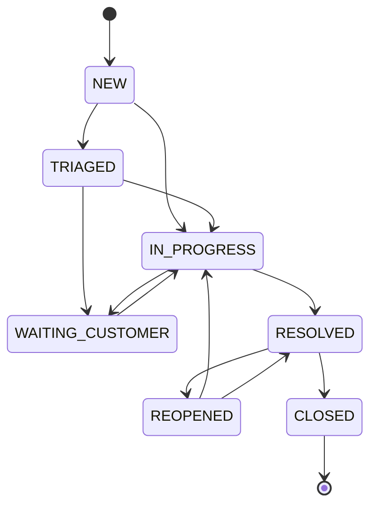

# 系统能力与测试矩阵

这份矩阵定义两个复杂系统最终应覆盖的业务范围。首版不要求所有格子都完成，但目录、接口和数据模型要为后续扩展保留清晰边界。

## 一、社区问答系统

### 角色

| 角色 | 核心权限 | 重点风险 |
|---|---|---|
| 游客 | 浏览、搜索、查看问题和回答 | 未登录越权、隐私字段泄漏 |
| 注册用户 | 发问、回答、评论、投票、收藏、关注 | 重复提交、刷票、恶意内容 |
| 作者 | 编辑自己的内容、接受回答、管理草稿 | 编辑越权、历史版本、并发覆盖 |
| 版主 | 审核、隐藏、恢复、处理举报 | 权限过大、误封、审计缺失 |
| 管理员 | 用户、标签、策略、系统配置 | 高危操作、二次确认、审计 |

### 功能范围

| 领域 | 基础闭环 | 后续增强 | 主要测试 |
|---|---|---|---|
| 账号与身份 | 注册、登录、刷新、退出、个人资料 | 邮箱验证、找回密码、MFA、第三方登录 | 认证、会话、暴力破解、账号枚举 |
| 问题 | 草稿、发布、查看、编辑、关闭 | 版本历史、定时发布、协作编辑 | 必填、长度、XSS、并发编辑、状态迁移 |
| 回答与评论 | 回答、评论、接受回答 | 引用、折叠、编辑历史 | 楼层顺序、删除父节点、权限 |
| 互动 | 赞同/反对、收藏、关注 | 声望、徽章、推荐 | 幂等、重复投票、计数一致性、刷量 |
| 标签与专题 | 标签、筛选、热门 | 同义词、关注标签、专题页 | 多标签组合、重命名、孤儿标签 |
| 搜索 | 标题/正文/标签查询 | 拼写纠正、排序、搜索引擎 | 相关性、分页、特殊字符、权限过滤 |
| 通知 | 回答、评论、@、状态变化 | 邮件、站内订阅、免打扰 | 去重、顺序、已读、重试 |
| 文件 | 头像、问题附件 | 图片处理、病毒扫描、对象存储 | 类型、大小、路径、恶意文件、孤儿清理 |
| 举报与审核 | 举报、人工处理、隐藏/恢复 | AI 预审、申诉、策略版本 | 状态、证据、误杀、审计、越权 |
| AI | 摘要、标签建议、内容风险提示 | 相似问题、推荐、回答辅助 | 黄金集、注入、降级、延迟、版本回归 |

### 关键状态

```text
问题：DRAFT → PUBLISHED → CLOSED
                 ↓          ↑
               HIDDEN → RESTORED

举报：OPEN → REVIEWING → RESOLVED / REJECTED

通知：UNREAD → READ
```

## 二、企业智能客服系统

### 角色

| 角色 | 核心权限 | 重点风险 |
|---|---|---|
| 客户 | 创建会话、发送消息、查询本人工单 | 查看他人数据、附件泄漏 |
| 一线坐席 | 接单、回复、内部备注、转派 | 跨队列访问、误发送内部备注 |
| 主管 | 分配、强制转派、SLA、质检 | 批量操作、权限边界、审计 |
| 知识管理员 | 文章、版本、审核、发布 | 未发布内容被检索、旧版引用 |
| 租户管理员 | 用户、队列、渠道、策略 | 多租户隔离、配置污染 |
| 平台管理员 | 平台运维，不默认读取租户业务 | 超级权限、最小授权、审计 |

### 功能范围

| 领域 | 基础闭环 | 后续增强 | 主要测试 |
|---|---|---|---|
| 租户与权限 | 租户、用户、角色、队列 | 自定义角色、字段级权限 | tenant_id 隔离、缓存键隔离、越权 |
| 客户 | 档案、联系人、标签 | 合并客户、画像、隐私请求 | 重复身份、脱敏、导出/删除 |
| 会话与消息 | 会话、文本消息、内部备注 | WebSocket、邮件/网页渠道、附件 | 顺序、重复、离线重连、内部备注泄漏 |
| 工单 | 创建、详情、分配、状态、优先级 | 自定义字段、父子工单、批量操作 | 状态机、乐观锁、幂等、并发分配 |
| SLA | 首响/解决时限、暂停、超时 | 日历、节假日、分级升级 | 时区、暂停恢复、边界秒、补偿 |
| 知识库 | 草稿、审核、发布、版本 | 分类、权限、失效、反馈 | 发布可见性、版本引用、搜索权限 |
| 自动化 | 规则、标签、路由 | 消息队列、定时任务、工作流 | 重复消费、顺序、死信、补偿 |
| 审计 | 谁在何时改了什么 | 导出、合规保留、异常告警 | 完整性、防篡改、敏感字段 |
| AI | 分类、优先级、摘要、回复建议 | RAG、质检、情绪、自动化草稿 | 幻觉、越权、注入、拒答、人工批准 |

### 工单状态机



必须拒绝的迁移示例：

- `CLOSED → NEW`：关闭后不能偷偷重建生命周期；
- `NEW → CLOSED`：没有处理和解决记录时不允许直接关闭；
- 非当前租户坐席修改状态；
- 过期版本号覆盖新状态；
- 同一幂等键重复创建两张工单。

## 三、统一 AI 质量矩阵

| 能力 | 确定性测试 | 语义/统计测试 | 安全测试 | 故障测试 |
|---|---|---|---|---|
| 内容审核 | Schema、风险标签集合、空文本 | 人工标注准确率、误杀/漏放 | 提示注入、混淆、编码绕过 | 超时、非法 JSON、Provider 失败 |
| 摘要 | 长度、必需字段、引用 id | 事实一致、覆盖重点、稳定性 | 泄漏隐藏内容、恶意指令 | 降级为无摘要、不阻断发布 |
| 标签/分类 | 标签白名单、数量、置信度范围 | F1、混淆矩阵、关键类别召回 | 对抗文本、类别操纵 | 规则降级、版本回退 |
| 知识问答 | 引用存在、权限过滤、无答案格式 | 忠实度、Recall@k、人工偏好 | 文档注入、跨租户检索 | 检索慢、模型限流、部分依赖失败 |
| 回复建议 | 不自动发送、敏感词、模板字段 | 可用率、事实性、语气 | 越权承诺、敏感信息、恶意客户消息 | 明确 degraded，不阻断人工回复 |

## 四、测试分层

| 层级 | 社区系统 | 客服系统 | AI 中间件 | 发布阻断 |
|---|---|---|---|---|
| 单元 | 领域规则、Schema、计数 | 状态机、SLA、权限 | 规则、Provider、评分器 | 是 |
| 组件 | FastAPI + SQLite/容器 | Spring + H2/Mock Server | FastAPI TestClient | 是 |
| 集成 | MySQL、Redis、AI Stub | MySQL、Redis、AI Stub | Provider Stub、知识数据 | 是 |
| 契约 | OpenAPI、错误、分页 | Java Consumer ↔ AI Provider | 兼容两类消费者 | 是 |
| API E2E | 问题到回答 | 工单到关闭 | 真实 HTTP | 核心 smoke 是 |
| Web E2E | React 关键旅程 | Vue 坐席旅程 | 不单独测 UI | 核心 smoke 是 |
| 性能 | 热门列表、发布、投票 | 工单查询、并发分配 | 并发建议、TTFT/总耗时 | 阈值按环境 |
| 安全 | XSS、越权、刷票 | 多租户、RBAC、附件 | 注入、泄漏、越权工具 | 高危是 |
| 可靠性 | Redis/AI 故障 | AI/DB/队列故障 | Provider 限流/超时 | 降级路径是 |

## 五、作品验收证据

每个系统至少保留：

- 一张上下文图和一张状态机；
- OpenAPI/接口契约；
- 合成种子数据；
- 单元、组件、集成、API、UI 测试报告；
- 一次并发或幂等缺陷的复现与修复；
- 一次依赖故障与恢复证据；
- 一份 AI 黄金集、切片报告和人工复核；
- 一份安全边界与残余风险；
- CI 入口、退出码和失败制品。
